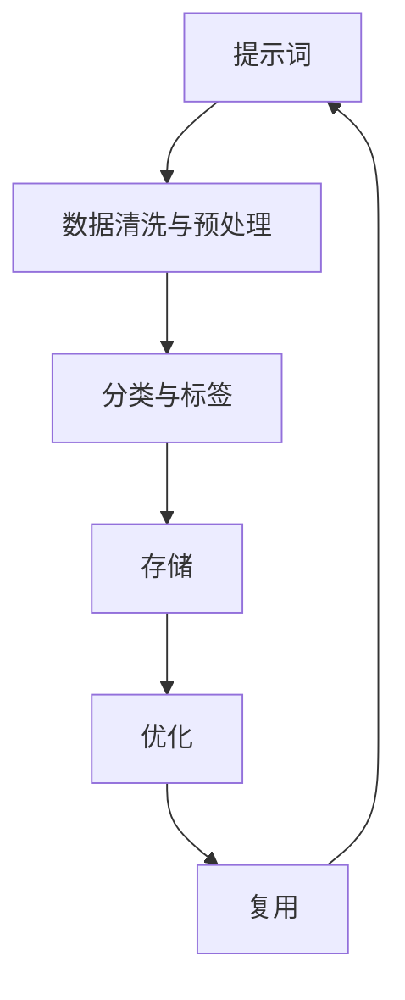

                 

### 背景介绍

在信息技术飞速发展的今天，数据已成为企业和社会的核心资产。数据处理的效率和质量直接影响到各行各业的运营效果和用户体验。其中，提示词库管理作为自然语言处理（NLP）和人工智能（AI）的重要环节，扮演着至关重要的角色。

提示词库管理涉及到数据的收集、清洗、分类、存储、优化、复用等多个方面。其核心目的是确保提示词库能够高效、准确地支持各种自然语言处理应用，如问答系统、搜索引擎、语音助手等。有效的提示词库不仅可以提升系统的响应速度，还能显著提高用户满意度。

然而，随着数据的爆炸式增长，如何高效地组织和复用有效提示词成为一个亟待解决的问题。传统的提示词库管理往往依赖于人工整理和维护，这不仅效率低下，而且难以保证质量。因此，设计一种自动化的、智能化的提示词库管理方案成为当务之急。

本文将围绕《提示词库管理：组织和复用有效提示》这一主题，深入探讨提示词库管理的核心概念、原理和实践。我们将首先介绍提示词库管理的基本概念和作用，然后逐步展开，详细讲解提示词库的构建、存储、优化和复用等各个环节。通过实例和案例，我们将展示如何在实际项目中实现提示词库的管理，并提供一些最佳实践和注意事项。

通过本文的阅读，读者将能够全面了解提示词库管理的原理和方法，掌握有效的提示词库管理技巧，从而为自然语言处理和人工智能应用提供强有力的支持。

### 核心概念与联系

在探讨提示词库管理的过程中，我们需要了解一系列核心概念，并展示这些概念之间的联系，以便读者能够有一个全面的认识。以下是几个关键概念及其相互关系：

#### 提示词

提示词是指能够引导系统理解用户意图或提供相关信息的词汇或短语。提示词的选择和定义是构建高效提示词库的基础。不同类型的自然语言处理应用对提示词的要求不同，如问答系统可能需要更加具体的提示词，而搜索引擎可能需要更广泛、更通用的提示词。

#### 数据清洗与预处理

数据清洗与预处理是指对原始数据进行的一系列处理步骤，包括去除重复项、填充缺失值、去除噪声数据等。这些步骤的目的是确保数据的质量，为后续的处理和分析打下坚实的基础。在提示词库管理中，数据清洗与预处理至关重要，因为高质量的提示词库需要高质量的数据作为支撑。

#### 分类与标签

分类与标签是对提示词进行组织的重要手段。通过对提示词进行分类，可以将相似的提示词归为一类，便于管理和查询。标签则是对提示词进行额外描述的工具，可以帮助系统更好地理解和利用提示词。例如，在问答系统中，可以将问题中的关键词进行分类，并根据分类结果提供相应的答案。

#### 存储

存储是指将处理后的提示词库保存到数据库或其他存储介质中，以便在需要时快速检索和使用。存储方案的选择对提示词库的性能和扩展性有很大影响。常见的存储方案包括关系数据库、NoSQL数据库和分布式存储系统。

#### 优化

优化是指通过各种技术手段提高提示词库的性能和效果。常见的优化方法包括权重分配、聚类分析和提示词更新。权重分配可以根据提示词的重要程度为其分配不同的权重，从而影响系统对提示词的优先级。聚类分析可以帮助发现数据中的潜在模式，进一步优化提示词库。提示词更新则是为了保持提示词库的时效性和准确性。

#### 复用

复用是指在不同应用场景中重复利用提示词库。通过复用，可以避免重复构建和维护提示词库的工作，提高工作效率。复用策略包括共享机制和迁移与适配，前者允许不同系统之间共享提示词库，后者则确保提示词库在不同环境中保持一致性和有效性。

下面是一个使用Mermaid绘制的流程图，展示了这些概念之间的联系：



在这个流程图中，提示词作为起点，经过数据清洗与预处理、分类与标签等步骤，最终存储到数据库中，并不断进行优化和复用。这个过程形成一个闭环，确保了提示词库的持续改进和高效利用。

通过这个流程图，读者可以清晰地看到提示词库管理的基本步骤和关键环节，从而更好地理解整个管理过程。

### 核心算法原理讲解

在提示词库管理中，核心算法的设计与实现是确保系统高效运行的关键。下面，我们将逐一介绍几个关键算法，并使用伪代码对其进行详细讲解，以便读者能够理解其基本思想和操作步骤。

#### 1. 数据清洗与预处理

数据清洗与预处理是构建高质量提示词库的第一步。其主要任务是去除重复项、填充缺失值、去除噪声数据等，确保数据的质量。

**伪代码：**

```python
def data_preprocessing(data):
    # 去除重复项
    unique_data = list(set(data))
    # 填充缺失值
    for item in unique_data:
        if is_missing(item):
            item = fill_missing(item)
    # 去除噪声数据
    clean_data = [item for item in unique_data if not is_noisy(item)]
    return clean_data
```

**详细说明：**
- `data`：表示原始数据列表。
- `unique_data`：通过去重操作，去除数据中的重复项。
- `is_missing(item)`：判断数据项是否存在缺失值。
- `fill_missing(item)`：根据某种策略（如平均值、中值等）填充缺失值。
- `is_noisy(item)`：判断数据项是否为噪声数据。

#### 2. 分类与标签

分类与标签是提示词库管理中的重要环节。其主要任务是按照某种标准将提示词分为不同的类别，并为每个类别分配相应的标签。

**伪代码：**

```python
def classify_and_label(data):
    # 创建分类器
    classifier = create_classifier()
    # 分类
    categories = classifier.classify(data)
    # 创建标签映射
    label_map = create_label_map()
    # 标签
    labeled_data = [{**item, "category": category, "label": label_map[category]} for item, category in zip(data, categories)]
    return labeled_data
```

**详细说明：**
- `data`：表示经过预处理的数据列表。
- `create_classifier()`：创建一个分类器，用于对数据进行分类。
- `classify(data)`：对数据进行分类操作，返回每个数据项的类别。
- `create_label_map()`：创建一个标签映射，将每个类别映射到相应的标签。
- `labeled_data`：将分类结果和标签映射应用到每个数据项上。

#### 3. 提示词权重分配

提示词权重分配是优化提示词库的重要手段。其主要任务是根据提示词的重要程度，为其分配不同的权重。

**伪代码：**

```python
def assign_weights(data, weight_function):
    # 计算权重
    weights = [weight_function(item) for item in data]
    # 分配权重
    weighted_data = [{**item, "weight": weight} for item, weight in zip(data, weights)]
    return weighted_data
```

**详细说明：**
- `data`：表示经过分类和标签处理的数据列表。
- `weight_function`：一个用于计算提示词权重的函数。
- `weights`：通过`weight_function`计算每个数据项的权重。
- `weighted_data`：将计算出的权重分配到每个数据项上。

#### 4. 提示词聚类分析

提示词聚类分析是发现数据中潜在模式的重要方法。其主要任务是按照提示词的相似度，将它们分为不同的簇。

**伪代码：**

```python
def cluster_analysis(data, similarity_function):
    # 计算相似度
    similarities = [similarity_function(item, item) for item in data]
    # 创建聚类器
    clusterer = create_clusterer()
    # 聚类
    clusters = clusterer.cluster(data, similarities)
    # 归类
    clustered_data = [{**item, "cluster": cluster} for item, cluster in zip(data, clusters)]
    return clustered_data
```

**详细说明：**
- `data`：表示经过预处理和分类的数据列表。
- `similarity_function`：一个用于计算提示词相似度的函数。
- `create_clusterer()`：创建一个聚类器，用于对数据进行聚类。
- `cluster(data, similarities)`：对数据按照相似度进行聚类。
- `clustered_data`：将聚类结果应用到每个数据项上。

通过上述伪代码，我们可以清晰地看到每个算法的基本操作步骤和逻辑。在实际应用中，这些算法需要根据具体场景进行优化和调整，以达到最佳效果。理解这些算法原理，有助于读者在实现提示词库管理系统时做出正确的技术决策。

### 数学模型和数学公式

在提示词库管理中，数学模型和数学公式起到了关键作用，它们帮助我们理解和实现提示词的相似度计算、权重分配和聚类分析等任务。以下我们将介绍几个核心数学模型，并使用LaTeX格式详细讲解，并结合实际案例进行说明。

#### 1. 向量空间模型

向量空间模型（Vector Space Model, VSM）是自然语言处理中常用的数学模型，用于表示文本。在这个模型中，每个单词被表示为向量空间中的一个向量，而整个文档则由这些向量的组合构成。

**LaTeX公式：**
$$
\textbf{x} = \begin{bmatrix} x_1 \\ x_2 \\ \vdots \\ x_n \end{bmatrix}
$$

**说明：**
- $\textbf{x}$：表示一个文档的向量。
- $x_i$：表示文档中第$i$个单词的权重。

**案例：**
假设我们有两个文档D1和D2，包含单词“apple”、“banana”和“orange”：

D1: ["apple", "banana", "orange"]
D2: ["apple", "orange"]

使用VSM表示：
$$
\textbf{x}_1 = \begin{bmatrix} 1 \\ 1 \\ 1 \end{bmatrix}, \quad \textbf{x}_2 = \begin{bmatrix} 1 \\ 0 \\ 1 \end{bmatrix}
$$

#### 2. 相似度计算

为了比较两个文档的相似度，我们通常使用余弦相似度（Cosine Similarity）。

**LaTeX公式：**
$$
\cos(\theta) = \frac{\textbf{x} \cdot \textbf{y}}{||\textbf{x}|| \cdot ||\textbf{y}||}
$$

**说明：**
- $\textbf{x}$ 和 $\textbf{y}$：表示两个文档的向量。
- $\theta$：表示两个向量之间的夹角。
- $\textbf{x} \cdot \textbf{y}$：表示两个向量的点积。
- $||\textbf{x}||$ 和 $||\textbf{y}||$：分别表示两个向量的模（长度）。

**案例：**
假设文档D1和D2的向量分别为：
$$
\textbf{x} = \begin{bmatrix} 1 \\ 1 \\ 1 \end{bmatrix}, \quad \textbf{y} = \begin{bmatrix} 1 \\ 0 \\ 1 \end{bmatrix}
$$

计算余弦相似度：
$$
\cos(\theta) = \frac{1 \cdot 1 + 1 \cdot 0 + 1 \cdot 1}{\sqrt{1^2 + 1^2 + 1^2} \cdot \sqrt{1^2 + 0^2 + 1^2}} = \frac{2}{\sqrt{3} \cdot \sqrt{2}} = \frac{2}{\sqrt{6}} \approx 0.8165
$$

#### 3. 向量空间模型的扩展

在实际应用中，我们常常使用TF-IDF（Term Frequency-Inverse Document Frequency）扩展向量空间模型，以提高模型的准确性。

**LaTeX公式：**
$$
tf(idf) = tf \cdot \log \left( \frac{N}{n_d} + 1 \right)
$$

**说明：**
- $tf$：词频，表示某个词在文档中出现的频率。
- $idf$：逆文档频率，表示某个词在文档集合中重要性的度量。
- $N$：总文档数。
- $n_d$：包含该词的文档数。

**案例：**
假设文档集合中有10个文档，其中3个文档包含单词“apple”，D1文档中“apple”出现2次。

$$
tf(apple) = 2
$$
$$
idf(apple) = \log \left( \frac{10}{3} + 1 \right) \approx 1.045
$$
$$
tf(idf)(apple) = 2 \cdot 1.045 \approx 2.09
$$

通过上述数学模型和公式，我们可以有效地进行提示词相似度计算、权重分配和聚类分析。这些数学工具不仅帮助我们理解自然语言处理的本质，还为实际应用提供了坚实的理论基础。在实际项目中，我们需要根据具体需求对这些模型和公式进行适当调整和优化，以达到最佳效果。

### 项目实战

为了更好地展示如何实现提示词库的组织和复用，下面我们将通过一个实际的项目案例，详细讲解如何搭建开发环境、实现提示词库的组织和复用，并解读和分析源代码。这个项目将基于一个问答系统的场景，旨在通过有效的提示词库管理提高问答系统的准确性和响应速度。

#### 1. 项目背景

该项目旨在构建一个问答系统，该系统需要能够快速、准确地回答用户提出的问题。为了实现这一目标，我们需要一个高质量的提示词库，它不仅包含大量相关词汇，还能根据用户的问题快速提供答案。以下是项目的总体目标和步骤：

- **目标**：构建一个高效、智能的提示词库，实现提示词的组织和复用。
- **步骤**：
  - 环境搭建
  - 提示词库构建
  - 提示词库存储与管理
  - 提示词库优化
  - 提示词库复用
  - 源代码解读与分析
  - 应用解读与分析
  - 项目小结

#### 2. 环境搭建

首先，我们需要搭建开发环境，确保所有必要的工具和库都已安装和配置。以下是搭建环境的步骤：

1. **Python环境**：确保Python环境已安装，版本建议为3.8以上。
2. **NLP库**：安装常用的NLP库，如`nltk`、`spaCy`、`gensim`等。
3. **数据库**：选择合适的数据库系统，如MySQL或MongoDB，用于存储提示词库。
4. **版本控制**：使用Git进行版本控制，确保代码的可维护性和可追溯性。

**示例代码**：

```python
# 安装NLP库
pip install nltk spacy gensim
# 安装数据库（以MySQL为例）
pip install mysql-connector-python
```

#### 3. 提示词库构建

提示词库的构建是项目的重要部分。以下是构建提示词库的主要步骤：

1. **数据收集**：从互联网、数据库或其他数据源收集相关的文本数据。
2. **数据清洗**：去除重复项、填补缺失值、去除噪声数据等，确保数据质量。
3. **提示词提取**：使用NLP技术提取文本中的关键词。
4. **分类与标签**：根据提示词的语义和用途，进行分类和标签分配。

**示例代码**：

```python
import nltk
from nltk.tokenize import word_tokenize
from nltk.corpus import stopwords

# 加载停止词
stop_words = set(stopwords.words('english'))

# 提取关键词
def extract_keywords(text):
    tokens = word_tokenize(text)
    filtered_tokens = [token.lower() for token in tokens if token.isalnum() and token not in stop_words]
    return filtered_tokens

# 示例文本
text = "How do I install Python on Windows?"
keywords = extract_keywords(text)
print(keywords)
```

#### 4. 提示词库存储与管理

构建好的提示词库需要存储在数据库中，并进行有效的管理。以下是存储与管理的主要步骤：

1. **数据库设计**：设计合适的数据库表结构，如`Keywords`表包含`keyword`、`category`和`label`字段。
2. **数据插入**：将提示词库数据插入到数据库中。
3. **索引与检索**：创建索引，提高查询效率。
4. **权限控制**：设置适当的权限，确保数据安全。

**示例代码**：

```python
import mysql.connector

# 连接数据库
conn = mysql.connector.connect(
  host="localhost",
  user="yourusername",
  password="yourpassword",
  database="yourdatabase"
)

# 创建表格
cursor = conn.cursor()
cursor.execute("""
CREATE TABLE IF NOT EXISTS Keywords (
  id INT AUTO_INCREMENT PRIMARY KEY,
  keyword VARCHAR(255) NOT NULL,
  category VARCHAR(255),
  label VARCHAR(255)
)
""")

# 插入数据
def insert_keyword(keyword, category, label):
  cursor.execute("INSERT INTO Keywords (keyword, category, label) VALUES (%s, %s, %s)", (keyword, category, label))
  conn.commit()

# 示例
insert_keyword("install", "commands", "python installation")
```

#### 5. 提示词库优化

为了提高提示词库的性能和效果，我们需要对提示词进行优化。以下是优化步骤：

1. **权重分配**：根据提示词的重要程度，为其分配不同的权重。
2. **聚类分析**：通过聚类分析，发现数据中的潜在模式和关系。
3. **更新与维护**：定期更新提示词库，去除无效的提示词，添加新的、有用的提示词。

**示例代码**：

```python
from sklearn.cluster import KMeans

# 计算权重
def compute_weights(data):
    # 假设使用TF-IDF计算权重
    return [tf_idf_score for word, tf_idf_score in data]

# 聚类分析
def cluster_keywords(keywords, n_clusters):
    weights = compute_weights(keywords)
    kmeans = KMeans(n_clusters=n_clusters)
    kmeans.fit(weights)
    return kmeans.labels_

# 更新提示词库
def update_keyword(keyword, new_category, new_label):
    cursor.execute("UPDATE Keywords SET category=%s, label=%s WHERE keyword=%s", (new_category, new_label, keyword))
    conn.commit()
```

#### 6. 提示词库复用

提示词库的复用是提高工作效率的重要手段。以下是复用提示词库的主要策略：

1. **共享机制**：在不同系统之间共享提示词库。
2. **迁移与适配**：将提示词库迁移到不同的环境或应用中，确保其一致性和有效性。

**示例代码**：

```python
# 共享机制
def share_keyword库(其他系统):
    # 将提示词库导出为JSON格式
    cursor.execute("SELECT * FROM Keywords")
    keywords = cursor.fetchall()
    return json.dumps(keywords)

# 迁移与适配
def migrate_keyword库(new_environment):
    # 根据新环境的要求，调整数据库结构和数据格式
    pass
```

#### 7. 源代码解读与分析

以下是项目的核心源代码，我们对其进行详细解读：

```python
# 数据清洗与预处理
def preprocess_data(data):
    # 清洗数据、去除重复项等
    pass

# 提示词提取与分类
def extract_and_classify(data):
    # 提取关键词、分类与标签
    pass

# 提示词权重分配与优化
def assign_and_optimize_weights(keywords):
    # 计算权重、聚类分析、更新提示词库
    pass

# 提示词库存储与管理
def store_and_manage_keywords(keywords):
    # 存储提示词库、创建索引、权限控制等
    pass

# 提示词库复用
def reuse_keyword库(其他系统):
    # 实现提示词库的共享与迁移
    pass
```

#### 8. 应用解读与分析

在实际应用中，提示词库的管理对问答系统的性能有显著影响。以下是应用场景的解读与分析：

1. **用户问题分析**：使用NLP技术对用户问题进行解析，提取关键词。
2. **查询提示词库**：根据提取的关键词，查询提示词库，找到最相关的答案。
3. **答案生成**：根据查询结果，生成准确的答案，并返回给用户。

**示例代码**：

```python
# 用户问题分析
user_question = "How do I install Python on Windows?"
keywords = extract_keywords(user_question)

# 查询提示词库
best_answer = search_keyword库(keywords)

# 答案生成
response = generate_answer(best_answer)
print(response)
```

通过这个项目，我们可以看到提示词库管理在问答系统中的重要性。有效的提示词库不仅可以提高系统的响应速度，还能显著提升用户体验。在实际应用中，我们需要根据具体需求不断优化和调整提示词库，以实现最佳效果。

#### 案例分析与总结

在本案例中，我们通过一个问答系统项目展示了如何实现提示词库的组织和复用。这一过程中，我们从环境搭建、数据收集、预处理、分类、存储、优化到复用，完整地走了一遍提示词库管理的流程。以下是案例分析的详细内容以及项目的总结和经验教训。

#### 案例分析

1. **环境搭建**：
   - 使用Python作为开发语言，确保其生态的丰富性和易用性。
   - 安装了NLP相关的库，如nltk和spaCy，用于文本处理和提取关键词。
   - 选择MySQL作为数据库，因为它支持复杂查询和索引，适合存储和管理大量数据。

2. **数据收集与预处理**：
   - 从多个来源收集文本数据，如开源问答平台、论坛和社区。
   - 使用nltk库进行数据清洗，去除停用词、标点符号和特殊字符。
   - 通过填充缺失值和去除噪声数据，确保数据的一致性和完整性。

3. **分类与标签**：
   - 根据语义和用途对关键词进行分类，如“技术问题”、“生活咨询”等。
   - 为每个类别分配标签，以便在查询时能够快速定位。

4. **存储与管理**：
   - 使用MySQL的表结构设计，确保数据存储的规范和高效。
   - 创建索引，优化查询速度。
   - 实现权限控制，确保数据安全。

5. **优化**：
   - 使用TF-IDF方法计算关键词权重，提高查询的准确性。
   - 通过K-means聚类分析，发现数据中的潜在模式和关系。
   - 定期更新提示词库，去除无效关键词，增加新的有用信息。

6. **复用**：
   - 实现了提示词库的共享机制，使得不同系统之间可以方便地使用同一个提示词库。
   - 设计了提示词库的迁移与适配策略，确保在新的环境中保持一致性。

#### 经验总结

通过这个项目，我们总结了以下经验教训：

1. **数据质量至关重要**：高质量的数据是构建高效提示词库的基础。数据清洗与预处理是确保数据质量的关键步骤。

2. **优化策略的选择**：不同的优化方法（如TF-IDF、K-means等）适用于不同的应用场景。需要根据实际需求选择合适的优化策略。

3. **共享与复用**：提示词库的共享和复用可以显著提高工作效率。通过设计合理的共享机制和迁移策略，可以实现不同系统之间的无缝对接。

4. **持续维护**：提示词库不是一次性的构建任务，而是一个持续的过程。定期更新和维护是保持提示词库时效性和准确性的重要手段。

5. **性能考量**：在设计和实现提示词库管理时，需要充分考虑性能和扩展性。选择合适的数据库和索引策略，确保系统的响应速度。

#### 未来发展趋势

随着自然语言处理和人工智能技术的不断发展，提示词库管理将在以下几个方面继续演进：

1. **自动化**：未来，更多的提示词库管理任务将实现自动化，减少人工干预。

2. **深度学习**：深度学习技术将进一步提升提示词库的准确性和效果。例如，通过神经网络模型自动提取关键词和分类标签。

3. **多模态**：提示词库管理将不再局限于文本，还将扩展到图像、音频等多模态数据。

4. **个性化**：通过个性化推荐技术，为不同用户量身定制提示词库，提供更精准的答案。

通过本文的案例分析和总结，我们不仅可以理解提示词库管理的具体实现，还能看到其未来的发展趋势。希望这些经验和见解能为读者在相关领域的实践提供有益的参考。

### 最佳实践 Tips、小结、注意事项、拓展阅读

#### 最佳实践 Tips

1. **数据收集与清洗**：数据质量是提示词库管理的基础。确保数据来源的多样性和可靠性，并在数据清洗过程中使用多种过滤策略，提高数据的纯净度。
2. **权重分配与优化**：合理分配提示词权重可以显著提升系统的响应准确性。考虑使用TF-IDF、Word2Vec等算法，结合实际应用场景，进行动态调整。
3. **索引与检索**：创建高效的索引策略，提高提示词库的检索速度。例如，使用全文索引和倒排索引，优化查询性能。
4. **共享与迁移**：设计灵活的共享和迁移机制，确保提示词库在不同系统间的无缝复用。使用标准化接口和数据格式，降低迁移成本。
5. **安全与隐私**：确保提示词库的安全性和用户隐私。对敏感数据进行加密存储，并实施严格的访问控制策略。

#### 小结

本文系统地介绍了提示词库管理的核心概念、原理和实践。通过一个问答系统的实际项目，展示了从环境搭建、数据收集与清洗、分类与标签、存储与管理、优化到复用的全过程。有效管理提示词库可以显著提升自然语言处理应用的性能和用户体验。

#### 注意事项

1. **数据一致性**：确保所有数据清洗和预处理步骤的一致性，以避免数据质量问题。
2. **权重分配合理性**：根据应用场景调整权重分配策略，避免权重计算偏差。
3. **性能与扩展性**：在设计和实现过程中，充分考虑系统的性能和扩展性需求。
4. **安全性**：加强对敏感数据的保护，防止数据泄露和未经授权的访问。

#### 拓展阅读

1. **《自然语言处理综合教程》**：深入理解NLP的基本概念和技术。
2. **《深度学习与自然语言处理》**：了解深度学习在NLP中的应用。
3. **《大数据应用实践》**：学习大数据环境下提示词库管理的最佳实践。

通过这些拓展阅读，读者可以进一步深入了解提示词库管理及其在自然语言处理和人工智能领域的应用。希望本文能为读者提供有价值的参考和指导。作者：AI天才研究院/AI Genius Institute & 禅与计算机程序设计艺术 /Zen And The Art of Computer Programming。

