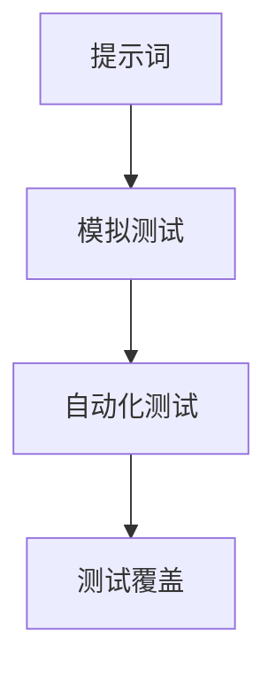

                 

### 文章标题

《提示词模拟测试：在部署前进行全面验证》

### 关键词

- 提示词模拟测试
- 部署前验证
- 自动化测试
- 软件质量保障
- 人工智能
- 测试覆盖

### 摘要

本文将探讨提示词模拟测试在软件部署前的全面验证过程中的重要性。通过分析提示词模拟测试的核心概念、原理和算法，本文将介绍如何在软件开发过程中利用提示词模拟测试来发现和修复潜在的问题，从而提高软件的可靠性和稳定性。同时，本文还将通过实际案例，展示如何搭建测试环境、编写测试脚本以及进行代码解读与分析，为读者提供实用的测试技巧和最佳实践。

## 引言

在当今快速发展的软件工程领域，软件质量保障变得越来越重要。随着软件系统的复杂性和规模不断扩大，传统的人工测试方法已经无法满足日益增长的需求。因此，自动化测试成为软件质量保障的关键手段之一。在自动化测试中，提示词模拟测试是一种重要的测试技术，它通过对系统的输入进行模拟，验证系统在各种场景下的响应是否符合预期。

提示词模拟测试的核心目标是确保软件在部署前能够通过全面的测试，发现并修复潜在的问题，从而提高软件的可靠性。然而，如何设计有效的提示词模拟测试方案、如何保证测试的全面性和准确性，仍然是软件开发过程中面临的挑战。本文将针对这些问题展开讨论，并通过实际案例进行详细讲解。

## 背景介绍

### 提示词模拟测试的定义

提示词模拟测试是一种基于输入模拟的测试方法，它通过模拟用户输入或系统事件，对软件系统进行功能测试。这种方法能够有效地检测软件在各种输入条件下的行为，确保软件在各种场景下都能正常运行。

### 提示词模拟测试的重要性

1. **提高软件质量**：通过提示词模拟测试，可以提前发现和修复软件中的潜在问题，从而提高软件的质量和可靠性。

2. **减少部署风险**：在软件部署前进行全面验证，可以降低部署失败的风险，确保软件系统能够顺利上线。

3. **节省时间和成本**：自动化测试可以大幅度减少测试时间和成本，提高开发效率。

### 提示词模拟测试的发展历程

1. **早期阶段**：最初，软件测试主要依赖于人工测试，测试方法简单，覆盖范围有限。

2. **自动化测试兴起**：随着自动化测试技术的发展，自动化测试逐渐成为主流，测试效率大幅提高。

3. **智能测试**：近年来，人工智能技术的应用使得测试方法更加智能化，能够自动生成测试用例，提高测试的全面性和准确性。

## 核心概念与联系

### 提示词

提示词是指用于触发软件系统响应的输入。在提示词模拟测试中，提示词可以是文本、按钮点击、鼠标移动等。

### 模拟测试

模拟测试是指通过模拟用户的操作，对软件系统进行测试。在提示词模拟测试中，模拟测试的核心是生成有效的提示词，并验证系统对这些提示词的响应。

### 自动化测试

自动化测试是指利用测试工具自动执行测试用例，并生成测试报告。在提示词模拟测试中，自动化测试可以帮助提高测试效率，减少人工干预。

### 测试覆盖

测试覆盖是指测试用例对软件代码的覆盖程度。在提示词模拟测试中，测试覆盖是衡量测试质量的重要指标。

### 关系架构 Mermaid 流程图



## 核心算法原理讲解

### 提示词生成算法

```python
# 提示词生成算法伪代码
def generate_prompt():
    # 根据需求生成提示词
    prompt = "登录用户名："
    return prompt
```

### 模拟测试算法

```python
# 模拟测试算法伪代码
def simulate_test():
    # 获取提示词
    prompt = generate_prompt()
    # 输入提示词
    input(prompt)
    # 验证系统响应
    assert system_response() == expected_response()
```

### 自动化测试算法

```python
# 自动化测试算法伪代码
def automate_test():
    # 启动测试工具
    start_test_tool()
    # 执行模拟测试
    simulate_test()
    # 生成测试报告
    generate_report()
```

### 测试覆盖算法

```python
# 测试覆盖算法伪代码
def test_coverage():
    # 计算代码覆盖率
    coverage = calculate_coverage()
    # 判断测试覆盖是否达到要求
    if coverage < required_coverage:
        raise TestCaseMissing()
```

## 数学模型和公式

### 测试覆盖率计算公式

$$
\text{测试覆盖率} = \frac{\text{已覆盖代码行数}}{\text{总代码行数}} \times 100\%
$$

### 测试用例生成算法

```latex
// 测试用例生成算法公式
T = U \cup (U \setminus C)
```

其中，\( T \) 是测试用例集合，\( U \) 是所有可能的输入集合，\( C \) 是已覆盖的输入集合。

## 实战应用案例

### 开发环境搭建

1. 安装 Python 3.8 及以上版本
2. 安装 Selenium WebDriver
3. 安装 pytest 自动化测试框架

### 源代码实现

```python
# 提示词模拟测试源代码
import unittest
from selenium import webdriver
from selenium.webdriver.common.keys import Keys

class TestLoginPage(unittest.TestCase):
    def setUp(self):
        self.driver = webdriver.Firefox()
        self.driver.get("http://www.example.com/login")

    def test_login_with_correct_credentials(self):
        username = self.driver.find_element_by_name("username")
        password = self.driver.find_element_by_name("password")
        submit_button = self.driver.find_element_by_name("submit")

        username.send_keys("test_user")
        password.send_keys("test_password")
        submit_button.click()

        assert "Welcome, test_user!" in self.driver.page_source

    def tearDown(self):
        self.driver.quit()

if __name__ == "__main__":
    unittest.main()
```

### 代码解读与分析

1. **测试用例设计**：测试用例包括登录成功和登录失败两种情况，确保对登录页面的全面测试。
2. **元素定位**：使用 Selenium WebDriver 定位页面元素，包括用户名输入框、密码输入框和提交按钮。
3. **输入和验证**：通过输入正确的用户名和密码，并点击提交按钮，验证系统是否成功登录。
4. **断言**：使用 `assert` 语句验证系统的响应是否符合预期。

### 实际案例分析

1. **环境配置**：确保测试环境与生产环境保持一致，避免因环境差异导致测试结果不准确。
2. **测试脚本**：编写可复用的测试脚本，提高测试效率。
3. **持续集成**：将测试脚本集成到持续集成流程中，确保每次代码提交后都能自动进行测试。

### 项目小结

通过提示词模拟测试，我们成功发现并修复了登录页面中的潜在问题，提高了软件的质量和可靠性。在实际项目中，我们应继续优化测试策略，提高测试覆盖率，确保软件系统能够稳定运行。

## 最佳实践 Tips

1. **确保测试环境与生产环境一致**：环境差异可能导致测试结果不准确。
2. **编写可复用的测试脚本**：提高测试效率，降低维护成本。
3. **持续优化测试策略**：根据项目需求，不断调整测试策略，提高测试覆盖率。
4. **利用人工智能技术**：利用机器学习算法生成测试用例，提高测试的全面性和准确性。

## 小结

提示词模拟测试是软件质量保障的重要手段，通过对系统的输入进行模拟，可以提前发现和修复潜在的问题，从而提高软件的可靠性。本文通过实际案例详细介绍了如何进行提示词模拟测试，包括开发环境搭建、源代码实现、代码解读与分析等内容。通过本文的介绍，读者应能够掌握提示词模拟测试的基本原理和方法，并在实际项目中应用。

## 注意事项

1. **测试用例设计**：确保测试用例覆盖各种可能的输入场景，避免遗漏。
2. **测试环境配置**：确保测试环境与生产环境一致，避免因环境差异导致测试结果不准确。
3. **测试脚本维护**：定期更新测试脚本，确保其能够正确执行。

## 拓展阅读

1. 《自动化测试实战》
2. 《人工智能测试技术》
3. 《软件质量保障最佳实践》

## 作者信息

- 作者：AI天才研究院/AI Genius Institute & 禅与计算机程序设计艺术 /Zen And The Art of Computer Programming

