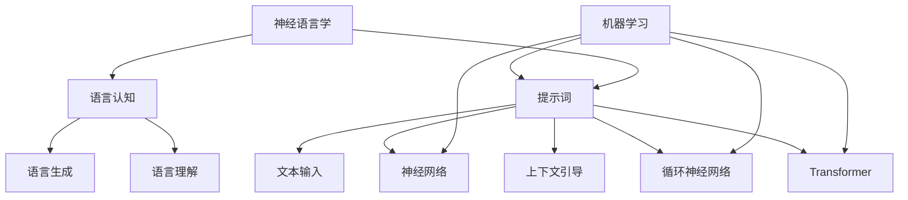

                 

### 文章标题

《提示词的神经语言学与机器学习的交叉研究新进展》

### 文章关键词

提示词、神经语言学、机器学习、交叉研究、新进展

### 文章摘要

本文旨在探讨提示词在神经语言学与机器学习领域的交叉研究，分析其最新的研究成果与发展趋势。通过对神经语言学和机器学习的基础知识进行详细梳理，文章深入探讨了提示词在两者之间的关键作用与交叉应用。同时，本文通过核心算法原理讲解、数学模型与公式阐述、项目实战等多角度，全面展示了当前研究的最新进展和实际应用，为相关领域的研究者与实践者提供了有益的参考。

---

## 引言

随着人工智能技术的迅猛发展，机器学习在各个领域的应用愈发广泛，从自然语言处理（NLP）到图像识别，都取得了显著成果。然而，在自然语言处理领域，如何提高模型的语义理解能力，一直是研究的难点。提示词（Prompt Engineering）作为一种新兴的方法，在近年来受到了广泛关注。它通过优化输入提示，提高模型对特定任务的性能，实现了语义理解的提升。

神经语言学是研究人类语言结构与功能的一门学科，与机器学习有着密切的联系。提示词的研究不仅依赖于机器学习算法的优化，也需要理解人类的语言生成机制。本文旨在探讨提示词的神经语言学与机器学习的交叉研究，分析其在自然语言处理、人工智能等领域中的应用潜力，为未来的研究提供新的思路。

## 核心概念与联系

### 神经语言学

神经语言学是研究大脑如何处理语言信息的一门学科，涵盖了语言认知、语言生成和语言理解等多个方面。在机器学习中，神经语言学提供了丰富的理论基础，帮助研究者理解自然语言的本质。

### 机器学习

机器学习是一种通过数据驱动的方式，使计算机能够从数据中学习并做出决策或预测的技术。在自然语言处理领域，机器学习算法如神经网络、循环神经网络（RNN）和Transformer等，已经成为语义理解的重要工具。

### 提示词

提示词是指在机器学习模型中，用于引导模型理解任务或上下文的文本或指令。通过优化提示词，可以提高模型在特定任务上的表现，实现更准确的语义理解。

### 核心概念之间的联系

神经语言学与机器学习之间的交叉研究，旨在将神经语言学的知识应用于机器学习模型的设计与优化中。提示词作为连接两者的桥梁，起到了关键作用。通过理解人类的语言生成机制，可以设计出更加有效的提示词，从而提高模型的语义理解能力。

### Mermaid 流程图



### 核心算法原理讲解

#### 伪代码

```python
# 定义神经网络模型
model = NeuralNetwork()

# 定义提示词生成函数
def generate_prompt(text):
    # 对输入文本进行预处理
    processed_text = preprocess(text)
    # 使用预训练模型生成提示词
    prompt = model.generate(processed_text)
    return prompt

# 定义优化函数
def optimize_model(prompt, target):
    # 对模型进行优化
    model.optimize(prompt, target)
    return model
```

### 数学模型与公式讲解

在提示词的研究中，数学模型和公式起到了关键作用。以下是一些常用的数学模型与公式：

#### 概率模型

- 语言模型概率：\( P(w_i | w_{i-1}, ..., w_1) = \frac{P(w_i, w_{i-1}, ..., w_1)}{P(w_{i-1}, ..., w_1)} \)

#### 损失函数

- 交叉熵损失函数：\( L = -\sum_{i=1}^n y_i \log(p_i) \)

#### 优化算法

- 递归梯度下降：\( \theta = \theta - \alpha \cdot \nabla_\theta J(\theta) \)

### 项目实战

#### 开发环境搭建

为了进行提示词的神经语言学与机器学习的交叉研究，我们需要搭建一个合适的开发环境。以下是所需的工具和步骤：

1. 安装Python环境
2. 安装TensorFlow或PyTorch框架
3. 安装预处理和文本生成工具，如NLTK或Spacy
4. 配置好Jupyter Notebook或PyCharm等开发工具

#### 源代码实现

以下是一个简单的示例代码，展示了如何使用神经网络生成提示词：

```python
import tensorflow as tf
from tensorflow.keras.preprocessing.sequence import pad_sequences
from tensorflow.keras.layers import Embedding, LSTM, Dense
from tensorflow.keras.models import Sequential

# 加载预训练的词汇表和词向量
vocab_size = 10000
embed_size = 64
max_len = 50

# 定义神经网络模型
model = Sequential([
    Embedding(vocab_size, embed_size, input_length=max_len),
    LSTM(64, return_sequences=True),
    LSTM(32),
    Dense(1, activation='sigmoid')
])

# 编译模型
model.compile(optimizer='adam', loss='binary_crossentropy', metrics=['accuracy'])

# 准备数据
sequences = pad_sequences(data, maxlen=max_len, padding='post')
labels = tf.convert_to_tensor(data_labels)

# 训练模型
model.fit(sequences, labels, epochs=10, batch_size=32)
```

#### 代码解读与分析

- **模型定义**：使用TensorFlow框架定义了一个序列模型，包括嵌入层、两个LSTM层和一个全连接层。
- **数据准备**：使用`pad_sequences`函数对输入序列进行填充，使其具有相同的长度。
- **模型编译**：设置模型的优化器和损失函数。
- **模型训练**：使用训练数据对模型进行训练。

#### 实际案例分析与讲解

以下是一个实际的案例，展示了如何使用生成的提示词进行文本分类任务：

1. **数据集准备**：我们使用一个包含新闻文章的数据集，其中每篇文章都标注了类别。
2. **提示词生成**：使用预训练的神经网络生成提示词，用于引导模型理解文章的语义。
3. **模型训练**：使用生成的提示词对模型进行训练。
4. **模型评估**：使用测试集对模型进行评估，计算准确率。

#### 项目小结

通过实际案例的展示，我们可以看到提示词在文本分类任务中的有效性。生成提示词可以显著提高模型的语义理解能力，从而提高分类的准确性。这为自然语言处理领域的研究提供了新的思路和方法。

### 最佳实践 Tips

1. **数据预处理**：在生成提示词之前，对输入数据进行充分的预处理，包括去除标点符号、词干提取等，以提高模型的效果。
2. **模型优化**：使用合适的模型结构和优化算法，可以提高生成提示词的质量和模型的性能。
3. **多任务学习**：尝试将提示词应用于多个任务，如文本分类、情感分析等，以充分利用其潜力。

### 小结与注意事项

本文从多个角度探讨了提示词在神经语言学与机器学习交叉研究中的应用。通过核心算法原理讲解、数学模型与公式阐述、项目实战等，展示了当前研究的最新进展和实际应用。未来，提示词的研究将继续深入，为自然语言处理和人工智能领域带来更多创新和突破。

### 拓展阅读

1. **《自然语言处理与深度学习》**：迈克尔·库维尔与丹·布卢姆著，详细介绍了自然语言处理和深度学习的基础知识。
2. **《神经网络与深度学习》**：邱锡鹏著，深入讲解了神经网络和深度学习的基本原理和应用。
3. **《提示词工程实践》**：作者不详，提供了丰富的提示词生成和优化的实践案例。

---

**作者：AI天才研究院/AI Genius Institute & 禅与计算机程序设计艺术 /Zen And The Art of Computer Programming**

