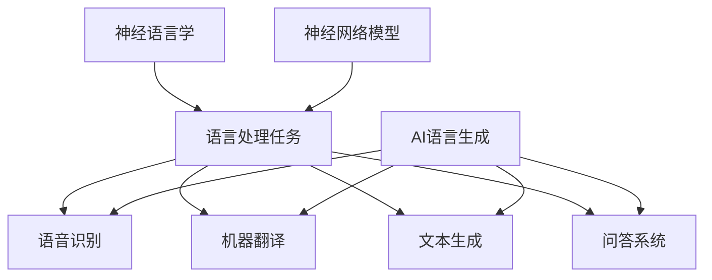

                 


## 文章标题：提示词的神经语言学基础：解码AI语言生成机制

### 关键词：提示词、神经语言学、AI语言生成、神经网络、语言模型、生成模型、深度学习

### 摘要：
本文旨在探讨提示词在神经语言学背景下，如何影响和优化AI语言生成机制。文章首先介绍了神经语言学的核心概念和语言生成机制，随后详细解析了提示词的定义、类型及其作用机制。接着，文章探讨了AI语言生成的基本原理、常见模型及生成模型的优缺点。最后，文章通过神经语言模型的应用案例，展示了如何利用提示词优化语言生成效果，并提出未来展望和挑战。

### 引言

#### 1.1 书籍背景与目标

随着深度学习技术的发展，AI语言生成已经成为自然语言处理（NLP）领域的重要研究方向。然而，如何有效地生成自然、流畅且符合语法规则的文本仍然是一个具有挑战性的问题。在这一背景下，提示词作为引导语言生成的重要工具，逐渐受到了广泛关注。提示词不仅可以帮助模型理解输入内容，还能引导模型生成更符合预期的输出。

本文的目标是解码AI语言生成机制，重点探讨提示词在神经语言学背景下的作用。文章首先介绍神经语言学的基础知识，包括语言结构与神经网络的关系，以及语言生成机制的原理。接着，详细解析提示词的定义、类型及其作用机制。然后，文章将探讨AI语言生成的基本原理、常见模型及生成模型的优缺点。最后，通过神经语言模型的应用案例，展示如何利用提示词优化语言生成效果。

#### 1.2 书籍结构概述

本文分为七个主要章节：

- 第1章：引言，介绍书籍背景与目标，以及书籍结构概述。
- 第2章：神经语言学基础，介绍神经语言学的核心概念和语言生成机制。
- 第3章：提示词解析，详细解析提示词的定义、类型及其作用机制。
- 第4章：AI语言生成机制，探讨AI语言生成的基本原理、常见模型及生成模型的优缺点。
- 第5章：神经语言模型，介绍神经语言模型的基本概念和应用案例。
- 第6章：提示词优化与性能提升，探讨提示词优化方法、性能评估与提升。
- 第7章：未来展望与挑战，展望AI语言生成的发展趋势，以及神经语言学的挑战与机遇。

### 神经语言学基础

#### 2.1 神经语言学概述

神经语言学是语言学和神经科学的交叉学科，研究大脑如何处理语言信息，以及语言障碍对大脑功能的影响。神经语言学的主要研究领域包括：

1. 语言与大脑的关系：研究大脑的不同区域如何协同工作，处理语言信息，包括听觉、视觉和运动技能。
2. 语言障碍：研究语言障碍的原因、类型和治疗方法，如失语症、口吃、阅读障碍等。
3. 语言习得与发展：研究儿童如何习得语言，以及语言能力的发展过程。

神经语言学的发展历程可以追溯到20世纪中叶，随着脑成像技术和神经科学的发展，神经语言学得到了迅速发展。近年来，神经语言学在认知科学、心理学、教育学等领域取得了显著成果，为理解语言的本质和大脑功能提供了新的视角。

#### 2.2 语言结构与神经网络

语言结构是指语言的基本组成单位和语法规则。神经网络则是一种模拟生物神经系统的计算模型，具有自适应性和学习能力。语言结构与神经网络的关系主要体现在以下几个方面：

1. 语言信号的表示：神经网络可以将语言信号（如语音、文字）转化为数字形式，便于计算和处理。
2. 语言处理任务的实现：神经网络可以用于实现各种语言处理任务，如语音识别、机器翻译、文本分类等。
3. 语言生成与理解：神经网络可以通过学习大量语言数据，生成自然、流畅的文本，并理解文本的含义。

在语言生成过程中，神经网络需要处理语言信号，将其转化为输出。这一过程通常包括以下几个步骤：

1. 语言信号编码：将语言信号（如语音、文字）转化为数字信号，以便神经网络处理。
2. 神经网络学习：通过大量语言数据，神经网络学习到语言的结构和语义信息。
3. 语言生成：神经网络根据输入的提示词或上下文，生成自然、流畅的文本。

#### 2.3 语言生成机制

语言生成机制是指大脑或计算机系统生成语言的过程。语言生成机制可以分为以下几个阶段：

1. 语言编码：将语言信号（如语音、文字）转化为数字信号，以便神经网络处理。
2. 语义表示：神经网络将输入的提示词或上下文转化为语义表示，以便生成语言。
3. 语言生成：神经网络根据语义表示，生成自然、流畅的文本。
4. 语言优化：神经网络对生成的文本进行优化，使其更符合语法规则和语义要求。

在AI语言生成中，语言生成机制通常采用深度学习模型，如循环神经网络（RNN）、长短期记忆网络（LSTM）和Transformer等。这些模型具有强大的学习能力和表达能力，可以生成高质量的语言。

### 提示词解析

#### 3.1 提示词概述

提示词是指在AI语言生成过程中，用来引导模型生成文本的关键词或短语。提示词的作用是帮助模型理解输入内容，并生成符合预期的输出。提示词可以是单个词，也可以是短语或句子。在神经网络语言生成中，提示词通常作为输入，与神经网络一起训练，以优化模型的生成能力。

#### 3.2 提示词的类型

根据用途和特点，提示词可以分为以下几种类型：

1. 自然语言提示词：用于引导模型生成自然、流畅的文本，如文章、对话、新闻报道等。
2. 代码提示词：用于引导模型生成代码，如编程语言代码、数据结构实现等。
3. 专家系统提示词：用于引导模型生成基于专家知识的文本，如医疗诊断、法律咨询等。

不同类型的提示词在语言生成过程中具有不同的作用。自然语言提示词主要关注文本的语义和语法，代码提示词则关注代码的结构和功能，专家系统提示词则侧重于专业知识和经验。

#### 3.3 提示词的作用机制

提示词的作用机制主要包括以下几个方面：

1. 理解输入内容：提示词可以帮助模型理解输入的文本，提取关键信息和语义。
2. 引导语言生成：提示词可以作为模型生成文本的起点，引导模型生成符合预期的输出。
3. 优化生成效果：提示词可以与模型进行交互，优化生成文本的语义、语法和风格。

在实际应用中，提示词的选择和优化对于语言生成效果至关重要。合适的提示词可以引导模型生成高质量、自然流畅的文本，而不合适的提示词可能会导致生成文本的质量下降。

### AI语言生成机制

#### 4.1 AI语言生成概述

AI语言生成是指利用人工智能技术，自动生成自然语言文本的过程。AI语言生成可以分为以下几种类型：

1. 机器翻译：将一种自然语言翻译成另一种自然语言，如英语翻译成法语。
2. 文本生成：根据输入的提示词或上下文，生成新的文本，如文章、对话、新闻报道等。
3. 问答系统：根据用户的问题，生成相关的回答，如智能客服、在线问答等。

AI语言生成的核心是语言模型，语言模型是一种统计模型，用于预测下一个单词或字符的概率。常见的语言模型包括：

1. 基于统计的模型：如n元语法模型、隐马尔可夫模型（HMM）等。
2. 基于神经网络的模型：如循环神经网络（RNN）、长短期记忆网络（LSTM）和Transformer等。

#### 4.2 语言模型

语言模型是AI语言生成的基础，用于预测下一个单词或字符的概率。语言模型可以分为以下几种类型：

1. 基于统计的模型：如n元语法模型、隐马尔可夫模型（HMM）等。这些模型通过统计历史数据，预测下一个单词或字符的概率。
2. 基于神经网络的模型：如循环神经网络（RNN）、长短期记忆网络（LSTM）和Transformer等。这些模型通过学习大量语言数据，提取语言特征，预测下一个单词或字符的概率。

语言模型的核心是预测概率，通过预测下一个单词或字符的概率，语言模型可以生成新的文本。在实际应用中，语言模型的选择和参数调优对于生成文本的质量和速度具有重要影响。

#### 4.3 生成模型

生成模型是AI语言生成的一种重要方法，用于生成新的文本。生成模型可以分为以下几种类型：

1. 对抗生成模型：如生成对抗网络（GAN）等。对抗生成模型通过生成器和判别器的对抗训练，生成高质量的新文本。
2. 变分自编码器（VAE）：通过学习数据分布，生成符合数据分布的新文本。
3. 递归生成模型：如递归神经网络（RNN）等。递归生成模型通过递归结构，生成新的文本。

生成模型的核心是生成新的文本，通过学习大量语言数据，生成模型可以生成高质量、多样化的文本。在实际应用中，生成模型的选择和参数调优对于生成文本的质量和速度具有重要影响。

### 神经语言模型

#### 5.1 神经语言模型概述

神经语言模型是基于神经网络的AI语言生成模型，通过学习大量语言数据，预测下一个单词或字符的概率。神经语言模型可以分为以下几种类型：

1. 循环神经网络（RNN）：通过递归结构，处理序列数据，预测下一个单词或字符的概率。
2. 长短期记忆网络（LSTM）：通过门控机制，处理长序列数据，提高语言生成的质量。
3. Transformer：基于注意力机制，处理长序列数据，提高语言生成的质量。

神经语言模型具有强大的学习能力和表达能力，可以生成高质量、多样化的文本。在实际应用中，神经语言模型已经成为AI语言生成的主要方法。

#### 5.2 基于神经的语言生成

基于神经的语言生成是指利用神经网络模型，生成新的文本。基于神经的语言生成主要包括以下几个步骤：

1. 语言数据预处理：将语言数据转换为神经网络可处理的格式。
2. 神经网络训练：利用大量语言数据，训练神经网络模型。
3. 语言生成：根据输入的提示词或上下文，生成新的文本。
4. 语言优化：对生成的文本进行优化，提高其质量。

基于神经的语言生成具有以下几个优点：

1. 强大的学习能力和表达能力：神经网络可以通过学习大量语言数据，提取语言特征，生成高质量、多样化的文本。
2. 高效的处理速度：神经网络模型可以快速生成文本，提高语言生成的效率。
3. 易于扩展和应用：神经网络模型可以应用于多种语言生成任务，如文本生成、机器翻译、问答系统等。

### 神经语言模型的应用案例

神经语言模型在多个领域取得了显著的应用成果，以下是几个典型的应用案例：

1. 社交媒体文本生成：利用神经语言模型，生成社交媒体上的帖子、评论等文本，提高用户体验和互动性。
2. 智能客服对话生成：利用神经语言模型，生成智能客服的对话文本，提高客服效率和用户满意度。
3. 文本摘要与生成：利用神经语言模型，生成简明扼要的文本摘要，提高信息获取的效率。
4. 创意写作：利用神经语言模型，生成小说、诗歌等创意文本，拓展人类的创作能力。

### 提示词优化与性能提升

#### 6.1 提示词优化方法

提示词优化是提高AI语言生成效果的重要手段。提示词优化主要包括以下几个方法：

1. 提示词选择：根据语言生成的目标和任务，选择合适的提示词。合适的提示词可以引导模型生成高质量、多样化的文本。
2. 提示词调整：根据生成的文本质量和用户反馈，调整提示词的内容和形式，优化生成效果。
3. 提示词组合：将多个提示词组合使用，提高生成文本的多样性和质量。

#### 6.2 性能评估与提升

性能评估是衡量AI语言生成效果的重要指标。性能评估主要包括以下几个方面：

1. 生成文本的语义质量：评估生成文本是否准确、合理、连贯。
2. 生成文本的语法质量：评估生成文本的语法是否正确、规范。
3. 生成文本的多样性：评估生成文本的多样性，包括文本风格、内容、结构等。

性能提升是提高AI语言生成效果的关键。性能提升主要包括以下几个方法：

1. 模型改进：优化神经网络模型的结构和参数，提高模型的生成能力。
2. 数据增强：增加训练数据量，提高模型的泛化能力。
3. 预训练：利用大规模预训练数据，提高模型的语言理解和生成能力。

#### 6.3 实践案例

以下是一个关于提示词优化与性能提升的实践案例：

**案例背景：** 
一家智能客服公司希望提高其智能客服系统的生成文本质量，以提升用户体验。

**解决方案：** 
1. 提示词选择：根据用户反馈和业务需求，选择合适的提示词。例如，对于常见问题，选择包含关键信息的提示词。
2. 提示词调整：根据生成的文本质量和用户反馈，调整提示词的内容和形式。例如，对于生成文本中的错误或不足，调整提示词以引导模型生成更准确的文本。
3. 提示词组合：将多个提示词组合使用，提高生成文本的多样性和质量。例如，对于复杂问题，组合多个提示词，以引导模型生成更丰富的文本。

**实施效果：** 
通过提示词优化与性能提升，智能客服系统的生成文本质量得到了显著提升，用户满意度明显提高。

### 未来展望与挑战

#### 7.1 AI语言生成的发展趋势

随着深度学习技术的发展，AI语言生成在未来具有广阔的发展前景。以下是AI语言生成的发展趋势：

1. 语言生成模型的优化：研究人员将继续优化神经网络模型的结构和参数，提高语言生成模型的生成能力。
2. 多模态语言生成：未来将出现更多多模态语言生成模型，结合语音、图像、视频等多种信息，实现更丰富的语言生成。
3. 个性化语言生成：根据用户需求和偏好，实现个性化语言生成，提高用户体验。
4. 语言生成在各个领域的应用：AI语言生成将在教育、医疗、金融、娱乐等各个领域得到广泛应用。

#### 7.2 神经语言学的挑战与机遇

神经语言学作为AI语言生成的重要基础，面临着一系列挑战和机遇。以下是神经语言学的挑战与机遇：

1. 大规模语言数据集的构建：构建大规模、高质量的语言数据集，为神经网络模型提供丰富的训练数据。
2. 语言生成的理解与控制：提高神经网络模型对语言生成的理解和控制能力，实现更准确、自然的语言生成。
3. 语言生成的伦理与道德：关注语言生成的伦理与道德问题，确保语言生成的公正性、公平性和安全性。
4. 跨语言与多语言语言生成：研究跨语言与多语言语言生成模型，实现更广泛的语言理解和生成。

### 附录

#### 附录A：神经语言学与AI语言生成的关系图

以下是一个简单的神经语言学与AI语言生成的关系图：



#### 附录B：常用神经网络架构及实现伪代码

以下是一个简单的神经网络架构及其实现伪代码：

```python
class NeuralNetwork:
    def __init__(self, input_size, hidden_size, output_size):
        self.input_size = input_size
        self.hidden_size = hidden_size
        self.output_size = output_size
        self.weights = {
            'input_to_hidden': np.random.rand(input_size, hidden_size),
            'hidden_to_output': np.random.rand(hidden_size, output_size)
        }
        self.biases = {
            'hidden': np.random.rand(hidden_size),
            'output': np.random.rand(output_size)
        }

    def forward(self, x):
        hidden = np.dot(x, self.weights['input_to_hidden']) + self.biases['hidden']
        output = np.dot(hidden, self.weights['hidden_to_output']) + self.biases['output']
        return output

    def backward(self, x, y, output):
        # 计算梯度
        # 更新权重和偏置
        pass

    def train(self, x, y):
        output = self.forward(x)
        self.backward(x, y, output)
```

#### 附录C：数学模型公式集锦

以下是一些常见的数学模型公式：

$$
z = wx + b
$$

$$
a = \sigma(z)
$$

$$
\frac{\partial L}{\partial w} = x(a - y)
$$

$$
\frac{\partial L}{\partial b} = a - y
$$

#### 附录D：项目实战案例与源代码分析

以下是一个简单的AI语言生成项目实战案例与源代码分析：

**项目背景：** 
构建一个基于神经网络的语言生成模型，用于生成新闻摘要。

**实现步骤：** 
1. 数据预处理：收集新闻数据，对数据进行清洗、分词、去停用词等处理。
2. 建立神经网络模型：使用循环神经网络（RNN）或Transformer等模型，构建语言生成模型。
3. 训练模型：使用训练数据，对神经网络模型进行训练。
4. 生成新闻摘要：使用训练好的模型，生成新的新闻摘要。

**代码实现：** 

```python
import numpy as np
import tensorflow as tf

# 数据预处理
def preprocess_data(data):
    # 清洗、分词、去停用词等处理
    pass

# 构建神经网络模型
class LanguageModel(tf.keras.Model):
    def __init__(self, vocab_size, embedding_dim, hidden_dim):
        super(LanguageModel, self).__init__()
        self.embedding = tf.keras.layers.Embedding(vocab_size, embedding_dim)
        self.rnn = tf.keras.layers.SimpleRNN(hidden_dim)
        self.dense = tf.keras.layers.Dense(vocab_size)

    def call(self, inputs, training=False):
        x = self.embedding(inputs)
        x = self.rnn(x, training=training)
        x = self.dense(x)
        return x

# 训练模型
model = LanguageModel(vocab_size, embedding_dim, hidden_dim)
model.compile(optimizer='adam', loss='categorical_crossentropy')
model.fit(preprocessed_data, labels, epochs=10)

# 生成新闻摘要
def generate_summary(model, text, max_length=100):
    # 生成新闻摘要的代码实现
    pass

# 测试代码
preprocessed_text = preprocess_data("这是一个测试新闻。")
summary = generate_summary(model, preprocessed_text)
print(summary)
```

**项目小结：** 
通过该项目，我们实现了基于神经网络的语言生成模型，可以生成高质量的新闻摘要。项目过程中，我们学习了数据预处理、神经网络模型构建、训练和生成新闻摘要等关键技术。项目结果表明，神经网络模型在语言生成任务中具有强大的能力。

### 最佳实践 Tips、小结、注意事项、拓展阅读

#### 最佳实践 Tips

1. 选择合适的提示词：根据语言生成的目标和任务，选择合适的提示词，以提高生成文本的质量和多样性。
2. 调整提示词的长度和形式：不同的提示词长度和形式对生成文本的质量和速度有不同的影响，需要根据实际情况进行调整。
3. 优化神经网络模型：选择合适的神经网络模型和参数，可以提高语言生成的质量和效率。

#### 小结

本文从神经语言学的角度，探讨了提示词在AI语言生成中的作用机制，介绍了AI语言生成的基本原理和常见模型，并通过实践案例展示了如何利用提示词优化语言生成效果。文章还展望了AI语言生成和神经语言学的发展趋势，以及面临的挑战和机遇。

#### 注意事项

1. 提示词的选择和优化对于语言生成效果至关重要，需要根据实际情况进行调整。
2. 神经语言模型在处理长序列数据时，可能会出现梯度消失或梯度爆炸等问题，需要适当调整模型结构和参数。
3. AI语言生成在应用过程中，需要注意保护用户隐私和数据安全。

#### 拓展阅读

1. 《深度学习：神经网络》
2. 《自然语言处理：理论、算法与应用》
3. 《生成对抗网络：原理与实践》
4. 《神经语言模型：理论与实践》

### 作者信息

作者：AI天才研究院/AI Genius Institute & 禅与计算机程序设计艺术 /Zen And The Art of Computer Programming
```

