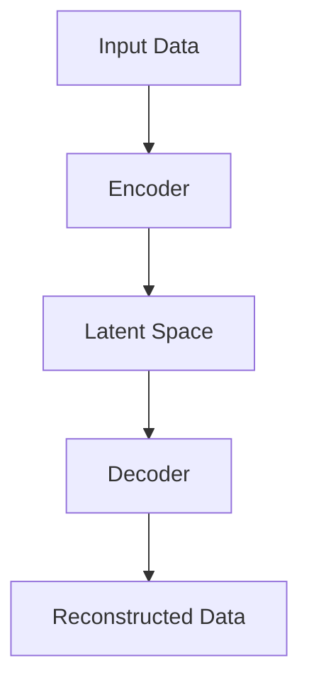
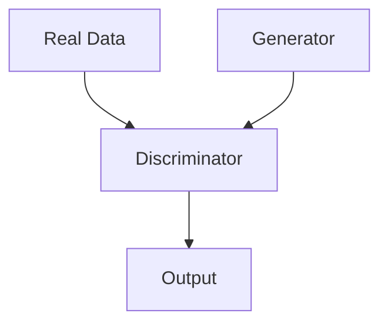

                 

# 提示词的艺术：如何激发AI的创造力

> 关键词：AI、创造力、生成模型、自然语言处理、对话系统、文本生成

> 摘要：本文将探讨人工智能（AI）如何通过提示词艺术激发其创造力。我们将从生成模型、自然语言处理、对话系统和文本生成等方面详细分析，展示AI创造力的实际应用和潜力。

## 引言

在过去的几十年里，人工智能（AI）技术取得了显著的进展，从简单的规则系统到复杂的神经网络模型，AI已经渗透到我们日常生活的方方面面。然而，与人类相比，AI在创造性方面仍存在很大的差距。尽管AI在处理大量数据和执行重复性任务方面表现出色，但在创造新思想、新内容方面仍缺乏能力。本文将探讨如何通过提示词艺术激发AI的创造力，使其在生成新的文本、图像、音乐等方面发挥更大的作用。

## 生成模型与创造力

生成模型是AI领域中一种重要的模型类型，主要用于生成新的数据，如文本、图像、音乐等。生成模型的核心思想是通过学习数据的概率分布来生成新的样本。其中，变分自编码器（VAE）和生成对抗网络（GAN）是两种常见的生成模型。

### 变分自编码器（VAE）

变分自编码器（VAE）是一种基于概率编码的生成模型。它由编码器和解码器两部分组成。编码器将输入数据映射到一个潜在空间中的点，解码器则从潜在空间中采样点并生成输出数据。



在VAE中，潜在空间中的点服从一个先验分布，通常选择标准正态分布。编码器需要学习如何将输入数据映射到潜在空间中的点，同时保持数据的多样性。解码器则需要从潜在空间中采样点并重构输入数据。

数学上，VAE的目标是最小化重建误差和潜在空间分布的Kullback-Leibler散度。以下是一个简化的VAE的伪代码：

```python
def vae_encode(x):
    z_mean = ...
    z_log_var = ...
    z = reparameterize(z_mean, z_log_var)
    return z

def vae_decode(z):
    x_hat = ...
    return x_hat

def vae_loss(x, x_hat, z_mean, z_log_var):
    reconstruction_loss = ...
    kl_divergence = ...
    return reconstruction_loss + kl_divergence
```

### 生成对抗网络（GAN）

生成对抗网络（GAN）是由生成器和判别器组成的对抗性模型。生成器尝试生成类似于真实数据的新样本，而判别器则尝试区分生成器和真实数据。通过这种对抗性训练，生成器逐渐学习到如何生成高质量的数据。



在GAN中，生成器和判别器交替训练。生成器通过从潜在空间中采样点并生成伪数据来欺骗判别器，而判别器则通过学习如何准确地区分真实数据和伪数据来提高其性能。

以下是一个简化的GAN的伪代码：

```python
def generator(z):
    x_hat = ...
    return x_hat

def discriminator(x):
    probability = ...
    return probability

def gans_loss(x, x_hat, probability):
    real_loss = ...
    fake_loss = ...
    return real_loss + fake_loss
```

## 自然语言处理与创造力

自然语言处理（NLP）是AI领域的一个重要分支，致力于使计算机理解和生成人类语言。在NLP中，生成模型被广泛应用于文本生成、摘要生成和对话系统等领域。

### 文本生成

文本生成是NLP领域的一个重要应用。生成模型可以生成文章、诗歌、对话等各种类型的文本。以下是一个简单的基于变分自编码器的文本生成模型的伪代码：

```python
def text_generator(z):
    words = ...
    return ' '.join(words)

def text_generator_loss(z, text):
    loss = ...
    return loss
```

### 摘要生成

摘要生成是NLP领域的另一个重要应用。生成模型可以生成文章的摘要或概述。以下是一个简单的基于生成对抗网络的摘要生成模型的伪代码：

```python
def abstract_generator(z):
    sentences = ...
    return ' '.join(sentences)

def abstract_generator_loss(z, abstract):
    loss = ...
    return loss
```

### 对话系统

对话系统是NLP领域的另一个重要应用。生成模型可以用于生成聊天机器人和语音助手的对话响应。以下是一个简单的基于变分自编码器的对话生成模型的伪代码：

```python
def conversation_generator(z):
    responses = ...
    return ' '.join(responses)

def conversation_generator_loss(z, conversation):
    loss = ...
    return loss
```

## 对话系统与交互

对话系统是一种人与计算机之间进行自然语言交互的智能系统。通过生成模型，对话系统可以生成自然、流畅的对话响应。以下是一个简单的基于变分自编码器的对话系统的伪代码：

```python
def conversation_generator(z):
    responses = ...
    return ' '.join(responses)

def process_input(input_text):
    # 处理输入文本，提取关键信息
    # ...

    # 使用生成模型生成响应
    z = generate_z(input_text)
    responses = generate_responses(z)

    return responses
```

## 项目实战

在本节中，我们将介绍一个简单的文本生成项目，用于生成文章。该项目包括以下几个步骤：

1. 数据收集与预处理：收集大量文章数据，并对数据进行清洗和预处理，如去除HTML标签、标点符号等。

2. 模型训练：使用变分自编码器（VAE）训练模型，使其能够生成类似输入文章的文本。

3. 文本生成：使用训练好的模型生成新的文章。

4. 文本评估：对生成的文章进行评估，如使用 BLEU 分数来衡量生成的文本与真实文本的相似度。

以下是一个简单的文本生成项目的实现：

```python
# 数据预处理
def preprocess_data(data):
    # 去除HTML标签、标点符号等
    # ...

    return cleaned_data

# 模型训练
def train_model(data):
    # 初始化模型参数
    # ...

    # 训练模型
    # ...

    return model

# 文本生成
def generate_text(model, input_text):
    # 生成潜在空间中的点
    z = model.encode(input_text)

    # 从潜在空间中采样生成新的文本
    new_text = model.decode(z)

    return new_text

# 文本评估
def evaluate_text(generated_text, real_text):
    # 使用BLEU分数评估生成的文本与真实文本的相似度
    bleu_score = ...

    return bleu_score
```

## 最佳实践、小结、注意事项与拓展阅读

### 最佳实践

1. 在使用生成模型时，注意调整模型参数，以获得最佳性能。

2. 在生成文本时，可以尝试使用不同的预处理方法和模型结构，以获得更好的结果。

3. 在评估生成模型时，可以使用多种指标，如 BLEU、ROUGE、METEOR 等，以全面评估模型性能。

### 小结

本文介绍了如何通过提示词艺术激发AI的创造力。我们详细分析了生成模型、自然语言处理、对话系统和文本生成等方面的原理和应用。通过实际项目案例，我们展示了如何使用生成模型生成新的文本、摘要和对话。这些技术为AI在创造力方面的发展提供了新的可能性。

### 注意事项

1. 生成模型训练过程可能需要大量的计算资源和时间。

2. 在生成文本时，要注意避免生成不当的内容，如涉及敏感信息或不当言论。

3. 在应用生成模型时，要确保数据的质量和多样性，以获得更好的生成结果。

### 拓展阅读

1. Ian J. Goodfellow, Yoshua Bengio, Aaron Courville. 《深度学习》（Deep Learning）。

2. Christopher M. Bishop. 《神经网络与机器学习》（Neural Networks for Machine Learning）。

3. Tommi S. Jaakkola, Aernout van Leentvaar, and Ryan P. Adams. 《生成模型导论》（An Introduction to Generative Models）。

作者：AI天才研究院/AI Genius Institute & 禅与计算机程序设计艺术 /Zen And The Art of Computer Programming

