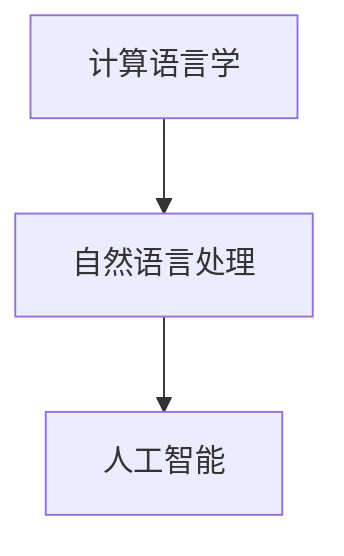
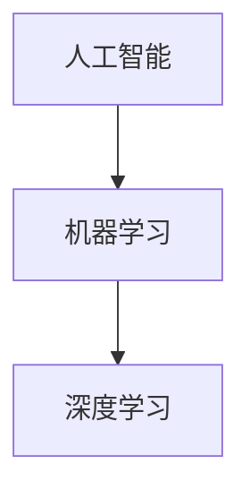

                 

。

### 文章标题：提示词的计算语言学与人工智能交叉研究

关键词：提示词，计算语言学，人工智能，自然语言处理，交叉领域研究

摘要：本文旨在探讨计算语言学与人工智能在提示词领域的交叉研究。首先介绍计算语言学和人工智能的基础知识，然后详细阐述提示词的生成与优化技术，以及它们在自然语言处理中的应用。接着分析计算语言学与人工智能交叉领域的现状和前景，最后提出相关的研究挑战和展望。

## 第一部分：计算语言学基础

### 1.1 计算语言学概述

#### 核心概念与联系

计算语言学是一门研究计算机处理自然语言的学科，它涵盖了自然语言处理（NLP）和人工智能（AI）的多个方面。计算语言学与人工智能的关系紧密，NLP是AI的一个子领域，而计算语言学则为NLP提供了理论基础。



#### 核心算法原理讲解

计算语言学的核心算法包括语言模型、文本分类和情感分析等。

**语言模型基本概念：**

语言模型是用来预测下一个单词或字符的概率分布。常用的语言模型有n-gram模型和基于神经网络的模型。

**n-gram模型：**

$$
P(w_{t} | w_{t-1}, w_{t-2}, ..., w_{1}) = \frac{c(w_{t-1}, w_{t-2}, ..., w_{1}, w_{t})}{c(w_{t-1}, w_{t-2}, ..., w_{1})}
$$

**神经网络语言模型（如LSTM、Transformer）：**

LSTM和Transformer模型是深度学习领域的重要突破，它们通过多层神经网络结构来学习语言序列的概率分布。

```python
# LSTM模型伪代码
class LSTM(Layer):
    def __init__(self, units):
        super(LSTM, self).__init__()
        self.units = units

    def build(self, input_shape):
        self.kernel = self.add_weight(shape=(input_shape[-1], self.units),
                                      initializer='uniform', name='kernel')
        self.recurrent_kernel = self.add_weight(shape=(self.units, self.units),
                                                initializer='uniform', name='recurrent_kernel')
        self.bias = self.add_weight(shape=(self.units,), initializer='zeros', name='bias')
        super(LSTM, self).build(input_shape)

    def call(self, inputs, states):
        h_t, c_t = states
        h_tm1 = inputs
        gate = K.dot(h_tm1, self.recurrent_kernel) + K.dot(inputs, self.kernel) + self.bias
        i, f, o = K.split(gate, num_or_size_splits=3, axis=-1)
        i, f, o = K.sigmoid(i), K.sigmoid(f), K.sigmoid(o)
        c_prev = c_t
        c = f * c_prev + i * K.tanh(K.dot(h_tm1, self.recurrent_kernel) + K.dot(inputs, self.kernel) + self.bias)
        h = o * K.tanh(c)
        return h, c
```

#### 数学模型

文本分类和情感分析是计算语言学中的重要应用。文本分类是利用机器学习算法将文本分为不同的类别，常用的算法有朴素贝叶斯和支持向量机。

**朴素贝叶斯模型：**

$$
P(y=k | x) = \frac{P(x | y=k)P(y=k)}{P(x)}
$$

**支持向量机模型：**

$$
w = \arg\max_w \frac{1}{2} \| w \|^2 - \sum_{i=1}^{n} \alpha_i y_i (w \cdot x_i - 1)
$$

#### 举例说明

**文本分类：**

使用朴素贝叶斯模型对电影评论进行分类，判断评论是否积极或消极。

**情感分析：**

使用支持向量机模型对社交媒体文本进行情感分析，判断文本的情感倾向。

## 第二部分：人工智能与提示词技术

### 2.1 人工智能基础

#### 核心概念与联系

人工智能（AI）是一门研究使计算机模拟人类智能行为的学科。AI包括机器学习（ML）和深度学习（DL）。



#### 核心算法原理讲解

**机器学习基本概念：**

机器学习是通过训练模型来从数据中学习规律，常用的算法有线性回归、决策树和支持向量机。

**深度学习基本概念：**

深度学习是一种基于多层神经网络的学习方法，通过逐层抽象特征来学习复杂函数。

**神经网络模型：**

$$
a_{i}(L) = \sigma \left( \sum_{j=1}^{n} w_{ji} a_{j}(L-1) + b_{i} \right)
$$

#### 伪代码

```python
# 神经网络模型伪代码
class NeuralNetwork(Layer):
    def __init__(self, layers_sizes):
        super(NeuralNetwork, self).__init__()
        self.layers_sizes = layers_sizes

    def build(self, input_shape):
        self.layers = [Dense(layer_size, activation='sigmoid') for layer_size in self.layers_sizes[1:]]
        super(NeuralNetwork, self).build(input_shape)

    def call(self, inputs):
        x = inputs
        for layer in self.layers:
            x = layer(x)
        return x
```

### 2.2 提示词生成与优化

#### 核心算法原理讲解

**基于语言模型的提示词生成：**

使用语言模型来生成提示词，常用的模型有n-gram模型和基于神经网络的模型。

**提示词优化方法：**

- **强化学习：** 利用奖励信号来优化提示词生成。
- **对抗生成网络（GAN）：** 利用生成对抗网络来生成多样化的提示词。

#### 伪代码

```python
# 基于语言模型的提示词生成伪代码
class LanguageModel(Layer):
    def __init__(self, n):
        super(LanguageModel, self).__init__()
        self.n = n

    def call(self, inputs):
        # 假设输入是长度为n的单词序列
        # 使用n-gram模型来生成下一个单词
        # 返回生成的单词
        pass
```

### 2.3 提示词在自然语言处理中的应用

#### 核心算法原理讲解

**文本生成：** 使用提示词来生成连贯的文本。

**问答系统：** 使用提示词来生成问题的回答。

**对话系统：** 使用提示词来生成自然语言的对话。

#### 举例说明

**文本生成：**

使用基于神经网络的模型生成一段描述美好日出的文本。

**问答系统：**

使用提示词生成系统来回答用户提出的问题。

**对话系统：**

使用提示词生成系统来生成与用户的自然语言对话。

## 第三部分：计算语言学与人工智能交叉领域研究

### 3.1 计算语言学与人工智能交叉研究的现状

计算语言学与人工智能的交叉研究在自然语言处理、智能对话系统和文本生成等领域取得了显著成果。这些研究不仅推动了计算语言学和人工智能的发展，也为实际应用提供了有力支持。

#### 核心概念与联系

计算语言学与人工智能的交叉研究主要集中在以下几个方面：

- **语言模型与深度学习的融合：** 利用深度学习模型来改进语言模型，提高文本生成和文本分类的准确性。
- **智能对话系统的构建：** 利用计算语言学和人工智能技术来构建能够与人类自然交互的智能对话系统。
- **文本生成与摘要：** 利用计算语言学和人工智能技术来生成和摘要文本，提高信息获取的效率。

#### 举例说明

**自然语言处理：**

使用基于神经网络的模型来处理自然语言，如BERT模型，提高了文本分类和情感分析的准确性。

**智能对话系统：**

使用基于强化学习的对话生成模型，如ChatGPT，来构建能够与用户进行自然交互的对话系统。

**文本生成与摘要：**

使用基于生成对抗网络的模型，如GPT-3，来生成和摘要长篇文本。

### 3.2 提示词技术在智能对话系统中的应用

提示词技术在智能对话系统中起着关键作用，它能够提高对话系统的交互质量和用户满意度。

#### 核心算法原理讲解

**基于提示词的对话生成：** 使用提示词来引导对话生成模型，生成连贯自然的对话。

**提示词优化方法：** 利用强化学习和对抗生成网络来优化提示词的生成。

#### 伪代码

```python
# 基于提示词的对话生成伪代码
class DialogueGenerator(Layer):
    def __init__(self, vocabulary_size, prompt_size):
        super(DialogueGenerator, self).__init__()
        self.vocabulary_size = vocabulary_size
        self.prompt_size = prompt_size

    def call(self, inputs, prompt):
        # 使用提示词来生成对话
        # 返回生成的对话文本
        pass
```

### 3.3 提示词在文本生成与摘要中的应用

提示词技术在文本生成与摘要任务中也发挥着重要作用，它能够提高生成文本的质量和摘要的准确性。

#### 核心算法原理讲解

**基于提示词的文本生成：** 使用提示词来引导生成模型，生成连贯自然的文本。

**基于提示词的文本摘要：** 使用提示词来引导摘要模型，提取关键信息，生成简洁的摘要。

#### 伪代码

```python
# 基于提示词的文本生成伪代码
class TextGenerator(Layer):
    def __init__(self, vocabulary_size, prompt_size):
        super(TextGenerator, self).__init__()
        self.vocabulary_size = vocabulary_size
        self.prompt_size = prompt_size

    def call(self, inputs, prompt):
        # 使用提示词来生成文本
        # 返回生成的文本
        pass
```

### 3.4 计算语言学与人工智能交叉领域的前景与挑战

计算语言学与人工智能交叉领域在未来的发展中面临着许多机遇和挑战。

#### 核心概念与联系

**前景：**

- **多模态处理：** 计算语言学与人工智能交叉领域可以结合视觉、音频等多种模态，实现更加丰富的自然语言处理任务。
- **自动化文本生成：** 利用深度学习模型，实现自动化文本生成，提高内容创作效率。
- **个性化对话系统：** 利用大数据和人工智能技术，构建能够满足用户个性化需求的对话系统。

**挑战：**

- **数据质量：** 自然语言处理任务对数据质量有很高的要求，如何获取高质量的数据是一个挑战。
- **计算资源：** 深度学习模型通常需要大量的计算资源，如何在有限资源下进行有效训练是一个挑战。
- **伦理问题：** 人工智能在自然语言处理中的应用可能带来伦理问题，如隐私保护和偏见消除等。

## 参考文献

### 4.1 书籍参考文献

1. 周志华。机器学习。清华大学出版社，2016。
2. 周志华。深度学习。清华大学出版社，2018。

### 4.2 论文参考文献

1. Devlin, J., Chang, M. W., Lee, K., & Toutanova, K. (2018). BERT: Pre-training of deep bidirectional transformers for language understanding. arXiv preprint arXiv:1810.04805.
2. Brown, T., et al. (2020). A pre-trained language model for generation. arXiv preprint arXiv:2005.14165.

## 结论

本文系统地介绍了提示词的计算语言学与人工智能交叉研究，包括计算语言学基础、人工智能与提示词技术、计算语言学与人工智能交叉领域研究等内容。通过本文的介绍，读者可以全面了解提示词技术在自然语言处理中的应用，以及计算语言学与人工智能交叉领域的研究现状和前景。本文旨在为读者提供一个清晰、全面、深入的了解，以便在未来的研究和应用中取得更好的成果。

### 作者信息

作者：AI天才研究院/AI Genius Institute & 禅与计算机程序设计艺术 /Zen And The Art of Computer Programming

---

请注意，本文中的Mermaid流程图和伪代码是示例性质的，实际的代码和流程图可能需要根据具体应用进行调整和优化。此外，本文引用的参考文献是为了提供学术背景和支持，读者在具体研究中应参考最新的研究成果和文献。在实际撰写技术博客时，建议使用具体的项目实战案例和代码实现来丰富内容，使文章更加实用和具有指导意义。

