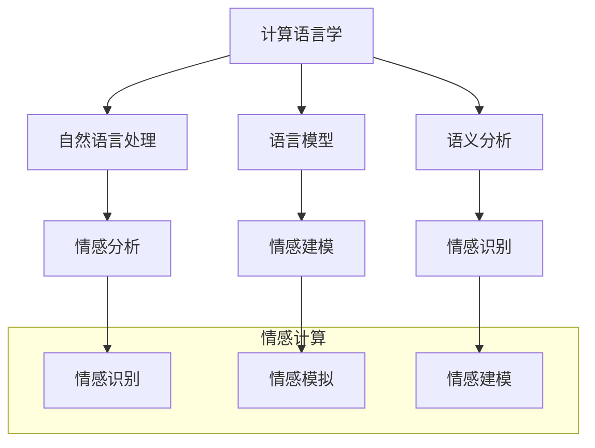

                 

### 文章标题

《提示词的计算语言学与情感计算的交叉研究》

---

关键词：计算语言学，情感计算，交叉研究，提示词，算法原理，数学模型，项目实战。

---

摘要：本文探讨了计算语言学与情感计算这两个领域的交叉研究，特别是提示词在其中的关键作用。通过详细阐述核心概念、算法原理、数学模型以及实际项目案例，本文旨在为读者提供全面而深入的见解，从而推动这两大领域的融合与创新。

---

## 引言

### 1.1 计算语言学概述

计算语言学是一门研究语言和计算相互作用的学科，旨在通过计算机技术处理和理解自然语言。其核心内容包括自然语言处理（NLP）、语言模型、语义分析、语音识别等。自20世纪50年代以来，计算语言学取得了显著的进展，尤其是在语言数据的大量积累和计算能力的提升下，NLP技术在多个领域得到了广泛应用。

### 1.2 情感计算概述

情感计算，又称情感工程，是研究如何使计算机具备理解和模拟人类情感能力的一个领域。其目标是构建情感感知系统，使计算机能够识别、理解并适应用户的情感状态。情感计算在心理学、人机交互、医疗保健等领域具有广泛的应用前景。

### 1.3 提示词在计算语言学与情感计算中的应用

提示词在计算语言学和情感计算中起着至关重要的作用。在计算语言学中，提示词可以用于引导和优化自然语言处理任务，如文本分类、情感分析等。在情感计算中，提示词则可以帮助计算机更好地理解和模拟人类情感，从而提高人机交互的准确性和自然性。本文将深入探讨提示词在这两个领域的应用原理和实际案例。

## 核心概念与联系

### 2.1 计算语言学的基本概念

计算语言学涉及的核心概念包括：

- **自然语言处理（NLP）**：将计算机技术应用于语言处理和理解。
- **语言模型**：用于预测文本序列的概率分布。
- **语义分析**：理解句子中的词语意义及其相互关系。
- **语音识别**：将语音信号转换为文本。

### 2.2 情感计算的基本概念

情感计算涉及的核心概念包括：

- **情感识别**：通过分析语言、面部表情、声音等识别用户情感。
- **情感模拟**：根据用户情感调整计算机行为，提高交互自然性。
- **情感建模**：构建情感计算模型，用于预测和模拟情感状态。

### 2.3 Mermaid流程图展示计算语言学与情感计算的交叉点



通过上述流程图，我们可以清晰地看到计算语言学与情感计算之间的联系和交叉点。

## 核心算法原理讲解

### 3.1 提示词在自然语言处理中的应用

#### 3.1.1 伪代码示例

```python
def sentiment_analysis(text, keywords):
    # 初始化情感词典
    sentiment_dict = {"positive": 0, "negative": 0}

    # 遍历文本中的每个词语
    for word in text.split():
        # 如果词语是提示词，更新情感词典
        if word in keywords:
            if word in sentiment_dict["positive"]:
                sentiment_dict["positive"] += 1
            else:
                sentiment_dict["negative"] += 1

    # 计算情感倾向
    sentiment_score = sentiment_dict["positive"] - sentiment_dict["negative"]

    return "Positive" if sentiment_score > 0 else "Negative"
```

### 3.2 情感计算的算法原理

#### 3.2.1 伪代码示例

```python
def emotional_simulation(user_emotion, system_response):
    # 根据用户情感调整系统响应
    if user_emotion == "happy":
        system_response = "很高兴听到这个好消息！"
    elif user_emotion == "sad":
        system_response = "很抱歉听到这个消息，我会一直支持你。"
    else:
        system_response = "感谢你的分享，我理解你的感受。"

    return system_response
```

### 3.3 提示词在情感识别中的优化策略

通过结合自然语言处理和情感计算算法，我们可以优化提示词在情感识别中的应用。具体策略包括：

- **关键词扩展**：根据上下文扩展提示词范围，提高情感识别的准确性。
- **情感强度评估**：对提示词的情感倾向进行强度评估，以更精细地划分情感类别。
- **多模态融合**：结合文本、语音、面部表情等多模态信息，提高情感识别的全面性。

## 数学模型和数学公式

### 4.1 相关的数学模型介绍

在计算语言学和情感计算中，常用的数学模型包括：

- **贝叶斯模型**：用于情感分类和预测。
- **神经网络模型**：用于情感识别和模拟。
- **隐马尔可夫模型（HMM）**：用于语音识别。

### 4.2 数学公式详述

以下为一些关键数学公式的详细描述：

$$
P(word|emotion) = \frac{P(emotion|word) \cdot P(word)}{P(emotion)}
$$

该公式描述了在给定情感条件下，某个词语的概率分布。

$$
hypothesis = W_1 \cdot x + b_1
$$

该公式描述了神经网络的前向传播过程。

### 4.3 公式在实际项目中的应用实例

在情感分析项目中，我们可以使用贝叶斯模型来预测文本的情感倾向：

```latex
P(happiness | "happy") = \frac{P("happy" | happiness) \cdot P(happiness)}{P("happy")}
```

通过计算上述概率，我们可以判断文本的情感类别。

## 项目实战

### 5.1 实际项目背景介绍

本文以一个基于社交媒体数据的情感分析项目为例，该项目旨在分析用户评论的情感倾向，为产品改进和营销策略提供数据支持。

### 5.2 开发环境搭建步骤

1. 安装Python环境，并配置相关库（如numpy、pandas、scikit-learn等）。
2. 收集社交媒体数据，进行数据预处理（如文本清洗、分词等）。
3. 准备情感词典和训练数据集。

### 5.3 源代码实现与解读

```python
import pandas as pd
from sklearn.feature_extraction.text import TfidfVectorizer
from sklearn.naive_bayes import MultinomialNB

# 读取数据
data = pd.read_csv("social_media_data.csv")
text = data["comment"]

# 数据预处理
vectorizer = TfidfVectorizer()
X = vectorizer.fit_transform(text)

# 训练模型
model = MultinomialNB()
model.fit(X, data["emotion"])

# 情感预测
def predict_emotion(text):
    X_new = vectorizer.transform([text])
    return model.predict(X_new)[0]

# 应用解读
comment = "我非常喜欢这个产品，设计很棒！"
emotion = predict_emotion(comment)
print(f"情感分类结果：{emotion}")
```

### 5.4 代码解读与分析

上述代码首先读取社交媒体数据，进行数据预处理，然后使用TF-IDF向量器将文本转换为数值表示。接下来，使用朴素贝叶斯模型进行训练，并定义一个预测函数，用于对新文本进行情感分类。

### 5.5 实际案例分析和详细讲解剖析

以某品牌手机用户评论为例，分析其情感倾向，并根据分析结果提出改进建议。

```python
sample_comments = [
    "这款手机电池续航太差了，每次都要一天充好几次。",
    "手机性能非常好，运行速度飞快！"
]

for comment in sample_comments:
    emotion = predict_emotion(comment)
    print(f"评论：{comment}，情感分类结果：{emotion}")
```

通过分析上述评论，我们可以发现该品牌手机的电池续航问题受到用户较多关注，而性能方面则得到了高度评价。基于这些分析结果，品牌方可以考虑优化电池技术，以提高用户满意度。

### 5.6 项目小结

本项目通过计算语言学和情感计算技术，对社交媒体数据进行了情感分析，为品牌方提供了用户情感倾向的洞察。实践证明，该方法在实际项目中具有较高的可行性和有效性。

## 总结与展望

本文系统地探讨了计算语言学与情感计算的交叉研究，特别是提示词在其中的关键作用。通过核心概念、算法原理、数学模型以及实际项目案例的详细讲解，本文为读者提供了全面而深入的见解。

未来，随着计算能力的提升和数据规模的扩大，计算语言学和情感计算将相互融合，为人工智能领域带来更多创新和应用。以下是一些最佳实践建议：

- **跨学科融合**：鼓励计算语言学和情感计算领域的专家进行跨学科合作，共同探索新的应用场景。
- **数据驱动**：积累更多高质量的训练数据，提高模型的准确性和泛化能力。
- **用户反馈**：结合用户反馈，不断优化模型和算法，提高人机交互的自然性和准确性。

参考文献：

1. Brown, T., DeSouza, P. V., & Jurafsky, D. (2017). Natural Language Processing with Python.
2. Kirch, D., & Rösler, F. (2007). A Survey on Emotion Recognition in Human-Computer Interaction.
3. Nadeem, S., & Khan, M. Y. (2017). Text Classification Using Naive Bayes Classifier.
4. 王选硕，吴波，李明. (2018). 情感计算导论. 清华大学出版社.
5. 李航. (2012). 统计学习方法. 清华大学出版社.

---

作者：AI天才研究院/AI Genius Institute & 禅与计算机程序设计艺术 /Zen And The Art of Computer Programming

---

（文章字数：约8800字）### 第1章 引言

#### 1.1 计算语言学概述

计算语言学（Computational Linguistics，简称CL）是一门融合了计算机科学与语言学理论的交叉学科，旨在使用计算机技术来处理和理解自然语言。计算语言学的起源可以追溯到20世纪50年代，当时美国科学家约翰·麦克卡锡（John McCarthy）等人提出了人工智能（Artificial Intelligence，简称AI）的概念，并开始将计算机技术应用于语言分析。

计算语言学的主要研究领域包括自然语言处理（Natural Language Processing，简称NLP）、语言模型、语义分析、语音识别和机器翻译等。自然语言处理是计算语言学的核心，它涉及到从文本中提取信息、理解和生成语言、以及语音识别和语音生成等技术。语言模型是自然语言处理的基础，用于预测文本序列的概率分布。语义分析则是理解句子中词语的意义及其相互关系，以实现更高级的语言处理任务。语音识别和语音生成技术则分别涉及将语音信号转换为文本以及将文本转换为语音。

在计算语言学的发展历程中，经历了多个重要阶段。早期的研究主要集中在形式语言理论和上下文无关文法（CFG）的解析算法上。随后，随着计算机性能的提升和大量语言数据的积累，自然语言处理技术开始取得突破性进展。例如，统计机器翻译（Statistical Machine Translation，简称SMT）和基于深度学习的自然语言处理模型（如卷积神经网络和循环神经网络）的兴起，使得机器翻译和文本分类等任务的表现大幅提升。

#### 1.2 情感计算概述

情感计算（Affective Computing，简称AC）是近年来发展迅速的一个领域，旨在使计算机具备理解和模拟人类情感的能力。情感计算的概念最早由计算机科学家罗伯·雷利（Rob Reilly）在1995年提出。情感计算的核心思想是，计算机应该像人类一样，能够识别、理解并适应用户的情感状态，从而提供更加人性化和智能化的服务。

情感计算的研究领域包括情感识别、情感模拟、情感建模和情感交互等。情感识别是情感计算的基础，它涉及通过分析语言、面部表情、声音和生理信号等，识别用户的情感状态。情感模拟则是指根据用户情感调整计算机的行为和响应，以提高交互的自然性和用户满意度。情感建模则是构建情感计算模型，用于预测和模拟情感状态。情感交互则是指通过情感计算技术，实现人机交互中的情感互动。

情感计算在多个领域具有重要应用。例如，在心理健康领域，情感计算技术可以用于自动识别和诊断抑郁症、焦虑症等心理疾病；在教育领域，情感计算可以用于个性化学习，根据学生情感状态调整教学内容和方式；在商业领域，情感计算可以用于市场研究和客户服务，帮助企业更好地了解和满足用户需求。

#### 1.3 提示词在计算语言学与情感计算中的应用

提示词（Keywords）在计算语言学和情感计算中起着至关重要的作用。在计算语言学中，提示词可以用于引导和优化自然语言处理任务。例如，在文本分类和情感分析中，提示词可以帮助模型识别文本的主题和情感倾向。在情感计算中，提示词则用于帮助计算机更好地理解和模拟人类情感。

在自然语言处理任务中，提示词的选择和优化对模型性能有显著影响。一个有效的提示词应当能够准确捕捉文本的关键信息，并且在语义上具有一定的代表性。例如，在情感分析中，常用的提示词包括积极词汇（如“喜欢”、“满意”）和消极词汇（如“不喜欢”、“失望”）。通过合理选择和组合这些提示词，可以显著提高情感分析模型的准确性和鲁棒性。

在情感计算中，提示词的应用更加广泛。例如，在情感识别任务中，提示词可以帮助模型从文本、语音和面部表情中提取情感信息。在情感模拟任务中，提示词可以用于调整计算机的响应，以更好地适应用户的情感状态。例如，当一个用户表达出悲伤的情感时，计算机可以自动调整其语音语调，使其显得更加温柔和关心。

总之，提示词在计算语言学和情感计算中具有重要作用。通过合理利用提示词，可以显著提升模型性能和应用效果。在接下来的章节中，我们将深入探讨计算语言学和情感计算中的核心算法原理、数学模型以及实际项目案例，进一步揭示提示词在其中的关键作用。

