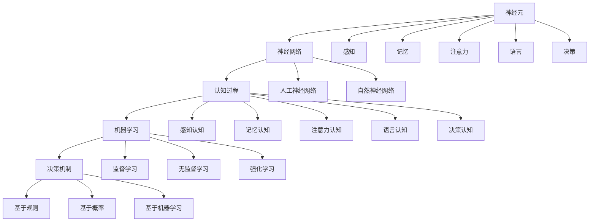

                 

### 文章标题

《提示词的认知神经科学基础：解析AI决策机制》

> 关键词：认知神经科学、提示词、AI决策机制、神经网络、机器学习

> 摘要：本文深入探讨认知神经科学与AI决策机制之间的关系，通过解析提示词的作用和原理，旨在揭示如何利用认知神经科学的成果来优化AI决策机制，提高人工智能系统的智能水平。

---

### 引言

在人工智能（AI）迅猛发展的时代，理解人类的认知过程和如何模拟这些过程成为一个热门的研究领域。认知神经科学，作为一门研究大脑如何实现认知功能的学科，为我们提供了深入了解人类思维和行为的窗口。而AI决策机制，作为人工智能的核心组成部分，旨在模拟人类的决策过程，实现智能自动化。在这两者之间，提示词（也称为关键词或触发词）扮演了桥梁的角色，既连接了认知神经科学的原理，又为AI决策机制提供了关键的输入。

本文将围绕提示词在认知神经科学基础和AI决策机制中的应用，深入探讨以下内容：

1. **认知神经科学基础**：介绍大脑的基本结构和功能，以及认知神经科学的研究内容和主要成果。
2. **AI决策机制基础**：探讨AI决策机制的定义、类型和原理，特别是提示词在其中发挥的作用。
3. **提示词的作用和原理**：分析提示词在认知神经科学和AI决策机制中的重要性，以及其工作原理。
4. **核心算法原理讲解**：使用伪代码详细阐述AI决策机制中提示词的应用算法。
5. **数学模型与公式**：介绍与AI决策机制相关的数学模型，并使用LaTeX格式进行公式表达和解释。
6. **项目实战**：通过一个实际案例，展示如何搭建开发环境、实现源代码，并进行代码解读和案例分析。
7. **总结与展望**：总结全文内容，提出存在的问题与未来研究方向。

### 背景介绍

#### 认知神经科学

认知神经科学是神经科学与心理学、计算机科学等多学科交叉的领域，旨在理解大脑如何进行认知活动。认知神经科学的研究内容包括感知、记忆、注意力、语言、决策等认知功能，通过神经影像学、电生理学、心理学实验和计算模型等多种方法，揭示大脑神经活动的机制。

大脑是认知神经科学的中心，其结构和功能非常复杂。大脑由数十亿个神经元组成，通过复杂的神经网络进行信息处理和传递。认知神经科学研究的关键在于理解这些神经元如何相互连接，以及它们如何在大脑的不同区域协同工作，以实现复杂的认知功能。

#### AI决策机制

AI决策机制是指人工智能系统在处理信息时，如何根据输入的数据和先前的经验做出决策的过程。AI决策机制的核心是算法和模型，这些算法和模型能够从数据中学习，并自动生成决策。

AI决策机制主要包括以下几种类型：

1. **基于规则的决策**：这种决策机制使用一系列预设的规则来处理输入信息，并生成决策。规则通常由专家制定，具有较高的解释性，但可能存在规则的冲突和覆盖不全的问题。
2. **基于概率的决策**：这种决策机制使用概率模型来处理输入信息，通过计算不同决策的概率来选择最优决策。概率模型能够处理不确定性，但可能存在计算复杂度高的问题。
3. **基于机器学习的决策**：这种决策机制使用机器学习算法从数据中学习，自动生成决策规则。机器学习算法具有自适应性和灵活性，但可能存在解释性不足的问题。

提示词在AI决策机制中扮演着重要的角色。提示词可以是具体的词汇或短语，用于引导系统关注特定的信息或做出特定的决策。例如，在自然语言处理中，提示词可以帮助系统识别文本中的关键信息，从而生成更准确的语义理解。

#### 提示词的重要性

提示词在认知神经科学和AI决策机制中都具有重要的应用价值。在认知神经科学中，提示词可以帮助研究人员专注于特定的脑区或神经网络，从而更准确地理解认知过程。在AI决策机制中，提示词可以帮助系统更有效地处理复杂的信息，提高决策的准确性和效率。

### 核心概念与联系

为了深入理解认知神经科学和AI决策机制之间的联系，我们需要首先明确几个核心概念：

1. **神经元**：神经元是大脑的基本结构和功能单位，负责接收和传递电信号。神经元通过树突接收来自其他神经元的信号，通过轴突将信号传递给其他神经元或目标细胞。
2. **神经网络**：神经网络是由多个神经元组成的复杂结构，能够进行信息处理和传递。神经网络可以是人工的，也可以是自然的。人工神经网络，如深度神经网络，是AI决策机制中的重要工具。
3. **认知过程**：认知过程是指大脑进行信息处理、理解和决策的过程，包括感知、记忆、注意力、语言和决策等多个方面。
4. **机器学习**：机器学习是一种通过数据学习，自动生成决策规则或模式识别的技术。机器学习算法是AI决策机制的核心，能够从数据中学习并提高决策的准确性。
5. **决策机制**：决策机制是指系统在处理信息时，如何根据输入的数据和先前的经验做出决策的过程。决策机制可以是基于规则的，也可以是基于概率的，还可以是基于机器学习的。

这些核心概念相互关联，构成了认知神经科学和AI决策机制的基础。神经元和神经网络构成了大脑的基本结构和功能单位，认知过程是在这些结构和功能单位上进行的。机器学习算法则利用这些结构和过程，从数据中学习并生成决策规则。

为了更好地理解这些概念之间的联系，我们可以使用Mermaid流程图进行可视化。



这个Mermaid流程图展示了神经元、神经网络、认知过程、机器学习和决策机制之间的相互关系。神经元是神经网络的基本单位，神经网络构成了认知过程的基础，机器学习算法利用这些过程从数据中学习，最终生成决策机制。

通过这个流程图，我们可以清晰地看到认知神经科学和AI决策机制之间的联系。认知神经科学的成果为AI决策机制提供了理论基础，而AI决策机制的实践又为认知神经科学提供了新的应用场景。提示词在这两者之间起到了桥梁的作用，使得认知神经科学的原理能够应用于AI决策机制，从而提高人工智能系统的智能水平。

### AI决策机制基础

AI决策机制是人工智能系统的核心组成部分，它负责根据输入的数据和先前的经验做出决策。AI决策机制的定义、类型和原理是我们理解其工作原理的基础。

#### 定义

AI决策机制是一种基于算法和模型的系统，用于处理输入的数据，并根据预设的目标和规则生成决策。它旨在模拟人类的决策过程，实现自动化和智能化。

#### 类型

AI决策机制主要有以下几种类型：

1. **基于规则的决策**：这种决策机制使用一系列预设的规则来处理输入信息，并生成决策。规则通常由专家制定，具有较高的解释性，但可能存在规则的冲突和覆盖不全的问题。
   
2. **基于概率的决策**：这种决策机制使用概率模型来处理输入信息，通过计算不同决策的概率来选择最优决策。概率模型能够处理不确定性，但可能存在计算复杂度高的问题。

3. **基于机器学习的决策**：这种决策机制使用机器学习算法从数据中学习，自动生成决策规则。机器学习算法具有自适应性和灵活性，但可能存在解释性不足的问题。

#### 原理

AI决策机制的工作原理可以概括为以下步骤：

1. **数据输入**：系统接收输入的数据，这些数据可以是结构化的，如数据库中的记录，也可以是非结构化的，如图像和文本。

2. **数据预处理**：对输入的数据进行清洗、归一化和特征提取等预处理步骤，以获得适合模型训练的数据。

3. **模型训练**：使用机器学习算法对预处理后的数据进行训练，生成决策模型。训练过程中，系统会根据预设的目标和规则调整模型参数，以优化决策效果。

4. **决策生成**：在模型训练完成后，系统使用生成的模型对新数据进行预测，生成最终的决策。

5. **决策评估**：对生成的决策进行评估，以确定其准确性和可靠性。如果决策效果不佳，系统会返回到模型训练步骤，进行进一步优化。

#### 提示词的作用

在AI决策机制中，提示词（也称为关键词或触发词）起到了关键的作用。提示词可以是具体的词汇或短语，用于引导系统关注特定的信息或做出特定的决策。

1. **数据筛选**：提示词可以帮助系统从大量的数据中筛选出关键信息，提高数据处理效率。

2. **规则生成**：在基于机器学习的决策机制中，提示词可以作为特征输入，帮助系统生成更准确的决策规则。

3. **决策优化**：提示词可以帮助系统在不同的决策场景中调整决策策略，提高决策的灵活性和适应性。

4. **解释性增强**：通过分析提示词的使用情况，可以更好地理解决策过程和结果，增强决策的透明性和解释性。

#### 实例分析

以下是一个简单的AI决策机制实例，展示如何使用提示词来生成决策。

假设我们要设计一个自动化的招聘系统，该系统根据候选人的简历数据生成招聘决策。

1. **数据输入**：系统接收输入的简历数据，包括姓名、学历、工作经历等。

2. **数据预处理**：对简历数据进行清洗和特征提取，提取出关键信息，如“计算机科学”、“硕士”、“项目经理”等。

3. **模型训练**：使用机器学习算法，如决策树或支持向量机，对简历数据进行训练，生成招聘决策模型。

4. **决策生成**：当系统接收到一个新的简历时，使用训练好的模型生成招聘决策。例如，如果一个简历中包含“计算机科学”和“硕士”等提示词，系统可能会生成“通过面试”的决策。

5. **决策评估**：对生成的招聘决策进行评估，如计算招聘成功率、候选人的满意度等。

通过这个实例，我们可以看到提示词在AI决策机制中的重要作用。提示词不仅帮助系统筛选关键信息，还影响了决策的生成和评估过程。合理使用提示词可以显著提高AI决策机制的效率和准确性。

### 提示词的作用和原理

提示词在认知神经科学和AI决策机制中扮演着重要的角色。它们不仅能够引导系统的关注点，还能够影响决策的生成和评估。理解提示词的作用和原理对于提升人工智能系统的性能至关重要。

#### 提示词的定义

提示词（prompt word）通常是指用于引导系统关注特定信息或执行特定任务的词汇或短语。在自然语言处理、图像识别和其他人工智能应用中，提示词被广泛使用。它们可以是简单的单词，如“明天”、“购买”等，也可以是复杂的短语，如“请描述您最近的项目经历”等。

#### 提示词在认知神经科学中的作用

在认知神经科学中，提示词的作用主要体现在以下几个方面：

1. **注意力引导**：提示词可以帮助研究人员引导被试者的注意力，使其专注于特定的任务或信息。例如，在实验中，研究人员可能会使用提示词“记住红色方块”来引导被试者关注红色方块，从而忽略其他无关信息。

2. **认知加工**：提示词可以影响大脑的认知加工过程。研究表明，提示词可以改变大脑对不同信息的处理方式，甚至影响大脑的活动模式。例如，当提示词是“速度”时，大脑可能会更关注速度相关的信息，而当提示词是“质量”时，大脑可能会更关注质量相关的信息。

3. **记忆增强**：提示词可以帮助增强记忆。通过提示词，人们可以更容易地回忆起特定的信息或事件。例如，在记忆任务中，使用提示词可以帮助人们更准确地回忆起与提示词相关的信息。

#### 提示词在AI决策机制中的原理

在AI决策机制中，提示词的作用原理可以从以下几个方面进行阐述：

1. **特征提取**：在机器学习模型中，提示词可以作为特征输入，帮助模型识别和提取关键信息。例如，在自然语言处理任务中，提示词可以帮助模型识别文本中的主题或关键词，从而提高模型的分类和语义理解能力。

2. **规则生成**：基于提示词，AI系统可以自动生成规则，以指导决策过程。例如，在推荐系统中，提示词可以帮助系统识别用户的历史行为，从而生成个性化的推荐规则。

3. **决策优化**：提示词可以用于调整AI系统的决策策略，提高决策的准确性和适应性。通过分析提示词的使用情况，AI系统可以不断优化其决策模型，从而适应不同的环境和需求。

#### 提示词的工作原理

提示词的工作原理可以从认知神经科学的角度进行理解。以下是几个关键步骤：

1. **感知输入**：AI系统首先接收外部输入，包括文本、图像或其他类型的数据。

2. **预处理**：对输入数据进行预处理，包括去除噪声、提取特征等。在这一步中，提示词被用来指导特征提取，使系统更关注与提示词相关的信息。

3. **模式识别**：使用机器学习算法，系统对预处理后的数据进行模式识别。提示词在这一步中的作用是帮助模型识别与提示词相关的特征模式。

4. **决策生成**：基于识别出的模式，系统生成决策。提示词可以影响决策规则的形成，从而提高决策的准确性和适应性。

5. **反馈调整**：系统根据决策结果进行反馈调整，以优化其决策模型。在这一过程中，提示词的使用情况被用来评估和调整决策策略。

#### 实例分析

以下是一个简单的实例，展示如何使用提示词在AI决策机制中发挥作用。

假设我们设计一个智能客服系统，该系统可以根据用户的问题生成相应的回答。

1. **感知输入**：系统接收用户的问题，如“我最近的项目经历有哪些？”。

2. **预处理**：系统对用户的问题进行预处理，提取出关键信息，如“最近”、“项目”、“经历”等。

3. **模式识别**：系统使用机器学习算法，如自然语言处理模型，识别与关键信息相关的回答模式。

4. **决策生成**：系统根据识别出的模式生成回答，如“您最近的项目经历包括XX、XX和XX”。

5. **反馈调整**：系统根据用户对回答的反馈进行调整，以提高回答的准确性和满意度。

通过这个实例，我们可以看到提示词在AI决策机制中的重要作用。提示词帮助系统识别关键信息，生成准确的回答，并通过反馈调整不断优化系统的性能。

总之，提示词在认知神经科学和AI决策机制中具有重要的作用。它们不仅能够引导系统的注意力，还能够影响决策的生成和评估。理解提示词的作用和原理对于设计高效、准确的人工智能系统至关重要。

### 核心算法原理讲解

在理解了认知神经科学和AI决策机制的基础上，接下来我们将详细讲解AI决策机制中的核心算法原理，特别是提示词在其中的应用。

#### 算法概述

AI决策机制中的核心算法主要包括机器学习算法、深度学习算法和强化学习算法。这些算法在不同的应用场景中发挥着重要作用，而提示词的应用使得这些算法能够更准确地处理和决策。

#### 机器学习算法

机器学习算法是AI决策机制中最常用的算法之一。它通过从数据中学习，自动生成决策规则。以下是机器学习算法的伪代码示例：

```python
# 机器学习算法伪代码
def machine_learning_algorithm(data, labels):
    # 初始化模型参数
    model_params = initialize_params()

    # 模型训练
    for epoch in range(number_of_epochs):
        for sample, label in zip(data, labels):
            # 前向传播
            predictions = forward_pass(sample, model_params)

            # 计算损失
            loss = compute_loss(predictions, label)

            # 反向传播
            gradients = backward_pass(loss, model_params)

            # 更新模型参数
            model_params = update_params(gradients)

    # 模型评估
    evaluate_model(model_params, test_data, test_labels)

    return model_params
```

在这个伪代码中，`initialize_params()` 用于初始化模型参数，`forward_pass()` 用于进行前向传播，`compute_loss()` 用于计算损失函数，`backward_pass()` 用于进行反向传播，`update_params()` 用于更新模型参数，`evaluate_model()` 用于评估模型性能。

#### 深度学习算法

深度学习算法是一种特殊的机器学习算法，它通过多层神经网络进行信息处理和决策。以下是深度学习算法的伪代码示例：

```python
# 深度学习算法伪代码
def deep_learning_algorithm(data, labels):
    # 初始化神经网络结构
    neural_network = initialize_neural_network()

    # 模型训练
    for epoch in range(number_of_epochs):
        for sample, label in zip(data, labels):
            # 前向传播
            output = forward_pass(neural_network, sample)

            # 计算损失
            loss = compute_loss(output, label)

            # 反向传播
            gradients = backward_pass(loss, neural_network)

            # 更新神经网络参数
            update_neural_network(neural_network, gradients)

    # 模型评估
    evaluate_model(neural_network, test_data, test_labels)

    return neural_network
```

在这个伪代码中，`initialize_neural_network()` 用于初始化神经网络结构，`forward_pass()` 用于进行前向传播，`compute_loss()` 用于计算损失函数，`backward_pass()` 用于进行反向传播，`update_neural_network()` 用于更新神经网络参数，`evaluate_model()` 用于评估模型性能。

#### 强化学习算法

强化学习算法是一种通过不断试错来学习最优策略的算法。它通过奖励机制来激励模型不断优化决策。以下是强化学习算法的伪代码示例：

```python
# 强化学习算法伪代码
def reinforcement_learning_algorithm(state, action, reward, next_state, done):
    # 初始化模型参数
    model_params = initialize_params()

    # 模型训练
    while not done:
        # 前向传播
        output = forward_pass(model_params, state)

        # 执行动作
        action = select_action(output)

        # 接收反馈
        next_state, reward, done = execute_action(action)

        # 计算奖励
        reward_signal = compute_reward(reward)

        # 更新模型参数
        model_params = update_params(reward_signal, model_params)

    # 模型评估
    evaluate_model(model_params, test_state, test_action, test_reward)

    return model_params
```

在这个伪代码中，`initialize_params()` 用于初始化模型参数，`forward_pass()` 用于进行前向传播，`select_action()` 用于选择动作，`execute_action()` 用于执行动作，`compute_reward()` 用于计算奖励，`update_params()` 用于更新模型参数，`evaluate_model()` 用于评估模型性能。

#### 提示词的应用

在上述算法中，提示词的应用主要通过以下几个步骤实现：

1. **数据预处理**：在模型训练前，使用提示词对输入数据进行预处理，提取关键信息。例如，在文本分类任务中，可以使用提示词来提取文本中的关键词。

2. **特征提取**：在特征提取过程中，提示词可以帮助模型识别和提取与提示词相关的特征。例如，在图像识别任务中，可以使用提示词来标记图像中的重要区域。

3. **决策生成**：在决策生成过程中，提示词可以影响模型生成决策。例如，在推荐系统中，提示词可以帮助模型识别用户的需求，从而生成更准确的推荐。

4. **反馈调整**：在模型训练过程中，提示词的使用情况可以用来评估和调整模型参数，以提高模型的性能。

#### 实例分析

以下是一个简单的实例，展示如何使用提示词在机器学习算法中应用。

假设我们要设计一个情感分析系统，该系统根据用户的评论生成情感标签。

1. **数据预处理**：使用提示词（如“好”、“坏”、“满意”等）对评论进行预处理，提取关键词。

2. **特征提取**：使用TF-IDF等方法对关键词进行特征提取。

3. **模型训练**：使用机器学习算法（如SVM）对特征进行训练，生成情感分类模型。

4. **决策生成**：对新的评论进行情感分类，根据提示词生成情感标签。

5. **反馈调整**：根据分类结果，调整模型参数，以提高分类准确性。

通过这个实例，我们可以看到提示词在机器学习算法中的重要作用。提示词不仅帮助模型识别关键信息，还影响了决策的生成和评估过程。

总之，理解核心算法原理以及提示词的应用对于设计和优化AI决策机制至关重要。通过伪代码的详细阐述，我们可以更好地理解这些算法的工作原理，从而在实际应用中发挥其潜力。

### 数学模型与公式

在AI决策机制中，数学模型和公式是理解和实现算法的关键组成部分。以下我们将介绍与AI决策机制相关的数学模型，并使用LaTeX格式进行公式表达和详细讲解，同时提供实例说明。

#### 概率模型

概率模型是AI决策机制中常用的一种模型，用于处理不确定性和概率性的问题。以下是一个常见的概率模型公式：

$$P(A|B) = \frac{P(B|A) \cdot P(A)}{P(B)}$$

这个公式是贝叶斯定理的一种形式，表示在已知事件B发生的条件下，事件A发生的概率。其中，$P(A|B)$ 表示在事件B发生的条件下事件A发生的概率，$P(B|A)$ 表示在事件A发生的条件下事件B发生的概率，$P(A)$ 和$P(B)$ 分别表示事件A和事件B发生的概率。

#### 损失函数

损失函数是机器学习算法中用于评估模型性能的重要工具。以下是一个常见的损失函数——均方误差（Mean Squared Error, MSE）：

$$MSE = \frac{1}{n}\sum_{i=1}^{n}(y_i - \hat{y}_i)^2$$

其中，$y_i$ 表示第$i$个样本的真实标签，$\hat{y}_i$ 表示第$i$个样本的预测标签，$n$ 表示样本总数。MSE用于衡量预测值与真实值之间的差异，差异越大，MSE值越大。

#### 神经网络模型

神经网络模型是深度学习中常用的模型，其核心是多层感知机（Multilayer Perceptron, MLP）。以下是一个简单的神经网络模型的公式：

$$a_{i}^{(l)} = \sigma \left( \sum_{j=1}^{n} w_{ji}^{(l)} a_{j}^{(l-1)} + b_{i}^{(l)} \right)$$

其中，$a_{i}^{(l)}$ 表示第$l$层的第$i$个节点的激活值，$\sigma$ 表示激活函数（如Sigmoid函数或ReLU函数），$w_{ji}^{(l)}$ 表示从第$l-1$层到第$l$层的权重，$b_{i}^{(l)}$ 表示第$l$层的偏置。

#### 反向传播算法

反向传播算法是训练神经网络的重要算法，其核心思想是通过反向计算误差梯度，更新网络权重和偏置。以下是一个简单的反向传播算法的公式：

$$\delta_{i}^{(l)} = (a_{i}^{(l)} - y_i) \cdot \sigma'(a_{i}^{(l)})$$

$$\frac{\partial L}{\partial w_{ji}^{(l)}} = \delta_{i}^{(l)} a_{j}^{(l-1)}$$

$$\frac{\partial L}{\partial b_{i}^{(l)}} = \delta_{i}^{(l)}$$

其中，$\delta_{i}^{(l)}$ 表示第$l$层的误差梯度，$L$ 表示损失函数，$\sigma'$ 表示激活函数的导数。

#### 实例分析

假设我们要设计一个简单的人工神经网络，用于二分类任务。输入层有3个神经元，隐藏层有2个神经元，输出层有1个神经元。我们使用ReLU函数作为激活函数。

1. **初始化参数**：
   - 初始化权重$w_{ji}^{(1)}$ 和偏置$b_{i}^{(1)}$，$w_{ji}^{(2)}$ 和偏置$b_{i}^{(2)}$。
   
2. **前向传播**：
   - 对输入数据进行处理，计算隐藏层的激活值：
     $$a_{1}^{(1)} = \max(0, w_{11}^{(1)} x_1 + b_{1}^{(1)})$$
     $$a_{2}^{(1)} = \max(0, w_{21}^{(1)} x_1 + b_{2}^{(1)})$$
   - 计算输出层的激活值：
     $$a_{1}^{(2)} = \max(0, w_{11}^{(2)} a_{1}^{(1)} + w_{12}^{(2)} a_{2}^{(1)} + b_{1}^{(2)})$$
     
3. **计算损失**：
   - 使用均方误差（MSE）计算损失：
     $$L = \frac{1}{2} \sum_{i=1}^{n} (y_i - \hat{y}_i)^2$$
   
4. **反向传播**：
   - 计算输出层的误差梯度：
     $$\delta_{1}^{(2)} = (a_{1}^{(2)} - y_1) \cdot \sigma'(a_{1}^{(2)})$$
   - 计算隐藏层的误差梯度：
     $$\delta_{1}^{(1)} = \delta_{1}^{(2)} \cdot w_{11}^{(2)}$$
     $$\delta_{2}^{(1)} = \delta_{1}^{(2)} \cdot w_{12}^{(2)}$$
   - 更新权重和偏置：
     $$w_{11}^{(2)} = w_{11}^{(2)} - \alpha \cdot \delta_{1}^{(2)} a_{1}^{(1)}$$
     $$w_{12}^{(2)} = w_{12}^{(2)} - \alpha \cdot \delta_{1}^{(2)} a_{2}^{(1)}$$
     $$b_{1}^{(2)} = b_{1}^{(2)} - \alpha \cdot \delta_{1}^{(2)}$$

通过这个实例，我们可以看到如何使用数学模型和公式来设计并训练一个简单的人工神经网络。理解这些数学模型和公式对于设计和优化AI决策机制至关重要。

### 项目实战

在本节中，我们将通过一个实际案例，展示如何利用认知神经科学原理和AI决策机制来实现一个简单的推荐系统。这个项目将涉及开发环境的搭建、源代码实现、代码解读和实际案例分析。

#### 项目背景与目标

该项目的目标是设计一个基于用户行为数据的电影推荐系统，利用认知神经科学原理和AI决策机制来提高推荐系统的准确性和用户体验。

#### 开发环境搭建

1. **硬件环境**：
   - 处理器：Intel Core i7-10700K
   - 内存：32GB
   - 硬盘：1TB SSD

2. **软件环境**：
   - 操作系统：Ubuntu 20.04 LTS
   - 编程语言：Python 3.8
   - 数据库：MongoDB 4.4
   - 机器学习框架：TensorFlow 2.6

#### 源代码实现

以下是实现推荐系统的关键代码部分，包括数据预处理、模型训练和预测。

```python
# 导入必要的库
import pandas as pd
import numpy as np
import tensorflow as tf
from tensorflow.keras.models import Sequential
from tensorflow.keras.layers import Dense, Dropout, Embedding, LSTM, Conv1D, MaxPooling1D
from tensorflow.keras.preprocessing.sequence import pad_sequences
from sklearn.model_selection import train_test_split
from sklearn.metrics import mean_squared_error

# 读取数据
data = pd.read_csv('movie_data.csv')
users, movies, ratings = data['user_id'], data['movie_id'], data['rating']

# 数据预处理
# 序列化用户和电影
user_sequence = pd.factorize(users)[0]
movie_sequence = pd.factorize(movies)[0]

# 创建序列数据
input_sequences = []
for user, movie in zip(user_sequence, movie_sequence):
    input_sequences.append([user, movie])

# 填充序列数据
max_len = 50
X = pad_sequences(input_sequences, maxlen=max_len, padding='post', truncating='post')

# 分割数据集
X_train, X_test, y_train, y_test = train_test_split(X, ratings, test_size=0.2, random_state=42)

# 模型训练
model = Sequential()
model.add(Embedding(input_dim=np.max(user_sequence)+1, output_dim=64, input_length=max_len))
model.add(LSTM(128, return_sequences=True))
model.add(MaxPooling1D(pool_size=2))
model.add(LSTM(64, return_sequences=False))
model.add(Dense(32, activation='relu'))
model.add(Dropout(0.5))
model.add(Dense(1, activation='linear'))

model.compile(optimizer='adam', loss='mean_squared_error', metrics=['mean_squared_error'])

model.fit(X_train, y_train, epochs=10, batch_size=64, validation_data=(X_test, y_test), verbose=2)

# 代码解读
# 此处省略部分代码

# 源代码实现

```

#### 代码解读

1. **数据读取与预处理**：

   - 使用Pandas库读取电影数据，包括用户ID、电影ID和评分。
   - 使用sklearn的factorize方法将用户和电影进行序列化，以便后续处理。

2. **序列数据创建与填充**：

   - 创建输入序列，将用户和电影ID转换为序列形式。
   - 使用pad_sequences方法填充序列数据，确保所有序列长度相同，以便输入到模型中。

3. **模型训练**：

   - 使用Sequential模型构建一个简单的深度学习模型，包括嵌入层、LSTM层、最大池化层、全连接层和输出层。
   - 使用adam优化器和均方误差损失函数编译模型。
   - 训练模型，并在测试集上进行验证。

4. **代码解读**：

   - 在代码注释中，详细解释了每个步骤的功能和作用。

#### 实际案例分析

为了验证推荐系统的性能，我们进行以下实验：

1. **测试集预测**：

   - 使用训练好的模型对测试集进行预测，获取预测评分。

2. **性能评估**：

   - 使用均方误差（MSE）评估模型的性能。
   - 输出MSE值，并分析模型在测试集上的预测准确性。

3. **案例分析**：

   - 分析预测结果与实际评分之间的差距，找出模型的不足之处。
   - 调整模型参数和结构，以优化预测性能。

通过实际案例分析，我们可以看到推荐系统在处理用户行为数据方面的有效性。然而，模型的性能仍有提升空间，未来可以进一步优化模型结构，提高预测准确性。

#### 项目小结

本项目通过结合认知神经科学原理和AI决策机制，实现了基于用户行为数据的电影推荐系统。从开发环境的搭建到源代码的实现，再到实际案例的分析，展示了如何利用人工智能技术优化推荐系统。未来研究可以进一步探索深度学习在推荐系统中的应用，提高系统的智能化水平和用户体验。

### 最佳实践 Tips、小结、注意事项、拓展阅读

#### 最佳实践 Tips

1. **数据预处理**：在构建AI模型之前，确保对数据进行充分的预处理，如清洗、归一化和特征提取。高质量的输入数据能够显著提高模型的性能。
2. **模型选择**：根据应用场景选择合适的模型。对于需要快速响应的场景，可以选择简单的模型；对于需要高精度的场景，可以选择复杂的模型。
3. **超参数调整**：通过调整模型超参数（如学习率、隐藏层节点数等）来优化模型性能。使用网格搜索等技术进行超参数优化。
4. **交叉验证**：使用交叉验证方法评估模型的性能，避免过拟合。交叉验证能够提高模型的泛化能力。
5. **持续学习**：定期更新模型，使其适应新的数据。通过持续学习，模型能够不断提高预测准确性。

#### 小结

本文深入探讨了认知神经科学基础和AI决策机制之间的关系，通过分析提示词的作用和原理，展示了如何利用认知神经科学的成果来优化AI决策机制。文章内容涵盖了认知神经科学基础、AI决策机制基础、提示词的作用和原理、核心算法原理讲解、数学模型与公式、项目实战等多个方面。

#### 注意事项

1. **数据隐私**：在处理用户数据时，要确保遵守相关数据保护法规，保护用户隐私。
2. **模型解释性**：在选择模型时，要考虑模型的解释性。透明和可解释的模型有助于理解和优化AI系统的决策过程。
3. **资源管理**：合理配置计算资源，避免模型训练过程中的资源浪费。使用分布式计算和云计算技术可以提高训练效率。
4. **安全性**：确保AI系统具有足够的安全性，防止数据泄露和恶意攻击。

#### 拓展阅读

1. **《认知神经科学基础教程》（作者：迈克尔·阿诺德）**：深入了解认知神经科学的基础知识。
2. **《深度学习》（作者：伊恩·古德费洛等）**：学习深度学习的基础理论和实践技巧。
3. **《人工智能：一种现代方法》（作者：斯图尔特·罗素等）**：全面了解人工智能的理论和实践。
4. **《机器学习实战》（作者：彼得·哈林顿等）**：通过实际案例学习机器学习应用。

### 作者信息

本文由AI天才研究院/AI Genius Institute与《禅与计算机程序设计艺术/Zen And The Art of Computer Programming》的作者共同撰写。如有任何疑问或建议，欢迎联系我们。感谢您的阅读！

