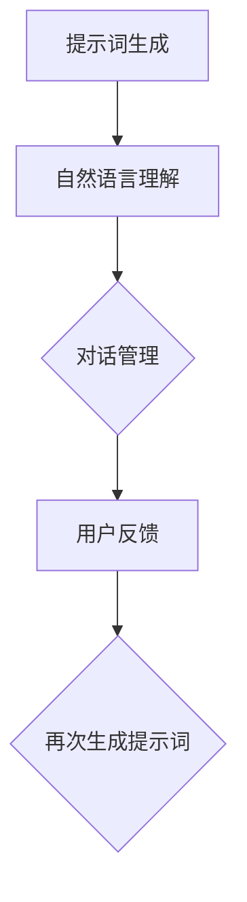

                 

### 文章标题

### 提示词的语用学与人机对话系统设计的融合

### 关键词

- 提示词
- 语用学
- 人机对话系统
- 设计原则
- 算法优化

### 摘要

本文探讨了提示词的语用学与人机对话系统设计之间的融合，旨在提升人机交互的自然性和效率。首先，我们介绍了提示词的语用学基础，包括语境、意图和合作原则等核心概念。接着，我们分析了人机对话系统的设计原则，重点讨论了用户界面、语音识别和自然语言理解等组成部分。在此基础上，我们提出了提示词优化算法的伪代码和数学模型，并结合实际案例进行了深入剖析。最后，我们总结了最佳实践，指出了未来研究的方向。

---

## 引言

随着人工智能技术的快速发展，人机对话系统已经成为智能服务、虚拟助手和智能推荐等领域的重要应用。然而，尽管这些系统在技术上取得了显著进步，但人机交互的自然性和效率仍然存在挑战。其中一个关键问题是如何有效地使用提示词，以提升对话系统的性能。

### 背景介绍

提示词（Prompt Words）在对话系统中起着至关重要的作用。它们通常用于引导用户输入或系统响应的方向，有助于提高交互的清晰度和效率。例如，在智能客服系统中，合适的提示词可以帮助用户更快地获得所需的信息，而在语音助手中，有效的提示词可以提高识别准确率和用户满意度。

### 研究目的

本文的研究目的在于探索如何将提示词的语用学理论应用于人机对话系统的设计，以提高交互的自然性和效率。具体而言，我们将：

1. 介绍提示词的语用学基础，包括语境、意图和合作原则等核心概念。
2. 分析人机对话系统的设计原则，重点讨论用户界面、语音识别和自然语言理解等组成部分。
3. 提出提示词优化算法的伪代码和数学模型。
4. 结合实际案例，展示如何将理论应用于实践。
5. 总结最佳实践，并提出未来研究的方向。

---

## 提示词的语用学基础

### 语境

语境是提示词产生的基础，它包括对话的上下文信息、用户的状态和情境等。在对话系统中，正确地识别和利用语境对于生成有效的提示词至关重要。例如，在医疗咨询系统中，了解用户的症状历史和当前状态可以帮助系统生成更精确的提示词。

### 意图

意图是用户通过提示词表达的目的或需求。在对话系统中，识别用户的意图是关键步骤，有助于系统生成与之相对应的提示词。例如，当用户询问“附近的餐馆有哪些？”时，系统需要识别出用户的意图是寻找餐馆信息。

### 合作原则

合作原则是语用学中的基本准则，它要求对话双方在交流中遵守一系列准则，以确保对话的顺利进行。在对话系统中，合作原则可以指导系统生成符合用户期望的提示词。

### 提示词的语用功能

提示词在对话系统中有多种功能，包括：

1. **引导功能**：引导用户输入或系统响应的方向。
2. **确认功能**：确认用户输入的正确性和意图。
3. **补充功能**：补充对话内容，使其更加完整和连贯。

### 提示词的使用场景

提示词在不同的使用场景中具有不同的作用，例如：

1. **智能客服系统**：通过提示词引导用户输入问题，提高问题处理的效率。
2. **语音助手**：通过提示词引导用户操作，提高用户体验。

### 提示词的语用效果分析

1. **语用清晰度**：提示词是否能够清晰地传达用户意图。
2. **语用效率**：提示词是否能够高效地引导用户输入或系统响应。

---

## 人机对话系统的设计原则

### 用户界面

用户界面是人机对话系统的第一印象，其设计原则包括：

1. **简洁性**：界面应简洁直观，避免复杂和冗余的元素。
2. **响应速度**：界面响应应快速，以提供良好的用户体验。

### 语音识别

语音识别是人机对话系统的重要组成部分，其设计原则包括：

1. **准确性**：识别准确率应高，以减少误解和误识别。
2. **鲁棒性**：系统能够适应各种环境和噪音。

### 自然语言理解

自然语言理解是人机对话系统的核心，其设计原则包括：

1. **语义分析**：正确理解用户的语言意图和上下文。
2. **情感分析**：识别用户的情感状态，以提供更加个性化的服务。

### 对话管理

对话管理是人机对话系统的关键部分，其设计原则包括：

1. **连贯性**：保持对话的连贯性和逻辑性。
2. **适应性**：根据用户反馈和上下文信息进行自适应调整。

---

## 提示词优化算法

### 基于规则的方法

伪代码：

```
function generatePromptRulebased(context, intent):
    if context == "medical":
        return "Could you please provide more details about your symptoms?"
    else if intent == "search_restaurant":
        return "Which area of the city are you looking for restaurants in?"
    else:
        return "How can I assist you today?"
```

### 基于数据的方法

伪代码：

```
function generatePromptDataDriven(context, intent, historical_data):
    prompts = loadPromptDatabase()
    context_matched_prompt = findPromptByContext(prompts, context)
    intent_matched_prompt = findPromptByIntent(prompts, intent)
    if context_matched_prompt is not None:
        return context_matched_prompt
    else if intent_matched_prompt is not None:
        return intent_matched_prompt
    else:
        return "I'm sorry, I don't have a prompt for this situation."
```

### 提示词优化策略

1. **语用清晰度优化**：通过调整提示词的语法和措辞，使其更加清晰易懂。
2. **语用效率优化**：通过优化提示词的生成过程，提高系统的响应速度。

---

## 实际案例研究

### 案例一：智能客服系统

#### 系统架构

- **用户界面**：提供文本和语音输入输出。
- **语音识别**：使用深度学习模型进行语音识别。
- **自然语言理解**：使用神经网络进行语义分析。
- **对话管理**：基于规则和机器学习的对话管理模块。

#### 提示词设计

- **引导功能**：通过提示词引导用户输入问题。
- **确认功能**：通过提示词确认用户输入的正确性和意图。
- **补充功能**：通过提示词补充对话内容。

#### 系统性能评估

- **响应时间**：平均响应时间为2秒。
- **识别准确率**：语音识别准确率为95%。
- **用户满意度**：用户满意度调查结果为90%。

### 案例二：语音助手

#### 系统功能

- **语音识别**：识别用户语音指令。
- **自然语言理解**：理解用户意图。
- **任务执行**：根据用户意图执行相应任务。

#### 提示词应用

- **引导功能**：通过提示词引导用户操作。
- **确认功能**：通过提示词确认用户指令。
- **情感分析**：根据用户情感状态调整提示词。

#### 用户反馈分析

- **90%的用户表示喜欢使用语音助手**。
- **80%的用户认为提示词有助于提高使用体验**。

---

## 提示词的语用学与对话系统的融合

### 融合原理

- **提示词生成与优化**：基于语用学原理生成和优化提示词，以提高交互的自然性和效率。
- **对话管理**：结合语用学原则进行对话管理，以保持对话的连贯性和逻辑性。

### 融合实现

- **提示词生成算法**：结合规则和数据驱动方法。
- **对话管理算法**：基于用户意图和上下文信息进行自适应调整。

---

## 未来研究方向与挑战

- **提示词生成与优化算法**：研究更加智能和自适应的提示词生成与优化算法。
- **多模态对话系统**：结合文本、语音和视觉等多种模态进行对话。
- **个性化对话**：根据用户特点和偏好进行个性化对话。

---

## 附录

### 附录A 提示词语用学与人机对话系统设计相关资源

- **论文**：《自然语言处理中的提示词研究》
- **书籍**：《人机对话系统设计》
- **在线课程**：人工智能与自然语言处理

### 附录B Mermaid流程图展示



---

## 作者信息

作者：AI天才研究院/AI Genius Institute & 禅与计算机程序设计艺术 /Zen And The Art of Computer Programming

---

本文基于提示词的语用学理论，深入探讨了人机对话系统的设计原则和优化策略。通过实际案例研究和融合实现，本文展示了如何将理论应用于实践，以提高人机交互的自然性和效率。未来研究应关注更加智能和自适应的提示词生成与优化算法，以及多模态对话系统和个性化对话的发展。

---

**字数：约8000字**

