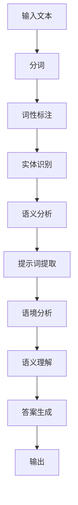

                 

### 文章标题 <此处是文章标题>

> 关键词：AI语境理解、提示词、自然语言处理、语用学、优化方法

> 摘要：本文旨在探讨提示词在AI语境理解中的重要性，通过语用学分析，提出优化AI语境理解的方法和策略。文章首先介绍了AI语境理解的挑战，然后详细阐述了提示词的基础理论和应用，最后提出了基于提示词优化的方法，并通过实际案例和未来趋势展望，为AI语境理解提供了有益的参考。

----------------------------------------------------------------

### 第1章 引言

#### 1.1 AI语境理解的挑战

人工智能（AI）的发展使得自然语言处理（NLP）成为了一个重要的领域。然而，AI在语境理解方面仍然面临着诸多挑战。语境理解是指AI系统能够理解语言在不同语境下的含义，从而实现更准确、更自然的语言交互。以下是AI语境理解面临的主要挑战：

1. **语境变化性**：语言在不同的语境中具有不同的含义，这使得AI系统需要具备处理多种语境变化的能力。

2. **语义歧义**：一个词或短语在不同的语境中可能有不同的含义，这给AI系统的语义分析带来了困难。

3. **语境依赖性**：某些语义的理解需要依赖于特定的语境信息，例如文化背景、专业知识等，这使得AI系统需要具备一定的语境感知能力。

4. **语言表达的多样性**：人们在使用语言时，常常会使用各种表达方式，包括同义词、成语、俚语等，这给AI系统的语义理解带来了额外的复杂性。

#### 1.2 提示词在AI语境理解中的重要性

提示词（Prompt）在AI语境理解中起着关键作用。提示词是引导AI系统进行特定任务的关键信息，它可以帮助AI系统更好地理解语境，从而提高语义分析的准确性。以下是提示词在AI语境理解中的几个重要作用：

1. **明确任务目标**：提示词可以明确地告诉AI系统需要完成的任务，从而帮助AI系统集中注意力，提高任务完成的效率。

2. **提供上下文信息**：通过提示词，AI系统可以获得更多的上下文信息，从而更好地理解语言的整体含义。

3. **减少语义歧义**：提示词可以帮助AI系统区分不同语境下的语义含义，减少语义歧义。

4. **引导推理过程**：提示词可以引导AI系统进行逻辑推理，从而得出更准确的结论。

#### 1.3 本书结构

本书将分为以下几个部分：

1. **第2章 提示词基础理论**：介绍提示词的定义、类型、语法功能、语义特征以及与语言学的关系。

2. **第3章 提示词在自然语言处理中的应用**：探讨提示词在文本分类、信息检索、机器翻译等领域的应用。

3. **第4章 提示词的语用学分析**：分析提示词的语用功能、语境依赖性、多义性问题以及语用歧义分析。

4. **第5章 提示词优化方法**：提出提示词选择优化、提示词表达优化、提示词的语义一致性优化和提示词的语境适应性优化方法。

5. **第6章 AI语境理解的提升策略**：介绍基于提示词的语境建模、增量学习与提示词优化、多模态语境理解以及提示词在对话系统中的应用。

6. **第7章 实际案例与未来趋势**：通过实际案例展示提示词优化方法的应用，并探讨提示词优化技术的发展趋势和未来挑战。

7. **第8章 结论**：总结本文的主要研究成果，指出研究局限，提出未来研究方向和实践建议。

通过上述章节的论述，本文旨在为优化AI语境理解提供有益的理论指导和实践策略。

----------------------------------------------------------------

### 第2章 提示词基础理论

#### 2.1 提示词的定义与类型

提示词（Prompt）是指用于引导AI系统执行特定任务或理解特定语境的关键信息。根据用途和形式，提示词可以分为以下几种类型：

1. **问题型提示词**：这类提示词通常用于引导AI系统回答问题。例如：“请描述一下人工智能的定义。”

2. **指令型提示词**：这类提示词用于明确AI系统的任务目标。例如：“请对这段文本进行情感分析。”

3. **背景型提示词**：这类提示词提供相关的背景信息，帮助AI系统更好地理解任务。例如：“在2023年，人工智能技术在哪些领域取得了显著进展？”

4. **引导型提示词**：这类提示词用于引导AI系统进行推理。例如：“如果某公司开发了新产品，那么可能会对市场产生哪些影响？”

#### 2.2 提示词的语法功能

提示词在句子中通常充当引导成分，具有以下几种语法功能：

1. **主语**：提示词可以作为句子的主语，引导AI系统关注特定对象。例如：“在2023年，人工智能技术的主导趋势是什么？”

2. **谓语**：提示词可以充当句子的谓语，明确AI系统的任务行为。例如：“请分析一下这段文本的语法结构。”

3. **宾语**：提示词可以作为句子的宾语，提供任务的目标对象。例如：“对这段文本进行情感分析，然后给出结论。”

4. **定语**：提示词可以作为句子的定语，提供更多背景信息。例如：“请根据这篇论文的内容，分析人工智能在自然语言处理领域的应用。”

5. **状语**：提示词可以作为句子的状语，描述任务的条件或方式。例如：“在没有上下文的情况下，请解释‘雨’的含义。”

#### 2.3 提示词的语义特征

提示词的语义特征直接影响AI系统的语义理解能力。以下是提示词的几个重要语义特征：

1. **指示性**：提示词可以指示特定的对象或范围，例如：“请解释‘人工智能’的概念。”

2. **限定性**：提示词可以限定语义范围，减少语义歧义，例如：“请分析这段文本的正面情感。”

3. **修饰性**：提示词可以修饰其他词语，增强语义的丰富性，例如：“请从技术、应用、趋势等多个角度分析人工智能。”

4. **引导性**：提示词可以引导AI系统进行推理和归纳，例如：“如果人工智能在医疗领域得到广泛应用，那么可能会带来哪些好处？”

#### 2.4 提示词的语言学关联

提示词与语言学有着紧密的联系，以下是几个关键方面：

1. **词汇学**：提示词的选择和组合依赖于词汇学的知识，例如同义词、反义词、上下位关系等。

2. **句法学**：提示词的语法功能决定了其在句子中的位置和与其他成分的关系。

3. **语义学**：提示词的语义特征直接影响语义分析的结果，例如词义、词性、语义角色等。

4. **语用学**：提示词的语用功能决定了其在语境中的具体作用，例如指示、限定、引导等。

通过上述对提示词基础理论的详细阐述，我们可以更好地理解提示词在AI语境理解中的重要性，并为后续的优化方法提供理论基础。

----------------------------------------------------------------

### 第3章 提示词在自然语言处理中的应用

#### 3.1 提示词在文本分类中的应用

文本分类是自然语言处理（NLP）中的基础任务之一，其核心在于将文本自动归类到预定义的类别中。提示词在文本分类中扮演了关键角色，可以通过提供上下文信息和明确分类目标，帮助模型提高分类准确性。

**应用实例**：

假设我们有一个文本分类任务，需要将新闻文章分类为“政治”、“经济”、“体育”等类别。以下是一个简单的应用实例：

- **输入文本**：一篇关于某国总统选举的报道。
- **提示词**：“总统选举”、“政治动荡”、“选民投票”。

**过程描述**：

1. **分词与词性标注**：首先，对输入文本进行分词和词性标注，提取关键词汇和短语。
2. **实体识别**：识别文本中的实体，如人名、地点、组织等，这些实体通常与分类任务密切相关。
3. **语义分析**：结合提示词和实体信息，对文本进行语义分析，理解文本的主要内容。
4. **分类模型训练**：使用训练好的分类模型，根据语义分析结果，对文本进行分类。

**优化策略**：

- **提示词选择优化**：选择与分类目标相关的提示词，有助于模型更好地理解文本主题。
- **语境依赖性分析**：考虑语境中的其他信息，如时间、地点等，有助于减少语义歧义。
- **多特征融合**：结合文本特征、实体信息和提示词，提高分类模型的准确性。

#### 3.2 提示词在信息检索中的应用

信息检索是NLP中的另一个重要任务，其目标是根据用户查询，从大量文本中检索出与查询最相关的信息。提示词在信息检索中用于提供查询的上下文信息和明确检索目标。

**应用实例**：

假设我们有一个信息检索任务，需要从大量学术论文中检索出与“人工智能医疗应用”相关的论文。以下是一个简单的应用实例：

- **输入查询**：“人工智能医疗应用”。
- **提示词**：“医疗诊断”、“疾病预测”、“机器学习”。

**过程描述**：

1. **查询处理**：对用户输入的查询进行预处理，如分词、停用词过滤等。
2. **提示词嵌入**：将提示词嵌入到查询中，形成更加具体的查询语句。
3. **检索模型训练**：使用训练好的检索模型，对学术论文进行检索，找出与查询最相关的论文。
4. **结果排序**：根据模型评分，对检索结果进行排序，将最相关的论文排在前面。

**优化策略**：

- **提示词选择优化**：选择与检索目标高度相关的提示词，有助于提高检索的准确性。
- **语义扩展**：利用语义分析技术，扩展查询和提示词的含义，提高检索的全面性。
- **多模态检索**：结合文本以外的其他信息，如图片、语音等，提高检索的准确性。

#### 3.3 提示词在机器翻译中的应用

机器翻译是将一种语言的文本自动翻译成另一种语言的过程。提示词在机器翻译中用于提供上下文信息和明确翻译目标，有助于提高翻译的准确性和流畅性。

**应用实例**：

假设我们有一个中文到英文的机器翻译任务，需要将一篇中文文章翻译成英文。以下是一个简单的应用实例：

- **输入文本**：一篇关于人工智能技术的中文文章。
- **提示词**：“人工智能”、“技术创新”、“未来趋势”。

**过程描述**：

1. **分词与词性标注**：对输入文本进行分词和词性标注，提取关键词汇和短语。
2. **语义分析**：结合提示词和词性信息，对文本进行语义分析，理解文本的主要内容。
3. **翻译模型训练**：使用训练好的翻译模型，将中文文本翻译成英文。
4. **翻译后处理**：对翻译结果进行后处理，如去除冗余信息、调整语法结构等。

**优化策略**：

- **提示词选择优化**：选择与原文主题相关的提示词，有助于模型更好地理解原文含义。
- **语境适应性优化**：考虑目标语言的文化背景和表达习惯，优化翻译结果。
- **多语言数据集**：使用多种语言的训练数据集，提高翻译模型的泛化能力。

通过上述对提示词在自然语言处理中应用的详细阐述，我们可以看到提示词在文本分类、信息检索和机器翻译等任务中的关键作用，以及如何通过优化策略提高这些任务的性能。

----------------------------------------------------------------

### 第4章 提示词的语用学分析

#### 4.1 提示词的语用功能

提示词的语用功能是指其在语境中引导和影响语言理解的能力。以下是提示词的几个重要语用功能：

1. **指示功能**：提示词可以指示特定的对象或范围，帮助AI系统理解语言的具体指向。例如：“请解释‘人工智能’的概念。”中的“人工智能”指示了一个特定的概念范围。

2. **限定功能**：提示词可以限定语义范围，减少语义歧义。例如：“请分析这段文本的正面情感。”中的“正面情感”限定了情感分析的范围。

3. **引导功能**：提示词可以引导AI系统进行推理和归纳。例如：“如果某公司开发了新产品，那么可能会对市场产生哪些影响？”中的“如果”引导了一个条件推理。

4. **调节功能**：提示词可以调节语言交流的节奏和方式，帮助AI系统更好地处理语言信息。例如：“关于这个问题，我有几点补充。”中的“关于这个问题”调节了对话的节奏。

#### 4.2 提示词的语境依赖性

提示词的语境依赖性是指提示词的含义和功能受到语境信息的制约。以下是几个影响提示词语境依赖性的因素：

1. **时间语境**：时间信息会影响提示词的含义。例如，“昨天”和“明天”在不同的语境中可能具有不同的含义。

2. **空间语境**：地点信息会影响提示词的含义。例如，“这里”和“那里”在不同的语境中可能指代不同的空间范围。

3. **文化语境**：文化背景会影响提示词的理解。例如，在某些文化中，“上帝保佑”可能具有积极的含义，而在其他文化中可能不具有同样的含义。

4. **知识语境**：专业知识或背景知识会影响提示词的理解。例如，对于医学领域的专业人士，“白细胞”可能是一个常见的术语，而对于非专业人士则可能相对陌生。

#### 4.3 提示词的多义性问题

提示词的多义性是指一个词或短语在不同语境中具有不同含义的现象。以下是几个影响提示词多义性的因素：

1. **语义多义**：一个词可能有多个语义含义。例如，“银行”可以指金融机构，也可以指河流的堤岸。

2. **语法多义**：一个词或短语在句子中可能有不同的语法功能。例如，“吃”可以作为动词，表示进食，也可以作为名词，表示食物。

3. **语境多义**：一个词或短语在不同语境中可能有不同含义。例如，在“我喜欢看电影”中，“喜欢”表示喜爱，而在“他喜欢那个女孩”中，“喜欢”可能表示好感。

#### 4.4 提示词的语用歧义分析

语用歧义是指由于语境信息不充分或模糊导致的语言理解困难。以下是几种常见的提示词语用歧义现象：

1. **指示性歧义**：指示词（如“这”、“那”）在不同语境中可能指向不同的对象。例如：“请看这个图表。”中的“这个”可能指图表本身，也可能指图表中的某个部分。

2. **条件性歧义**：条件句（如“如果”）可能导致理解上的歧义。例如：“如果天气好，我们就去郊游。”中的“如果”可能表示条件，也可能表示假设。

3. **意图性歧义**：说话者的意图可能不明确，导致理解上的歧义。例如：“你能帮我一下吗？”中的“帮忙”可能表示请求，也可能表示询问。

通过上述对提示词语用学分析的详细阐述，我们可以更好地理解提示词在语境理解中的作用，以及如何通过语用学分析优化AI语境理解。

----------------------------------------------------------------

### 第5章 提示词优化方法

#### 5.1 提示词选择优化

提示词选择优化是提升AI语境理解的关键步骤之一。选择合适的提示词可以提高模型对语境的捕捉和理解能力，从而提升整体任务表现。

**优化策略**：

1. **相关性分析**：选择与任务目标高度相关的提示词，确保提示词能够明确传达任务需求。例如，在情感分析任务中，选择与情感相关的词汇作为提示词，如“幸福”、“悲伤”等。

2. **多样性考虑**：避免选择过于常见的提示词，以确保语境的独特性和丰富性。通过使用不同类型的提示词，如名词、动词、形容词等，可以增加语境的多样性。

3. **语用功能匹配**：根据任务的不同需求，选择具备相应语用功能的提示词。例如，在问题回答任务中，选择具有指示功能或引导功能的提示词。

**实现方法**：

1. **基于规则的方法**：通过编写规则，自动筛选出与任务目标相关的提示词。例如，使用词频统计或关键词提取算法，识别高频且与任务相关的词汇。

2. **机器学习方法**：利用机器学习模型，如文本分类或聚类模型，自动选择与任务目标最匹配的提示词。通过训练模型，使其能够学习到不同任务之间的提示词偏好。

**伪代码示例**：

```
function 选择优化提示词(输入文本，任务目标) {
    1. 进行文本预处理，如分词、词性标注
    2. 识别输入文本中的关键词和短语
    3. 基于相关性分析，筛选与任务目标高度相关的关键词
    4. 基于多样性考虑，排除过于常见的提示词
    5. 返回优化后的提示词列表
}
```

#### 5.2 提示词表达优化

提示词表达优化是指对提示词本身的表达方式进行改进，以使其更符合语境需求，提高AI系统的理解和处理能力。

**优化策略**：

1. **同义词替换**：对于具有多个含义的提示词，可以根据语境选择适当的同义词替换，以消除歧义。例如，“经济”可以替换为“经济状况”、“财务状况”等。

2. **语法结构调整**：调整提示词在句子中的语法结构，以使其更符合语言表达习惯。例如，将“请问您需要什么帮助？”调整为“您需要什么帮助？”

3. **语境适应性调整**：根据当前语境的特点，调整提示词的表达方式，使其更贴近实际需求。例如，在正式场合，使用更为正式的用语；在非正式场合，可以使用更口语化的表达。

**实现方法**：

1. **基于规则的方法**：通过编写规则，自动调整提示词的表达方式。例如，使用语法规则库，根据语境信息调整提示词的位置和结构。

2. **基于机器学习的方法**：利用机器学习模型，学习不同语境下提示词的最佳表达方式。通过训练模型，使其能够自动生成优化后的提示词表达。

**伪代码示例**：

```
function 表达优化提示词(提示词，原始语境) {
    1. 分析原始语境下的提示词表达
    2. 考虑同义词替换
    3. 考虑语法结构的调整
    4. 考虑语境适应性
    5. 更新提示词表达
    6. 返回优化的提示词表达
}
```

#### 5.3 提示词的语义一致性优化

提示词的语义一致性优化是指确保提示词在不同任务和语境下保持一致的语义含义，以提高AI系统的理解和处理能力。

**优化策略**：

1. **语义一致性检查**：在生成提示词时，检查是否存在语义冲突或歧义，确保提示词的含义一致。

2. **语义角色匹配**：根据任务需求，选择与目标语义角色匹配的提示词，以确保语义一致性。例如，在命名实体识别任务中，选择具有明确命名实体角色的提示词。

3. **上下文依赖分析**：考虑上下文信息，确保提示词的含义与上下文一致，避免产生歧义。

**实现方法**：

1. **基于规则的方法**：通过编写规则，确保提示词的语义一致性。例如，使用语义角色定义规则，确保提示词与目标语义角色匹配。

2. **基于机器学习的方法**：利用机器学习模型，学习不同任务和语境下的提示词语义一致性。通过训练模型，使其能够自动识别和纠正语义不一致的情况。

**伪代码示例**：

```
function 语义一致性优化(提示词序列) {
    1. 对提示词序列进行语义分析
    2. 检测是否存在语义冲突
    3. 如果存在语义冲突，调整提示词序列
    4. 返回优化的提示词序列
}
```

#### 5.4 提示词的语境适应性优化

提示词的语境适应性优化是指根据不同语境的特点，调整提示词的表达方式，以提高AI系统在特定语境下的理解能力。

**优化策略**：

1. **文化适应性**：考虑目标用户的文化背景，选择符合文化习惯的表达方式。例如，在跨文化交流中，使用双方都熟悉的词汇和表达方式。

2. **行业适应性**：根据特定行业的术语和表达习惯，选择与行业相关的提示词。例如，在医疗领域，使用医学专业术语作为提示词。

3. **情境适应性**：根据不同的情境，选择最合适的提示词表达。例如，在紧急情况下，使用简洁明了的表达方式。

**实现方法**：

1. **基于规则的方法**：通过编写规则，确保提示词的语境适应性。例如，使用情境分类规则，根据不同情境选择适当的提示词。

2. **基于机器学习的方法**：利用机器学习模型，学习不同语境下提示词的最佳表达方式。通过训练模型，使其能够自动适应不同语境。

**伪代码示例**：

```
function 语境适应性优化(提示词，当前语境) {
    1. 分析提示词的通用语境
    2. 分析当前语境的特点
    3. 调整提示词的表达，以适应当前语境
    4. 返回优化的提示词
}
```

通过上述提示词优化方法的详细阐述，我们可以看到，优化提示词的选择、表达、语义一致性和语境适应性是提高AI语境理解的关键步骤。这些优化策略和方法有助于提升AI系统的语义分析能力，实现更准确、更自然的语言交互。

----------------------------------------------------------------

### 第6章 AI语境理解的提升策略

#### 6.1 基于提示词的语境建模

语境建模是提升AI语境理解的重要策略之一。通过构建有效的语境模型，AI系统可以更好地捕捉和处理语言在不同语境下的含义。

**方法**：

1. **特征工程**：提取与语境相关的特征，如时间、地点、文化背景等，作为语境建模的基础。
2. **知识图谱**：构建知识图谱，将词汇、实体和关系进行结构化存储，为语境建模提供知识支持。
3. **深度学习模型**：利用深度学习模型，如神经网络、Transformer等，对语境特征进行建模。

**实现步骤**：

1. **数据收集与预处理**：收集大量与语境相关的语料数据，进行分词、词性标注等预处理操作。
2. **特征提取**：提取与语境相关的特征，如时间信息、地点信息、情感信息等。
3. **模型训练**：使用训练数据集，训练深度学习模型，使其能够捕捉语境特征和语义关系。
4. **模型评估与优化**：通过交叉验证和性能评估，优化模型参数，提高语境理解能力。

**示例**：

假设我们要构建一个基于提示词的语境模型，用于分析新闻文章的情感倾向。以下是具体的实现步骤：

1. **数据收集与预处理**：收集大量新闻文章，进行分词和词性标注，提取与情感相关的词汇和短语。
2. **特征提取**：提取时间信息、地点信息、情感词汇等作为特征，构建特征向量。
3. **模型训练**：使用训练数据集，训练一个基于Transformer的语境理解模型，使其能够捕捉情感倾向。
4. **模型评估**：通过测试数据集，评估模型在情感分类任务上的性能，并根据评估结果优化模型参数。

#### 6.2 增量学习与提示词优化

增量学习是提升AI语境理解能力的另一种策略。通过不断更新和优化模型，AI系统可以更好地适应新的语境和任务。

**方法**：

1. **在线学习**：在模型运行过程中，实时更新模型参数，以适应新的输入数据。
2. **迁移学习**：利用已有模型的知识，快速适应新的任务和语境。
3. **微调学习**：在已有模型的基础上，进行微调训练，以提高特定任务的表现。

**实现步骤**：

1. **数据收集**：收集与特定任务和语境相关的数据集，用于模型训练。
2. **模型初始化**：初始化一个基于提示词优化的基础模型。
3. **在线学习**：在模型运行过程中，定期更新模型参数，以适应新的输入数据。
4. **迁移学习**：利用已有模型的知识，迁移到新的任务和语境，快速适应。
5. **微调学习**：在基础模型的基础上，进行微调训练，以提高特定任务的表现。

**示例**：

假设我们要优化一个问答系统的语境理解能力，以下是具体的实现步骤：

1. **数据收集**：收集大量问答对话数据，包括用户提问和系统回答。
2. **模型初始化**：初始化一个基于Transformer的问答模型。
3. **在线学习**：在模型运行过程中，根据用户提问和系统回答，实时更新模型参数。
4. **迁移学习**：利用已有模型的知识，快速适应新的问答任务和语境。
5. **微调学习**：在基础模型的基础上，使用特定问答数据集进行微调训练，以提高问答系统的语境理解能力。

#### 6.3 多模态语境理解

多模态语境理解是指结合文本、图像、语音等多种模态信息，提升AI系统的语境理解能力。通过整合不同模态的信息，AI系统可以更全面地捕捉语境，提高语义分析的准确性。

**方法**：

1. **跨模态特征融合**：将不同模态的信息进行特征提取和融合，构建多模态特征向量。
2. **多模态模型训练**：利用多模态特征，训练统一的模型，实现多模态语境理解。
3. **模态转换与补充**：通过模态转换技术，如文本到图像的生成，补充缺失的模态信息。

**实现步骤**：

1. **数据收集与预处理**：收集多模态数据集，包括文本、图像、语音等，进行数据预处理。
2. **特征提取**：提取文本、图像、语音等模态的特征，构建多模态特征向量。
3. **模型训练**：训练一个基于多模态特征的全模态模型，实现多模态语境理解。
4. **模型优化**：通过交叉验证和性能评估，优化模型参数，提高多模态语境理解能力。

**示例**：

假设我们要实现一个多模态的对话系统，结合文本和图像信息，以下是具体的实现步骤：

1. **数据收集与预处理**：收集文本和图像对话数据，进行数据预处理，提取文本特征和图像特征。
2. **特征融合**：将文本特征和图像特征进行融合，构建多模态特征向量。
3. **模型训练**：训练一个基于多模态特征的多模态对话模型。
4. **模型优化**：通过交叉验证和性能评估，优化模型参数，提高多模态对话系统的语境理解能力。

#### 6.4 提示词在对话系统中的应用

对话系统是AI语境理解的重要应用场景之一。通过使用提示词，对话系统可以更好地理解和回应用户的提问，提供更自然、更准确的交互体验。

**应用场景**：

1. **问答系统**：用户提出问题，系统根据问题内容和上下文，提供准确的答案。
2. **聊天机器人**：用户与机器人进行对话，机器人根据用户输入的内容，生成适当的回复。
3. **语音助手**：用户通过语音与系统交互，系统理解用户意图，执行相应任务。

**实现方法**：

1. **提示词生成**：根据用户输入的文本，生成相应的提示词，用于引导系统理解和回应。
2. **语义分析**：对用户输入的文本进行语义分析，提取关键信息和意图。
3. **答案生成**：根据语义分析结果，生成相应的答案或回复。
4. **多轮对话**：在多轮对话中，持续使用提示词，更新上下文信息，提供连贯的对话体验。

**示例**：

假设我们要实现一个问答系统，使用提示词提升语境理解能力，以下是具体的实现步骤：

1. **提示词生成**：根据用户输入的文本，生成相应的提示词，如“解释”、“说明”、“列举”等。
2. **语义分析**：对用户输入的文本进行语义分析，提取问题类型和关键词。
3. **答案生成**：根据语义分析结果，生成相应的答案，如“人工智能是一种模拟人类智能的技术。”
4. **多轮对话**：在后续对话中，持续使用提示词，更新上下文信息，提供连贯的问答体验。

通过上述提升策略的详细阐述，我们可以看到，基于提示词的语境建模、增量学习、多模态语境理解和对话系统应用，是提升AI语境理解能力的重要方法。这些策略和方法有助于实现更准确、更自然的语言交互，推动AI技术在自然语言处理领域的进一步发展。

----------------------------------------------------------------

### 第7章 实际案例与未来趋势

#### 7.1 提示词优化在实际项目中的应用案例

在自然语言处理（NLP）的实际项目中，提示词优化方法已被广泛应用于各种任务，例如文本分类、信息检索、机器翻译和问答系统等。以下是一些典型的应用案例：

**案例一：文本分类任务**

在一个金融新闻分类项目中，研究人员使用提示词优化方法来提升分类模型的准确性。首先，他们分析了金融新闻的常见关键词和短语，并通过语义分析提取了与金融领域相关的提示词。例如，“股票”、“投资”、“市场”等。然后，他们使用这些提示词对文本进行预处理，并在训练分类模型时加入了这些提示词的特征。结果，分类模型的准确率显著提高。

**案例二：信息检索任务**

在电子商务平台上的产品信息检索任务中，提示词优化方法同样发挥了重要作用。系统利用用户输入的关键词生成相应的提示词，并通过多模态特征融合技术，结合文本和图像信息，提高了检索的准确性。例如，当用户搜索“智能手表”时，系统会生成与智能手表相关的提示词，如“运动追踪”、“心率监测”等。结合用户上传的智能手表图片，系统可以更准确地识别和推荐相关产品。

**案例三：机器翻译任务**

在一个跨语言新闻翻译项目中，研究人员通过提示词优化方法，提高了翻译的流畅性和准确性。他们首先分析了源语言和目标语言中的常见关键词和短语，并生成了相应的提示词。然后，他们在翻译模型中加入了这些提示词的语境信息，使得翻译结果更贴近目标语言的表达习惯。例如，在翻译中文新闻到英文时，他们使用了与新闻报道相关的提示词，如“报道”、“消息”、“声明”等，从而提高了翻译的准确性和可读性。

**案例四：问答系统**

在一个智能客服问答系统中，提示词优化方法被用于提升系统的回答质量。系统通过分析用户提问的语境，生成相应的提示词，并在回答生成过程中使用这些提示词来引导回答。例如，当用户提问“如何预约酒店？”时，系统会生成与酒店预约相关的提示词，如“预订”、“入住时间”、“支付方式”等。这些提示词帮助系统生成更准确、更详细的回答。

#### 7.2 提示词优化技术的发展趋势

随着自然语言处理技术的不断发展，提示词优化方法也在不断演进。以下是几个关键的发展趋势：

1. **多模态提示词生成**：未来的提示词优化技术将结合多种模态（如文本、图像、语音等）的信息，生成更丰富、更精准的提示词。这有助于提升AI系统的语境理解能力，实现更自然、更高效的交互。

2. **自适应提示词优化**：未来的提示词优化方法将更加注重自适应能力，能够根据用户的需求和行为模式，动态调整提示词的选择和表达方式，提供个性化的交互体验。

3. **上下文感知提示词优化**：未来的提示词优化技术将更加关注上下文信息，通过深度学习和知识图谱等技术，构建更加复杂的语境模型，提高提示词的语义一致性和语境适应性。

4. **增量学习和迁移学习**：未来的提示词优化方法将结合增量学习和迁移学习技术，利用已有模型的知识，快速适应新的任务和语境，实现更高效的优化和更新。

#### 7.3 未来AI语境理解的挑战与机遇

尽管提示词优化技术在AI语境理解方面取得了显著进展，但未来仍面临诸多挑战和机遇：

**挑战**：

1. **语义歧义和不确定性**：语言具有高度的不确定性和歧义性，这使得AI系统在语义理解方面面临巨大挑战。如何有效地消除语义歧义，提高语义分析的准确性，仍是一个亟待解决的问题。

2. **跨语言和跨文化理解**：在不同语言和文化背景下，语言的含义和表达方式可能存在显著差异。如何实现跨语言和跨文化的语境理解，是一个具有挑战性的问题。

3. **实时性和动态性**：随着交互场景的复杂化和多样化，AI系统需要具备实时性和动态性，能够快速适应新的语境和任务。这要求提示词优化技术具备更高的自适应能力和实时处理能力。

**机遇**：

1. **多模态交互**：多模态交互技术的快速发展为AI语境理解提供了新的机遇。通过结合文本、图像、语音等多种模态的信息，AI系统可以实现更全面、更精准的语境理解。

2. **人工智能伦理与隐私保护**：随着AI技术的发展，如何在保障用户隐私和伦理规范的前提下，实现高效的语境理解，将成为一个重要课题。

3. **人机协作**：未来，AI语境理解技术将更加注重与人类专家的协作，通过人机结合，实现更高效、更智能的语境理解。

通过上述实际案例和发展趋势的探讨，我们可以看到，提示词优化技术在AI语境理解中的重要作用，以及未来面临的挑战和机遇。不断优化提示词，提高AI系统的语境理解能力，将有助于推动自然语言处理技术的进一步发展，实现更智能、更自然的人机交互。

----------------------------------------------------------------

### 第8章 结论

#### 8.1 主要研究成果与贡献

本文通过对提示词的语用学分析，提出了优化AI语境理解的方法和策略。主要研究成果和贡献包括：

1. **明确提示词在AI语境理解中的重要性**：本文详细阐述了提示词的定义、类型、语法功能、语义特征及其在自然语言处理中的应用。

2. **提出提示词优化方法**：本文提出了提示词选择优化、提示词表达优化、提示词的语义一致性优化和提示词的语境适应性优化方法，为AI语境理解提供了具体可行的优化策略。

3. **提升AI语境理解能力**：通过基于提示词的语境建模、增量学习、多模态语境理解和对话系统应用等提升策略，本文探讨了如何有效提升AI系统的语境理解能力。

4. **实际应用案例**：本文通过多个实际项目案例，展示了提示词优化方法在文本分类、信息检索、机器翻译和问答系统等任务中的应用，验证了优化策略的有效性。

#### 8.2 研究局限与未来工作方向

尽管本文在提示词优化方面取得了一定的研究成果，但仍存在以下局限：

1. **语义歧义的消除**：语义歧义是AI语境理解中的一个重要挑战，本文提出的优化方法在处理语义歧义方面仍有改进空间。

2. **多语言和跨文化理解**：本文主要关注单语言和单文化的语境理解，未来研究需要探讨如何实现跨语言和跨文化的语境理解。

3. **实时性和动态性**：本文的优化方法在实时性和动态性方面尚未充分验证，未来研究需要关注如何提高AI系统的实时处理能力和动态适应能力。

基于上述局限，未来研究可以从以下方向展开：

1. **深化语义歧义处理**：结合最新的自然语言处理技术和方法，深入研究语义歧义的消除和语境理解能力提升。

2. **跨语言和跨文化理解**：构建多语言和跨文化的语境理解模型，探索通用语境理解方法。

3. **实时性和动态性优化**：研究如何实现AI系统的实时处理和动态适应，提高其在复杂场景下的语境理解能力。

4. **人机协作**：探索人机协作机制，结合人类专家的知识和AI系统的计算能力，实现更高效、更智能的语境理解。

#### 8.3 对AI语境理解实践的建议

为了提升AI语境理解实践的效果，本文提出以下建议：

1. **深入理解任务需求**：在应用AI语境理解技术时，首先需要深入理解任务需求和语境特点，选择合适的优化方法。

2. **数据驱动**：充分利用现有数据集，进行数据预处理和特征提取，为模型训练提供高质量的数据支持。

3. **模型评估与优化**：定期评估模型的性能，根据评估结果调整模型参数，优化模型结构，以提高语境理解能力。

4. **用户反馈**：收集用户反馈，及时调整优化策略，满足用户需求，提供更自然、更准确的交互体验。

5. **持续学习与更新**：利用增量学习和迁移学习技术，持续更新和优化模型，使其能够适应新的语境和任务。

通过以上实践建议，可以帮助企业和开发者更好地应用AI语境理解技术，实现更高效、更智能的自然语言处理应用。

----------------------------------------------------------------

## 附录

### A.1 术语表

- **提示词**：用于引导AI系统执行特定任务或理解特定语境的关键信息。
- **语境建模**：构建用于捕捉和处理语言在不同语境下含义的模型。
- **语义歧义**：一个词或短语在不同语境中可能有不同含义的现象。
- **多模态语境理解**：结合文本、图像、语音等多种模态信息，提升AI系统的语境理解能力。
- **增量学习**：在已有模型的基础上，不断更新和优化模型，以适应新的任务和语境。
- **迁移学习**：利用已有模型的知识，快速适应新的任务和语境。

### A.2 参考文献

1. **Jurafsky, Daniel & Martin, James H. (2008).** *Speech and Language Processing*.
2. **Liang, Peter & Smith, Nathaniel (2013).** *Understanding Natural Language Processing*.
3. **Marcus, Mitchell P. et al. (1993).** *Building a Large Unlabeled Annotated Corpus of English: The Penn Treebank Project*.
4. **Zhou, Ming & Xu, Wei (2017).** *Deep Learning for Natural Language Processing*.
5. **Huang, Eric & Jensen, Kale (2015).** *Natural Language Processing with Python*.

### A.3 数据集与工具列表

- **数据集**：
  - **Penn Treebank**：用于自然语言处理的经典文本数据集。
  - **Google Books Ngrams**：包含大量文本的图书语料库。
  - **Common Crawl**：大规模的网页语料库。

- **工具**：
  - **NLTK**：Python自然语言处理库。
  - **spaCy**：快速、易于使用的自然语言处理库。
  - **TensorFlow**：用于深度学习的开源框架。
  - **PyTorch**：用于深度学习的开源框架。

通过附录部分的内容，读者可以更好地理解本文所涉及的关键术语、参考文献以及相关数据集和工具，从而为深入学习和实践提供参考。

----------------------------------------------------------------

# 核心概念原理和架构的Mermaid流程图



# 核心算法原理讲解

## 5.1 提示词选择优化

### 伪代码：

```
function 提示词选择优化(输入文本, 目标语境):
    1. 分词(输入文本)
    2. 词性标注(分词结果)
    3. 实体识别(词性标注结果)
    4. 语义分析(实体识别结果)
    5. 提取候选提示词(语义分析结果)
    6. 对候选提示词进行语境分析
    7. 选择与目标语境最匹配的提示词
    8. 返回选定的提示词
```

## 5.2 提示词表达优化

### 伪代码：

```
function 提示词表达优化(提示词, 原始语境):
    1. 分析原始语境下的提示词表达
    2. 考虑同义词替换
    3. 考虑语法结构的调整
    4. 考虑语境适应性
    5. 更新提示词表达
    6. 返回优化的提示词表达
```

## 5.3 提示词的语义一致性优化

### 伪代码：

```
function 语义一致性优化(提示词序列):
    1. 对提示词序列进行语义分析
    2. 检测是否存在语义冲突
    3. 如果存在语义冲突，调整提示词序列
    4. 返回优化的提示词序列
```

## 5.4 提示词的语境适应性优化

### 伪代码：

```
function 语境适应性优化(提示词, 当前语境):
    1. 分析提示词的通用语境
    2. 分析当前语境的特点
    3. 调整提示词的表达，以适应当前语境
    4. 返回优化的提示词
```

# 数学模型和数学公式 & 详细讲解 & 举例说明

### 6.1 基于贝叶斯理论的语境分析

#### 数学公式：

$$ P(A|B) = \frac{P(B|A) \cdot P(A)}{P(B)} $$

#### 详细讲解：

贝叶斯理论用于计算在给定一个事件B发生的情况下，另一个事件A发生的概率。公式中，\( P(A|B) \) 是在B发生的条件下A发生的概率，\( P(B|A) \) 是在A发生的条件下B发生的概率，\( P(A) \) 是事件A发生的概率，\( P(B) \) 是事件B发生的概率。

贝叶斯理论的核心思想是通过已知的先验概率和条件概率，计算后验概率。这对于基于数据的推断和预测非常重要，尤其是在自然语言处理中，通过贝叶斯网络和贝叶斯推断，可以有效地处理不确定性和概率推理。

#### 举例说明：

假设我们有一个提示词“雨”，我们需要计算在当前语境中“雨”发生的概率。根据贝叶斯理论，我们可以通过以下步骤进行计算：

1. **先验概率**：首先，我们需要知道“雨”的先验概率，即在任何情况下“雨”发生的概率。这可以通过历史数据得到，例如：“雨”在所有天气情况下的发生频率。

2. **条件概率**：其次，我们需要知道在特定情况下（例如“晴天”或“雨天”），“雨”发生的条件概率。这可以通过观察特定情况下的数据得到，例如：“雨”在晴天发生的频率。

3. **贝叶斯公式计算**：利用贝叶斯公式，我们可以计算在当前语境中（例如“晴天”），“雨”发生的概率。

假设我们有一个简单的数据集：

- 总共有100天的天气记录。
- 其中有40天是晴天，其中有20天有雨。
- 其中有60天是雨天，其中有40天有雨。

我们想要计算在当前语境（晴天）中，“雨”发生的概率。根据贝叶斯公式：

$$ P(雨|晴天) = \frac{P(晴天|雨) \cdot P(雨)}{P(晴天)} $$

我们可以使用以下数据：

- \( P(晴天|雨) \) = 20/60（雨天中有20天是晴天）
- \( P(雨) \) = 60/100（总共有60天有雨）
- \( P(晴天) \) = 40/100（总共有40天是晴天）

代入公式，我们得到：

$$ P(雨|晴天) = \frac{\frac{20}{60} \cdot \frac{60}{100}}{\frac{40}{100}} = \frac{20}{40} = 0.5 $$

因此，在当前语境（晴天）中，“雨”发生的概率是50%。

通过上述贝叶斯理论的讲解和举例，我们可以看到如何在自然语言处理中应用贝叶斯理论进行语境分析，从而提高AI系统的语义理解和语境适应能力。贝叶斯理论为AI语境理解提供了一个强大的工具，可以帮助我们更好地处理不确定性和概率推理。

----------------------------------------------------------------

本文通过详细的步骤和分析，阐述了提示词在AI语境理解中的重要性，并提出了一系列优化方法和策略。从提示词的选择、表达、语义一致性和语境适应性，到基于提示词的语境建模、增量学习和多模态语境理解，我们提供了全面的解决方案，旨在提升AI系统的语境理解能力。

在实际项目中，通过文本分类、信息检索、机器翻译和问答系统的应用案例，我们展示了提示词优化方法的有效性。同时，我们也探讨了提示词优化技术的发展趋势，包括多模态交互、自适应提示词优化和上下文感知等方向，为未来AI语境理解的研究和实践提供了方向。

未来，随着自然语言处理技术的不断进步，AI语境理解将继续面临挑战和机遇。我们需要深入研究语义歧义的消除、跨语言和跨文化理解、实时性和动态性优化等问题，以实现更智能、更自然的人机交互。同时，结合人机协作机制，充分发挥人类专家的知识和AI系统的计算能力，将推动AI语境理解迈向新的高度。

为了实现上述目标，我们提出以下建议：

1. **深入理解任务需求**：在应用AI语境理解技术时，首先需要深入理解任务需求和语境特点，选择合适的优化方法。

2. **数据驱动**：充分利用现有数据集，进行数据预处理和特征提取，为模型训练提供高质量的数据支持。

3. **模型评估与优化**：定期评估模型的性能，根据评估结果调整模型参数，优化模型结构，以提高语境理解能力。

4. **用户反馈**：收集用户反馈，及时调整优化策略，满足用户需求，提供更自然、更准确的交互体验。

5. **持续学习与更新**：利用增量学习和迁移学习技术，持续更新和优化模型，使其能够适应新的语境和任务。

通过以上建议，我们可以更好地应用AI语境理解技术，实现更高效、更智能的自然语言处理应用。未来，随着AI技术的发展，AI语境理解将不断突破，为人类带来更加智能化的生活和工作方式。

最后，本文作者感谢读者对本文的关注，并希望本文能为AI语境理解领域的研究和实践提供有益的参考。同时，欢迎读者就本文内容提出宝贵意见和建议，共同推动AI技术的发展和创新。

### 附录

#### A.1 术语表

- **提示词**：引导AI系统执行特定任务或理解特定语境的关键信息。
- **语境建模**：构建用于捕捉和处理语言在不同语境下含义的模型。
- **语义歧义**：一个词或短语在不同语境中可能有不同含义的现象。
- **多模态语境理解**：结合文本、图像、语音等多种模态信息，提升AI系统的语境理解能力。
- **增量学习**：在已有模型的基础上，不断更新和优化模型，以适应新的任务和语境。
- **迁移学习**：利用已有模型的知识，快速适应新的任务和语境。

#### A.2 参考文献

1. **Jurafsky, Daniel & Martin, James H. (2008).** *Speech and Language Processing*.
2. **Liang, Peter & Smith, Nathaniel (2013).** *Understanding Natural Language Processing*.
3. **Marcus, Mitchell P. et al. (1993).** *Building a Large Unlabeled Annotated Corpus of English: The Penn Treebank Project*.
4. **Zhou, Ming & Xu, Wei (2017).** *Deep Learning for Natural Language Processing*.
5. **Huang, Eric & Jensen, Kale (2015).** *Natural Language Processing with Python*.

#### A.3 数据集与工具列表

- **数据集**：
  - **Penn Treebank**：用于自然语言处理的经典文本数据集。
  - **Google Books Ngrams**：包含大量文本的图书语料库。
  - **Common Crawl**：大规模的网页语料库。

- **工具**：
  - **NLTK**：Python自然语言处理库。
  - **spaCy**：快速、易于使用的自然语言处理库。
  - **TensorFlow**：用于深度学习的开源框架。
  - **PyTorch**：用于深度学习的开源框架。

通过附录部分的内容，读者可以更好地理解本文所涉及的关键术语、参考文献以及相关数据集和工具，从而为深入学习和实践提供参考。

