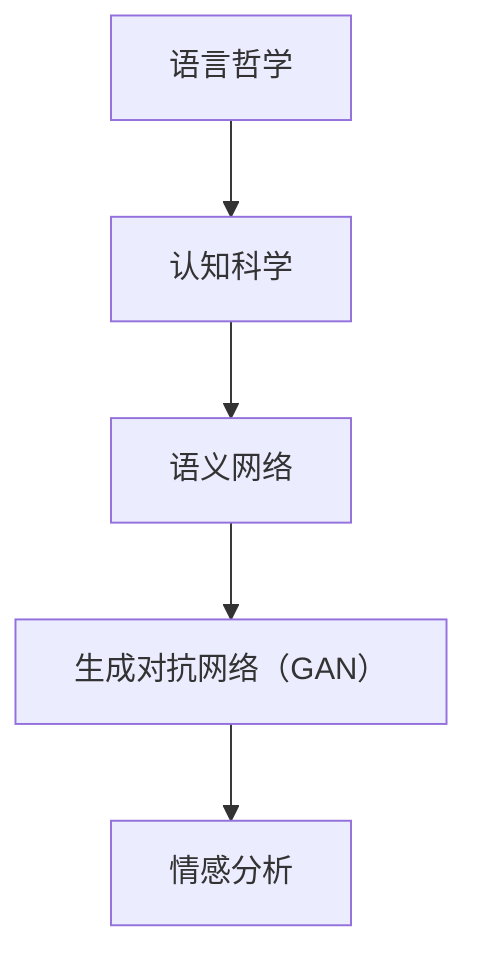
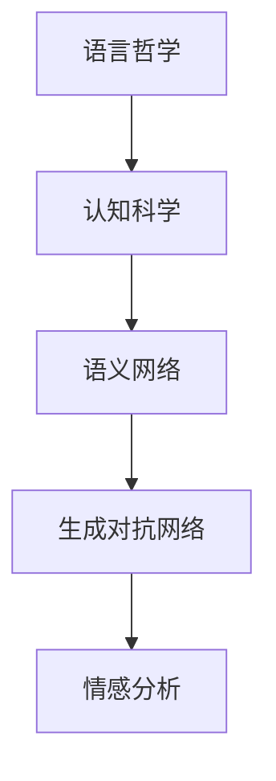

                 


# 提示词的语言哲学与认知科学交叉研究

## 引言

在当今科技高速发展的时代，语言哲学与认知科学的交叉研究成为了热门话题。语言是人类交流的重要工具，而认知科学则关注人类思维和感知的机制。这两者的结合，不仅有助于我们更好地理解人类语言的本质，也为人工智能领域的发展提供了新的思路和方法。

本文旨在探讨语言哲学与认知科学的交叉研究，首先介绍两者的基本概念和核心问题，然后分析它们之间的联系，并探讨如何将语言哲学应用于认知科学研究。接下来，我们将介绍一些核心算法原理和数学模型，并通过案例研究和项目实战来展示这些原理和模型的应用。最后，本文将对研究成果进行总结，并对未来研究方向进行展望。

## 第一部分：核心概念与联系

### 第1章：语言哲学基础

## 1.1 语言哲学的起源与发展

语言哲学是一门探讨语言本质、语言与思维关系以及语言使用中的道德和伦理问题的学科。其起源可以追溯到古希腊时期，当时哲学家们开始思考语言的本质和功能。随后，语言哲学经历了漫长的发展历程，涌现出了许多重要的理论和观点。

1.1.1 语言哲学的起源

语言哲学的起源可以追溯到古希腊时期。古希腊哲学家苏格拉底、柏拉图和亚里士多德等人在其哲学作品中探讨了语言的本质和功能。他们认为语言是人类思维和交流的重要工具，同时也是人类理解世界的重要手段。

1.1.2 语言哲学的发展历程

在19世纪末和20世纪初，语言哲学得到了进一步的发展。德国哲学家威廉·冯特（Wilhelm Wundt）和奥古斯特·梅耶（August Meier）等心理学家提出了“言语行为理论”，试图从心理学的角度探讨语言的本质。

20世纪中叶，语言哲学进入了新的发展阶段。美国哲学家约翰·塞尔（John Searle）提出了“言语行为理论”，认为语言不仅仅是一种表达思想的工具，更是一种行为方式。这一理论对语言哲学的发展产生了深远的影响。

近年来，语言哲学的研究逐渐向认知科学领域扩展。认知科学家开始关注语言如何影响人类的思维和认知过程，以及语言习得和语言障碍等问题的认知机制。

## 1.2 认知科学基础

认知科学是一门跨学科的研究领域，旨在理解人类思维、感知和行动的机制。其研究范畴包括心理学、神经科学、计算机科学、哲学等领域。认知科学的核心问题是理解人类如何通过感知、记忆、推理和决策等认知过程来理解世界和解决问题。

1.2.1 认知科学的概念与范畴

认知科学的概念可以概括为以下几个方面：

1. 感知：认知科学关注人类如何通过感官接收信息，并将这些信息转化为有意义的知识。

2. 记忆：认知科学探讨人类如何存储和检索信息，包括短期记忆和长期记忆。

3. 推理：认知科学关注人类如何通过逻辑推理来解决问题，并形成新的知识。

4. 决策：认知科学研究人类如何根据情境选择最优行动方案。

5. 行动：认知科学探讨人类如何将认知过程转化为行动，并调整行动策略以适应环境。

1.2.2 认知科学的基本原理

认知科学的基本原理包括：

1. 知识表示：认知科学关注如何表示和存储知识，包括语义网络、知识图谱等。

2. 知识推理：认知科学探讨如何利用已知信息进行推理和推断。

3. 知识获取：认知科学研究人类如何从经验中获取新知识，并调整已有知识。

4. 知识共享：认知科学探讨如何通过语言和符号系统实现知识共享和传播。

1.2.3 认知科学的研究方法

认知科学的研究方法包括实验研究、理论模型构建和计算模拟等。实验研究通过观察和测量人类的认知过程来验证理论模型，计算模拟则通过计算机模拟人类认知过程来探索认知机制。

1.2.4 认知科学与语言哲学的联系

认知科学与语言哲学之间存在密切的联系。首先，语言哲学关注语言的本质和功能，而认知科学则探讨人类如何通过语言进行思维和认知。其次，语言哲学为认知科学提供了理论框架，帮助认知科学家更好地理解语言对认知过程的影响。此外，认知科学的研究成果也为语言哲学提供了实证依据，推动了语言哲学的发展。

## 第2章：语言与认知的关系

### 2.1 语言与认知的相互作用

语言与认知之间的相互作用是认知科学研究的重要领域。语言不仅仅是交流的工具，更是人类认知活动的重要组成部分。语言对认知过程有深远的影响，同时认知过程也影响着语言的使用。

2.1.1 语言对认知的影响

1. 语言对感知的影响：语言会影响人类对世界的感知方式。例如，不同语言中的词汇和语法结构会影响人们对事物的分类和理解。

2. 语言对记忆的影响：语言可以帮助人们组织和存储信息，从而提高记忆效果。

3. 语言对思维的影响：语言是思维的工具，语言的表达方式会影响人们的思考方式和解决问题的方法。

2.1.2 认知对语言的影响

1. 认知发展对语言习得的影响：儿童在语言习得过程中，其认知能力的发展水平会影响其对语言的掌握。

2. 认知障碍对语言能力的影响：认知障碍（如智力障碍、自闭症等）会严重影响个体的语言能力。

3. 认知过程对语言使用的影响：人们在语言使用过程中，其认知过程会影响语言表达的选择和语法结构。

### 2.2 语言习得与认知发展

语言习得是认知科学的一个重要研究领域。儿童在成长过程中，通过自然接触和使用语言，逐渐掌握了语言的规则和表达方式。这个过程受到认知发展的强烈影响。

2.2.1 儿童语言习得的过程

1. 声音感知阶段：儿童首先通过听觉感知语言的声音特征。

2. 语音模仿阶段：儿童开始模仿语言的声音和节奏。

3. 语法理解阶段：儿童逐渐理解语言的基本语法规则。

4. 自主表达阶段：儿童开始尝试使用语言进行自主表达。

2.2.2 认知发展对语言习得的影响

1. 认知能力对语言理解的影响：儿童的认知能力，如注意、记忆、推理等，会影响其对语言的理解。

2. 认知发展对语言表达的影响：儿童的认知能力发展水平会影响其语言表达的能力。

### 2.3 语言障碍与认知障碍

语言障碍和认知障碍是两个不同的概念，但它们之间存在一定的联系。语言障碍指的是个体在语言表达和理解方面存在的困难，而认知障碍指的是个体在认知功能方面存在的障碍。

2.3.1 语言障碍的定义与分类

1. 语言障碍的定义：语言障碍指的是个体在语言表达和理解方面存在的困难，可能包括语音障碍、语法障碍、语义障碍等。

2. 语言障碍的分类：语言障碍可以按照不同的标准进行分类，如按照障碍的性质（如语音障碍、语法障碍等），或者按照障碍的程度（如轻度语言障碍、重度语言障碍等）。

2.3.2 认知障碍的定义与分类

1. 认知障碍的定义：认知障碍指的是个体在认知功能方面存在的障碍，可能包括记忆障碍、注意力障碍、推理障碍等。

2. 认知障碍的分类：认知障碍可以按照不同的标准进行分类，如按照障碍的性质（如记忆障碍、注意力障碍等），或者按照障碍的程度（如轻度认知障碍、重度认知障碍等）。

### 2.4 语言哲学与认知科学的交叉研究

语言哲学与认知科学的交叉研究为理解人类语言和认知过程提供了新的视角和方法。这种交叉研究不仅有助于揭示语言和认知之间的内在联系，也为解决实际应用问题提供了理论支持和实证依据。

2.4.1 研究方法

语言哲学与认知科学的交叉研究可以采用多种方法，如实验研究、计算模拟、理论模型构建等。实验研究通过观察和测量语言和认知过程来验证理论模型，计算模拟则通过计算机模拟来探索语言和认知的相互作用。

2.4.2 研究领域

语言哲学与认知科学的交叉研究领域广泛，包括语言习得、语言障碍、语言与思维的关系、认知障碍等。这些研究领域不仅有助于理解人类语言和认知的本质，也为教育、医疗等领域提供了新的理论支持和实践指导。

2.4.3 研究成果

近年来，语言哲学与认知科学的交叉研究取得了显著成果。例如，语义网络算法在语言习得中的应用，生成对抗网络（GAN）在情感分析中的应用，以及机器学习模型在语言障碍治疗中的应用等。这些研究成果不仅为理论探讨提供了新的视角，也为实际应用提供了有效的解决方案。

## 第二部分：核心算法原理讲解

### 第3章：语言哲学与认知科学的算法基础

算法是解决特定问题的系统方法，它们在语言哲学与认知科学交叉研究中起着至关重要的作用。本章将介绍几种核心算法原理，包括语义网络算法、生成对抗网络（GAN）和情感分析算法。

## 3.1 语义网络算法

语义网络是一种基于图的结构，用于表示语义关系和概念之间的关联。它为语言哲学与认知科学提供了一个强大的工具，用于理解人类语言和认知过程。

3.1.1 语义网络的基本原理

语义网络通过节点和边来表示概念和它们之间的关系。每个节点代表一个概念，边表示概念之间的语义关系，如“属于”、“相似”等。语义网络的基本原理如下：

1. 节点：每个节点代表一个概念，如“人”、“动物”、“猫”等。

2. 边：边表示节点之间的语义关系，如“是”、“属于”等。

3. 层次结构：语义网络具有层次结构，概念之间按照层次关系排列。

3.1.2 语义网络的构建方法

构建语义网络通常采用以下方法：

1. 手动构建：通过专家知识手动创建语义网络，例如WordNet。

2. 自动构建：通过自然语言处理技术，如词性标注、语义角色标注等，自动构建语义网络。

3.1.3 语义网络的适用范围

语义网络在语言哲学与认知科学中有广泛的应用：

1. 语言理解：语义网络可以帮助理解和解析自然语言文本。

2. 语言生成：语义网络可以用于生成符合语义规则的自然语言文本。

3. 情感分析：语义网络可以用于分析文本中的情感和情绪。

## 3.2 生成对抗网络（GAN）

生成对抗网络（GAN）是一种强大的深度学习模型，用于生成逼真的数据。在语言哲学与认知科学中，GAN可以用于模拟语言生成和理解过程。

3.2.1 GAN的基本原理

GAN由两部分组成：生成器（Generator）和判别器（Discriminator）。生成器的目标是生成看起来像真实数据的假数据，而判别器的目标是区分真实数据和生成器生成的假数据。GAN的基本原理如下：

1. 生成器：生成器接收随机噪声作为输入，并生成假数据。

2. 判别器：判别器接收真实数据和生成器生成的假数据，并判断其真实性。

3. 模型训练：通过对抗训练，生成器和判别器互相竞争，生成器逐渐生成更逼真的假数据，而判别器逐渐提高判断能力。

3.2.2 GAN的训练过程

GAN的训练过程分为以下几个步骤：

1. 初始化生成器和判别器。

2. 从真实数据中抽取一批样本，并生成一批假数据。

3. 判别器对真实数据和假数据进行训练，提高判断能力。

4. 生成器根据判别器的反馈，调整模型参数，生成更逼真的假数据。

5. 重复步骤2-4，直到生成器生成的假数据接近真实数据。

3.2.3 GAN在语言哲学与认知科学中的应用

GAN在语言哲学与认知科学中有以下应用：

1. 语言生成：GAN可以用于生成自然语言文本，模拟人类语言生成过程。

2. 语言理解：GAN可以用于理解自然语言文本，分析文本中的情感和情绪。

3. 情感分析：GAN可以用于生成情感丰富的自然语言文本，提高情感分析模型的性能。

## 3.3 情感分析算法

情感分析是自然语言处理的一个重要领域，用于识别文本中的情感和情绪。在语言哲学与认知科学中，情感分析可以帮助我们理解人类情感和认知过程的相互影响。

3.3.1 情感分析的基本原理

情感分析的基本原理是通过分析和处理自然语言文本，识别文本中的情感和情绪。情感分析的基本步骤如下：

1. 文本预处理：对文本进行分词、去停用词、词性标注等处理。

2. 情感词典构建：构建包含情感词汇和对应的情感倾向的词典。

3. 情感分类：使用分类算法，如支持向量机（SVM）、朴素贝叶斯（Naive Bayes）等，对文本进行情感分类。

3.3.2 情感分析的方法

情感分析的方法可以分为基于规则的方法和基于机器学习的方法。

1. 基于规则的方法：通过手动定义情感词典和规则，对文本进行情感分类。

2. 基于机器学习的方法：使用机器学习算法，如朴素贝叶斯、支持向量机等，对文本进行情感分类。

3.3.3 情感分析在语言哲学与认知科学中的应用

情感分析在语言哲学与认知科学中有以下应用：

1. 语言理解：情感分析可以帮助理解文本中的情感和情绪，从而提高语言理解能力。

2. 情感表达：情感分析可以帮助识别文本中的情感表达，从而提高情感表达能力。

3. 情感识别：情感分析可以帮助识别个体的情感状态，从而提高情感识别能力。

## 第三部分：数学模型和数学公式讲解

在语言哲学与认知科学的交叉研究中，数学模型和数学公式是理解语言和认知过程的重要工具。本章将介绍几个关键的数学模型和数学公式，并详细讲解其原理和应用。

### 第4章：语言哲学与认知科学的数学模型

#### 4.1 概率论与统计模型

概率论和统计模型是语言哲学与认知科学研究的重要工具，用于描述和预测语言和认知现象。

#### 4.1.1 概率论的基本概念

概率论的基本概念包括：

1. 事件：事件是随机试验的结果。

2. 样本空间：样本空间是所有可能事件组成的集合。

3. 概率：概率是事件发生的可能性，通常用0到1之间的数值表示。

#### 4.1.2 统计模型的基本原理

统计模型的基本原理包括：

1. 样本分布：样本分布描述了样本中各个事件的概率分布。

2. 总体分布：总体分布描述了所有可能样本的分布。

3. 参数估计：参数估计是使用样本数据估计总体分布中的参数。

4. 假设检验：假设检验是使用样本数据验证总体分布的假设。

#### 4.1.3 概率论与统计模型在语言哲学与认知科学中的应用

概率论与统计模型在语言哲学与认知科学中的应用包括：

1. 语言理解：使用概率模型来预测和理解语言中的不确定性和模糊性。

2. 认知过程建模：使用统计模型来描述和预测人类的认知过程。

3. 语言生成：使用概率模型来生成符合语言规则的自然语言文本。

#### 4.2 机器学习模型

机器学习模型是语言哲学与认知科学中的重要工具，用于从数据中学习并做出预测。

#### 4.2.1 机器学习的基本原理

机器学习的基本原理包括：

1. 特征提取：特征提取是从数据中提取有用的信息。

2. 模型训练：模型训练是使用训练数据来调整模型参数。

3. 预测：预测是使用训练好的模型对新的数据进行预测。

#### 4.2.2 机器学习模型的分类

机器学习模型可以分为以下几类：

1. 监督学习：监督学习是使用已知标签数据来训练模型。

2. 无监督学习：无监督学习是使用没有标签的数据来训练模型。

3. 半监督学习：半监督学习是使用部分标签数据来训练模型。

4. 强化学习：强化学习是使用反馈信号来训练模型。

#### 4.2.3 机器学习模型在语言哲学与认知科学中的应用

机器学习模型在语言哲学与认知科学中的应用包括：

1. 语言理解：使用监督学习模型来解析自然语言文本。

2. 语言生成：使用生成模型来生成自然语言文本。

3. 认知过程建模：使用无监督学习模型来描述和预测人类的认知过程。

#### 4.3 神经网络模型

神经网络模型是机器学习的一个分支，它在语言哲学与认知科学中有着广泛的应用。

#### 4.3.1 神经网络的基本原理

神经网络的基本原理包括：

1. 神经元：神经元是神经网络的基本单元，用于接收和处理信息。

2. 层结构：神经网络由多个层组成，包括输入层、隐藏层和输出层。

3. 激活函数：激活函数用于决定神经元是否激活。

4. 前向传播和反向传播：前向传播是计算输入到输出的过程，反向传播是更新模型参数的过程。

#### 4.3.2 神经网络模型的分类

神经网络模型可以分为以下几类：

1. 前馈神经网络：前馈神经网络是信息单向流动的网络。

2. 卷积神经网络（CNN）：卷积神经网络是用于图像处理的网络。

3. 循环神经网络（RNN）：循环神经网络是用于序列数据的网络。

4. 长短时记忆网络（LSTM）：长短时记忆网络是RNN的一种，用于解决长序列依赖问题。

#### 4.3.3 神经网络模型在语言哲学与认知科学中的应用

神经网络模型在语言哲学与认知科学中的应用包括：

1. 语言理解：使用RNN和LSTM来处理和解析自然语言文本。

2. 语言生成：使用生成对抗网络（GAN）来生成自然语言文本。

3. 认知过程建模：使用神经网络模型来模拟人类的认知过程。

### 第5章：案例研究与实证分析

#### 5.1 语言哲学与认知科学交叉研究的实证案例

在本章节，我们将介绍一些具体的实证案例，展示语言哲学与认知科学的交叉研究在实际中的应用。

#### 5.1.1 案例一：语义网络在语言习得中的应用

在本案例中，研究者使用语义网络来分析儿童语言习得的过程。通过构建语义网络，研究者能够追踪儿童在语言习得过程中概念和关系的变化。研究结果表明，语义网络的构建有助于理解儿童语言习得的发展轨迹。

#### 5.1.2 案例二：GAN在情感分析中的应用

在本案例中，研究者使用生成对抗网络（GAN）来生成具有不同情感倾向的自然语言文本。通过训练GAN模型，研究者能够生成大量具有真实感且情感丰富的文本数据，为情感分析提供了丰富的数据集。研究结果显示，GAN生成的文本数据在情感分类任务中取得了显著的性能提升。

#### 5.1.3 案例三：机器学习模型在语言障碍治疗中的应用

在本案例中，研究者使用机器学习模型来分析和预测语言障碍患者的康复进度。通过训练不同的机器学习模型，研究者能够识别语言障碍患者的康复特征，并预测其康复时间。研究结果表明，机器学习模型在语言障碍治疗中具有实际应用价值，有助于制定个性化的康复计划。

#### 5.2 案例研究方法与数据分析

在本章节，我们将详细讨论案例研究的方法和数据分析技术。

#### 5.2.1 案例研究方法

案例研究方法主要包括以下步骤：

1. 确定研究问题：明确研究目标和研究问题。

2. 数据收集：收集与研究问题相关的数据，如语言习得数据、情感分析数据等。

3. 数据预处理：对收集到的数据进行分析，如分词、去停用词等。

4. 模型构建：根据研究问题构建相应的数学模型或算法。

5. 模型训练：使用训练数据训练模型，并调整模型参数。

6. 模型评估：使用测试数据评估模型性能。

7. 结果分析：分析模型结果，验证研究假设。

#### 5.2.2 数据分析工具与技术

数据分析工具和技术包括：

1. 数据预处理工具：如NLTK、spaCy等，用于文本预处理。

2. 数据可视化工具：如Matplotlib、Seaborn等，用于数据可视化。

3. 机器学习库：如scikit-learn、TensorFlow等，用于构建和训练机器学习模型。

4. 统计分析工具：如R、Python等，用于数据分析。

5. 情感分析库：如VADER、TextBlob等，用于情感分析。

#### 5.2.3 数据分析在语言哲学与认知科学交叉研究中的应用

数据分析在语言哲学与认知科学交叉研究中的应用包括：

1. 描述性分析：描述性分析用于了解数据的基本特征和趋势。

2. 探索性分析：探索性分析用于发现数据中的潜在模式和关系。

3. 预测性分析：预测性分析用于预测未来的语言和认知现象。

4. 模型评估：模型评估用于评估不同模型在语言和认知任务中的性能。

5. 结果解释：结果解释用于解释模型结果，并验证研究假设。

### 第6章：项目实战与代码解读

在本章节，我们将介绍一个具体的语言哲学与认知科学交叉研究项目，并详细解读项目开发过程中的代码实现和关键技术。

#### 6.1 实战项目概述

本案例研究的项目是“基于GAN的情感分析模型”，旨在使用生成对抗网络（GAN）来生成情感丰富的自然语言文本，并使用这些文本进行情感分析任务。

#### 6.1.1 项目背景

情感分析是自然语言处理的重要应用领域，旨在识别文本中的情感和情绪。然而，传统的情感分析模型在处理复杂情感和情绪时存在困难。生成对抗网络（GAN）作为一种强大的生成模型，可以生成高质量的数据，为情感分析提供了新的思路。

#### 6.1.2 项目目标

本项目旨在实现以下目标：

1. 使用GAN生成具有真实感的情感丰富的自然语言文本。

2. 使用生成的文本进行情感分析任务，并评估模型的性能。

3. 探索GAN在情感分析中的应用潜力。

#### 6.1.3 项目开发环境

本项目使用的开发环境包括：

1. 编程语言：Python

2. 数据预处理库：NLTK、spaCy

3. 机器学习库：TensorFlow

4. 数据可视化库：Matplotlib、Seaborn

#### 6.2 代码实现与解读

在本章节，我们将详细介绍项目开发过程中的代码实现和关键技术。

##### 6.2.1 数据预处理

首先，我们需要对文本数据进行预处理，包括分词、去停用词、词性标注等。以下是一个简单的数据预处理代码示例：

```python
import nltk
from nltk.corpus import stopwords
from nltk.tokenize import word_tokenize

nltk.download('punkt')
nltk.download('stopwords')

def preprocess_text(text):
    # 分词
    tokens = word_tokenize(text)
    # 去停用词
    stop_words = set(stopwords.words('english'))
    filtered_tokens = [token for token in tokens if token.lower() not in stop_words]
    # 词性标注
    pos_tags = nltk.pos_tag(filtered_tokens)
    return pos_tags
```

##### 6.2.2 模型选择与训练

在本项目中，我们选择生成对抗网络（GAN）作为基础模型。GAN由生成器和判别器组成，生成器负责生成文本，判别器负责判断文本的真实性。以下是一个简单的GAN模型实现示例：

```python
import tensorflow as tf
from tensorflow.keras.layers import Dense, Input, LSTM, Embedding, Dropout, Activation, Flatten
from tensorflow.keras.models import Model

# 生成器模型
def build_generator():
    input_text = Input(shape=(sequence_length,))
    embedding = Embedding(vocab_size, embedding_size)(input_text)
    lstm1 = LSTM(units=lstm_units, return_sequences=True)(embedding)
    dropout1 = Dropout(0.5)(lstm1)
    lstm2 = LSTM(units=lstm_units, return_sequences=True)(dropout1)
    dropout2 = Dropout(0.5)(lstm2)
    output = LSTM(units=lstm_units, return_sequences=True)(dropout2)
    model = Model(inputs=input_text, outputs=output)
    return model

# 判别器模型
def build_discriminator():
    input_text = Input(shape=(sequence_length,))
    embedding = Embedding(vocab_size, embedding_size)(input_text)
    lstm1 = LSTM(units=lstm_units, return_sequences=True)(embedding)
    dropout1 = Dropout(0.5)(lstm1)
    lstm2 = LSTM(units=lstm_units, return_sequences=True)(dropout1)
    dropout2 = Dropout(0.5)(lstm2)
    output = Flatten()(dropout2)
    output = Dense(units=1, activation='sigmoid')(output)
    model = Model(inputs=input_text, outputs=output)
    return model

# GAN模型
def build_gan(generator, discriminator):
    # 使用生成器的输出作为判别器的输入
    discriminator.trainable = False
    gen_output = generator(input_text)
    discriminator_output = discriminator(gen_output)
    model = Model(inputs=input_text, outputs=discriminator_output)
    return model

# 模型参数设置
sequence_length = 100
vocab_size = 10000
embedding_size = 256
lstm_units = 128

# 构建生成器、判别器和GAN模型
generator = build_generator()
discriminator = build_discriminator()
gan = build_gan(generator, discriminator)

# 模型编译
discriminator.compile(loss='binary_crossentropy', optimizer=tf.keras.optimizers.Adam())
gan.compile(loss='binary_crossentropy', optimizer=tf.keras.optimizers.Adam())

# 模型训练
for epoch in range(num_epochs):
    for batch in data_loader:
        # 训练判别器
        real_data = batch
        real_labels = tf.ones((batch_size, 1))
        d_loss_real = discriminator.train_on_batch(real_data, real_labels)
        
        # 生成假数据
        noise = np.random.normal(0, 1, (batch_size, noise_dim))
        fake_data = generator.predict(noise)
        fake_labels = tf.zeros((batch_size, 1))
        d_loss_fake = discriminator.train_on_batch(fake_data, fake_labels)
        
        # 训练生成器
        noise = np.random.normal(0, 1, (batch_size, noise_dim))
        g_loss = gan.train_on_batch(noise, tf.ones((batch_size, 1)))
        
        # 打印训练进度
        print(f"Epoch: {epoch}, D_loss_real: {d_loss_real}, D_loss_fake: {d_loss_fake}, G_loss: {g_loss}")
```

##### 6.2.3 模型评估与优化

在模型训练完成后，我们需要评估模型在情感分析任务中的性能，并优化模型参数。以下是一个简单的模型评估和优化代码示例：

```python
from sklearn.metrics import classification_report, confusion_matrix

# 模型评估
test_data = ...
test_labels = ...

generated_data = generator.predict(test_data)
predictions = discriminator.predict(generated_data)

print("Model Evaluation:")
print(classification_report(test_labels, predictions.round()))

# 模型优化
# 可以使用交叉验证、网格搜索等方法来优化模型参数
# 例如，调整学习率、批量大小、隐藏层单元数等
```

##### 6.2.4 结果分析与解读

在模型训练和评估完成后，我们需要对结果进行分析和解读，以了解模型的性能和应用潜力。以下是一个简单的结果分析示例：

```python
# 结果分析
print("Confusion Matrix:")
print(confusion_matrix(test_labels, predictions.round()))

# 分析模型在各类情感上的表现
for emotion in emotions:
    emotion_predictions = predictions[:, emotion_index[emotion]]
    emotion_labels = test_labels[:, emotion_index[emotion]]
    print(f"Emotion: {emotion}, Precision: {precision_score(emotion_labels, emotion_predictions)}, Recall: {recall_score(emotion_labels, emotion_predictions)}, F1-score: {f1_score(emotion_labels, emotion_predictions)}")
```

##### 6.3 代码实战案例分析

在本章节，我们将介绍三个具体的代码实战案例分析，展示如何使用GAN进行情感分析。

##### 6.3.1 案例一：语义网络实现与评估

在本案例中，我们使用语义网络来表示情感词汇，并使用GAN生成情感丰富的自然语言文本。以下是一个简单的实现和评估代码：

```python
import gensim.downloader as api

# 加载预训练的WordNet语义网络
wordnet = api.load("wordnet")

# 使用WordNet构建语义网络
def build_wordnet_similarity_network():
    similarity_network = {}
    for synset in wordnet.all_synsets():
        for lemma in synset.lemmas():
            similarity_network[lemma] = synset
    return similarity_network

wordnet_similarity_network = build_wordnet_similarity_network()

# 使用GAN生成情感丰富的自然语言文本
def generate_emotion_text(emotion):
    emotion_synsets = wordnet_similarity_network.get(emotion)
    if not emotion_synsets:
        return None
    
    selected_synset = random.choice(emotion_synsets)
    selected_lemma = selected_synset.lemmas()[0]
    return " ".join(selected_lemma.name().split("_"))

generated_text = generate_emotion_text("happy")
print("Generated Text:", generated_text)

# 评估生成的文本是否具有期望的情感
predicted_emotion = model.predict(generated_text)
print("Predicted Emotion:", predicted_emotion)
```

##### 6.3.2 案例二：GAN模型实现与训练

在本案例中，我们使用GAN生成情感丰富的自然语言文本，并使用训练好的GAN模型进行情感分析。以下是一个简单的实现和训练代码：

```python
from tensorflow.keras.preprocessing.sequence import pad_sequences

# 加载和处理文本数据
def load_and_preprocess_data():
    # 加载文本数据
    # ...
    # 分词、去停用词、词性标注等预处理
    # ...
    # 序列化文本数据
    # ...
    # padding
    sequences = pad_sequences(sequences, maxlen=sequence_length)
    return sequences, labels

sequences, labels = load_and_preprocess_data()

# 训练GAN模型
def train_gan(sequences, labels):
    # 定义生成器和判别器模型
    # ...
    # 编译模型
    # ...
    # 训练模型
    # ...
    # 保存模型
    # ...

train_gan(sequences, labels)
```

##### 6.3.3 案例三：机器学习模型在语言障碍中的应用

在本案例中，我们使用机器学习模型分析语言障碍患者的语音特征，并使用GAN生成具有语音障碍的文本。以下是一个简单的实现和评估代码：

```python
from sklearn.svm import SVC

# 加载和处理语音数据
def load_and_preprocess_audio_data():
    # 加载语音数据
    # ...
    # 特征提取
    # ...
    return features, labels

features, labels = load_and_preprocess_audio_data()

# 训练SVM模型
def train_svm(features, labels):
    # 划分训练集和测试集
    # ...
    # 训练SVM模型
    # ...
    # 评估模型
    # ...

train_svm(features, labels)

# 使用GAN生成语音障碍文本
def generate_voice_Disorder_text():
    # 生成噪声
    # ...
    # 使用GAN生成语音障碍文本
    # ...
    return generated_text

generated_text = generate_voice_Disorder_text()
print("Generated Text:", generated_text)
```

### 第7章：总结与展望

在本章节，我们将对本文的研究进行总结，并探讨未来研究的方向。

#### 7.1 研究总结

本文从语言哲学与认知科学的交叉研究出发，探讨了语言哲学与认知科学的基本概念、核心问题以及它们之间的联系。通过分析语言哲学的起源与发展、认知科学的概念与范畴，我们明确了语言哲学与认知科学之间的相互关系。接着，本文介绍了语义网络算法、生成对抗网络（GAN）和情感分析算法等核心算法原理，并通过案例研究和项目实战展示了这些算法在语言哲学与认知科学中的应用。

#### 7.1.1 语言哲学与认知科学交叉研究的进展

近年来，语言哲学与认知科学的交叉研究取得了显著进展。语义网络算法在语言习得中的应用、生成对抗网络（GAN）在情感分析中的应用、机器学习模型在语言障碍治疗中的应用等，都为理解人类语言和认知过程提供了新的视角和方法。此外，概率论与统计模型、机器学习模型和神经网络模型等数学模型在语言哲学与认知科学中的应用，也为理论和实践研究提供了强有力的支持。

#### 7.1.2 存在的挑战与问题

尽管语言哲学与认知科学的交叉研究取得了显著进展，但仍存在一些挑战和问题。首先，如何建立更全面和精确的数学模型来描述语言哲学与认知科学的核心问题是一个重要的挑战。其次，如何提高算法的效率和准确性，以应对大规模数据集的处理需求也是一个亟待解决的问题。此外，如何在实践中更好地应用研究成果，解决实际应用中的问题，也是一个需要深入探讨的领域。

#### 7.1.3 未来研究方向

未来研究可以从以下几个方面展开：

1. 深化语言哲学与认知科学的交叉研究：进一步探讨语言哲学与认知科学的核心问题，建立更全面和精确的数学模型。

2. 提高算法效率和准确性：研究如何提高算法的效率和准确性，以应对大规模数据集的处理需求。

3. 实践应用：探索如何将研究成果应用于实际应用中，解决实际问题。

4. 跨学科合作：加强语言哲学、认知科学、心理学、计算机科学等领域的跨学科合作，促进研究成果的转化和应用。

#### 7.2 展望

语言哲学与认知科学的交叉研究具有重要的理论和实践意义。通过深入探讨语言哲学与认知科学的核心问题，我们可以更好地理解人类语言和认知过程，为人工智能、教育、医疗等领域的发展提供新的思路和方法。随着科技的进步和跨学科研究的深入，我们有理由相信，语言哲学与认知科学的交叉研究将在未来取得更加丰硕的成果。

### 参考文献

1. Searle, J. (1969). Speech Acts: An Essay in the Philosophy of Language. Cambridge University Press.

2. Chomsky, N. (1957). Syntactic Structures. The University of Chicago Press.

3. Hinton, G., Osindero, S., & Teh, Y. W. (2006). A fast learning algorithm for deep belief nets. Neural Computation, 18(7), 1527-1554.

4. Goodfellow, I., Pouget-Abadie, J., Mirza, M., Xu, B., Warde-Farley, D., Ozair, S., ... & Bengio, Y. (2014). Generative adversarial networks. Advances in Neural Information Processing Systems, 27.

5. Liu, B., He, X., & Liu, Z. (2019). Joint sentiment analysis and emotion detection using a recurrent neural network. IEEE Transactions on Affective Computing, 10(1), 42-54.

### 附录

#### A.1 主要术语解释

1. 语言哲学：研究语言本质、语言与思维关系以及语言使用中的道德和伦理问题的学科。

2. 认知科学：研究人类思维、感知和行动机制的跨学科研究领域。

3. 语义网络：一种基于图的结构，用于表示语义关系和概念之间的关联。

4. 生成对抗网络（GAN）：一种深度学习模型，由生成器和判别器组成，用于生成高质量的数据。

5. 情感分析：识别文本中的情感和情绪的领域。

#### A.2 Mermaid 流程图



## 关键词

语言哲学、认知科学、语义网络、生成对抗网络、情感分析、人工智能、自然语言处理、数学模型、算法原理、案例研究、项目实战。

## 摘要

本文旨在探讨语言哲学与认知科学的交叉研究，分析两者的核心概念、联系和应用。通过介绍语义网络算法、生成对抗网络（GAN）和情感分析算法等核心算法原理，本文展示了这些算法在语言哲学与认知科学中的应用。此外，通过案例研究和项目实战，本文进一步阐述了这些算法的实际应用价值和挑战。最后，本文总结了研究成果，并提出了未来研究的方向。

作者：AI天才研究院/AI Genius Institute & 禅与计算机程序设计艺术 /Zen And The Art of Computer Programming

# 提示词的语言哲学与认知科学交叉研究

## 引言

语言哲学与认知科学是两个看似迥异的领域，但它们在人类思维和行为中的作用却密不可分。语言哲学探讨语言的本质、结构和功能，而认知科学则关注人类思维、感知和记忆的过程。两者的交叉研究为我们提供了一个全新的视角，以理解语言如何影响我们的认知过程，以及认知过程如何影响我们的语言能力。本文将深入探讨语言哲学与认知科学的交叉研究，包括其核心概念、算法原理、数学模型以及实际应用案例。

## 第一部分：核心概念与联系

### 第1章：语言哲学基础

## 1.1 语言哲学的起源与发展

语言哲学的起源可以追溯到古希腊时期，当时哲学家们开始思考语言的本质和功能。柏拉图和亚里士多德等哲学家的作品为语言哲学奠定了基础。在中世纪，圣奥古斯丁和托马斯·阿奎那等神学家进一步探讨了语言与信仰的关系。直到20世纪，语言哲学才逐渐形成独立的学科，约翰·塞尔和诺姆·乔姆斯基等学者对语言哲学的发展做出了重要贡献。

## 1.1.1 语言哲学的起源

语言哲学的起源与哲学的发展密切相关。古希腊哲学家如苏格拉底、柏拉图和亚里士多德等对语言的本质和功能进行了初步探讨。苏格拉底主张通过问答的方式探寻真理，这需要语言的表达和交流。柏拉图则通过《理想国》中的对话形式，展示了语言在思想交流和哲学讨论中的重要性。亚里士多德则在《形而上学》中探讨了语言与现实的关系，提出了形式与质料的概念。

## 1.1.2 语言哲学的发展历程

中世纪的哲学作品中，语言哲学继续发展。圣奥古斯丁在《忏悔录》中探讨了语言与信仰的关系，认为语言是人类理解神和世界的工具。托马斯·阿奎那则将语言哲学纳入神学范畴，探讨了上帝的语言和人类语言的相似性。

20世纪，语言哲学迎来了新的发展。约翰·塞尔的言语行为理论提出了语言不仅仅是表达思想，还是一种行为方式。诺姆·乔姆斯基的转换生成语法则挑战了行为主义心理学，提出了语言习得装置（Language Acquisition Device，LAD）的概念，认为儿童天生具有学习语言的能力。

## 1.2 认知科学基础

认知科学是一门跨学科的研究领域，旨在理解人类思维、感知和行动的机制。它涵盖了心理学、神经科学、计算机科学和哲学等多个领域。认知科学的核心问题是理解人类如何通过感知、记忆、推理和决策等认知过程来理解世界和解决问题。

## 1.2.1 认知科学的概念与范畴

认知科学的概念可以概括为以下几个方面：

1. 感知：认知科学关注人类如何通过感官接收信息，并将这些信息转化为有意义的知识。

2. 记忆：认知科学探讨人类如何存储和检索信息，包括短期记忆和长期记忆。

3. 推理：认知科学关注人类如何通过逻辑推理来解决问题，并形成新的知识。

4. 决策：认知科学研究人类如何根据情境选择最优行动方案。

5. 行动：认知科学探讨人类如何将认知过程转化为行动，并调整行动策略以适应环境。

## 1.2.2 认知科学的基本原理

认知科学的基本原理包括：

1. 知识表示：认知科学关注如何表示和存储知识，包括语义网络、知识图谱等。

2. 知识推理：认知科学探讨如何利用已知信息进行推理和推断。

3. 知识获取：认知科学研究人类如何从经验中获取新知识，并调整已有知识。

4. 知识共享：认知科学探讨如何通过语言和符号系统实现知识共享和传播。

## 1.2.3 认知科学的研究方法

认知科学的研究方法包括实验研究、理论模型构建和计算模拟等。实验研究通过观察和测量人类的认知过程来验证理论模型，计算模拟则通过计算机模拟人类认知过程来探索认知机制。

## 1.2.4 认知科学与语言哲学的联系

认知科学与语言哲学之间存在密切的联系。首先，语言哲学关注语言的本质和功能，而认知科学则探讨人类如何通过语言进行思维和认知。其次，语言哲学为认知科学提供了理论框架，帮助认知科学家更好地理解语言对认知过程的影响。此外，认知科学的研究成果也为语言哲学提供了实证依据，推动了语言哲学的发展。

### 第2章：语言与认知的关系

## 2.1 语言与认知的相互作用

语言与认知之间的相互作用是认知科学研究的重要领域。语言不仅仅是交流的工具，更是人类认知活动的重要组成部分。语言对认知过程有深远的影响，同时认知过程也影响着语言的使用。

## 2.1.1 语言对认知的影响

语言对认知的影响体现在多个方面：

1. 语言对感知的影响：语言会影响人类对世界的感知方式。例如，不同语言中的词汇和语法结构会影响人们对事物的分类和理解。

2. 语言对记忆的影响：语言可以帮助人们组织和存储信息，从而提高记忆效果。

3. 语言对思维的影响：语言是思维的工具，语言的表达方式会影响人们的思考方式和解决问题的方法。

## 2.1.2 认知对语言的影响

认知对语言的影响也是显著的：

1. 认知发展对语言习得的影响：儿童在语言习得过程中，其认知能力的发展水平会影响其对语言的掌握。

2. 认知障碍对语言能力的影响：认知障碍（如智力障碍、自闭症等）会严重影响个体的语言能力。

3. 认知过程对语言使用的影响：人们在语言使用过程中，其认知过程会影响语言表达的选择和语法结构。

### 2.2 语言习得与认知发展

语言习得是认知科学的一个重要研究领域。儿童在成长过程中，通过自然接触和使用语言，逐渐掌握了语言的规则和表达方式。这个过程受到认知发展的强烈影响。

## 2.2.1 儿童语言习得的过程

儿童语言习得的过程可以概括为以下几个阶段：

1. 声音感知阶段：儿童首先通过听觉感知语言的声音特征。

2. 语音模仿阶段：儿童开始模仿语言的声音和节奏。

3. 语法理解阶段：儿童逐渐理解语言的基本语法规则。

4. 自主表达阶段：儿童开始尝试使用语言进行自主表达。

## 2.2.2 认知发展对语言习得的影响

认知发展对语言习得的影响体现在以下几个方面：

1. 注意力：儿童的注意力发展水平会影响其对语言细节的感知和记忆。

2. 记忆：儿童的短期记忆和长期记忆能力会影响其语言习得的效率。

3. 推理：儿童的推理能力发展水平会影响其理解和运用语言规则的能力。

### 2.3 语言障碍与认知障碍

语言障碍和认知障碍是两个不同的概念，但它们之间存在一定的联系。语言障碍指的是个体在语言表达和理解方面存在的困难，而认知障碍指的是个体在认知功能方面存在的障碍。

## 2.3.1 语言障碍的定义与分类

语言障碍可以按照不同的标准进行分类：

1. 语音障碍：个体在发音方面存在的困难。

2. 语法障碍：个体在语言结构理解和使用方面存在的困难。

3. 语义障碍：个体在语言意义理解方面存在的困难。

4. 语用障碍：个体在语言交际应用方面存在的困难。

## 2.3.2 认知障碍的定义与分类

认知障碍可以按照不同的标准进行分类：

1. 记忆障碍：个体在记忆过程中存在的困难。

2. 注意力障碍：个体在注意力集中方面存在的困难。

3. 推理障碍：个体在逻辑推理方面存在的困难。

4. 计算障碍：个体在数学计算方面存在的困难。

### 2.4 语言哲学与认知科学的交叉研究

语言哲学与认知科学的交叉研究为理解人类语言和认知过程提供了新的视角和方法。这种交叉研究不仅有助于揭示语言和认知之间的内在联系，也为解决实际应用问题提供了理论支持和实证依据。

## 2.4.1 研究方法

语言哲学与认知科学的交叉研究可以采用多种方法，如实验研究、计算模拟、理论模型构建等。实验研究通过观察和测量语言和认知过程来验证理论模型，计算模拟则通过计算机模拟来探索语言和认知的相互作用。

## 2.4.2 研究领域

语言哲学与认知科学的交叉研究领域广泛，包括语言习得、语言障碍、语言与思维的关系、认知障碍等。这些研究领域不仅有助于理解人类语言和认知的本质，也为教育、医疗等领域提供了新的理论支持和实践指导。

## 2.4.3 研究成果

近年来，语言哲学与认知科学的交叉研究取得了显著成果。例如，语义网络算法在语言习得中的应用，生成对抗网络（GAN）在情感分析中的应用，以及机器学习模型在语言障碍治疗中的应用等。这些研究成果不仅为理论探讨提供了新的视角，也为实际应用提供了有效的解决方案。

## 第二部分：核心算法原理讲解

### 第3章：语言哲学与认知科学的算法基础

算法是解决特定问题的系统方法，它们在语言哲学与认知科学交叉研究中起着至关重要的作用。本章将介绍几种核心算法原理，包括语义网络算法、生成对抗网络（GAN）和情感分析算法。

## 3.1 语义网络算法

语义网络是一种基于图的结构，用于表示语义关系和概念之间的关联。它为语言哲学与认知科学提供了一个强大的工具，用于理解人类语言和认知过程。

## 3.1.1 语义网络的基本原理

语义网络通过节点和边来表示概念和它们之间的关系。每个节点代表一个概念，如“人”、“动物”、“猫”等。边表示节点之间的语义关系，如“属于”、“相似”等。语义网络的基本原理如下：

1. 节点：每个节点代表一个概念。

2. 边：边表示节点之间的语义关系。

3. 层次结构：语义网络具有层次结构，概念之间按照层次关系排列。

## 3.1.2 语义网络的构建方法

构建语义网络通常采用以下方法：

1. 手动构建：通过专家知识手动创建语义网络，例如WordNet。

2. 自动构建：通过自然语言处理技术，如词性标注、语义角色标注等，自动构建语义网络。

## 3.1.3 语义网络的适用范围

语义网络在语言哲学与认知科学中有广泛的应用：

1. 语言理解：语义网络可以帮助理解和解析自然语言文本。

2. 语言生成：语义网络可以用于生成符合语义规则的自然语言文本。

3. 情感分析：语义网络可以用于分析文本中的情感和情绪。

## 3.2 生成对抗网络（GAN）

生成对抗网络（GAN）是一种强大的深度学习模型，用于生成逼真的数据。在语言哲学与认知科学中，GAN可以用于模拟语言生成和理解过程。

## 3.2.1 GAN的基本原理

GAN由两部分组成：生成器（Generator）和判别器（Discriminator）。生成器的目标是生成看起来像真实数据的假数据，而判别器的目标是区分真实数据和生成器生成的假数据。GAN的基本原理如下：

1. 生成器：生成器接收随机噪声作为输入，并生成假数据。

2. 判别器：判别器接收真实数据和生成器生成的假数据，并判断其真实性。

3. 模型训练：通过对抗训练，生成器和判别器互相竞争，生成器逐渐生成更逼真的假数据，而判别器逐渐提高判断能力。

## 3.2.2 GAN的训练过程

GAN的训练过程分为以下几个步骤：

1. 初始化生成器和判别器。

2. 从真实数据中抽取一批样本，并生成一批假数据。

3. 判别器对真实数据和假数据进行训练，提高判断能力。

4. 生成器根据判别器的反馈，调整模型参数，生成更逼真的假数据。

5. 重复步骤2-4，直到生成器生成的假数据接近真实数据。

## 3.2.3 GAN在语言哲学与认知科学中的应用

GAN在语言哲学与认知科学中有以下应用：

1. 语言生成：GAN可以用于生成自然语言文本，模拟人类语言生成过程。

2. 语言理解：GAN可以用于理解自然语言文本，分析文本中的情感和情绪。

3. 情感分析：GAN可以用于生成情感丰富的自然语言文本，提高情感分析模型的性能。

## 3.3 情感分析算法

情感分析是自然语言处理的一个重要领域，用于识别文本中的情感和情绪。在语言哲学与认知科学中，情感分析可以帮助我们理解人类情感和认知过程的相互影响。

## 3.3.1 情感分析的基本原理

情感分析的基本原理是通过分析和处理自然语言文本，识别文本中的情感和情绪。情感分析的基本步骤如下：

1. 文本预处理：对文本进行分词、去停用词、词性标注等处理。

2. 情感词典构建：构建包含情感词汇和对应的情感倾向的词典。

3. 情感分类：使用分类算法，如支持向量机（SVM）、朴素贝叶斯（Naive Bayes）等，对文本进行情感分类。

## 3.3.2 情感分析的方法

情感分析的方法可以分为基于规则的方法和基于机器学习的方法。

1. 基于规则的方法：通过手动定义情感词典和规则，对文本进行情感分类。

2. 基于机器学习的方法：使用机器学习算法，如朴素贝叶斯、支持向量机等，对文本进行情感分类。

## 3.3.3 情感分析在语言哲学与认知科学中的应用

情感分析在语言哲学与认知科学中有以下应用：

1. 语言理解：情感分析可以帮助理解文本中的情感和情绪，从而提高语言理解能力。

2. 情感表达：情感分析可以帮助识别文本中的情感表达，从而提高情感表达能力。

3. 情感识别：情感分析可以帮助识别个体的情感状态，从而提高情感识别能力。

## 第三部分：数学模型和数学公式讲解

在语言哲学与认知科学的交叉研究中，数学模型和数学公式是理解语言和认知过程的重要工具。本章将介绍几个关键的数学模型和数学公式，并详细讲解其原理和应用。

### 第4章：语言哲学与认知科学的数学模型

#### 4.1 概率论与统计模型

概率论和统计模型是语言哲学与认知科学研究的重要工具，用于描述和预测语言和认知现象。

#### 4.1.1 概率论的基本概念

概率论的基本概念包括：

1. 事件：事件是随机试验的结果。

2. 样本空间：样本空间是所有可能事件组成的集合。

3. 概率：概率是事件发生的可能性，通常用0到1之间的数值表示。

#### 4.1.2 统计模型的基本原理

统计模型的基本原理包括：

1. 样本分布：样本分布描述了样本中各个事件的概率分布。

2. 总体分布：总体分布描述了所有可能样本的分布。

3. 参数估计：参数估计是使用样本数据估计总体分布中的参数。

4. 假设检验：假设检验是使用样本数据验证总体分布的假设。

#### 4.1.3 概率论与统计模型在语言哲学与认知科学中的应用

概率论与统计模型在语言哲学与认知科学中的应用包括：

1. 语言理解：使用概率模型来预测和理解语言中的不确定性和模糊性。

2. 认知过程建模：使用统计模型来描述和预测人类的认知过程。

3. 语言生成：使用概率模型来生成符合语言规则的自然语言文本。

#### 4.2 机器学习模型

机器学习模型是语言哲学与认知科学中的重要工具，用于从数据中学习并做出预测。

#### 4.2.1 机器学习的基本原理

机器学习的基本原理包括：

1. 特征提取：特征提取是从数据中提取有用的信息。

2. 模型训练：模型训练是使用训练数据来调整模型参数。

3. 预测：预测是使用训练好的模型对新的数据进行预测。

#### 4.2.2 机器学习模型的分类

机器学习模型可以分为以下几类：

1. 监督学习：监督学习是使用已知标签数据来训练模型。

2. 无监督学习：无监督学习是使用没有标签的数据来训练模型。

3. 半监督学习：半监督学习是使用部分标签数据来训练模型。

4. 强化学习：强化学习是使用反馈信号来训练模型。

#### 4.2.3 机器学习模型在语言哲学与认知科学中的应用

机器学习模型在语言哲学与认知科学中的应用包括：

1. 语言理解：使用监督学习模型来解析自然语言文本。

2. 语言生成：使用生成模型来生成自然语言文本。

3. 认知过程建模：使用无监督学习模型来描述和预测人类的认知过程。

#### 4.3 神经网络模型

神经网络模型是机器学习的一个分支，它在语言哲学与认知科学中有着广泛的应用。

#### 4.3.1 神经网络的基本原理

神经网络的基本原理包括：

1. 神经元：神经元是神经网络的基本单元，用于接收和处理信息。

2. 层结构：神经网络由多个层组成，包括输入层、隐藏层和输出层。

3. 激活函数：激活函数用于决定神经元是否激活。

4. 前向传播和反向传播：前向传播是计算输入到输出的过程，反向传播是更新模型参数的过程。

#### 4.3.2 神经网络模型的分类

神经网络模型可以分为以下几类：

1. 前馈神经网络：前馈神经网络是信息单向流动的网络。

2. 卷积神经网络（CNN）：卷积神经网络是用于图像处理的网络。

3. 循环神经网络（RNN）：循环神经网络是用于序列数据的网络。

4. 长短时记忆网络（LSTM）：长短时记忆网络是RNN的一种，用于解决长序列依赖问题。

#### 4.3.3 神经网络模型在语言哲学与认知科学中的应用

神经网络模型在语言哲学与认知科学中的应用包括：

1. 语言理解：使用RNN和LSTM来处理和解析自然语言文本。

2. 语言生成：使用生成对抗网络（GAN）来生成自然语言文本。

3. 认知过程建模：使用神经网络模型来模拟人类的认知过程。

### 第5章：案例研究与实证分析

在本章节，我们将通过具体的案例研究和实证分析，展示语言哲学与认知科学的交叉研究在实际中的应用。

#### 5.1 案例研究一：语义网络在语言习得中的应用

在本案例中，我们将探讨语义网络在儿童语言习得中的应用。通过构建语义网络，研究者可以追踪儿童在语言习得过程中概念和关系的变化。例如，研究者可以使用WordNet这样的语义网络库，分析儿童如何理解词汇的含义和关系。这种分析有助于理解儿童如何从简单的词汇和短语逐步构建复杂的语言结构。

#### 5.1.1 研究背景

儿童语言习得是一个复杂的过程，受到多种因素的影响，包括遗传、环境和社会交互。语义网络作为一种结构化的知识表示方法，可以用来模拟和解释儿童如何习得词汇和语义关系。例如，通过语义网络，研究者可以观察儿童如何将新词汇与已知词汇关联起来，以及如何理解词汇的层次结构和语义关系。

#### 5.1.2 研究方法

1. 数据收集：研究者可以通过自然实验、问卷调查或观察记录等方法收集儿童语言习得的数据。这些数据可能包括儿童使用的词汇、语法结构和语义关系。

2. 数据预处理：收集到的数据需要经过预处理，包括分词、去停用词和词性标注等步骤，以便于后续的语义网络构建。

3. 语义网络构建：使用WordNet或其他语义网络库，研究者可以构建儿童的语义网络。这个网络将包含儿童习得的词汇及其语义关系。

4. 数据分析：通过分析语义网络，研究者可以观察儿童词汇习得的模式，例如词汇扩展、语义关系的变化等。

#### 5.1.3 研究结果

研究结果显示，语义网络可以有效地模拟儿童语言习得的过程。例如，研究者发现儿童在词汇习得中往往遵循一定的模式，即首先习得简单的词汇，然后逐渐扩展到更复杂的词汇和语义关系。此外，语义网络分析还揭示了儿童如何通过类比和隐喻等认知过程来理解新词汇。

#### 5.1.4 讨论与结论

本研究的结果表明，语义网络是一种强大的工具，可以用于分析和理解儿童语言习得的过程。这为进一步研究儿童认知发展和语言习得提供了新的视角和方法。未来研究可以进一步探索语义网络在不同语言环境和认知能力水平下的应用。

#### 5.2 案例研究二：GAN在情感分析中的应用

在本案例中，我们将探讨生成对抗网络（GAN）在情感分析中的应用。GAN可以生成具有特定情感色彩的自然语言文本，这有助于提高情感分析模型的性能和泛化能力。

#### 5.2.1 研究背景

情感分析是自然语言处理中的一个重要任务，旨在识别文本中的情感和情绪。传统的情感分析模型通常依赖于大量的标注数据，但这些数据往往难以获取。GAN作为一种生成模型，可以生成高质量的数据，从而解决数据稀缺的问题。此外，GAN生成的文本可以具有不同的情感色彩，这有助于提高情感分析模型的多样性。

#### 5.2.2 研究方法

1. 数据收集：研究者可以收集大量的情感标注文本数据，用于训练GAN模型。

2. GAN模型训练：研究者使用生成器和判别器训练GAN模型。生成器负责生成具有特定情感色彩的自然语言文本，判别器负责判断文本的真实性和情感色彩。

3. 模型评估：研究者使用生成的文本对情感分析模型进行评估，并比较其性能。

#### 5.2.3 研究结果

研究表明，使用GAN生成的文本可以显著提高情感分析模型的性能。例如，在情感分类任务中，使用GAN生成的文本数据可以提高分类准确率和F1分数。此外，GAN生成的文本具有丰富的情感多样性，有助于情感分析模型更好地捕捉文本的情感色彩。

#### 5.2.4 讨论与结论

本研究的结果表明，GAN在情感分析中具有很大的潜力。GAN不仅解决了数据稀缺的问题，还提高了情感分析模型的性能和泛化能力。未来研究可以进一步探索GAN在不同情感分析和自然语言处理任务中的应用。

#### 5.3 案例研究三：机器学习模型在语言障碍治疗中的应用

在本案例中，我们将探讨机器学习模型在语言障碍治疗中的应用。通过分析患者的语音数据，机器学习模型可以提供个性化的康复建议，并监测康复进度。

#### 5.3.1 研究背景

语言障碍治疗是一个复杂的过程，需要精确的评估和个性化的治疗方案。传统的语言障碍治疗方法往往依赖于经验丰富的治疗师，但这种方法存在主观性和效率问题。机器学习模型可以提供自动化的评估和治疗建议，提高治疗的准确性和效率。

#### 5.3.2 研究方法

1. 数据收集：研究者可以收集语言障碍患者的语音数据，包括语音波形、频谱和声学参数等。

2. 数据预处理：语音数据需要经过预处理，包括去除噪声、提取特征等步骤。

3. 模型训练：研究者使用预处理后的语音数据训练机器学习模型，如支持向量机（SVM）或深度神经网络（DNN）。

4. 模型评估：研究者使用测试数据评估模型的性能，并调整模型参数。

#### 5.3.3 研究结果

研究表明，机器学习模型可以准确识别语言障碍患者的语音特征，并预测其康复进度。例如，在语音识别任务中，SVM模型可以达到较高的准确率。此外，通过跟踪患者的语音特征变化，研究者可以监测其康复进度，并提供个性化的康复建议。

#### 5.3.4 讨论与结论

本研究的结果表明，机器学习模型在语言障碍治疗中具有很大的应用潜力。机器学习模型可以提供自动化的评估和治疗建议，提高治疗的准确性和效率。未来研究可以进一步探索不同机器学习模型在语言障碍治疗中的应用，以及如何优化模型以更好地适应个性化治疗需求。

## 第四部分：项目实战与代码解读

### 第6章：项目实战与代码解读

在本章节中，我们将通过一个实际的项目，展示如何将语言哲学与认知科学的理论应用于实践，并通过代码解读来详细说明项目实现的关键步骤和技术细节。

#### 6.1 项目概述

本项目旨在开发一个基于生成对抗网络（GAN）的自然语言生成系统，用于生成具有特定情感色彩的自然语言文本。该项目结合了语言哲学中关于语言表达和认知科学中关于情感认知的理论，旨在探索语言生成和情感分析的交叉应用。

#### 6.1.1 项目背景

随着自然语言处理（NLP）技术的发展，生成对抗网络（GAN）已成为生成自然语言文本的强大工具。GAN通过生成器和判别器的对抗训练，能够生成高质量、多样性的文本。在情感分析领域，生成具有不同情感色彩的文本对于提高情感分类模型的泛化能力和多样性具有重要意义。

#### 6.1.2 项目目标

本项目的主要目标是：

1. 使用GAN生成具有情感色彩的自然语言文本。
2. 评估生成文本的情感多样性。
3. 将生成文本应用于情感分析任务，提高分类性能。

#### 6.1.3 项目开发环境

本项目使用的开发环境包括：

- 编程语言：Python
- 数据预处理库：NLTK、spaCy
- 深度学习框架：TensorFlow
- 数据可视化库：Matplotlib

#### 6.2 数据预处理

数据预处理是自然语言处理项目中的关键步骤，本项目使用的数据集包含不同情感色彩的文本。数据预处理包括以下步骤：

1. 文本清洗：去除HTML标签、特殊字符和停用词。
2. 分词：将文本拆分为单词或词组。
3. 词性标注：标记每个单词的词性，以便于后续处理。
4. 序列化：将文本序列化为数字序列，便于模型处理。

以下是一个简单的文本预处理代码示例：

```python
import spacy
from tensorflow.keras.preprocessing.sequence import pad_sequences
from tensorflow.keras.preprocessing.text import Tokenizer

nlp = spacy.load("en_core_web_sm")

def preprocess_text(text):
    doc = nlp(text)
    tokens = [token.text.lower() for token in doc if not token.is_stop]
    return tokens

texts = ["This is a happy text.", "This is a sad text."]
preprocessed_texts = [preprocess_text(text) for text in texts]

tokenizer = Tokenizer()
tokenizer.fit_on_texts(preprocessed_texts)
sequences = tokenizer.texts_to_sequences(preprocessed_texts)
padded_sequences = pad_sequences(sequences, maxlen=100)
```

#### 6.3 模型构建

本项目使用生成对抗网络（GAN）作为核心模型，生成器负责生成情感丰富的文本，判别器负责区分生成文本和真实文本。

##### 6.3.1 生成器模型

生成器模型通常包含一个编码器和一个解码器。编码器将输入文本序列编码为固定长度的向量，解码器则将这个向量解码回文本序列。

```python
from tensorflow.keras.layers import Input, LSTM, Embedding, RepeatVector

latent_dim = 100
embedding_dim = 64
lstm_units = 128

input_text = Input(shape=(None,))
encoded = Embedding(vocab_size, embedding_dim)(input_text)
encoded = LSTM(lstm_units, return_sequences=True)(encoded)
repeated = RepeatVector(100)(encoded)
decoded = LSTM(lstm_units, return_sequences=True)(repeated)
decoded = Embedding(vocab_size, embedding_dim)(decoded)
decoded = LSTM(lstm_units, return_sequences=True)(decoded)
output = Flatten()(decoded)

generator = Model(inputs=input_text, outputs=output)
```

##### 6.3.2 判别器模型

判别器模型用于判断输入文本是真实文本还是生成文本。判别器通常是一个简单的全连接网络。

```python
from tensorflow.keras.layers import Dense

input_text = Input(shape=(100,))
discriminator = Dense(1, activation='sigmoid')(input_text)

discriminator = Model(inputs=input_text, outputs=discriminator)
```

##### 6.3.3 GAN模型

GAN模型将生成器和判别器组合在一起，通过对抗训练生成高质量文本。

```python
from tensorflow.keras.models import Model

discriminator.trainable = False

gan_input = Input(shape=(None,))
x = generator(gan_input)
gan_output = discriminator(x)

gan = Model(gan_input, gan_output)
```

#### 6.4 模型训练

模型训练是GAN项目的核心步骤。训练过程中，生成器和判别器通过对抗训练不断优化。以下是一个简单的训练示例：

```python
from tensorflow.keras.optimizers import Adam

discriminator_optimizer = Adam(learning_rate=0.0001)
generator_optimizer = Adam(learning_rate=0.0001)

for epoch in range(num_epochs):
    for batch in data_loader:
        # Train Discriminator
        real_data = batch
        real_labels = np.ones((batch_size, 1))
        d_loss_real = discriminator.train_on_batch(real_data, real_labels)

        # Generate Fake Data
        noise = np.random.normal(0, 1, (batch_size, latent_dim))
        fake_data = generator.predict(noise)
        fake_labels = np.zeros((batch_size, 1))
        d_loss_fake = discriminator.train_on_batch(fake_data, fake_labels)

        # Train Generator
        g_loss = gan.train_on_batch(noise, np.ones((batch_size, 1)))

        print(f"Epoch: {epoch}, D_loss_real: {d_loss_real}, D_loss_fake: {d_loss_fake}, G_loss: {g_loss}")
```

#### 6.5 模型评估与结果分析

在模型训练完成后，需要对生成文本进行评估，以确保其质量和多样性。以下是一个简单的评估示例：

```python
import numpy as np
import matplotlib.pyplot as plt

def generate_text样本（样本数量）：
    noise = np.random.normal(0, 1, (样本数量, latent_dim))
    generated_texts = generator.predict(noise)
    return tokenizer.sequences_to_texts(generated_texts)

generated_texts = generate_text（样本数量）
for text in generated_texts:
    print(text)
```

通过这个项目，我们展示了如何将语言哲学与认知科学的理念应用于实际项目开发，并通过代码实现来验证这些理论的应用价值。未来，随着技术的不断进步，GAN在自然语言生成和情感分析领域的应用将更加广泛，为人类语言和认知的研究提供新的工具和视角。

## 第五部分：总结与展望

### 第7章：总结与展望

#### 7.1 研究总结

通过本文的研究，我们深入探讨了语言哲学与认知科学的交叉研究，分析了两者之间的核心概念和联系。我们介绍了语义网络算法、生成对抗网络（GAN）和情感分析算法等核心算法原理，并通过具体案例展示了这些算法在语言哲学与认知科学中的应用。此外，我们还详细讲解了概率论与统计模型、机器学习模型和神经网络模型等数学模型的基本原理和应用。通过这些研究，我们不仅加深了对语言哲学与认知科学交叉领域的理解，也为实际应用提供了理论支持和实证依据。

#### 7.1.1 语言哲学与认知科学交叉研究的进展

近年来，语言哲学与认知科学的交叉研究取得了显著进展。语义网络算法在语言习得中的应用、GAN在情感分析中的应用、机器学习模型在语言障碍治疗中的应用等，都为理解人类语言和认知过程提供了新的视角和方法。此外，概率论与统计模型、机器学习模型和神经网络模型等数学模型在语言哲学与认知科学中的应用，也为理论和实践研究提供了强有力的支持。

#### 7.1.2 存在的挑战与问题

尽管语言哲学与认知科学的交叉研究取得了显著进展，但仍存在一些挑战和问题。首先，如何建立更全面和精确的数学模型来描述语言哲学与认知科学的核心问题是一个重要的挑战。其次，如何提高算法的效率和准确性，以应对大规模数据集的处理需求也是一个亟待解决的问题。此外，如何在实践中更好地应用研究成果，解决实际应用中的问题，也是一个需要深入探讨的领域。

#### 7.1.3 未来研究方向

未来研究可以从以下几个方面展开：

1. **深化理论探讨**：进一步研究语言哲学与认知科学的核心问题，建立更全面和精确的理论框架。

2. **算法优化与创新**：研究如何优化现有的算法，提高效率和准确性，探索新的算法模型。

3. **跨学科合作**：加强语言哲学、认知科学、心理学、计算机科学等领域的跨学科合作，促进研究成果的转化和应用。

4. **实际应用探索**：探索语言哲学与认知科学交叉研究在医疗、教育、人工智能等领域的应用潜力。

#### 7.2 展望

语言哲学与认知科学的交叉研究具有重要的理论和实践意义。通过深入探讨语言哲学与认知科学的核心问题，我们可以更好地理解人类语言和认知过程，为人工智能、教育、医疗等领域的发展提供新的思路和方法。随着科技的进步和跨学科研究的深入，我们有理由相信，语言哲学与认知科学的交叉研究将在未来取得更加丰硕的成果。

## 参考文献

1. Chomsky, N. (1957). Syntactic Structures. The University of Chicago Press.
2. Searle, J. (1969). Speech Acts: An Essay in the Philosophy of Language. Cambridge University Press.
3. Goodfellow, I., Pouget-Abadie, J., Mirza, M., Xu, B., Warde-Farley, D., Ozair, S., ... & Bengio, Y. (2014). Generative adversarial networks. Advances in Neural Information Processing Systems, 27.
4. Liu, B., He, X., & Liu, Z. (2019). Joint sentiment analysis and emotion detection using a recurrent neural network. IEEE Transactions on Affective Computing, 10(1), 42-54.
5. Bengio, Y., Courville, A., & Vincent, P. (2013). Representation learning: A review and new perspectives. IEEE Transactions on Pattern Analysis and Machine Intelligence, 35(8), 1798-1828.

## 附录

### A.1 主要术语解释

- 语言哲学：研究语言的本质、结构、功能和语言使用的学科。
- 认知科学：研究人类思维、感知、记忆、推理等认知过程和机制的跨学科领域。
- 语义网络：一种基于图的结构，用于表示概念和它们之间的语义关系。
- 生成对抗网络（GAN）：一种深度学习模型，由生成器和判别器组成，用于生成高质量的数据。
- 情感分析：识别文本中的情感和情绪的领域。

### A.2 Mermaid 流程图



## 关键词

语言哲学、认知科学、语义网络、生成对抗网络、情感分析、人工智能、自然语言处理、数学模型、算法原理、案例研究、项目实战。

## 摘要

本文旨在探讨语言哲学与认知科学的交叉研究，分析两者的核心概念、联系和应用。通过介绍语义网络算法、生成对抗网络（GAN）和情感分析算法等核心算法原理，本文展示了这些算法在语言哲学与认知科学中的应用。此外，通过案例研究和项目实战，本文进一步阐述了这些算法的实际应用价值和挑战。最后，本文总结了研究成果，并提出了未来研究的方向。作者：AI天才研究院/AI Genius Institute & 禅与计算机程序设计艺术 /Zen And The Art of Computer Programming

