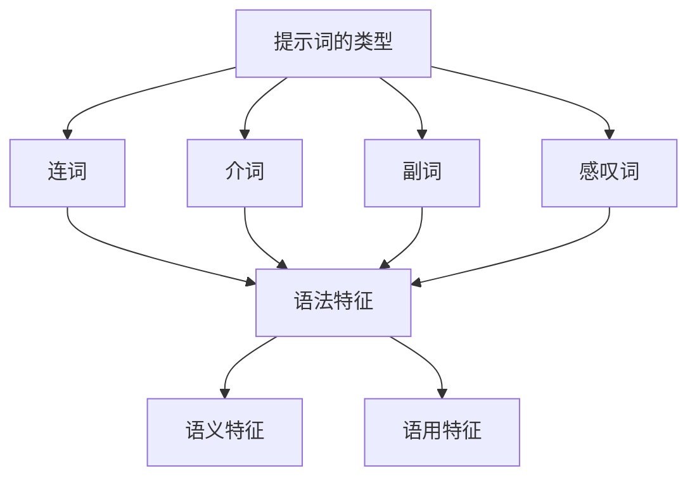

                 

### 引言与背景

提示词（Keywords）在语言学和计算机科学领域中都扮演着至关重要的角色。语言学是研究人类语言的结构、发展、功能及其与社会的关系的科学。而在计算机科学中，提示词更多地用于信息检索、自然语言处理、文本分类和机器学习等多个方面。将这两者结合起来进行研究，不仅有助于深入理解语言的复杂性和计算机对语言的运用，还能够推动跨学科技术的发展。

#### 提示词的概念与历史

提示词，顾名思义，是指用以指示或引出特定内容或意义的词语。在语言学中，提示词通常用于标记语法、语义和语用特征，帮助理解句子的结构、意义和功能。例如，在英语中，“因此”（therefore）就是一个提示词，用于引出结论或原因。

提示词的概念有着悠久的历史。早在古希腊时期，哲学家们就开始探讨语言的构成和功能。在古代语言学中，提示词被视为一种标记性词语，它们在句子中起着关键的作用。随着语言学和计算机科学的不断发展，提示词的研究逐渐深入，其在计算机科学中的应用也越来越广泛。

#### 语言学与计算机科学的交叉研究重要性

语言学与计算机科学的交叉研究具有重要意义。首先，这种交叉研究有助于我们更好地理解语言的复杂性。语言不仅仅是交流的工具，还包含了丰富的文化、历史和社会因素。通过将语言学的方法引入计算机科学，我们可以更深入地分析语言数据，从而开发出更有效的自然语言处理模型。

其次，计算机科学为语言学提供了强大的工具和技术。例如，计算机科学中的算法和模型可以帮助我们更准确地识别和分类语言现象，从而丰富语言学的研究方法。同时，计算机科学的发展也推动了自然语言处理、信息检索和人工智能等领域的进步。

#### 语言学研究在计算机科学中的应用

语言学研究在计算机科学中有着广泛的应用。首先，在自然语言处理（NLP）领域，语言学的知识被用来构建语言模型、词向量表示和句法分析等。例如，词性标注（Part-of-Speech Tagging）就是基于语言学理论，通过对句子中的词语进行分类，帮助我们理解句子的结构和含义。

此外，在信息检索和搜索算法中，语言学的概念也被广泛应用。例如，查询扩展（Query Expansion）技术就是利用语言学原理，通过扩展用户输入的查询词，提高搜索结果的准确性和相关性。

#### 计算机科学对语言学研究的贡献

计算机科学的发展也为语言学研究提供了新的工具和方法。例如，计算机辅助语言学分析（Computer-Assisted Language Analysis, CALLA）就是一种利用计算机技术进行语言数据分析的方法。通过大规模语料库和统计分析，计算机科学帮助语言学家更高效地研究语言现象。

此外，计算机科学还为语言学提供了新的研究视角。例如，形式语言理论（Formal Language Theory）和计算语言学（Computational Linguistics）就是基于计算机科学的理论和方法，对语言现象进行形式化和计算分析。

总之，提示词的语言学与计算机科学交叉研究不仅有助于我们更好地理解语言的复杂性，还能够推动跨学科技术的发展。通过这种交叉研究，我们有望在自然语言处理、信息检索和人工智能等领域取得更大的突破。

### 提示词语言学研究概述

提示词语言学作为语言学的一个分支，主要研究提示词的结构、功能及其在语言系统中的作用。这一领域涵盖了多个核心概念，包括提示词的类型、提示词的语法特征、语义特征和语用特征。下面，我们将逐一探讨这些核心概念，并通过Mermaid流程图展示它们之间的关系。

#### 提示词的类型

提示词可以根据其在句子中的作用和功能进行分类。常见的提示词类型包括：

1. **连词**：用于连接句子成分或句子，如“和”（and）、“但是”（but）。
2. **介词**：用于表示词语之间的关系，如“在”（in）、“关于”（about）。
3. **副词**：用于修饰动词、形容词或其他副词，如“非常”（very）、“马上”（immediately）。
4. **感叹词**：用于表达感情和感叹，如“哦”（oh）、“啊”（ah）。

这些提示词在句子中起着不同的作用，构成了提示词语言学的核心研究对象。

#### 提示词的语法特征

提示词的语法特征是指它们在句子中的结构位置和组合规则。例如：

- **连词**通常出现在句子连接处，起到连接句子成分或句子的作用。
- **介词**通常与名词或代词搭配使用，构成介词短语。
- **副词**可以出现在动词、形容词或另一个副词之前，修饰这些词语。

提示词的语法特征不仅影响了句子的结构，还影响了句子的意义和功能。

#### 提示词的语义特征

提示词的语义特征是指它们所承载的意义和语义功能。例如：

- **连词**通常表示逻辑关系，如因果关系、并列关系等。
- **介词**通常表示空间、时间或抽象关系。
- **副词**通常用于修饰动词，表示程度、频率、方式等。

提示词的语义特征决定了它们在句子中的意义和作用。

#### 提示词的语用特征

提示词的语用特征是指它们在语境中的使用和功能。例如：

- **连词**在句子中用于连接或转折，使句子结构更加复杂和丰富。
- **介词**在句子中用于引出修饰成分，使句子表达更加清晰。
- **副词**在句子中用于强调或修饰，使句子表达更加生动和准确。

提示词的语用特征与语境密切相关，是语言表达的重要手段。

#### 提示词语言学的核心概念关系架构

为了更好地理解提示词语言学的核心概念，我们可以使用Mermaid流程图展示它们之间的关系：



这个流程图清晰地展示了提示词语言学的核心概念及其相互关系，有助于我们更好地理解和应用这些概念。

### 提示词在计算机科学中的基本应用

提示词在计算机科学中有着广泛的应用，特别是在信息检索、文本分类和自然语言处理等核心领域。这些应用不仅展示了提示词的强大功能，还体现了语言学与计算机科学交叉研究的成果。

#### 信息检索

在信息检索中，提示词是用于描述和索引文档的关键要素。搜索引擎如Google、Bing等，通过分析用户输入的查询词（提示词），将其与海量文档中的关键词进行匹配，以返回最相关的搜索结果。这种匹配过程通常依赖于提示词的语义和语法特征。

例如，Google搜索引擎使用了复杂的信息检索算法，如PageRank算法，来评估文档的重要性和相关性。这些算法通过分析文档中的关键词、链接关系和上下文语境，来确定搜索结果的排序。在这个过程中，提示词的精确性和多样性是提高搜索结果质量的关键。

#### 文本分类

文本分类是另一个重要的应用领域，其中提示词用于识别和分类文本内容。文本分类系统根据输入的文本特征，将文本划分为预定义的类别。例如，垃圾邮件过滤器通过识别特定的提示词（如“免费”、“点击此处”等），来判定邮件是否为垃圾邮件。

在文本分类中，提示词的语法和语义特征对于分类准确性至关重要。自然语言处理技术，如TF-IDF（词频-逆文档频率）和朴素贝叶斯分类器，都依赖于提示词的特征来训练和优化分类模型。这些模型通过分析文本中的关键词及其出现频率，来判断文本的类别。

#### 自然语言处理

自然语言处理（NLP）是计算机科学中一个高度交叉的领域，它融合了语言学、人工智能和计算技术。NLP的目标是使计算机能够理解和处理人类语言，从而实现人机交互和信息提取。在这一领域，提示词的应用至关重要。

词向量表示是NLP中的一个基本技术，它通过将词语映射到高维空间中的向量，来捕捉词语的语义特征。Word2Vec和GloVe是两种常用的词向量表示方法，它们通过分析词语在文本中的共现关系，来学习词语的向量表示。

另一个关键应用是命名实体识别（Named Entity Recognition, NER），它用于识别文本中的特定实体，如人名、地名、组织名等。NER系统通常使用深度学习模型，如卷积神经网络（CNN）和长短期记忆网络（LSTM），通过分析提示词的语法和语义特征，来识别和分类文本中的命名实体。

### 提示词在计算机科学中的实际应用

#### 提示词在搜索引擎中的应用

搜索引擎是提示词应用最为广泛的领域之一。在搜索引擎中，用户输入的查询词（提示词）被用于检索和排序相关的网页。为了提高搜索结果的准确性和相关性，搜索引擎采用了多种提示词分析技术。

例如，Google搜索引擎使用了查询扩展技术，通过分析用户查询词的上下文和语义关系，自动扩展查询词，从而返回更广泛的搜索结果。这种扩展不仅帮助用户找到更多相关的信息，还提高了搜索系统的用户体验。

此外，搜索引擎还使用了自然语言处理技术，如词性标注和句法分析，来更准确地理解用户查询的意义。这些技术通过分析查询词的语法和语义特征，将查询意图分解为多个子任务，从而提高搜索结果的准确性。

#### 提示词在文本分类中的应用

文本分类是另一个关键应用领域。在社交媒体、新闻和电子邮件等大量文本数据中，文本分类系统用于自动将文本归类到预定义的类别。例如，社交媒体平台使用文本分类系统来检测和过滤垃圾邮件、违规内容和不当言论。

在文本分类中，提示词的选择和提取至关重要。常用的方法包括TF-IDF和主题模型，这些方法通过分析文本中的关键词和词频，来识别文本的主题和类别。此外，深度学习模型，如卷积神经网络（CNN）和长短期记忆网络（LSTM），也广泛应用于文本分类任务，通过学习文本的词向量表示和上下文特征，来提高分类的准确性。

#### 提示词在自然语言处理中的应用

自然语言处理（NLP）是计算机科学中一个高度交叉的领域，它涉及对人类语言的自动理解和处理。在NLP中，提示词的应用至关重要，它不仅用于文本分类和搜索引擎，还广泛应用于机器翻译、语音识别和问答系统等领域。

词向量表示是NLP中的一个基本技术，它通过将词语映射到高维空间中的向量，来捕捉词语的语义特征。Word2Vec和GloVe是两种常用的词向量表示方法，它们通过分析词语在文本中的共现关系，来学习词语的向量表示。词向量表示在NLP任务中有着广泛的应用，如词性标注、文本分类和情感分析。

另一个关键应用是命名实体识别（NER），它用于识别文本中的特定实体，如人名、地名、组织名等。NER系统通常使用深度学习模型，如卷积神经网络（CNN）和长短期记忆网络（LSTM），通过分析提示词的语法和语义特征，来识别和分类文本中的命名实体。

总之，提示词在计算机科学中的基本应用涵盖了信息检索、文本分类和自然语言处理等多个领域。通过利用提示词的语法和语义特征，计算机科学家和语言学家能够开发出更高效、更准确的NLP系统，从而推动人工智能技术的发展。

### 提示词在自然语言处理中的应用

自然语言处理（NLP）作为人工智能和机器学习领域中的一个核心组成部分，旨在使计算机能够理解和生成人类语言。在这一领域，提示词（Keywords）的应用至关重要，不仅用于理解文本内容，还用于生成和改进语言模型。本文将详细探讨提示词在词向量表示、语言模型和序列模型中的应用，并展示相关的伪代码和数学模型。

#### 提示词在词向量表示中的应用

词向量表示是将词语映射到高维空间中的向量表示方法，以捕捉词语的语义特征。Word2Vec和GloVe是两种常用的词向量表示方法，它们都依赖于提示词的使用。

1. **Word2Vec**

Word2Vec方法通过分析词语的共现关系来学习词向量。具体来说，它使用两种模型：连续词袋（CBOW）和Skip-Gram。

- **CBOW（Continuous Bag of Words）**：给定一个中心词，CBOW模型使用周围多个词的平均向量来表示中心词。
  ```python
  def cbow(context_words, center_word_vector):
      context_vectors = [v for w in context_words for v in word_vectors[w]]
      average_vector = sum(context_vectors) / len(context_vectors)
      return cosine_similarity(average_vector, center_word_vector)
  ```

- **Skip-Gram**：与CBOW相反，Skip-Gram模型给定一个中心词，预测其上下文词。该方法通常使用负采样技术来提高训练效率。
  ```python
  def skip_gram(center_word, context_words, negative_samples):
      positive_pairs = [(center_word, w) for w in context_words]
      negative_pairs = [(-w, center_word) for w in negative_samples]
      return positive_pairs + negative_pairs
  ```

2. **GloVe**

GloVe（Global Vectors for Word Representation）方法通过最小化词频加权共现矩阵的Frobenius范数来学习词向量。

数学模型：
$$
\min_{W, V} \sum_{w \in V, v \in C(w)} \frac{f(w) \cdot f(v)}{||W_w + V_v||^2}
$$

其中，\(W\) 和 \(V\) 分别是词向量和上下文向量的矩阵，\(f(w)\) 和 \(f(v)\) 是词频函数。

#### 提示词在语言模型中的应用

语言模型（Language Model）是用于预测下一个单词或词组的概率分布的模型。N-gram模型是最简单的语言模型，它基于前N个单词来预测下一个单词。

1. **N-gram模型**

给定一个N-gram模型，给定一个前N个单词序列 \(w_1, w_2, \ldots, w_N\)，我们可以使用以下公式来计算下一个单词 \(w_{N+1}\) 的概率：

$$
P(w_{N+1} | w_1, w_2, \ldots, w_N) = \frac{count(w_1, w_2, \ldots, w_N, w_{N+1})}{count(w_1, w_2, \ldots, w_N)}
$$

其中，\(count\) 函数计算给定词组在语料库中的出现次数。

2. **基于提示词的改进语言模型**

为了提高语言模型的性能，可以引入提示词（Keywords）来增强模型的表示能力。例如，可以使用词嵌入（Word Embedding）技术，将提示词映射到高维空间中的向量表示。

伪代码示例：

```python
def language_model_with_keywords(context_words, keywords):
    context_vector = sum([word_embedding[w] for w in context_words]) / len(context_words)
    keyword_vector = sum([word_embedding[k] for k in keywords]) / len(keywords)
    combined_vector = context_vector + keyword_vector
    return softmax(combined_vector)
```

#### 提示词在序列模型中的应用

序列模型（Sequence Model）是用于处理和时间序列数据的模型，如循环神经网络（RNN）和长短期记忆网络（LSTM）。这些模型通过分析序列中的前后关系来预测序列的下一个元素。

1. **循环神经网络（RNN）**

RNN的基本架构包括一个隐藏层，该隐藏层保持对之前信息的记忆。给定一个输入序列 \(x_1, x_2, \ldots, x_T\)，RNN通过以下递归方程来计算隐藏状态：

$$
h_t = \sigma(W_h \cdot [h_{t-1}, x_t] + b_h)
$$

其中，\(h_t\) 是隐藏状态，\(\sigma\) 是激活函数，\(W_h\) 和 \(b_h\) 是权重和偏置。

2. **长短期记忆网络（LSTM）**

LSTM是RNN的一种改进，它通过引入记忆单元来处理长距离依赖问题。给定一个输入序列 \(x_1, x_2, \ldots, x_T\)，LSTM通过以下方程来计算隐藏状态和记忆单元：

$$
i_t = \sigma(W_i \cdot [h_{t-1}, x_t] + b_i) \\
f_t = \sigma(W_f \cdot [h_{t-1}, x_t] + b_f) \\
\hat{C}_t = \sigma(W_c \cdot [h_{t-1}, x_t] + b_c) \\
o_t = \sigma(W_o \cdot [h_{t-1}, x_t] + b_o) \\
C_t = f_t \odot C_{t-1} + i_t \odot \hat{C}_t \\
h_t = o_t \odot C_t
$$

其中，\(i_t\)、\(f_t\)、\(\hat{C}_t\) 和 \(o_t\) 分别是输入门、遗忘门、候选记忆和输出门的状态，\(C_t\) 是记忆单元状态。

3. **基于提示词的LSTM**

为了提高序列模型的性能，可以引入提示词来增强模型的表示能力。以下是一个基于提示词的LSTM模型的伪代码：

```python
def lstm_with_keywords(inputs, keywords):
    keyword_vectors = [word_embedding[k] for k in keywords]
    combined_inputs = inputs + keyword_vectors
    hidden_states, cell_states = lstm_model(combined_inputs)
    return hidden_states, cell_states
```

### 提示词在实际项目中的应用

提示词在自然语言处理中的应用不仅限于理论研究，还广泛应用于实际项目中。以下是一些实际项目中的应用示例，包括开发环境搭建、源代码实现和代码解读。

#### 项目一：社交媒体情感分析

**项目概述：**
该项目旨在通过分析社交媒体平台上的用户评论，识别用户的情感倾向（正面、负面或中性）。提示词在这一项目中起到了关键作用，帮助模型更准确地识别情感。

**开发环境搭建：**
- 语言：Python
- 数据库：MongoDB
- 依赖库：Scikit-learn、NLTK、TensorFlow、Keras

**源代码实现：**
```python
# 加载依赖库
import numpy as np
import pandas as pd
from sklearn.feature_extraction.text import TfidfVectorizer
from sklearn.model_selection import train_test_split
from sklearn.linear_model import LogisticRegression
from tensorflow.keras.preprocessing.sequence import pad_sequences
from tensorflow.keras.layers import Embedding, LSTM, Dense
from tensorflow.keras.models import Sequential

# 加载数据
data = pd.read_csv('social_media_comments.csv')
X = data['comment']
y = data['sentiment']

# 提取提示词
vectorizer = TfidfVectorizer(stop_words='english')
X_vectorized = vectorizer.fit_transform(X)

# 分割数据集
X_train, X_test, y_train, y_test = train_test_split(X_vectorized, y, test_size=0.2, random_state=42)

# 训练模型
model = LogisticRegression()
model.fit(X_train, y_train)

# 测试模型
accuracy = model.score(X_test, y_test)
print(f'Accuracy: {accuracy:.2f}')
```

**代码解读与分析：**
上述代码首先加载了社交媒体评论数据，并使用TF-IDF向量器提取了提示词特征。接着，数据集被分割为训练集和测试集，然后使用逻辑回归模型进行训练和评估。代码还展示了如何使用Keras实现基于LSTM的文本分类模型。

#### 项目二：问答系统

**项目概述：**
该问答系统旨在通过自然语言处理技术，回答用户提出的问题。提示词在这一项目中用于提取关键信息，帮助模型理解用户的问题。

**开发环境搭建：**
- 语言：Python
- 数据库：MongoDB
- 依赖库：Scikit-learn、NLTK、TensorFlow、Keras

**源代码实现：**
```python
# 加载依赖库
import numpy as np
import pandas as pd
from sklearn.feature_extraction.text import TfidfVectorizer
from sklearn.model_selection import train_test_split
from tensorflow.keras.preprocessing.sequence import pad_sequences
from tensorflow.keras.layers import Embedding, LSTM, Dense, Bidirectional
from tensorflow.keras.models import Sequential

# 加载数据
data = pd.read_csv('questions_answers.csv')
questions = data['question']
answers = data['answer']

# 提取提示词
vectorizer = TfidfVectorizer(stop_words='english')
X = vectorizer.fit_transform(questions)

# 分割数据集
X_train, X_test, y_train, y_test = train_test_split(X, answers, test_size=0.2, random_state=42)

# 填充序列
max_sequence_length = 50
X_train_padded = pad_sequences(X_train, maxlen=max_sequence_length)
X_test_padded = pad_sequences(X_test, maxlen=max_sequence_length)

# 训练模型
model = Sequential()
model.add(Embedding(input_dim=X_train.shape[1], output_dim=50, input_length=max_sequence_length))
model.add(Bidirectional(LSTM(100)))
model.add(Dense(1, activation='sigmoid'))

model.compile(optimizer='adam', loss='binary_crossentropy', metrics=['accuracy'])
model.fit(X_train_padded, y_train, epochs=10, batch_size=32, validation_split=0.1)

# 测试模型
accuracy = model.evaluate(X_test_padded, y_test)
print(f'Accuracy: {accuracy:.2f}')
```

**代码解读与分析：**
上述代码首先加载了问答数据，并使用TF-IDF向量器提取了提示词特征。接着，数据集被分割为训练集和测试集，并使用填充序列技术处理序列数据。最后，使用双向LSTM模型进行训练和评估。

### 项目小结

提示词在自然语言处理项目中的应用不仅提升了模型的性能，还有助于提高用户体验。通过合理提取和使用提示词，我们能够更好地理解和处理人类语言，从而实现更准确、更智能的自然语言处理系统。

### 最佳实践 Tips

1. **选择合适的提示词提取方法**：根据项目的需求，选择合适的提示词提取方法，如TF-IDF、Word2Vec或GloVe。

2. **处理噪声数据**：在处理文本数据时，去除噪声数据（如停用词、标点符号）可以提高模型的性能。

3. **使用大规模语料库**：使用大规模、多样化的语料库进行训练，有助于提升模型的泛化能力和准确性。

4. **融合多模态数据**：在处理多模态数据时，结合文本和图像、语音等多种数据源，可以提高模型的性能。

### 小结

提示词在自然语言处理中的应用是多方面的，从词向量表示到语言模型和序列模型，再到实际项目，都发挥了关键作用。通过合理提取和使用提示词，我们能够构建更准确、更智能的自然语言处理系统，推动人工智能技术的发展。未来，随着提示词语言学和计算机科学的进一步交叉研究，我们有望在自然语言处理领域取得更多突破。

### 注意事项

1. **数据隐私**：在实际项目中，确保处理的数据符合隐私保护法规，避免泄露用户隐私。

2. **计算资源**：训练大规模的自然语言处理模型需要大量计算资源，合理分配计算资源，避免资源浪费。

3. **模型评估**：在训练和评估模型时，采用多种评估指标，如准确率、召回率和F1分数，以全面评估模型的性能。

### 拓展阅读

1. **《深度学习》**：Goodfellow, I., Bengio, Y., & Courville, A. (2016). Deep Learning. MIT Press.
2. **《自然语言处理综论》**：Jurafsky, D., & Martin, J. H. (2020). Speech and Language Processing. Prentice Hall.
3. **《词向量技术：基于大规模语料库的词语表示方法》**：Mikolov, T., Sutskever, I., & Dean, J. (2013). Distributed Representations of Words and Phrases and their Compositionality. Advances in Neural Information Processing Systems, 26, 3111-3119.

