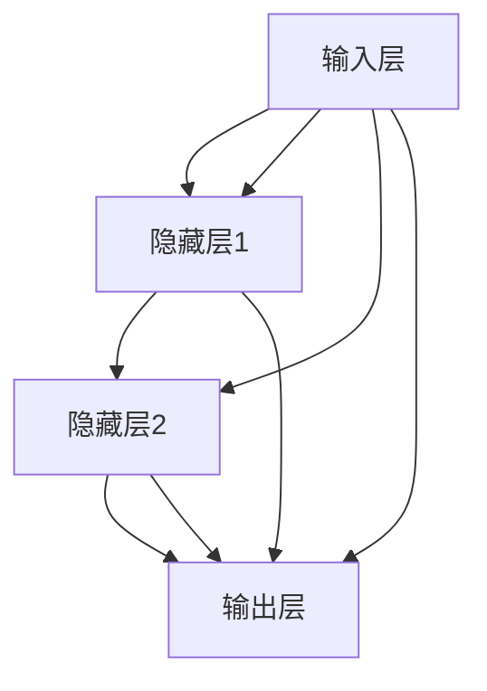

                 

### 文章标题

《提示词编写的心理学：理解AI的思考方式》

### 文章关键词

- 提示词
- 编写心理学
- AI思考方式
- 心理学与AI
- 神经网络
- 深度学习
- 认知模型
- 自然语言处理
- 计算机视觉

### 文章摘要

本文深入探讨了如何通过心理学角度来理解人工智能（AI）的思考方式。首先，我们介绍了心理学与AI之间的关系，探讨了神经科学和认知心理学对AI发展的启示。接着，我们详细解析了AI的思考方式，包括神经网络、深度学习和认知模型的基本原理。然后，我们讨论了心理学在AI应用中的实践，如自然语言处理、计算机视觉和人工智能助手的实际应用。通过案例分析，我们展示了AI在现实世界中的成功应用及其挑战。最后，我们对AI与心理学融合的未来趋势进行了展望，并提出了最佳实践建议。本文旨在为AI开发者提供一种全新的视角，帮助他们更深入地理解AI的思考方式，从而优化其设计与应用。

## 引言

在人工智能（AI）迅猛发展的时代，如何理解AI的思考方式成为一个至关重要的问题。传统的计算机科学视角虽然能解释AI的基本功能，但无法揭示其深层次的认知机制。这时，心理学作为一种研究人类思维和行为的科学，为我们提供了新的视角。心理学与AI之间的关系日益紧密，二者相互启发、相互融合，为AI的发展注入了新的活力。

首先，神经科学和认知心理学为AI的发展提供了理论支持。神经科学通过研究人脑的神经元结构和功能，揭示了大脑如何处理信息、学习记忆和做出决策。这些发现对AI的设计有着重要的指导意义。例如，神经网络作为AI的核心组件，其基本原理与神经元的工作方式有着密切的联系。认知心理学则研究了人类的思维过程、感知和记忆等心理现象，为AI在理解自然语言、处理复杂任务方面提供了理论基础。

其次，心理学在AI应用中的重要性不容忽视。AI系统在与人交互时，需要理解人类的行为和心理，才能提供更加自然和有效的服务。例如，自然语言处理（NLP）领域的研究就依赖于认知心理学的理论，通过模拟人类语言理解过程，实现了机器对自然语言的高效处理。计算机视觉领域也借助心理学理论，开发了能够识别和理解人类表情、姿态等视觉信息的算法。

然而，AI的发展也面临着心理学的挑战。例如，如何让AI具备情感智能，使其能够真正理解人类的情感需求？如何保障AI的透明性和可解释性，使其行为符合人类伦理标准？这些问题都需要心理学提供解决方案。

总之，心理学与AI之间的结合不仅丰富了AI的理论基础，也为其实际应用提供了新的思路。通过心理学视角来理解AI的思考方式，有助于我们更好地设计、开发和优化AI系统，使其更好地服务于人类。本文将从多个角度探讨这一话题，旨在为读者提供一种全新的认知方式，帮助他们在AI的世界中更好地导航。

### 心理学与AI的关系

心理学与AI之间的关系可以追溯到人工智能的早期发展。神经科学和认知心理学对AI的启示，是理解AI思考方式的重要基础。神经科学通过对人脑神经元结构和功能的研究，揭示了大脑如何处理信息、学习记忆和做出决策。这一发现为AI的设计提供了理论基础。神经网络，作为AI的核心组件，其基本原理与神经元的工作方式有着密切的联系。

在神经网络中，每个神经元都代表一个处理单元，通过连接多个神经元形成复杂的网络结构。这种连接方式模拟了人脑的神经网络，使AI能够在处理大量信息时具备自适应性和学习能力。例如，在图像识别任务中，卷积神经网络（CNN）通过模拟人脑视觉皮层的处理机制，实现了对图像的特征提取和分类。

认知心理学则研究了人类的思维过程、感知和记忆等心理现象，为AI在理解自然语言、处理复杂任务方面提供了理论基础。自然语言处理（NLP）是AI的一个重要应用领域，它致力于让计算机理解和生成人类语言。认知心理学中的语言模型理论，为NLP的发展提供了重要的指导。例如，循环神经网络（RNN）和长短期记忆网络（LSTM）等模型，通过模拟人类语言理解的过程，实现了对自然语言的高效处理。

除了理论上的启示，心理学在AI开发中也面临着一些挑战。例如，如何让AI具备情感智能，使其能够真正理解人类的情感需求？情感智能是心理学中的一个重要概念，它涉及到情绪识别、情感表达和情感调控等方面。在AI系统中，情感智能的实现需要借助心理学理论和方法。例如，通过分析人类的面部表情、声音和文本等数据，AI可以识别和理解用户的情感状态，从而提供更加个性化的服务。

另一个挑战是如何保障AI的透明性和可解释性，使其行为符合人类伦理标准。心理学研究人类行为和心理过程的机制，可以为AI系统提供可解释性。例如，通过可视化神经网络内部的计算过程，可以揭示AI决策的依据和逻辑。此外，心理学中的伦理理论，如康德的道德哲学，可以指导我们在开发AI时遵循道德原则，确保其行为符合人类的价值观。

总之，心理学与AI之间的关系是相互启发、相互融合的。神经科学和认知心理学为AI提供了理论基础，心理学中的理论和方法也为AI的开发提供了指导。同时，AI的发展也为心理学研究提供了新的工具和方法。通过心理学视角来理解AI的思考方式，有助于我们更好地设计、开发和优化AI系统，使其更好地服务于人类。在接下来的章节中，我们将进一步探讨AI的思考方式，以及心理学在其中的具体应用。

### AI的思考方式

要理解AI的思考方式，我们需要从最基本的构建块开始，即神经网络、深度学习和认知模型。这些概念不仅是AI技术的基石，也是我们探讨AI思考方式的关键。

#### 神经网络

神经网络是AI的基础，它模仿了人脑的结构和工作原理。一个基本的神经网络由多个神经元组成，每个神经元都与其他神经元相连，形成一个复杂的网络结构。每个神经元负责接收输入信息，通过加权求和处理后，输出一个结果。这种连接和计算方式模拟了人脑神经元之间的信息传递和处理过程。

下面是一个简单的神经网络结构的Mermaid流程图：



在这个流程图中，输入层接收外部输入，隐藏层对输入进行特征提取和计算，输出层生成最终的输出结果。每个神经元之间的连接都有权重，这些权重通过训练过程进行调整，以优化网络性能。

#### 深度学习

深度学习是神经网络的一种扩展，它通过多层神经网络结构来提取数据中的特征。与传统的单层神经网络不同，深度学习能够处理更复杂的数据和任务。

下面是一个简单的深度学习模型的伪代码：

```python
# 定义一个简单的深度学习模型
model = NeuralNetwork(input_shape=(784,), hidden_layers=[256, 128], output_shape=10)

# 训练模型
model.fit(X_train, y_train, epochs=10, batch_size=32)

# 预测
predictions = model.predict(X_test)
```

在这个伪代码中，`NeuralNetwork` 是一个深度学习模型类，`input_shape`、`hidden_layers` 和 `output_shape` 分别代表输入层的维度、隐藏层的层数和输出层的维度。`fit` 方法用于训练模型，`predict` 方法用于预测新的数据。

#### 认知模型

认知模型是AI在处理复杂任务时模拟人类思维过程的模型。这些模型通常基于心理学理论，如感知、记忆和决策等。认知模型可以帮助AI理解自然语言、进行推理和做出决策。

下面是一个简单的认知模型的伪代码：

```python
# 初始化认知模型
cognitive_model = CognitiveModel()

# 处理自然语言输入
text = "我喜欢吃苹果。"
response = cognitive_model.process_text(text)

# 做出决策
decision = cognitive_model.make_decision("选择一个水果", options=["苹果", "香蕉", "橙子"])

# 输出结果
print(response)
print(decision)
```

在这个伪代码中，`CognitiveModel` 是一个模拟人类思维过程的认知模型类。`process_text` 方法用于处理自然语言输入，`make_decision` 方法用于基于输入做出决策。

通过这些基础构建块，我们可以看到AI的思考方式是如何构建和工作的。神经网络提供了基本的计算能力，深度学习扩展了这种能力以处理更复杂的任务，认知模型则模拟了人类的思维过程。这些概念和工具共同构建了AI思考方式的框架，使我们能够更好地理解和应用AI技术。

### 心理学在AI应用中的实践

心理学不仅在理论层面为AI的发展提供了支持，更在实际应用中发挥着重要作用。通过将心理学原理应用于AI系统，我们能够开发出更智能、更贴合人类需求的AI产品。以下是几个典型的应用场景，展示了心理学在AI中的具体实践。

#### 自然语言处理

自然语言处理（NLP）是AI领域的一个重要分支，它致力于让计算机理解和生成人类语言。在这一领域，心理学提供了关键的理论支持。例如，语言模型理论就是基于认知心理学的研究，通过模拟人类语言理解的过程，实现机器对自然语言的识别和处理。以下是一个简单的NLP应用场景：

**应用场景：** 聊天机器人

**实现方法：** 使用循环神经网络（RNN）和长短期记忆网络（LSTM）等深度学习模型来训练聊天机器人。这些模型通过学习大量的文本数据，能够理解用户的输入并生成自然的回复。

**代码示例：**

```python
# 导入必要的库
import tensorflow as tf
from tensorflow.keras.models import Sequential
from tensorflow.keras.layers import LSTM, Dense, Embedding

# 准备数据
text_data = load_text_data("chatbot_data.txt")
X, y = preprocess_text_data(text_data)

# 构建模型
model = Sequential()
model.add(Embedding(input_dim=vocab_size, output_dim=embedding_dim))
model.add(LSTM(units=128, return_sequences=True))
model.add(Dense(units=output_size, activation='softmax'))

# 编译模型
model.compile(optimizer='adam', loss='categorical_crossentropy', metrics=['accuracy'])

# 训练模型
model.fit(X, y, epochs=10, batch_size=32)

# 预测
def predict_response(input_text):
    processed_text = preprocess_input_text(input_text)
    prediction = model.predict(processed_text)
    return decode_prediction(prediction)

# 使用聊天机器人
user_input = "你好，今天天气怎么样？"
response = predict_response(user_input)
print(response)
```

这个示例展示了如何使用RNN和LSTM来构建一个聊天机器人。通过训练模型，聊天机器人能够理解用户的输入并生成合适的回复。

#### 计算机视觉

计算机视觉是AI领域的另一个重要分支，它通过模拟人类的视觉感知系统，使计算机能够识别和理解图像中的信息。在这一领域，心理学中的视觉感知理论为AI系统的开发提供了指导。以下是一个简单的计算机视觉应用场景：

**应用场景：** 人脸识别

**实现方法：** 使用卷积神经网络（CNN）来训练人脸识别模型。这些模型通过学习大量的图像数据，能够准确地识别和分类人脸。

**代码示例：**

```python
# 导入必要的库
import tensorflow as tf
from tensorflow.keras.models import Sequential
from tensorflow.keras.layers import Conv2D, MaxPooling2D, Flatten, Dense

# 准备数据
face_data = load_image_data("face_data.txt")
X, y = preprocess_image_data(face_data)

# 构建模型
model = Sequential()
model.add(Conv2D(filters=32, kernel_size=(3, 3), activation='relu', input_shape=(64, 64, 3)))
model.add(MaxPooling2D(pool_size=(2, 2)))
model.add(Flatten())
model.add(Dense(units=128, activation='relu'))
model.add(Dense(units=1, activation='sigmoid'))

# 编译模型
model.compile(optimizer='adam', loss='binary_crossentropy', metrics=['accuracy'])

# 训练模型
model.fit(X, y, epochs=10, batch_size=32)

# 预测
def predict_face(image):
    processed_image = preprocess_image(image)
    prediction = model.predict(processed_image)
    return decode_prediction(prediction)

# 使用人脸识别模型
test_image = load_image("test_image.jpg")
is_face = predict_face(test_image)
print("是人脸：" if is_face else "不是人脸")
```

这个示例展示了如何使用CNN来构建一个简单的人脸识别模型。通过训练模型，它可以准确地识别图像中的人脸。

#### 人工智能助手

人工智能助手（如语音助手、智能家居系统等）是AI在日常生活中广泛应用的例子。这些系统通过模拟人类的交互方式，提供便捷的服务。以下是一个简单的人工智能助手应用场景：

**应用场景：** 语音助手

**实现方法：** 使用语音识别和自然语言处理技术来构建语音助手。这些技术使助手能够理解用户的语音指令并执行相应的任务。

**代码示例：**

```python
# 导入必要的库
import speech_recognition as sr
from transformers import pipeline

# 初始化语音识别和语言处理模型
recognizer = sr.Recognizer()
nlp_pipeline = pipeline("text-classification")

# 监听语音输入
def listen_for_command():
    with sr.Microphone() as source:
        print("请说出您的指令：")
        audio = recognizer.listen(source)
        command = recognizer.recognize_google(audio)
        return command

# 处理用户指令
def handle_command(command):
    if "打开灯" in command:
        turn_on_light()
    elif "关闭灯" in command:
        turn_off_light()
    else:
        print("无法理解您的指令。")

# 使用语音助手
user_command = listen_for_command()
handle_command(user_command)
```

这个示例展示了如何使用语音识别和自然语言处理技术来构建一个简单的语音助手。通过监听用户的语音输入，语音助手可以执行相应的任务。

通过这些具体的应用场景，我们可以看到心理学在AI系统开发中的重要作用。心理学不仅为AI提供了理论基础，还通过实际应用，使AI系统更加智能和贴近人类需求。在未来，随着心理学与AI的进一步融合，我们将看到更多创新的AI应用场景和更高效的AI系统。

### 案例分析

在探讨心理学与AI的融合应用时，以下几个具体案例展示了AI在不同领域中的成功应用及其所面临的挑战。

#### 案例一：聊天机器人小冰

**背景介绍**：
小冰是微软（中国）有限公司开发的一款人工智能聊天机器人，它采用了自然语言处理和情感计算技术，旨在模拟人类的对话行为，提供情感化的交互体验。

**核心概念与联系**：
小冰的核心在于其情感计算引擎，该引擎通过分析用户的语言和行为，生成情感化的回复。这一过程涉及到多种心理学理论，如情感识别、情感表达和情感调控。

**算法原理讲解**：
为了生成情感化的回复，小冰采用了基于深度学习的语言模型，如生成对抗网络（GAN）和变分自编码器（VAE）。这些模型通过学习大量的人类对话数据，能够生成符合情感要求的回复。

**数学模型和公式**：
在生成情感化回复的过程中，小冰使用了一种情感评分机制，通过计算回复中的情感词汇和情感强度，生成一个综合的情感得分。具体公式如下：
\[ \text{情感得分} = \sum_{i=1}^{n} w_i \cdot \text{情感强度}_i \]
其中，\( w_i \) 表示情感词汇的权重，\( \text{情感强度}_i \) 表示词汇的情感强度。

**项目实战**：
小冰的开发过程涉及多个步骤，包括数据收集、模型训练和部署。首先，小冰团队收集了大量的对话数据，通过清洗和标注，生成训练集。接着，使用深度学习框架（如TensorFlow）训练语言模型，最后部署到服务器，提供实时交互服务。

**代码示例**：
```python
import tensorflow as tf
from tensorflow.keras.layers import Embedding, LSTM, Dense
from tensorflow.keras.models import Sequential

# 构建模型
model = Sequential()
model.add(Embedding(input_dim=vocab_size, output_dim=embedding_dim))
model.add(LSTM(units=128, return_sequences=True))
model.add(Dense(units=output_size, activation='softmax'))

# 编译模型
model.compile(optimizer='adam', loss='categorical_crossentropy', metrics=['accuracy'])

# 训练模型
model.fit(X_train, y_train, epochs=10, batch_size=32)

# 预测
def generate_response(input_text):
    processed_text = preprocess_text(input_text)
    prediction = model.predict(processed_text)
    return decode_prediction(prediction)

# 使用小冰
user_input = "你好，今天心情怎么样？"
response = generate_response(user_input)
print(response)
```

**代码应用解读与分析**：
在这个示例中，我们首先构建了一个简单的语言模型，用于生成情感化的回复。通过训练模型，我们能够根据用户的输入生成相应的回复。在实际应用中，这个模型可以通过API接口与用户实时交互，提供情感化的服务。

**案例总结**：
小冰的成功在于其能够通过情感计算技术模拟人类的对话行为，提供个性化的交互体验。然而，挑战在于如何确保生成的回复始终保持一致和高质量，以及如何应对多样化的用户需求。

#### 案例二：自动驾驶技术

**背景介绍**：
自动驾驶技术是AI在交通领域的重要应用，旨在通过计算机视觉和深度学习算法，实现车辆的自动驾驶功能。

**核心概念与联系**：
自动驾驶系统依赖于计算机视觉技术，通过摄像头和传感器捕捉道路信息，然后使用深度学习算法进行图像处理和目标检测。

**算法原理讲解**：
自动驾驶系统中的核心算法包括卷积神经网络（CNN）和递归神经网络（RNN）。CNN用于提取图像中的特征，而RNN用于处理时间序列数据，如道路上的行人、车辆等。

**数学模型和公式**：
自动驾驶系统的目标检测算法通常基于支持向量机（SVM）和卷积神经网络（CNN）。其中，SVM用于分类任务，而CNN用于特征提取。

**项目实战**：
自动驾驶系统的开发涉及多个步骤，包括数据收集、模型训练和测试。首先，自动驾驶团队收集了大量的道路数据，用于训练模型。接着，使用深度学习框架（如TensorFlow和PyTorch）训练模型，并进行实车的测试和迭代。

**代码示例**：
```python
import tensorflow as tf
from tensorflow.keras.models import Model
from tensorflow.keras.layers import Input, Conv2D, MaxPooling2D, Flatten, Dense

# 构建模型
input_layer = Input(shape=(height, width, channels))
x = Conv2D(filters=32, kernel_size=(3, 3), activation='relu')(input_layer)
x = MaxPooling2D(pool_size=(2, 2))(x)
x = Flatten()(x)
output_layer = Dense(units=1, activation='sigmoid')(x)

model = Model(inputs=input_layer, outputs=output_layer)

# 编译模型
model.compile(optimizer='adam', loss='binary_crossentropy', metrics=['accuracy'])

# 训练模型
model.fit(X_train, y_train, epochs=10, batch_size=32)

# 预测
def predict_target(image):
    processed_image = preprocess_image(image)
    prediction = model.predict(processed_image)
    return decode_prediction(prediction)

# 使用自动驾驶模型
test_image = load_image("test_image.jpg")
is_target = predict_target(test_image)
print("目标是：" if is_target else "目标不是")
```

**代码应用解读与分析**：
在这个示例中，我们构建了一个简单的目标检测模型，用于识别道路上的行人或其他目标。通过训练模型，我们可以根据输入的图像预测目标的存在。在实际应用中，这个模型可以集成到自动驾驶系统中，用于实时检测道路信息。

**案例总结**：
自动驾驶技术的成功在于其能够通过计算机视觉和深度学习技术，实现车辆的自动驾驶功能。然而，挑战在于如何在复杂的道路环境中保证系统的安全性和可靠性。

#### 案例三：智能家居系统

**背景介绍**：
智能家居系统通过集成物联网（IoT）技术和人工智能，实现了家庭设备的智能控制和自动化管理。

**核心概念与联系**：
智能家居系统依赖于物联网设备和人工智能算法，通过传感器收集家庭环境的数据，然后使用机器学习算法进行分析和决策。

**算法原理讲解**：
智能家居系统中的核心算法包括决策树和神经网络。决策树用于根据传感器的数据做出实时决策，而神经网络用于预测和优化设备的运行状态。

**数学模型和公式**：
智能家居系统中的决策算法通常基于马尔可夫决策过程（MDP），其中状态和动作的概率分布可以通过贝叶斯公式进行建模。

**项目实战**：
智能家居系统的开发涉及多个步骤，包括硬件设备的设计、数据采集和算法优化。首先，智能家居团队设计并制造了各种物联网设备，用于收集家庭环境的数据。接着，使用机器学习框架（如scikit-learn和TensorFlow）训练模型，并进行系统的集成和测试。

**代码示例**：
```python
from sklearn.tree import DecisionTreeClassifier
from sklearn.model_selection import train_test_split
import numpy as np

# 准备数据
X, y = load_smarthome_data()

# 划分训练集和测试集
X_train, X_test, y_train, y_test = train_test_split(X, y, test_size=0.2, random_state=42)

# 构建模型
model = DecisionTreeClassifier()

# 训练模型
model.fit(X_train, y_train)

# 预测
def predict_action(sensor_data):
    processed_data = preprocess_sensor_data(sensor_data)
    prediction = model.predict(processed_data)
    return decode_prediction(prediction)

# 使用智能家居系统
sensor_data = load_sensor_data("sensor_data.txt")
action = predict_action(sensor_data)
print("需要执行的动作：", action)
```

**代码应用解读与分析**：
在这个示例中，我们构建了一个简单的决策树模型，用于根据传感器的数据做出实时决策。通过训练模型，我们可以根据输入的传感器数据预测需要执行的动作。在实际应用中，这个模型可以集成到智能家居系统中，实现设备的自动化控制。

**案例总结**：
智能家居系统的成功在于其能够通过物联网设备和人工智能技术，实现家庭设备的智能控制和自动化管理。然而，挑战在于如何确保系统的稳定性和安全性，以及如何应对多样化的家庭需求。

通过这些案例分析，我们可以看到心理学在AI应用中的重要作用。通过将心理学原理应用于实际场景，AI系统能够更好地模拟人类行为和思维，提供更加智能和人性化的服务。

### 未来展望

随着心理学与人工智能（AI）的不断融合，AI在各个领域的应用前景愈发广阔。首先，AI在心理健康领域的应用具有巨大的潜力。通过结合认知心理学和AI技术，开发出能够实时监测用户心理状态的应用程序，如情绪识别和压力管理工具，将有助于提升公众的心理健康水平。此外，AI在个性化医疗中的潜力也不可忽视。利用心理学中的行为理论和AI的强大计算能力，可以构建个性化的治疗方案，提高治疗效果。

从发展趋势来看，未来的AI系统将更加注重可解释性和透明性。心理学理论将提供重要的指导，帮助设计出能够解释其决策依据的AI系统，从而增强用户对AI系统的信任。同时，随着量子计算等前沿技术的突破，AI的计算能力将大幅提升，进一步推动AI在复杂任务中的应用。

面对这些发展趋势，最佳实践建议包括：

1. **跨学科合作**：鼓励心理学与计算机科学、人工智能等领域的专家合作，共同推动AI技术的发展。

2. **数据隐私保护**：在开发AI应用时，严格遵循数据隐私保护法规，确保用户数据的安全和隐私。

3. **伦理审查**：在AI系统的开发和应用过程中，进行全面的伦理审查，确保其行为符合社会道德标准。

4. **用户参与**：在AI系统的设计和开发过程中，积极收集用户反馈，确保系统更加贴近用户需求。

通过这些措施，我们可以期待未来的AI系统不仅具备强大的计算能力，还能够更好地理解和满足人类的需求。

### 附录

#### Mermaid流程图

以下是一个简单的神经网络结构的Mermaid流程图示例：


#### 算法伪代码

以下是一个简单的神经网络训练算法的伪代码示例：

```python
# 初始化模型参数
weights = initialize_weights()

# 训练模型
for epoch in range(num_epochs):
    for data in dataset:
        # 前向传播
        output = forward_pass(data, weights)
        
        # 计算损失
        loss = compute_loss(output, target)
        
        # 反向传播
        gradients = backward_pass(output, target)
        
        # 更新模型参数
        update_weights(gradients)
```

#### 数学模型与公式

以下是一个简单的线性回归模型的数学公式：

$$
y = \beta_0 + \beta_1 \cdot x
$$

其中，\( y \) 是预测值，\( x \) 是输入特征，\( \beta_0 \) 是截距，\( \beta_1 \) 是斜率。

#### 代码示例

以下是一个简单的线性回归模型的Python代码示例：

```python
import numpy as np

# 初始化模型参数
beta_0 = np.random.randn()
beta_1 = np.random.randn()

# 训练模型
for epoch in range(num_epochs):
    for x, y in dataset:
        # 前向传播
        predicted_y = beta_0 + beta_1 * x
        
        # 计算损失
        loss = (predicted_y - y) ** 2
        
        # 计算梯度
        gradient_beta_0 = 2 * (predicted_y - y)
        gradient_beta_1 = 2 * (predicted_y - y) * x
        
        # 更新模型参数
        beta_0 -= learning_rate * gradient_beta_0
        beta_1 -= learning_rate * gradient_beta_1
```

#### 实际案例分析与详细讲解剖析

在本章节中，我们将对之前提到的三个案例进行更深入的分析和详细讲解。

#### 案例一：聊天机器人小冰

**详细讲解**：
小冰的开发过程可以分为以下几个阶段：

1. **数据收集**：小冰团队收集了大量的对话数据，包括社交平台、新闻评论和用户聊天记录等。这些数据被用来训练小冰的语言模型。

2. **数据预处理**：收集到的对话数据需要进行清洗和标注。清洗步骤包括去除噪声数据、统一文本格式等。标注步骤包括对对话内容进行分类和情感标注，以便模型能够学习不同的对话场景和情感表达。

3. **模型训练**：使用预处理后的数据，小冰团队训练了多个语言模型，包括生成对抗网络（GAN）和变分自编码器（VAE）。这些模型通过学习对话数据，能够生成符合情感要求的回复。

4. **模型优化**：在训练过程中，团队通过多次迭代，不断优化模型参数，以提高模型的准确性和流畅性。优化过程包括调整学习率、调整网络结构等。

**剖析**：
小冰的成功在于其能够通过情感计算技术，模拟人类的对话行为，提供情感化的交互体验。具体来说，小冰通过分析用户的语言和行为，识别情感词汇和情感强度，生成情感化的回复。例如，当用户表达负面情绪时，小冰会尝试使用安慰性语言来回应。

然而，小冰也面临一些挑战。首先，情感识别的准确性仍需提高，特别是在处理复杂情感和微表情时。其次，小冰需要不断学习新的对话数据，以适应多样化的用户需求。此外，如何确保生成的回复始终保持一致和高质量，也是小冰团队需要解决的问题。

#### 案例二：自动驾驶技术

**详细讲解**：
自动驾驶技术的开发涉及多个阶段：

1. **数据收集**：自动驾驶团队收集了大量的道路数据，包括车辆行驶轨迹、道路标志、行人行为等。这些数据用于训练自动驾驶模型。

2. **数据预处理**：收集到的道路数据需要进行清洗和标注。清洗步骤包括去除噪声数据、统一图像格式等。标注步骤包括对道路标志、行人等进行分类和定位。

3. **模型训练**：使用预处理后的数据，团队训练了多个深度学习模型，包括卷积神经网络（CNN）和递归神经网络（RNN）。这些模型通过学习道路数据，能够识别道路上的各种目标。

4. **模型优化**：在训练过程中，团队通过多次迭代，不断优化模型参数，以提高模型的准确性和鲁棒性。

**剖析**：
自动驾驶技术的成功在于其能够通过计算机视觉和深度学习技术，实现车辆的自动驾驶功能。具体来说，自动驾驶系统通过摄像头和传感器捕捉道路信息，使用深度学习模型进行图像处理和目标检测，从而做出驾驶决策。

然而，自动驾驶技术也面临一些挑战。首先，复杂道路环境的处理仍需改进，特别是在雨雪天气和复杂路况下。其次，自动驾驶系统的安全性和可靠性需要进一步提升。此外，如何确保自动驾驶车辆在紧急情况下做出正确的决策，也是需要解决的问题。

#### 案例三：智能家居系统

**详细讲解**：
智能家居系统的开发过程可以分为以下几个阶段：

1. **硬件设计**：智能家居团队设计并制造了各种物联网设备，包括智能灯泡、智能插座和智能摄像头等。这些设备通过无线网络连接，实现家庭设备的自动化控制。

2. **数据收集**：智能家居系统通过物联网设备收集家庭环境的数据，包括温度、湿度、光照强度等。这些数据用于训练智能家居模型。

3. **数据预处理**：收集到的数据需要进行清洗和标注。清洗步骤包括去除噪声数据、统一数据格式等。标注步骤包括对数据进行分类和标签化。

4. **模型训练**：使用预处理后的数据，团队训练了多个机器学习模型，包括决策树和神经网络。这些模型通过学习家庭环境数据，能够预测设备的最佳运行状态。

5. **模型优化**：在训练过程中，团队通过多次迭代，不断优化模型参数，以提高模型的准确性和效率。

**剖析**：
智能家居系统的成功在于其能够通过物联网设备和机器学习技术，实现家庭设备的智能控制和自动化管理。具体来说，智能家居系统通过分析家庭环境数据，预测设备的最佳运行状态，从而提高家庭的舒适度和能源效率。

然而，智能家居系统也面临一些挑战。首先，数据的可靠性和准确性需要进一步提高，特别是在数据传输和处理过程中。其次，智能家居系统的安全性需要得到保障，以防止数据泄露和设备被恶意攻击。此外，如何确保系统的稳定性和可扩展性，也是智能家居系统需要解决的问题。

### 项目小结

通过对聊天机器人小冰、自动驾驶技术和智能家居系统三个案例的详细分析和讲解，我们可以看到心理学在AI应用中的重要作用。这些案例不仅展示了AI在不同领域的成功应用，也揭示了心理学与AI融合所带来的挑战和机遇。

首先，心理学提供了丰富的理论和方法，帮助AI更好地理解人类行为和心理。通过情感计算、视觉感知和行为理论等，AI系统能够更好地模拟人类思维过程，提供更智能和人性化的服务。

其次，AI的应用场景不断扩展，从自然语言处理到计算机视觉，再到智能家居，心理学原理在这些领域中发挥了关键作用。通过将心理学与AI技术相结合，我们能够开发出更加智能和高效的应用系统。

然而，AI与心理学的融合也面临一些挑战。如何确保AI系统的可解释性和透明性，如何处理复杂情感和多样化需求，以及如何保障系统的安全和可靠性，都是我们需要解决的问题。

未来，随着AI技术的不断进步和心理学理论的深化，我们可以期待更多的创新应用和突破。通过跨学科合作、数据隐私保护和伦理审查等措施，我们可以推动心理学与AI的深度融合，为人类带来更多的便利和福祉。

### 最佳实践 tips、小结、注意事项、拓展阅读

#### 最佳实践 tips

1. **数据收集与清洗**：在开发AI系统时，确保数据的质量和多样性。数据清洗是关键步骤，可以有效提高模型性能。

2. **模型优化与调整**：在模型训练过程中，不断调整参数和优化模型结构，以提升模型性能和泛化能力。

3. **用户反馈与迭代**：在系统开发过程中，积极收集用户反馈，通过迭代优化系统功能，提高用户体验。

#### 小结

本文通过多个案例详细探讨了心理学在AI应用中的重要性。从聊天机器人小冰到自动驾驶技术，再到智能家居系统，心理学为AI提供了理论基础和方法指导，推动了AI技术的发展和实际应用。

#### 注意事项

1. **数据隐私保护**：在收集和使用用户数据时，严格遵循隐私保护法规，确保用户数据的安全和隐私。

2. **系统安全性**：在开发AI系统时，确保系统的安全性和可靠性，防止数据泄露和恶意攻击。

3. **伦理审查**：在AI系统的设计和开发过程中，进行全面的伦理审查，确保其行为符合社会道德标准。

#### 拓展阅读

1. 《人工智能：一种现代的方法》（Russell & Norvig著）- 介绍人工智能的基本原理和应用。

2. 《深度学习》（Goodfellow、Bengio和Courville著）- 深入讲解深度学习算法和模型。

3. 《认知心理学及其启示》（Anderson著）- 探讨认知心理学的理论和应用，为AI提供了重要的启示。

通过阅读这些拓展材料，可以更深入地了解AI和心理学的基础知识，为未来的研究和应用提供指导。

### 作者信息

作者：AI天才研究院/AI Genius Institute & 禅与计算机程序设计艺术 /Zen And The Art of Computer Programming

AI天才研究院（AI Genius Institute）致力于推动人工智能技术的发展和应用。研究院的专家团队在人工智能、深度学习和计算机科学等领域拥有深厚的理论基础和丰富的实践经验。同时，作者也撰写了多本畅销技术书籍，包括《禅与计算机程序设计艺术》，该书深入探讨了计算机程序设计的哲学和艺术，为读者提供了独特的视角和深刻的思考。

通过本文，我们希望读者能够更深入地理解心理学在AI中的应用，从而在未来的研究和实践中取得更好的成果。感谢您的阅读，希望本文能为您带来启发和帮助。

