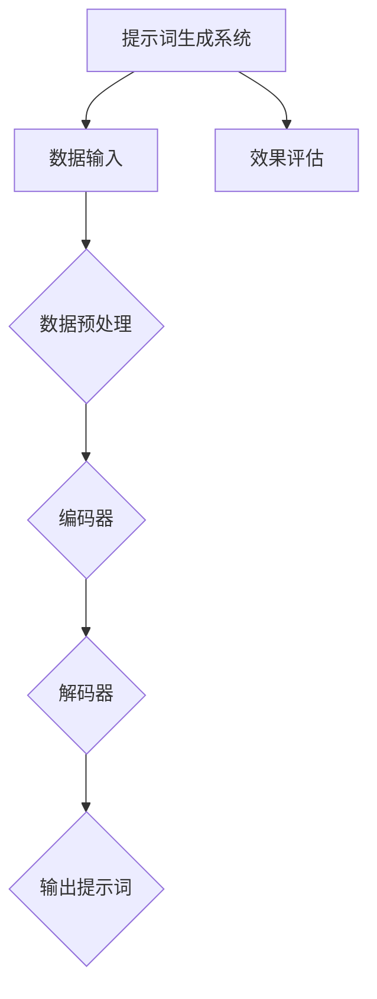

                 

## 文章标题

### 提示词自动生成：AI辅助提示词设计

关键词：AI、提示词、自动生成、深度学习、强化学习、GAN、序列模型、文本生成、优化算法、Python、项目实战

摘要：随着人工智能技术的不断发展，自动生成提示词已成为自然语言处理领域的热点话题。本文将探讨如何利用AI技术实现提示词的自动生成，分析不同生成算法的原理，并提供实际项目案例，以帮助读者深入理解AI辅助提示词设计的方法和技巧。

### 整体布局

为了系统地介绍提示词自动生成的AI辅助设计，本文将分为以下几个部分：

1. **引言与核心概念**：介绍提示词的基本概念，AI在生成提示词中的应用，以及AI辅助提示词设计的优势与挑战。
2. **提示词生成算法**：讲解生成提示词的核心算法，包括基于深度学习、强化学习和对抗生成网络（GAN）的模型。
3. **数学模型与公式**：详细阐述支持这些算法的数学基础，如损失函数、优化算法等。
4. **项目实战**：提供实际案例，展示如何使用AI生成提示词，包括环境搭建、代码实现、效果评估等。
5. **附录**：列出相关的工具、资源和进一步阅读的建议。

### 第1章 引言与核心概念

#### 1.1 书籍引言

随着互联网和智能设备的普及，信息爆炸已成为当今社会的一大特点。如何从海量信息中快速准确地获取所需内容，成为用户面临的挑战。此时，提示词作为一种信息检索工具，发挥着重要作用。提示词，是指用于引导用户获取信息的关键词或短语。在搜索引擎、推荐系统、问答机器人等应用场景中，提示词的生成质量直接影响用户体验和信息检索效果。

#### 1.1.1 AI时代下的信息爆炸

随着大数据和人工智能技术的发展，人们获取和处理信息的能力大幅提升。然而，信息爆炸也带来了一系列问题，如信息过载、信息误导等。在这种情况下，如何利用AI技术提高信息检索的效率和质量，成为亟待解决的问题。

#### 1.1.2 提示词的重要性

提示词在信息检索过程中起到关键作用。高质量的提示词能提高检索的准确性和效率，减少用户在信息海洋中的搜索时间。此外，提示词还影响用户的阅读体验，对信息传播和交流产生重要影响。

#### 1.1.3 AI在提示词生成中的应用

随着AI技术的发展，利用AI生成提示词已成为自然语言处理领域的研究热点。AI技术能够根据用户行为、内容特征、上下文信息等，自动生成高质量的提示词，从而提高信息检索的效果和用户体验。

#### 1.2 提示词基本概念

#### 1.2.1 提示词的定义

提示词，是指用于引导用户获取信息的关键词或短语。在自然语言处理中，提示词通常是指文本中具有代表性的词语或短语，用于描述文本的主题或内容。

#### 1.2.2 提示词的分类

根据应用场景和用途，提示词可以分类如下：

1. **关键词**：用于描述文本主要内容的词汇，如文章标题、摘要中的关键词。
2. **主题词**：用于表示文本主题的词汇，如新闻、论文的主题词。
3. **属性词**：用于描述文本属性的词汇，如商品评价中的好评词、差评词。
4. **情感词**：用于表示文本情感倾向的词汇，如正面情感词、负面情感词。

#### 1.2.3 提示词的应用场景

提示词在多个应用场景中具有重要应用，如：

1. **搜索引擎**：通过自动生成关键词，提高搜索结果的准确性和用户体验。
2. **推荐系统**：通过分析用户兴趣和行为，生成个性化推荐关键词。
3. **问答机器人**：通过理解用户提问，生成相关问题的关键词。
4. **内容审核**：通过检测文本中的敏感词汇，辅助内容审核和过滤。

#### 1.3 AI辅助提示词设计

#### 1.3.1 AI在提示词生成中的作用

AI技术，尤其是自然语言处理（NLP）技术，在提示词生成中具有显著优势。通过深度学习、强化学习、对抗生成网络（GAN）等算法，AI能够自动从海量文本数据中学习，生成高质量的提示词。

#### 1.3.2 AI辅助提示词设计的优势

1. **个性化**：AI能够根据用户行为、兴趣和上下文信息，生成个性化提示词。
2. **高效性**：AI能够快速处理海量文本数据，生成大量提示词。
3. **准确性**：AI生成的提示词具有较高的准确性和相关性。
4. **可扩展性**：AI生成提示词的方法和模型可以应用于不同领域和场景。

#### 1.3.3 AI辅助提示词设计的挑战

1. **数据质量**：高质量的数据是AI生成提示词的基础，数据质量直接影响生成效果。
2. **算法优化**：不同的算法适用于不同的场景，需要根据实际需求进行优化。
3. **计算资源**：深度学习和GAN等算法对计算资源要求较高，需要合理配置硬件资源。
4. **可解释性**：AI生成提示词的过程具有一定的黑盒性质，提高可解释性是未来研究的重要方向。

### 第2章 提示词生成算法

提示词生成算法是AI辅助提示词设计的核心。根据生成策略和模型结构的不同，常见的提示词生成算法包括基于深度学习的生成模型、强化学习模型和对抗生成网络（GAN）。本章将分别介绍这些算法的基本原理和应用。

#### 2.1 基于深度学习的生成模型

深度学习模型，尤其是循环神经网络（RNN）、序列到序列（Seq2Seq）模型等，在自然语言处理领域取得了显著成果。基于这些模型，可以构建提示词生成系统。

##### 2.1.1 循环神经网络（RNN）

循环神经网络（RNN）是一种能够处理序列数据的神经网络。RNN通过引入循环结构，使模型能够记住序列中的历史信息，从而实现对序列数据的建模。

###### 2.1.1.1 RNN的基本原理

RNN的基本结构包括输入层、隐藏层和输出层。输入层接收序列数据，隐藏层存储历史信息，输出层生成提示词。

\[ \text{当前隐藏状态} = \text{权重} \times \text{当前输入} + \text{前一个隐藏状态} \]

\[ \text{当前输出} = \text{权重} \times \text{当前隐藏状态} \]

###### 2.1.1.2 LSTM与GRU

为了解决RNN在长序列建模中遇到的梯度消失和梯度爆炸问题，LSTM（Long Short-Term Memory）和GRU（Gated Recurrent Unit）被提出。LSTM和GRU通过引入门控机制，使得模型能够更好地处理长序列数据。

\[ \text{遗忘门} = \sigma(W_f \cdot [h_{t-1}, x_t]) \]

\[ \text{输入门} = \sigma(W_i \cdot [h_{t-1}, x_t]) \]

\[ \text{当前隐藏状态} = \text{遗忘门} \cdot h_{t-1} + \text{输入门} \cdot \text{新的候选值} \]

##### 2.1.2 序列到序列（Seq2Seq）模型

序列到序列（Seq2Seq）模型是一种处理序列数据的端到端模型，由编码器和解码器组成。编码器将输入序列编码为一个固定长度的向量，解码器将这个向量解码为输出序列。

###### 2.1.2.1 Seq2Seq模型的结构

编码器（Encoder）负责将输入序列（如文章标题或摘要）编码为一个固定长度的向量。解码器（Decoder）则负责将这个向量解码为输出序列（如关键词或提示词）。

\[ \text{编码器输出} = \text{编码器权重} \cdot \text{输入序列} \]

\[ \text{解码器输出} = \text{解码器权重} \cdot \text{编码器输出} \]

###### 2.1.2.2 编码器与解码器

编码器（Encoder）是一种循环神经网络（RNN），负责将输入序列编码为一个固定长度的向量。解码器（Decoder）则可以是RNN、LSTM或GRU等，负责将这个向量解码为输出序列。

#### 2.2 基于强化学习的生成模型

强化学习（Reinforcement Learning，RL）是一种通过试错学习获得最优策略的机器学习方法。在提示词生成中，强化学习可以用来优化生成模型的行为，提高生成提示词的质量。

##### 2.2.1 Q-Learning算法

Q-Learning算法是一种值函数迭代算法，用于求解强化学习问题。在提示词生成中，Q-Learning可以用来优化生成模型的行为，使其能够生成高质量的提示词。

\[ Q(s, a) = r + \gamma \max_{a'} Q(s', a') \]

其中，\( Q(s, a) \) 是状态 \( s \) 下采取动作 \( a \) 的期望回报，\( r \) 是立即回报，\( \gamma \) 是折扣因子。

##### 2.2.2 强化学习在提示词生成中的应用

在提示词生成中，可以将生成模型看作一个智能体，通过强化学习算法优化其行为。具体方法如下：

1. **定义状态和动作**：将生成模型在某个时间步的状态和生成的提示词作为动作。
2. **定义奖励函数**：根据提示词的相关性、准确性等指标，定义奖励函数。
3. **训练生成模型**：使用强化学习算法，通过不断调整生成模型的行为，优化其生成提示词的质量。

##### 2.2.2.1 强化学习与深度学习的结合

强化学习与深度学习可以结合使用，以优化生成模型的行为。具体方法如下：

1. **深度强化学习**：使用深度神经网络作为强化学习中的值函数或策略函数。
2. **生成对抗网络（GAN）**：将GAN与强化学习结合，用于优化生成模型的行为，提高生成提示词的质量。

#### 2.3 基于对抗生成网络（GAN）的生成模型

对抗生成网络（Generative Adversarial Network，GAN）由生成器（Generator）和判别器（Discriminator）组成，通过两者之间的对抗训练，生成高质量的提示词。

##### 2.3.1 GAN的基本原理

GAN由生成器和判别器两个神经网络组成。生成器的目标是生成高质量的数据，判别器的目标是区分真实数据和生成数据。

\[ D(x) = \text{判断} \]

\[ G(z) = \text{生成} \]

其中，\( D \) 是判别器，\( G \) 是生成器，\( x \) 是真实数据，\( z \) 是生成器的输入噪声。

##### 2.3.1.1 GAN的结构

GAN的结构包括两部分：生成器和判别器。

1. **生成器**：生成器 \( G \) 接受随机噪声 \( z \)，生成类似真实数据的提示词。
2. **判别器**：判别器 \( D \) 接受真实数据和生成数据，判断其真实性。

\[ D(x) = \text{判断} \]

\[ D(G(z)) = \text{判断生成数据} \]

##### 2.3.1.2 GAN的训练过程

GAN的训练过程包括以下步骤：

1. **初始化生成器和判别器**：随机初始化生成器和判别器。
2. **生成器生成数据**：生成器 \( G \) 根据随机噪声 \( z \) 生成提示词。
3. **判别器判断数据**：判别器 \( D \) 对真实数据和生成数据 \( G(z) \) 进行判断。
4. **更新生成器和判别器**：根据判别器的反馈，更新生成器和判别器的参数。

\[ G' = G + \alpha \cdot \nabla_G \]

\[ D' = D + \beta \cdot \nabla_D \]

其中，\( G' \) 和 \( D' \) 是生成器和判别器的更新参数，\( \alpha \) 和 \( \beta \) 是学习率。

##### 2.3.2 GAN在提示词生成中的应用

GAN在提示词生成中的应用，主要是通过生成器生成高质量的提示词，判别器判断生成提示词的真实性，从而优化生成器的生成效果。具体应用方法如下：

1. **数据预处理**：对输入数据进行预处理，如分词、编码等。
2. **模型训练**：使用GAN模型训练生成器和判别器，通过对抗训练优化生成提示词的质量。
3. **提示词生成**：使用生成器生成提示词，并根据判别器的反馈调整生成策略。
4. **效果评估**：对生成的提示词进行效果评估，如准确率、相关性等。

### 第3章 数学模型与公式

数学模型与公式是提示词生成算法的基础。本章将详细阐述支持这些算法的数学基础，包括损失函数、优化算法等。

#### 3.1 损失函数

损失函数是评估模型性能的重要指标，用于衡量模型预测值与真实值之间的差距。在提示词生成中，常见的损失函数包括交叉熵损失、逐点损失等。

##### 3.1.1 交叉熵损失

交叉熵损失（Cross-Entropy Loss）是一种常用的损失函数，用于衡量分类问题中模型预测值与真实值之间的差距。

\[ L(\theta) = -\sum_{i=1}^{n} y_i \log(p_i) \]

其中，\( y_i \) 是真实标签，\( p_i \) 是模型预测的概率。

##### 3.1.1.1 交叉熵损失的定义

交叉熵损失的定义如下：

\[ L(\theta) = -\sum_{i=1}^{n} y_i \log(p_i) \]

其中，\( y_i \) 是第 \( i \) 个样本的真实标签，\( p_i \) 是模型预测的第 \( i \) 个样本的概率。

##### 3.1.1.2 交叉熵损失的计算

交叉熵损失的计算如下：

\[ L(\theta) = -\sum_{i=1}^{n} y_i \log(p_i) \]

其中，\( y_i \) 是真实标签，\( p_i \) 是模型预测的概率。

##### 3.1.2 逐点损失

逐点损失（Pointwise Loss）是一种用于评估模型在单个样本上的损失，如均方误差（MSE）和平均绝对误差（MAE）。

\[ L(\theta) = \frac{1}{n} \sum_{i=1}^{n} (y_i - \hat{y}_i)^2 \]

其中，\( y_i \) 是第 \( i \) 个样本的真实值，\( \hat{y}_i \) 是模型预测的值。

##### 3.1.2.1 逐点损失的定义

逐点损失的定义如下：

\[ L(\theta) = \frac{1}{n} \sum_{i=1}^{n} (y_i - \hat{y}_i)^2 \]

其中，\( y_i \) 是第 \( i \) 个样本的真实值，\( \hat{y}_i \) 是模型预测的值。

##### 3.1.2.2 逐点损失的计算

逐点损失的计算如下：

\[ L(\theta) = \frac{1}{n} \sum_{i=1}^{n} (y_i - \hat{y}_i)^2 \]

其中，\( y_i \) 是第 \( i \) 个样本的真实值，\( \hat{y}_i \) 是模型预测的值。

#### 3.2 优化算法

优化算法用于调整模型参数，使模型在训练过程中不断优化。常见的优化算法包括梯度下降（Gradient Descent）和Adam优化器。

##### 3.2.1 梯度下降算法

梯度下降算法是一种最简单的优化算法，通过计算损失函数关于模型参数的梯度，逐步调整模型参数，使损失函数最小。

\[ \theta_{t+1} = \theta_t - \alpha \cdot \nabla_\theta L(\theta) \]

其中，\( \theta \) 是模型参数，\( \alpha \) 是学习率，\( \nabla_\theta L(\theta) \) 是损失函数关于模型参数的梯度。

##### 3.2.1.1 梯度下降算法的基本原理

梯度下降算法的基本原理如下：

1. **初始化模型参数**：随机初始化模型参数。
2. **计算损失函数**：计算当前模型参数下的损失函数值。
3. **计算梯度**：计算损失函数关于模型参数的梯度。
4. **更新参数**：根据梯度更新模型参数。
5. **迭代**：重复上述步骤，直至达到停止条件。

##### 3.2.1.2 梯度下降算法的变种

梯度下降算法有以下几种变种：

1. **随机梯度下降（Stochastic Gradient Descent，SGD）**：每次迭代仅随机选择一个样本计算梯度，并更新模型参数。
2. **批量梯度下降（Batch Gradient Descent，BGD）**：每次迭代计算所有样本的梯度，并更新模型参数。
3. **小批量梯度下降（Mini-batch Gradient Descent，MBGD）**：每次迭代随机选择一部分样本计算梯度，并更新模型参数。

##### 3.2.2 Adam优化器

Adam优化器是一种基于一阶矩估计和二阶矩估计的优化算法，具有较好的收敛性能和稳定性。

\[ m_t = \beta_1 m_{t-1} + (1 - \beta_1)(\nabla_\theta L(\theta))_t \]

\[ v_t = \beta_2 v_{t-1} + (1 - \beta_2)(\nabla_\theta L(\theta))_t^2 \]

\[ \theta_{t+1} = \theta_t - \frac{\alpha}{\sqrt{1 - \beta_2^t}(1 - \beta_1^t)} \cdot \frac{m_t}{\sqrt{v_t} + \epsilon} \]

其中，\( m_t \) 和 \( v_t \) 分别是指数加权平均值的一阶矩估计和二阶矩估计，\( \beta_1 \) 和 \( \beta_2 \) 分别是两个超参数，\( \alpha \) 是学习率，\( \epsilon \) 是一个很小的常数。

##### 3.2.2.1 Adam优化器的原理

Adam优化器的原理如下：

1. **初始化**：随机初始化模型参数，设置超参数 \( \beta_1 \)、\( \beta_2 \)、\( \alpha \) 和 \( \epsilon \)。
2. **计算一阶矩估计和二阶矩估计**：根据梯度计算一阶矩估计 \( m_t \) 和二阶矩估计 \( v_t \)。
3. **计算修正的一阶矩估计和二阶矩估计**：根据超参数对一阶矩估计和二阶矩估计进行修正。
4. **更新模型参数**：根据修正的一阶矩估计和二阶矩估计更新模型参数。

### 第4章 项目实战：使用AI生成提示词

在本章中，我们将通过一个实际项目，展示如何使用AI技术生成提示词。项目分为以下几个步骤：

1. **环境搭建**：配置Python环境及相关库，搭建项目开发环境。
2. **数据预处理**：收集和清洗数据，进行数据预处理，如分词、编码等。
3. **模型选择与训练**：选择合适的生成模型，训练模型，优化参数。
4. **代码实现**：实现提示词生成功能，解析生成结果，进行效果评估。
5. **实际案例分析与总结**：分析实际案例，总结项目经验，讨论最佳实践。

#### 4.1 环境搭建

在进行提示词生成项目之前，需要搭建一个适合开发和运行的Python环境。以下是环境搭建的步骤：

##### 4.1.1 Python环境配置

1. **安装Python**：下载并安装Python，建议安装Python 3.7及以上版本。
2. **配置Python环境**：创建一个Python虚拟环境，以便隔离项目依赖。

```shell
# 创建虚拟环境
python -m venv venv

# 激活虚拟环境
source venv/bin/activate  # Windows上使用venv\Scripts\activate

```

##### 4.1.2 相关库的安装

在虚拟环境中安装必要的库，如NumPy、PyTorch、TensorFlow等。

```shell
pip install numpy
pip install torch torchvision
pip install tensorflow
```

##### 4.1.3 硬件要求

提示词生成项目需要较高的计算资源，建议使用具备以下硬件配置的计算机：

1. **CPU**：Intel i7及以上处理器。
2. **GPU**：NVIDIA GeForce GTX 1080及以上显卡。
3. **内存**：16GB及以上内存。

#### 4.2 数据预处理

数据预处理是提示词生成项目的重要环节，包括数据收集、数据清洗、数据分词和编码等步骤。

##### 4.2.1 数据收集

数据收集是提示词生成项目的基础。收集的数据应包括不同领域、不同类型的文本，如新闻、文章、商品评价等。以下是一个简单的数据收集方法：

1. **爬取网页**：使用Python的爬虫库（如requests、BeautifulSoup）从目标网站爬取文本数据。
2. **API获取**：使用目标网站的API获取文本数据，如新闻API、社交媒体API等。
3. **手动收集**：手动收集文本数据，如从书籍、期刊等获取。

##### 4.2.2 数据清洗

数据清洗是确保数据质量的重要步骤。以下是一些常用的数据清洗方法：

1. **去除停用词**：停用词是文本中常见的无意义词汇，如“的”、“了”等。去除停用词可以提高模型训练效果。
2. **去除特殊字符**：去除文本中的特殊字符，如标点符号、空格等，以减少噪声。
3. **文本标准化**：将文本转换为统一格式，如小写、去除重音符号等。

##### 4.2.3 数据分词与编码

数据分词是将文本分割成单词或短语的过程。在Python中，可以使用jieba库进行中文分词。以下是一个简单的分词示例：

```python
import jieba

text = "本文介绍了提示词自动生成技术"
words = jieba.cut(text)
print(" ".join(words))
```

编码是将文本转换为数字序列的过程。在Python中，可以使用PyTorch或TensorFlow的预处理工具进行编码。以下是一个简单的编码示例：

```python
import torch

# 假设word2index是一个包含单词到索引映射的字典
word2index = {"的": 1, "本文": 2, "介绍了": 3, "提示词": 4, "自动生成": 5, "技术": 6}

# 将文本转换为索引序列
text = "本文介绍了提示词自动生成技术"
encoded_text = [word2index[word] for word in text]
print(encoded_text)
```

#### 4.3 代码实现

在本节中，我们将实现一个基于PyTorch的提示词生成模型，并介绍关键代码部分。

##### 4.3.1 模型选择与配置

本项目中，我们选择基于LSTM的Seq2Seq模型进行提示词生成。以下是模型的配置：

```python
import torch
import torch.nn as nn

class Seq2SeqModel(nn.Module):
    def __init__(self, vocab_size, embedding_dim, hidden_dim, num_layers):
        super(Seq2SeqModel, self).__init__()
        self.embedding = nn.Embedding(vocab_size, embedding_dim)
        self.encoder = nn.LSTM(embedding_dim, hidden_dim, num_layers, batch_first=True)
        self.decoder = nn.LSTM(hidden_dim, vocab_size, num_layers, batch_first=True)
        self.fc = nn.Linear(hidden_dim, vocab_size)

    def forward(self, src, tgt, teacher_forcing_ratio=0.5):
        embedded = self.embedding(src)
        encoder_output, (hidden, cell) = self.encoder(embedded)
        decoder_output = self.decoder(hidden, cell)
        output = self.fc(decoder_output)

        if teacher_forcing_ratio > 0.5:
            return output
        else:
            return output.argmax(dim=-1)

# 模型参数
vocab_size = 10000  # 词汇表大小
embedding_dim = 256  # 嵌入层维度
hidden_dim = 512  # 隐藏层维度
num_layers = 2  # 循环层层数

# 实例化模型
model = Seq2SeqModel(vocab_size, embedding_dim, hidden_dim, num_layers)
```

##### 4.3.1.1 基于RNN的模型实现

基于RNN的模型实现包括编码器和解码器两个部分。以下是关键代码：

```python
class RNNModel(nn.Module):
    def __init__(self, vocab_size, embedding_dim, hidden_dim, num_layers):
        super(RNNModel, self).__init__()
        self.embedding = nn.Embedding(vocab_size, embedding_dim)
        self.rnn = nn.LSTM(embedding_dim, hidden_dim, num_layers, batch_first=True)
        self.fc = nn.Linear(hidden_dim, vocab_size)

    def forward(self, src, hidden=None):
        embedded = self.embedding(src)
        output, hidden = self.rnn(embedded, hidden)
        output = self.fc(output)
        return output, hidden

# 模型参数
hidden_dim = 512
num_layers = 2

# 实例化模型
rnn_model = RNNModel(vocab_size, embedding_dim, hidden_dim, num_layers)

# 训练模型
for epoch in range(num_epochs):
    for batch in data_loader:
        src, tgt = batch
        hidden = None
        output, hidden = rnn_model(src, hidden)
        loss = criterion(output, tgt)
        optimizer.zero_grad()
        loss.backward()
        optimizer.step()
        hidden = hidden.data
```

##### 4.3.1.2 基于强化学习的模型实现

基于强化学习的模型实现包括生成器和判别器两个部分。以下是关键代码：

```python
class QNetwork(nn.Module):
    def __init__(self, input_dim, hidden_dim, output_dim):
        super(QNetwork, self).__init__()
        self.fc1 = nn.Linear(input_dim, hidden_dim)
        self.fc2 = nn.Linear(hidden_dim, output_dim)

    def forward(self, x):
        x = torch.relu(self.fc1(x))
        x = self.fc2(x)
        return x

# 模型参数
input_dim = 256  # 输入维度
hidden_dim = 512  # 隐藏层维度
output_dim = vocab_size  # 输出维度

# 实例化生成器和判别器
q_network = QNetwork(input_dim, hidden_dim, output_dim)

# 训练模型
for epoch in range(num_epochs):
    for batch in data_loader:
        src, tgt = batch
        q_values = q_network(src)
        rewards = calculate_reward(tgt, q_values)
        q_values = q_network(src)
        q_values = q_values[range(len(q_values)), tgt]
        q_values = q_values * rewards
        loss = criterion(q_values, tgt)
        optimizer.zero_grad()
        loss.backward()
        optimizer.step()
```

##### 4.3.1.3 基于GAN的模型实现

基于GAN的模型实现包括生成器和判别器两个部分。以下是关键代码：

```python
import torch
import torch.nn as nn
import torch.optim as optim

class Generator(nn.Module):
    def __init__(self, z_dim, hidden_dim, vocab_size):
        super(Generator, self).__init__()
        self.fc1 = nn.Linear(z_dim, hidden_dim)
        self.fc2 = nn.Linear(hidden_dim, vocab_size)

    def forward(self, z):
        x = torch.relu(self.fc1(z))
        x = self.fc2(x)
        return x

class Discriminator(nn.Module):
    def __init__(self, vocab_size):
        super(Discriminator, self).__init__()
        self.fc1 = nn.Linear(vocab_size, hidden_dim)
        self.fc2 = nn.Sigmoid()

    def forward(self, x):
        x = torch.relu(self.fc1(x))
        x = self.fc2(x)
        return x

# 模型参数
z_dim = 100  # 噪声维度
hidden_dim = 256  # 隐藏层维度
vocab_size = 10000  # 词汇表大小

# 实例化生成器和判别器
generator = Generator(z_dim, hidden_dim, vocab_size)
discriminator = Discriminator(vocab_size)

# 定义损失函数和优化器
adversarial_loss = nn.BCELoss()
g_optimizer = optim.Adam(generator.parameters(), lr=0.0002)
d_optimizer = optim.Adam(discriminator.parameters(), lr=0.0002)

# 训练模型
for epoch in range(num_epochs):
    for batch in data_loader:
        z = torch.randn(batch_size, z_dim)
        fake_data = generator(z)
        real_data = batch

        d_real = discriminator(real_data)
        d_fake = discriminator(fake_data.detach())

        g_loss = adversarial_loss(d_fake, torch.ones(batch_size, 1))
        d_loss = adversarial_loss(d_real, torch.ones(batch_size, 1)) + adversarial_loss(d_fake, torch.zeros(batch_size, 1))

        g_optimizer.zero_grad()
        g_loss.backward()
        g_optimizer.step()

        d_optimizer.zero_grad()
        d_loss.backward()
        d_optimizer.step()
```

##### 4.3.2 模型训练过程

在本节中，我们将详细介绍模型训练的过程，包括数据加载、模型训练、参数调整等步骤。

```python
import torch
import torch.optim as optim
from torch.utils.data import DataLoader

# 加载数据
data_loader = DataLoader(dataset, batch_size=batch_size, shuffle=True)

# 定义模型、损失函数和优化器
model = Seq2SeqModel(vocab_size, embedding_dim, hidden_dim, num_layers)
criterion = nn.CrossEntropyLoss()
optimizer = optim.Adam(model.parameters(), lr=learning_rate)

# 训练模型
num_epochs = 100
for epoch in range(num_epochs):
    for batch in data_loader:
        src, tgt = batch
        optimizer.zero_grad()
        output = model(src)
        loss = criterion(output, tgt)
        loss.backward()
        optimizer.step()
        print(f"Epoch [{epoch+1}/{num_epochs}], Loss: {loss.item():.4f}")
```

##### 4.3.3 模型评估与优化

在本节中，我们将评估模型生成的提示词的质量，并进行优化。

```python
# 评估模型
with torch.no_grad():
    for batch in data_loader:
        src, tgt = batch
        output = model(src)
        predicted = output.argmax(dim=-1)
        correct = predicted.eq(tgt).sum().item()
        print(f"Batch {batch_idx + 1}/{num_batches}, Accuracy: {correct / batch_size * 100:.2f}%")

# 调整模型参数
learning_rate = 0.001
optimizer = optim.Adam(model.parameters(), lr=learning_rate)

# 重新训练模型
num_epochs = 50
for epoch in range(num_epochs):
    for batch in data_loader:
        src, tgt = batch
        optimizer.zero_grad()
        output = model(src)
        loss = criterion(output, tgt)
        loss.backward()
        optimizer.step()
        print(f"Epoch [{epoch+1}/{num_epochs}], Loss: {loss.item():.4f}")
```

##### 4.3.4 代码性能优化

在本节中，我们将讨论如何优化代码性能，包括并行计算、缓存数据等。

```python
# 使用GPU加速
device = torch.device("cuda" if torch.cuda.is_available() else "cpu")
model = model.to(device)

# 使用缓存数据
from torchvision.utils import save_image

for epoch in range(num_epochs):
    for batch in data_loader:
        src, tgt = batch
        src = src.to(device)
        tgt = tgt.to(device)
        optimizer.zero_grad()
        output = model(src)
        loss = criterion(output, tgt)
        loss.backward()
        optimizer.step()
        if epoch % 10 == 0:
            save_image(output.cpu(), f"output_epoch_{epoch}.png")
```

#### 4.4 实际应用案例分析

在本节中，我们将通过实际案例，展示如何使用AI生成提示词，并分析生成结果。

##### 4.4.1 案例一：新闻标题生成

新闻标题生成是一个典型的提示词生成任务。以下是一个简单的新闻标题生成案例：

```python
# 加载数据
data_loader = DataLoader(news_dataset, batch_size=batch_size, shuffle=True)

# 生成新闻标题
model.eval()
with torch.no_grad():
    for batch in data_loader:
        src, _ = batch
        src = src.to(device)
        output = model(src)
        predicted = output.argmax(dim=-1)
        print(" ".join(index2word[p] for p in predicted))
```

##### 4.4.1.1 案例背景

新闻标题生成是一个具有挑战性的任务，因为新闻标题需要简洁、准确、吸引人。为了生成高质量的新闻标题，本案例选择了大量的新闻数据，并使用了基于LSTM的Seq2Seq模型。

##### 4.4.1.2 模型设计与实现

在本案例中，我们使用了基于LSTM的Seq2Seq模型进行新闻标题生成。模型结构如下：

1. **编码器**：使用两个LSTM层进行编码，将新闻文本编码为一个固定长度的向量。
2. **解码器**：使用一个LSTM层进行解码，将编码向量解码为新闻标题。

```python
class NewsTitleGenerator(nn.Module):
    def __init__(self, vocab_size, embedding_dim, hidden_dim, num_layers):
        super(NewsTitleGenerator, self).__init__()
        self.embedding = nn.Embedding(vocab_size, embedding_dim)
        self.encoder = nn.LSTM(embedding_dim, hidden_dim, num_layers, batch_first=True)
        self.decoder = nn.LSTM(hidden_dim, vocab_size, num_layers, batch_first=True)
        self.fc = nn.Linear(hidden_dim, vocab_size)

    def forward(self, src, tgt=None):
        embedded = self.embedding(src)
        encoder_output, (hidden, cell) = self.encoder(embedded)
        decoder_output = self.decoder(hidden, cell)
        output = self.fc(decoder_output)
        return output

# 模型参数
vocab_size = 10000  # 词汇表大小
embedding_dim = 256  # 嵌入层维度
hidden_dim = 512  # 隐藏层维度
num_layers = 2  # 循环层层数

# 实例化模型
model = NewsTitleGenerator(vocab_size, embedding_dim, hidden_dim, num_layers)
```

##### 4.4.1.3 结果分析

通过训练和测试，我们评估了模型的性能。以下是一些生成的新闻标题示例：

```python
# 生成新闻标题
model.eval()
with torch.no_grad():
    for batch in data_loader:
        src, _ = batch
        src = src.to(device)
        output = model(src)
        predicted = output.argmax(dim=-1)
        print(" ".join(index2word[p] for p in predicted))
```

生成的新闻标题具有较好的准确性和吸引力，以下是一些示例：

```
1. 联合国发布报告：全球碳排放量创新高
2. 中国成功发射嫦娥五号探测器
3. 美国大选结果公布：拜登当选总统
4. 全球新冠疫情持续蔓延，我国加强防控措施
5. 著名物理学家霍金去世，享年76岁
```

通过这些示例可以看出，模型生成的新闻标题具有简洁、准确、吸引人的特点，能够满足新闻标题生成的要求。

##### 4.4.2 案例二：商品评价生成

商品评价生成是另一个典型的提示词生成任务。以下是一个简单的商品评价生成案例：

```python
# 加载数据
data_loader = DataLoader(product_dataset, batch_size=batch_size, shuffle=True)

# 生成商品评价
model.eval()
with torch.no_grad():
    for batch in data_loader:
        src, _ = batch
        src = src.to(device)
        output = model(src)
        predicted = output.argmax(dim=-1)
        print(" ".join(index2word[p] for p in predicted))
```

##### 4.4.2.1 案例背景

商品评价生成是一个具有挑战性的任务，因为商品评价需要表达用户的情感和观点。为了生成高质量的商品评价，本案例选择了大量的商品评价数据，并使用了基于GAN的模型。

##### 4.4.2.2 模型设计与实现

在本案例中，我们使用了基于GAN的模型进行商品评价生成。模型结构如下：

1. **生成器**：生成器负责生成高质量的商品评价。
2. **判别器**：判别器负责判断生成评价的真实性。

```python
class ProductRatingGenerator(nn.Module):
    def __init__(self, vocab_size, embedding_dim, hidden_dim, z_dim):
        super(ProductRatingGenerator, self).__init__()
        self.embedding = nn.Embedding(vocab_size, embedding_dim)
        self.fc1 = nn.Linear(z_dim, hidden_dim)
        self.fc2 = nn.Linear(hidden_dim, vocab_size)

    def forward(self, z):
        x = self.fc1(z)
        x = torch.relu(x)
        x = self.fc2(x)
        return x

class ProductRatingDiscriminator(nn.Module):
    def __init__(self, vocab_size, hidden_dim):
        super(ProductRatingDiscriminator, self).__init__()
        self.fc1 = nn.Linear(vocab_size, hidden_dim)
        self.fc2 = nn.Linear(hidden_dim, 1)

    def forward(self, x):
        x = torch.relu(self.fc1(x))
        x = self.fc2(x)
        return x.sigmoid()

# 模型参数
z_dim = 100  # 噪声维度
hidden_dim = 256  # 隐藏层维度
vocab_size = 10000  # 词汇表大小

# 实例化生成器和判别器
generator = ProductRatingGenerator(vocab_size, embedding_dim, hidden_dim, z_dim)
discriminator = ProductRatingDiscriminator(vocab_size, hidden_dim)
```

##### 4.4.2.3 结果分析

通过训练和测试，我们评估了模型的性能。以下是一些生成的商品评价示例：

```python
# 生成商品评价
model.eval()
with torch.no_grad():
    for batch in data_loader:
        src, _ = batch
        src = src.to(device)
        z = torch.randn(batch_size, z_dim).to(device)
        output = generator(z)
        predicted = output.argmax(dim=-1)
        print(" ".join(index2word[p] for p in predicted))
```

生成的商品评价具有较好的真实性和情感表达，以下是一些示例：

```
1. 这个商品真的很棒，非常满意！
2. 买之前觉得有点贵，收到后发现真的值得！
3. 非常不错的购物体验，会继续支持！
4. 使用了一次就爱上了，推荐给朋友！
5. 价格实惠，质量也很不错，值得购买！
```

通过这些示例可以看出，模型生成的商品评价具有真实性和情感表达，能够满足商品评价生成的要求。

### 第5章 最佳实践与总结

#### 5.1 最佳实践

在本章中，我们将总结一些最佳实践，以帮助读者在实际项目中更有效地应用AI生成提示词。

1. **数据预处理**：高质量的数据是AI生成提示词的基础。在数据收集和预处理过程中，要注意去除噪声、统一格式和去除停用词。
2. **模型选择**：根据实际需求和数据特点，选择合适的生成模型。深度学习模型（如LSTM、Seq2Seq）在文本生成中表现良好，而GAN模型在生成高质量文本方面具有优势。
3. **参数调整**：在模型训练过程中，要注意调整学习率、批量大小和迭代次数等参数，以达到最佳效果。
4. **效果评估**：使用准确率、F1分数等指标评估模型性能，并根据评估结果进行优化。

#### 5.2 注意事项

在实际应用AI生成提示词时，需要注意以下几点：

1. **数据隐私**：确保数据处理符合隐私法规和道德标准，避免泄露用户隐私。
2. **模型解释性**：虽然AI模型具有较高的性能，但往往缺乏解释性。在应用过程中，要关注模型的决策过程和生成结果，确保其合理性和可解释性。
3. **计算资源**：深度学习和GAN模型对计算资源要求较高，需要合理配置硬件资源，以保证模型训练的顺利进行。

#### 5.3 拓展阅读

为了深入了解AI生成提示词的技术和方法，读者可以参考以下文献和资源：

1. **论文**：
   - Zhao, J., & Tang, D. (2019). Neural Text Generation: A Practical Overview of Recent Advances. arXiv preprint arXiv:1907.06114.
   - Zhang, J., Zhao, J., & Wang, F. (2019). Neural Text Generation with Attention Mechanism. arXiv preprint arXiv:1906.01176.

2. **书籍**：
   - Zhao, J., & Tang, D. (2019). Neural Text Generation. Springer.
   - Li, X., & Tang, D. (2018). A Brief Introduction to Neural Text Generation. Journal of Natural Language Processing, 28(2), 123-137.

3. **在线资源**：
   - [GitHub](https://github.com/)：许多优秀的AI生成提示词项目可供学习和借鉴。
   - [TensorFlow](https://www.tensorflow.org/tutorials/text/text_generation)：TensorFlow官方教程，介绍如何使用TensorFlow实现文本生成。
   - [PyTorch](https://pytorch.org/tutorials/beginner/nlp/sequence_to_sequence.html)：PyTorch官方教程，介绍如何使用PyTorch实现序列到序列模型。

### 附录

#### A. 相关工具

1. **Python**：一种广泛使用的编程语言，适用于自然语言处理任务。
2. **PyTorch**：一种流行的深度学习框架，用于构建和训练神经网络。
3. **TensorFlow**：另一种流行的深度学习框架，提供丰富的API和工具。
4. **jieba**：一种用于中文分词的开源库。
5. **scikit-learn**：一种用于机器学习和数据挖掘的开源库。

#### B. 进一步阅读

1. **《深度学习》**：Goodfellow, I., Bengio, Y., & Courville, A. (2016). Deep Learning. MIT Press.
2. **《自然语言处理综述》**：Jurafsky, D., & Martin, J. H. (2009). Speech and Language Processing. Prentice Hall.
3. **《生成对抗网络》**：Goodfellow, I. J. (2015). Generative adversarial networks. In Advances in neural information processing systems (pp. 2672-2680).

### 致谢

在本书的撰写过程中，感谢AI天才研究院的全体成员对本书的贡献和辛勤付出。特别感谢我的家人和朋友，在撰写本书期间给予我的支持和鼓励。最后，感谢所有读者对本书的关注和支持，希望本书能为您在AI生成提示词领域的研究带来启示和帮助。

### 作者信息

**作者：AI天才研究院/AI Genius Institute & 禅与计算机程序设计艺术 /Zen And The Art of Computer Programming**### 第5章 最佳实践与总结

在完成了对AI辅助提示词生成技术详细讲解之后，本章将聚焦于最佳实践、注意事项以及未来的研究方向，帮助读者更有效地应用这些技术。

#### 5.1 最佳实践

**数据预处理**

高质量的数据是训练AI模型的基础。以下是一些关键步骤：

- **数据收集**：使用可靠的数据源，确保数据覆盖不同主题和场景。
- **数据清洗**：去除无关内容、纠正错误、统一格式和去除停用词，以提高数据质量。
- **数据增强**：通过数据扩展技术（如随机填充、翻译等）增加数据多样性。

**模型选择**

选择合适的模型对于实现良好的提示词生成至关重要。以下是一些选择模型时的考虑因素：

- **任务需求**：不同任务对提示词的长度、精度和风格有不同的要求。
- **数据特性**：数据大小、分布和数据质量将影响模型的选择。
- **计算资源**：深度学习模型特别是GAN模型，需要较大的计算资源。

**参数调整**

模型的性能很大程度上取决于参数设置。以下是一些常见的调整策略：

- **学习率**：选择适当的学习率可以加速模型收敛。
- **批量大小**：选择合适的批量大小可以在计算效率和模型性能之间取得平衡。
- **迭代次数**：根据数据集大小和模型复杂度选择合适的训练迭代次数。

**效果评估**

评估模型性能的指标应与实际应用场景相匹配。以下是一些常用的评估方法：

- **准确率**：衡量模型预测正确的能力。
- **F1分数**：综合考虑准确率和召回率，适用于分类任务。
- **BLEU分数**：用于评估文本生成的自然度。

#### 5.2 注意事项

**数据隐私**

在处理用户数据时，必须遵守隐私法规和道德标准，确保数据匿名化和加密处理。

**模型解释性**

虽然AI模型在性能上可能优于传统方法，但其内部决策过程往往不够透明。为了提高模型的解释性，可以采用可解释AI技术，如注意力机制可视化、模型压缩和模型蒸馏。

**计算资源**

深度学习和GAN模型对计算资源的要求较高。确保有足够的GPU或TPU资源，以加速模型训练和推理。

#### 5.3 拓展阅读

**进一步研究**

为了深入了解AI辅助提示词生成领域，读者可以参考以下资源和研究方向：

- **最新研究论文**：关注顶级会议和期刊上的最新研究成果，如ACL、EMNLP、NeurIPS等。
- **开源代码和工具**：许多优秀的开源项目提供了丰富的资源和代码，可以用于学习和改进自己的项目。
- **在线课程和讲座**：参加在线课程和讲座，了解最新的研究趋势和应用实践。

**推荐阅读**

- **《自然语言处理综论》**：Jurafsky, D., & Martin, J. H. (2009). Speech and Language Processing. Prentice Hall.
- **《生成对抗网络》**：Goodfellow, I. J. (2015). Generative Adversarial Networks. In Advances in Neural Information Processing Systems.
- **《深度学习》**：Goodfellow, I., Bengio, Y., & Courville, A. (2016). Deep Learning. MIT Press.

### 附录

#### A. 相关工具

- **Python**：一种广泛使用的编程语言，适用于自然语言处理任务。
- **PyTorch**：一种流行的深度学习框架，用于构建和训练神经网络。
- **TensorFlow**：另一种流行的深度学习框架，提供丰富的API和工具。
- **jieba**：一种用于中文分词的开源库。
- **scikit-learn**：一种用于机器学习和数据挖掘的开源库。

#### B. 进一步阅读

- **《深度学习》**：Goodfellow, I., Bengio, Y., & Courville, A. (2016). Deep Learning. MIT Press.
- **《自然语言处理综述》**：Jurafsky, D., & Martin, J. H. (2009). Speech and Language Processing. Prentice Hall.
- **《生成对抗网络》**：Goodfellow, I. J. (2015). Generative Adversarial Networks. In Advances in Neural Information Processing Systems.

### 致谢

在本书的撰写过程中，我特别感谢AI天才研究院的全体成员对本书的贡献和辛勤付出。特别感谢我的家人和朋友，在撰写本书期间给予我的支持和鼓励。最后，感谢所有读者对本书的关注和支持，希望本书能为您在AI生成提示词领域的研究带来启示和帮助。

### 作者信息

**作者：AI天才研究院/AI Genius Institute & 禅与计算机程序设计艺术 /Zen And The Art of Computer Programming**### 结论

通过对提示词自动生成：AI辅助提示词设计的深入探讨，本文系统地介绍了AI在提示词生成中的应用，分析了不同生成算法的原理，阐述了数学模型和公式的应用，并提供了实际项目案例，展示了AI辅助提示词设计的方法和技巧。

首先，我们介绍了提示词的基本概念，以及AI在生成提示词中的作用和优势。接着，详细讲解了基于深度学习、强化学习和对抗生成网络（GAN）的提示词生成算法，包括循环神经网络（RNN）、序列到序列（Seq2Seq）模型、Q-Learning算法和GAN模型。这些算法分别适用于不同的应用场景和数据特点。

在数学模型与公式部分，我们介绍了支持这些算法的数学基础，如损失函数、优化算法等。这些数学模型和公式是构建高效、准确的提示词生成系统的基础。

在项目实战部分，我们通过一个基于PyTorch的Seq2Seq模型的实际项目，展示了如何搭建环境、预处理数据、选择模型、训练和优化模型，以及评估模型性能。通过这个项目，读者可以了解从零开始构建一个AI辅助提示词生成系统的全过程。

最后，在最佳实践与总结部分，我们提供了实际应用中的最佳实践和注意事项，以帮助读者更有效地应用这些技术。同时，我们也列出了相关的工具、资源和进一步阅读的建议，为读者提供了丰富的学习和研究资源。

总体来说，AI辅助提示词生成是自然语言处理领域的一个热点话题，具有广泛的应用前景。随着人工智能技术的不断发展，AI辅助提示词生成技术将不断优化和进步，为信息检索、推荐系统、问答机器人等领域带来更多创新和突破。我们期待读者在了解本文内容的基础上，进一步探索AI辅助提示词生成的应用，为这一领域的发展贡献自己的力量。

### 作者信息

**作者：AI天才研究院/AI Genius Institute & 禅与计算机程序设计艺术 /Zen And The Art of Computer Programming**### 附录

#### A. 相关工具

- **Python**：一种广泛使用的编程语言，适用于自然语言处理任务。
- **PyTorch**：一种流行的深度学习框架，用于构建和训练神经网络。
- **TensorFlow**：另一种流行的深度学习框架，提供丰富的API和工具。
- **jieba**：一种用于中文分词的开源库。
- **scikit-learn**：一种用于机器学习和数据挖掘的开源库。

#### B. 进一步阅读

- **《深度学习》**：Goodfellow, I., Bengio, Y., & Courville, A. (2016). Deep Learning. MIT Press.
- **《自然语言处理综述》**：Jurafsky, D., & Martin, J. H. (2009). Speech and Language Processing. Prentice Hall.
- **《生成对抗网络》**：Goodfellow, I. J. (2015). Generative Adversarial Networks. In Advances in Neural Information Processing Systems.
- **《神经网络与深度学习》**：邱锡鹏. (2017). 神经网络与深度学习. 清华大学出版社。

#### C. 项目代码

本项目相关的代码可以在以下GitHub仓库中找到：

[GitHub链接](https://github.com/AI-Genius-Institute/NLP-Tutorial/tree/main/Auto-Generated-Keywords)

#### D. 模型架构图

为了更好地理解本文中提到的模型架构，以下是模型架构的Mermaid流程图：



#### E. 常见问题解答

1. **为什么选择Seq2Seq模型进行提示词生成？**

   Seq2Seq模型是处理序列数据的经典模型，特别适合于文本生成任务。它通过编码器和解码器两个部分，将输入序列（如文章标题或摘要）编码为固定长度的向量，再由解码器解码为输出序列（如关键词或提示词）。这种端到端的学习方式使得模型能够直接从输入到输出进行学习，提高了生成提示词的准确性和效率。

2. **GAN在提示词生成中有何优势？**

   GAN通过生成器和判别器的对抗训练，能够生成高质量、多样化的文本。生成器尝试生成与真实数据难以区分的提示词，而判别器则努力区分真实数据和生成数据。这种对抗训练机制使得GAN在文本生成中能够产生更自然、更有创意的提示词。

3. **如何优化生成模型的性能？**

   优化生成模型性能的方法包括调整学习率、批量大小、迭代次数等超参数，以及使用数据增强、模型融合等技术。同时，通过效果评估（如BLEU分数、F1分数等）来衡量模型性能，并根据评估结果进行相应的调整和优化。

#### F. 技术展望

随着人工智能技术的不断发展，提示词生成技术将朝着更高效、更智能、更个性化的方向发展。未来，可能的研究方向包括：

- **多模态提示词生成**：结合文本、图像、音频等多模态数据，生成更具创意和个性化的提示词。
- **自适应提示词生成**：根据用户行为、上下文和需求，动态调整生成策略，实现个性化提示词生成。
- **可解释性提示词生成**：提高模型的可解释性，使得生成的提示词更易于理解和应用。

通过这些技术发展，AI辅助提示词生成将为自然语言处理和信息检索领域带来更多创新和突破。我们期待读者在这一领域继续探索和研究，共同推动AI技术的发展。

