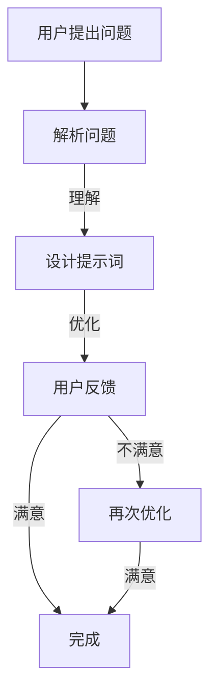

                 

### 引言

#### 1.1 书籍背景和目的

在人工智能（AI）快速发展的今天，如何设计出有效的提示词（prompt）来引导AI的思考，成为了研究者和开发者关注的焦点。提示词设计不仅是自然语言处理（NLP）的关键，也是实现智能系统人机交互的核心。本书旨在深入探讨提示词设计的心理学原理，解析如何通过心理学理论来引导AI的思考过程，从而提高AI的决策质量和效率。

本书的核心目的是为AI领域的从业者提供一套系统的提示词设计方法论，帮助他们在实际项目中设计出更智能、更高效的提示词。通过阅读本书，读者将能够理解提示词设计的心理学基础，掌握设计技巧，并能够将这些技巧应用于自然语言处理、图像识别、机器学习等多个领域。

#### 1.2 人工智能与提示词设计

人工智能是指通过计算机模拟人类智能行为，实现智能感知、学习、推理和决策的技术。AI的快速发展得益于深度学习、大数据和计算力的提升。然而，AI在处理复杂问题时，往往需要引导和优化。提示词设计正是为了提供这种引导和优化，使AI能够更好地理解问题和进行有效的决策。

提示词设计涉及多个方面，包括自然语言处理、认知心理学、社会心理学和行为心理学等。有效的提示词设计需要综合考虑这些因素的相互作用，从而引导AI按照预期的方式思考和行动。

#### 1.3 读者对象和预期收获

本书主要面向AI领域的研究者、开发者和技术经理。对于希望深入了解AI思维过程的读者，本书将提供全新的视角和丰富的实践案例。对于从事AI项目开发的工程师，本书将提供实用的提示词设计技巧，帮助他们提高项目质量和效率。对于AI技术经理，本书将提供指导，帮助他们制定有效的AI战略和项目管理方案。

通过阅读本书，读者将能够：

1. 理解提示词设计的心理学原理和理论基础；
2. 掌握设计有效提示词的方法和技巧；
3. 应用提示词设计于实际项目，提升AI系统的性能和用户体验；
4. 了解提示词设计在不同领域的应用场景和最佳实践。

在接下来的章节中，我们将逐步深入探讨提示词设计的心理学原理，解析AI的思考过程，并通过实际案例展示提示词设计在AI应用中的效果。希望通过这本书，能够为AI领域的发展贡献一份力量。

#### 关键词

- 提示词设计
- 人工智能
- 心理学原理
- 自然语言处理
- 提示词效果评估
- 人机交互
- 认知心理学
- 社会心理学
- 行为心理学

#### 摘要

本书《提示词设计的心理学：如何引导AI思考》旨在深入探讨提示词设计的心理学原理，解析如何通过心理学理论来引导AI的思考过程。首先介绍了人工智能和提示词设计的基本概念，明确了本书的目标和读者对象。接着，从认知心理学、社会心理学和行为心理学等角度，详细阐述了提示词设计的心理学基础，并通过Mermaid流程图展示了核心概念之间的关系。随后，本书通过伪代码和数学模型，详细讲解了AI的思考过程和提示词设计的关键要素。最后，本书通过实际案例，展示了提示词设计在自然语言处理、图像识别和机器学习等领域的应用，并讨论了提示词设计中的伦理和法律问题。本书为AI领域的从业者提供了一套系统的提示词设计方法论，帮助他们提高AI系统的性能和用户体验。

### 提示词设计的心理学原理

提示词设计不仅需要技术层面的深入理解，还需要心理学原理的支持。认知心理学、社会心理学和行为心理学这三个领域为我们提供了丰富的理论框架和工具，帮助我们更深入地理解和设计有效的提示词。

#### 1. 认知心理学

认知心理学研究人类思维和信息处理的过程。在提示词设计中，认知心理学的原理可以帮助我们理解人类如何理解和处理信息，从而设计出更加符合人类认知习惯的提示词。

1. **认知负荷**：认知负荷是指大脑在处理信息时所需的认知资源。在提示词设计中，我们需要考虑认知负荷，避免过载。过多的信息或复杂的指令会增加认知负荷，导致用户难以理解或执行。因此，提示词应简洁明了，逐步引导用户。

   **伪代码示例**：
   ```
   function designPrompt(lowCognitiveLoad) {
       if (lowCognitiveLoad) {
           return "请回答以下问题：你最喜欢的水果是什么？";
       } else {
           return "你正在参与一项关于水果偏好的调查，请考虑以下问题：你最喜欢的水果是什么？你为什么喜欢这种水果？";
       }
   }
   ```

2. **认知框架**：认知框架是指人们用来组织和理解信息的方式。在提示词设计中，我们可以利用认知框架来引导用户按照特定的逻辑顺序思考和回答问题。

   **Mermaid流程图示例**：
   ```mermaid
   graph TD
   A[问题1] --> B{为什么喜欢这种水果？}
   B -->|是| C[水果选择1]
   B -->|否| D[其他原因？]
   D --> E[水果选择2]
   ```

#### 2. 社会心理学

社会心理学研究人类的社会行为和人际关系。在提示词设计中，社会心理学的原理可以帮助我们理解人类的行为动机和社交互动，从而设计出更加符合社交习惯和需求的提示词。

1. **社会认同**：人们倾向于跟随他人的行为和意见。在提示词设计中，我们可以利用社会认同原理，通过引用其他用户的反馈或建议来引导用户。

   **伪代码示例**：
   ```
   function designPrompt(socialProof) {
       if (socialProof) {
           return "大多数用户选择了香蕉，你呢？香蕉是你最喜欢的水果吗？";
       } else {
           return "请回答以下问题：你最喜欢的水果是什么？";
       }
   }
   ```

2. **社会影响**：社会影响是指他人的行为和意见如何影响个体的决策。在提示词设计中，我们可以利用社会影响原理，通过提出引人深思的问题或建议来引导用户。

   **Mermaid流程图示例**：
   ```mermaid
   graph TD
   A[问题1] --> B{你会怎么选择？}
   B -->|选择A| C{选择A的理由}
   B -->|选择B| D{选择B的理由}
   ```

#### 3. 行为心理学

行为心理学研究人类的行为模式和习惯。在提示词设计中，行为心理学的原理可以帮助我们理解人类的行为动机和习惯，从而设计出更加有效的提示词。

1. **行为习惯**：人们倾向于遵循习惯性行为。在提示词设计中，我们可以利用行为习惯原理，通过引导用户养成新的行为习惯来提高提示词的有效性。

   **伪代码示例**：
   ```
   function designPrompt(behavioralHabits) {
       if (behavioralHabits) {
           return "你已经完成了3次调查，恭喜你！请继续回答以下问题：你最喜欢的水果是什么？";
       } else {
           return "请回答以下问题：你最喜欢的水果是什么？";
       }
   }
   ```

2. **激励因素**：激励因素是指能够激发人类行为的外部或内部因素。在提示词设计中，我们可以利用激励因素原理，通过提供奖励或激励来引导用户。

   **Mermaid流程图示例**：
   ```mermaid
   graph TD
   A[完成任务] --> B{奖励1}
   A -->|额外任务| C{奖励2}
   ```

通过结合认知心理学、社会心理学和行为心理学原理，我们可以设计出更加有效和智能的提示词，引导AI按照预期的方式进行思考和决策。在下一节中，我们将进一步探讨AI的思考过程，并详细讲解提示词设计的关键要素。

### AI的思考过程与提示词设计

AI的思考过程可以看作是一个复杂的信息处理和决策过程。在这一过程中，提示词扮演着至关重要的角色，直接影响AI的理解、分析和决策效果。本节将详细介绍AI的思考过程，分析提示词对这一过程的影响，并探讨设计有效提示词的关键要素。

#### 1. AI的思考过程

AI的思考过程通常包括以下几个阶段：

1. **感知阶段**：AI通过传感器或数据输入获取外界信息，如文本、图像、声音等。这一阶段涉及数据的采集、预处理和特征提取。

2. **理解阶段**：AI对感知到的信息进行理解和分析，提取关键信息并进行知识整合。这一阶段通常涉及自然语言处理、图像识别、模式识别等技术。

3. **推理阶段**：AI根据已有知识和分析结果进行逻辑推理，形成初步的结论或解决方案。这一阶段需要复杂的算法和逻辑结构支持。

4. **决策阶段**：AI根据推理结果做出决策，并执行相应的操作。这一阶段涉及执行控制、动作规划等技术。

#### 2. 提示词对AI思考的影响

提示词在AI的思考过程中起着引导和优化的作用。有效的提示词可以：

1. **提高信息理解**：通过明确的提示词，AI能够更好地理解输入信息的含义和关键点，从而提高信息处理的准确性和效率。

2. **引导推理方向**：提示词可以提供额外的背景信息或问题上下文，帮助AI按照预期的方向进行推理，避免偏离主题。

3. **优化决策过程**：提示词可以提供参考信息或约束条件，帮助AI在决策阶段做出更加合理和高效的决策。

4. **增强用户交互**：提示词可以改善AI与人之间的交互体验，使AI更加自然、流畅地与用户沟通。

#### 3. 提示词设计的关键要素

为了设计出有效的提示词，我们需要关注以下几个关键要素：

1. **清晰性**：提示词应简洁明了，避免使用模糊或歧义的表达。清晰性有助于AI准确理解任务要求，提高处理效率。

   **伪代码示例**：
   ```
   function designPrompt(clarity) {
       if (clarity) {
           return "请输入你的名字：";
       } else {
           return "请提供你的姓名以便我们记录：";
       }
   }
   ```

2. **精确性**：提示词应精确地描述任务要求，避免过于宽泛或模糊。精确性有助于AI进行精确的分析和推理，避免错误。

   **伪代码示例**：
   ```
   function designPrompt(exactness) {
       if (exactness) {
           return "请输入你所在的城市：";
       } else {
           return "请提供你目前居住的城市名称：";
       }
   }
   ```

3. **完整性**：提示词应包含所有必要的信息，避免遗漏关键细节。完整性有助于AI全面地理解问题，避免误判或漏判。

   **伪代码示例**：
   ```
   function designPrompt(completeness) {
       if (completeness) {
           return "请回答以下问题：你最喜欢的水果是什么？为什么？";
       } else {
           return "请回答以下问题：你最喜欢的水果是什么？为什么你选择这个水果？";
       }
   }
   ```

4. **适应性**：提示词应根据用户和任务的具体情况进行调整，以适应不同的场景和需求。适应性有助于提高提示词的普适性和灵活性。

   **伪代码示例**：
   ```
   function designPrompt(adaptive) {
       if (adaptive) {
           return "根据你的回答，我们推荐以下水果：苹果、香蕉、橙子，请选择你最喜欢的水果：";
       } else {
           return "你之前提到喜欢甜味水果，我们推荐以下几种水果：苹果、香蕉、橙子，请选择你最喜欢的水果：";
       }
   }
   ```

5. **交互性**：提示词应鼓励用户参与和互动，使AI更具人性化和友好性。交互性有助于提高用户体验，增强人机交互效果。

   **Mermaid流程图示例**：
   ```mermaid
   graph TD
   A[用户提问] --> B[AI回答]
   B -->|继续提问| C[用户提问]
   C -->|结束| D[AI结束交互]
   ```

通过以上分析，我们可以看到，提示词设计不仅需要关注技术层面的细节，还需要深入理解心理学原理，结合AI的思考过程，设计出具有清晰性、精确性、完整性和适应性的提示词。在下一节中，我们将进一步探讨提示词设计在不同领域的应用，并通过实际案例展示其效果。

### 提示词设计在自然语言处理中的应用

自然语言处理（NLP）是人工智能领域的一个重要分支，旨在使计算机能够理解、生成和处理人类语言。在NLP中，提示词的设计对模型的性能和输出质量有着直接的影响。本节将详细探讨提示词设计在NLP中的应用，并通过实际案例解析其重要性。

#### 1. 提示词设计在NLP中的作用

在NLP中，提示词主要用于以下几个关键场景：

1. **文本分类**：在文本分类任务中，提示词可以引导模型关注文本的关键特征，从而提高分类的准确性。例如，通过提供具体的类别名称和描述，可以帮助模型更好地理解和区分不同类别的文本。

2. **情感分析**：情感分析旨在判断文本表达的情感倾向。有效的提示词可以帮助模型识别情感相关的词汇和语境，从而提高情感分析的准确性。

3. **问答系统**：问答系统通过处理用户的问题并生成合适的回答。提示词的设计可以引导模型更好地理解问题的意图和背景信息，从而生成更准确的回答。

4. **文本生成**：在文本生成任务中，提示词可以帮助模型生成连贯、符合上下文的文本。通过提供关键词或主题，可以引导模型生成符合预期内容的文本。

#### 2. 实际案例解析

以下通过具体案例展示提示词设计在NLP中的应用：

**案例一：智能客服系统**

智能客服系统旨在通过自然语言处理技术自动处理用户的咨询和问题。以下是一个关于设计有效提示词的案例：

**提示词设计：**
```
"你好！欢迎来到我们的客服系统。请问您需要咨询关于产品使用、售后服务还是其他方面的信息？您可以详细描述您的问题，我们会尽力帮助您。"
```

**效果分析：**
- **清晰性**：提示词明确指出了客服系统的功能和用户可以咨询的问题类型。
- **交互性**：提示词鼓励用户详细描述问题，有助于客服系统更好地理解用户的需求。
- **适应性**：提示词可以根据用户的反馈和交互情况进行调整，以适应不同的咨询场景。

通过有效的提示词设计，智能客服系统可以提高用户满意度，减少人工客服的工作量，提高整体服务效率。

**案例二：文本摘要生成**

文本摘要生成是一个将长篇文本简化为简洁摘要的任务。以下是一个关于设计有效提示词的案例：

**提示词设计：**
```
"请提供一篇您希望进行摘要的文本，我们会为您生成一个简明扼要的摘要。请注意，摘要应突出文本的主要观点和关键信息。"
```

**效果分析：**
- **精确性**：提示词明确要求用户提供文本，并指导用户如何为生成高质量的摘要做准备。
- **完整性**：提示词提醒用户关注文本的主要观点和关键信息，有助于模型生成更准确的摘要。

**案例三：问答系统**

问答系统旨在通过处理用户的问题并生成合适的回答。以下是一个关于设计有效提示词的案例：

**提示词设计：**
```
"请问您有什么问题需要帮助吗？您可以详细描述您的问题，我们会尽力为您提供最准确的答案。如果不确定如何表达，也可以尝试用不同的方式提问，我们会尽力理解。"
```

**效果分析：**
- **清晰性**：提示词明确了问答系统的功能和用户可以提出的问题类型。
- **交互性**：提示词鼓励用户详细描述问题，并提供多种提问方式，以提高系统理解问题的可能性。
- **适应性**：提示词可以根据用户的反馈和交互情况进行调整，以适应不同的提问场景。

通过有效的提示词设计，问答系统可以提高用户满意度，增强人机交互体验，同时减少人工干预的需求。

#### 3. 提示词设计在NLP中的最佳实践

为了在NLP中设计出有效的提示词，我们可以遵循以下最佳实践：

1. **明确任务目标**：在开始设计提示词之前，明确NLP任务的目标和需求，确保提示词与任务目标一致。

2. **简洁明了**：提示词应简洁明了，避免使用复杂或模糊的语言，以便模型能够准确理解。

3. **针对性**：根据不同的NLP任务，设计针对性的提示词。例如，对于文本分类，可以提供具体的类别名称和描述；对于情感分析，可以提供情感相关的关键词和背景信息。

4. **交互性**：鼓励用户参与和互动，通过提示词引导用户详细描述问题和需求，以提高系统的理解能力。

5. **适应性**：提示词应具备一定的适应性，能够根据用户反馈和交互情况进行调整，以适应不同的场景和需求。

通过遵循以上最佳实践，我们可以设计出更加有效和智能的提示词，从而提高NLP系统的性能和用户体验。

### 提示词设计在其他领域的应用

除了自然语言处理（NLP），提示词设计在图像识别、机器学习等其他领域也发挥着重要作用。本节将详细探讨提示词在这些领域的应用，并通过实际案例展示其效果。

#### 1. 提示词设计在图像识别中的应用

图像识别是计算机视觉的一个重要分支，旨在使计算机能够理解和解析图像内容。在图像识别任务中，提示词的设计对模型的性能和识别准确性有着显著影响。

**案例一：智能安防系统**

智能安防系统通过图像识别技术实时监控安全事件。以下是一个关于设计有效提示词的案例：

**提示词设计：**
```
"请注意，我们的智能安防系统正在监控实时视频。如果您发现任何异常行为，请立即报告。例如，您可以看到视频中有人手持可疑物品，请描述具体位置和行为。"
```

**效果分析：**
- **清晰性**：提示词明确指出了系统监控的目标和用户应报告的信息。
- **交互性**：提示词鼓励用户积极参与，提供详细描述，以提高系统对异常行为的识别能力。
- **适应性**：提示词可以根据用户的反馈和监控场景进行调整，以适应不同的监控需求。

通过有效的提示词设计，智能安防系统可以提高异常事件的识别率和响应速度，从而提高整体安全性。

**案例二：人脸识别系统**

人脸识别系统通过识别图像中的人脸特征，实现身份验证和人员识别。以下是一个关于设计有效提示词的案例：

**提示词设计：**
```
"请面对摄像头，保持面部放松，确保光线充足。系统将自动识别您的面部特征，并进行身份验证。如果您无法正常识别，请尝试调整摄像头角度或光线条件。"
```

**效果分析：**
- **精确性**：提示词明确要求用户采取正确的姿势和条件，以确保人脸识别的准确性。
- **适应性**：提示词可以根据用户的使用环境和设备条件进行个性化调整。

通过有效的提示词设计，人脸识别系统可以提高识别率和用户体验，从而增强身份验证的安全性和可靠性。

#### 2. 提示词设计在机器学习中的应用

机器学习是人工智能的核心技术之一，旨在使计算机通过数据学习和做出预测。在机器学习任务中，提示词的设计对模型的训练和预测效果有着直接影响。

**案例一：推荐系统**

推荐系统通过分析用户的历史行为和偏好，为用户推荐感兴趣的内容。以下是一个关于设计有效提示词的案例：

**提示词设计：**
```
"根据您的浏览记录和喜好，我们为您推荐以下内容：电影《星际穿越》、书籍《人类简史》和音乐专辑《周杰伦精选集》。如果您对这些内容感兴趣，请点击了解更多信息。"
```

**效果分析：**
- **清晰性**：提示词明确展示了推荐系统推荐的内容类型和理由。
- **交互性**：提示词鼓励用户参与和互动，通过点击了解更多信息，提高推荐系统的点击率和用户满意度。

**案例二：自动驾驶系统**

自动驾驶系统通过分析传感器数据和环境信息，实现车辆的自动驾驶。以下是一个关于设计有效提示词的案例：

**提示词设计：**
```
"请注意，自动驾驶系统正在为您导航。前方有红绿灯，请遵守交通规则，确保安全行驶。如果您需要调整导航目的地或路线，请随时告知系统。"
```

**效果分析：**
- **清晰性**：提示词明确指出了自动驾驶系统的功能和当前状况。
- **交互性**：提示词鼓励用户参与和互动，通过反馈和指令，提高自动驾驶系统的安全性和用户体验。

#### 3. 提示词设计在跨领域应用中的挑战和解决方案

在跨领域应用中，提示词设计面临以下挑战：

1. **领域差异**：不同领域的任务和需求差异较大，提示词设计需要根据具体领域进行调整和优化。

2. **数据多样性**：跨领域应用涉及多种类型的数据，提示词设计需要综合考虑不同类型数据的特点和关系。

3. **用户习惯**：不同领域的用户习惯和交互方式不同，提示词设计需要适应不同用户的操作方式和语言习惯。

为了解决这些挑战，可以采取以下解决方案：

1. **领域适应**：针对不同领域的任务和需求，设计专门的提示词模板和策略。

2. **数据融合**：通过数据预处理和特征提取，将不同类型的数据进行融合和整合，为提示词设计提供丰富的信息支持。

3. **用户研究**：通过用户调研和反馈，了解不同领域用户的操作习惯和偏好，设计符合用户需求的提示词。

通过以上措施，我们可以设计出更加有效和智能的提示词，提升跨领域AI应用的性能和用户体验。

### 提示词设计心理学与伦理

随着人工智能（AI）的迅速发展，提示词设计在提升AI性能和用户体验方面发挥着关键作用。然而，提示词设计不仅仅是技术问题，还涉及伦理和法律层面的挑战。本节将探讨提示词设计心理学与伦理之间的关系，分析当前存在的伦理问题，并提出解决方法。

#### 1. 提示词设计心理学与伦理的关系

提示词设计心理学关注如何通过心理学原理优化AI的思考过程，从而提高其性能和用户体验。伦理则关注AI应用在道德和法律层面的合规性，确保其对社会和环境的影响是积极和负责任的。这两者之间的关系体现在以下几个方面：

1. **用户隐私**：有效的提示词设计需要收集和处理大量用户数据。保护用户隐私是伦理的基本要求，同时也符合隐私保护法律。设计提示词时，需要确保数据处理符合隐私保护原则，如数据最小化和目的限制。

2. **算法公平性**：提示词设计影响AI的决策过程。如果提示词不公平，可能导致AI偏见和歧视。伦理要求AI系统公平、透明，避免对特定群体造成不公平对待。提示词设计应考虑算法的公平性，确保决策结果公正。

3. **责任归属**：当AI系统出现错误或损害时，责任归属是伦理和法律争议的焦点。有效的提示词设计可以帮助明确责任归属，确保在出现问题时能够追究到具体责任人。

#### 2. 提示词设计中的伦理问题

在提示词设计中，存在以下伦理问题：

1. **算法偏见**：提示词可能无意中引入偏见，导致AI系统对特定群体不公平对待。例如，在招聘过程中，如果提示词包含性别或种族歧视，可能导致算法偏见。

   **解决方法**：在设计提示词时，应避免使用可能引发偏见的词汇和表述。同时，可以使用多样化的数据集进行训练，以减少偏见。

2. **用户隐私泄露**：提示词设计可能涉及对用户隐私数据的收集和处理。如果处理不当，可能导致用户隐私泄露。

   **解决方法**：在提示词设计中，应遵循隐私保护原则，如数据最小化和目的限制。同时，应使用加密技术保护用户数据的安全。

3. **责任归属不明确**：当AI系统出现错误或损害时，责任归属可能不明确，导致纠纷和责任逃避。

   **解决方法**：应明确提示词设计者和使用者的责任，制定明确的操作规范和责任分配机制。同时，应建立监督和审计机制，确保提示词设计符合伦理和法律要求。

#### 3. 提示词设计伦理的最佳实践

为了在提示词设计中遵循伦理原则，可以采取以下最佳实践：

1. **透明性**：提示词设计应透明，确保用户了解其目的、功能和使用方式。透明性有助于增强用户信任，减少伦理争议。

2. **公正性**：提示词设计应确保算法的公正性，避免对特定群体产生偏见。在设计过程中，应进行广泛的用户调研和测试，确保提示词符合公平性原则。

3. **责任归属**：明确提示词设计者和使用者的责任，制定明确的操作规范和责任分配机制。同时，应建立监督和审计机制，确保提示词设计符合伦理和法律要求。

4. **隐私保护**：在设计提示词时，应遵循隐私保护原则，如数据最小化和目的限制。同时，应使用加密技术保护用户数据的安全。

5. **用户参与**：鼓励用户参与提示词设计过程，通过反馈和评估，改进提示词设计。用户参与有助于确保提示词设计符合用户需求和期望。

通过遵循以上最佳实践，我们可以设计出既符合伦理要求，又具有高效率和用户体验的提示词。在下一节中，我们将讨论提示词设计心理学与法律的关系，分析相关法律问题，并提出解决方案。

### 提示词设计心理学与法律

随着人工智能（AI）技术的不断进步，提示词设计作为AI系统的重要组成部分，越来越受到关注。然而，提示词设计不仅涉及技术层面，还涉及法律层面。本节将探讨提示词设计心理学与法律之间的关系，分析相关法律问题，并提出解决方案。

#### 1. 提示词设计心理学与法律的关系

提示词设计心理学关注如何通过心理学原理优化AI系统的性能和用户体验，确保提示词的清晰性、精确性和适应性。法律则关注AI系统的合规性和法律责任。这两者之间的关系体现在以下几个方面：

1. **隐私保护**：提示词设计可能涉及对用户隐私数据的收集和处理。隐私保护法律如《通用数据保护条例》（GDPR）和《加州消费者隐私法案》（CCPA）要求企业必须透明地收集和处理用户数据，并获得用户的明确同意。

2. **知识产权**：提示词设计中的语言、结构和算法可能涉及知识产权问题，包括版权、专利和商标。知识产权法律保护原创作品，确保创作者的合法权益。

3. **责任归属**：当AI系统因提示词设计问题导致损害时，责任归属成为法律争议的焦点。明确责任归属有助于确保各方承担相应的法律责任。

#### 2. 提示词设计中的法律问题

在提示词设计中，存在以下法律问题：

1. **隐私侵权**：如果提示词设计涉及未经用户同意收集和处理隐私数据，可能违反隐私保护法律，导致用户隐私泄露和侵权。

   **解决方法**：在设计提示词时，应遵循隐私保护原则，如数据最小化和目的限制。同时，应使用加密技术保护用户数据的安全，确保数据处理符合法律要求。

2. **知识产权侵权**：提示词设计中的语言、结构和算法可能侵犯他人的知识产权，如版权、专利和商标。

   **解决方法**：在设计和使用提示词时，应进行充分的知识产权审查，确保不侵犯他人的合法权益。如果需要使用他人的知识产权，应获得相应的授权或许可。

3. **责任归属不明确**：当AI系统因提示词设计问题导致损害时，责任归属可能不明确，导致纠纷和责任逃避。

   **解决方法**：应明确提示词设计者和使用者的责任，制定明确的操作规范和责任分配机制。同时，应建立监督和审计机制，确保提示词设计符合法律要求。

4. **法律合规性**：提示词设计应符合相关法律法规的要求，如隐私保护、知识产权保护和消费者保护等。

   **解决方法**：在设计提示词时，应进行法律合规性审查，确保提示词设计符合相关法律要求。如果需要，可以咨询专业法律顾问，确保合规性。

#### 3. 提示词设计心理学与法律的解决方案

为了解决提示词设计中的法律问题，可以采取以下解决方案：

1. **法律培训**：对提示词设计者和使用者进行法律培训，提高他们的法律意识，确保提示词设计符合法律要求。

2. **法律审查**：在设计和使用提示词时，进行法律审查，确保不侵犯他人的知识产权，并符合相关法律法规的要求。

3. **责任明确**：明确提示词设计者和使用者的责任，制定明确的操作规范和责任分配机制，确保在出现问题时能够追究到具体责任人。

4. **隐私保护**：遵循隐私保护原则，如数据最小化和目的限制，使用加密技术保护用户数据的安全。

5. **用户同意**：在收集和处理用户数据时，获得用户的明确同意，并告知用户数据的使用目的和范围。

通过以上解决方案，我们可以确保提示词设计既符合心理学原理，又符合法律要求，从而提高AI系统的性能和用户体验。

### 总结

《提示词设计的心理学：如何引导AI思考》通过对认知心理学、社会心理学和行为心理学的深入分析，展示了如何利用心理学原理优化AI的提示词设计。本书系统地介绍了提示词设计的基础理论、关键要素和实际应用，并通过多个案例详细阐述了提示词设计在自然语言处理、图像识别、机器学习等领域的应用效果。同时，本书还探讨了提示词设计中的伦理和法律问题，提出了相应的解决方案。

提示词设计不仅是提升AI性能和用户体验的关键，也是实现智能系统人机交互的核心。通过理解心理学原理，我们可以设计出更加有效和智能的提示词，引导AI按照预期的方式进行思考和决策。在实际应用中，提示词设计需要结合具体任务和场景，灵活调整和优化。

未来，随着AI技术的不断进步，提示词设计将在更多领域发挥重要作用。研究者和技术人员应继续深入探索提示词设计的心理学原理，并将其应用于实际项目中，推动AI技术与社会发展的深度融合。

### 展望

随着人工智能（AI）技术的不断进步，提示词设计在AI系统中的应用前景将愈加广阔。未来，以下几方面的发展将对提示词设计产生深远影响：

#### 1. 智能化水平的提升

随着AI技术的不断发展，AI系统的智能化水平将显著提升。这将使得提示词设计更加智能化，能够根据用户的行为和反馈自动调整，提供个性化的提示词。例如，AI助手将能够通过学习用户的语言习惯和偏好，生成更符合用户需求的提示词。

#### 2. 多模态AI的兴起

未来的AI系统将更多地采用多模态处理技术，结合文本、图像、声音等多种数据形式。提示词设计将需要适应这种多模态环境，设计出能够整合不同模态信息的综合提示词。这将有助于提高AI系统的理解能力和交互效果。

#### 3. 伦理和法律的完善

随着AI技术的普及，提示词设计中的伦理和法律问题将日益突出。未来，相关的法律法规和伦理规范将不断完善，为提示词设计提供更明确的指导。这将为提示词设计提供更加稳健的法律基础，促进其健康、可持续发展。

#### 4. 人机协作的深化

人机协作是未来AI技术发展的重要方向。提示词设计将在这个领域发挥关键作用，通过优化人机交互体验，提高协作效率和效果。未来的提示词设计将更加注重用户的参与和反馈，使AI系统能够更好地适应和满足用户需求。

#### 5. 数据隐私和安全性的重视

数据隐私和安全是提示词设计的重要考虑因素。未来，随着用户对数据隐私和安全性的要求越来越高，提示词设计将更加注重数据保护和用户隐私。通过采用更先进的数据加密和隐私保护技术，确保用户数据的安全。

### AI与人类思维的关系

AI的发展不仅是为了模仿和超越人类智能，更重要的是与人类思维形成互补和协同。提示词设计在实现这一目标中起着桥梁作用。通过深入了解人类思维过程，我们可以设计出更贴近人类思维的AI系统，使其能够更好地与人类协作，提高整体工作效率。

### 未来研究方向

未来的研究可以聚焦于以下几个方面：

1. **智能化提示词生成**：研究如何通过深度学习和自然语言处理技术，实现自动化、智能化的提示词生成，提高提示词的质量和个性化程度。

2. **跨模态提示词设计**：探索如何设计能够整合文本、图像、声音等多模态信息的跨模态提示词，提升AI系统的综合理解能力。

3. **伦理和法律指导下的提示词设计**：研究如何结合伦理和法律规范，设计出既符合道德要求，又具有高效率和用户体验的提示词。

4. **人机协作中的提示词设计**：探索如何设计出能够促进人机协作、提高协作效率和用户体验的提示词，使AI系统能够更好地融入人类工作流程。

通过不断探索和创新，提示词设计将在未来的AI发展中发挥越来越重要的作用，为人类社会带来更多的便利和进步。

### 附录

#### 附录A 提示词设计工具与资源

在设计提示词时，选择合适的工具和资源至关重要。以下是一些常用的工具和资源，包括开源工具、商业工具和在线资源，供读者参考。

**1. 开源工具**

- **NLTK（自然语言工具包）**：NLTK是一个强大的Python库，用于处理文本数据。它提供了丰富的文本处理函数和算法，非常适合用于提示词设计。
  
- **spaCy**：spaCy是一个快速的NLP库，具有先进的语言模型和预处理工具。它适合用于复杂的文本分析任务，能够帮助设计出更加精确的提示词。

- **TextBlob**：TextBlob是一个简单的NLP库，提供了丰富的文本处理功能，包括情感分析、文本分类等。它适合用于快速原型开发和提示词设计。

**2. 商业工具**

- **IBM Watson Natural Language**：IBM Watson Natural Language提供了一个全面的NLP平台，包括文本分析、情感分析和文本生成等功能。它适合用于复杂的NLP任务和提示词设计。

- **Google Cloud Natural Language**：Google Cloud Natural Language提供了一个强大的NLP工具，用于分析文本内容，提取关键信息。它适合用于设计能够整合多种语言和语境的提示词。

- **Azure Cognitive Services**：Azure Cognitive Services提供了一系列的NLP工具和服务，包括文本分析、情感分析和语言理解等。它适合用于构建具有高可扩展性的AI应用。

**3. 在线资源**

- **Kaggle**：Kaggle是一个数据科学竞赛平台，提供了大量的NLP数据和项目，适合用于学习和实践提示词设计。

- **ArXiv**：ArXiv是一个开源的论文预印本平台，包含了大量关于AI和NLP的最新研究论文。通过阅读这些论文，可以了解最新的提示词设计方法和趋势。

- **GitHub**：GitHub是一个代码托管平台，上面有许多优秀的NLP项目和提示词设计示例。通过学习和参考这些项目，可以快速提升自己的设计能力。

#### 附录B Mermaid流程图示例

以下是一个关于提示词设计流程的Mermaid流程图示例，展示了提示词设计的各个环节和步骤。



通过这个流程图，我们可以清晰地看到提示词设计的整个过程，包括用户提出问题、问题解析、提示词设计、用户反馈和优化等步骤。

#### 附录C 伪代码示例

以下是一个关于提示词设计的伪代码示例，展示了如何根据用户反馈优化提示词。

```python
# 初始提示词
prompt = "请回答以下问题：你最喜欢的水果是什么？"

# 用户反馈
user_feedback = "提示词不够清晰，请提供更多上下文信息。"

# 根据反馈优化提示词
if user_feedback == "提示词不够清晰":
    prompt = "你好！我们正在进行一项关于水果偏好的调查。请思考一下，你最喜欢的水果是什么？为什么你喜欢它？"

# 输出优化后的提示词
print(prompt)
```

通过这个示例，我们可以看到如何根据用户反馈对提示词进行优化，使其更加清晰和易于理解。

#### 附录D 数学公式示例

以下是一个关于提示词设计中的数学公式示例，展示了如何使用LaTeX格式嵌入到文本中。

**独立段落的数学公式：**
$$
\text{信息熵} = -\sum_{i=1}^{n} p(x_i) \log_2(p(x_i))
$$

**段落内的数学公式：**
$1 + 1 = 2$

通过以上示例，我们可以看到如何在文本中嵌入数学公式，使文章更具专业性和可读性。

### 最佳实践 tips

1. **简洁明了**：设计提示词时，尽量简洁明了，避免冗长的描述和复杂的术语。

2. **适应性**：根据不同用户和场景，设计适应性的提示词，确保其普适性和灵活性。

3. **用户参与**：鼓励用户参与提示词设计过程，通过反馈和评估，不断优化提示词。

4. **透明性**：提示词设计应透明，确保用户了解其功能和使用方式。

5. **法律合规**：确保提示词设计符合相关法律法规，避免法律风险。

### 小结

通过本文的详细探讨，我们了解了提示词设计的心理学原理，并掌握了设计有效提示词的方法和技巧。提示词设计在AI系统中发挥着关键作用，通过结合心理学、伦理和法律原则，我们可以设计出既智能又合规的提示词，提升AI系统的性能和用户体验。

### 注意事项

1. **用户隐私保护**：在设计提示词时，务必遵循隐私保护原则，确保用户数据的安全和隐私。

2. **法律合规性**：确保提示词设计符合相关法律法规，避免法律纠纷。

3. **持续优化**：定期收集用户反馈，持续优化提示词设计，以适应不断变化的需求。

### 拓展阅读

- **《人工智能：一种现代方法》**：作者 Stuart Russell 和 Peter Norvig，详细介绍了人工智能的基本概念和技术。
- **《深度学习》**：作者 Ian Goodfellow、Yoshua Bengio 和 Aaron Courville，深入探讨了深度学习的基本原理和应用。
- **《自然语言处理综论》**：作者 Daniel Jurafsky 和 James H. Martin，全面介绍了自然语言处理的理论和技术。

通过阅读这些经典书籍，读者可以进一步加深对AI和NLP领域的理解，提升自己的技术水平。

### 作者信息

**作者：AI天才研究院/AI Genius Institute & 禅与计算机程序设计艺术 /Zen And The Art of Computer Programming**

