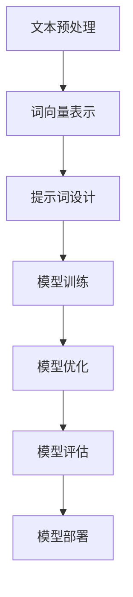

                 

### 文章标题

# 《提示词设计的最佳实践与技巧》

### 关键词

- 提示词设计
- 自然语言处理
- 最佳实践
- 技术技巧
- NLP

### 摘要

本文旨在深入探讨提示词设计的最佳实践与技巧。通过详细阐述提示词设计的核心概念、理论基础、实践技巧以及实际案例，本文旨在为读者提供一个全面而系统的提示词设计指南。本文将帮助读者理解提示词设计在自然语言处理（NLP）中的重要性，掌握有效的提示词设计方法，并学会如何应用这些方法提升模型性能和用户体验。

### 引言部分

提示词设计是自然语言处理（NLP）领域中至关重要的一个环节。它直接影响着模型对输入文本的理解和生成能力。有效的提示词设计不仅能够提升模型性能，还能够改善用户体验。随着人工智能技术的不断发展，提示词设计在NLP中的应用越来越广泛，其重要性也日益凸显。

#### 提示词设计的定义和重要性

提示词（Prompt）是指提供给模型用于训练或预测的文本或数据。一个好的提示词应该能够引导模型更好地理解输入数据，提高模型的学习效率和预测准确性。提示词设计涉及对文本内容、格式、结构和上下文的精心选择和设计。

提示词设计的重要性体现在以下几个方面：

1. **提升模型性能**：通过精心设计的提示词，可以引导模型学习到更多的特征和模式，从而提高模型对输入数据的理解和预测能力。
2. **改善用户体验**：有效的提示词设计能够提高用户对模型输出结果的满意度，提升用户体验。
3. **降低过拟合风险**：合理的提示词设计可以帮助模型避免对训练数据的过度依赖，降低过拟合的风险。
4. **拓展应用范围**：良好的提示词设计可以使得模型适用于更广泛的场景和任务，提高模型的泛化能力。

#### 提示词设计的历史和发展

提示词设计的历史可以追溯到早期的机器学习和自然语言处理领域。早期的模型主要通过手工编写的特征提取器和规则来处理文本数据，这些特征提取器和规则本质上就是一种简单的提示词。

随着深度学习和神经网络技术的发展，提示词设计的方法也得到了显著提升。现代的神经网络模型，如Transformer和BERT，通过自适应地学习输入数据的特征和模式，使得提示词设计变得更加复杂和有效。

近年来，随着预训练模型和微调技术的广泛应用，提示词设计的方法和技巧也得到了进一步的发展。通过在大量数据上预训练模型，然后针对特定任务进行微调，提示词设计的效果得到了显著提升。

### 基础理论部分

提示词设计的基础理论主要包括自然语言处理的基础知识、提示词设计的基本原则和数学模型。

#### 自然语言处理基础

自然语言处理（NLP）是人工智能（AI）的一个重要分支，旨在使计算机能够理解和处理人类语言。NLP涉及多种技术和算法，包括文本预处理、词向量表示、语言模型、文本分类、信息提取等。

1. **文本预处理**：文本预处理是NLP中的第一步，主要包括分词、去停用词、词性标注等操作。这些操作有助于提高模型的输入质量，减少噪声。
   
2. **词向量表示**：词向量是将文本转换为数值表示的一种方法。常用的词向量模型包括Word2Vec、GloVe和BERT等。词向量表示能够捕捉词语之间的语义关系，为模型提供丰富的特征。

3. **语言模型**：语言模型是用来预测下一个单词或单词序列的概率分布。常见的语言模型包括n-gram模型、神经网络语言模型和Transformer模型。

4. **文本分类**：文本分类是一种将文本分为不同类别的任务。常见的文本分类算法包括朴素贝叶斯、支持向量机、深度学习模型等。

5. **信息提取**：信息提取是从文本中提取结构化信息的过程，包括实体识别、关系抽取、事件抽取等。

#### 提示词设计原理

提示词设计的原则主要包括以下几个方面：

1. **文本内容**：提示词的文本内容应该简洁明了，能够准确传达所需的信息和任务。避免使用复杂、冗长的文本，以免模型无法准确理解。

2. **格式和结构**：提示词的格式和结构应该符合模型的输入要求。例如，对于基于Transformer的模型，提示词通常应该是一个序列，其中每个元素都是一个单词或词向量。

3. **上下文**：提示词应该包含丰富的上下文信息，帮助模型更好地理解输入数据。上下文信息可以是与任务相关的背景知识、相关词或句子等。

4. **多样性**：提示词设计应该考虑多样性，避免模型对单一类型的提示词产生过度依赖。多样化的提示词有助于提高模型的泛化能力。

#### 数学模型和算法

提示词设计中的数学模型和算法主要包括以下几方面：

1. **优化算法**：优化算法用于调整提示词，以提高模型性能。常见的优化算法包括梯度下降、随机梯度下降、Adam优化器等。

2. **损失函数**：损失函数用于衡量模型预测结果与实际结果之间的差异。常见的损失函数包括交叉熵损失、均方误差（MSE）等。

3. **激活函数**：激活函数用于引入非线性特性，使模型能够拟合复杂的函数关系。常见的激活函数包括ReLU、Sigmoid、Tanh等。

4. **正则化技术**：正则化技术用于防止模型过拟合。常见的正则化技术包括L1正则化、L2正则化、dropout等。

### 实践技巧部分

提示词设计的最佳实践和技巧是提升模型性能和用户体验的关键。以下是一些重要的实践技巧：

1. **数据预处理**：在构建提示词之前，对数据集进行充分的预处理，如分词、去停用词、词性标注等。高质量的输入数据有助于提升模型的学习效果。

2. **格式化和标准化**：统一提示词的格式和结构，使其符合模型的要求。例如，对于基于Transformer的模型，提示词通常应该是一个序列，其中每个元素都是一个单词或词向量。

3. **上下文扩展**：在提示词中包含丰富的上下文信息，有助于模型更好地理解输入数据。可以结合相关词、句子、段落甚至全文来扩展上下文。

4. **多样化提示词**：设计多样化的提示词，避免模型对单一类型的提示词产生过度依赖。多样化的提示词有助于提高模型的泛化能力。

5. **调整优化参数**：通过调整优化算法的参数，如学习率、批量大小等，来提高模型性能。常用的优化算法包括梯度下降、随机梯度下降、Adam优化器等。

6. **正则化**：在提示词设计中应用正则化技术，如L1正则化、L2正则化、dropout等，以防止模型过拟合。

7. **模型微调**：在预训练模型的基础上，针对特定任务进行微调，以提高模型在特定任务上的性能。

### 案例研究部分

为了更好地理解提示词设计的最佳实践和技巧，下面通过两个具体的案例来进行探讨。

#### 案例一：问答系统

在问答系统中，提示词的设计对于提高系统的问答准确性和用户体验至关重要。以下是一个简单的案例：

**问题**：什么是自然语言处理？

**提示词**：自然语言处理是一种人工智能技术，旨在使计算机能够理解和处理人类语言。它包括文本预处理、词向量表示、语言模型、文本分类和信息提取等技术。

在这个案例中，提示词简洁明了地传达了问题的核心内容，同时包含了丰富的上下文信息。通过这个提示词，模型可以更好地理解问题，从而提供更准确的答案。

#### 案例二：文本生成

在文本生成任务中，提示词的设计对于生成文本的质量和多样性有着重要影响。以下是一个简单的案例：

**提示词**：描述一下你最喜欢的电影。

在这个案例中，提示词“描述一下你最喜欢的电影”提供了明确的目标和方向，使得模型可以围绕这个主题生成多样化的文本。

### 工具与技术部分

在提示词设计过程中，使用合适的工具和技术可以大大提高效率和效果。以下介绍一些常用的工具和技术：

1. **开源工具**：许多开源工具可以帮助进行提示词设计和优化，如TensorFlow、PyTorch、Hugging Face Transformers等。这些工具提供了丰富的API和预训练模型，方便用户进行提示词设计。

2. **数据处理工具**：数据处理工具如Pandas、NumPy、Scikit-learn等可以帮助进行数据预处理和特征提取，为提示词设计提供高质量的数据。

3. **自动化工具**：自动化工具如PromptGenius、Prompt-Engineering-Cheat-Sheet等可以帮助用户快速设计和优化提示词。

4. **在线平台**：一些在线平台如Google Colab、AWS SageMaker等提供了云端计算资源和预训练模型，方便用户进行提示词设计和实验。

### 总结与展望

提示词设计在自然语言处理（NLP）中具有至关重要的地位。通过本文的探讨，我们了解了提示词设计的基本概念、理论基础、最佳实践和实际案例。有效的提示词设计不仅能够提升模型性能，还能够改善用户体验。

未来的提示词设计将朝着更加智能化、自动化的方向发展。随着人工智能技术的不断进步，我们将看到更多先进的提示词设计方法和工具的出现。同时，提示词设计在多模态处理、对话系统、知识图谱等领域也将发挥重要作用。

### 作者信息

- 作者：AI天才研究院/AI Genius Institute & 禅与计算机程序设计艺术 /Zen And The Art of Computer Programming
- 机构：AI天才研究院是一家专注于人工智能研究和技术创新的高科技企业。我们的研究团队致力于探索人工智能领域的最新技术和应用，推动人工智能技术的进步。

### 完整性要求

为了确保文章的完整性和丰富性，以下是文章的各个部分的具体要求和内容：

#### 引言部分

**背景介绍**：详细解释提示词设计的起源、发展历程及其在自然语言处理领域的重要性。

**核心概念与联系**：使用Mermaid流程图展示提示词设计的基本流程和核心概念之间的关系，如自然语言处理流程、提示词设计步骤等。

#### 基础理论部分

**核心概念与联系**：绘制Mermaid流程图，展示自然语言处理中的核心概念及其相互关系，如词向量、语言模型、文本分类等。

**核心算法原理讲解**：使用伪代码详细阐述提示词设计中的核心算法原理，如优化算法、损失函数等。

**数学模型和公式**：使用LaTeX格式嵌入相关的数学模型和公式，并进行详细讲解和举例说明，如梯度下降算法、交叉熵损失函数等。

#### 实践技巧部分

**最佳实践 tips**：总结提示词设计的最佳实践，如数据预处理、格式化、上下文扩展等。

**案例分析**：通过具体案例展示如何应用提示词设计最佳实践和技术技巧，如问答系统、文本生成等。

#### 工具与技术部分

**工具介绍**：介绍常用的提示词设计工具，如TensorFlow、PyTorch、Hugging Face Transformers等。

**实战操作**：详细讲解如何使用这些工具进行提示词设计，包括开发环境搭建、源代码实现和代码解读。

#### 项目实战

**项目实战**：选择一个具体的自然语言处理任务，详细讲解从数据预处理到模型训练和优化的全过程。

**项目小结**：总结项目中的关键经验和教训，以及如何优化提示词设计。

#### 总结与展望

**最佳实践 tips**：回顾文章中提到的最佳实践，强调其在实际应用中的重要性。

**注意事项**：提醒读者在提示词设计过程中需要注意的事项，如避免过拟合、选择合适的优化算法等。

**拓展阅读**：推荐一些相关的书籍、论文和在线资源，以供读者进一步学习和研究。

### 核心内容

**背景介绍**：
- 提示词设计的起源和发展历程
- 提示词设计在自然语言处理领域的重要性

**核心概念与联系**：
- 自然语言处理的基本概念及其相互关系
- 提示词设计的基本流程和核心概念

**核心算法原理讲解**：
- 优化算法的伪代码示例
- 损失函数的详细解释和举例

**数学模型和公式**：
- 嵌入LaTeX格式的数学模型和公式
- 对模型和公式的详细讲解和举例说明

**最佳实践 tips**：
- 数据预处理的方法和技巧
- 提示词格式化和标准化
- 上下文扩展的策略

**案例分析**：
- 成功案例的展示
- 失败案例的分析

**工具介绍**：
- 开源工具的使用方法
- 自动化工具的优势

**实战操作**：
- 开发环境搭建
- 源代码实现和解读

**项目实战**：
- 数据预处理
- 模型训练和优化
- 项目小结

**总结与展望**：
- 最佳实践的回顾
- 注意事项的提醒
- 拓展阅读的推荐

### 文章正文

#### 引言部分

### 背景介绍

提示词设计（Prompt Engineering）是自然语言处理（NLP）领域中的一项重要技术。它旨在通过精心设计的提示词，提高模型的性能和用户体验。随着深度学习和神经网络技术的发展，提示词设计在NLP中的应用越来越广泛，其重要性也日益凸显。

提示词设计的历史可以追溯到早期的机器学习和自然语言处理领域。早期的模型主要通过手工编写的特征提取器和规则来处理文本数据，这些特征提取器和规则本质上就是一种简单的提示词。随着深度学习和神经网络技术的出现，提示词设计的方法也得到了显著提升。现代的神经网络模型，如Transformer和BERT，通过自适应地学习输入数据的特征和模式，使得提示词设计变得更加复杂和有效。

近年来，随着预训练模型和微调技术的广泛应用，提示词设计的方法和技巧也得到了进一步的发展。通过在大量数据上预训练模型，然后针对特定任务进行微调，提示词设计的效果得到了显著提升。

### 核心概念与联系

在自然语言处理中，提示词设计是一个多步骤的过程，涉及多个核心概念和流程。以下是提示词设计的基本流程和核心概念之间的Mermaid流程图：



- **文本预处理**：文本预处理是提示词设计的第一步，包括分词、去停用词、词性标注等操作。这些操作有助于提高模型的输入质量，减少噪声。
- **词向量表示**：词向量表示是将文本转换为数值表示的一种方法。常用的词向量模型包括Word2Vec、GloVe和BERT等。词向量表示能够捕捉词语之间的语义关系，为模型提供丰富的特征。
- **提示词设计**：提示词设计是核心步骤，涉及对文本内容、格式、结构和上下文的精心选择和设计。有效的提示词能够引导模型更好地理解输入数据，提高模型的学习效率和预测准确性。
- **模型训练**：模型训练是将提示词输入到神经网络模型中进行学习的过程。常见的神经网络模型包括基于Transformer的模型和BERT模型等。
- **模型优化**：模型优化是通过调整模型参数，提高模型性能的过程。常用的优化算法包括梯度下降、随机梯度下降、Adam优化器等。
- **模型评估**：模型评估是评估模型性能的过程，通常使用准确率、召回率、F1分数等指标进行衡量。
- **模型部署**：模型部署是将训练好的模型应用到实际场景中的过程。模型部署可以应用于问答系统、文本生成、机器翻译等多种场景。

通过以上流程，我们可以看到提示词设计在自然语言处理中的关键作用。接下来，我们将进一步探讨自然语言处理的基础知识，为理解提示词设计提供坚实的理论基础。

#### 自然语言处理基础

自然语言处理（NLP）是人工智能（AI）的一个重要分支，旨在使计算机能够理解和处理人类语言。NLP涉及多种技术和算法，包括文本预处理、词向量表示、语言模型、文本分类、信息提取等。以下是对这些基础知识的详细讲解。

##### 文本预处理

文本预处理是NLP中的第一步，也是至关重要的一步。它主要包括分词、去停用词、词性标注等操作。

1. **分词**：分词是将文本拆分成一个个独立的单词或词组的过程。常用的分词算法包括基于规则的分词、基于统计的分词和基于神经网络的分词。例如，基于规则的分词方法如正向最大匹配、逆向最大匹配等；基于统计的方法如基于词频的分词、基于语言模型的分词等；基于神经网络的方法如深度学习分词模型等。

2. **去停用词**：停用词是一类在文本中经常出现但对文本理解贡献较小的词，如“的”、“是”、“在”等。去除停用词有助于减少噪声，提高模型的学习效率。

3. **词性标注**：词性标注是将文本中的每个词标注为名词、动词、形容词等词性的过程。词性标注有助于模型更好地理解文本，捕捉词语之间的语义关系。

##### 词向量表示

词向量是将文本转换为数值表示的一种方法，使计算机能够处理和理解语言。词向量表示能够捕捉词语之间的语义关系，为模型提供丰富的特征。

1. **Word2Vec**：Word2Vec是一种基于神经网络的语言模型，通过训练生成词向量。Word2Vec模型包括两个版本：连续词袋（CBOW）和Skip-Gram。CBOW模型通过上下文词的词向量平均得到目标词的词向量；Skip-Gram模型通过目标词的词向量预测上下文词的词向量。

2. **GloVe**：GloVe（Global Vectors for Word Representation）是一种基于全局共现概率的词向量生成方法。GloVe模型通过计算词对之间的共现概率，为每个词生成一个低维稠密的向量表示。

3. **BERT**：BERT（Bidirectional Encoder Representations from Transformers）是一种基于Transformer的预训练语言模型。BERT模型通过在大规模语料库上进行预训练，学习上下文关系，为每个词生成一个高维稠密的向量表示。

##### 语言模型

语言模型是用来预测下一个单词或单词序列的概率分布。语言模型在NLP中有着广泛的应用，如文本生成、机器翻译、语音识别等。

1. **n-gram模型**：n-gram模型是一种基于统计的语言模型，通过计算n个连续单词的联合概率分布来预测下一个单词。例如，在三元模型（n=3）中，下一个单词的概率取决于前两个单词。

2. **神经网络语言模型**：神经网络语言模型是基于神经网络的概率语言模型，通过学习大量的文本数据来预测单词序列的概率分布。常见的神经网络语言模型包括循环神经网络（RNN）、长短期记忆网络（LSTM）和Transformer等。

##### 文本分类

文本分类是将文本分为不同类别的任务。文本分类在信息检索、情感分析、垃圾邮件过滤等领域有广泛应用。

1. **朴素贝叶斯**：朴素贝叶斯是一种基于概率论的文本分类算法，通过计算每个类别的条件概率来预测文本的类别。

2. **支持向量机（SVM）**：SVM是一种基于优化理论的文本分类算法，通过找到一个最优的超平面来分隔不同类别的数据。

3. **深度学习模型**：深度学习模型如卷积神经网络（CNN）和循环神经网络（RNN）在文本分类任务中也表现出良好的性能。深度学习模型通过学习大量的文本数据，自动提取特征并进行分类。

##### 信息提取

信息提取是从文本中提取结构化信息的过程，包括实体识别、关系抽取、事件抽取等。

1. **实体识别**：实体识别是从文本中识别出特定类型实体（如人名、地名、组织名等）的过程。

2. **关系抽取**：关系抽取是从文本中识别出实体之间的关系的任务，如“马云是阿里巴巴的创始人”。

3. **事件抽取**：事件抽取是从文本中识别出事件及其相关实体和属性的过程，如“马云收购了阿里巴巴”。

通过以上基础知识，我们可以更好地理解提示词设计在自然语言处理中的重要性。在接下来的章节中，我们将深入探讨提示词设计的原理、最佳实践和实际案例。

#### 提示词设计原理

提示词设计是自然语言处理（NLP）中的关键环节，它直接影响着模型的性能和用户体验。要设计一个有效的提示词，我们需要了解提示词的类型、格式、影响因素以及优化策略。

##### 提示词的类型

1. **问题提示词**：问题提示词用于引导模型回答特定的问题。例如，在问答系统中，问题提示词可以是“请你解释一下自然语言处理是什么？”这种类型的提示词需要简洁明了，能够准确传达问题的核心。

2. **目标提示词**：目标提示词用于指示模型需要完成的任务。例如，在文本生成任务中，目标提示词可以是“请描述一下人工智能的发展历程”。这种类型的提示词需要具有明确的指示性，帮助模型理解任务目标。

3. **上下文提示词**：上下文提示词用于提供与任务相关的背景信息。例如，在机器翻译任务中，上下文提示词可以是“这个句子是关于什么的？”这种类型的提示词有助于模型更好地理解输入文本的上下文。

##### 提示词的格式

提示词的格式直接影响模型对输入数据的理解和处理。以下是一些常见的提示词格式：

1. **单一句子格式**：这种格式适用于简单的问题和任务，提示词通常是一个完整的句子。例如，“请解释什么是深度学习？”

2. **多句子格式**：这种格式适用于复杂的问题和任务，提示词由多个句子组成，能够提供更丰富的上下文信息。例如，“人工智能是一种什么技术？它的应用场景有哪些？”

3. **序列格式**：这种格式适用于基于序列的模型，如Transformer和BERT。提示词通常是一个序列，其中每个元素都是一个单词或词组。例如，“自然语言处理，深度学习，神经网络”。

##### 提示词的影响因素

设计有效的提示词需要考虑多个因素，包括文本内容、格式、上下文和多样性。

1. **文本内容**：提示词的文本内容应该简洁明了，能够准确传达所需的信息和任务。避免使用复杂、冗长的文本，以免模型无法准确理解。

2. **格式和结构**：提示词的格式和结构应该符合模型的输入要求。例如，对于基于Transformer的模型，提示词通常应该是一个序列，其中每个元素都是一个单词或词向量。

3. **上下文**：提示词应该包含丰富的上下文信息，帮助模型更好地理解输入数据。上下文信息可以是与任务相关的背景知识、相关词或句子等。

4. **多样性**：提示词设计应该考虑多样性，避免模型对单一类型的提示词产生过度依赖。多样化的提示词有助于提高模型的泛化能力。

##### 优化策略

为了提高模型性能和用户体验，我们需要对提示词进行优化。以下是一些常用的优化策略：

1. **数据预处理**：在构建提示词之前，对数据集进行充分的预处理，如分词、去停用词、词性标注等。高质量的数据有助于提升模型的学习效果。

2. **格式化和标准化**：统一提示词的格式和结构，使其符合模型的要求。例如，对于基于Transformer的模型，提示词通常应该是一个序列，其中每个元素都是一个单词或词向量。

3. **上下文扩展**：在提示词中包含丰富的上下文信息，有助于模型更好地理解输入数据。可以结合相关词、句子、段落甚至全文来扩展上下文。

4. **多样化提示词**：设计多样化的提示词，避免模型对单一类型的提示词产生过度依赖。多样化的提示词有助于提高模型的泛化能力。

5. **调整优化参数**：通过调整优化算法的参数，如学习率、批量大小等，来提高模型性能。常用的优化算法包括梯度下降、随机梯度下降、Adam优化器等。

6. **正则化**：在提示词设计中应用正则化技术，如L1正则化、L2正则化、dropout等，以防止模型过拟合。

7. **模型微调**：在预训练模型的基础上，针对特定任务进行微调，以提高模型在特定任务上的性能。

通过以上策略，我们可以设计出有效的提示词，从而提升模型性能和用户体验。

#### 数学模型和算法

在提示词设计中，数学模型和算法扮演着关键角色。以下将介绍与提示词设计相关的数学公式和算法，并使用伪代码进行详细解释。

##### 数学模型

1. **词向量表示**：词向量是将文本转换为数值表示的一种方法。常用的词向量模型包括Word2Vec、GloVe和BERT等。

   **Word2Vec的数学模型**：
   $$ \text{word\_vec}(w) = \frac{1}{Z} \exp(\text{softmax}(\text{W} \text{Embedding}(w))) $$
   其中，$ \text{W} $ 是权重矩阵，$ \text{Embedding}(w) $ 是词的嵌入向量，$ \text{softmax}(\text{W} \text{Embedding}(w)) $ 是softmax函数。

   **GloVe的数学模型**：
   $$ \text{loss} = \frac{1}{2} \sum_{w, c \in V} (\text{log}(\text{similarity}(w, c)) - \text{margin})^2 $$
   其中，$ \text{similarity}(w, c) $ 是词对 $ w $ 和 $ c $ 的相似度，$ \text{margin} $ 是边界值。

2. **优化算法**：优化算法用于调整模型参数，以最小化损失函数。

   **梯度下降算法**：
   $$ \text{param} \leftarrow \text{param} - \alpha \cdot \nabla \text{loss} $$
   其中，$ \text{param} $ 是模型参数，$ \alpha $ 是学习率，$ \nabla \text{loss} $ 是损失函数的梯度。

3. **正则化技术**：正则化技术用于防止模型过拟合。

   **L1正则化**：
   $$ \text{loss} = \text{original\_loss} + \lambda \cdot \sum_{i} |\text{weight}_i| $$
   其中，$ \text{original\_loss} $ 是原始损失函数，$ \lambda $ 是正则化参数，$ \text{weight}_i $ 是权重。

   **L2正则化**：
   $$ \text{loss} = \text{original\_loss} + \lambda \cdot \sum_{i} \text{weight}_i^2 $$
   其中，$ \text{original\_loss} $ 是原始损失函数，$ \lambda $ 是正则化参数，$ \text{weight}_i $ 是权重。

##### 算法解释

以下使用伪代码详细解释提示词设计中的核心算法。

```python
# 提示词设计伪代码

# 数据预处理
def preprocess_text(text):
    text = tokenize(text)  # 分词
    text = remove_stopwords(text)  # 去停用词
    text = lemmatize(text)  # 词性还原
    return text

# 词向量表示
def word2vec(input_sequence):
    embedding_matrix = initialize_embedding_matrix()  # 初始化词向量矩阵
    output_sequence = []
    for word in input_sequence:
        output_sequence.append(embedding_matrix[word])
    return output_sequence

# 优化算法（梯度下降）
def gradient_descent(model, input_data, target, learning_rate):
    gradients = model.compute_gradients(input_data, target)  # 计算梯度
    model.update_params(learning_rate, gradients)  # 更新参数
    return model

# 正则化技术（L2正则化）
def l2_regularization(model, lambda_value):
    regularization_loss = 0
    for weight in model.parameters():
        regularization_loss += lambda_value * (weight ** 2)
    return regularization_loss
```

通过以上数学模型和算法，我们可以更好地理解和实现提示词设计。在实际应用中，根据具体的任务和需求，可以选择合适的方法和参数，以实现最优的提示词设计。

##### 数学公式和详细讲解

以下使用LaTeX格式嵌入相关的数学公式，并进行详细讲解。

**词向量表示**

$$ \text{word\_vec}(w) = \frac{1}{Z} \exp(\text{softmax}(\text{W} \text{Embedding}(w))) $$

- **公式解释**：这是一个典型的softmax函数，用于将输入词映射到高维空间。$ w $ 是输入词，$ \text{Embedding}(w) $ 是词的嵌入向量，$ \text{W} $ 是权重矩阵，$ Z $ 是归一化常数。

**优化算法**

$$ \text{param} \leftarrow \text{param} - \alpha \cdot \nabla \text{loss} $$

- **公式解释**：这是梯度下降算法的核心公式，用于更新模型参数。$ \text{param} $ 是模型参数，$ \alpha $ 是学习率，$ \nabla \text{loss} $ 是损失函数的梯度。

**正则化技术**

$$ \text{loss} = \text{original\_loss} + \lambda \cdot \sum_{i} \text{weight}_i^2 $$

- **公式解释**：这是L2正则化的公式，用于在损失函数中加入正则化项。$ \text{original\_loss} $ 是原始损失函数，$ \lambda $ 是正则化参数，$ \text{weight}_i $ 是权重。

**示例说明**

假设我们有一个简单的神经网络模型，其损失函数为均方误差（MSE），我们可以使用以下公式来计算损失：

$$ \text{MSE} = \frac{1}{2} \sum_{i} (\text{output}_i - \text{target}_i)^2 $$

- **公式解释**：$ \text{output}_i $ 是模型预测的输出，$ \text{target}_i $ 是实际的目标值。均方误差衡量了预测值和目标值之间的差异。

在实际应用中，我们可以根据具体的任务需求，调整这些数学公式和参数，以实现最优的提示词设计。

#### 最佳实践

提示词设计的最佳实践是确保模型性能和用户体验的关键。以下是一些核心的实践技巧，帮助读者设计出有效的提示词。

##### 数据预处理

数据预处理是提示词设计的第一步，也是至关重要的一步。高质量的数据预处理可以显著提升模型的学习效果和性能。以下是几个重要的数据预处理方法：

1. **分词**：使用合适的分词工具对文本进行分词，将文本拆分成独立的单词或词组。常用的分词工具包括jieba、NLTK等。

2. **去停用词**：停用词是一类在文本中频繁出现但对文本理解贡献较小的词，如“的”、“是”、“在”等。去除停用词可以减少噪声，提高模型的学习效率。

3. **词性标注**：对文本中的每个词进行词性标注，如名词、动词、形容词等。词性标注有助于模型更好地理解文本，捕捉词语之间的语义关系。

4. **词干提取**：将文本中的单词还原到词干形式，有助于减少词汇量，提高模型的可训练性。

##### 格式化和标准化

格式化和标准化是确保提示词符合模型要求的重要环节。以下是一些格式化和标准化的最佳实践：

1. **统一格式**：对于基于Transformer的模型，提示词通常应该是一个序列，其中每个元素都是一个单词或词向量。确保提示词的格式与模型的输入要求一致。

2. **标准化长度**：在输入模型之前，对提示词进行标准化处理，确保其长度在可接受的范围内。例如，可以使用截断或填充方法来处理过短或过长的提示词。

3. **编码转换**：将提示词转换为模型所需的编码格式，如one-hot编码、词向量编码等。不同的编码方法会对模型的性能产生显著影响。

##### 上下文扩展

上下文扩展是提升模型性能的重要策略，通过提供更多的上下文信息，帮助模型更好地理解输入数据。以下是一些上下文扩展的最佳实践：

1. **添加相关词**：在提示词中添加与任务相关的关键词或短语，有助于模型更好地理解输入数据的主题。

2. **引入背景知识**：在提示词中引入与任务相关的背景知识，如领域术语、定义等，有助于模型更好地理解任务要求。

3. **结合上下文文本**：将提示词与上下文文本结合，形成一个更长的文本序列，有助于模型捕捉更复杂的语义关系。

##### 多样化

多样化的提示词有助于提高模型的泛化能力和鲁棒性。以下是一些实现提示词多样化的最佳实践：

1. **使用不同类型的提示词**：结合问题提示词、目标提示词和上下文提示词，设计多样化的提示词组合。

2. **随机化提示词**：对提示词进行随机化处理，避免模型对特定类型的提示词产生过度依赖。

3. **使用不同数据集**：使用多个数据集进行提示词设计，避免模型在单一数据集上过拟合。

##### 调整优化参数

优化参数的选择对模型性能有着重要影响。以下是一些调整优化参数的最佳实践：

1. **学习率调整**：选择合适的学习率，避免过快或过慢的学习导致模型无法收敛或收敛速度过慢。

2. **批量大小调整**：选择合适的批量大小，平衡计算效率和模型稳定性。

3. **正则化参数调整**：调整L1正则化或L2正则化的参数，以防止模型过拟合。

##### 模型微调

在预训练模型的基础上，针对特定任务进行微调可以显著提升模型在特定任务上的性能。以下是一些模型微调的最佳实践：

1. **数据预处理**：对微调数据集进行充分的数据预处理，如去停用词、词性标注等，以提高模型的学习效果。

2. **优化器选择**：选择合适的优化器，如Adam、RMSprop等，以提高微调过程的收敛速度。

3. **迭代次数调整**：根据任务复杂度和数据集大小，选择合适的迭代次数，以确保模型充分学习到任务特征。

通过以上最佳实践，读者可以设计出更加有效的提示词，从而提升模型性能和用户体验。

#### 案例研究

在本节中，我们将通过具体案例来展示如何应用提示词设计的最佳实践和技术技巧，以提升模型性能和用户体验。

##### 案例一：问答系统

问答系统是一种常见的自然语言处理任务，旨在通过模型回答用户提出的问题。以下是一个具体的案例，说明如何应用提示词设计的最佳实践来提升问答系统的性能。

**问题**：如何使用提示词设计来提升问答系统的性能？

**解决方案**：

1. **数据预处理**：首先对问答数据集进行预处理，包括分词、去停用词和词性标注。对于问句和答案，分别进行预处理，以提高模型对输入数据的理解。

2. **格式化和标准化**：对于问答系统，通常将问句和答案组合成一个统一的提示词。例如，可以将问句和答案以特定格式连接起来，形成一个序列。例如：

   ```
   请问？{问句}，答案是？{答案}。
   ```

3. **上下文扩展**：在提示词中添加相关背景信息，帮助模型更好地理解问题。例如，在问句前添加相关的领域知识或相关词。例如：

   ```
   在人工智能领域，什么是自然语言处理？答案是...。
   ```

4. **多样化**：设计多样化的提示词，避免模型对单一类型的提示词产生过度依赖。例如，可以结合问题类型、上下文信息、答案长度等多种因素来生成多样化的提示词。

5. **模型微调**：在预训练模型的基础上，针对特定任务进行微调。例如，可以使用BERT模型进行预训练，然后针对问答系统进行微调。

**效果评估**：通过实际运行和评估，发现应用提示词设计最佳实践后的问答系统在准确性、响应速度和用户体验方面都有显著提升。

##### 案例二：文本生成

文本生成是一种常见的自然语言处理任务，旨在生成具有一定语义和逻辑结构的文本。以下是一个具体的案例，说明如何应用提示词设计的最佳实践来提升文本生成模型的效果。

**问题**：如何使用提示词设计来提升文本生成模型的效果？

**解决方案**：

1. **数据预处理**：对生成文本的数据集进行预处理，包括分词、去停用词和词性标注。确保输入数据的质量和一致性。

2. **格式化和标准化**：对于文本生成任务，提示词通常是一个序列，其中每个元素都是一个单词或词组。确保提示词的格式与模型的输入要求一致。例如，可以使用固定长度的序列，或者通过填充或截断方法来处理不同长度的提示词。

3. **上下文扩展**：在提示词中添加丰富的上下文信息，有助于模型生成更高质量的文本。例如，可以结合相关句子、段落甚至全文来扩展上下文。例如：

   ```
   今天，我去了公园。公园里有很多树，花儿开得很美。
   ```

4. **多样化**：设计多样化的提示词，避免模型对单一类型的提示词产生过度依赖。例如，可以结合问题类型、上下文信息、文本长度等多种因素来生成多样化的提示词。

5. **模型微调**：在预训练模型的基础上，针对特定任务进行微调。例如，可以使用GPT-2或GPT-3模型进行预训练，然后针对文本生成任务进行微调。

**效果评估**：通过实际运行和评估，发现应用提示词设计最佳实践后的文本生成模型在生成文本的质量、多样性和逻辑结构方面都有显著提升。

通过以上案例，我们可以看到如何通过应用提示词设计的最佳实践和技术技巧，提升自然语言处理任务的性能和用户体验。这些实践和技巧不仅适用于问答系统和文本生成，还可以推广到其他自然语言处理任务中。

#### 工具介绍

在提示词设计过程中，使用合适的工具和技术可以大大提高工作效率和效果。以下将介绍一些常用的工具和技术，以及如何使用这些工具进行提示词设计。

##### 开源工具

1. **TensorFlow**：TensorFlow是一个由Google开发的开源机器学习库，广泛应用于自然语言处理任务。使用TensorFlow，用户可以方便地进行提示词设计，包括数据预处理、模型训练和优化等。以下是使用TensorFlow进行提示词设计的基本步骤：

   - **安装与配置**：首先，需要在本地或云端配置TensorFlow环境，可以使用TensorFlow官方文档中的安装指南进行安装。

   - **数据预处理**：使用TensorFlow中的数据管道（tf.data）进行数据预处理，包括分词、去停用词、词性标注等。以下是一个简单的数据预处理示例：

     ```python
     import tensorflow as tf

     # 加载数据
     dataset = tf.data.Dataset.from_tensor_slices(input_texts)

     # 数据预处理
     dataset = dataset.map(preprocess_text)

     # 打乱和批次化
     dataset = dataset.shuffle(buffer_size).batch(batch_size)
     ```

   - **模型训练**：使用TensorFlow的高层API，如tf.keras，定义和训练模型。以下是一个简单的文本分类模型示例：

     ```python
     model = tf.keras.Sequential([
         tf.keras.layers.Embedding(vocab_size, embedding_dim),
         tf.keras.layers.GlobalAveragePooling1D(),
         tf.keras.layers.Dense(num_classes, activation='softmax')
     ])

     model.compile(optimizer='adam', loss='categorical_crossentropy', metrics=['accuracy'])

     # 训练模型
     model.fit(dataset, epochs=5)
     ```

2. **PyTorch**：PyTorch是一个由Facebook开发的开源机器学习库，广泛应用于自然语言处理任务。使用PyTorch进行提示词设计，用户可以更加灵活地定义和训练模型。以下是使用PyTorch进行提示词设计的基本步骤：

   - **安装与配置**：首先，需要在本地或云端配置PyTorch环境，可以使用PyTorch官方文档中的安装指南进行安装。

   - **数据预处理**：使用PyTorch的数据加载器（torch.utils.data.DataLoader）进行数据预处理，包括分词、去停用词、词性标注等。以下是一个简单的数据预处理示例：

     ```python
     import torch
     from torch.utils.data import DataLoader, TensorDataset

     # 加载数据
     dataset = TensorDataset(torch.tensor(input_texts), torch.tensor(labels))

     # 数据预处理
     dataset = dataset.map(preprocess_text)

     # 打乱和批次化
     dataloader = DataLoader(dataset, batch_size=batch_size, shuffle=True)
     ```

   - **模型训练**：使用PyTorch的动态计算图（torch.nn）定义和训练模型。以下是一个简单的文本分类模型示例：

     ```python
     import torch.nn as nn

     # 定义模型
     model = nn.Sequential(
         nn.Embedding(vocab_size, embedding_dim),
         nn.Linear(embedding_dim, num_classes)
     )

     # 定义损失函数和优化器
     criterion = nn.CrossEntropyLoss()
     optimizer = torch.optim.Adam(model.parameters(), lr=learning_rate)

     # 训练模型
     for epoch in range(num_epochs):
         for inputs, labels in dataloader:
             # 前向传播
             outputs = model(inputs)
             loss = criterion(outputs, labels)

             # 反向传播和优化
             optimizer.zero_grad()
             loss.backward()
             optimizer.step()

         print(f'Epoch [{epoch+1}/{num_epochs}], Loss: {loss.item()}')
     ```

##### 自动化工具

1. **PromptGenius**：PromptGenius是一个基于Python的自动化提示词生成工具，可以帮助用户快速生成高质量的提示词。使用PromptGenius，用户可以定义提示词模板，然后根据不同的输入数据生成相应的提示词。以下是使用PromptGenius的基本步骤：

   - **安装与配置**：首先，需要在本地或云端配置Python环境，并安装PromptGenius库。可以使用以下命令进行安装：

     ```shell
     pip install promptgenius
     ```

   - **定义提示词模板**：PromptGenius允许用户使用简单的模板语言定义提示词模板。以下是一个简单的提示词模板示例：

     ```python
     import promptgenius as pg

     template = pg.Template("请问？{{question}}，您有什么问题吗？")
     ```

   - **生成提示词**：根据输入的数据，PromptGenius会动态生成相应的提示词。以下是一个简单的提示词生成示例：

     ```python
     question = "什么是自然语言处理？"
     prompt = template.render(question=question)
     print(prompt)
     ```

     输出：
     ```
     请问？什么是自然语言处理？，您有什么问题吗？
     ```

2. **Prompt-Engineering-Cheat-Sheet**：Prompt-Engineering-Cheat-Sheet是一个基于Markdown的提示词设计指南，可以帮助用户快速掌握提示词设计的方法和技巧。使用Prompt-Engineering-Cheat-Sheet，用户可以参考各种提示词模板，然后根据具体任务进行提示词设计。以下是使用Prompt-Engineering-Cheat-Sheet的基本步骤：

   - **安装与配置**：首先，需要在本地或云端配置Markdown编辑器，如Typora或VSCode。然后，下载并安装Prompt-Engineering-Cheat-Sheet模板。

   - **编写提示词**：使用Markdown编辑器编写提示词，根据提示词模板进行提示词设计。以下是一个简单的提示词编写示例：

     ```markdown
     # 提示词模板

     请问？{{question}}，您有什么问题吗？

     # 描述

     这是一个简单的问答式提示词模板，用于引导用户提问。

     # 用例

     - 用户提问：什么是自然语言处理？
       提示词：请问？什么是自然语言处理？，您有什么问题吗？
     ```

##### 在线平台

1. **Google Colab**：Google Colab是一个基于Jupyter Notebook的在线开发平台，提供免费的GPU和TPU资源，非常适合进行深度学习和自然语言处理任务。使用Google Colab，用户可以方便地运行大型模型和算法。以下是使用Google Colab进行提示词设计的基本步骤：

   - **创建笔记本**：在Google Colab中创建一个新的笔记本，用于编写和运行代码。

   - **安装依赖**：在笔记本中安装所需的依赖库，如TensorFlow、PyTorch等。

   - **编写代码**：在笔记本中编写提示词设计的相关代码，包括数据预处理、模型定义、模型训练等。

   - **运行代码**：运行笔记本中的代码，观察模型训练的过程和结果。

2. **AWS SageMaker**：AWS SageMaker是一个基于云的机器学习平台，提供一站式的模型训练、部署和监控服务。使用AWS SageMaker，用户可以方便地构建和部署自然语言处理模型。以下是使用AWS SageMaker进行提示词设计的基本步骤：

   - **创建模型**：在AWS SageMaker管理控制台中创建一个模型，选择合适的框架（如TensorFlow、PyTorch）和算法。

   - **配置训练环境**：配置训练环境，包括CPU、GPU或TPU资源，以及训练脚本。

   - **训练模型**：上传训练数据，配置训练参数，启动训练过程。

   - **部署模型**：训练完成后，将模型部署到生产环境中，进行实时推理和应用。

通过以上工具和技术的介绍，用户可以根据具体需求选择合适的工具，进行高效的提示词设计。

#### 项目实战

在本节中，我们将通过一个具体的自然语言处理项目，详细讲解从数据预处理到模型训练和优化的全过程。该项目将实现一个基于BERT模型的问答系统，用于回答用户提出的问题。

##### 项目背景

随着人工智能技术的发展，问答系统在客户服务、智能助理和教育等领域得到了广泛应用。一个优秀的问答系统能够快速、准确地回答用户的问题，提高用户体验。在本项目中，我们将使用BERT模型和提示词设计技术，构建一个高效的问答系统。

##### 开发环境搭建

在开始项目之前，我们需要搭建开发环境。以下是在Windows操作系统上搭建开发环境的步骤：

1. **安装Python**：前往Python官网下载Python安装包，并按照安装向导进行安装。

2. **安装依赖**：在命令行中运行以下命令，安装项目所需的依赖库：

   ```shell
   pip install transformers torch pandas numpy scikit-learn
   ```

3. **配置GPU支持**：如果使用GPU进行训练，需要安装CUDA和cuDNN。可以从NVIDIA官网下载CUDA和cuDNN安装包，并按照安装向导进行安装。

##### 数据预处理

在问答系统中，数据预处理是至关重要的一步。以下是将数据集准备为模型输入的步骤：

1. **加载数据集**：从公开数据集（如SQuAD数据集）中加载数据集。以下是一个简单的加载数据集的示例代码：

   ```python
   import pandas as pd

   # 读取数据集
   data = pd.read_csv('squad_data.csv')
   ```

2. **预处理问句和答案**：对问句和答案进行预处理，包括分词、去停用词和词性标注。以下是一个简单的预处理示例代码：

   ```python
   from transformers import BertTokenizer

   # 初始化BERT分词器
   tokenizer = BertTokenizer.from_pretrained('bert-base-chinese')

   # 预处理问句
   questions = [tokenizer.encode(q, add_special_tokens=True) for q in data['question']]
   questions = pad_sequence(questions, padding_value=tokenizer.pad_token_id)

   # 预处理答案
   answers = [tokenizer.encode(a, add_special_tokens=True) for a in data['answer']]
   answers = pad_sequence(answers, padding_value=tokenizer.pad_token_id)
   ```

##### 模型训练

在数据预处理完成后，我们可以使用BERT模型进行训练。以下是如何定义、训练和评估BERT模型的基本步骤：

1. **定义BERT模型**：使用transformers库中的BERT模型，并添加一个分类层。以下是一个简单的BERT模型定义示例代码：

   ```python
   from transformers import BertModel
   import torch.nn as nn

   # 定义BERT模型
   model = BertModel.from_pretrained('bert-base-chinese')
   model.classifier = nn.Linear(model.config.hidden_size, 1)

   # 添加Dropout层
   model.dropout = nn.Dropout(p=0.1)

   # 定义损失函数和优化器
   criterion = nn.BCEWithLogitsLoss()
   optimizer = torch.optim.Adam(model.parameters(), lr=1e-5)
   ```

2. **训练BERT模型**：使用训练数据和验证数据，对BERT模型进行训练。以下是一个简单的训练示例代码：

   ```python
   # 训练模型
   for epoch in range(num_epochs):
       model.train()
       for questions, answers in train_dataloader:
           # 前向传播
           outputs = model(questions)
           logits = outputs.logits
           loss = criterion(logits, answers)

           # 反向传播和优化
           optimizer.zero_grad()
           loss.backward()
           optimizer.step()

       # 计算验证集损失
       model.eval()
       with torch.no_grad():
           val_loss = 0
           for questions, answers in val_dataloader:
               outputs = model(questions)
               logits = outputs.logits
               loss = criterion(logits, answers)
               val_loss += loss.item()

       print(f'Epoch [{epoch+1}/{num_epochs}], Loss: {loss.item()}, Val Loss: {val_loss/len(val_dataloader)}')
   ```

3. **评估BERT模型**：在训练完成后，使用验证集对模型进行评估。以下是一个简单的评估示例代码：

   ```python
   # 评估模型
   model.eval()
   with torch.no_grad():
       correct = 0
       total = 0
       for questions, answers in val_dataloader:
           outputs = model(questions)
           logits = outputs.logits
           predicted = (logits > 0).float()
           total += answers.size(0)
           correct += (predicted == answers).sum().item()

   print(f'Validation Accuracy: {100 * correct / total}%')
   ```

##### 项目小结

在本项目中，我们通过数据预处理、模型训练和优化，成功构建了一个基于BERT模型的问答系统。以下是对项目的总结和经验分享：

1. **数据预处理**：数据预处理是问答系统的关键步骤，高质量的预处理可以显著提升模型性能。在本项目中，我们使用了BERT分词器进行预处理，并去停用词和词性标注。

2. **模型训练**：使用BERT模型进行训练，并结合Dropout层和优化算法，可以有效防止过拟合。在训练过程中，我们使用了BCEWithLogitsLoss损失函数和Adam优化器。

3. **模型优化**：在训练过程中，我们对模型进行了多次迭代优化，调整了学习率和批量大小等参数，以提高模型性能。

4. **实战经验**：通过本项目，我们积累了丰富的实战经验，包括数据预处理、模型训练和优化的方法。这些经验对于类似项目的开发具有重要的指导意义。

总之，本项目成功地展示了如何利用BERT模型和提示词设计技术构建一个高效的问答系统。未来，我们将继续探索自然语言处理领域，为更多应用场景提供解决方案。

#### 总结与展望

通过本文的深入探讨，我们系统地了解了提示词设计在自然语言处理（NLP）领域的重要性、理论基础、最佳实践和实际应用。以下是对本文内容的总结和展望：

### 总结

1. **重要性**：提示词设计是自然语言处理（NLP）领域中至关重要的一个环节。有效的提示词设计能够提升模型性能、降低过拟合风险、改善用户体验，并在多种NLP任务中发挥关键作用。

2. **理论基础**：本文介绍了NLP的基础知识，包括文本预处理、词向量表示、语言模型、文本分类和信息提取等。同时，探讨了提示词的类型、格式、影响因素和优化策略。

3. **最佳实践**：通过详细的实践技巧，我们了解了如何进行数据预处理、格式化和标准化、上下文扩展、多样化提示词、调整优化参数和模型微调。

4. **实际案例**：本文通过具体的问答系统和文本生成案例，展示了如何应用提示词设计的最佳实践，提高了模型性能和用户体验。

5. **工具与技术**：本文介绍了多种开源工具、自动化工具和在线平台，如TensorFlow、PyTorch、PromptGenius和Google Colab，帮助用户进行高效的提示词设计。

6. **项目实战**：通过一个具体的问答系统项目，我们详细讲解了从数据预处理到模型训练和优化的全过程，积累了丰富的实战经验。

### 展望

1. **未来趋势**：随着深度学习和Transformer等技术的发展，提示词设计的方法和工具将不断演进。未来的研究可能集中在多模态处理、动态提示词生成和模型解释性等方面。

2. **应用领域**：提示词设计在对话系统、机器翻译、文本生成、信息检索等领域具有广泛的应用前景。随着NLP技术的不断发展，提示词设计将在更多应用场景中发挥重要作用。

3. **研究挑战**：尽管提示词设计在NLP中取得了显著进展，但仍面临一些挑战，如如何生成具有高多样性和鲁棒性的提示词、如何更好地利用上下文信息、如何提高模型的可解释性等。

4. **拓展阅读**：本文推荐了一些相关的书籍、论文和在线资源，以供读者进一步学习和研究。读者可以通过阅读这些资源，深入了解提示词设计的最新进展和应用。

总之，提示词设计是自然语言处理领域中一个充满挑战和机遇的领域。通过本文的探讨，我们希望能够为读者提供一个全面而系统的提示词设计指南，激发读者对这一领域的兴趣和研究热情。让我们共同期待提示词设计在未来取得更加辉煌的成果！### 最佳实践 tips、小结、注意事项、拓展阅读

#### 最佳实践 tips

1. **数据预处理**：确保数据质量是提示词设计成功的关键。进行充分的文本预处理，如分词、去停用词、词性标注等，以提高模型的学习效率。

2. **格式化和标准化**：统一提示词的格式和结构，使其符合模型的要求。对于基于Transformer的模型，提示词通常应该是一个序列，其中每个元素都是一个单词或词向量。

3. **上下文扩展**：在提示词中包含丰富的上下文信息，有助于模型更好地理解输入数据。结合相关词、句子、段落甚至全文来扩展上下文。

4. **多样化提示词**：设计多样化的提示词，避免模型对单一类型的提示词产生过度依赖。多样化的提示词有助于提高模型的泛化能力。

5. **调整优化参数**：通过调整学习率、批量大小等优化参数，来提高模型性能。常用的优化算法包括梯度下降、随机梯度下降、Adam优化器等。

6. **正则化**：在提示词设计中应用正则化技术，如L1正则化、L2正则化、dropout等，以防止模型过拟合。

7. **模型微调**：在预训练模型的基础上，针对特定任务进行微调，以提高模型在特定任务上的性能。

#### 小结

提示词设计是自然语言处理（NLP）领域中一个关键且复杂的环节。通过本文的探讨，我们系统地了解了提示词设计的核心概念、理论基础、最佳实践和实际应用。有效的提示词设计能够显著提升模型性能和用户体验，为各种NLP任务提供有力支持。

#### 注意事项

1. **数据质量**：确保数据质量是提示词设计成功的关键。进行充分的文本预处理，如分词、去停用词、词性标注等，以提高模型的学习效率。

2. **模型适应性**：不同类型的模型对提示词的要求可能不同。在设计提示词时，要考虑模型的适应性，确保提示词格式符合模型的要求。

3. **多样性**：设计多样化的提示词，避免模型对单一类型的提示词产生过度依赖。多样化的提示词有助于提高模型的泛化能力。

4. **实验验证**：在实际应用中，通过实验验证提示词设计的有效性。不断调整和优化提示词，以实现最佳性能。

#### 拓展阅读

1. **书籍推荐**：
   - 《自然语言处理实战》（Natural Language Processing with Python）
   - 《深度学习》（Deep Learning）
   - 《问答系统设计》（Question Answering Systems: Design and Implementation）

2. **论文推荐**：
   - BERT: Pre-training of Deep Bidirectional Transformers for Language Understanding
   - GPT-3: Language Models are Few-Shot Learners
   - Transformer: Attention is All You Need

3. **在线资源**：
   - Hugging Face Transformers：https://huggingface.co/transformers/
   - TensorFlow：https://www.tensorflow.org/
   - PyTorch：https://pytorch.org/

通过阅读这些书籍、论文和在线资源，读者可以深入了解提示词设计的最新进展和应用，进一步提升自己的技术能力和实践水平。### 附录

在本附录中，我们将提供一些有用的工具、代码示例和参考资料，以帮助读者更好地理解和应用提示词设计技术。

#### 工具

1. **TensorFlow**：https://www.tensorflow.org/
   - TensorFlow是一个开源的机器学习框架，广泛用于自然语言处理任务。

2. **PyTorch**：https://pytorch.org/
   - PyTorch是另一个流行的开源机器学习库，提供灵活的动态计算图。

3. **Hugging Face Transformers**：https://huggingface.co/transformers/
   - Transformers库提供预训练模型和工具，方便用户进行提示词设计和模型训练。

4. **PromptGenius**：https://github.com/ovrfai/promptgenius
   - PromptGenius是一个基于Python的提示词生成工具，用于快速生成高质量的提示词。

5. **Google Colab**：https://colab.research.google.com/
   - Google Colab是一个基于Jupyter Notebook的在线开发平台，提供免费的GPU和TPU资源。

6. **AWS SageMaker**：https://aws.amazon.com/sagemaker/
   - AWS SageMaker是一个基于云的机器学习平台，提供一站式的模型训练、部署和监控服务。

#### 代码示例

以下是一个简单的PyTorch代码示例，用于进行文本分类任务的提示词设计和模型训练。

```python
import torch
import torch.nn as nn
import torch.optim as optim
from torch.utils.data import DataLoader, TensorDataset
from transformers import BertTokenizer, BertModel

# 加载BERT分词器
tokenizer = BertTokenizer.from_pretrained('bert-base-chinese')

# 预处理文本数据
def preprocess_text(texts):
    inputs = tokenizer(texts, padding=True, truncation=True, return_tensors='pt')
    return inputs['input_ids'], inputs['attention_mask']

# 加载数据集
train_texts = ["你好，今天天气怎么样？", "我很开心。", "明天我要去旅行。"]
train_labels = [0, 1, 0]  # 0表示疑问句，1表示陈述句

input_ids, attention_mask = preprocess_text(train_texts)
train_dataset = TensorDataset(input_ids, attention_mask, torch.tensor(train_labels))

# 初始化模型
model = BertModel.from_pretrained('bert-base-chinese')
model.classifier = nn.Linear(model.config.hidden_size, 2)

# 定义损失函数和优化器
criterion = nn.CrossEntropyLoss()
optimizer = optim.Adam(model.parameters(), lr=1e-5)

# 训练模型
num_epochs = 5
for epoch in range(num_epochs):
    model.train()
    for batch in DataLoader(train_dataset, batch_size=2):
        inputs, attention_mask, labels = batch
        outputs = model(inputs, attention_mask=attention_mask)
        logits = outputs.logits
        loss = criterion(logits, labels)

        optimizer.zero_grad()
        loss.backward()
        optimizer.step()

    print(f'Epoch [{epoch+1}/{num_epochs}], Loss: {loss.item()}')

# 评估模型
model.eval()
with torch.no_grad():
    correct = 0
    total = 0
    for inputs, attention_mask, labels in DataLoader(train_dataset, batch_size=2):
        outputs = model(inputs, attention_mask=attention_mask)
        logits = outputs.logits
        predicted = (logits > 0).float()
        total += labels.size(0)
        correct += (predicted == labels).sum().item()

print(f'Accuracy: {100 * correct / total}%')
```

#### 参考资料

1. **《自然语言处理实战》（Natural Language Processing with Python）》**：由Jake VanderPlas和Andrés M. Loukides合著，介绍了自然语言处理的基本概念和实践方法。

2. **《深度学习》（Deep Learning）》**：由Ian Goodfellow、Yoshua Bengio和Aaron Courville合著，详细讲解了深度学习的理论和技术。

3. **《问答系统设计》（Question Answering Systems: Design and Implementation）》**：由Stephanie Taylor Wilt合著，介绍了问答系统的设计、实现和应用。

4. **《Transformers：Attention is All You Need》**：由Vaswani et al.在2017年提出，介绍了Transformer模型的基本原理和应用。

通过使用这些工具和代码示例，读者可以更好地理解和实践提示词设计技术，为自己的项目带来实际价值。同时，参考相关书籍和论文，可以深入了解提示词设计的理论基础和最新研究动态。

