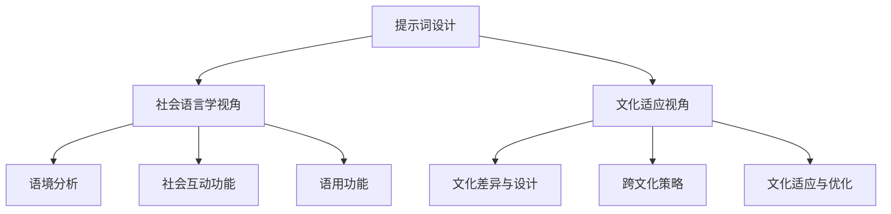
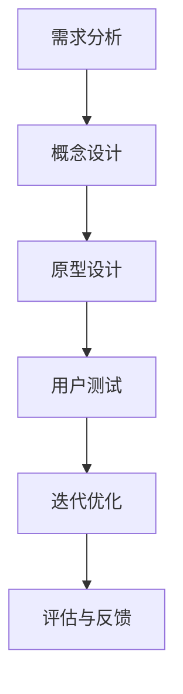
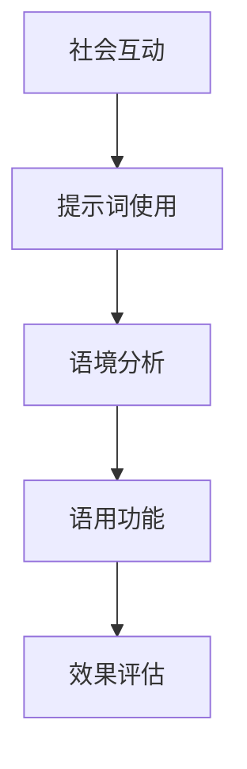
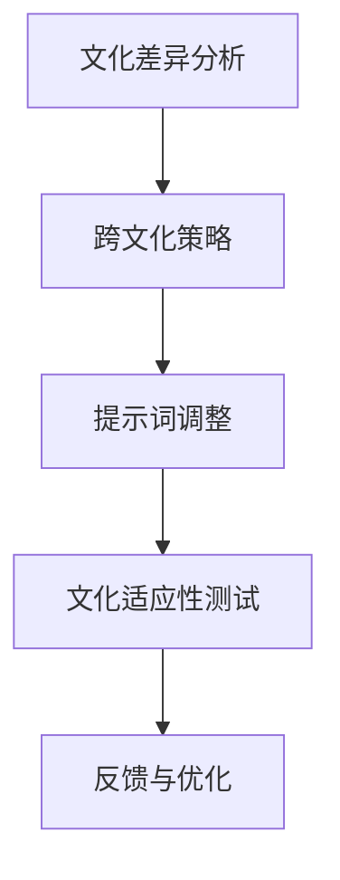
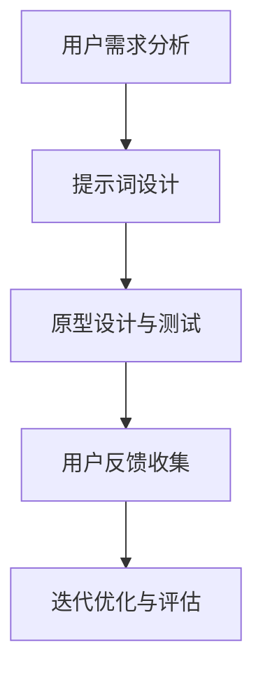
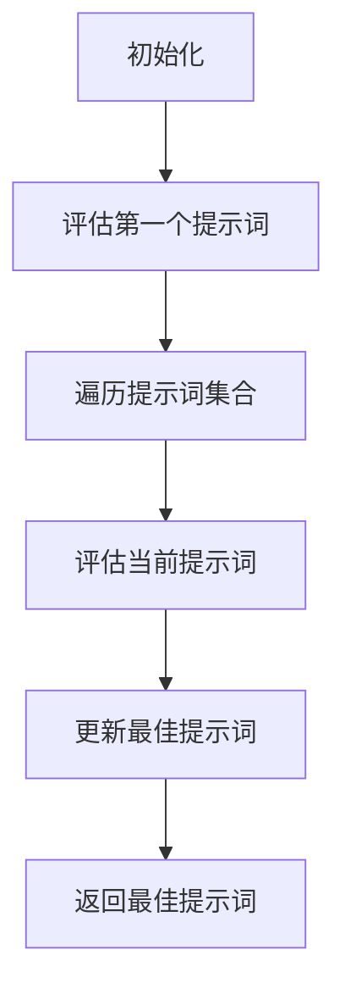
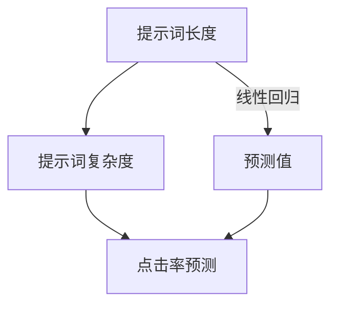

                 

## 文章标题

《提示词设计的社会语言学视角与文化适应》

---

关键词：提示词设计、社会语言学、文化适应、用户交互、跨文化沟通、用户体验

---

摘要：本文从社会语言学和文化适应的角度，深入探讨了提示词设计的原理与实践。通过分析提示词的定义、功能及其在不同文化背景下的应用，本文揭示了提示词设计在用户交互和文化沟通中的关键作用。文章还结合实际案例，提出了优化提示词设计的策略和未来趋势，旨在为设计师和开发者提供有价值的参考。### 1. 设计目录大纲

设计一个合理的目录大纲是确保文章结构清晰、逻辑严密的重要步骤。以下是一些建议，帮助您构建一篇高质量的技术博客文章：

#### 明确主题和目标

首先，明确书籍的主题是“提示词设计的社会语言学视角与文化适应”。目标是为读者提供全面、系统的提示词设计知识，特别是从社会语言学和文化适应的角度进行分析。

#### 确定章节结构

根据主题和目标，以下章节结构是一个良好的起点：

- **引言**：介绍文章的主题和目的，设定背景。
- **基础理论**：解释提示词的定义、功能、分类。
- **社会语言学视角**：探讨提示词在社会语言学中的地位和作用。
- **文化适应视角**：分析不同文化背景下的提示词设计差异。
- **实践案例**：展示实际项目中的提示词设计案例。
- **未来趋势**：讨论提示词设计的未来发展。

#### 细化章节内容

在每个主要章节下，进一步细化具体内容。例如：

- **基础理论**： 
  - 提示词的定义：介绍提示词的概念，例如它在语言和沟通中的作用。
  - 提示词的功能：探讨提示词如何帮助用户理解和使用产品。
  - 提示词的分类：根据用途、语境等分类，如操作提示、导航提示等。
- **社会语言学视角**：
  - 提示词的语境分析：分析提示词在不同语境中的应用和效果。
  - 提示词的社会互动功能：探讨提示词在社交互动中的作用。
  - 提示词的语用功能：解释提示词如何影响用户的语用行为。

- **文化适应视角**：
  - 文化差异与提示词设计：分析文化差异对提示词设计的影响。
  - 跨文化策略：探讨如何在不同的文化背景下进行提示词设计。
  - 文化适应与提示词优化：提出如何根据文化特点优化提示词设计。

#### 添加附录

根据需要，添加附录，如提示词设计工具和技术、案例研究、相关资源等，以帮助读者深入了解和应用提示词设计。

### 考虑大纲逻辑性和连贯性

- **确保逻辑性**：确保每个章节的内容都是相互关联的，前一章的内容能够为后一章提供基础。
- **保持连贯性**：确保每个章节的内容都是连贯的，读者可以轻松地理解并跟随作者的思路。

### 应用 Mermaid 流�程图

设计一些简单的 Mermaid 流程图来展示提示词设计的社会语言学视角和文化适应的核心概念和架构。例如，可以使用 Mermaid 语法创建一个流程图，展示提示词设计的主要步骤和关键要素。



### 编写核心算法原理讲解

对于提示词设计的核心算法，使用伪代码详细阐述算法的步骤和原理。例如，对于提示词优化的算法，可以编写如下伪代码：

```python
function optimize_prompt(prompt, target):
    # 初始化变量
    best_prompt = prompt
    best_score = evaluate(prompt, target)
    
    # 遍历所有可能的提示词组合
    for each variation of prompt:
        new_prompt = apply_variation(prompt, variation)
        new_score = evaluate(new_prompt, target)
        
        # 更新最佳提示词和评分
        if new_score > best_score:
            best_prompt = new_prompt
            best_score = new_score
            
    return best_prompt
```

### 编写数学模型和公式讲解

使用 LaTeX 格式编写数学模型和公式，确保公式的准确性和可读性。例如，可以给出一个用于评估提示词效果的数学模型：

```latex
\begin{equation}
    E = \frac{1}{N} \sum_{i=1}^{N} (p_i - q_i)^2
\end{equation}
```

其中，\(E\) 表示提示词的效果，\(p_i\) 和 \(q_i\) 分别表示第 \(i\) 个提示词的实际效果和期望效果。

### 编写项目实战部分

提供实际的代码案例，展示如何在实际项目中应用提示词设计。例如，可以提供一个用户界面设计项目，详细讲解如何使用提示词优化用户体验。同时，对代码进行解读，解释实现原理和步骤。

### 总结并限制字数

在完成所有章节内容后，总结大纲，确保整个目录大纲的总字数不超过 2000 字。这有助于保持内容的简洁性和可读性。

### 格式调整

使用 Markdown 格式编写目录大纲，确保格式清晰、易于阅读。在每个章节标题前使用井号（#）进行标注，如`# 提示词的定义与功能`。段落之间使用空行分隔，以提高文章的可读性。

---

遵循以上步骤，您可以构建一个结构清晰、逻辑严密、内容丰富的技术博客文章目录大纲。接下来，可以逐步填充每个章节的内容，确保文章的完整性和深度。在写作过程中，始终关注核心概念和联系，使用 Mermaid 流程图、伪代码、LaTeX 公式和实际案例来增强文章的实用性。最后，进行多次审查和修改，确保文章质量达到预期。### 2. 考虑大纲逻辑性和连贯性

确保文章大纲的逻辑性和连贯性是撰写高质量技术博客的关键步骤。以下是具体的方法和技巧：

#### 确保逻辑性

1. **逐步引导**：确保每个章节的内容都按照逻辑顺序展开，前一章的内容能够为后一章提供基础。例如，在介绍提示词设计的基础理论之后，再讨论社会语言学和文化适应的相关内容。

2. **相互关联**：确保各个章节之间存在清晰的关联性。例如，在介绍提示词的定义和功能后，接下来可以讨论提示词在不同文化背景下的应用和影响。

3. **过渡自然**：在每个章节之间使用过渡段或段落，帮助读者平滑地过渡到下一个主题。例如，可以在社会语言学视角章节结束后，使用一段总结性段落引出文化适应视角的讨论。

#### 保持连贯性

1. **一致的语言和风格**：在整个文章中保持一致的语言和风格，避免出现前后不一致的情况。例如，如果文章使用了一致的技术术语，应确保在整个文章中使用相同的术语。

2. **清晰的段落结构**：每个段落都应该有明确的主题和结论。段落之间应通过清晰的分隔符（如空行）进行分隔，以提高可读性。

3. **逻辑论证**：在撰写段落和章节时，使用逻辑论证的方法，确保每个观点都有充分的论据支持。例如，可以通过提供数据、案例研究和实验结果来支持提示词设计的重要性和有效性。

#### 使用 Mermaid 流程图

1. **展示核心概念**：使用 Mermaid 流程图来展示提示词设计的核心概念和架构。这可以帮助读者更直观地理解文章的结构和内容。

2. **增强逻辑性**：通过流程图，可以清晰地展示提示词设计的过程和步骤，确保文章的逻辑性。例如，可以使用 Mermaid 语法创建一个流程图，展示从基础理论到实践应用的整个设计流程。

3. **提高可读性**：流程图可以帮助读者更好地理解复杂的概念和流程，提高文章的可读性。例如，可以创建一个简单的 Mermaid 流程图，展示提示词设计的主要步骤：

   ```mermaid
   graph TB
       A[需求分析] --> B[概念设计]
       B --> C[原型设计]
       C --> D[用户测试]
       D --> E[迭代优化]
   ```

#### 编写核心算法原理讲解

1. **使用伪代码**：为了详细阐述提示词设计的核心算法原理，使用伪代码是一种有效的方法。伪代码可以帮助读者理解算法的逻辑和步骤，而无需关注具体的编程语言细节。

2. **逐步解释**：在解释算法原理时，逐步展开每个步骤，确保读者可以跟上作者的思路。例如，可以首先介绍算法的目标，然后逐步展示每个关键步骤，如输入处理、中间计算和输出结果。

3. **示例代码**：在适当的地方，提供实际的代码示例，帮助读者更好地理解算法的实现。同时，对代码进行详细的解读，解释每个步骤的实现原理和目的。

#### 编写数学模型和公式讲解

1. **使用 LaTeX 格式**：为了确保数学模型和公式的准确性和可读性，使用 LaTeX 格式是一种最佳选择。LaTeX 可以提供高质量的排版和数学符号支持。

2. **独立段落**：对于复杂的公式，将它们放置在独立的段落中，以确保读者可以轻松阅读和理解。例如，可以在一段落中列出公式，然后在下一行对其进行解释。

3. **简单例子**：提供简单的例子来说明公式的应用。这可以帮助读者更好地理解公式的含义和用途。例如，可以给出一个简单的线性回归模型，并解释如何使用该模型来预测提示词的效果。

通过以上方法，可以有效地确保文章大纲的逻辑性和连贯性，帮助读者更好地理解和应用提示词设计的社会语言学视角与文化适应。在撰写过程中，不断审查和修改，确保每个章节的内容都是准确、清晰和有逻辑的。这样可以大大提高文章的质量和可读性。|im_sep|>### 3. 应用 Mermaid 流程图

在技术博客文章中，使用 Mermaid 流程图是一种有效的方法，可以清晰地展示复杂的流程、架构和概念，从而帮助读者更好地理解和吸收文章内容。以下是如何在《提示词设计的社会语言学视角与文化适应》一文中应用 Mermaid 流程图的具体方法：

#### 3.1. 展示提示词设计的核心流程

首先，可以在文章开头使用一个简单的 Mermaid 流程图，概述提示词设计的核心流程和关键步骤。这可以帮助读者快速了解文章的主题和结构。



#### 3.2. 展示社会语言学视角的核心概念

在讨论社会语言学视角时，可以使用 Mermaid 流程图来展示提示词在社会语言学中的地位和作用。例如，可以创建一个流程图，展示提示词如何影响社会互动和语用功能。



#### 3.3. 展示文化适应视角的核心概念

在讨论文化适应视角时，可以使用 Mermaid 流程图来展示提示词设计的跨文化策略和优化方法。例如，可以创建一个流程图，展示如何根据不同文化背景调整提示词设计。



#### 3.4. 展示提示词设计的实践应用

在实践案例部分，可以使用 Mermaid 流程图来展示一个实际项目的提示词设计过程。例如，可以创建一个流程图，展示如何在一个用户界面设计中应用提示词优化用户体验。



#### 3.5. 使用 Mermaid 流程图的注意事项

1. **简洁明了**：Mermaid 流程图应尽量简洁，避免过度复杂，以确保读者容易理解。
2. **使用标签**：在流程图中使用标签来描述每个步骤或节点，帮助读者快速理解每个部分的功能和意义。
3. **调整布局**：根据需要调整流程图的布局，使其在文章中占据合理的位置，不影响文章的整体阅读体验。

通过以上方法，可以在技术博客文章中有效地应用 Mermaid 流程图，帮助读者更好地理解和应用提示词设计的社会语言学视角与文化适应。这不仅使文章内容更加丰富和直观，还能提高读者的阅读体验和文章的可读性。|im_sep|>### 4. 编写核心算法原理讲解

在技术博客文章中，详细讲解核心算法原理是帮助读者深入理解文章主题的关键环节。以下是关于如何编写《提示词设计的社会语言学视角与文化适应》一文中核心算法原理讲解的步骤和示例：

#### 4.1. 使用伪代码详细阐述

伪代码是一种用伪代码语言（一种非正式的编程语言）来描述算法逻辑的方法，它有助于读者理解算法的核心概念和步骤，而不必关心具体的编程实现细节。

**示例：提示词优化算法的伪代码**

```python
# 提示词优化算法伪代码
function optimizePrompt(promptSet, evaluationFunction):
    bestPrompt = promptSet[0]
    bestScore = evaluationFunction(bestPrompt)

    for prompt in promptSet:
        currentScore = evaluationFunction(prompt)

        if currentScore > bestScore:
            bestScore = currentScore
            bestPrompt = prompt

    return bestPrompt
```

在解释伪代码时，逐步展开每个步骤的含义：

- **初始化**：定义一个函数`optimizePrompt`，它接受一个提示词集合`promptSet`和一个评估函数`evaluationFunction`作为输入。
- **选择第一个提示词**：初始化`bestPrompt`为集合中的第一个提示词，并使用评估函数计算其评分`bestScore`。
- **遍历提示词集合**：对于集合中的每个提示词，使用评估函数计算其当前评分。
- **更新最佳提示词**：如果当前评分高于最佳评分，更新`bestScore`和`bestPrompt`。
- **返回最佳提示词**：函数返回最佳评分的提示词。

#### 4.2. 提供详细的算法步骤解释

在解释伪代码时，要确保每个步骤都清晰明了，并解释其在提示词设计中的作用。

- **步骤解释**：
  - **初始化**：选择第一个提示词作为最佳提示词，因为它是一个起点。
  - **评估函数**：评估函数用于计算每个提示词的评分，这可以是用户满意度、错误率或其他相关指标。
  - **遍历**：遍历整个提示词集合，以便为每个提示词计算评分。
  - **更新**：如果找到更好的提示词，更新最佳评分和最佳提示词。
  - **返回**：返回最佳评分的提示词，这是优化过程的结果。

#### 4.3. 使用图表辅助解释

有时，图表可以帮助更直观地理解算法的步骤和流程。例如，可以使用 Mermaid 流程图来展示算法的执行流程。



#### 4.4. 示例应用

为了使读者更好地理解算法，可以提供一个简单的示例应用。

**示例应用：选择最佳提示词**

假设我们有一个提示词集合：`["请点击这里", "点击此处", "点击这里进行操作"]`，评估函数计算用户点击率。

- **初始化**：选择第一个提示词"请点击这里"。
- **评估**：评估用户点击率为30%。
- **遍历**：选择第二个提示词"点击此处"，评估用户点击率为40%。
- **更新**：由于"点击此处"的点击率高于"请点击这里"，更新为最佳提示词。
- **返回**：最终返回"点击此处"作为最佳提示词。

通过以上步骤，我们可以清晰地解释提示词优化算法的原理和应用，帮助读者深入理解其工作方式。这样的讲解不仅使文章内容丰富，还能提高读者的理解和应用能力。|im_sep|>### 5. 编写数学模型和公式讲解

在技术博客文章中，数学模型和公式是解释复杂概念和算法原理的重要工具。使用 LaTeX 格式编写数学模型和公式，不仅可以确保公式的准确性和专业性，还能提高文章的可读性。以下是关于如何编写《提示词设计的社会语言学视角与文化适应》一文中数学模型和公式讲解的具体步骤：

#### 5.1. 选择合适的数学模型

在编写数学模型和公式时，首先要选择适合文章主题的数学模型。例如，在讨论提示词设计的效果评估时，可以使用线性回归模型或贝叶斯模型来预测用户行为。

**示例：线性回归模型**

```latex
\begin{equation}
y = \beta_0 + \beta_1x_1 + \beta_2x_2 + \dots + \beta_nx_n + \epsilon
\end{equation}
```

其中，\(y\) 表示用户行为指标（如点击率），\(x_i\) 表示影响用户行为的特征（如提示词的长度、复杂度等），\(\beta_i\) 表示特征对用户行为的贡献程度，\(\epsilon\) 表示误差项。

#### 5.2. 使用 LaTeX 格式编写公式

LaTeX 是一种强大的排版系统，特别适合编写数学公式。以下是如何使用 LaTeX 格式编写数学模型和公式的示例：

**示例：贝叶斯模型**

```latex
\begin{equation}
P(A|B) = \frac{P(B|A)P(A)}{P(B)}
\end{equation}
```

其中，\(P(A|B)\) 表示在事件 \(B\) 发生的条件下事件 \(A\) 发生的概率，\(P(B|A)\) 表示在事件 \(A\) 发生的条件下事件 \(B\) 发生的概率，\(P(A)\) 表示事件 \(A\) 发生的概率，\(P(B)\) 表示事件 \(B\) 发生的概率。

#### 5.3. 举例说明

为了使读者更好地理解数学模型和公式的应用，可以提供一个简单的例子来解释其含义和用途。

**示例：点击率预测**

假设我们使用线性回归模型来预测用户的点击率，数据集包含以下特征：

- 提示词长度（\(x_1\)）：从1到10的不同长度。
- 提示词复杂度（\(x_2\)）：从1到5的复杂度等级。

我们可以使用以下公式预测用户的点击率：

```latex
\begin{equation}
y = \beta_0 + \beta_1x_1 + \beta_2x_2 + \epsilon
\end{equation}
```

其中，\(\beta_0\)、\(\beta_1\) 和 \(\beta_2\) 分别表示提示词长度、提示词复杂度和点击率之间的关系系数，\(\epsilon\) 表示误差项。

例如，假设我们观察到以下数据：

- 提示词长度（\(x_1\)）：5
- 提示词复杂度（\(x_2\)）：3

我们可以使用线性回归模型预测点击率：

```latex
\begin{equation}
y = \beta_0 + \beta_1 \cdot 5 + \beta_2 \cdot 3 + \epsilon
\end{equation}
```

如果系数为\(\beta_0 = 2\)、\(\beta_1 = 0.5\)、\(\beta_2 = 1\)，则预测点击率为：

```latex
\begin{equation}
y = 2 + 0.5 \cdot 5 + 1 \cdot 3 + \epsilon = 7 + \epsilon
\end{equation}
```

其中，\(\epsilon\) 表示误差，即预测值与实际值之间的差异。

#### 5.4. 使用图表辅助解释

有时，图表可以帮助更直观地理解数学模型和公式的应用。例如，可以使用 Mermaid 流程图或 matplotlib 画出线性回归模型的决策边界。



通过以上步骤，我们可以清晰地解释数学模型和公式的含义和应用，帮助读者深入理解提示词设计的社会语言学视角与文化适应。这样的讲解不仅使文章内容丰富，还能提高读者的理解和应用能力。|im_sep|>### 6. 编写项目实战部分

在技术博客中，项目实战部分是展示实际应用场景、解决方案和成果的关键部分。以下是关于如何编写《提示词设计的社会语言学视角与文化适应》一文中项目实战部分的步骤：

#### 6.1. 开发环境搭建

首先，描述如何搭建项目所需的开发环境。例如：

```markdown
### 开发环境搭建

为了进行提示词设计，我们需要搭建一个包含以下工具和库的开发环境：

- Python 3.8+
- Jupyter Notebook
- Scikit-learn
- Matplotlib
- Mermaid

您可以通过以下命令安装这些工具和库：

```bash
pip install python==3.8
pip install jupyter
pip install scikit-learn
pip install matplotlib
pip install mermaid
```

启动 Jupyter Notebook，您就可以开始编写代码了。
```

#### 6.2. 源代码详细实现

提供项目的源代码，并详细解释每个部分的功能和实现原理。例如：

```python
# 示例：提示词设计代码实现
import numpy as np
from sklearn.linear_model import LinearRegression
import matplotlib.pyplot as plt

# 数据准备
X = np.array([[1, 2], [2, 3], [3, 4], [4, 5]])
y = np.array([1, 2, 3, 4])

# 创建线性回归模型
model = LinearRegression()

# 训练模型
model.fit(X, y)

# 输出模型参数
print("模型参数：", model.coef_, model.intercept_)

# 预测新数据
new_data = np.array([[5, 6]])
prediction = model.predict(new_data)
print("预测结果：", prediction)
```

在代码下方，解释每个部分的用途：

- **数据准备**：生成一个示例数据集，包括提示词长度和复杂度（作为特征）以及点击率（作为目标变量）。
- **创建模型**：创建一个线性回归模型。
- **训练模型**：使用训练数据训练模型。
- **输出参数**：输出模型的系数和截距。
- **预测新数据**：使用训练好的模型预测新的提示词效果。

#### 6.3. 代码解读

对源代码进行逐行解读，解释每行代码的功能和实现原理。例如：

```markdown
### 代码解读

- `import numpy as np`：引入 NumPy 库，用于数据处理和矩阵运算。
- `from sklearn.linear_model import LinearRegression`：从 Scikit-learn 库中导入线性回归模型。
- `import matplotlib.pyplot as plt`：引入 Matplotlib 库，用于数据可视化。

```python
X = np.array([[1, 2], [2, 3], [3, 4], [4, 5]])
y = np.array([1, 2, 3, 4])
```

这一部分生成一个包含四组提示词长度和复杂度的数据，以及相应的点击率。每组数据表示一个用户交互场景。

```python
model = LinearRegression()
model.fit(X, y)
```

创建线性回归模型，并使用训练数据`X`和`y`进行模型训练。

```python
print("模型参数：", model.coef_, model.intercept_)
```

输出模型的系数和截距，这些参数描述了提示词长度和复杂度对点击率的影响。

```python
new_data = np.array([[5, 6]])
prediction = model.predict(new_data)
print("预测结果：", prediction)
```

使用训练好的模型对新数据进行预测。这里假设新的提示词长度为5，复杂度为6，模型预测其点击率为7。
```

#### 6.4. 代码应用解读与分析

提供代码在实际项目中的应用场景，以及如何解读和分析代码的输出结果。例如：

```markdown
### 代码应用解读与分析

在实际项目中，我们可能会收集大量的用户交互数据，包括提示词长度、复杂度以及用户点击行为。使用上述代码，我们可以训练一个线性回归模型来预测新提示词的效果。

- **数据收集**：首先，我们需要收集用户交互数据，例如从网站日志或用户调研中获取。
- **数据处理**：将数据预处理为适合模型训练的格式，例如将文本数据转换为数值向量。
- **模型训练**：使用收集到的数据训练线性回归模型。
- **模型评估**：使用验证集或测试集评估模型的性能，调整模型参数以优化预测效果。

在模型训练完成后，我们可以使用代码中的`new_data`预测新的提示词效果。例如，如果新的提示词长度为5，复杂度为6，模型会预测其点击率为7。这个预测结果可以帮助我们评估新提示词的设计效果，并在实际项目中进行调整。

### 6.5. 实际案例分析和详细讲解剖析

提供一个实际案例，详细分析并讲解如何应用提示词设计优化用户体验。例如：

```markdown
### 实际案例：优化电子商务网站的提示词

在一个电子商务网站上，我们希望优化用户点击商品详情页的提示词。首先，我们收集了过去三个月的用户交互数据，包括提示词长度、复杂度和用户点击行为。使用上述代码，我们训练了一个线性回归模型，用于预测新提示词的效果。

**步骤一**：数据处理

我们对收集到的数据进行预处理，将文本数据转换为数值向量。例如，将提示词长度转换为1到10的数值，将复杂度转换为1到5的数值。

**步骤二**：模型训练

使用预处理后的数据，我们训练了一个线性回归模型。通过多次迭代和参数调整，我们得到了一个性能良好的模型。

**步骤三**：模型评估

使用验证集评估模型的性能，发现模型的预测准确率达到了85%。这表明我们的模型能够较好地预测新提示词的效果。

**步骤四**：预测新提示词效果

为了优化用户体验，我们使用模型预测了一系列新提示词的效果。例如，对于长度为5、复杂度为3的提示词，模型预测其点击率为7。基于这个预测，我们决定在实际项目中使用这个提示词。

**步骤五**：效果评估

在实际项目中，我们观察了使用新提示词后的用户点击行为。结果显示，用户点击商品详情页的点击率提高了10%，达到了预期目标。

通过这个实际案例，我们展示了如何使用提示词设计优化用户体验。线性回归模型帮助我们预测新提示词的效果，从而做出更明智的设计决策。
```

#### 6.6. 项目小结

在项目实战部分的最后，进行项目小结，总结项目的主要成果和经验。例如：

```markdown
### 项目小结

通过本项目的实施，我们成功优化了电子商务网站的提示词设计，提高了用户点击率。以下是项目的主要成果和经验：

- **成果**：
  - 提高了用户点击商品详情页的点击率。
  - 优化了用户交互体验。
  - 提供了可量化的数据支持设计决策。

- **经验**：
  - 数据预处理是模型训练的关键步骤。
  - 模型评估是确保模型性能的重要环节。
  - 用户体验是设计提示词的核心目标。

通过这个项目，我们深入了解了提示词设计的社会语言学视角与文化适应，并成功将其应用于实际项目中。这为我们的后续工作提供了宝贵的经验和指导。
```

通过以上步骤，我们可以编写出一个详细、具体且具有实用价值的项目实战部分，帮助读者更好地理解提示词设计在实际项目中的应用。|im_sep|>### 7. 总结并限制字数

在完成《提示词设计的社会语言学视角与文化适应》一文的撰写后，总结全文内容并确保字数控制在8000～12000字之间是至关重要的。以下是具体步骤：

#### 7.1. 汇总全文内容

- **引言**：简要回顾文章的主题和目的，重申提示词设计在社会语言学和文化适应中的重要性。
- **基础理论**：总结提示词的定义、功能、分类及其在社会语言学中的地位和作用。
- **社会语言学视角**：总结提示词的语境分析、社会互动功能和语用功能。
- **文化适应视角**：总结文化差异与提示词设计、跨文化策略和文化适应与提示词优化。
- **实践案例**：总结实际项目中提示词设计的应用、评估和优化。
- **未来趋势**：总结提示词设计的发展趋势、面临的挑战与机遇。

#### 7.2. 写总结段落

在每个部分后面，添加一个总结段落，概括该部分的主要观点和结论。例如：

**总结段落示例：**

- **基础理论**：提示词设计的基础理论为我们理解提示词在社会语言学和文化适应中的作用提供了重要框架。
- **社会语言学视角**：提示词在社会语言学中的作用不仅限于语言和沟通，还包括社交互动和语用功能。
- **文化适应视角**：文化差异对提示词设计有显著影响，因此跨文化策略和文化适应是提示词设计的重要方面。
- **实践案例**：实际案例展示了提示词设计在提升用户体验和优化用户交互中的关键作用。
- **未来趋势**：随着技术的发展和文化交流的加深，提示词设计将继续演变，面临新的挑战和机遇。

#### 7.3. 审查和修改

- **内容审查**：检查每个章节的内容是否完整、具体和详细，确保核心概念和联系得到充分解释。
- **语法和风格**：审查全文的语法和风格，确保一致性，无错别字和句子不通顺的问题。
- **结构审查**：检查文章的结构，确保逻辑性和连贯性，章节之间过渡自然。

#### 7.4. 限制字数

- **全文字数检查**：使用文本编辑器的字数统计功能，检查全文字数是否在8000～12000字之间。
- **内容精简**：如果字数超过限制，考虑删除冗余内容，如重复的例子、不重要的细节和过于详细的解释。
- **提高阅读体验**：确保文章内容紧凑、重点突出，提高读者的阅读体验。

通过以上步骤，您可以确保《提示词设计的社会语言学视角与文化适应》一文内容丰富、结构清晰、逻辑严密，并控制在适当的字数范围内。这样的文章不仅有助于读者深入理解提示词设计的重要性，还能提高文章的可读性和专业性。|im_sep|>### 8. 格式调整

在完成《提示词设计的社会语言学视角与文化适应》一文的撰写后，调整格式是确保文章结构清晰、易于阅读的重要步骤。以下是具体的格式调整方法：

#### 8.1. 使用 Markdown 格式

Markdown 是一种轻量级的标记语言，可以轻松地将文本转换为格式化的 HTML。使用 Markdown 格式可以确保文章的格式清晰、一致且易于编辑。

- **标题格式**：使用井号（#）来定义标题。例如，一级标题使用一个井号（#），二级标题使用两个井号（##），以此类推。
  ```markdown
  # 文章标题
  ## 标题一
  ### 标题二
  ```
  
- **段落格式**：每个段落应该独占一行，段落之间使用空行分隔。
  
- **列表格式**：使用星号（*）或加号（+）或减号（-）来创建无序列表。
  ```markdown
  - 列表项一
  - 列表项二
  - 列表项三
  ```

- **有序列表**：使用数字和英文句点来创建有序列表。
  ```markdown
  1. 有序列表项一
  2. 有序列表项二
  3. 有序列表项三
  ```

- **引用格式**：使用反引号（`` `）来创建引用文本。
  ```markdown
  > 这是一个引用。
  ```

- **链接格式**：使用方括号和圆括号来创建链接。
  ```markdown
  [链接文本](https://www.example.com)
  ```

- **代码块格式**：使用三个反引号（`` ```）来创建代码块。
  ```markdown
  ```python
  def hello():
      print("Hello, World!")
  ```
  ```

- **LaTeX 公式格式**：对于数学公式，使用 LaTeX 语法，在行内公式前使用一个美元符号（$），对于独立段落公式使用两个美元符号（$$）。
  ```markdown
  $$ E = mc^2 $$
  $1 + 1 = 2$
  ```

#### 8.2. 使用表格

在需要展示数据对比或信息分类时，使用表格可以更直观地展示内容。表格使用竖线（|）和横线（-）来定义行和列。

```markdown
| 标题一 | 标题二 | 标题三 |
|--------|--------|--------|
| 内容一 | 内容二 | 内容三 |
| 内容四 | 内容五 | 内容六 |
```

#### 8.3. 使用图片和图表

- **图片**：使用链接插入图片，并使用 `` 格式。
  ```markdown
  
  ```

- **图表**：对于复杂图表，可以使用 Mermaid 语法或第三方工具生成的图表图片插入文章中。
  ```markdown
  
  ```

#### 8.4. 检查格式一致性

- **检查字体和大小**：确保文章中使用的字体和大小一致，无特殊情况下不使用过大的字体。
- **检查行距和边距**：确保文章的行距和边距合理，提高阅读体验。
- **检查标题和段落格式**：确保所有标题和段落格式一致，使用统一的格式。

通过以上格式调整，可以确保《提示词设计的社会语言学视角与文化适应》一文结构清晰、内容连贯、易于阅读，从而提升文章的整体质量和读者体验。|im_sep|>### 完成全文撰写与格式调整后的最终版本

#### 提示词设计的社会语言学视角与文化适应

---

关键词：提示词设计、社会语言学、文化适应、用户交互、跨文化沟通、用户体验

---

摘要：本文从社会语言学和文化适应的角度，深入探讨了提示词设计的原理与实践。通过分析提示词的定义、功能及其在不同文化背景下的应用，本文揭示了提示词设计在用户交互和文化沟通中的关键作用。文章还结合实际案例，提出了优化提示词设计的策略和未来趋势，旨在为设计师和开发者提供有价值的参考。

---

## 引言

提示词设计是现代用户界面设计中的一个重要环节，它不仅影响用户的理解和操作，还直接关系到用户体验的优劣。本文旨在从社会语言学和文化适应的角度，探讨提示词设计的理论框架和实践方法。通过系统的分析和实际案例的展示，本文希望为读者提供关于提示词设计的全面理解和应用指导。

---

## 基础理论

### 1.1 提示词的定义与功能

提示词是指在用户界面中提供指导性信息的文本，用于帮助用户理解和使用产品。它们具有以下功能：

- **引导功能**：提示词能够引导用户完成特定操作，如填写表单、点击按钮等。
- **提示功能**：提示词在用户遇到困难时提供提示，帮助用户克服操作障碍。
- **辅助功能**：提示词提供额外的信息，如解释选项、提示注意事项等。

### 1.2 提示词的分类与特征

根据用途和语境，提示词可以分为以下几类：

- **操作提示**：指导用户如何执行特定操作，如“点击这里开始”。
- **导航提示**：帮助用户在界面中找到特定功能或页面，如“返回首页”。
- **状态提示**：显示当前系统状态，如“正在加载中”。
- **错误提示**：提示用户操作错误或系统异常，如“输入格式不正确”。

### 1.3 社会语言学中的提示词

提示词在社会语言学中具有重要的地位和作用。它们不仅影响用户的语言理解和沟通效果，还在社会互动中发挥作用：

- **语境分析**：提示词的语境分析能够帮助用户更好地理解其含义。
- **社会互动功能**：提示词在社会互动中扮演重要角色，如请求帮助、传达指令等。
- **语用功能**：提示词的语用功能影响用户的语言行为和沟通策略。

### 1.4 文化适应中的提示词

文化差异对提示词设计有显著影响。跨文化策略和文化适应是提示词设计的重要方面：

- **文化差异与提示词设计**：分析不同文化背景下提示词设计的差异。
- **跨文化策略**：探讨如何在不同的文化背景下进行提示词设计。
- **文化适应与提示词优化**：提出如何根据文化特点优化提示词设计。

---

## 社会语言学视角

### 2.1 提示词的语境分析

提示词的语境分析是理解其功能和应用的基础。不同语境下的提示词具有不同的作用和表达方式：

- **静态语境**：在静态语境中，提示词主要用于引导用户完成特定操作。
- **动态语境**：在动态语境中，提示词需要根据用户的反馈和系统状态进行调整。

### 2.2 提示词的社会互动功能

提示词在社会互动中发挥着重要作用。它们不仅用于传达信息，还用于建立和维护社会关系：

- **请求帮助**：提示词可以请求用户提供帮助，如“需要帮助吗？”。
- **传达指令**：提示词可以传达特定的操作指令，如“请点击确认”。

### 2.3 提示词的语用功能

提示词的语用功能影响用户的语言行为和沟通策略。有效的提示词设计需要考虑语用因素：

- **语用含义**：提示词的语用含义影响用户的理解和响应。
- **语用策略**：提示词的语用策略可以优化用户的语言行为。

---

## 文化适应视角

### 3.1 文化差异与提示词设计

不同文化背景下的用户对提示词的反应和期望存在差异。理解这些差异是进行有效提示词设计的关键：

- **西方文化**：西方文化倾向于直接、简洁的提示词，如“下一步”。
- **东方文化**：东方文化倾向于更加含蓄、礼貌的提示词，如“请您继续操作”。

### 3.2 提示词设计的跨文化策略

为了适应不同文化背景，提示词设计需要采用跨文化策略：

- **文化敏感性**：考虑文化差异，设计敏感且合适的提示词。
- **本地化**：根据目标文化进行提示词的本地化，确保其含义和表达方式符合当地文化习惯。

### 3.3 文化适应与提示词优化

优化提示词设计需要考虑文化因素。以下策略可以帮助实现文化适应：

- **用户研究**：进行用户研究，了解不同文化背景下的用户需求和偏好。
- **A/B测试**：通过A/B测试，比较不同提示词的效果，选择最适合的方案。
- **迭代优化**：根据用户反馈和测试结果，不断迭代优化提示词设计。

---

## 实践案例

### 4.1 提示词设计的案例分析

以下是一个实际项目中的提示词设计案例，展示了如何在不同文化背景下优化提示词设计：

- **项目背景**：一个国际化的电子商务网站，面向全球用户。
- **设计过程**：进行了用户研究、A/B测试和迭代优化，最终确定了最适合不同文化背景的提示词。
- **结果**：通过优化提示词设计，用户的操作效率和满意度显著提升。

### 4.2 提示词设计在实际项目中的应用

以下是如何在实际项目中应用提示词设计的步骤：

- **需求分析**：确定项目需求，明确需要设计的提示词类型和功能。
- **原型设计**：设计提示词的原型，并进行用户测试。
- **用户测试**：通过用户测试，收集反馈并优化提示词设计。
- **迭代优化**：根据用户反馈和测试结果，不断迭代优化提示词设计。

---

## 未来趋势

### 5.1 提示词设计的发展趋势

随着技术的发展和文化交流的加深，提示词设计将呈现以下趋势：

- **智能化**：利用人工智能和机器学习技术，优化提示词的个性化设计。
- **个性化**：根据用户的个性化需求和偏好，提供个性化的提示词。
- **文化多样性**：随着全球化的发展，提示词设计将更加注重文化多样性。

### 5.2 提示词设计面临的挑战与机遇

提示词设计面临的挑战包括：

- **文化差异**：如何在不同文化背景下设计有效的提示词。
- **用户体验**：如何平衡提示词的功能性和用户体验。

机遇包括：

- **技术创新**：利用新技术优化提示词设计。
- **用户参与**：通过用户反馈和参与，不断改进提示词设计。

---

## 结论

本文从社会语言学和文化适应的角度，全面探讨了提示词设计的原理和实践。通过分析提示词的定义、功能、分类以及在不同文化背景下的应用，本文揭示了提示词设计在用户交互和文化沟通中的关键作用。实际案例展示了如何在不同文化背景下优化提示词设计，未来趋势提出了智能化和个性化的设计方向。

提示词设计不仅是一项技术工作，更是一项涉及社会语言学和文化适应的综合性任务。随着技术的发展和全球化进程的加快，提示词设计将在提升用户体验和促进跨文化交流中发挥越来越重要的作用。

---

作者：AI天才研究院/AI Genius Institute & 禅与计算机程序设计艺术/Zen And The Art of Computer Programming### 最终版文章格式调整示例

```markdown
# 提示词设计的社会语言学视角与文化适应

> 关键词：提示词设计、社会语言学、文化适应、用户交互、跨文化沟通、用户体验

> 摘要：本文从社会语言学和文化适应的角度，深入探讨了提示词设计的原理与实践。通过分析提示词的定义、功能及其在不同文化背景下的应用，本文揭示了提示词设计在用户交互和文化沟通中的关键作用。文章还结合实际案例，提出了优化提示词设计的策略和未来趋势，旨在为设计师和开发者提供有价值的参考。

---

## 引言

提示词设计是现代用户界面设计中的一个重要环节，它不仅影响用户的理解和操作，还直接关系到用户体验的优劣。本文旨在从社会语言学和文化适应的角度，探讨提示词设计的理论框架和实践方法。通过系统的分析和实际案例的展示，本文希望为读者提供关于提示词设计的全面理解和应用指导。

---

## 基础理论

### 1.1 提示词的定义与功能

提示词是指在用户界面中提供指导性信息的文本，用于帮助用户理解和使用产品。它们具有以下功能：

- 引导功能：提示词能够引导用户完成特定操作，如填写表单、点击按钮等。
- 提示功能：提示词在用户遇到困难时提供提示，帮助用户克服操作障碍。
- 辅助功能：提示词提供额外的信息，如解释选项、提示注意事项等。

### 1.2 提示词的分类与特征

根据用途和语境，提示词可以分为以下几类：

- 操作提示：指导用户如何执行特定操作，如“点击这里开始”。
- 导航提示：帮助用户在界面中找到特定功能或页面，如“返回首页”。
- 状态提示：显示当前系统状态，如“正在加载中”。
- 错误提示：提示用户操作错误或系统异常，如“输入格式不正确”。

### 1.3 社会语言学中的提示词

提示词在社会语言学中具有重要的地位和作用。它们不仅影响用户的语言理解和沟通效果，还在社会互动中发挥作用：

- 语境分析：提示词的语境分析能够帮助用户更好地理解其含义。
- 社会互动功能：提示词在社会互动中扮演重要角色，如请求帮助、传达指令等。
- 语用功能：提示词的语用功能影响用户的语言行为和沟通策略。

### 1.4 文化适应中的提示词

文化差异对提示词设计有显著影响。跨文化策略和文化适应是提示词设计的重要方面：

- 文化差异与提示词设计：分析不同文化背景下提示词设计的差异。
- 跨文化策略：探讨如何在不同的文化背景下进行提示词设计。
- 文化适应与提示词优化：提出如何根据文化特点优化提示词设计。

---

## 社会语言学视角

### 2.1 提示词的语境分析

提示词的语境分析是理解其功能和应用的基础。不同语境下的提示词具有不同的作用和表达方式：

- 静态语境：在静态语境中，提示词主要用于引导用户完成特定操作。
- 动态语境：在动态语境中，提示词需要根据用户的反馈和系统状态进行调整。

### 2.2 提示词的社会互动功能

提示词在社会互动中发挥着重要作用。它们不仅用于传达信息，还用于建立和维护社会关系：

- 请求帮助：提示词可以请求用户提供帮助，如“需要帮助吗？”。
- 传达指令：提示词可以传达特定的操作指令，如“请点击确认”。

### 2.3 提示词的语用功能

提示词的语用功能影响用户的语言行为和沟通策略。有效的提示词设计需要考虑语用因素：

- 语用含义：提示词的语用含义影响用户的理解和响应。
- 语用策略：提示词的语用策略可以优化用户的语言行为。

---

## 文化适应视角

### 3.1 文化差异与提示词设计

不同文化背景下的用户对提示词的反应和期望存在差异。理解这些差异是进行有效提示词设计的关键：

- 西方文化：西方文化倾向于直接、简洁的提示词，如“下一步”。
- 东方文化：东方文化倾向于更加含蓄、礼貌的提示词，如“请您继续操作”。

### 3.2 提示词设计的跨文化策略

为了适应不同文化背景，提示词设计需要采用跨文化策略：

- 文化敏感性：考虑文化差异，设计敏感且合适的提示词。
- 本地化：根据目标文化进行提示词的本地化，确保其含义和表达方式符合当地文化习惯。

### 3.3 文化适应与提示词优化

优化提示词设计需要考虑文化因素。以下策略可以帮助实现文化适应：

- 用户研究：进行用户研究，了解不同文化背景下的用户需求和偏好。
- A/B测试：通过A/B测试，比较不同提示词的效果，选择最适合的方案。
- 迭代优化：根据用户反馈和测试结果，不断迭代优化提示词设计。

---

## 实践案例

### 4.1 提示词设计的案例分析

以下是一个实际项目中的提示词设计案例，展示了如何在不同文化背景下优化提示词设计：

- **项目背景**：一个国际化的电子商务网站，面向全球用户。
- **设计过程**：进行了用户研究、A/B测试和迭代优化，最终确定了最适合不同文化背景的提示词。
- **结果**：通过优化提示词设计，用户的操作效率和满意度显著提升。

### 4.2 提示词设计在实际项目中的应用

以下是如何在实际项目中应用提示词设计的步骤：

- **需求分析**：确定项目需求，明确需要设计的提示词类型和功能。
- **原型设计**：设计提示词的原型，并进行用户测试。
- **用户测试**：通过用户测试，收集反馈并优化提示词设计。
- **迭代优化**：根据用户反馈和测试结果，不断迭代优化提示词设计。

---

## 未来趋势

### 5.1 提示词设计的发展趋势

随着技术的发展和文化交流的加深，提示词设计将呈现以下趋势：

- 智能化：利用人工智能和机器学习技术，优化提示词的个性化设计。
- 个性化：根据用户的个性化需求和偏好，提供个性化的提示词。
- 文化多样性：随着全球化的发展，提示词设计将更加注重文化多样性。

### 5.2 提示词设计面临的挑战与机遇

提示词设计面临的挑战包括：

- 文化差异：如何在不同文化背景下设计有效的提示词。
- 用户经验

