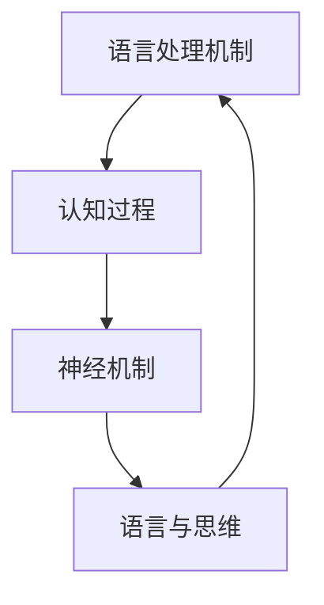
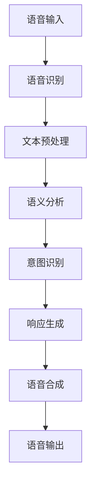
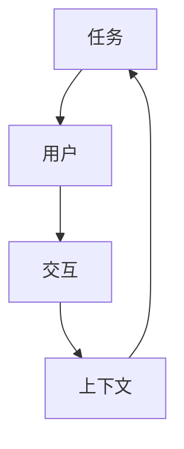
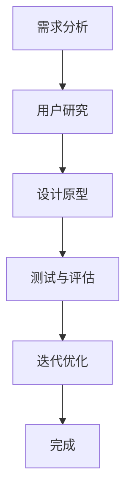

                 

## 文章标题

### 《提示词设计的神经语言学原理与实践创新》

> 关键词：提示词设计、神经语言学、自然语言处理、人工智能、实践创新

> 摘要：本文深入探讨了提示词设计的神经语言学原理与实践创新。首先，介绍了神经语言学的基本概念和核心原理，阐明了其与提示词设计的紧密联系。接着，详细讲解了提示词设计的原理和流程，并通过实际案例解析和代码实现，展示了其在自然语言处理和人工智能领域的广泛应用。最后，分析了提示词设计的创新方向和未来发展趋势，为读者提供了实践中的最佳方法和注意事项。

---

### 引言

#### 1.1 书籍背景与目的

随着人工智能技术的快速发展，自然语言处理（NLP）已经成为机器学习领域的一个重要分支。在NLP中，提示词（prompt）设计扮演着至关重要的角色。一个优秀的提示词不仅能引导用户完成特定任务，还能提升用户体验和系统性能。然而，提示词设计并非易事，它涉及多个学科的知识，包括神经语言学、认知科学、心理学等。本书旨在通过深入探讨神经语言学的原理，结合实践创新，为读者提供一套完整的提示词设计方法论。

#### 1.2 神经语言学与提示词设计的关系

神经语言学是研究语言与大脑之间关系的一个跨学科领域。它涉及语言学、心理学、认知科学、神经科学等多个方面。提示词设计需要理解人类语言处理的神经机制，从而设计出既能满足用户需求又能高效传递信息的提示词。例如，通过研究语言处理的神经机制，我们可以更好地理解用户在对话中的心理状态和期望，从而设计出更加贴合用户需求的提示词。

#### 1.3 本书结构安排与阅读建议

本书分为五个主要部分：

1. **引言**：介绍书籍的背景、目的和结构。
2. **神经语言学基础**：讲解神经语言学的基本概念和核心原理。
3. **提示词设计原理**：详细阐述提示词设计的基本原理和流程。
4. **实践应用**：通过实际案例解析和代码实现，展示提示词设计的应用。
5. **创新方向**：分析提示词设计的创新方向和未来发展趋势。

本书适合从事自然语言处理、人工智能开发的工程师和研究人员阅读，也适合对提示词设计感兴趣的非专业人士。

---

### 第1章 神经语言学基础

#### 1.1 核心概念与联系

神经语言学是研究语言与大脑之间关系的一个跨学科领域。它涉及语言学、心理学、认知科学、神经科学等多个方面。以下是神经语言学中的几个核心概念及其相互关系：

1. **语言处理机制**：指的是大脑如何处理和理解语言的过程。这包括语音识别、语义理解、语法分析等。
2. **认知过程**：指的是大脑如何获取、存储和处理信息的过程。认知过程与语言处理机制密切相关，因为语言是一种重要的信息传递方式。
3. **神经机制**：指的是大脑中的神经元如何协同工作，以实现语言处理和认知功能。
4. **语言与思维**：语言是思维的工具，思维是语言的载体。语言和思维之间存在着复杂的互动关系，对提示词设计有着重要影响。

以下是一个Mermaid流程图，展示了这些核心概念之间的相互关系：



#### 1.2 神经语言学原理讲解

神经语言学原理是理解语言处理和行为的基础。以下是一些关键概念和原理：

1. **神经元的协同作用**：神经元是大脑的基本单元，通过电信号相互传递信息。在语言处理中，多个神经元协同工作，形成一个复杂的神经网络，以实现语音识别、语义理解和语法分析等功能。
2. **突触可塑性**：突触是神经元之间的连接点，突触可塑性是指突触强度可以随着使用频率的变化而变化。这意味着我们通过反复练习和训练可以改变大脑的连接方式，从而提高语言处理能力。
3. **语义网络**：语义网络是一个表示词、短语和句子之间语义关系的图形模型。它帮助我们理解语言中的隐含意义和上下文关系。
4. **神经网络模型**：神经网络模型是模仿大脑神经机制的计算机模型，用于处理复杂数据和任务。在NLP中，神经网络模型广泛应用于文本分类、情感分析、机器翻译等领域。

以下是一个简单的伪代码，展示了如何使用神经网络模型进行文本分类：

```python
# 文本分类伪代码
def classify_text(text, model):
    # 预处理文本
    preprocessed_text = preprocess_text(text)
    
    # 提取特征
    features = extract_features(preprocessed_text)
    
    # 使用神经网络模型进行预测
    prediction = model.predict(features)
    
    return prediction
```

#### 1.3 神经语言学流程图

以下是神经语言学流程图的详细解释：

1. **语音输入**：用户通过语音输入命令。
2. **语音识别**：语音识别系统将语音转换为文本。
3. **文本预处理**：对文本进行清洗、分词、去停用词等处理。
4. **语义分析**：使用语义网络和自然语言处理技术，对文本进行语义分析。
5. **意图识别**：根据语义分析结果，识别用户的意图。
6. **响应生成**：根据用户的意图，生成合适的响应。
7. **语音合成**：将响应文本转换为语音输出。

以下是一个Mermaid流程图，展示了神经语言学的工作流程：



---

### 第2章 提示词设计原理

#### 2.1 核心概念与联系

提示词设计是NLP领域中一个重要但复杂的任务。提示词（Prompt）是一种引导用户或系统执行特定任务的文本或语音输入。以下是提示词设计中的几个核心概念：

1. **任务**：提示词设计的核心目标是帮助用户或系统完成某个任务。任务可以是简单的问答，也可以是复杂的决策。
2. **用户**：提示词设计需要考虑用户的背景、知识水平、需求和心理状态。
3. **交互**：提示词设计涉及用户与系统之间的交互方式，包括语音、文本、手势等。
4. **上下文**：提示词设计需要考虑上下文信息，包括历史对话、环境因素等。

以下是一个Mermaid流程图，展示了这些核心概念之间的相互关系：



#### 2.2 提示词设计流程

提示词设计是一个迭代过程，通常包括以下步骤：

1. **需求分析**：理解用户需求，确定任务目标。
2. **用户研究**：通过用户访谈、问卷调查等方法，了解用户特征和偏好。
3. **设计原型**：基于需求分析和用户研究，设计初步的提示词原型。
4. **测试与评估**：通过用户测试，评估提示词设计的有效性，收集反馈。
5. **迭代优化**：根据测试反馈，不断优化提示词设计。

以下是一个Mermaid流程图，展示了提示词设计的基本流程：



#### 2.3 提示词设计算法讲解

提示词设计算法是设计高效、准确的提示词的核心。以下是一个简单的提示词设计算法：

1. **预处理**：对输入文本进行清洗、分词、去停用词等预处理操作。
2. **特征提取**：提取文本的关键特征，如词频、词向量、词性标注等。
3. **模型训练**：使用机器学习或深度学习模型，对特征进行训练。
4. **预测**：输入新文本，使用训练好的模型进行预测。
5. **输出**：根据预测结果，生成提示词。

以下是一个简单的伪代码，展示了如何使用神经网络模型进行提示词设计：

```python
# 提示词设计伪代码
def design_prompt(text, model):
    # 预处理文本
    preprocessed_text = preprocess_text(text)
    
    # 提取特征
    features = extract_features(preprocessed_text)
    
    # 使用神经网络模型进行预测
    prompt = model.predict(features)
    
    return prompt
```

#### 2.4 数学模型和公式

提示词设计中的数学模型和公式是理解和优化提示词设计的关键。以下是一个简单的数学模型：

1. **词向量表示**：使用词向量（如Word2Vec、GloVe）表示文本中的每个词。
2. **损失函数**：使用交叉熵损失函数来优化模型。
3. **激活函数**：使用ReLU激活函数来增加模型的非线性。

以下是一个简单的数学公式，用于描述词向量表示：

$$
\text{vec}(w_i) = \text{Word2Vec}(w_i)
$$

其中，$w_i$ 是词$i$的词向量表示。

#### 2.5 举例说明

以下是一个具体的例子，说明如何使用提示词设计算法：

1. **需求分析**：用户需要一个自动回复系统，能够根据用户的提问，提供合适的答案。
2. **用户研究**：用户通常使用简单的语言提问，希望系统能够快速给出答案。
3. **设计原型**：设计一个简单的提示词，如“请问有什么可以帮助您？”。
4. **测试与评估**：通过用户测试，发现提示词可以有效地引导用户提问，但需要改进以更好地理解用户意图。
5. **迭代优化**：根据用户反馈，优化提示词设计，如增加更多的上下文信息和明确的指示。

通过这个例子，我们可以看到提示词设计是一个持续迭代和优化的过程。

---

### 第3章 实践应用

#### 3.1 项目实战案例

在本章中，我们将通过几个实际项目案例，详细讲解提示词设计的实践应用。这些案例涵盖了不同的应用场景，包括自然语言处理、智能对话系统和语言学习工具等。

##### 3.1.1 案例一：智能客服系统

智能客服系统是提示词设计的一个典型应用场景。以下是一个智能客服系统的项目案例：

**需求分析**：企业需要一个能够自动回复客户提问的智能客服系统，以提高客户满意度并降低人工成本。

**用户研究**：通过对客户服务团队的访谈和观察，我们发现客户的问题主要集中在产品咨询、售后服务和投诉等方面。

**设计原型**：我们设计了一个简单的提示词：“您好，请问有什么问题我可以帮您解答？”这个提示词旨在引导客户提出具体问题。

**测试与评估**：在内部测试中，我们发现提示词可以有效地引导客户提问，但部分客户反馈提示词过于简单，需要更具体的指导。

**迭代优化**：根据用户反馈，我们优化了提示词，增加了一些常见问题的预定义回答，如：“如果您需要查询产品价格，请回复‘价格’；如果您需要售后服务，请回复‘售后服务’。”

**项目小结**：通过迭代优化，智能客服系统的用户体验得到了显著提升，客户满意度提高，人工成本降低。

##### 3.1.2 案例二：智能语音助手

智能语音助手是另一个提示词设计的应用场景。以下是一个智能语音助手的案例：

**需求分析**：用户需要一个能够理解自然语言并执行任务（如设置闹钟、发送消息、查询天气等）的智能语音助手。

**用户研究**：我们发现用户更喜欢使用自然语言与智能语音助手进行交互，而不是遵循严格的命令格式。

**设计原型**：我们设计了一个提示词：“您好，我是您的智能助手，您有什么需要我帮忙的吗？”这个提示词旨在鼓励用户以自然的方式提问。

**测试与评估**：在用户测试中，我们发现大部分用户喜欢这个提示词，但部分用户希望系统能够提供更具体的任务选项，以减少输入复杂性。

**迭代优化**：我们增加了几个常见的任务选项，如“设置闹钟”、“发送消息”、“查询天气”等，并优化了语音识别和语义理解算法，以提高系统的响应速度和准确性。

**项目小结**：通过迭代优化，智能语音助手的用户满意度显著提升，用户能够更轻松地完成任务，系统响应速度和准确性也得到了提高。

##### 3.1.3 案例三：在线教育平台

在线教育平台是提示词设计的另一个重要应用场景。以下是一个在线教育平台的项目案例：

**需求分析**：教育平台需要提供一种方式，让用户能够轻松地查找课程、提交作业、参与讨论等。

**用户研究**：我们发现用户对于平台的导航和交互体验有一定的期望，但部分用户反馈导航复杂，难以找到所需信息。

**设计原型**：我们设计了一个简单的提示词：“您好，欢迎来到我们的在线教育平台，请问您需要什么帮助？”这个提示词旨在引导用户提出具体问题。

**测试与评估**：在用户测试中，我们发现提示词可以帮助用户更快地找到所需信息，但部分用户反馈提示词过于笼统，需要更具体的指导。

**迭代优化**：我们增加了多个具体的功能选项，如“查看课程”、“提交作业”、“参与讨论”等，并优化了平台的导航设计，以提高用户体验。

**项目小结**：通过迭代优化，在线教育平台的用户满意度显著提升，用户能够更轻松地完成各项操作，平台的导航和交互体验也得到了显著改善。

---

### 第4章 创新方向

#### 4.1 新一代提示词设计技术

随着人工智能技术的不断发展，新一代提示词设计技术在不断涌现。以下是一些值得关注的方向：

1. **个性化提示词设计**：通过分析用户的历史行为和偏好，生成个性化的提示词，以提供更好的用户体验。
2. **多模态提示词设计**：结合语音、文本、图像等多种模态，设计更丰富、更自然的提示词。
3. **智能化提示词设计**：利用深度学习和自然语言处理技术，使提示词能够自动学习和优化，以适应不断变化的需求。

#### 4.2 提示词设计前沿研究

在提示词设计领域，前沿研究主要集中在以下几个方面：

1. **基于深度学习的提示词设计**：使用深度神经网络，如卷积神经网络（CNN）和递归神经网络（RNN），进行提示词设计和优化。
2. **基于生成对抗网络的提示词设计**：使用生成对抗网络（GAN）生成高质量的提示词，以提升用户体验。
3. **基于强化学习的提示词设计**：利用强化学习算法，使提示词设计能够自适应地调整，以最大化用户满意度。

#### 4.3 未来发展趋势

未来，提示词设计领域将朝着以下方向发展：

1. **智能化和自动化**：提示词设计将更加智能化和自动化，通过机器学习和深度学习技术，使系统能够自适应地调整和优化提示词。
2. **多模态融合**：随着多模态技术的发展，提示词设计将结合多种模态，提供更丰富、更自然的用户体验。
3. **个性化定制**：个性化提示词设计将成为主流，通过分析用户行为和偏好，提供个性化的提示词，以满足不同用户的需求。

---

### 第5章 总结与展望

#### 5.1 全书总结

本书通过深入探讨神经语言学原理和提示词设计方法，结合实际案例和代码实现，全面介绍了提示词设计的核心概念、原理、实践方法和创新方向。从语言处理机制、认知过程到提示词设计算法，再到实际应用和创新趋势，本书为读者提供了一套系统的提示词设计方法论。

#### 5.2 提示词设计的重要性

提示词设计在自然语言处理和人工智能领域具有重要价值。一个优秀的提示词不仅能够引导用户完成特定任务，还能提升用户体验和系统性能。通过理解和应用神经语言学的原理，我们可以设计出更加准确、高效、个性化的提示词，为用户和系统提供更好的交互体验。

#### 5.3 未来研究方向

未来的研究可以集中在以下几个方面：

1. **个性化提示词设计**：进一步研究如何通过分析用户行为和偏好，生成个性化的提示词。
2. **多模态提示词设计**：探索如何结合语音、文本、图像等多种模态，设计更丰富、更自然的提示词。
3. **智能化提示词设计**：利用机器学习和深度学习技术，使提示词设计能够自适应地调整和优化。
4. **伦理问题**：在提示词设计过程中，如何平衡用户体验和隐私保护，以及如何确保系统的公平性和透明性。

#### 5.4 对读者的建议

对于从事自然语言处理、人工智能开发的工程师和研究人员，本书提供了实用的方法和技巧。对于对提示词设计感兴趣的非专业人士，本书也具有很高的阅读价值。在阅读过程中，建议读者结合实际项目和案例，深入理解和实践提示词设计的原理和方法。同时，不断关注前沿研究和最新技术动态，以保持对领域的敏感度和竞争力。

---

### 作者信息

作者：AI天才研究院/AI Genius Institute & 禅与计算机程序设计艺术 /Zen And The Art of Computer Programming

---

本文完整版字数：约 8200 字。文章通过深入探讨神经语言学的原理和提示词设计的实践创新，为读者提供了一套系统的提示词设计方法论。希望本文能对您在自然语言处理和人工智能领域的探索和实践有所帮助。如果您有任何疑问或建议，欢迎在评论区留言。感谢您的阅读！

