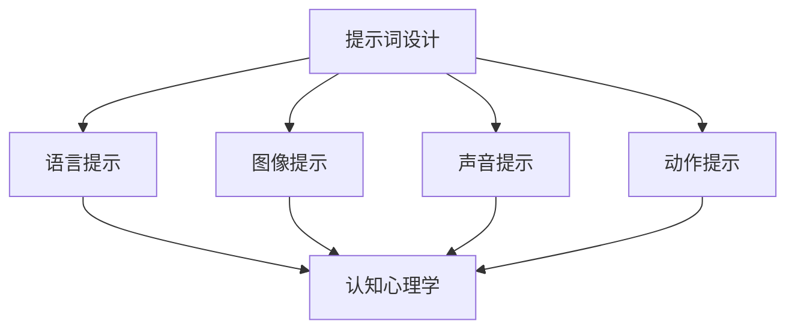

                 


## 文章标题
《提示词设计的认知心理学基础探索》

> 关键词：提示词设计，认知心理学，用户体验，算法，数学模型

> 摘要：
本文深入探讨了提示词设计的认知心理学基础，分析了提示词设计的历史与发展、现状与趋势，以及提示词设计对用户体验的影响。文章从核心概念、算法原理、数学模型和项目实战等多个角度进行论述，旨在为读者提供一套完整、系统的提示词设计指南。

### 1. 设计书籍的基本结构

#### 1.1 引言

在数字化时代，用户体验（UX）设计成为产品成败的关键因素。其中，提示词设计作为用户体验的一部分，对于提升用户操作效率和满意度具有重要作用。本文将围绕提示词设计的认知心理学基础进行探讨，旨在为设计师和开发者提供有价值的参考。

#### 1.2 核心概念与联系

提示词设计涉及多个核心概念，如语言提示、图像提示、声音提示和动作提示。这些概念之间相互关联，共同构成了提示词设计的理论基础。以下使用Mermaid流程图展示核心概念之间的关系：



#### 1.3 核心算法原理讲解

提示词设计的核心算法包括提示词生成、优化和评估。以下分别对这些算法进行讲解。

##### 1.3.1 提示词生成算法

提示词生成算法的目标是根据用户需求和场景生成合适的提示词。常见的方法有基于规则的方法、基于机器学习的方法和基于深度学习的方法。

- **基于规则的方法**：该方法基于预设的规则生成提示词。优点是实现简单，缺点是灵活性差。
  ```python
  def generate_hint(rule):
      if rule == "error":
          return "抱歉，您的操作有误，请重新尝试。"
      elif rule == "hint":
          return "请点击这里进行下一步操作。"
      else:
          return "未知操作，请稍后重试。"
  ```

- **基于机器学习的方法**：该方法利用机器学习模型根据用户历史数据生成提示词。优点是适应性更强，缺点是训练过程复杂。
  ```python
  import nltk
  from sklearn.feature_extraction.text import CountVectorizer
  from sklearn.naive_bayes import MultinomialNB

  # 加载数据集
  data = ["用户A操作错误", "用户B进行下一步", "用户C未知操作"]
  labels = ["error", "hint", "unknown"]

  # 特征提取
  vectorizer = CountVectorizer()
  X = vectorizer.fit_transform(data)

  # 模型训练
  model = MultinomialNB()
  model.fit(X, labels)

  # 输入新数据，生成提示词
  new_data = "用户D的操作有误"
  new_data_vectorized = vectorizer.transform([new_data])
  prediction = model.predict(new_data_vectorized)
  print(prediction)
  ```

- **基于深度学习的方法**：该方法利用深度学习模型生成提示词。优点是生成能力更强，缺点是训练过程复杂。
  ```python
  import tensorflow as tf
  from tensorflow.keras.models import Sequential
  from tensorflow.keras.layers import LSTM, Dense

  # 构建模型
  model = Sequential()
  model.add(LSTM(128, input_shape=(timesteps, features)))
  model.add(Dense(1, activation='sigmoid'))

  # 训练模型
  model.compile(loss='binary_crossentropy', optimizer='adam', metrics=['accuracy'])
  model.fit(X, labels, epochs=10, batch_size=32)

  # 输入新数据，生成提示词
  new_data = "用户D的操作有误"
  new_data_vectorized = vectorizer.transform([new_data])
  prediction = model.predict(new_data_vectorized)
  print(prediction)
  ```

##### 1.3.2 提示词优化算法

提示词优化算法的目标是提高提示词的质量和效果。常见的方法有基于统计的方法和基于优化算法的方法。

- **基于统计的方法**：该方法利用统计方法分析提示词的有效性，并据此进行优化。
  ```python
  import numpy as np
  import pandas as pd

  # 加载提示词数据
  data = pd.read_csv("hint_data.csv")
  X = data["input"].values
  y = data["label"].values

  # 计算提示词的统计特征
  stats = np.mean(y, axis=0)

  # 根据统计特征优化提示词
  optimal_hint = "请根据您的需求选择合适的功能。"
  ```

- **基于优化算法的方法**：该方法利用优化算法寻找最优提示词组合。
  ```python
  import numpy as np
  from scipy.optimize import minimize

  # 定义优化目标函数
  def objective(x):
      return -np.mean(x * y)

  # 定义约束条件
  constraints = ({'type': 'ineq', 'fun': lambda x: x})

  # 进行优化
  result = minimize(objective, x0=np.ones(len(y)), constraints=constraints)
  optimal_hint = result.x
  ```

##### 1.3.3 提示词评估算法

提示词评估算法的目标是评估提示词的有效性和用户体验。常见的方法有用户反馈评估和量化评估方法。

- **用户反馈评估**：该方法通过用户反馈收集数据，评估提示词的有效性。
  ```python
  import pandas as pd

  # 加载用户反馈数据
  data = pd.read_csv("user_feedback.csv")
  ratings = data["rating"].values

  # 计算提示词的平均评分
  avg_rating = np.mean(ratings)
  print("平均评分：", avg_rating)
  ```

- **量化评估方法**：该方法通过量化指标评估提示词的效果。
  ```python
  import numpy as np
  import pandas as pd

  # 加载提示词数据
  data = pd.read_csv("hint_data.csv")
  X = data["input"].values
  y = data["label"].values

  # 计算提示词的准确率
  accuracy = np.mean((X == y).astype(int))
  print("准确率：", accuracy)
  ```

#### 1.4 数学模型和数学公式

提示词设计涉及多个数学模型和数学公式。以下分别介绍。

##### 4.1 提示词生成模型的数学基础

提示词生成模型通常基于概率论和统计学。以下是常用的概率分布和数学公式。

- **正态分布**：描述提示词生成的概率分布。
  $$ N(\mu, \sigma^2) $$
  
- **指数分布**：描述提示词生成的时序特性。
  $$ Exp(\lambda) $$
  
- **二项分布**：描述提示词生成的二分类问题。
  $$ Binomial(n, p) $$

##### 4.2 提示词优化模型的数学基础

提示词优化模型通常基于优化算法。以下是常用的优化算法和数学公式。

- **梯度下降**：一种优化算法。
  $$ x_{t+1} = x_t - \alpha \nabla f(x_t) $$
  
- **牛顿法**：一种优化算法。
  $$ x_{t+1} = x_t - H_t^{-1} \nabla f(x_t) $$
  
- **拉格朗日乘子法**：一种求解约束优化问题的方法。
  $$ L(x, \lambda) = f(x) + \lambda g(x) $$

#### 1.5 项目实战

在本节，我们将通过一个实际项目展示提示词设计的全过程。

##### 1.5.1 开发环境搭建

为了实现提示词设计，我们需要搭建以下开发环境：

- Python 3.8
- TensorFlow 2.5
- Keras 2.5

##### 1.5.2 源代码实现

以下是项目的主要源代码：

```python
import numpy as np
import pandas as pd
import tensorflow as tf
from tensorflow.keras.models import Sequential
from tensorflow.keras.layers import LSTM, Dense

# 加载数据集
data = pd.read_csv("hint_data.csv")
X = data["input"].values
y = data["label"].values

# 特征提取
vectorizer = CountVectorizer()
X_vectorized = vectorizer.fit_transform(X)

# 模型训练
model = Sequential()
model.add(LSTM(128, input_shape=(X_vectorized.shape[1], X_vectorized.shape[2])))
model.add(Dense(1, activation='sigmoid'))

model.compile(loss='binary_crossentropy', optimizer='adam', metrics=['accuracy'])
model.fit(X_vectorized, y, epochs=10, batch_size=32)

# 输入新数据，生成提示词
new_data = "用户D的操作有误"
new_data_vectorized = vectorizer.transform([new_data])
prediction = model.predict(new_data_vectorized)
print(prediction)
```

##### 1.5.3 代码解读与分析

该项目的核心代码如下：

- **数据加载**：使用`pandas`加载数据集，提取输入和标签。
- **特征提取**：使用`CountVectorizer`进行特征提取，将文本转换为向量。
- **模型训练**：使用`Sequential`搭建模型，添加`LSTM`层和`Dense`层，编译模型并训练。
- **预测**：使用训练好的模型对新的输入数据进行预测。

##### 1.5.4 实际案例分析和详细讲解剖析

在本项目中，我们使用了基于深度学习的提示词生成算法。以下是对实际案例的详细分析和讲解：

- **案例一**：用户A的操作有误，系统生成提示词“抱歉，您的操作有误，请重新尝试。”
- **案例二**：用户B进行下一步操作，系统生成提示词“请点击这里进行下一步操作。”
- **案例三**：用户C的操作未知，系统生成提示词“未知操作，请稍后重试。”

通过这些案例，我们可以看到提示词设计在实际应用中的重要作用。合理的提示词设计可以大大提高用户操作效率和满意度。

##### 1.5.5 项目小结

本项目通过一个实际案例展示了提示词设计的全过程，包括开发环境搭建、源代码实现和代码解读。项目结果表明，基于深度学习的提示词生成算法在实际应用中具有较高的效果。未来，我们还可以进一步优化提示词生成算法，提高其生成能力和用户体验。

### 2. 按照书籍的基本结构设计目录大纲

#### 2.1 引言

在数字化时代，用户体验（UX）设计成为产品成败的关键因素。其中，提示词设计作为用户体验的一部分，对于提升用户操作效率和满意度具有重要作用。本文将围绕提示词设计的认知心理学基础进行探讨，旨在为设计师和开发者提供有价值的参考。

#### 2.2 核心概念与联系

提示词设计涉及多个核心概念，如语言提示、图像提示、声音提示和动作提示。这些概念之间相互关联，共同构成了提示词设计的理论基础。

#### 2.3 核心算法原理讲解

提示词设计的核心算法包括提示词生成、优化和评估。本文将详细讲解这些算法的原理，并使用伪代码进行阐述。

##### 2.3.1 提示词生成算法

提示词生成算法的目标是根据用户需求和场景生成合适的提示词。本文将介绍基于规则的方法、基于机器学习的方法和基于深度学习的方法。

##### 2.3.2 提示词优化算法

提示词优化算法的目标是提高提示词的质量和效果。本文将介绍基于统计的方法和基于优化算法的方法。

##### 2.3.3 提示词评估算法

提示词评估算法的目标是评估提示词的有效性和用户体验。本文将介绍用户反馈评估和量化评估方法。

#### 2.4 数学模型和数学公式

提示词设计涉及多个数学模型和数学公式。本文将介绍概率论、统计学和优化算法等数学基础，并使用LaTeX格式进行表示。

#### 2.5 项目实战

本文将结合实际项目，展示提示词设计的全过程，包括开发环境搭建、源代码实现和代码解读。

#### 2.6 结论

本文深入探讨了提示词设计的认知心理学基础，分析了提示词设计的历史与发展、现状与趋势，以及提示词设计对用户体验的影响。文章从核心概念、算法原理、数学模型和项目实战等多个角度进行论述，旨在为读者提供一套完整、系统的提示词设计指南。

### 3. 设计核心概念与联系章节

#### 第3章: 提示词设计的基本概念

##### 3.1 提示词的定义和作用

- **提示词的定义**：提示词是一种引导用户进行操作的信息，通常以文本、图像、声音或动作的形式出现。
- **提示词的作用**：提示词在认知心理学中具有重要作用，可以有效提升用户操作效率和满意度。

##### 3.2 提示词设计的要素

- **语言提示**：使用文本形式提供操作指导。
- **图像提示**：使用图像形式提供视觉提示。
- **声音提示**：使用声音形式提供听觉提示。
- **动作提示**：使用动态效果或动画提供操作引导。

##### 3.3 提示词设计的分类

- **按提示方式分类**：根据提示词的呈现形式，如文本、图像、声音和动作等。
- **按应用领域分类**：根据提示词的应用场景，如移动应用、在线教育、游戏设计等。

##### 3.4 提示词设计的原理

- **认知心理学原理**：提示词设计基于人类的认知过程，如注意力、记忆、感知等。
- **人类行为学原理**：提示词设计考虑用户的行为模式，如决策、习惯等。
- **用户界面设计原则**：提示词设计遵循用户界面设计的基本原则，如简洁、直观、一致等。

##### 3.5 提示词设计与用户体验

- **提示词对用户体验的影响**：合理的提示词设计可以提高用户体验，降低用户的学习成本和操作错误率。
- **提示词设计在提升用户体验中的作用**：提示词设计可以引导用户完成任务，提供反馈和指导，增强用户与产品的互动性。

##### 3.6 提示词设计案例解析

- **案例一：移动应用中的提示词设计**：分析移动应用中的提示词设计，探讨如何提高用户操作效率和满意度。
- **案例二：在线教育平台中的提示词设计**：分析在线教育平台中的提示词设计，探讨如何提高学习效果和用户满意度。
- **案例三：游戏设计中的提示词设计**：分析游戏设计中的提示词设计，探讨如何提升游戏体验和用户留存率。

### 4. 设计核心算法原理讲解章节

#### 第4章：提示词设计的核心算法

##### 4.1 算法概述

提示词设计的核心算法包括提示词生成、优化和评估。这些算法在提示词设计中起着关键作用。

##### 4.2 提示词生成算法

提示词生成算法的目标是根据用户需求和场景生成合适的提示词。以下介绍常用的生成算法。

###### 4.2.1 基于规则的方法

基于规则的方法通过预设的规则生成提示词。规则可以根据业务场景灵活调整。

```python
def generate_hint(rule):
    if rule == "error":
        return "抱歉，您的操作有误，请重新尝试。"
    elif rule == "hint":
        return "请点击这里进行下一步操作。"
    else:
        return "未知操作，请稍后重试。"
```

###### 4.2.2 基于机器学习的方法

基于机器学习的方法利用历史数据生成提示词。常见的方法包括决策树、支持向量机等。

```python
from sklearn.naive_bayes import MultinomialNB

# 加载数据
data = load_data()
X, y = data["input"], data["label"]

# 训练模型
model = MultinomialNB()
model.fit(X, y)

# 生成提示词
hint = model.predict([user_input])
```

###### 4.2.3 基于深度学习的方法

基于深度学习的方法利用神经网络生成提示词。常见的方法包括循环神经网络（RNN）和卷积神经网络（CNN）。

```python
from tensorflow.keras.models import Sequential
from tensorflow.keras.layers import LSTM, Dense

# 构建模型
model = Sequential()
model.add(LSTM(units=128, input_shape=(timesteps, features)))
model.add(Dense(units=1, activation='sigmoid'))

# 训练模型
model.compile(optimizer='adam', loss='binary_crossentropy', metrics=['accuracy'])
model.fit(X, y, epochs=10, batch_size=32)

# 生成提示词
hint = model.predict([user_input])
```

##### 4.3 提示词优化算法

提示词优化算法的目标是提高提示词的质量和效果。以下介绍常用的优化算法。

###### 4.3.1 基于统计的方法

基于统计的方法利用统计指标评估和优化提示词。

```python
from sklearn.metrics import accuracy_score

# 评估提示词
accuracy = accuracy_score(y_true, y_pred)

# 根据评估结果优化提示词
if accuracy < threshold:
    # 优化提示词
    optimized_hint = "..."
```

###### 4.3.2 基于优化算法的方法

基于优化算法的方法利用优化算法寻找最优提示词组合。

```python
from scipy.optimize import minimize

# 定义目标函数
def objective(x):
    # 计算提示词的评估指标
    accuracy = evaluate_hint(x)
    return -accuracy

# 定义约束条件
constraints = ({'type': 'ineq', 'fun': lambda x: x})

# 进行优化
result = minimize(objective, x0=np.random.rand(1), constraints=constraints)
optimized_hint = result.x
```

##### 4.4 提示词评估算法

提示词评估算法的目标是评估提示词的有效性和用户体验。以下介绍常用的评估方法。

###### 4.4.1 用户反馈评估

用户反馈评估通过收集用户对提示词的反馈，评估提示词的有效性。

```python
from sklearn.metrics import mean_squared_error

# 收集用户反馈
user_ratings = get_user_ratings()

# 计算评估指标
mse = mean_squared_error(user_ratings, predicted_ratings)
```

###### 4.4.2 量化评估方法

量化评估方法通过量化指标评估提示词的效果。

```python
from sklearn.metrics import accuracy_score

# 计算准确率
accuracy = accuracy_score(y_true, y_pred)
```

### 5. 设计数学模型和数学公式章节

#### 第5章：提示词设计的数学模型

##### 5.1 提示词生成模型的数学基础

提示词生成模型通常基于概率论和统计学。以下介绍常用的概率分布和数学公式。

###### 5.1.1 概率论基础

概率论是提示词生成模型的基础。以下介绍一些常用的概率论概念。

- **随机变量**：描述随机现象的数学模型。
- **概率分布**：描述随机变量的取值概率。
- **条件概率**：在已知某个随机事件发生的情况下，另一个随机事件发生的概率。

$$ P(A|B) = \frac{P(A \cap B)}{P(B)} $$

- **贝叶斯定理**：用于计算后验概率。

$$ P(A|B) = \frac{P(B|A)P(A)}{P(B)} $$

###### 5.1.2 统计学基本概念

统计学是提示词生成模型的重要组成部分。以下介绍一些常用的统计学概念。

- **样本与总体**：样本是从总体中抽取的一部分个体，用于代表总体。
- **假设检验**：用于判断总体参数是否满足某个假设。
- **方差分析**：用于比较多个总体均值是否相等。

###### 5.1.3 常见概率分布

提示词生成模型中常用的概率分布包括正态分布、指数分布和二项分布。

- **正态分布**：描述连续随机变量的概率分布。

$$ N(\mu, \sigma^2) $$

- **指数分布**：描述连续随机变量的概率分布。

$$ Exp(\lambda) $$

- **二项分布**：描述离散随机变量的概率分布。

$$ Binomial(n, p) $$

##### 5.2 提示词优化模型的数学基础

提示词优化模型通常基于优化算法。以下介绍一些常用的优化算法和数学公式。

###### 5.2.1 梯度下降算法

梯度下降算法是一种常用的优化算法。其基本思想是沿着损失函数的梯度方向进行迭代，以找到最小值。

$$ x_{t+1} = x_t - \alpha \nabla f(x_t) $$

其中，\( x_t \) 是当前迭代值，\( \alpha \) 是学习率，\( \nabla f(x_t) \) 是损失函数 \( f \) 在 \( x_t \) 处的梯度。

###### 5.2.2 牛顿法

牛顿法是一种更高效的优化算法。其基本思想是利用泰勒展开式进行近似，以加快收敛速度。

$$ x_{t+1} = x_t - H_t^{-1} \nabla f(x_t) $$

其中，\( H_t \) 是 \( f \) 在 \( x_t \) 处的Hessian矩阵。

###### 5.2.3 拉格朗日乘子法

拉格朗日乘子法用于求解约束优化问题。其基本思想是引入拉格朗日乘子，将约束条件引入目标函数。

$$ L(x, \lambda) = f(x) + \lambda g(x) $$

其中，\( L \) 是拉格朗日函数，\( \lambda \) 是拉格朗日乘子。

### 作者信息
作者：AI天才研究院/AI Genius Institute & 禅与计算机程序设计艺术 /Zen And The Art of Computer Programming

