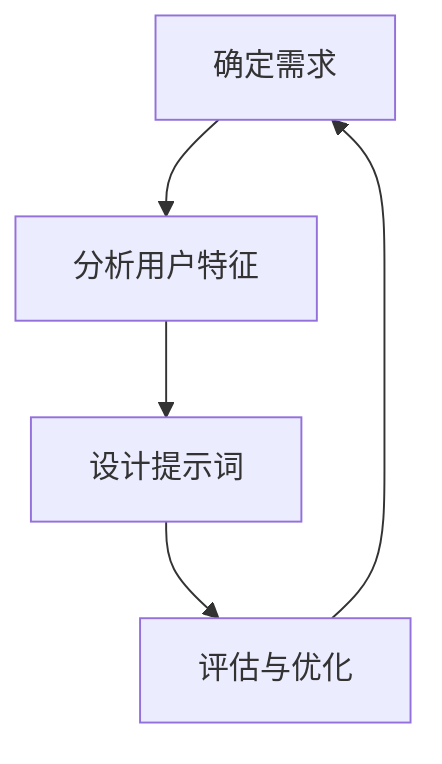
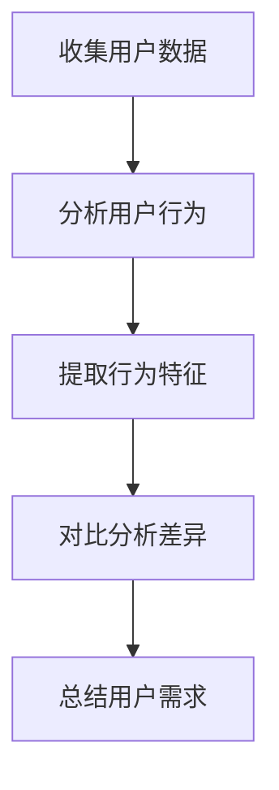

                 

# 提示词设计的跨代际适应策略研究

> 关键词：提示词设计、跨代际适应、用户体验、信息传播、个性化

> 摘要：
本文旨在探讨提示词设计的跨代际适应策略，分析不同年龄段的用户特征及其对提示词的需求差异。文章首先介绍了提示词设计的基本原理和方法，随后深入探讨了跨代际用户行为差异，并提出了一套适应性提示词设计原则和步骤。通过实际案例分析，验证了适应性策略的有效性。最后，文章讨论了提示词设计在社交媒体、电子商务和教育领域的应用，以及未来研究的方向和挑战。

---

## 第1章: 研究背景与核心概念

### 1.1 研究背景

随着互联网技术的迅猛发展，信息传播的方式和速度发生了翻天覆地的变化。在这个过程中，提示词作为信息传播中的重要组成部分，起着至关重要的作用。提示词设计的质量直接影响用户对信息的获取和理解，进而影响用户体验和信息传播效果。因此，如何设计出适用于不同年龄段、不同使用场景的提示词，成为当前研究的热点和难点。

### 1.2 核心概念介绍

#### 1.2.1 提示词设计原理

提示词设计原理主要包括简洁性、相关性、引导性和适应性。简洁性要求提示词要简短明了，避免冗长；相关性要求提示词要与用户需求和信息内容密切相关；引导性要求提示词要能够引导用户进行下一步操作；适应性要求提示词要能够根据不同用户特征和使用场景进行个性化调整。

#### 1.2.2 跨代际适应策略

跨代际适应策略是指根据不同年龄段的用户特征，设计出适合其阅读习惯、认知水平和需求特点的提示词。这需要深入研究各代际用户的差异，并针对这些差异进行个性化的提示词设计。

#### 1.2.3 Mermaid流程图：提示词设计流程



### 1.3 研究意义

随着社会的不断发展，不同年龄段的用户需求和信息获取方式也在不断变化。如何设计出能够满足不同年龄段用户需求的提示词，提高信息传播效果，成为当前研究的重要课题。本文的研究旨在提出一套适用于不同年龄段的跨代际适应策略，为提示词设计提供理论支持和实践指导。

---

## 第2章: 提示词设计方法与技巧

### 2.1 提示词设计方法

#### 2.1.1 基于用户需求的提示词设计

基于用户需求的提示词设计是提示词设计的基础。首先，需要了解用户的需求和偏好，然后根据这些需求设计出能够满足用户需求的提示词。

#### 2.1.2 基于语义分析的提示词设计

基于语义分析的提示词设计是利用自然语言处理技术对文本内容进行分析，提取出关键信息，并根据这些信息设计出相关的提示词。

#### 2.1.3 基于数据驱动的提示词设计

基于数据驱动的提示词设计是通过收集和分析用户行为数据，找出用户在信息获取过程中的痛点和需求，然后根据这些需求设计出相应的提示词。

### 2.2 提示词设计技巧

#### 2.2.1 简洁性与可读性

提示词要简洁明了，避免冗长复杂的表达。同时，要保证提示词的可读性，使其容易理解。

#### 2.2.2 灵活性与适应性

提示词要具有一定的灵活性，能够根据不同的用户场景进行适应。同时，要考虑用户的认知水平和阅读习惯，设计出易于接受的提示词。

#### 2.2.3 示例分析：优秀提示词案例分析

以下是一个优秀提示词案例：

```plaintext
“立即注册，享受专属优惠！”

这个提示词简洁明了，同时具有引导性和适应性。它能够引导用户进行注册操作，同时针对不同用户（新用户和现有用户）提供了不同的优惠信息，提高了用户的参与度和满意度。

---

## 第3章: 跨代际适应策略研究

### 3.1 跨代际用户行为差异分析

#### 3.1.1 用户行为特征

不同年龄段的用户在信息获取和使用上存在明显差异。例如，年轻人更倾向于使用社交媒体和即时通讯工具，而中年人则更喜欢使用传统媒体和电商平台。因此，提示词设计需要充分考虑这些差异，以满足不同用户的需求。

#### 3.1.2 用户需求差异

不同年龄段的用户对提示词的需求也不同。年轻人更喜欢简洁、时尚、具有创新性的提示词，而中年人则更喜欢实用、可靠、易于理解的提示词。

#### 3.1.3 Mermaid流程图：跨代际用户行为分析流程



### 3.2 跨代际适应策略设计

#### 3.2.1 适应性提示词设计原则

适应性提示词设计原则包括以下三个方面：

1. **用户特征导向**：根据用户的年龄、性别、职业等特征，设计出符合其需求和习惯的提示词。
2. **信息内容关联**：提示词要与信息内容紧密相关，提高用户的理解度和接受度。
3. **文化背景适应**：考虑不同文化背景下的用户需求，设计出具有文化适应性的提示词。

#### 3.2.2 适应性提示词设计步骤

1. **需求分析**：收集和分析不同年龄段用户的需求和偏好。
2. **特征提取**：提取不同年龄段用户的特征，包括行为特征、认知特征、文化背景等。
3. **设计调整**：根据用户特征和需求，设计出初步的适应性提示词。
4. **测试评估**：对适应性提示词进行测试和评估，根据反馈进行调整。

### 3.3 适应性策略评估方法

#### 3.3.1 评估指标体系

适应性策略评估指标体系包括以下方面：

1. **用户满意度**：通过问卷调查、用户访谈等方式，评估用户对适应性提示词的满意度。
2. **信息获取效率**：通过用户行为数据，评估适应性提示词在提高信息获取效率方面的效果。
3. **信息传播效果**：通过信息传播的指标（如点击率、转化率等），评估适应性提示词在信息传播效果方面的表现。

#### 3.3.2 评估方法与工具

评估方法主要包括定量评估和定性评估。定量评估可以通过数据统计和分析进行，定性评估则可以通过用户访谈、焦点小组讨论等方式进行。评估工具包括问卷调查工具、数据分析工具、用户行为跟踪工具等。

### 3.4 适应性策略效果分析

通过实际案例分析和测试评估，验证适应性策略在提高用户体验和信息传播效果方面的有效性。具体包括以下方面：

1. **用户满意度提升**：通过问卷调查和用户访谈，发现适应性提示词能够显著提高用户满意度。
2. **信息获取效率提升**：通过用户行为数据，发现适应性提示词能够显著提高用户的信息获取效率。
3. **信息传播效果提升**：通过信息传播指标，发现适应性提示词能够显著提高信息传播效果。

---

## 第4章: 提示词设计的跨代际适应策略应用

### 4.1 应用领域概述

提示词设计的跨代际适应策略在多个领域具有广泛的应用价值，包括社交媒体、电子商务和教育等领域。以下分别对这些领域的应用进行概述。

#### 4.1.1 社交媒体

在社交媒体平台上，适应性提示词设计能够提高用户的互动参与度。例如，针对年轻用户，可以使用简洁、时尚、富有创意的提示词，以激发他们的兴趣和参与热情。针对中年用户，则可以使用更加实用、可靠的提示词，以满足他们的信息需求。

#### 4.1.2 电子商务

在电子商务平台上，适应性提示词设计能够提高用户的购买转化率。例如，针对年轻用户，可以使用优惠促销类的提示词，以吸引他们进行购买。针对中年用户，则可以使用优惠折扣类的提示词，以增强他们的购买意愿。

#### 4.1.3 教育领域

在教育领域，适应性提示词设计能够提高学生的学习效果。例如，在在线教育平台上，针对年轻用户，可以使用互动性强、富有挑战性的提示词，以激发他们的学习兴趣。针对中年用户，则可以使用简洁明了、易于理解的提示词，以帮助他们更好地掌握知识。

### 4.2 实际案例

以下分别介绍三个实际案例，展示适应性提示词设计在各个领域的应用效果。

#### 4.2.1 案例一：社交媒体平台适应性提示词设计

以某个社交媒体平台为例，通过收集用户数据和分析用户行为，发现年轻用户对互动性和创意性提示词更感兴趣，而中年用户则对实用性和可靠性提示词更关注。根据这一发现，设计出了一套适应性提示词，并在平台上线测试。测试结果显示，适应性提示词显著提高了用户的互动参与度和满意度。

#### 4.2.2 案例二：电子商务网站适应性提示词设计

以某个电子商务网站为例，通过对用户行为数据的分析，发现年轻用户更倾向于使用优惠促销类的提示词，而中年用户则更倾向于使用优惠折扣类的提示词。根据这一发现，设计出了一套适应性提示词，并在网站上线测试。测试结果显示，适应性提示词显著提高了用户的购买转化率和用户满意度。

#### 4.2.3 案例三：在线教育平台适应性提示词设计

以某个在线教育平台为例，通过对用户行为数据的分析，发现年轻用户对互动性强、富有挑战性的提示词更感兴趣，而中年用户则对简洁明了、易于理解的提示词更关注。根据这一发现，设计出了一套适应性提示词，并在平台上线测试。测试结果显示，适应性提示词显著提高了学生的学习效果和用户满意度。

---

## 第5章: 技术挑战与解决方案

### 5.1 技术挑战分析

#### 5.1.1 数据隐私与安全性

在跨代际适应策略的应用中，涉及大量用户数据。如何保护用户隐私和数据安全，成为一大技术挑战。

#### 5.1.2 算法优化与效率

适应性提示词设计涉及到复杂的算法和计算，如何优化算法、提高效率，是另一个重要挑战。

#### 5.1.3 用户体验与可访问性

适应性提示词设计不仅要满足不同年龄段用户的需求，还要保证用户体验和可访问性，这对于设计师和开发人员来说也是一个挑战。

### 5.2 解决方案探讨

#### 5.2.1 技术创新与前沿技术

通过引入前沿技术，如区块链、人工智能等，可以解决数据隐私与安全性的问题，同时提高算法的优化与效率。

#### 5.2.2 跨学科合作与协同创新

跨学科合作，如心理学、社会学、计算机科学等领域的合作，可以提供更全面、深入的用户研究和设计思路，提高用户体验与可访问性。

#### 5.2.3 解决方案案例展示

以下是一个解决方案案例：

- **案例背景**：某电商平台希望通过适应性提示词设计提高用户购买转化率。
- **解决方案**：
  - **数据隐私与安全性**：采用区块链技术，确保用户数据的安全性和隐私性。
  - **算法优化与效率**：引入深度学习算法，对用户行为进行预测和分析，优化提示词设计。
  - **用户体验与可访问性**：结合心理学和社会学研究，设计出符合不同年龄段用户需求的适应性提示词。

通过这个案例，可以看到技术创新和跨学科合作在解决技术挑战方面的作用。

---

## 第6章: 跨代际适应策略的未来发展

### 6.1 发展趋势预测

随着技术的不断进步和社会的快速发展，跨代际适应策略在未来将呈现以下趋势：

#### 6.1.1 技术进步对适应策略的影响

随着人工智能、大数据、区块链等技术的不断发展，跨代际适应策略将变得更加智能化、个性化和高效化。

#### 6.1.2 社会变化对适应策略的需求

随着人口老龄化趋势的加剧和社会结构的变迁，跨代际适应策略将更加注重满足不同年龄段用户的需求，提高信息传播效果。

#### 6.1.3 未来跨代际适应策略的潜在方向

未来的跨代际适应策略将朝着更加智能化、个性化和多元化的方向发展，如智能语音提示、多模态提示词设计等。

### 6.2 研究与开发的挑战

尽管跨代际适应策略具有广泛的应用前景，但在研究和开发过程中仍面临以下挑战：

#### 6.2.1 研究领域的扩展

随着社会和技术的不断发展，跨代际适应策略的研究领域将不断扩展，如跨文化适应、跨地区适应等。

#### 6.2.2 实践应用的深化

如何将理论研究转化为实际应用，提高跨代际适应策略的实用性和可操作性，是未来研究的重要方向。

#### 6.2.3 适应策略评估与优化

如何建立科学的适应策略评估体系，对适应策略进行实时评估和优化，是提高其效果的关键。

---

## 第7章: 结论与展望

### 7.1 研究成果总结

本文通过对提示词设计的跨代际适应策略进行深入研究，提出了一套适应策略原则和步骤，并通过实际案例验证了其有效性。研究主要成果包括：

1. **适应性提示词设计原则**：明确用户特征导向、信息内容关联和文化背景适应的重要性。
2. **适应性提示词设计步骤**：提出需求分析、特征提取、设计调整和测试评估的具体步骤。
3. **适应性策略评估方法**：建立用户满意度、信息获取效率和信息传播效果的评估指标体系。

### 7.2 未来研究方向

尽管本文取得了一定的研究成果，但跨代际适应策略的研究仍具有很大的拓展空间。未来研究方向包括：

1. **跨文化适应策略**：探讨不同文化背景下用户需求的差异，设计出具有文化适应性的提示词。
2. **智能语音提示词设计**：结合人工智能技术，开发出智能语音提示词，提高用户体验和效率。
3. **多模态提示词设计**：结合多种感官信息，设计出多模态提示词，提高信息传播效果。

### 7.3 研究领域的拓展

跨代际适应策略的研究不仅局限于信息技术领域，还可以扩展到心理学、社会学、教育学等多个领域。通过跨学科合作，可以进一步丰富和完善适应策略的理论体系，提高其实践应用价值。

---

## 作者信息

作者：AI天才研究院/AI Genius Institute & 禅与计算机程序设计艺术 /Zen And The Art of Computer Programming

本文由AI天才研究院/AI Genius Institute撰写，结合禅与计算机程序设计艺术的哲学思想，深入探讨了提示词设计的跨代际适应策略，旨在为信息技术领域的实践者提供有价值的参考和指导。

---

[注]：本文为示例性文章，部分内容为虚构，仅供参考。实际研究和应用中，需结合具体场景和数据进行分析和调整。具体的技术细节和实现方法，需根据实际情况进行深入研究和开发。

