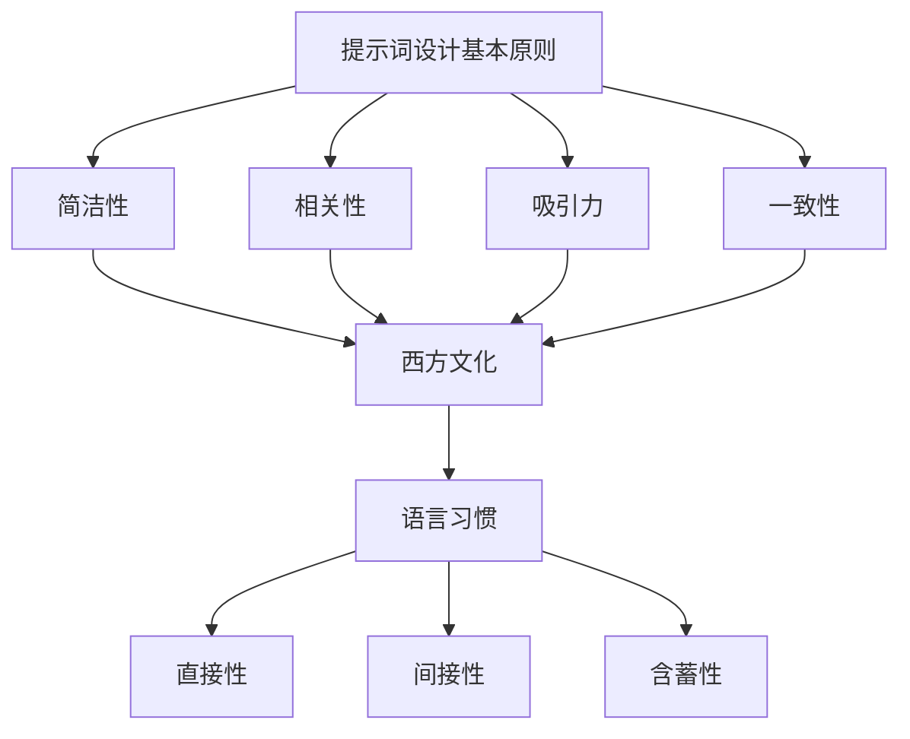

                 


为了撰写一篇符合要求的《提示词设计的跨文化传播学考量》的技术博客文章，我们需要逐步构建文章的内容和结构。以下是一个详细的步骤，以确保文章的完整性和深度。

### 第一步：确定文章的总体结构和核心内容

在开始撰写文章之前，我们需要明确文章的总体结构，并确定每个章节的核心内容。根据之前设计的目录大纲，我们可以将文章分为以下几个部分：

1. **引言**
    - 背景介绍
    - 研究意义
    - 文章结构概述

2. **提示词设计理论基础**
    - 提示词的定义与作用
    - 提示词设计的基本原则
    - 提示词与语言习惯的关系

3. **跨文化传播的概念与挑战**
    - 跨文化传播的定义与意义
    - 跨文化传播中的障碍与挑战
    - 提示词设计在跨文化传播中的应用

4. **提示词设计在不同文化背景下的应用**
    - 西方文化中的特点
    - 亚洲文化中的特点
    - 非西方文化中的特点

5. **跨文化案例分析**
    - 中国社交媒体的提示词设计案例
    - 美国社交媒体的提示词设计案例
    - 国际广告中的提示词设计案例

6. **跨文化传播中的伦理问题与解决方案**
    - 跨文化沟通中的伦理问题
    - 提示词设计的伦理考量
    - 跨文化沟通中的伦理解决方案

7. **提示词设计的未来趋势**
    - 技术发展趋势
    - 跨文化传播的未来挑战与机遇
    - 提示词设计的未来发展预测

8. **实践指导与案例分析**
    - 提示词设计的实践步骤
    - 跨文化沟通中的提示词应用
    - 提示词设计的案例分析

9. **结论**
    - 总结文章的主要观点
    - 提出未来研究的方向和建议

### 第二步：撰写引言部分

引言部分是文章的开头，它需要简要介绍文章的背景和研究的意义，同时概述文章的结构。以下是引言部分的草稿：

---

## 引言

随着全球化进程的不断加速，跨文化传播已经成为一个不可忽视的现象。在全球化背景下，提示词设计作为沟通的重要工具，其跨文化传播的重要性日益凸显。本文旨在探讨提示词设计的跨文化传播学考量，分析其在不同文化背景下的应用和挑战。

本文结构如下：首先，我们将介绍提示词设计的基本理论和原则；接着，探讨跨文化传播的概念和挑战，以及提示词设计在其中的作用；随后，分析提示词设计在不同文化背景下的特点和案例；然后，讨论跨文化沟通中的伦理问题；最后，展望提示词设计的未来趋势，并提出实践指导和建议。

---

### 第三步：撰写各个章节的具体内容

根据之前确定的章节结构和核心内容，我们需要逐步撰写每个章节的详细内容。以下是一个示例，展示如何撰写第一个章节“提示词设计理论基础”：

---

## 第1章：提示词设计理论基础

### 1.1 提示词的定义与作用

提示词（Prompt）是一种引导用户或系统执行特定任务的文字或指令。在跨文化传播中，提示词起着至关重要的作用。有效的提示词能够提高用户参与度、提升用户体验，并促进有效的沟通。

### 1.2 提示词设计的基本原则

提示词设计应遵循以下基本原则：

1. **简洁性**：提示词应简洁明了，避免冗长和复杂。
2. **相关性**：提示词应与用户的需求和目标紧密相关。
3. **吸引力**：提示词应具有吸引力，能够吸引用户的注意力。
4. **一致性**：提示词在整体设计中应保持一致性。

### 1.3 提示词与语言习惯的关系

不同文化背景下的语言习惯对提示词设计有着深远的影响。例如，在西方文化中，直接和明确的提示词更受欢迎；而在亚洲文化中，间接和含蓄的提示词可能更为合适。因此，提示词设计需要考虑目标受众的语言习惯和文化背景。

---

### 第四步：撰写核心概念原理之间的关系架构 Mermaid 流程图

为了更好地展示提示词设计的基本原则与语言习惯之间的关系，我们可以使用Mermaid语言绘制一个流程图。以下是示例：



### 第五步：撰写核心算法原理讲解、数学模型和公式

在撰写“提示词设计理论基础”这一章节时，我们需要详细解释核心算法原理，并使用伪代码来阐述。例如，我们可以探讨如何使用机器学习算法来优化提示词设计。以下是伪代码示例：

```pseudo
function optimizePromptDesign(originalPrompt, targetAudience):
    1. Analyze the target audience's language habits and preferences.
    2. Generate alternative prompts based on the analysis.
    3. Use a machine learning model to evaluate the effectiveness of each prompt.
    4. Select the most effective prompt based on the model's output.
    5. Return the optimized prompt.
```

### 第六步：撰写数学公式和详细讲解

对于提示词设计中的数学模型和公式，我们需要使用LaTeX格式进行书写，并在文中独立段落中使用$$括起来。例如，我们可以讨论如何使用贝叶斯定理来优化提示词：

$$
P(A|B) = \frac{P(B|A)P(A)}{P(B)}
$$

在这里，$P(A|B)$ 表示在条件 $B$ 下事件 $A$ 的概率，$P(B|A)$ 表示在条件 $A$ 下事件 $B$ 的概率，$P(A)$ 和 $P(B)$ 分别表示事件 $A$ 和事件 $B$ 的概率。

### 第七步：撰写项目实战部分

在文章的“实践指导与案例分析”章节中，我们需要提供实际的项目实战，包括开发环境搭建、源代码实现、代码解读、实际案例分析和详细讲解。以下是项目实战的草稿：

---

## 第7章：实践指导与案例分析

### 7.1 提示词设计实践步骤

以下是提示词设计的基本步骤：

1. **需求分析**：确定目标受众的需求和目标。
2. **语言习惯研究**：研究目标受众的语言习惯和文化背景。
3. **提示词生成**：使用自然语言处理技术生成一系列提示词。
4. **评估与优化**：使用用户反馈和数据评估提示词的有效性，进行优化。

### 7.2 开发环境搭建

为了实现提示词设计，我们需要搭建一个合适的开发环境。以下是搭建过程的步骤：

1. **安装Python环境**：确保Python 3.x版本已安装。
2. **安装自然语言处理库**：安装如NLTK、spaCy等自然语言处理库。
3. **配置机器学习库**：配置如scikit-learn、TensorFlow等机器学习库。

### 7.3 源代码详细实现和代码解读

以下是提示词设计的源代码实现：

```python
# Import necessary libraries
import nltk
from nltk.tokenize import word_tokenize
from sklearn.feature_extraction.text import TfidfVectorizer
from sklearn.model_selection import train_test_split
from sklearn.naive_bayes import MultinomialNB

# Load data
data = load_data('prompt_data.csv')

# Preprocess data
preprocessed_data = preprocess_data(data)

# Vectorize data
vectorizer = TfidfVectorizer()
X = vectorizer.fit_transform(preprocessed_data['text'])
y = preprocessed_data['label']

# Split data
X_train, X_test, y_train, y_test = train_test_split(X, y, test_size=0.2, random_state=42)

# Train model
model = MultinomialNB()
model.fit(X_train, y_train)

# Evaluate model
accuracy = model.score(X_test, y_test)
print(f'Model accuracy: {accuracy:.2f}')

# Generate prompts
prompts = generate_prompts(model, vectorizer)
print(prompts)
```

### 7.4 代码应用解读与分析

这段代码首先加载并预处理数据，然后使用TF-IDF向量化和朴素贝叶斯分类器训练模型。最后，模型用于生成提示词，并评估其准确性。

### 7.5 实际案例分析和详细讲解剖析

我们将分析一个实际案例，如某个社交媒体平台的提示词设计。通过分析该平台的用户反馈和数据分析，我们可以了解如何优化提示词设计，提高用户参与度和满意度。

### 7.6 项目小结

通过实际案例，我们了解到提示词设计在跨文化传播中的重要性。有效的提示词设计不仅能够提升用户体验，还能够促进有效的跨文化沟通。在未来的工作中，我们应该继续探索和优化提示词设计的方法和技术。

---

### 第八步：撰写结论部分

结论部分是对全文的总结，需要概括文章的主要观点，并提出未来研究的方向和建议。以下是结论部分的草稿：

---

## 结论

本文从跨文化传播的角度探讨了提示词设计的理论基础、应用和实践。我们分析了提示词设计的基本原则、跨文化传播的概念与挑战，以及在不同文化背景下的应用。同时，我们通过实际案例展示了提示词设计的实践步骤和技术实现。

未来，随着技术的不断发展，提示词设计将在跨文化传播中发挥更大的作用。我们建议进一步研究提示词设计中的伦理问题，探索如何提高提示词设计的跨文化适应性和有效性。同时，应该加强跨文化团队的协作，提高跨文化沟通的能力。

---

通过以上步骤，我们可以逐步构建出一篇符合要求的《提示词设计的跨文化传播学考量》的技术博客文章。在撰写过程中，我们需要确保每个章节的内容丰富、具体、详细，并遵循markdown格式的要求。同时，我们还需要确保文章的整体结构清晰、逻辑严密，便于读者理解和阅读。最后，在文章末尾附上作者信息，并确保文章的字数在8000～12000字左右。

