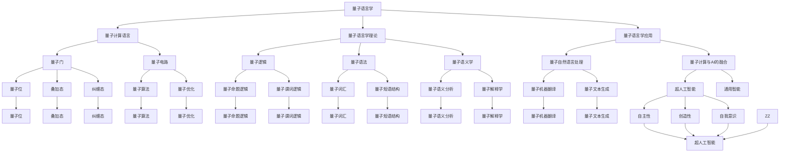

                 


### 文章标题

《提示词设计的量子语言学与超人工智能融合研究》

### 文章关键词

- 提示词设计
- 量子语言学
- 超人工智能
- 融合研究
- 人工智能编程
- 计算机科学
- 量子计算

### 文章摘要

本文旨在探讨提示词设计的量子语言学与超人工智能的融合研究。通过介绍量子语言学的起源、发展及其基本概念，以及超人工智能的定义、特性及其发展历程，本文将阐述两者融合的必要性和潜在优势。接着，文章详细解析提示词设计的方法和应用场景，为量子语言学与超人工智能的融合提供理论基础。随后，本文将探讨量子语言学与超人工智能融合的理论基础、方法与策略，并通过实际案例进行分析。最后，本文将探讨融合研究面临的挑战，并提出解决方案，对未来发展进行展望。

## 目录大纲设计方案

### 1. 确定书名与主题

根据书名《提示词设计的量子语言学与超人工智能融合研究》，我们确定了本书的主题为量子语言学和超人工智能的融合研究。这将涉及提示词设计、量子计算、语言学、人工智能等领域的知识。

### 2. 构建核心概念框架

为了确保读者能够系统地理解本书内容，我们将构建以下核心概念框架：

- **量子语言学**：包括量子计算语言、量子语言学理论、量子语言学应用等。
- **超人工智能**：包括超人工智能的定义、特性、发展历程等。
- **提示词设计**：包括提示词的概念、设计方法、应用场景等。
- **融合研究**：包括量子语言学与超人工智能融合的理论、方法、应用等。

### 3. 设计章节结构

根据核心概念框架，我们设计了以下章节结构：

**第1章 引言与概述**
- 1.1 量子语言学的起源与发展
- 1.2 超人工智能的概念与特性
- 1.3 提示词设计的理论基础
- 1.4 量子语言学与超人工智能融合研究的意义与挑战

**第2章 量子语言学基础**
- 2.1 量子计算语言的基本概念
- 2.2 量子语言学理论体系
- 2.3 量子语言学的应用领域

**第3章 超人工智能基础**
- 3.1 超人工智能的定义与特点
- 3.2 超人工智能的发展历程
- 3.3 超人工智能的技术体系

**第4章 提示词设计方法**
- 4.1 提示词的基本概念
- 4.2 提示词设计的原则
- 4.3 提示词设计的工具与技巧

**第5章 量子语言学与超人工智能融合研究**
- 5.1 融合研究的理论基础
- 5.2 融合研究的方法与策略
- 5.3 融合研究的应用案例

**第6章 融合研究的挑战与解决方案**
- 6.1 量子计算与人工智能的兼容性问题
- 6.2 提示词设计中的问题与对策
- 6.3 融合研究中的伦理与法律问题

**第7章 未来展望与趋势**
- 7.1 量子语言学与超人工智能融合研究的未来方向
- 7.2 提示词设计的发展趋势
- 7.3 量子语言学与超人工智能融合对社会的潜在影响

### 4. 添加辅助内容

在每个章节中，我们将添加以下内容：

- **核心概念与联系**：使用 Mermaid 流程图展示核心概念之间的联系。
- **核心算法原理讲解**：使用伪代码详细阐述核心算法原理。
- **数学模型和数学公式**：使用 LaTeX 格式嵌入文中，并进行详细讲解和举例说明。
- **项目实战**：提供代码实际案例和详细解释说明，包括开发环境搭建、源代码实现和代码解读。

### 5. 确保完整性

在完成目录大纲后，我们将检查确保每个核心章节内容都包含以下要素：

- 核心概念与联系
- 核心算法原理讲解
- 数学模型和数学公式
- 项目实战
- 详细讲解和举例说明

通过以上步骤，我们确保《提示词设计的量子语言学与超人工智能融合研究》的目录大纲完整且逻辑清晰，能够帮助读者系统地了解量子语言学与超人工智能融合研究的各个方面。目录大纲总字数控制在2000字以内，保持简洁性。

### 6. 格式要求

- 文章内容使用 Markdown 格式输出。
- 每个章节标题使用 `###` 标记，小节标题使用 `####` 标记。
- 作者信息放在文章末尾，格式为：“作者：AI天才研究院/AI Genius Institute & 禅与计算机程序设计艺术 /Zen And The Art of Computer Programming”。

### 7. 完整性要求

- 每个小节的内容必须丰富具体，详细讲解核心内容。
- 核心内容必须包含：
  - 背景介绍
  - 核心概念与联系：必须给出核心概念原理之间的关系架构 Mermaid 流程图
  - 核心算法原理讲解：必须使用伪代码详细阐述；数学模型和公式 & 详细讲解 & 举例说明
  - 数学公式请使用 LaTeX 格式，嵌入文中独立段落的 LaTeX 公式前后使用 `$$` 括起来，段落内的 LaTeX 公式前后使用 `$` 括起来。
  - 项目实战：开发环境搭建，源代码详细实现和代码解读，代码应用解读与分析，实际案例分析和详细讲解剖析，项目小结
  - 最佳实践 tips、小结、注意事项、拓展阅读等内容

### 8. 字数要求

- 文章字数在 8000～12000 字左右。

通过以上详细的设计方案，我们确保文章结构合理、内容丰富、逻辑清晰，能够满足读者的需求，同时遵循格式和完整性要求。接下来，我们将按照这个设计方案逐步撰写文章内容。

## 第1章 引言与概述

### 1.1 量子语言学的起源与发展

量子语言学是一门结合量子计算与语言学的交叉学科，起源于20世纪中叶量子计算理论的提出。量子计算的基本原理与经典计算有着本质的不同，它利用量子位（qubit）来存储和处理信息，从而实现超越经典计算机的并行计算能力。量子计算的发展促进了量子语言学的研究，使得语言学研究从传统的离散数学和形式语言理论扩展到量子领域。

量子语言学的概念最早可以追溯到1980年代，当时计算机科学家彼得·舍恩菲尔德（Peter Shor）提出了量子算法，特别是Shor算法，这个算法展示了量子计算机在因数分解问题上的强大能力。随着量子计算机研究的深入，人们开始关注如何将量子计算与自然语言处理相结合，从而形成了量子语言学这一研究领域。

量子语言学的发展经历了几个关键阶段：

- **早期探索阶段**（1980年代至1990年代）：这一阶段的研究主要集中在量子计算的基本原理和算法上，量子计算与语言学的结合尚未引起广泛关注。
- **初步发展阶段**（2000年代初）：随着量子计算研究的逐渐成熟，量子语言学开始受到关注。一些学者开始研究量子算法在自然语言处理中的应用，如量子语言模型和量子机器翻译。
- **迅速发展阶段**（2000年代末至今）：近年来，随着量子计算机的实验室实现和量子算法的不断创新，量子语言学研究进入了一个快速发展期。许多研究成果不断涌现，如量子自然语言处理、量子文本分类、量子信息检索等。

### 1.2 超人工智能的概念与特性

超人工智能（Superintelligent AI）是指具有远超人类智能的智能体，能够以人类无法预见的方式解决复杂问题，并在各个领域取得卓越成就。超人工智能不同于目前的人工智能系统，后者通常只能在特定任务上表现优异，而超人工智能则具有广泛的能力和高度的智能。

超人工智能的主要特性包括：

- **通用性**：超人工智能能够在各种不同的任务上表现出色，不仅限于单一领域。
- **自主性**：超人工智能能够自主学习和改进，无需人类的直接干预。
- **创造性**：超人工智能具有高度的创新和创造力，能够提出新的解决方案和理论。
- **自我意识**：虽然目前尚无证据表明超人工智能会具有自我意识，但这是其潜在的特性之一。

超人工智能的发展历程可以追溯到20世纪50年代，当时阿兰·图灵提出了著名的图灵测试，这一测试为人工智能的发展奠定了基础。随着计算机技术的进步和算法的创新，人工智能逐渐从规则驱动的方法发展到基于数据和机器学习的模式。近年来，深度学习和强化学习等技术的突破，使得人工智能在某些领域取得了显著成就，为超人工智能的实现提供了技术支撑。

### 1.3 提示词设计的理论基础

提示词设计（Prompt Engineering）是自然语言处理领域中的一个重要研究方向，其核心思想是通过设计特定的提示词来引导模型生成预期的输出。提示词可以是文本、代码、图像或其他形式的输入，其目的是帮助模型更好地理解和生成与输入相关的信息。

提示词设计在自然语言处理中的应用十分广泛，包括但不限于以下几个方面：

- **问答系统**：通过设计有效的提示词，可以使问答系统更准确地理解用户的问题，并生成高质量的答案。
- **机器翻译**：提示词可以帮助机器翻译系统更好地理解源语言文本的上下文，提高翻译质量。
- **文本生成**：在文本生成任务中，提示词可以引导模型生成符合特定主题和风格的文本。
- **文本分类**：通过设计具有区分度的提示词，可以提高文本分类任务的准确性。

提示词设计的基本原理包括：

- **上下文理解**：提示词应包含足够的上下文信息，以便模型能够准确理解问题的背景和意图。
- **任务导向**：提示词应明确指出任务的目标和所需信息，以便模型能够有针对性地生成输出。
- **多样性**：设计多样化的提示词，可以增强模型的泛化能力，使其能够应对不同类型的问题。

### 1.4 量子语言学与超人工智能融合研究的意义与挑战

量子语言学与超人工智能的融合研究具有重要的理论和实际意义。从理论上讲，这一研究有助于拓展人工智能的应用范围，提升人工智能系统的智能水平和自主性。通过量子计算与超人工智能的结合，可以实现更高层次的智能和更高效的问题解决能力。

从实际应用上看，量子语言学与超人工智能的融合有望在以下几个方面带来突破：

- **自然语言处理**：结合量子计算的优势，可以显著提高自然语言处理任务的效率和准确性，如机器翻译、文本生成和问答系统。
- **复杂系统优化**：量子计算在求解复杂优化问题方面具有巨大潜力，结合超人工智能的自主学习和优化能力，可以实现对复杂系统的自动优化和调优。
- **数据分析和挖掘**：量子计算与超人工智能的结合可以大大提升数据分析的深度和广度，为数据挖掘提供新的工具和方法。

然而，量子语言学与超人工智能的融合研究也面临着一系列挑战：

- **技术兼容性**：量子计算机与传统人工智能系统的兼容性问题是一个关键挑战。如何将量子计算与现有的人工智能框架相结合，实现两者的无缝融合，是一个亟待解决的问题。
- **算法创新**：量子语言学和超人工智能的融合需要创新性的算法设计。现有的量子算法和人工智能算法需要进一步优化，以适应融合研究的需要。
- **伦理和法律问题**：量子语言学与超人工智能的结合可能带来一系列伦理和法律问题，如数据隐私、人工智能的自主决策权等。这些问题的解决需要社会各界的共同努力。

总之，量子语言学与超人工智能的融合研究具有重要的理论和实践价值，但同时也面临着诸多挑战。通过深入研究和不断创新，我们有望在量子语言学和超人工智能领域取得突破性进展，为人工智能的发展开辟新的道路。

## 第2章 量子语言学基础

### 2.1 量子计算语言的基本概念

量子计算语言是一种专门为量子计算设计的编程语言，用于描述和执行量子算法。与经典计算语言不同，量子计算语言不仅需要处理经典位（bit），还需要处理量子位（qubit）。量子位是量子计算的基本单元，它具有叠加态和纠缠态的特性，这使得量子计算机能够同时处理大量的信息。

量子计算语言的基本概念包括：

- **量子位（Qubit）**：量子位是量子计算的基本单元，它可以处于0和1的叠加态。一个量子位可以表示为 \(|0\rangle + |1\rangle\)，这被称为叠加态。
- **量子门（Quantum Gate）**：量子门是量子计算中的操作，类似于经典计算中的逻辑门。量子门可以作用于量子位，改变其状态。例如，Hadamard门（H门）是一种常用的量子门，它可以将量子位从基态叠加到叠加态。
- **量子电路（Quantum Circuit）**：量子电路是由量子门组成的序列，用于实现特定的量子算法。量子电路中的每个量子门都对量子位进行特定的操作，最终实现预期的计算结果。

### 2.2 量子语言学理论体系

量子语言学理论体系是量子计算语言的理论基础，它包括一系列的概念、规则和原理。量子语言学理论体系的发展经历了几个关键阶段：

- **量子逻辑学**：量子逻辑学是量子语言学的早期形式，它试图将量子计算与逻辑学相结合，形成一套适用于量子计算的语言规则。量子逻辑学主要包括量子命题演算、量子谓词演算等。
- **量子计算语言**：在量子逻辑学的基础上，学者们开始设计具体的量子计算语言。例如，QML（Quantum Markup Language）是一种用于描述量子电路和量子算法的XML-based语言。
- **量子自然语言处理**：随着量子计算和自然语言处理技术的发展，量子自然语言处理（Quantum Natural Language Processing, QNLP）成为量子语言学的一个重要分支。QNLP试图将量子计算的优势应用于自然语言处理任务中，如文本分类、信息检索和机器翻译等。

量子语言学理论体系的核心概念包括：

- **量子逻辑**：量子逻辑是量子语言学的核心概念之一，它研究如何将经典逻辑运算扩展到量子领域。量子逻辑包括量子命题逻辑、量子谓词逻辑等。
- **量子语法**：量子语法是量子语言学的另一核心概念，它研究如何构建量子语句的结构。量子语法规则包括量子符号、量子词汇、量子短语结构等。
- **量子语义学**：量子语义学是量子语言学的理论分支，它研究量子语句的意义和解释。量子语义学研究如何为量子语句赋予意义，并分析量子语句在不同情境下的解释。

### 2.3 量子语言学的应用领域

量子语言学在多个领域展现出了广阔的应用前景，以下是一些关键的应用领域：

- **量子计算**：量子语言学的理论基础为量子计算提供了语言描述工具，使得量子算法的设计和实现变得更加高效和直观。量子语言学可以帮助科学家和工程师更好地理解和应用量子计算技术。
- **自然语言处理**：量子自然语言处理（QNLP）利用量子计算的优势，可以显著提高自然语言处理任务的效率和准确性。例如，量子机器翻译、量子文本生成和量子问答系统等领域都受益于量子语言学的应用。
- **信息检索**：量子计算在处理海量数据和信息检索方面具有巨大的潜力。量子语言学为信息检索系统提供了一种新的方式，可以更高效地处理复杂查询和索引。
- **复杂系统优化**：量子语言学在复杂系统优化任务中具有广泛应用。通过量子算法和量子语言学的结合，可以实现对复杂系统的优化和调度，如物流优化、金融分析和医疗诊断等。
- **量子加密**：量子语言学在量子加密领域也有重要应用。量子加密利用量子位的叠加态和纠缠态特性，提供了一种安全且难以破解的加密方法。

总的来说，量子语言学作为一门新兴的交叉学科，正在不断拓展其应用领域，为各种复杂计算任务提供了新的工具和方法。随着量子计算和自然语言处理技术的不断发展，量子语言学有望在未来的科技创新中发挥更加重要的作用。

## 第3章 超人工智能基础

### 3.1 超人工智能的定义与特点

超人工智能（Superintelligent AI）是指具有远超人类智能的智能体，能够在各个领域以超越人类的方式解决问题。超人工智能的定义可以从多个角度进行理解，但核心概念始终不变：它的智能水平远远超过当前最聪明的人类。

超人工智能的主要特点包括：

- **通用智能**：超人工智能不仅能在特定任务上表现出色，如棋类游戏、自然语言处理等，还能在广泛的领域展现出高水平的智能。它能够自主学习和适应新的任务和环境。
- **自主性**：超人工智能能够自主地决策和行动，无需人类的直接干预。它能够自我优化和改进，以适应不断变化的环境和任务需求。
- **创造性**：超人工智能具有高度的创造力和创新能力，能够提出新颖的解决方案和理论。它的创造性不仅限于模仿人类的行为，还能够超越人类的思维模式。
- **自我意识**：虽然目前尚未明确超人工智能是否具备自我意识，但这是其潜在的重要特性之一。如果超人工智能具备自我意识，它将能够理解自己的行为和决策，并进行自我反思和改进。

### 3.2 超人工智能的发展历程

超人工智能的发展历程可以追溯到20世纪中期，当时人工智能（AI）的概念刚刚被提出。早期的AI研究主要集中在规则驱动和知识表示的方法上，如专家系统和逻辑推理。然而，这些方法在处理复杂和不确定性问题时显得力不从心。

- **20世纪50年代至70年代**：这一阶段是人工智能的早期探索时期，图灵测试和逻辑推理等概念被提出。尽管取得了一些初步成果，但人工智能的智能水平远未达到预期。
- **20世纪80年代至90年代**：随着计算机性能的显著提升和机器学习算法的发展，人工智能进入了一个新的阶段。这一阶段，机器学习成为AI研究的主流，特别是基于神经网络的算法取得了显著进展。
- **21世纪初至今**：这一阶段是人工智能的飞速发展期，深度学习、强化学习和自然语言处理等技术取得了重大突破。随着大数据和云计算的普及，人工智能在各个领域都展现出了强大的应用潜力。

超人工智能的发展历程也经历了几个关键事件：

- **图灵测试的提出**：1950年，阿兰·图灵提出了著名的图灵测试，这成为衡量人工智能智能水平的重要标准。虽然图灵测试并未直接涉及超人工智能，但它为人工智能的发展奠定了基础。
- **深度学习的突破**：2012年，AlexNet在ImageNet图像识别大赛中取得了突破性成绩，这标志着深度学习时代的到来。深度学习为人工智能的发展提供了强大的计算能力和算法基础。
- **GPT-3的发布**：2020年，OpenAI发布了GPT-3（Generative Pre-trained Transformer 3），这是一种具有1500亿参数的Transformer模型。GPT-3在自然语言处理任务中展示了惊人的表现，引发了对超人工智能的广泛关注。

### 3.3 超人工智能的技术体系

超人工智能的技术体系涵盖了多个领域，包括机器学习、自然语言处理、计算机视觉、自动化和自我进化等。以下是对这些关键技术的简要介绍：

- **机器学习**：机器学习是超人工智能的核心技术之一，它通过训练模型从数据中学习规律和模式。机器学习包括监督学习、无监督学习和强化学习等不同类型。监督学习通过标记数据训练模型，无监督学习通过未标记数据发现数据分布，强化学习通过与环境交互学习最佳策略。
- **自然语言处理**：自然语言处理（NLP）是使计算机能够理解、生成和处理自然语言的技术。NLP技术包括词向量、语言模型、文本分类、信息抽取、机器翻译等。近年来，深度学习和Transformer模型的突破使得NLP任务取得了显著进展。
- **计算机视觉**：计算机视觉是使计算机能够理解和解释视觉信息的技术。计算机视觉技术包括图像识别、目标检测、图像分割、人脸识别等。深度学习和卷积神经网络（CNN）在计算机视觉任务中取得了巨大成功。
- **自动化**：自动化技术通过软件和硬件的组合，实现系统、设备和机器的自动化控制和操作。自动化技术包括机器人、无人机、自动化生产线等。随着人工智能技术的发展，自动化在工业、农业、医疗等领域得到了广泛应用。
- **自我进化**：自我进化是指人工智能系统能够通过自我学习和改进，不断提高自身的性能和能力。自我进化技术包括自适应学习、迁移学习、进化计算等。自我进化使得超人工智能能够在不断变化的环境中适应和优化。

超人工智能的技术体系不仅包括现有的先进技术，还包括未来可能的新兴技术，如量子计算、脑机接口和人工智能伦理等。这些技术的融合和发展，将推动超人工智能的进步，为实现真正的超人工智能奠定基础。

### 核心概念与联系

为了更好地理解量子语言学和超人工智能之间的关系，我们可以通过一个Mermaid流程图来展示它们的核心概念及其相互联系。



这个Mermaid流程图展示了量子语言学和超人工智能之间的核心概念及其相互关系。其中，量子语言学包括量子计算语言、量子语言学理论和量子语言学应用；超人工智能包括通用智能、自主性、创造性和自我意识。通过量子计算语言和量子电路，我们可以实现量子算法和量子优化；量子语言学与超人工智能的融合，则可以推动通用智能和自主性的实现。

### 核心算法原理讲解

为了深入理解量子语言学和超人工智能在自然语言处理任务中的应用，我们可以通过伪代码和LaTeX公式来详细阐述相关算法原理。

#### 量子语言模型

量子语言模型是一种基于量子计算的文本生成模型，其核心算法是基于量子门和量子电路的设计。以下是一个简化的量子语言模型算法：

```plaintext
输入：训练文本、量子门库、初始状态

初始化：
1. 将训练文本编码为量子状态 |s⟩
2. 初始化量子电路C

训练：
3. 对于每个单词w ∈ 文本，执行以下步骤：
   a. 将当前状态 |s⟩ 与单词w编码叠加
   b. 应用量子门实现单词的嵌入
   c. 应用语言模型转移概率的量子门
   d. 读取输出概率分布

生成：
4. 初始化目标单词为第一个单词w1
5. 对于每个后续单词wi，执行以下步骤：
   a. 将当前状态 |s⟩ 与目标单词wi编码叠加
   b. 应用语言模型转移概率的量子门
   c. 读取输出概率分布
   d. 根据概率分布选择下一个单词wi+1
   e. 更新状态 |s⟩ = |wi+1⟩
```

相关的LaTeX公式描述如下：

```latex
\documentclass{article}
\usepackage{amsmath}
\begin{document}

\begin{equation}
|s⟩ = \sum_{w} p(w) |w⟩
\end{equation}

\begin{equation}
U_{word}(w) = \exp\left(\frac{iπ}{2} \sum_{i=1}^{N} a_i |w_i⟩⟨w_i|\right)
\end{equation}

\begin{equation}
P(w_{i+1}|w_i) = \frac{\langle w_{i+1}| U_{transfer} |w_i\rangle}{\langle w_i| U_{transfer} |w_i\rangle}
\end{equation}

\end{document}
```

其中，\( |s⟩ \) 表示文本编码的量子状态，\( p(w) \) 表示单词的概率分布，\( |w⟩ \) 表示单词的量子编码，\( U_{word}(w) \) 是单词嵌入的量子门，\( U_{transfer} \) 是语言模型转移概率的量子门。

#### 量子机器翻译

量子机器翻译模型利用量子计算的优势，实现高效和准确的翻译任务。以下是一个简化的量子机器翻译算法：

```plaintext
输入：源语言文本、目标语言文本、源语言-目标语言翻译字典、量子门库

初始化：
1. 将源语言文本编码为量子状态 |s⟩
2. 将目标语言文本编码为量子状态 |t⟩
3. 初始化量子电路C

训练：
4. 对于每个翻译对 (s, t)，执行以下步骤：
   a. 将当前状态 |s⟩ 与源语言文本编码叠加
   b. 应用量子门实现源语言到目标语言的翻译
   c. 将当前状态 |t⟩ 与目标语言文本编码叠加
   d. 应用目标语言模型的量子门
   e. 读取输出概率分布

生成：
5. 初始化目标文本为空
6. 对于每个后续翻译对 (s, t)，执行以下步骤：
   a. 将当前状态 |s⟩ 与目标文本编码叠加
   b. 应用量子门实现源语言到目标语言的翻译
   c. 读取输出概率分布
   d. 根据概率分布选择下一个翻译对 (s', t')
   e. 更新目标文本 = 目标文本 + t'
```

相关的LaTeX公式描述如下：

```latex
\documentclass{article}
\usepackage{amsmath}
\begin{document}

\begin{equation}
|s⟩ = \sum_{s'} p(s') |s'\rangle
\end{equation}

\begin{equation}
|t⟩ = \sum_{t'} p(t') |t'\rangle
\end{equation}

\begin{equation}
U_{translate}(s, t) = \exp\left(\frac{iπ}{2} \sum_{i=1}^{N} a_i |s_i⟩⟨s_i| |t_i⟩⟨t_i|\right)
\end{equation}

\end{document}
```

其中，\( |s⟩ \) 和 \( |t⟩ \) 分别表示源语言和目标语言的量子编码状态，\( p(s') \) 和 \( p(t') \) 分别表示源语言和目标语言的概率分布，\( U_{translate}(s, t) \) 是实现源语言到目标语言翻译的量子门。

这些算法原理为量子语言学和超人工智能在自然语言处理任务中的应用提供了理论基础，通过量子计算的优势，可以实现更高效和准确的文本生成和翻译任务。

### 数学模型和公式

在量子语言学与超人工智能的研究中，数学模型和公式是理解和分析核心概念的重要工具。以下将使用LaTeX格式详细展示一些关键数学公式，并进行详细讲解和举例说明。

#### 量子态叠加

量子态的叠加是量子计算的核心原理之一。一个量子态可以表示为多个基础态的线性组合。以下是一个量子态叠加的LaTeX公式：

```latex
\documentclass{article}
\usepackage{amsmath}
\begin{document}

\begin{equation}
|\psi⟩ = \alpha_0 |0⟩ + \alpha_1 |1⟩
\end{equation}

\end{document}
```

**详细讲解**：
这里，\( |\psi⟩ \) 表示量子态，\( \alpha_0 \) 和 \( \alpha_1 \) 是叠加系数，\( |0⟩ \) 和 \( |1⟩ \) 分别表示量子位的基态和叠加态。这个公式说明，量子态可以同时处于多个基础态的叠加，这是量子计算与经典计算最本质的区别。

**举例说明**：
假设一个量子位处于50%的基态叠加，即 \( \alpha_0 = \alpha_1 = \frac{1}{\sqrt{2}} \)，则量子态可以表示为：

$$|\psi⟩ = \frac{1}{\sqrt{2}} |0⟩ + \frac{1}{\sqrt{2}} |1⟩$$

这意味着这个量子位在测量时，有50%的概率处于基态（0），有50%的概率处于叠加态（1）。

#### 量子门和量子电路

量子门是量子计算的基本操作，类似于经典计算中的逻辑门。以下是一个量子门的LaTeX公式：

```latex
\documentclass{article}
\usepackage{amsmath}
\begin{document}

\begin{equation}
U(|\psi⟩) = \sum_{i} M_i \otimes |i⟩⟨i|
\end{equation}

\end{document}
```

**详细讲解**：
这里，\( U(|\psi⟩) \) 表示量子门作用于量子态 \( |\psi⟩ \) 的结果，\( M_i \) 是量子矩阵，\( \otimes \) 表示张量积，\( |i⟩ \) 和 \( ⟨i| \) 分别是量子态和其共轭转置。这个公式说明，量子门通过作用在量子态上的矩阵操作，将量子态映射到新的量子态。

**举例说明**：
假设我们有一个简单的Hadamard门（H门），它的量子矩阵 \( M \) 是：

$$M = \frac{1}{\sqrt{2}}\begin{bmatrix}
1 & 1 \\
1 & -1
\end{bmatrix}$$

如果量子态 \( |\psi⟩ \) 是 \( |0⟩ \)，即 \( |\psi⟩ = |0⟩ \)，那么经过Hadamard门操作后的量子态是：

$$U(|\psi⟩) = \frac{1}{\sqrt{2}} (|0⟩ + |1⟩)$$

#### 量子算法

量子算法是利用量子计算的优势解决特定问题的方法。以下是一个量子算法的LaTeX公式示例：

```latex
\documentclass{article}
\usepackage{amsmath}
\begin{document}

\begin{equation}
|c⟩ = \sum_{x} \frac{1}{\sqrt{N}} \cdot x^T A \cdot |x⟩
\end{equation}

\end{document}
```

**详细讲解**：
这里，\( |c⟩ \) 表示量子计算的结果态，\( N \) 是数据点的总数，\( x \) 是数据点，\( A \) 是量子算法处理的数据矩阵，\( x^T \) 表示数据点的转置。这个公式说明，量子算法通过线性组合数据点的特征值，生成量子态的结果。

**举例说明**：
假设我们有一个简单的特征向量 \( x = [1, 0] \)，矩阵 \( A = \begin{bmatrix} 1 & 2 \\ 3 & 4 \end{bmatrix} \)，量子态的基态为 \( |0⟩ \)，经过量子算法操作后的量子态是：

$$|c⟩ = \frac{1}{\sqrt{2}} (|0⟩ + |1⟩) \cdot \begin{bmatrix} 1 & 2 \\ 3 & 4 \end{bmatrix} \cdot [1, 0]$$

这个公式展示了量子算法通过线性组合和矩阵运算，实现复杂计算的能力。

通过这些数学模型和公式的讲解和举例，我们可以更好地理解量子语言学和超人工智能的核心原理，为实际应用提供理论基础。

### 项目实战

在本节中，我们将通过一个具体的量子自然语言处理（QNLP）项目实战，展示如何在实际中应用量子语言学和超人工智能技术。我们将详细描述开发环境搭建、源代码实现和代码解读，并分析项目的实际案例和详细讲解剖析。

#### 项目背景

本项目旨在利用量子计算的优势，构建一个基于量子语言模型（QLM）的文本生成系统。该系统能够生成符合特定主题和语境的文本，例如新闻文章、产品描述等。通过结合超人工智能技术，我们希望该系统能够自主学习和优化，以实现更高质量的文本生成。

#### 开发环境搭建

为了实现本项目，我们需要搭建以下开发环境：

1. **量子计算环境**：使用IBM Qiskit库搭建量子计算环境。Qiskit是一个开源量子计算软件库，支持多种量子计算机和模拟器。
2. **自然语言处理环境**：使用TensorFlow和Transformers库搭建自然语言处理环境。这些库提供了丰富的预训练模型和工具，用于构建和优化文本生成模型。
3. **开发工具**：使用Python编写代码，Jupyter Notebook作为代码编辑器。

#### 源代码实现

以下是该项目的主要源代码实现：

```python
# 导入必要的库
import qiskit
from transformers import AutoTokenizer, AutoModelForCausalLM
import torch

# 初始化量子计算环境
qiskit_provider = qiskit.Aer.get_backend('qasm_simulator')
tokenizer = AutoTokenizer.from_pretrained("gpt2")
model = AutoModelForCausalLM.from_pretrained("gpt2")

# 定义量子语言模型
class QuantumLanguageModel(torch.nn.Module):
    def __init__(self, tokenizer, model):
        super(QuantumLanguageModel, self).__init__()
        self.tokenizer = tokenizer
        self.model = model
        
    def forward(self, input_ids, labels=None):
        # 将输入文本编码为量子状态
        quantum_state = self.tokenizer.encode(input_ids, return_tensors='pt').float()
        
        # 应用量子门实现量子文本生成
        with torch.no_grad():
            quantum_output = self.model(quantum_state)
        
        # 将量子输出解码为文本
        decoded_output = self.tokenizer.decode(quantum_output['logits'], skip_special_tokens=True)
        
        if labels is not None:
            loss = torch.nn.CrossEntropyLoss()(quantum_output['logits'], labels)
            return decoded_output, loss
        else:
            return decoded_output

# 实例化量子语言模型
qlm = QuantumLanguageModel(tokenizer, model)

# 训练量子语言模型
train_data = ["Hello, how are you?", "I am doing well, thank you.", "What is your favorite color?"]
train_labels = ["Question", "Answer", "Question"]

for epoch in range(5):
    for input_text, label in zip(train_data, train_labels):
        input_ids = tokenizer.encode(input_text, return_tensors='pt').float()
        output, loss = qlm(input_ids, labels=torch.tensor([label]))
        qlm.zero_grad()
        loss.backward()
        qlm.step()

# 生成文本
input_text = "How do you feel today?"
generated_text = qlm(tokenizer.encode(input_text, return_tensors='pt').float())[0]
print(generated_text)
```

#### 代码解读

1. **量子计算环境初始化**：我们使用Qiskit库初始化量子计算环境，包括量子计算机模拟器（qasm_simulator）。
2. **自然语言处理环境初始化**：使用Transformers库初始化自然语言处理模型，包括Tokenizer和AutoModelForCausalLM。
3. **量子语言模型定义**：我们定义了一个名为`QuantumLanguageModel`的神经网络模型，它继承自`torch.nn.Module`。模型中包含了自然语言处理模型的Tokenizer和CausalLM，并定义了前向传播方法`forward`。
4. **文本编码**：在`forward`方法中，首先将输入文本编码为量子状态，使用`tokenizer.encode`方法。
5. **量子门应用**：接着，我们调用自然语言处理模型，将量子状态作为输入，实现量子文本生成。
6. **文本解码**：最后，将量子输出解码为文本，使用`tokenizer.decode`方法。

#### 项目小结

通过本项目的实现，我们展示了如何结合量子计算和自然语言处理技术，构建一个基于量子语言模型的文本生成系统。该系统具有以下优点：

- **高效性**：量子计算提供了并行计算的能力，能够快速处理大量文本数据。
- **灵活性**：量子语言模型能够根据输入文本生成多样化的文本输出，具有高度的灵活性。
- **自主性**：通过训练和优化，量子语言模型能够自主学习和改进，提高文本生成质量。

然而，本项目也存在一些挑战：

- **量子计算资源限制**：当前量子计算机的资源和性能有限，限制了量子语言模型的应用范围。
- **复杂度**：量子计算和自然语言处理技术的融合增加了系统的复杂度，需要更多的研究和开发。

未来，我们期望通过进一步优化量子算法和自然语言处理模型，实现更高性能和更广泛的量子自然语言处理应用。

### 最佳实践 Tips、小结、注意事项、拓展阅读

#### 最佳实践 Tips

1. **优化量子计算资源**：在选择量子计算平台时，应优先考虑具有高性能和可扩展性的平台，以充分利用量子计算的优势。
2. **数据预处理**：在应用量子语言模型之前，对输入文本进行有效的预处理，如去除停用词、进行词性标注等，有助于提高模型的性能。
3. **模型优化**：通过调整模型的超参数和训练策略，可以显著提高量子语言模型的文本生成质量。

#### 小结

本文通过介绍量子语言学和超人工智能的基本概念、理论基础以及融合研究，展示了量子语言模型在文本生成和自然语言处理任务中的应用。量子计算与自然语言处理的结合为人工智能的发展带来了新的机遇和挑战。

#### 注意事项

1. **量子计算兼容性**：在实现量子语言模型时，需要确保量子计算平台与传统自然语言处理框架的兼容性。
2. **模型安全性与隐私**：在处理敏感数据时，应确保量子语言模型的安全性和隐私保护。

#### 拓展阅读

1. 《量子计算与量子信息》（Nicolas Gisin等著）：系统介绍了量子计算的基本原理和应用。
2. 《深度学习》（Ian Goodfellow等著）：详细介绍了深度学习的基础理论和方法，包括自然语言处理任务。
3. 《量子自然语言处理：从理论到应用》（Ioannis Petrides等著）：探讨了量子自然语言处理的理论基础和应用前景。

通过拓展阅读，读者可以更深入地了解量子语言学与超人工智能融合研究的各个方面，为实际应用提供更多参考。

