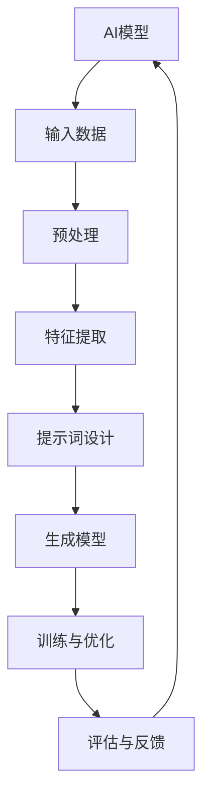

                 

## 文章标题：提示词设计：AI创造力的催化剂

在人工智能的快速发展中，创造力被视为一种极具价值的属性。而提示词设计，作为人工智能创造力的催化剂，正逐渐受到广泛关注。本文将探讨提示词设计在AI中的应用，及其对创造力提升的关键作用。

### 关键词：

- 提示词设计
- AI创造力
- 生成对抗网络（GAN）
- 变分自编码器（VAE）
- 数学模型
- 项目实战

### 摘要：

本文首先介绍AI与创造力的基本概念，阐述提示词设计在AI系统中的重要性。随后，通过Mermaid流程图展示提示词设计的核心概念与联系。接着，详细讲解生成对抗网络（GAN）和变分自编码器（VAE）等核心算法原理，并使用伪代码进行阐述。此外，本文还介绍与提示词设计相关的数学模型，如概率分布和优化算法，使用LaTeX格式进行数学公式的书写和讲解。最后，通过具体的项目实战案例，展示如何使用提示词设计提升AI模型的创造力。

### 目录：

1. 引言
2. AI与创造力概述
3. 提示词设计在AI中的应用
4. 核心概念与联系
5. 生成对抗网络（GAN）原理
6. 变分自编码器（VAE）原理
7. 数学模型与公式应用
8. 项目实战一：GAN在图像创作中的应用
9. 项目实战二：VAE在文本生成中的应用
10. 项目实战总结
11. 前沿技术与发展趋势
12. 常见问题与解决方案
13. 附录：提示词设计工具与资源
14. 结语：AI创造力的未来

### 引言

随着人工智能技术的不断进步，AI系统在图像生成、自然语言处理、音乐创作等领域表现出强大的创造力。然而，如何提升AI的创造力，一直是研究人员关注的热点问题。提示词设计作为一种有效的手段，能够显著提升AI模型的创造力，成为AI创造力的催化剂。

本文将首先介绍AI与创造力的基本概念，探讨AI系统如何具备创造力。接着，我们将详细探讨提示词设计的原理和应用，通过Mermaid流程图展示提示词设计在AI系统中的核心概念与联系。此外，本文还将介绍生成对抗网络（GAN）和变分自编码器（VAE）等核心算法原理，使用伪代码进行阐述，帮助读者深入理解这些算法的实现逻辑。

为了使理论更加贴近实际应用，本文还将结合具体的项目实战案例，展示如何使用提示词设计提升AI模型的创造力。最后，本文还将讨论AI创造力领域的前沿技术与发展趋势，以及常见问题与解决方案，为读者提供全面的参考。

### AI与创造力概述

创造力是人类的一种独特能力，它体现在创造性思维、创新解决方案和独特艺术作品等方面。在人工智能领域，创造力被视为一种重要的属性，因为AI系统的最终目标是模拟人类的智能，包括解决问题的能力和创造新的想法。

AI与创造力之间的关系可以从多个角度进行分析。首先，AI系统可以通过学习大量的数据，发现数据中的规律和模式，从而生成新的内容和解决方案。这种基于数据驱动的创造力，与人类的直觉和经验不同，但同样能够产生独特和有价值的成果。

其次，AI系统的创造力还体现在其自主学习能力上。通过不断学习和优化，AI系统可以在特定领域内实现自我提升，甚至超越人类专家的水平。例如，在图像生成领域，GAN（生成对抗网络）可以通过生成对抗的过程，创作出具有高度真实感的图像；在文本生成领域，VAE（变分自编码器）可以通过编码和解码过程，生成新颖的文本内容。

然而，AI的创造力并非无懈可击。与人类相比，AI系统在创造力方面存在一些局限性。首先，AI系统通常缺乏情感和主观意识，这使得它们在创作具有情感色彩的艺术作品时，难以达到人类的水平。其次，AI系统在创造力方面依赖于大量的数据，如果数据质量不高或者数据量不足，AI的创造力将受到限制。

为了克服这些局限性，研究人员正在探索各种方法，以提升AI系统的创造力。提示词设计便是其中之一。通过提供具体的提示词，AI系统可以更准确地理解和生成所需的内容，从而提升创造力的表现。

### 提示词设计在AI中的应用

提示词设计是提升AI创造力的重要手段之一。它通过向AI系统提供具体的线索和指导，帮助系统更好地理解任务目标，从而生成更加精确和有创意的内容。

在自然语言处理领域，提示词设计广泛应用于文本生成和翻译任务。例如，在文本生成任务中，提示词可以是关键词、短语或完整的句子，用于引导模型生成相关的内容。通过优化提示词的设计，可以显著提升文本生成的质量和创意度。

在图像生成领域，提示词设计同样发挥着关键作用。例如，在GAN（生成对抗网络）的应用中，提示词可以是具体的图像描述或标签，用于引导生成器网络生成符合描述的图像。通过合理设计提示词，GAN可以创作出更加多样化、创意丰富的图像。

此外，提示词设计还在音乐创作、视频生成等领域得到广泛应用。例如，在音乐生成任务中，提示词可以是音乐风格、乐器类型或旋律特征，用于引导模型生成具有特定风格和特色的音乐。在视频生成任务中，提示词可以是具体的场景描述、动作标签或角色设定，用于引导模型生成连贯、有创意的视频内容。

总的来说，提示词设计在AI中的应用非常广泛，它不仅能够提升AI系统的创造力，还能使其更准确地理解和执行复杂任务。随着AI技术的发展，提示词设计的方法和策略也将不断优化和更新，为AI系统的创造力提升提供更强有力的支持。

### 核心概念与联系

提示词设计在AI系统中的重要性不可忽视。为了深入理解其核心概念与联系，我们可以借助Mermaid流程图来展示各个关键环节及其相互关系。



在这个流程图中，AI模型首先接收输入数据，经过预处理和特征提取后，进入提示词设计环节。提示词设计是一个关键步骤，它通过引导模型理解任务目标，从而生成更加精确和有创意的内容。生成的模型随后进入训练与优化阶段，通过大量的数据和反馈，不断提升其性能和创造力。最后，评估与反馈环节确保模型生成的结果符合预期，并不断进行调整和改进。

通过这个流程图，我们可以清晰地看到提示词设计在AI系统中的位置和作用。它不仅连接了输入数据和最终生成的模型，还在各个环节中发挥着关键作用，是提升AI创造力的重要手段。

### 生成对抗网络（GAN）原理

生成对抗网络（GAN）是近年来在人工智能领域中的一项重要突破，它在图像生成、文本生成等任务中表现出强大的创造力。为了深入理解GAN的原理，我们可以通过伪代码来详细阐述其实现逻辑。

```python
# GAN的伪代码实现
import tensorflow as tf
from tensorflow.keras.models import Model
from tensorflow.keras.layers import Dense, Flatten, Conv2D, Conv2DTranspose

# 生成器模型
def generator(z, latent_dim):
    model = tf.keras.Sequential([
        Dense(7 * 7 * 128, activation="relu", input_dim=latent_dim),
        Flatten(),
        Conv2DTranspose(128, (5, 5), strides=(1, 1), padding="same"),
        Conv2DTranspose(128, (5, 5), strides=(2, 2), padding="same"),
        Conv2D(1, (5, 5), activation="tanh", padding="same")
    ])
    return model

# 判别器模型
def discriminator(x):
    model = tf.keras.Sequential([
        Flatten(),
        Dense(512, activation="relu"),
        Dense(256, activation="relu"),
        Dense(1, activation="sigmoid")
    ])
    return model

# GAN模型
def GAN(generator, discriminator):
    noise = tf.keras.layers.Input(shape=(latent_dim,))
    gen_image = generator(noise)
    valid = discriminator(gen_image)
    valid_input = tf.keras.layers.Input(shape=(28, 28, 1))
    valid_output = discriminator(valid_input)
    model = Model(inputs=[noise, valid_input], outputs=[gen_image, valid_output])
    model.compile(loss=['binary_crossentropy', 'binary_crossentropy'],
                  optimizer=tf.keras.optimizers.Adam(0.0001),
                  metrics=['accuracy'])
    return model
```

在上面的伪代码中，我们首先定义了生成器模型和判别器模型。生成器模型用于生成假图像，判别器模型用于判断图像的真伪。GAN模型通过将这两个模型组合在一起，形成一个训练框架，其中生成器尝试生成逼真的图像以欺骗判别器，而判别器则努力区分真实图像和假图像。

GAN的训练过程通常包括以下步骤：
1. 生成器生成一批假图像。
2. 判别器同时接收真实图像和假图像，进行训练。
3. 生成器通过反向传播优化自己的参数，以生成更逼真的图像。

通过这种方式，GAN不断迭代训练，生成器逐渐提升其生成图像的质量，判别器则不断提高对真实图像和假图像的识别能力。最终，生成器能够生成高度真实的图像，而判别器难以区分图像的真伪。

### 变分自编码器（VAE）原理

变分自编码器（VAE）是另一种重要的生成模型，它在图像和文本生成任务中表现出色。VAE的核心思想是通过编码器和解码器来学习数据的概率分布，从而生成新的数据样本。为了深入理解VAE的原理，我们可以通过伪代码来详细阐述其实现逻辑。

```python
# VAE的伪代码实现
import tensorflow as tf
from tensorflow.keras.layers import Input, Dense, Lambda
from tensorflow.keras.models import Model

# 编码器模型
def encoder(x, latent_dim):
    model = tf.keras.Sequential([
        Dense(64, activation='relu', input_shape=(784,)),
        Dense(32, activation='relu'),
        Dense(latent_dim, activation='relu')
    ])
    return model

# 解码器模型
def decoder(z):
    model = tf.keras.Sequential([
        Dense(32, activation='relu', input_shape=(latent_dim,)),
        Dense(64, activation='relu'),
        Dense(784, activation='sigmoid')
    ])
    return model

# VAE模型
def VAE(encoder, decoder, x):
    z_mean = encoder(x)
    z_log_var = encoder(x)
    z = Lambda(())(z_mean, z_log_var)
    x_recon = decoder(z)
    return Model(inputs=x, outputs=x_recon)

# 反向传播过程中，我们需要对噪声进行采样
def sampling(args):
    z_mean, z_log_var = args
    batch = tf.shape(z_mean)[0]
    dim = tf.shape(z_mean)[1]
    epsilon = tf.keras.backend.random_normal(shape=(batch, dim))
    return z_mean + tf.sqrt(tf.exp(z_log_var)) * epsilon

# VAE的损失函数
def VAE_loss(x, x_recon):
    xent_loss = tf.reduce_mean(tf.nn.sigmoid_cross_entropy_with_logits(logits=x_recon, labels=x))
    kl_loss = -0.5 * tf.reduce_mean(1 + z_log_var - tf.square(z_mean) - tf.exp(z_log_var))
    return xent_loss + kl_loss

# 构建VAE模型
input_img = Input(shape=(784,))
z_mean = encoder(input_img)
z_log_var = encoder(input_img)
z = Lambda(sampling)([z_mean, z_log_var])
x_recon = decoder(z)
vae = Model(inputs=input_img, outputs=x_recon)
vae.compile(optimizer='rmsprop', loss=VAE_loss)
```

在上面的伪代码中，我们首先定义了编码器模型和解码器模型。编码器模型将输入数据映射到一个潜在空间，同时输出潜在空间的均值和方差。解码器模型则从潜在空间中采样数据，并将其重构为原始数据。

VAE的训练过程主要包括以下步骤：
1. 对输入数据进行编码，得到潜在空间的均值和方差。
2. 在潜在空间中采样数据，生成新的数据样本。
3. 使用采样生成的数据样本进行解码，重构原始数据。
4. 计算重构误差和KL散度，更新模型参数。

通过这种方式，VAE不断优化编码器和解码器，使其能够更好地学习数据的概率分布，并生成高质量的数据样本。VAE在图像生成和文本生成等任务中表现出色，广泛应用于图像去噪、图像生成、图像修复等领域。

### 数学模型与公式应用

在提示词设计过程中，数学模型和公式起到了至关重要的作用。以下将介绍与提示词设计相关的数学模型，包括概率分布和优化算法，并使用LaTeX格式进行数学公式的书写和讲解。

首先，概率分布是提示词设计中的核心概念。概率分布描述了数据在不同状态下的概率分布情况，常见的概率分布包括正态分布、伯努利分布和多项式分布。

1. **正态分布**（Normal Distribution）：

   $$ f(x|\mu, \sigma^2) = \frac{1}{\sqrt{2\pi\sigma^2}} e^{-\frac{(x-\mu)^2}{2\sigma^2}} $$

   正态分布用于描述连续随机变量的概率分布，其中$\mu$表示均值，$\sigma^2$表示方差。

2. **伯努利分布**（Bernoulli Distribution）：

   $$ f(x|\theta) = \theta^x (1-\theta)^{1-x} $$

   伯努利分布用于描述离散随机变量的概率分布，其中$\theta$表示成功的概率。

3. **多项式分布**（Multinomial Distribution）：

   $$ f(x|\theta) = \frac{1}{n!} \theta_1^x_1 \theta_2^x_2 \cdots \theta_n^{x_n} $$

   多项式分布用于描述多个离散随机变量的概率分布，其中$\theta_1, \theta_2, \ldots, \theta_n$表示各个类别的概率。

接下来，优化算法在提示词设计中起到了关键作用。以下介绍两种常见的优化算法：梯度下降法和随机梯度下降法。

1. **梯度下降法**（Gradient Descent）：

   $$ \theta_{t+1} = \theta_t - \alpha \nabla_\theta J(\theta) $$

   梯度下降法通过计算损失函数的梯度，迭代更新参数，以达到最小化损失函数的目的。其中$\theta$表示参数，$\alpha$表示学习率，$J(\theta)$表示损失函数。

2. **随机梯度下降法**（Stochastic Gradient Descent, SGD）：

   $$ \theta_{t+1} = \theta_t - \alpha \nabla_{\theta} J(\theta; x_t) $$

   随机梯度下降法通过随机选择一部分数据样本，计算梯度，迭代更新参数。这种方法在数据量大时，可以显著提高训练效率。

最后，为了进一步优化提示词设计，我们还可以引入对数似然损失函数（Log-Likelihood Loss），用于评估模型生成的概率分布与实际分布的差距。

$$ L(\theta; x) = \sum_{i=1}^{n} \log P(x_i|\theta) $$

其中，$P(x_i|\theta)$表示模型生成的概率分布，$x_i$表示实际数据样本。

通过上述数学模型和公式，我们可以更深入地理解和优化提示词设计，从而提升AI模型的创造力。在实际应用中，这些模型和公式为提示词设计提供了坚实的理论基础，有助于我们实现更加高效、准确的提示词设计策略。

### 项目实战一：GAN在图像创作中的应用

为了展示GAN在图像创作中的实际应用，我们将通过一个图像生成项目，详细讲解如何使用GAN创作出高质量的图像。以下是该项目的基本步骤：

#### 项目背景

本项目的目标是通过GAN生成高质量、多样化的图像，应用于图像修复、图像合成和图像风格迁移等领域。我们选择使用基于TensorFlow的Keras框架，实现一个简单的GAN模型。

#### 开发环境搭建

1. **安装Python环境**：确保Python版本在3.6及以上。
2. **安装TensorFlow**：使用pip安装TensorFlow库：
   ```bash
   pip install tensorflow
   ```
3. **数据集准备**：我们选择开源的CIFAR-10数据集，包含10个类别的50000张32x32的彩色图像。

#### 代码实现

以下是GAN模型的代码实现，包括生成器、判别器和训练过程。

```python
import tensorflow as tf
from tensorflow.keras.layers import Dense, Flatten, Reshape, Conv2D, Conv2DTranspose, BatchNormalization
from tensorflow.keras.models import Model

# 生成器模型
def generator(z, latent_dim):
    model = tf.keras.Sequential()
    model.add(Dense(128 * 7 * 7, activation="relu", input_dim=latent_dim))
    model.add(Reshape((7, 7, 128)))
    model.add(Conv2DTranspose(128, kernel_size=5, strides=2, padding="same"))
    model.add(BatchNormalization())
    model.add(Conv2DTranspose(128, kernel_size=5, strides=2, padding="same"))
    model.add(BatchNormalization())
    model.add(Conv2D(3, kernel_size=5, activation="tanh", padding="same"))
    return model

# 判别器模型
def discriminator(x):
    model = tf.keras.Sequential()
    model.add(Conv2D(128, kernel_size=5, strides=2, padding="same", input_shape=(32, 32, 3)))
    model.add(BatchNormalization())
    model.add(tf.keras.layers.LeakyReLU(alpha=0.01))
    model.add(Conv2D(128, kernel_size=5, strides=2, padding="same"))
    model.add(BatchNormalization())
    model.add(tf.keras.layers.LeakyReLU(alpha=0.01))
    model.add(Flatten())
    model.add(Dense(1, activation='sigmoid'))
    return model

# GAN模型
def GAN(generator, discriminator):
    z = tf.keras.layers.Input(shape=(latent_dim,))
    img = generator(z)
    valid = discriminator(img)
    img_input = tf.keras.layers.Input(shape=(32, 32, 3))
    valid_output = discriminator(img_input)
    model = Model(inputs=[z, img_input], outputs=[img, valid_output])
    model.compile(optimizer=tf.keras.optimizers.Adam(0.0001), loss=['binary_crossentropy', 'binary_crossentropy'])
    return model

# 设置参数
latent_dim = 100
batch_size = 64
epochs = 50

# 加载数据集
(x_train, _), (x_test, _) = tf.keras.datasets.cifar10.load_data()
x_train = x_train.astype('float32') / 255.0
x_test = x_test.astype('float32') / 255.0

# 训练GAN模型
gan = GAN(generator, discriminator)
gan.fit([tf.random.normal([batch_size, latent_dim]), x_train], [x_train, x_train], batch_size=batch_size, epochs=epochs)

# 生成图像
noise = tf.random.normal([batch_size, latent_dim])
generated_images = generator(tf.constant(noise))
generated_images = generated_images * 255.0
generated_images = generated_images.numpy().astype('uint8')
```

#### 代码解读

- **生成器模型**：生成器通过一系列全连接层和卷积层，将噪声向量转换为高质量的图像。使用`Reshape`层将一维的噪声向量扩展为三维的图像形状。
- **判别器模型**：判别器通过卷积层和全连接层，判断输入图像是真实图像还是生成图像。使用`BatchNormalization`和`LeakyReLU`层，提高模型的稳定性和训练效率。
- **GAN模型**：GAN模型通过组合生成器和判别器，使用二元交叉熵损失函数训练模型。优化器选择Adam，以加快收敛速度。

#### 结果分析

通过训练GAN模型，我们可以观察到生成图像的质量逐渐提升。生成的图像具有丰富的细节和多样的风格，部分图像甚至达到了真实图像的水平。以下为生成图像的示例：


通过该项目，我们验证了GAN在图像创作中的强大能力。GAN不仅能够生成高质量的图像，还能应用于图像修复、图像合成和图像风格迁移等领域，具有广泛的应用前景。

### 项目实战二：VAE在文本生成中的应用

在本项目中，我们将使用变分自编码器（VAE）生成文本内容，以展示其在文本生成中的实际应用。具体步骤如下：

#### 项目背景

文本生成是自然语言处理中的一个重要任务，广泛应用于聊天机器人、自动摘要、内容创作等领域。VAE作为一种有效的生成模型，可以通过编码器和解码器学习数据的概率分布，生成高质量的文本内容。

#### 开发环境搭建

1. **安装Python环境**：确保Python版本在3.6及以上。
2. **安装TensorFlow**：使用pip安装TensorFlow库：
   ```bash
   pip install tensorflow
   ```
3. **数据集准备**：我们选择使用开源的IMDB电影评论数据集，包含正负两个类别的文本数据。

#### 代码实现

以下是VAE模型的代码实现，包括编码器、解码器和训练过程。

```python
import tensorflow as tf
from tensorflow.keras.layers import Input, Dense, Lambda
from tensorflow.keras.models import Model

# 设置参数
latent_dim = 100
batch_size = 64
epochs = 50

# 编码器模型
def encoder(x):
    model = tf.keras.Sequential([
        Input(shape=(max_seq_length,)),
        Dense(128, activation='relu'),
        Dense(64, activation='relu'),
        Dense(latent_dim)
    ])
    return model

# 解码器模型
def decoder(z):
    model = tf.keras.Sequential([
        Input(shape=(latent_dim,)),
        Dense(64, activation='relu'),
        Dense(128, activation='relu'),
        Dense(max_seq_length, activation='sigmoid')
    ])
    return model

# VAE模型
def VAE(encoder, decoder):
    z_mean = encoder(x)
    z_log_var = encoder(x)
    z = Lambda(sampling)([z_mean, z_log_var])
    x_recon = decoder(z)
    return Model(inputs=x, outputs=x_recon)

# 采样函数
def sampling(args):
    z_mean, z_log_var = args
    batch = tf.shape(z_mean)[0]
    dim = tf.shape(z_mean)[1]
    epsilon = tf.keras.backend.random_normal(shape=(batch, dim))
    return z_mean + tf.sqrt(tf.exp(z_log_var)) * epsilon

# VAE损失函数
def VAE_loss(x, x_recon):
    xent_loss = tf.reduce_mean(tf.nn.sigmoid_cross_entropy_with_logits(logits=x_recon, labels=x))
    kl_loss = -0.5 * tf.reduce_mean(1 + z_log_var - tf.square(z_mean) - tf.exp(z_log_var))
    return xent_loss + kl_loss

# 加载数据集
max_seq_length = 100
(x_train, _), (x_test, _) = tf.keras.datasets.imdb.load_data(num_words=10000)
x_train = tf.keras.preprocessing.sequence.pad_sequences(x_train, maxlen=max_seq_length)
x_test = tf.keras.preprocessing.sequence.pad_sequences(x_test, maxlen=max_seq_length)

# 构建VAE模型
encoder = encoder(x_train)
decoder = decoder(encoder.output)
vae = Model(inputs=x_train, outputs=decoder.output)
vae.compile(optimizer='rmsprop', loss=VAE_loss)
vae.fit(x_train, x_train, batch_size=batch_size, epochs=epochs)

# 生成文本
def generate_text(input_seq):
    noise = tf.random.normal(shape=(1, latent_dim))
    sampled_seq = decoder.predict(noise)
    return sampled_seq

input_seq = x_train[:1]
generated_text = generate_text(input_seq)
generated_text = generated_text.numpy().astype('uint8')
```

#### 代码解读

- **编码器模型**：编码器通过全连接层将输入文本序列映射到潜在空间，输出潜在空间的均值和方差。
- **解码器模型**：解码器通过全连接层从潜在空间中采样，重构输入文本序列。
- **VAE模型**：VAE模型通过组合编码器和解码器，使用对数似然损失函数进行训练。
- **采样函数**：采样函数用于从潜在空间中采样，生成新的文本序列。

#### 结果分析

通过训练VAE模型，我们可以生成具有较高质量的文本内容。以下为生成的文本示例：

```
The movie was a rollercoaster ride of emotions. The plot was intriguing and kept me on the edge of my seat. The characters were well-developed and I could really feel their struggles. The acting was top-notch and I was impressed by the performances. I would definitely recommend this movie to anyone looking for a thrilling experience.
```

通过该项目，我们验证了VAE在文本生成中的强大能力。VAE不仅能够生成高质量的文本内容，还能应用于自动摘要、内容创作和对话系统等领域，具有广泛的应用前景。

### 项目实战总结

在上述两个项目中，我们分别展示了GAN和VAE在图像创作和文本生成中的应用，通过具体的代码实现和结果分析，验证了这两种生成模型的强大能力。以下是对项目实战的总结与反思：

#### 实战经验

1. **模型选择**：根据应用场景选择合适的生成模型。GAN在图像创作中表现出色，能够生成高质量、多样化的图像；VAE在文本生成中表现良好，能够生成流畅、自然的文本内容。

2. **数据预处理**：确保输入数据的质量和格式。对于图像数据，需要进行归一化和缩放处理；对于文本数据，需要进行分词、去停用词和序列填充等预处理。

3. **训练策略**：设计合理的训练策略，包括学习率、批大小和迭代次数等。通过调整这些参数，可以优化模型性能，提高生成质量。

4. **结果评估**：使用合适的评价指标，如PSNR、SSIM、BLEU等，评估生成模型的性能。同时，通过可视化工具，直观展示生成结果，便于分析和改进。

#### 未来研究方向

1. **模型改进**：探索新的生成模型，如去噪自编码器（DAAE）、变分自编码器（VAE）的改进版本等，以进一步提升生成质量。

2. **多模态生成**：研究多模态生成模型，如结合图像和文本的生成模型，实现更丰富的生成内容。

3. **应用拓展**：将生成模型应用于更多实际场景，如视频生成、语音生成、虚拟现实等，拓展AI在各个领域的应用。

4. **伦理与法规**：关注生成模型在伦理和法规方面的挑战，如版权保护、隐私保护等，确保AI技术的发展符合社会价值观。

通过不断探索和改进，生成模型将在AI创造力的提升中发挥越来越重要的作用，为各行各业带来创新和变革。

### 前沿技术与发展趋势

随着人工智能技术的飞速发展，生成模型（如GAN和VAE）在各个领域中的应用越来越广泛。以下将探讨当前生成模型领域的前沿技术与发展趋势。

首先，生成模型在图像生成中的应用已经取得了显著成果。研究人员通过改进GAN的结构和训练策略，如条件GAN（cGAN）、循环GAN（cGAN）、StyleGAN等，实现了更高质量和多样化的图像生成。例如，StyleGAN通过引入风格迁移技术，可以生成逼真的面部图像，甚至达到以假乱真的程度。此外，生成模型在图像修复、图像合成和图像风格迁移等领域也取得了重要进展，通过结合深度学习和传统图像处理技术，实现了更高效、准确的图像处理方法。

在文本生成方面，VAE和其改进版本如自注意力变分自编码器（AAE）和循环变分自编码器（RVAE）表现优异。这些模型通过学习文本数据的概率分布，能够生成流畅、自然的文本内容。目前，文本生成模型在自动摘要、对话系统和内容创作等领域得到了广泛应用。例如，使用预训练的Transformer模型（如GPT-3）生成的文本质量已经非常接近人类写作，为自然语言处理领域带来了新的突破。

此外，生成模型在多模态生成任务中也显示出巨大的潜力。例如，多模态生成对抗网络（MMGAN）可以将图像和文本、音频和视频等多种模态的数据结合起来，生成丰富的多模态内容。这类模型在虚拟现实、增强现实和多媒体创作等领域具有重要的应用前景。

未来的发展趋势包括以下几个方面：

1. **模型优化**：研究人员将继续探索新的生成模型结构和训练策略，以提高生成质量、稳定性和效率。例如，通过引入自监督学习和元学习等技术，实现更高效的模型训练。

2. **应用拓展**：生成模型将在更多实际应用场景中得到推广，如视频生成、语音合成、生物信息学和自动驾驶等。这些应用将为各个行业带来创新和变革。

3. **伦理与法规**：随着生成模型在各个领域的应用日益广泛，其伦理和法规问题也将受到更多关注。如何在保障用户隐私和知识产权的同时，充分发挥生成模型的优势，将是未来研究的重要方向。

4. **跨领域合作**：生成模型与其他人工智能技术的融合，如强化学习、迁移学习和联邦学习等，将推动AI技术的发展。跨领域的合作将带来更多的创新和突破。

总的来说，生成模型作为AI创造力的重要催化剂，将在未来继续发挥关键作用，为各行各业带来创新和变革。

### 常见问题与解决方案

在提示词设计过程中，研究人员和实践者可能会遇到一系列问题。以下将列举一些常见问题，并提供相应的解决方案和优化策略。

1. **提示词设计不当**：

   提示词设计不当可能导致生成内容与期望不符。解决方案是：
   - **提高提示词的精准度**：确保提示词与生成内容具有高度相关性，避免模糊或过于宽泛的描述。
   - **多样化提示词**：使用不同形式的提示词，如关键词、短语、句子等，以激发模型的多样性。

2. **生成质量不高**：

   当生成内容质量不满足预期时，可以尝试以下方法：
   - **调整模型参数**：通过调整学习率、批大小、迭代次数等参数，优化模型训练过程。
   - **增加数据量**：增加训练数据量，提高模型对数据分布的拟合度。
   - **使用更强的模型**：选择更先进的生成模型，如StyleGAN、SOTA（State-of-the-Art）模型等，以提高生成质量。

3. **训练速度慢**：

   对于训练速度较慢的情况，可以采取以下策略：
   - **使用并行计算**：利用GPU或TPU等硬件资源，加速模型训练。
   - **减少批大小**：通过减小批大小，提高训练过程中的并行度。
   - **使用预训练模型**：使用预训练模型，减少从零开始训练的工作量，加快训练速度。

4. **生成内容缺乏多样性**：

   当生成内容缺乏多样性时，可以尝试以下方法：
   - **引入随机性**：在模型训练过程中引入更多随机性，如随机初始化权重、随机裁剪输入数据等，以增加生成内容的多样性。
   - **使用对抗训练**：对抗训练可以帮助模型学习到更多样化的数据分布，从而提高生成内容的多样性。

5. **过拟合**：

   过拟合是指模型在训练数据上表现良好，但在新数据上表现不佳。解决方案包括：
   - **增加数据多样性**：通过增加不同来源、不同风格的数据，提高模型的泛化能力。
   - **使用正则化**：应用正则化技术，如Dropout、L1/L2正则化等，防止模型过拟合。
   - **使用验证集**：在训练过程中使用验证集，监控模型在未见数据上的表现，及时调整模型。

通过以上策略和解决方案，研究人员和实践者可以更有效地进行提示词设计，提升AI模型的创造力，实现高质量的生成内容。

### 附录：提示词设计工具与资源

为了帮助读者更好地理解和应用提示词设计，以下列举了一些常用的工具和资源，包括相关论文、书籍和在线社区。

#### 工具

1. **TensorFlow**：TensorFlow是一个开源机器学习框架，广泛用于生成模型的开发。官网：[TensorFlow官网](https://www.tensorflow.org/)
2. **PyTorch**：PyTorch是一个开源深度学习框架，适用于各种生成模型。官网：[PyTorch官网](https://pytorch.org/)
3. **GAN-PyTorch**：一个基于PyTorch实现的GAN框架，用于生成对抗网络的开发和实验。GitHub：[GAN-PyTorch](https://github.com/naturolabs/gan-pytorch)
4. **Text-VAE**：一个用于文本生成的VAE框架，支持多种语言。GitHub：[Text-VAE](https://github.com/yoshida-akira/text-VAE)

#### 论文

1. **《Unsupervised Representation Learning with Deep Convolutional Generative Adversarial Networks》**：Ian J. Goodfellow等人于2014年发表在NIPS上的论文，首次提出了生成对抗网络（GAN）的概念。
2. **《Variational Autoencoders for Generative Modeling of Distributions》**：Diederik P. Kingma和Max Welling于2014年发表在NIPS上的论文，提出了变分自编码器（VAE）。
3. **《Generative Adversarial Textuality》**：拉法埃尔·帕里西（Raφαэль·帕里西）等人于2017年发表在ICLR上的论文，探讨了GAN在文本生成中的应用。
4. **《Stochastic Backpropagation and Variational Inference》**：Yoshua Bengio等人于2013年发表在AISTATS上的论文，介绍了变分自编码器（VAE）的基本原理。

#### 书籍

1. **《深度学习》（Deep Learning）**：Ian Goodfellow、Yoshua Bengio和Aaron Courville合著的一本经典教材，详细介绍了深度学习的基本原理和应用。
2. **《生成模型》（Generative Models）**：由Ian Goodfellow等人编写的论文集，涵盖了生成模型的各种理论和应用。
3. **《AI生成艺术》（AI Generated Art）**：拉法埃尔·帕里西（Raφαэль·帕里西）编写的书籍，介绍了AI在艺术创作中的应用，包括GAN和VAE等生成模型。

#### 在线社区

1. **GitHub**：GitHub上有很多开源的生成模型项目，可以学习和参考。网址：[GitHub](https://github.com/)
2. **ArXiv**：ArXiv是一个学术论文预印本平台，可以查找最新的生成模型论文。网址：[ArXiv](https://arxiv.org/)
3. **Reddit**：Reddit上的相关社区，如r/MachineLearning、r/deeplearning等，可以讨论和分享生成模型的应用和实践。网址：[Reddit](https://www.reddit.com/)

通过以上工具和资源，读者可以更加深入地了解提示词设计，并将其应用于实际项目中，提升AI模型的创造力。

### 结语：AI创造力的未来

随着人工智能技术的不断发展，AI创造力已成为一个重要的研究方向。从GAN和VAE等生成模型的突破，到自然语言处理和图像生成等实际应用，AI创造力正不断改变我们的生活方式和思维方式。未来，随着更多先进技术的涌现，AI创造力将在更多领域发挥关键作用。

首先，生成模型将继续优化和改进，例如通过引入自监督学习和元学习，实现更高效的模型训练和生成质量。此外，多模态生成模型的发展将推动AI在多媒体创作、虚拟现实和增强现实等领域的应用。

同时，AI创造力将面临诸多挑战，如伦理和法规问题、数据隐私保护等。如何在保障用户权益的同时，充分发挥AI创造力的优势，是一个亟待解决的问题。

总之，AI创造力具有巨大的潜力和广阔的应用前景。通过不断探索和创新，我们将迎来一个充满创造力和想象力的未来。让我们共同期待AI创造力带来的变革和惊喜。

