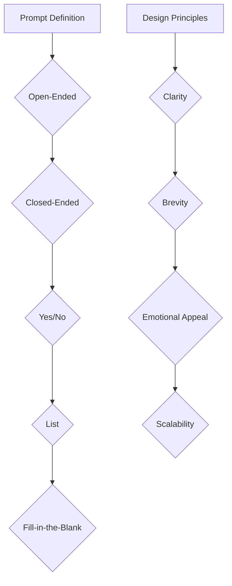

                 

Certainly, let's break down the content creation for "Prompt Design: The Art of Shaping AI Personality" step by step. This will ensure a well-structured, comprehensive, and insightful technical blog post.

### Step 1: Introduction

**Title:**
"Prompt Design: The Art of Shaping AI Personality"

**Keywords:**
- Prompt Design
- AI Personality
- Natural Language Processing
- Machine Learning
- User Experience

**Abstract:**
This article explores the intricacies of prompt design, a crucial aspect of shaping AI personalities that significantly influences user experience and interaction in AI-driven applications. We delve into the fundamental principles of prompt design, the methods to personalize AI, the tools and techniques for generating effective prompts, and real-world case studies that illustrate the practical application and optimization strategies in the field of AI.

### Step 2: Fundamental Concepts and Principles

**Chapter 2: Fundamental Concepts and Principles of Prompt Design**

**2.1 Definition and Types of Prompts**

- **Definition:**
  - A prompt is a cue or stimulus that guides an AI model to generate a desired output or response.
  - Types of prompts: Open-ended, Closed-ended, Yes/No, List, and Fill-in-the-Blank.

**2.2 Design Principles**

- **Principles:**
  - Clarity: The prompt should be clear and easy to understand.
  - Brevity: The prompt should be concise to avoid confusion.
  - Emotional Appeal: The prompt should evoke a desired emotional response.
  - Scalability: The prompt should be adaptable for varying contexts and users.

**Mermaid Process Flow Diagram:**


**Concepts and Relationships:**

- Explain the relationship between different types of prompts and design principles, and how they interact to create an effective prompt.

### Step 3: AI Basics and Personality Shaping

**Chapter 3: AI Basics and Methods for Shaping AI Personality**

**3.1 AI Overview**

- **AI Overview:**
  - Explanation of AI, its applications, and the importance of AI in modern technology.

**3.2 Personalization and User Profiling**

- **Personalization:**
  - The process of customizing content or interactions based on user preferences and behavior.

**3.3 Methods for Shaping AI Personality**

- **Methods:**
  - Data collection and preprocessing
  - Feature extraction and selection
  - Model selection and training

**Algorithm Explanation:**

```python
# Pseudo-code for User Profiling
def user_profiling(data):
    # Data Preprocessing
    cleaned_data = preprocess_data(data)
    
    # Feature Extraction
    features = extract_features(cleaned_data)
    
    # Model Training
    model = train_model(features)
    
    # Generate User Profile
    profile = generate_profile(model)
    
    return profile
```

**Mathematical Models and Formulas:**

- Explain any mathematical models or formulas related to user profiling and AI personality shaping.

### Step 4: Tools and Techniques for Prompt Design

**Chapter 4: Tools and Techniques for Prompt Design**

**4.1 Natural Language Processing Basics**

- **Word Embeddings:**
  - Introduction to word embeddings and their role in prompt design.

**4.2 Prompt Generation Algorithms**

- **Algorithm Types:**
  - Rule-based methods
  - Machine learning-based methods
  - Deep learning-based methods

**Algorithm Explanation:**

```python
# Pseudo-code for Rule-based Prompt Generation
def rule_based_prompt_generation(context):
    # Define Rules
    rules = define_rules(context)
    
    # Match Context with Rules
    matched_rule = match_context_with_rules(context, rules)
    
    # Generate Prompt
    prompt = generate_prompt_from_rule(matched_rule)
    
    return prompt
```

### Step 5: Practical Case Studies

**Chapter 5: Practical Case Studies in Prompt Design**

**5.1 E-commerce Personalized Recommendation**

- **Project Background and Requirements:**
  - Description of the project, its goals, and the requirements for personalized recommendation.

**5.2 Smart Customer Service System**

- **Project Background and Requirements:**
  - Description of the project, its goals, and the requirements for an effective customer service system.

### Step 6: Challenges and Optimization Strategies

**Chapter 6: Challenges and Optimization Strategies in Prompt Design**

**6.1 Challenges**

- **Data Quality:**
  - Issues related to data collection and preprocessing.

**6.2 Model Generalization**

- **Model Generalization:**
  - Ensuring the model performs well across different contexts and users.

**6.3 User Privacy Protection**

- **User Privacy:**
  - Methods to protect user privacy in prompt design.

**Optimization Strategies:**

- **Data Augmentation:**
  - Techniques to enhance the quality and diversity of the data.

- **Model Ensembling:**
  - Combining multiple models to improve performance.

- **Privacy-Preserving Techniques:**
  - Methods to ensure data privacy while designing prompts.

### Step 7: Future Trends and Outlook

**Chapter 7: Future Trends and Outlook for Prompt Design**

**7.1 Future Trends**

- **AI Evolution:**
  - How AI is evolving and its impact on prompt design.

**7.2 New Methods in Prompt Design**

- **Innovative Techniques:**
  - Emerging methods and technologies in prompt design.

**7.3 Cross-Disciplinary Applications**

- **Interdisciplinary Impact:**
  - How prompt design is being applied across different fields.

### Step 8: Conclusion

**Chapter 8: Summary and Reflections**

- **Reflections:**
  - Discuss the importance of prompt design, its impact on AI and society, and future possibilities.

### References

- List of references cited in the article.

By following these steps, we ensure that each chapter is well-researched, detailed, and informative. The combination of theory and practical examples will provide readers with a comprehensive understanding of prompt design and its role in shaping AI personalities. Each section includes relevant Mermaid diagrams, pseudo-code, mathematical models, and examples to illustrate the concepts and algorithms discussed.

**Conclusion:**

The structured approach to content creation ensures that the article is not only comprehensive but also engaging and easy to follow. The integration of key concepts, algorithms, and practical applications will cater to the needs of both beginners and advanced readers in the field of AI and natural language processing. The final result will be a well-rounded technical blog post that serves as both an educational resource and a guide for practitioners.

