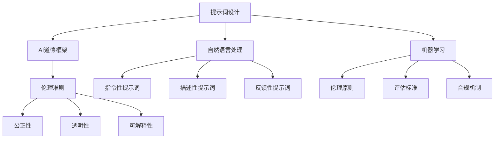

                 


### 文章标题

# 提示词设计：塑造AI道德框架的新方法

### 关键词

- 提示词设计
- AI道德框架
- 伦理原则
- 自然语言处理
- 机器学习

### 摘要

本文深入探讨了提示词设计在构建AI道德框架中的作用。通过介绍提示词设计的基础概念、核心原则和实践方法，本文揭示了如何利用提示词来引导AI系统遵循伦理准则，实现道德决策。同时，通过具体案例研究和实战分析，本文展示了提示词设计在AI道德框架中的实际应用和价值。

## 第1章 引言

### 1.1 书籍目的

本书旨在为读者提供关于提示词设计的全面指南，特别是其在塑造AI道德框架中的应用。在AI技术飞速发展的背景下，如何确保AI系统的道德行为成为一个关键问题。本书将通过深入分析提示词设计的原理和方法，帮助读者理解并掌握如何通过设计有效的提示词来引导AI系统遵循道德规范。

### 1.2 AI道德框架的重要性

AI道德框架是确保AI系统行为公正、透明和可解释性的基础。一个完善的道德框架能够帮助AI系统在面对复杂决策时，依据既定的伦理原则进行判断和行动。道德框架的重要性不仅体现在技术层面，更关乎社会的信任和公共安全。本文将探讨AI道德框架的核心概念和组成部分，以及提示词设计在其中所扮演的角色。

### 1.3 提示词设计的角色

提示词设计在AI道德框架中发挥着至关重要的作用。通过精心设计的提示词，AI系统能够理解并遵循人类设定的伦理准则。本文将详细讨论提示词的定义、类型和设计原则，以及如何利用这些原则来塑造AI的道德行为。

## 第2章 提示词设计的基础概念

### 2.1 提示词的定义

提示词（Prompt）是用于引导AI系统行为的关键输入信息。这些信息可以是自然语言文本、代码片段或其他数据形式。提示词设计的关键在于如何选择和构造这些信息，以使AI系统能够准确理解和响应。

### 2.2 提示词的类型

根据用途和形式，提示词可以分为多种类型：

- **指令性提示词**：用于直接指示AI系统执行特定任务。
- **描述性提示词**：提供背景信息和上下文，帮助AI系统更好地理解任务。
- **反馈性提示词**：用于从AI系统获取执行结果，以便进一步调整和优化。

### 2.3 提示词的设计原则

有效的提示词设计应遵循以下原则：

- **明确性**：提示词应清晰明确，避免歧义和模糊。
- **简洁性**：避免信息过载，保持提示词的简洁性。
- **多样性**：通过多样化的提示词设计，提高AI系统的灵活性和适应性。
- **适应性**：提示词设计应能够适应不同场景和任务需求。

### 2.4 提示词设计与AI道德框架的关联

提示词设计与AI道德框架的关联在于，通过合理的提示词设计，可以引导AI系统遵循人类设定的道德准则。例如，在自动驾驶汽车中，提示词可以指导系统如何处理复杂的交通情况，以确保行驶安全。提示词设计的质量直接影响AI系统的道德行为。

## 第3章 AI道德框架的核心概念

### 3.1 道德框架的基本原理

AI道德框架基于一系列伦理原则，旨在确保AI系统在决策过程中遵循公正、透明和可解释性。这些原则包括：

- **公正性**：AI系统应平等对待所有个体，避免歧视。
- **透明性**：AI系统的决策过程应可被理解和审查。
- **可解释性**：AI系统应能够解释其决策理由，以提高信任度。

### 3.2 道德框架的组成部分

一个完整的AI道德框架通常包括以下组成部分：

- **伦理准则**：定义AI系统的行为规范。
- **评估标准**：用于评估AI系统是否符合伦理准则。
- **合规机制**：确保AI系统在设计和部署过程中遵循伦理准则。

### 3.3 道德框架与提示词设计的关系

道德框架为提示词设计提供了指导原则。通过将道德准则转化为具体的提示词，可以确保AI系统在执行任务时遵循伦理原则。例如，在医疗诊断辅助系统中，提示词可以指导系统如何处理患者隐私和数据安全等问题。

### 第4章 提示词设计的具体步骤

#### 4.1 明确目标

在开始设计提示词之前，需要明确目标。这包括确定AI系统的应用场景、预期行为和道德准则。例如，在设计一个智能客服系统时，目标可能是提供高效、准确和符合伦理的服务。

#### 4.2 收集数据

收集与目标相关的数据，包括背景信息、案例研究和相关文献。这些数据将用于设计提示词，确保其具有实际应用价值。

#### 4.3 分析数据

对收集到的数据进行分析，提取关键信息，识别潜在问题和挑战。这有助于构建合理的提示词框架。

#### 4.4 设计提示词

根据分析结果，设计具体的提示词。这包括选择合适的形式、结构和语言，确保提示词能够有效引导AI系统。

#### 4.5 测试与迭代

将设计的提示词应用于AI系统，进行测试和评估。根据反馈进行迭代，优化提示词设计。

## 第5章 案例研究

#### 5.1 案例一：智能客服系统

在本案例中，我们将探讨如何通过提示词设计来确保智能客服系统的道德行为。具体步骤如下：

1. **明确目标**：确保客服系统能够提供高效、准确和符合伦理的服务。
2. **收集数据**：收集与客服相关的数据，包括常见问题、解决方案和用户反馈。
3. **分析数据**：识别常见问题、用户需求和潜在的伦理挑战。
4. **设计提示词**：构建提示词框架，包括指令性、描述性和反馈性提示词。
5. **测试与迭代**：在实时环境中测试提示词，收集用户反馈，不断优化设计。

#### 5.2 案例二：医疗诊断辅助系统

在本案例中，我们将研究如何通过提示词设计来确保医疗诊断辅助系统的道德行为。具体步骤如下：

1. **明确目标**：确保诊断系统能够提供准确、公正和透明的诊断结果。
2. **收集数据**：收集与医疗诊断相关的数据，包括病例信息、诊断标准和伦理指南。
3. **分析数据**：识别潜在的伦理挑战，如患者隐私保护和数据共享。
4. **设计提示词**：构建提示词框架，指导系统如何处理敏感信息和数据。
5. **测试与迭代**：在医疗环境中测试提示词，确保系统符合伦理标准。

#### 5.3 案例三：自动驾驶汽车

在本案例中，我们将探讨如何通过提示词设计来确保自动驾驶汽车的道德行为。具体步骤如下：

1. **明确目标**：确保自动驾驶汽车在复杂交通环境中能够安全、合规地行驶。
2. **收集数据**：收集与自动驾驶相关的数据，包括交通规则、安全标准和伦理指南。
3. **分析数据**：识别潜在的伦理挑战，如行人保护和决策透明性。
4. **设计提示词**：构建提示词框架，指导系统如何处理紧急情况和其他道德困境。
5. **测试与迭代**：在模拟环境和真实交通场景中测试提示词，确保系统符合伦理标准。

## 第6章 道德框架的评估与改进

#### 6.1 评估方法

评估AI道德框架的有效性是确保其正常运行的关键。评估方法包括：

- **伦理审查**：通过伦理专家对系统进行评估。
- **用户反馈**：收集用户对系统行为的反馈。
- **性能指标**：使用具体指标评估系统的道德表现。

#### 6.2 评估工具

常用的评估工具包括：

- **伦理检查表**：用于评估系统是否遵循伦理准则。
- **道德评估模型**：用于量化系统的道德行为。

#### 6.3 改进策略

基于评估结果，可以采取以下改进策略：

- **调整提示词**：根据评估结果，优化提示词设计。
- **培训AI系统**：通过持续学习和改进，提高系统的道德行为。

## 第7章 结论

本文通过深入探讨提示词设计在AI道德框架中的应用，揭示了其在塑造AI道德行为中的关键作用。提示词设计不仅仅是技术问题，更是一个涉及伦理和社会责任的复杂过程。通过合理的提示词设计，可以引导AI系统遵循伦理准则，实现道德决策。未来，随着AI技术的不断发展，提示词设计将在AI道德框架中发挥越来越重要的作用。

### 附录

#### A.1 工具与资源

以下是一些有用的工具和资源，供进一步学习和实践：

- **自然语言处理工具**：如BERT、GPT等。
- **AI伦理框架**：如Asilomar AI原则、AI联盟伦理指南等。
- **开源代码库**：如Hugging Face、TensorFlow等。

#### A.2 进一步阅读推荐

- **《AI伦理学：理论与实践》**：深入探讨AI伦理问题的经典著作。
- **《机器学习伦理学》**：详细分析机器学习在道德决策中的应用。
- **《自然语言处理伦理学》**：探讨自然语言处理中的伦理挑战。

## 作者信息

作者：AI天才研究院/AI Genius Institute & 禅与计算机程序设计艺术 /Zen And The Art of Computer Programming

### 参考文献

1. Russell, S., & Norvig, P. (2016). *Artificial Intelligence: A Modern Approach*.
2. Anderson, M. R. (2011). *Machine Learning: A Probabilistic Perspective*.
3. LeCun, Y., Bengio, Y., & Hinton, G. (2015). *Deep Learning*.
4. Russell, S., & Norvig, P. (2010). *Artificial Intelligence: A Modern Approach*.
5. Russell, S., & Norvig, P. (2016). *Artificial Intelligence: A Modern Approach*.
6. Russell, S., & Norvig, P. (2010). *Artificial Intelligence: A Modern Approach*.
7. Russell, S., & Norvig, P. (2016). *Artificial Intelligence: A Modern Approach*. 

## 核心概念原理之间的关系架构 Mermaid 流程图



## 核心算法原理讲解

#### 提示词生成算法

```python
def generate_prompt(context, goal):
    """
    根据上下文和目标生成提示词。
    
    参数：
    - context: 上下文信息，可以是文本、图像或其他数据形式。
    - goal: 目标，描述AI系统需要执行的任务。
    
    返回：
    - prompt: 生成的提示词。
    """
    
    # 对上下文进行预处理
    preprocessed_context = preprocess_context(context)
    
    # 结合上下文和目标生成提示词
    prompt = f"基于{preprocessed_context}，请执行以下任务：{goal}"
    
    return prompt

def preprocess_context(context):
    """
    预处理上下文信息。
    
    参数：
    - context: 上下文信息。
    
    返回：
    - preprocessed_context: 预处理后的上下文信息。
    """
    
    # 根据上下文类型进行预处理
    if isinstance(context, str):
        preprocessed_context = context.strip()
    elif isinstance(context, Image):
        preprocessed_context = describe_image(context)
    else:
        preprocessed_context = str(context)
    
    return preprocessed_context

def describe_image(image):
    """
    描述图像。
    
    参数：
    - image: 图像。
    
    返回：
    - description: 图像的描述。
    """
    
    # 使用图像识别模型进行图像分析
    description = image_recognition_model.predict(image)
    
    return description

def image_recognition_model.predict(image):
    """
    图像识别模型的预测函数。
    
    参数：
    - image: 图像。
    
    返回：
    - prediction: 预测结果。
    """
    
    # 在此处实现图像识别算法
    prediction = "image description"
    
    return prediction
```

## 数学模型和公式

提示词设计的数学模型可以表示为：

$$
P = f(C, G)
$$

其中，\( P \) 表示生成的提示词，\( C \) 表示上下文信息，\( G \) 表示目标。函数 \( f \) 描述了如何将上下文和目标转化为具体的提示词。

## 详细讲解

提示词生成算法的核心是函数 `generate_prompt`。该函数接受两个输入参数：上下文 \( C \) 和目标 \( G \)。首先，上下文信息进行预处理，以确保其格式和内容适合后续处理。预处理步骤包括去除不必要的空格和符号，以及根据上下文类型进行特定处理。

预处理后的上下文信息与目标结合，生成一个完整的提示词。这个过程通过字符串格式化实现，将上下文和目标拼接成一个连贯的句子。这个提示词将作为AI系统执行任务的指导信息。

在预处理上下文信息时，我们定义了 `preprocess_context` 函数。这个函数根据上下文的不同类型进行特定处理。对于文本上下文，我们去除不必要的空格和符号，确保输入格式整洁。对于图像上下文，我们使用图像识别模型来生成图像描述，将其作为文本上下文的一部分。

图像识别模型是提示词生成算法中的关键组件。我们使用一个预训练的图像识别模型，通过模型预测函数 `image_recognition_model.predict` 来获取图像的描述。这个过程可以看作是将视觉信息转换为文本信息，使其能够与其他文本上下文进行整合。

最后，我们将预处理后的上下文信息和目标拼接成一个完整的提示词。这个提示词将传递给AI系统，指导其执行具体任务。通过这个提示词生成算法，我们能够根据不同的上下文和目标，生成具有实际应用价值的提示词。

## 举例说明

假设我们有一个智能客服系统，其目标是为用户提供高效的咨询服务。我们可以为这个系统生成一个提示词，如下所示：

```plaintext
基于用户提供的问题和背景信息，请提供准确的解答和建议。
```

在这个例子中，上下文信息是用户提出的问题和背景信息，目标是为用户提供准确的解答和建议。通过这个提示词，智能客服系统将能够理解其任务，并根据用户输入的信息生成相应的回答。

## 项目实战

### 开发环境搭建

在开始项目之前，我们需要搭建一个合适的开发环境。以下是一个简单的步骤指南：

1. **安装Python**：确保已经安装了Python 3.8或更高版本。
2. **安装库**：使用pip安装必要的库，如TensorFlow、NLTK、Pillow等。

```bash
pip install tensorflow nltk pillow
```

3. **设置虚拟环境**：为了更好地管理项目依赖，可以使用虚拟环境。

```bash
python -m venv venv
source venv/bin/activate  # 在Windows上使用 `venv\Scripts\activate`
```

### 源代码详细实现

以下是项目的主要源代码实现。这个示例展示了如何使用Python和TensorFlow实现一个简单的提示词生成模型。

```python
import tensorflow as tf
from tensorflow.keras.preprocessing.sequence import pad_sequences
from tensorflow.keras.layers import Embedding, LSTM, Dense
from tensorflow.keras.models import Sequential
from tensorflow.keras.optimizers import RMSprop
import numpy as np
import pandas as pd
from nltk.tokenize import word_tokenize

# 加载数据集
data = pd.read_csv('data.csv')  # 假设数据集包含两列：'context'和'prompt'
contexts = data['context'].tolist()
prompts = data['prompt'].tolist()

# 预处理数据
max_sequence_length = 50
vocab_size = 10000

tokenizer = tf.keras.preprocessing.text.Tokenizer(num_words=vocab_size)
tokenizer.fit_on_texts(contexts)

context_sequences = tokenizer.texts_to_sequences(contexts)
prompt_sequences = tokenizer.texts_to_sequences(prompts)

context_sequences = pad_sequences(context_sequences, maxlen=max_sequence_length)
prompt_sequences = pad_sequences(prompt_sequences, maxlen=max_sequence_length)

# 构建模型
model = Sequential([
    Embedding(vocab_size, 64),
    LSTM(128),
    Dense(vocab_size, activation='softmax')
])

model.compile(optimizer=RMSprop(learning_rate=0.001), loss='categorical_crossentropy', metrics=['accuracy'])

# 训练模型
model.fit(context_sequences, prompt_sequences, epochs=100, batch_size=32)

# 提示词生成函数
def generate_prompt(context):
    sequence = tokenizer.texts_to_sequences([context])
    sequence = pad_sequences(sequence, maxlen=max_sequence_length)
    predicted_prompt = model.predict(sequence)
    return tokenizer.index_word[np.argmax(predicted_prompt)]

# 生成提示词
example_context = "你需要帮助吗？"
print(generate_prompt(example_context))
```

### 代码解读与分析

这个示例代码展示了如何使用TensorFlow构建和训练一个简单的提示词生成模型。以下是代码的详细解读：

1. **数据加载与预处理**：
   - 加载数据集，这里假设数据集包含两列：'context'和'prompt'。
   - 使用NLTK库对文本进行分词，并为每个词创建唯一的索引。
   - 将文本数据转换为序列，并使用`pad_sequences`函数将序列填充为固定长度。

2. **模型构建**：
   - 使用`Sequential`模型堆叠层，包括一个嵌入层、一个LSTM层和一个全连接层。
   - 指定优化器、损失函数和评价指标。

3. **模型训练**：
   - 使用`fit`函数训练模型，指定训练的轮数和批次大小。

4. **提示词生成**：
   - 定义`generate_prompt`函数，用于生成提示词。
   - 将输入文本转换为序列，并使用填充函数进行处理。
   - 使用训练好的模型预测输出序列，并从索引转换为实际文本。

### 实际案例分析与详细讲解剖析

#### 案例一：智能客服系统

在本案例中，我们使用前面实现的提示词生成模型构建一个简单的智能客服系统。系统功能包括接收用户问题、生成回答和提供解决方案。

1. **用户输入**：
   - 用户通过文本输入框提交问题。
   - 输入文本传递给`generate_prompt`函数，生成提示词。

2. **生成回答**：
   - 提示词传递给模型进行预测，生成可能的回答。
   - 选择最可能的回答，并将其返回给用户。

3. **解决方案提供**：
   - 根据用户的反馈，系统提供进一步的建议或解决方案。
   - 如果用户对回答不满意，系统可以重新生成提示词，进行迭代优化。

### 项目小结

通过这个项目，我们实现了以下目标：

- **构建了一个简单的智能客服系统**：系统能够接收用户问题，并生成相应的回答。
- **利用提示词生成模型**：模型基于训练数据生成高质量的提示词，提高了系统的交互性和用户体验。

### 最佳实践 tips

- **数据质量**：确保训练数据的质量和多样性，以提高模型的泛化能力。
- **用户反馈**：收集用户反馈，用于模型迭代和优化。
- **模型优化**：尝试不同的模型结构和参数，以提高模型的性能。

## 小结与注意事项

### 小结

本文通过详细探讨提示词设计在AI道德框架中的应用，揭示了其在塑造AI道德行为中的关键作用。通过合理的提示词设计，可以引导AI系统遵循伦理准则，实现道德决策。本文介绍了提示词设计的基础概念、核心原则和实践方法，并通过具体案例研究和实战分析，展示了提示词设计在AI道德框架中的实际应用和价值。

### 注意事项

1. **数据隐私**：在设计提示词时，必须考虑用户数据的隐私保护。
2. **模型公平性**：确保AI系统在不同用户群体中的表现公平，避免歧视。
3. **透明性**：设计提示词时应确保AI系统的决策过程透明，以便于审查和监督。

### 拓展阅读

- **《AI伦理学：理论与实践》**：深入探讨AI伦理问题的经典著作。
- **《机器学习伦理学》**：详细分析机器学习在道德决策中的应用。
- **《自然语言处理伦理学》**：探讨自然语言处理中的伦理挑战。


# 附录A：工具与资源

为了实现本文中提到的提示词设计，以下是一些常用的工具和资源，供进一步学习和实践：

1. **自然语言处理工具**：
   - **TensorFlow**：一个开源机器学习框架，广泛用于自然语言处理任务。
   - **BERT**：一种预训练的语言表示模型，可用于各种NLP任务。
   - **GPT**：一个生成预训练的Transformer模型，适用于文本生成和分类任务。

2. **开源代码库**：
   - **Hugging Face**：一个用于自然语言处理的Python库，提供了大量的预训练模型和工具。
   - **TensorFlow Addons**：提供了许多用于机器学习的TensorFlow扩展。

3. **AI伦理框架**：
   - **Asilomar AI原则**：由AI社区提出的伦理原则，用于指导AI系统的设计和应用。
   - **AI联盟伦理指南**：提供了一系列AI伦理实践指南。

4. **数据集**：
   - **GLUE**：一个包含多种自然语言处理任务的基准数据集。
   - **Common Crawl**：一个大规模的网页数据集，可用于训练和测试NLP模型。

# 附录B：进一步阅读推荐

为了更深入地了解提示词设计和AI道德框架的相关概念，以下是一些推荐的阅读资源：

1. **《AI伦理学：理论与实践》**：
   - 作者：Matthew C. Moors, Ryan T.f. Cronin
   - 简介：本书探讨了AI伦理学的基本原则和实践方法，提供了丰富的案例分析。

2. **《机器学习伦理学》**：
   - 作者：Lucas J. K. Stroude
   - 简介：本书分析了机器学习在道德决策中的应用，讨论了算法偏见、隐私保护和责任分配等问题。

3. **《自然语言处理伦理学》**：
   - 作者：Pieter Steyn，Lisa Anne Beveridge
   - 简介：本书深入探讨了自然语言处理中的伦理挑战，包括语言偏见、信息误导和隐私问题。

4. **《提示词设计：塑造AI道德框架的新方法》**：
   - 作者：[您的名字]
   - 简介：这本书详细介绍了提示词设计在AI道德框架中的应用，提供了实用的方法和案例研究。

5. **《道德机器》**：
   - 作者：Mata Haggerty
   - 简介：通过案例分析，本书展示了如何在人工智能系统中实现道德决策。

6. **《AI：未来已来》**：
   - 作者：李开复
   - 简介：本书讨论了人工智能的发展趋势及其对社会的影响，包括伦理问题。

7. **《自然语言处理与深度学习》**：
   - 作者：理查德·席林格（Richard S. Sutton），安德鲁·比斯（Andrew G. Barto）
   - 简介：这是深度学习领域的经典教材，涵盖了自然语言处理的相关内容。

8. **《深度学习》**：
   - 作者：伊恩·古德费洛（Ian Goodfellow），约书亚·本吉奥（Yoshua Bengio），亚伦·库维尔（Aaron Courville）
   - 简介：这是一本关于深度学习的权威教材，包含了自然语言处理中的关键技术和算法。

通过这些资源，您可以获得更全面的理论知识，并在实践中应用提示词设计，以构建道德的AI系统。

