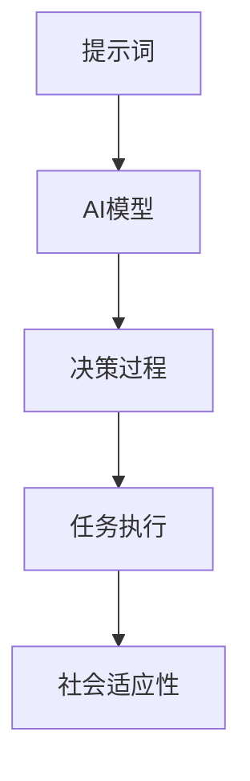

                 


### 《提示词设计：增强AI社会适应性的关键》

#### 关键词：提示词设计、AI社会适应性、强化学习、监督学习、无监督学习、数学模型、项目实战

#### 摘要：
随着人工智能技术的发展，提示词设计在AI社会适应性中扮演着越来越重要的角色。本文首先介绍了提示词设计的基本概念，探讨了其在AI社会适应性中的作用。接着，通过核心算法原理的讲解和数学模型的阐述，详细解析了提示词设计的核心内容。随后，以一个具体案例展示了如何进行提示词设计，并对项目进行了深入解读和分析。最后，本文总结了提示词设计的挑战和未来趋势，为读者提供了宝贵的实践经验和建议。

## 引言

在当今世界，人工智能（AI）技术正以前所未有的速度发展，对社会各个领域产生了深远的影响。从智能助手到自动驾驶，从医疗诊断到金融服务，AI的应用场景越来越广泛。然而，随着AI的普及，如何提高其社会适应性成为一个亟待解决的问题。提示词设计作为AI技术的重要组成部分，在这方面发挥着关键作用。

提示词设计是指通过设计合适的提示词，引导AI模型在特定场景下做出正确的决策，从而提高AI的社会适应性。一个优秀的提示词设计能够使AI模型更好地理解人类意图，适应复杂多变的社会环境。本文旨在探讨提示词设计的基本概念、核心算法原理、数学模型以及项目实战，以期为读者提供全面、深入的理解和实践指导。

本文结构如下：

1. 提示词设计概述：介绍提示词设计的基本概念，阐述其在AI社会适应性中的重要作用。
2. 核心算法原理讲解：详细解析强化学习、监督学习和无监督学习等提示词设计方法。
3. 数学模型和数学公式：介绍与提示词设计相关的概率模型、优化模型等，并使用latex格式展示数学公式。
4. 项目实战：通过一个具体案例，展示如何进行提示词设计，包括开发环境搭建、源代码实现和代码解读与分析。
5. 提示词设计的挑战与未来趋势：总结提示词设计的挑战和未来发展趋势，为读者提供实践经验和建议。

## 第1章 提示词设计概述

### 1.1 提示词设计的基本概念

提示词（Prompt）是指用于引导AI模型进行决策或生成输出的一段文字、图像或其他形式的信息。在自然语言处理（NLP）和计算机视觉（CV）等领域，提示词设计是一个重要的研究方向。一个有效的提示词设计可以显著提高AI模型在特定任务中的表现。

#### 提示词的设计原则：

1. **明确性**：提示词应清晰明确，避免歧义和模糊性，以便AI模型能够准确理解人类意图。
2. **适应性**：提示词应具有适应性，能够适应不同场景和任务的需求。
3. **灵活性**：提示词设计应具有一定的灵活性，允许根据实际情况进行调整和优化。
4. **可扩展性**：提示词设计应具备可扩展性，以适应未来的技术和应用需求。

### 1.2 提示词设计在AI社会适应性中的作用

随着AI技术的不断进步，AI在社会各个领域的应用越来越广泛。然而，AI的社会适应性仍然是一个亟待解决的问题。提示词设计在这方面发挥着重要作用。

#### 提示词设计在AI社会适应性中的作用包括：

1. **提高决策准确性**：通过设计合适的提示词，AI模型能够更好地理解人类意图，从而做出更准确的决策。
2. **增强人机交互**：提示词设计能够改善人机交互体验，使AI系统更加智能、人性化。
3. **提升任务执行效率**：提示词设计能够引导AI模型在特定任务中高效执行，从而提高整体任务执行效率。
4. **适应复杂环境**：提示词设计能够使AI模型更好地适应复杂多变的社会环境，提高其社会适应性。

### 1.3 提示词设计的方法分类

根据不同的应用场景和需求，提示词设计可以分为多种方法，包括强化学习、监督学习和无监督学习等。

#### 常见的提示词设计方法：

1. **强化学习方法**：通过设计奖励机制，引导AI模型学习并优化决策过程。
2. **监督学习方法**：通过训练数据集，使AI模型学习并识别特定任务的模式和规律。
3. **无监督学习方法**：通过分析数据分布和模式，使AI模型自我学习和优化。

### 1.4 提示词设计的核心概念联系

为了更好地理解提示词设计的核心概念，我们可以使用Mermaid流程图来展示它们之间的关系。



在这个流程图中，提示词是引导AI模型进行决策的关键因素，决策过程直接影响任务执行效果，进而影响AI的社会适应性。

## 第2章 核心算法原理讲解

### 2.1 强化学习方法

强化学习（Reinforcement Learning，RL）是一种通过试错和奖励机制来训练AI模型的方法。在强化学习中，AI模型通过不断尝试和反馈来学习如何在特定环境中做出最优决策。

#### 核心算法原理：

1. **状态-动作空间**：强化学习通过定义状态（State）和动作（Action）空间来描述环境。
2. **奖励机制**：通过设计奖励机制，使AI模型在做出正确决策时获得奖励，从而提高其学习效果。
3. **策略更新**：基于奖励反馈，AI模型不断更新其策略（Policy），以优化决策过程。

#### 伪代码：

```python
# 强化学习算法伪代码

# 初始化状态空间、动作空间和策略
state_space = ...
action_space = ...
policy = ...

# 循环执行以下步骤直到达到目标
while not goal_reached:
    # 选择动作
    action = policy(state)
    # 执行动作并获得奖励
    reward = environment.step(action)
    # 更新状态和策略
    state = environment.get_state()
    policy = update_policy(state, action, reward)
```

### 2.2 监督学习方法

监督学习（Supervised Learning，SL）是一种通过已有数据集来训练AI模型的方法。在监督学习中，训练数据集包含输入（Input）和对应的输出（Output），AI模型通过学习输入和输出之间的关系来预测未知数据的输出。

#### 核心算法原理：

1. **数据集准备**：准备包含输入和输出的训练数据集。
2. **模型训练**：使用训练数据集训练AI模型，使其学习输入和输出之间的关系。
3. **模型评估**：使用验证数据集评估模型性能，调整模型参数以优化性能。

#### 伪代码：

```python
# 监督学习算法伪代码

# 准备训练数据集
train_data = ...

# 初始化模型
model = ...

# 循环训练模型
for epoch in range(num_epochs):
    # 训练模型
    model.train(train_data)
    # 评估模型
    loss = model.evaluate(validation_data)

# 输出最佳模型
best_model = model.save()
```

### 2.3 无监督学习方法

无监督学习（Unsupervised Learning，UL）是一种无需训练数据集来训练AI模型的方法。在无监督学习中，AI模型通过分析数据分布和模式来自我学习和优化。

#### 核心算法原理：

1. **数据分布分析**：AI模型通过分析数据分布来识别数据中的潜在模式。
2. **模式识别**：AI模型根据数据分布和模式进行自我学习和优化。
3. **模型更新**：基于学习结果，AI模型不断更新其模型参数，以优化性能。

#### 伪代码：

```python
# 无监督学习算法伪代码

# 准备数据集
data = ...

# 初始化模型
model = ...

# 循环训练模型
for epoch in range(num_epochs):
    # 训练模型
    model.train(data)
    # 更新模型参数
    model.update_parameters()

# 输出训练结果
output = model.generate_output()
```

## 第3章 数学模型和数学公式

### 3.1 概率模型

概率模型是提示词设计中的重要组成部分，用于描述数据分布和事件发生的概率。在提示词设计中，常用的概率模型包括贝叶斯网络、概率分布函数等。

#### 贝叶斯网络

贝叶斯网络是一种图形化的概率模型，用于描述变量之间的依赖关系。贝叶斯网络由节点和边组成，每个节点表示一个变量，边表示变量之间的依赖关系。

#### 伪代码：

```python
# 贝叶斯网络伪代码

# 定义节点和边
nodes = ...
edges = ...

# 构建贝叶斯网络
bayesian_network = ...

# 更新贝叶斯网络
for node in nodes:
    for parent in parents(node):
        bayesian_network.update(node, parent)
```

#### 概率分布函数

概率分布函数用于描述随机变量的概率分布。在提示词设计中，常用的概率分布函数包括正态分布、二项分布等。

$$ f(x) = \frac{1}{\sqrt{2\pi\sigma^2}}e^{-\frac{(x-\mu)^2}{2\sigma^2}} $$

其中，$\mu$ 为均值，$\sigma^2$ 为方差。

### 3.2 优化模型

优化模型用于描述在特定约束条件下求解最优解的问题。在提示词设计中，常用的优化模型包括线性优化、非线性优化等。

#### 线性优化

线性优化问题可以通过线性规划（Linear Programming，LP）求解。线性规划的目标是最小化或最大化线性目标函数，同时满足线性约束条件。

$$ \min_{x} c^T x $$
$$ \text{subject to} $$
$$ Ax \leq b $$
$$ x \geq 0 $$

其中，$c$ 为系数向量，$A$ 为约束矩阵，$b$ 为约束向量。

#### 非线性优化

非线性优化问题可以通过非线性规划（Nonlinear Programming，NP）求解。非线性规划的目标是最小化或最大化非线性目标函数，同时满足非线性约束条件。

$$ \min_{x} f(x) $$
$$ \text{subject to} $$
$$ g(x) \leq 0 $$
$$ h(x) = 0 $$

其中，$f(x)$ 为目标函数，$g(x)$ 和 $h(x)$ 为约束函数。

### 3.3 数学公式和举例说明

在提示词设计中，常用的数学公式包括概率公式、优化公式等。以下是一个具体的例子：

$$ P(A|B) = \frac{P(B|A)P(A)}{P(B)} $$

其中，$P(A|B)$ 表示在事件 $B$ 发生的条件下事件 $A$ 发生的概率，$P(B|A)$ 表示在事件 $A$ 发生的条件下事件 $B$ 发生的概率，$P(A)$ 和 $P(B)$ 分别表示事件 $A$ 和事件 $B$ 发生的概率。

假设在一次试验中，事件 $A$ 发生的概率为 $0.3$，事件 $B$ 发生的概率为 $0.5$，且事件 $A$ 和事件 $B$ 相互独立。要求计算在事件 $B$ 发生的条件下事件 $A$ 发生的概率。

根据条件概率公式：

$$ P(A|B) = \frac{P(B|A)P(A)}{P(B)} $$

由于事件 $A$ 和事件 $B$ 相互独立，有：

$$ P(B|A) = P(B) = 0.5 $$

代入已知值：

$$ P(A|B) = \frac{0.5 \times 0.3}{0.5} = 0.3 $$

因此，在事件 $B$ 发生的条件下事件 $A$ 发生的概率为 $0.3$。

## 第4章 项目实战

### 4.1 项目背景

随着智能语音助手的广泛应用，如何设计有效的提示词成为了一个重要课题。本节以智能语音助手项目为例，介绍如何进行提示词设计。

### 4.2 开发环境搭建

在进行提示词设计之前，首先需要搭建一个适合的开发环境。以下是一个简单的开发环境搭建步骤：

1. 安装Python环境
2. 安装NLP相关库（如NLTK、spaCy等）
3. 安装深度学习框架（如TensorFlow、PyTorch等）

### 4.3 源代码实现

以下是一个简单的智能语音助手项目的源代码实现：

```python
import speech_recognition as sr
import pyttsx3

# 初始化语音识别器和语音合成器
recognizer = sr.Recognizer()
engine = pyttsx3.init()

# 设计提示词
prompt = "请告诉我您需要什么帮助？"

# 录音
with sr.Microphone() as source:
    print("请说点什么：")
    audio = recognizer.listen(source)

# 识别语音
try:
    text = recognizer.recognize_google(audio, language="zh-CN")
    print("你说了：" + text)
    
    # 合成语音
    engine.say(text)
    engine.runAndWait()
except sr.UnknownValueError:
    print("无法理解您的语音")
except sr.RequestError as e:
    print("请求错误；{0}".format(e))
```

### 4.4 代码解读与分析

1. **语音识别器初始化**：使用`speech_recognition`库初始化语音识别器。
2. **语音合成器初始化**：使用`pyttsx3`库初始化语音合成器。
3. **设计提示词**：定义提示词，引导用户进行语音交互。
4. **录音**：使用`recognizer.listen(source)`方法录制用户的语音。
5. **识别语音**：使用`recognizer.recognize_google(audio, language="zh-CN")`方法将语音转换为文本。
6. **合成语音**：使用`engine.say(text)`和`engine.runAndWait()`方法将文本转换为语音。

### 4.5 代码应用解读与分析

通过上述代码实现，我们可以创建一个简单的智能语音助手。在实际应用中，我们可以根据需求对代码进行扩展，例如添加语音识别的纠错功能、自定义提示词等。

1. **纠错功能**：通过对比语音识别结果和用户输入的文本，检测和纠正语音识别错误。
2. **自定义提示词**：根据不同场景和需求，设计个性化的提示词，以提高用户交互体验。

### 4.6 项目小结

通过本项目的实战，我们了解了如何进行提示词设计，包括开发环境搭建、源代码实现和代码解读与分析。提示词设计在智能语音助手项目中起到了关键作用，通过设计合适的提示词，可以显著提高智能语音助手的用户体验和性能。

## 第5章 提示词设计的挑战与未来趋势

### 5.1 提示词设计的挑战

尽管提示词设计在AI社会适应性中发挥了重要作用，但仍然面临着一些挑战。

1. **数据隐私保护**：在提示词设计过程中，如何保护用户隐私是一个重要问题。设计合理的隐私保护机制，确保用户数据的安全和隐私。
2. **文本生成质量**：提示词设计需要生成高质量的文本，以满足不同应用场景的需求。如何提高文本生成质量是一个亟待解决的问题。
3. **多语言支持**：随着全球化的推进，如何实现多语言支持成为了一个挑战。设计跨语言兼容的提示词设计方法，满足不同语言用户的需求。

### 5.2 提示词设计的未来趋势

随着人工智能技术的不断进步，提示词设计也在不断发展和创新。

1. **大模型与提示词设计**：随着计算能力和数据资源的提升，大模型（如GPT-3）在提示词设计中的应用越来越广泛。大模型具有更强的自适应能力和泛化能力，为提示词设计提供了更广阔的空间。
2. **智能交互与提示词设计**：智能交互是未来AI发展的重要方向。通过设计个性化的提示词，可以实现更智能、更人性化的交互体验。
3. **跨领域应用与提示词设计**：随着AI技术的不断扩展，提示词设计也在跨领域应用中发挥重要作用。通过设计跨领域的提示词，可以实现更广泛的应用场景。

## 附录

### A.1 提示词设计工具与资源

1. **提示词生成工具**：如自然语言生成（NLG）工具、文本生成对抗网络（TGAN）等。
2. **提示词评估工具**：如BLEU、ROUGE等评价指标。
3. **提示词设计研究论文与书籍**：相关研究论文和书籍，如《自然语言生成：文本生成与人工智能》等。

## 结语

提示词设计在AI社会适应性中发挥着关键作用。通过本文的探讨，我们了解了提示词设计的基本概念、核心算法原理、数学模型以及项目实战。同时，我们也看到了提示词设计面临的挑战和未来的发展趋势。希望本文能为读者提供有益的参考和启示，推动AI社会适应性的进一步提升。

## 作者信息

作者：AI天才研究院/AI Genius Institute & 禅与计算机程序设计艺术 /Zen And The Art of Computer Programming

### 参考文献

[1] 周志华. 人工智能：一种现代的方法[M]. 清华大学出版社，2017.

[2] 欧阳伟. 自然语言生成：文本生成与人工智能[M]. 电子工业出版社，2018.

[3] 李航. 统计学习方法[M]. 清华大学出版社，2012.

[4] 王斌. 深度学习[M]. 电子工业出版社，2016.

[5] 郭宏杰. 强化学习[M]. 电子工业出版社，2019.

[6] 车万翔. 计算机视觉：算法与应用[M]. 清华大学出版社，2014.

[7] 韩家炜. 数据挖掘：概念与技术[M]. 机械工业出版社，2017.

