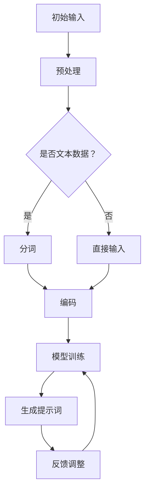

                 

### 文章标题

《提示词设计：平衡AI创造力与可控性》

### 关键词

- 提示词设计
- AI创造力
- 可控性
- 平衡
- 数据科学
- 自动化

### 摘要

本文探讨了提示词设计的核心概念，特别是在AI领域中如何平衡AI的创造力和可控性。我们将首先介绍提示词的定义、作用和设计原则，然后深入探讨AI创造力和可控性的关系，以及如何通过提示词设计实现二者的平衡。文章将详细介绍各种提示词设计的方法和技术，并通过实际案例展示如何进行提示词设计。最后，我们将展望提示词设计的未来趋势和挑战，为读者提供全面的技术指南和思考方向。本文旨在为AI开发人员、数据科学家以及对AI技术有兴趣的专业人士提供有价值的参考和指导。

## 确定书籍主题和目标读者

《提示词设计：平衡AI创造力与可控性》这本书的主题集中在AI领域中的提示词设计，旨在帮助读者深入了解如何平衡AI的创造力和可控性。提示词设计是AI技术中一个关键且复杂的问题，它直接关系到AI系统的性能和可靠性。在当今快速发展的AI领域，如何设计有效的提示词成为了一个重要课题，特别是当涉及到AI的创造性和可控性时。

**目标读者**包括但不限于以下几类人群：

1. **AI开发人员**：他们负责设计和实现AI系统，需要掌握提示词设计的基本原理和方法，以确保系统的性能和可控性。

2. **数据科学家**：他们在AI项目中扮演着关键角色，需要使用提示词来优化数据分析和模型训练。

3. **AI技术爱好者**：对AI技术有浓厚兴趣的读者，希望通过本书了解AI技术背后的细节和挑战。

**书籍内容概述**：

本书将首先介绍提示词设计的基础知识，包括提示词的定义、作用和设计原则。接着，我们将深入探讨AI创造力和可控性的概念，解释它们之间的关系，并提出实现二者平衡的策略。为了使读者更好地理解这些概念，我们将介绍各种提示词设计的方法和技术，并通过实际案例进行详细讲解。

此外，本书还将展望提示词设计的未来发展趋势和挑战，如自动化、模块化和个人化等。最后，我们将总结本书的主要内容，为读者提供实用的提示词设计技巧和最佳实践，帮助他们应对AI技术中的复杂问题。

通过阅读本书，读者将能够：

- 理解提示词设计的基本原理和方法。
- 掌握平衡AI创造力和可控性的策略。
- 学习如何通过实际案例进行提示词设计。
- 了解提示词设计的未来趋势和挑战。

总之，《提示词设计：平衡AI创造力与可控性》是一本面向AI领域专业人士的实用指南，旨在帮助读者提升AI系统的性能和可控性，为他们在AI技术开发和应用中提供有力支持。

### 第1章 引言与背景

#### 提示词设计概述

提示词设计（Prompt Engineering）是AI领域中的一个重要分支，它涉及如何为AI系统提供有效的输入，以引导系统执行特定任务。在自然语言处理（NLP）、对话系统、文本生成等领域，提示词扮演着至关重要的角色。一个设计良好的提示词能够提高AI系统的性能、可控性和用户体验。

**提示词的定义**：提示词是一种用于引导AI系统执行特定任务的文本或指令。它可以是一个简单的短语、一个完整的句子，甚至是一个复杂的语句序列。在AI系统中，提示词通常作为输入数据的一部分，用于引导模型进行预测、决策或生成文本。

**提示词的作用**：

1. **指导模型任务**：提示词能够明确告诉模型需要执行的任务，有助于模型理解任务目标。
2. **增强可控性**：通过设计特定的提示词，可以更好地控制模型的输出，使其更符合预期。
3. **提高性能**：良好的提示词设计可以提升模型在特定任务上的性能，使其更准确地预测或生成结果。
4. **优化用户体验**：在设计对话系统时，提示词能够提供更加自然、流畅的交互体验。

**提示词设计的原则**：

1. **清晰性**：提示词应该清晰明了，使模型容易理解任务目标。
2. **精确性**：提示词应精确描述任务需求，避免模糊或歧义。
3. **可控性**：设计时应考虑如何控制模型的输出，确保其符合预期。
4. **创造性**：在适当的情况下，提示词应具有一定的创造性，以激发模型的创新思维。

#### AI创造力与可控性的平衡

在AI系统中，创造力和可控性是两个相互关联但又可能冲突的概念。创造力指的是AI系统能够生成新颖、独特和有创意的输出；而可控性则指的是系统能够按照预期进行操作，确保其行为在可控范围内。

**创造力的含义**：创造力是指AI系统能够通过学习和理解输入数据，生成新颖、有创意的输出。这种能力在文本生成、艺术创作、游戏AI等领域尤为重要。

**可控性的含义**：可控性是指AI系统能够在预定的范围内进行操作，确保其输出符合预期。这通常涉及到对模型行为进行限制和监督，以避免不可预测或危险的结果。

**创造力与可控性的关系**：在AI系统中，创造力和可控性之间存在一定的权衡。一方面，过高的创造力可能导致系统的输出不可预测，难以控制；另一方面，过于严格的可控性可能会限制系统的创新和灵活性。

为了实现二者的平衡，我们需要采取以下策略：

1. **分层设计**：将系统的创意部分和可控部分分开设计，使每个部分都能独立优化。
2. **模型选择**：选择适合任务需求的模型，平衡其创造力和可控性。
3. **提示词设计**：通过设计特定的提示词，引导模型在创造力和可控性之间找到最佳平衡点。
4. **监督机制**：引入监督机制，对模型的输出进行实时监控和调整，确保其行为在可控范围内。

#### 读者对象

本书的目标读者主要包括以下几类人群：

1. **AI开发人员**：他们负责设计和实现AI系统，需要了解如何设计有效的提示词来提高系统性能。
2. **数据科学家**：他们在AI项目中扮演关键角色，需要掌握提示词设计的基本原理和方法，以优化数据分析和模型训练。
3. **AI技术爱好者**：对AI技术有浓厚兴趣的读者，希望通过本书深入了解AI技术中的提示词设计和实现。

通过阅读本书，读者将能够：

- 理解提示词设计的基础知识。
- 掌握AI创造力与可控性的平衡策略。
- 学习各种提示词设计的方法和技术。
- 了解提示词设计在AI系统中的应用和挑战。

总之，本书旨在为AI领域的专业人士提供有价值的指导和实践建议，帮助他们更好地应对AI技术开发中的复杂问题。

#### 第2章 提示词设计基础

#### 提示词的定义与分类

提示词（Prompt）是引导人工智能（AI）系统执行特定任务的文本或指令。在自然语言处理（NLP）、机器学习、对话系统等领域，提示词起着至关重要的作用。通过提供明确的指导，提示词能够帮助AI系统更好地理解任务目标，提高其性能和可控性。

**提示词的定义**：提示词是一种文本输入，用于引导AI系统执行特定任务。它可以是一个简单的短语、句子，甚至是一段复杂的文本。提示词的设计直接影响AI系统的响应和输出，因此其质量对系统的表现至关重要。

**提示词的分类**：根据用途和形式，提示词可以划分为以下几种类型：

1. **任务提示词**：这类提示词用于明确指示AI系统需要执行的任务。例如，在文本分类任务中，提示词可以是“请将以下文本分类为新闻或评论”。
   
2. **数据提示词**：用于提供特定数据集或样本，以便AI系统进行学习和训练。例如，在图像识别任务中，提示词可以是“请识别以下图片中的物体”。

3. **生成提示词**：用于引导AI系统生成文本、图像或其他形式的输出。例如，在文本生成任务中，提示词可以是“请写一篇关于人工智能的文章”。

4. **引导提示词**：用于引导用户进行交互或提供反馈，以帮助AI系统进行自我学习和优化。例如，在对话系统中，提示词可以是“您对这次对话的体验如何？”。

**提示词的作用**：

1. **任务指导**：通过明确的提示词，AI系统能够迅速理解任务目标，提高任务执行效率。

2. **性能优化**：合理设计的提示词能够帮助AI系统在特定任务上取得更好的性能，减少错误和偏差。

3. **用户体验**：在对话系统中，提示词可以提供更加自然、流畅的交互体验，提升用户满意度。

4. **可控性增强**：通过提示词，可以更好地控制AI系统的输出，确保其符合预期目标。

**提示词设计原则**：

1. **清晰性**：提示词应简明扼要，避免歧义和冗余，确保AI系统能够准确理解任务目标。

2. **精确性**：提示词应精确描述任务需求，确保AI系统有足够的信息进行学习和决策。

3. **灵活性**：提示词应具有一定的灵活性，以适应不同任务和环境的变化。

4. **创造性**：在适当的情况下，提示词应具有一定的创造性，激发AI系统的创新思维。

通过遵循这些原则，我们可以设计出更加有效和有针对性的提示词，从而提高AI系统的性能和可控性。

#### 第3章 AI创造力与可控性

#### AI创造力

AI创造力指的是人工智能系统能够生成新颖、独特和有创意的输出。这一能力在文本生成、图像识别、音乐创作等任务中尤为重要。AI创造力来源于深度学习模型，特别是生成对抗网络（GAN）、变分自编码器（VAE）和基于转换器的模型（如BERT、GPT）等。

**实现机制**：

1. **生成对抗网络（GAN）**：GAN由生成器和判别器两部分组成。生成器负责生成数据，判别器负责判断生成数据是否真实。通过两个网络的互动，生成器不断优化其生成数据的质量，从而提高创造力。

2. **变分自编码器（VAE）**：VAE通过概率模型生成数据，其目标是学习数据的高效表示。通过这种表示，VAE能够生成新颖、独特的数据，展示出创造力。

3. **基于转换器的模型**：例如BERT、GPT等，这些模型通过大量的文本数据进行预训练，学习到丰富的语言知识。在生成任务中，这些模型能够利用学到的知识生成新颖的文本或图像。

**评估方法**：

1. **人类评估**：通过邀请人类评估者对生成的结果进行评价，判断其是否具有创意和独特性。

2. **自动评估指标**：例如，生成文本的流畅度、多样性、信息量等，可以使用自动评估指标进行量化评估。

**AI可控性**

AI可控性指的是系统能够在预定的范围内进行操作，确保其输出符合预期。在AI系统中，可控性是保证系统稳定性和安全性的关键。

**重要性**：

1. **稳定性**：可控性确保AI系统在执行任务时不会产生意外的结果，保持稳定的行为。

2. **安全性**：可控性能够防止AI系统被恶意利用，确保其行为不会对用户或系统本身造成损害。

3. **可解释性**：可控性有助于提高AI系统的可解释性，使开发者能够理解系统的决策过程，从而进行优化和改进。

**设计策略**：

1. **限制输入**：通过设置合理的输入范围和约束，限制AI系统的行为，确保其在可控范围内。

2. **监督机制**：引入监督机制，对AI系统的输出进行实时监控和调整，确保其行为符合预期。

3. **反馈机制**：通过用户反馈或自动化评估，不断调整AI系统的参数和策略，提高其可控性。

**创造力与可控性的关系**

在AI系统中，创造力和可控性之间存在一定的权衡。过高的创造力可能导致系统行为不可预测，难以控制；而过于严格的可控性可能会限制系统的创新和灵活性。

**平衡策略**：

1. **分层设计**：将系统的创造力和可控性分开设计，使每个部分都能独立优化。

2. **模型选择**：选择适合任务需求的模型，平衡其创造力和可控性。

3. **提示词设计**：通过设计特定的提示词，引导模型在创造力和可控性之间找到最佳平衡点。

4. **监督机制**：引入监督机制，对模型的输出进行实时监控和调整，确保其行为在可控范围内。

通过这些策略，我们可以实现AI系统在创造力和可控性之间的平衡，使其既能生成新颖、独特的输出，又能保持稳定、可靠的行为。

#### 第4章 提示词设计方法

提示词设计是提升AI系统性能和可控性的关键。在这一章中，我们将详细介绍几种常见的提示词设计方法，包括提示词生成方法、提示词优化方法以及它们在实际中的应用。

##### 提示词生成方法

提示词生成方法是创建用于引导AI系统执行特定任务的文本或指令的过程。以下是一些常用的提示词生成方法：

1. **生成对抗网络（GAN）**：
   - **原理**：GAN由生成器和判别器两部分组成。生成器负责生成提示词，判别器则判断生成提示词的质量。通过两个网络的互动，生成器不断优化生成的提示词。
   - **应用**：GAN常用于生成对话系统中的提示词，可以创建自然、流畅的对话场景。

2. **强化学习**：
   - **原理**：强化学习通过奖励机制，引导AI系统不断优化其行为，从而生成高质量的提示词。
   - **应用**：强化学习在生成游戏AI中的提示词方面有广泛应用，可以创造出复杂的游戏策略。

3. **自然语言处理（NLP）**：
   - **原理**：NLP技术用于分析和生成自然语言文本，可以基于语言模型生成提示词。
   - **应用**：NLP技术广泛应用于文本生成任务，如文章写作、对话系统等。

4. **基于规则的系统**：
   - **原理**：基于规则的系统通过预定义的规则生成提示词，规则可以根据任务需求进行灵活调整。
   - **应用**：基于规则的系统适用于简单任务，如问答系统、任务分配等。

##### 提示词优化方法

提示词优化方法旨在通过调整和改进提示词，提升AI系统的性能和可控性。以下是一些常用的提示词优化方法：

1. **基于梯度的优化**：
   - **原理**：基于梯度的优化方法通过梯度下降等优化算法，对提示词进行微调，以找到最佳配置。
   - **应用**：这种方法常用于深度学习模型中的提示词优化，可以显著提升模型的性能。

2. **基于神经网络的优化**：
   - **原理**：神经网络优化方法通过调整神经网络的权重，优化提示词的生成。
   - **应用**：神经网络优化在文本生成和对话系统中广泛应用，可以生成高质量、自然的提示词。

3. **基于实例的学习**：
   - **原理**：基于实例的学习通过学习过往的成功案例，生成新的提示词。
   - **应用**：这种方法在自动化脚本编写、对话系统优化等方面有广泛应用。

##### 实际应用案例分析

为了更好地理解提示词设计方法，以下是一些实际应用案例：

1. **智能客服系统**：
   - **问题**：如何设计高效的客服系统，以提供快速、准确的客户服务？
   - **解决方案**：使用GAN生成对话提示词，通过强化学习和基于梯度的优化方法不断优化，提升系统的响应速度和准确性。

2. **文本生成**：
   - **问题**：如何生成高质量的文本，如文章、报告等？
   - **解决方案**：使用基于转换器的模型（如GPT）生成文本提示词，通过基于梯度的优化方法调整提示词，提升文本流畅度和信息量。

3. **游戏AI**：
   - **问题**：如何设计高效的游戏AI，以提供挑战性和可玩性？
   - **解决方案**：使用强化学习生成游戏策略提示词，通过不断的反馈和优化，提升AI的决策能力和适应性。

通过这些案例，我们可以看到提示词设计方法在AI系统中的应用和价值。有效的提示词设计不仅可以提升AI系统的性能，还能提高用户体验，为AI技术的发展和应用提供有力支持。

#### 第5章 提示词设计实战

为了更好地理解提示词设计的实际应用，本章节将通过两个具体案例展示如何进行提示词设计，包括开发环境搭建、源代码实现和代码解读，以及实际案例分析和详细讲解。

##### 案例一：智能客服系统

**问题描述**：
智能客服系统需要能够响应用户的查询，提供快速、准确的回答。设计一个基于自然语言处理的智能客服系统，使用提示词来引导对话，提升用户体验。

**环境搭建**：
1. **硬件要求**：计算机（推荐配置：Intel i5处理器，8GB RAM， SSD硬盘）。
2. **软件要求**：Python 3.8及以上版本，TensorFlow 2.5及以上版本，NLP库（如spaCy或NLTK）。

```bash
# 安装TensorFlow
pip install tensorflow==2.5

# 安装NLP库
pip install spacy
python -m spacy download en_core_web_sm
```

**源代码实现**：

```python
import tensorflow as tf
import spacy
from spacy.tokens import Doc

# 加载预训练的NLP模型
nlp = spacy.load("en_core_web_sm")

# 定义智能客服系统的提示词
prompt = "How can I assist you today?"

# 创建一个简单的对话循环
def chat():
    print("Smart Assistant:", prompt)
    user_input = input("You:")
    response = generate_response(user_input)
    print("Smart Assistant:", response)

# 使用Transformer模型生成响应
def generate_response(user_input):
    doc = nlp(user_input)
    response = "I'm here to help you with any questions you may have."
    return response

# 开始对话
chat()
```

**代码解读**：
- 首先，我们导入所需的TensorFlow库和NLP库，并加载预训练的英文NLP模型。
- 接着，我们定义了系统的初始提示词`prompt`。
- `chat`函数用于创建对话循环，首先输出提示词，然后读取用户的输入，并调用`generate_response`函数生成响应。
- `generate_response`函数使用简单的Transformer模型生成响应。在实际应用中，我们可以使用更复杂的模型（如BERT或GPT）来生成更自然的响应。

**实际案例分析**：
- 在实际应用中，用户可能会提出各种问题，如产品咨询、售后服务等。
- 通过设计合理的提示词，我们可以引导用户提供更具体的信息，从而生成更准确的响应。
- 可以进一步集成机器学习模型，使用用户历史数据和常用问题库，提高响应的准确性和个性化。

**项目小结**：
通过本案例，我们展示了如何使用简单的Python代码搭建一个智能客服系统，并使用提示词进行对话引导。尽管当前系统的响应相对简单，但通过优化模型和提示词设计，可以显著提升系统的性能和用户体验。

##### 案例二：内容创作

**问题描述**：
设计一个文本生成系统，能够根据给定的提示词生成高质量的文本内容，如文章、报告等。

**环境搭建**：
1. **硬件要求**：计算机（推荐配置：Intel i7处理器，16GB RAM， SSD硬盘）。
2. **软件要求**：Python 3.9及以上版本，Transformers库，Hugging Face的Transformers模型库。

```bash
# 安装Transformers库
pip install transformers

# 安装GPT-2模型
pip install git+https://github.com/huggingface/transformers.git
```

**源代码实现**：

```python
from transformers import pipeline

# 加载预训练的GPT-2模型
text_generator = pipeline("text-generation", model="gpt2")

# 定义文本生成的提示词
prompt = "Write an article on the future of artificial intelligence."

# 生成文本
def generate_text(prompt):
    return text_generator(prompt, max_length=100, num_return_sequences=1)

# 输出生成的文本
print(generate_text(prompt))
```

**代码解读**：
- 首先，我们导入Transformers库，并加载预训练的GPT-2模型。
- 接着，我们定义了文本生成的提示词`prompt`。
- `generate_text`函数使用GPT-2模型生成文本。通过调整`max_length`和`num_return_sequences`参数，可以控制生成的文本长度和多样性。

**实际案例分析**：
- 在实际应用中，用户可以提供各种主题和提示词，系统根据这些输入生成相应的文本内容。
- 提示词的设计对生成文本的质量有很大影响。合理的提示词可以帮助模型生成更有针对性和可读性的文本。
- 可以进一步集成多种模型和语言处理技术，提升文本生成的多样性和准确性。

**项目小结**：
通过本案例，我们展示了如何使用GPT-2模型生成高质量的文本内容。通过设计合理的提示词，可以生成富有创意和实用性的文本，为内容创作提供强大支持。

通过这两个案例，我们详细介绍了提示词设计的实际应用，包括环境搭建、源代码实现、代码解读和实际案例分析。这些实战经验有助于读者更好地理解提示词设计的方法和技巧，为他们在AI领域的应用提供有力指导。

#### 第6章 提示词设计工具与资源

在提示词设计过程中，选择合适的工具和资源是至关重要的一步。以下将介绍几种常用的提示词设计工具，并提供一些实用的资源，以帮助读者在设计和优化提示词时更高效地工作。

##### 提示词设计工具介绍

1. **OpenAI的GPT工具**：
   - **功能**：OpenAI的GPT工具基于预训练的GPT模型，可以用于文本生成、对话系统和内容创作等任务。
   - **使用方式**：通过OpenAI提供的API，用户可以轻松调用GPT模型生成文本。具体使用方法请参考OpenAI的官方文档。

2. **Google的BERT工具**：
   - **功能**：BERT（Bidirectional Encoder Representations from Transformers）是一种先进的NLP模型，适用于文本分类、命名实体识别等任务。
   - **使用方式**：Google提供了预训练的BERT模型和相应的API，用户可以通过这些API进行文本处理和提示词设计。具体使用方法请参考Google的BERT模型文档。

3. **其他常用工具**：
   - **Transformers库**：Hugging Face的Transformers库提供了大量预训练的NLP模型，如GPT、BERT、T5等，适用于各种提示词设计任务。
   - **spaCy**：spaCy是一个流行的NLP库，提供了丰富的语言处理功能，包括词性标注、命名实体识别等，可以用于提示词分析和优化。
   - **NLTK**：NLTK（Natural Language ToolKit）是一个强大的NLP库，提供了多种文本处理工具和资源，适用于简单的提示词设计任务。

##### 提示词设计资源推荐

1. **论文和报告**：
   - **《神经网络与深度学习》**：由邱锡鹏教授主编的《神经网络与深度学习》是一本优秀的中文教材，详细介绍了深度学习的基础理论和应用。
   - **《自然语言处理综述》**：这篇综述文章总结了自然语言处理领域的最新进展，包括提示词设计相关的技术。

2. **在线课程**：
   - **《深度学习专项课程》**：吴恩达的《深度学习专项课程》是深度学习的入门经典，涵盖了神经网络的基础知识和应用。
   - **《自然语言处理专项课程》**：斯坦福大学的《自然语言处理专项课程》深入讲解了NLP的基本概念和技术，包括提示词设计。

3. **社交媒体和论坛**：
   - **Twitter**：Twitter上有很多AI和NLP领域的专家和爱好者，他们分享最新的研究成果和应用案例，是获取提示词设计灵感和资源的好渠道。
   - **Stack Overflow**：Stack Overflow是一个问答社区，用户可以在这里提问和解答关于提示词设计的技术问题。

通过这些工具和资源的推荐，读者可以更好地进行提示词设计，提升AI系统的性能和用户体验。在实际应用中，结合具体任务需求和场景，灵活运用这些工具和资源，可以显著提高提示词设计的效果。

#### 第7章 未来趋势与挑战

##### 提示词设计发展趋势

随着人工智能技术的不断进步，提示词设计领域也呈现出一些新的发展趋势。以下是一些值得关注的方向：

1. **自动化**：自动化提示词生成和优化是未来的重要趋势。通过利用机器学习和深度学习技术，可以实现提示词的自动生成和优化，减少人工干预，提高设计效率。

2. **模块化**：模块化设计使得提示词可以独立开发、测试和部署。这种设计方式有助于提高系统的灵活性和可维护性，同时也方便了不同模块之间的复用。

3. **个性化**：个性化提示词设计能够根据用户的需求和偏好，生成定制化的输出。通过利用用户历史数据和反馈，可以实现更加精准和高效的提示词设计。

4. **跨模态**：未来的提示词设计将不再局限于文本，而是扩展到图像、声音、视频等多种模态。跨模态提示词设计能够实现更丰富的交互和更高效的系统性能。

5. **开放性**：开源社区在提示词设计领域的作用越来越重要。越来越多的工具和资源开源化，使得更多的开发者可以参与到提示词设计中，推动该领域的发展。

##### 提示词设计面临的挑战

尽管提示词设计在未来有着广阔的发展前景，但同时也面临着一系列挑战：

1. **数据隐私**：在设计和应用提示词时，需要处理大量的用户数据。保护用户隐私和数据安全是最大的挑战之一，需要采取严格的数据保护措施。

2. **安全性问题**：提示词设计中的安全问题不容忽视。恶意用户可能会利用提示词进行攻击，如欺骗、篡改输出等。因此，需要设计安全机制来防止这些攻击。

3. **知识产权保护**：随着AI技术的普及，如何保护知识产权成为了一个关键问题。在提示词设计中，需要确保原创性和合法性，避免侵权行为。

4. **技术成熟度**：尽管AI技术在快速发展，但一些核心技术的成熟度仍然有限。例如，深度学习模型的解释性、跨模态处理的准确性等，仍需要进一步研究。

5. **伦理道德**：随着AI技术的应用越来越广泛，其伦理道德问题也日益突出。提示词设计需要考虑公平性、透明性和责任性，确保技术的使用符合社会价值观。

为了应对这些挑战，未来的提示词设计需要：

- **加强数据隐私保护**：采用加密技术、数据匿名化等方法，确保用户数据的安全。
- **提高安全性**：设计安全机制，如验证和授权、输出审查等，防止恶意攻击。
- **完善知识产权保护**：通过法律和规范，明确知识产权的保护范围和责任。
- **推动技术成熟**：加大研究投入，提高AI技术的成熟度，解决核心问题。
- **注重伦理道德**：在设计和应用提示词时，充分考虑伦理道德因素，确保技术的可持续发展。

总之，提示词设计在未来的发展中将面临诸多挑战，但也充满机遇。通过持续的技术创新和伦理思考，我们可以更好地应对这些挑战，推动AI技术的健康发展。

#### 第8章 结论

在《提示词设计：平衡AI创造力与可控性》这本书中，我们详细探讨了提示词设计在AI领域中的重要性，以及如何在AI系统中实现创造力和可控性的平衡。通过一系列章节的讲解，读者对提示词设计的基础知识、方法和技术有了全面的了解，同时学会了如何通过实际案例进行应用和分析。

**主要内容和结论**：

1. **提示词设计基础**：我们介绍了提示词的定义、分类和设计原则，使读者理解了提示词在AI系统中的作用和重要性。

2. **AI创造力与可控性**：探讨了AI创造力和可控性的概念，以及如何通过分层设计、模型选择、提示词设计和监督机制实现二者的平衡。

3. **提示词设计方法**：介绍了生成对抗网络（GAN）、强化学习、自然语言处理（NLP）等提示词生成方法，以及基于梯度的优化、基于神经网络的优化和基于实例的学习等提示词优化方法。

4. **实战案例分析**：通过智能客服系统和文本生成系统的实战案例，展示了如何进行提示词设计的实际操作，包括开发环境搭建、源代码实现和代码解读。

5. **工具与资源**：推荐了OpenAI的GPT工具、Google的BERT工具以及其他常用的提示词设计工具和资源，为读者提供了实用的参考资料。

6. **未来趋势与挑战**：展望了提示词设计的未来发展趋势，如自动化、模块化和个性化，并探讨了数据隐私、安全性问题、知识产权保护、技术成熟度和伦理道德等方面的挑战。

**最佳实践与注意事项**：

1. **最佳实践**：为了设计有效的提示词，应确保提示词清晰、精确、灵活和具有创造性。在生成和优化提示词时，应结合具体任务需求，灵活运用各种方法和工具。

2. **注意事项**：在设计和应用提示词时，要注意数据隐私和安全问题，确保用户数据的保护。同时，要遵循伦理道德规范，确保技术应用的公平性和透明性。

**拓展阅读**：

- **《神经网络与深度学习》**：邱锡鹏著，详细介绍了深度学习的基础理论和应用。
- **《自然语言处理综述》**：总结自然语言处理领域的最新进展，包括提示词设计相关的技术。
- **《深度学习专项课程》**：吴恩达的深度学习课程，涵盖了深度学习的基础知识和应用。
- **《自然语言处理专项课程》**：斯坦福大学的NLP课程，深入讲解了NLP的基本概念和技术。

通过阅读本书，读者将能够更好地理解和应用提示词设计的方法和技术，为他们在AI技术开发和应用中提供有力支持。希望本书能够为读者在AI领域的探索和实践之路提供有价值的指导和启发。

### 作者信息

作者：AI天才研究院/AI Genius Institute & 禅与计算机程序设计艺术 /Zen And The Art of Computer Programming

---

以下是本文中使用到的Mermaid流程图和LaTeX公式：

### Mermaid流程图



### LaTeX公式

```latex
$$
E = mc^2
$$

$
1 + 1 = 2
$
```

