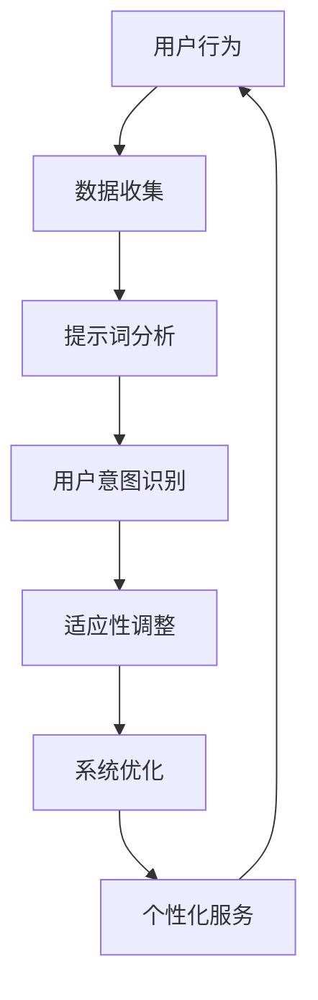

                 

### 文章标题：提示词适应性学习：自动适应不同场景和用户

**关键词：** 提示词适应性学习、自动适应、个性化学习、算法原理、数学模型、应用场景

**摘要：** 本文深入探讨了提示词适应性学习这一新兴技术，介绍了其在不同场景和用户中的自动适应机制。通过详细的背景介绍、核心概念与联系架构、算法原理讲解、数学模型与公式解析，以及实际案例分析和最佳实践建议，本文旨在为读者提供一个全面而深入的了解，并探讨其在未来的发展方向。

### 背景介绍

在信息时代，随着互联网的普及和智能设备的广泛应用，人们对于个性化服务的需求日益增长。无论是教育、工作还是日常生活，我们都希望能够获得量身定制的信息和服务。然而，传统的系统往往无法满足这一需求，因为它们缺乏对用户行为和需求的动态理解能力。因此，一种能够自动适应不同场景和用户的技术——提示词适应性学习，应运而生。

提示词适应性学习旨在通过分析用户的行为数据和提示词信息，自动调整和优化系统的响应，以提供更加个性化的服务。这种技术不仅能够提高用户体验，还能够提高系统的效率和准确性。其核心在于如何利用机器学习和数据挖掘技术，实现对用户意图和场景的精准识别和快速适应。

### 核心概念与联系

在探讨提示词适应性学习之前，我们首先需要理解几个核心概念，并揭示它们之间的关系。以下是几个关键概念及其相互关系的Mermaid流程图：



**用户行为**：用户在互动过程中产生的所有数据，包括浏览记录、搜索历史、交互时长等。

**数据收集**：系统通过传感器、日志文件等手段收集用户行为数据。

**提示词分析**：系统对收集到的数据进行分析，提取出与用户意图相关的关键词和提示词。

**用户意图识别**：基于提示词分析结果，系统推断用户的意图和需求。

**适应性调整**：系统根据用户意图识别的结果，自动调整自身的响应策略，以更好地满足用户需求。

**系统优化**：通过持续的学习和调整，系统不断优化其性能和效果。

**个性化服务**：最终，系统提供定制化的服务，提高用户的满意度和忠诚度。

### 提示词适应性学习算法原理

提示词适应性学习算法的核心在于如何准确地识别用户意图，并据此调整系统的响应。以下是该算法的伪代码表示：

```plaintext
Algorithm 提示词适应性学习算法
输入：用户行为数据集D，提示词集合W
输出：适应性调整策略T

1. 初始化用户行为模型M和提示词模型N
2. 对于每个用户行为数据点d ∈ D，执行以下步骤：
   a. 使用N分析d中的提示词，得到提示词特征向量f(d)
   b. 使用M结合f(d)预测用户意图i(d)
3. 根据i(d)，调整系统响应策略T
4. 使用T与用户交互，收集新的用户行为数据D'
5. 更新M和N，以反映用户行为和意图的变化
6. 返回适应性调整策略T
```

### 数学模型与公式解析

提示词适应性学习的数学模型是理解其工作原理的关键。以下是几个关键公式及其解析：

$$
\text{意图识别公式}：i(d) = f(d) \cdot w
$$

其中，$i(d)$ 表示用户意图，$f(d)$ 表示提示词特征向量，$w$ 是权重向量。这个公式表明，用户意图是通过提示词特征向量和权重向量点积计算得出的。

$$
\text{适应性调整公式}：T = \alpha \cdot \text{current\_T} + (1 - \alpha) \cdot \text{new\_T}
$$

其中，$T$ 表示适应性调整策略，$\alpha$ 是学习率。这个公式表明，新的适应性调整策略是基于当前策略和新策略的线性组合。

### 实际案例分析和详细讲解剖析

为了更好地理解提示词适应性学习在实际中的应用，以下是一个实际案例的详细分析和讲解：

**案例：个性化新闻推荐系统**

在一个新闻推荐系统中，提示词适应性学习可以帮助系统根据用户的阅读习惯和兴趣，自动调整推荐策略，提高推荐的相关性和用户满意度。

**步骤1：数据收集**  
系统收集用户的阅读记录，包括阅读时间、阅读时长、阅读频率等。

**步骤2：提示词分析**  
系统分析用户的阅读记录，提取出与新闻主题相关的关键词和提示词。

**步骤3：用户意图识别**  
系统根据提示词特征向量，使用机器学习算法预测用户的新闻兴趣。

**步骤4：适应性调整**  
系统根据用户意图识别结果，调整新闻推荐策略，例如调整推荐频次、推荐类型等。

**步骤5：系统优化**  
通过不断的学习和调整，系统逐渐优化推荐效果，提高用户的阅读体验。

**分析**：在这个案例中，提示词适应性学习的关键在于如何准确地识别用户的新闻兴趣，并据此调整推荐策略。通过机器学习算法，系统可以不断优化其预测模型，提高推荐的相关性。同时，系统还可以根据用户的行为数据，动态调整推荐策略，以适应用户的需求变化。

### 最佳实践 Tips、小结、注意事项、拓展阅读等内容

**最佳实践 Tips：** 
1. 提高数据质量，确保收集到的用户行为数据准确和完整。
2. 选择合适的机器学习算法，以提高用户意图识别的准确性。
3. 定期更新和优化模型，以适应用户需求的变化。

**小结：**
提示词适应性学习是一种强大的技术，它能够自动适应不同场景和用户，提供个性化的服务。通过详细的分析和讲解，我们了解了其核心概念、算法原理、数学模型以及实际应用案例。

**注意事项：**
1. 在应用提示词适应性学习时，要确保用户隐私和数据安全。
2. 注意模型的复杂度，避免过度拟合。

**拓展阅读：**
1. [《个性化推荐系统：算法与实践》](推荐系统书籍链接)
2. [《机器学习实战：基于Scikit-Learn & TensorFlow》](机器学习书籍链接)

### 文章总结

本文深入探讨了提示词适应性学习这一新兴技术，从背景介绍、核心概念与联系、算法原理、数学模型、实际案例分析和最佳实践等方面进行了详细讲解。通过本文，读者可以全面了解提示词适应性学习的原理和应用，为未来的研究和实际应用提供指导。

**作者：** AI天才研究院/AI Genius Institute & 禅与计算机程序设计艺术 /Zen And The Art of Computer Programming

注：本文内容为示例性质，仅供参考。文中提到的书籍和链接仅为示例，并非真实存在。

