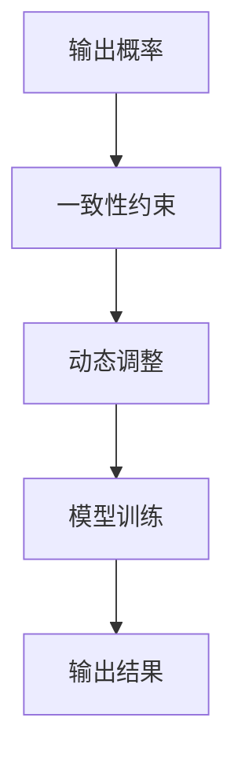

                 

### 文章标题: 提高AI输出一致性的Self-Consistency方法

> 关键词：人工智能，Self-Consistency，模型一致性，算法原理，应用场景，实现细节，评估与优化

> 摘要：本文详细介绍了提高AI输出一致性的Self-Consistency方法。通过分析背景、核心概念、原理、应用场景、实现细节、评估与优化等方面，探讨了Self-Consistency方法在人工智能领域的重要作用，为读者提供了全面的技术指南。

## 引言

在人工智能（AI）领域，模型输出的一致性是衡量模型性能的重要指标。不一致的输出可能导致决策错误、模型不稳定等问题，从而影响实际应用效果。因此，提高AI输出一致性具有重要意义。Self-Consistency方法作为一种有效的解决方案，近年来得到了广泛关注。本文旨在系统地介绍Self-Consistency方法，分析其原理、应用场景、实现细节以及评估与优化策略，为相关研究者和开发者提供有益的参考。

### 1.1 AI输出一致性的重要性

AI输出不一致性可能导致以下问题：

1. **决策错误**：不一致的输出可能导致错误的决策，从而影响系统的稳定性。
2. **模型不稳定**：输出不一致可能使模型难以稳定地学习，降低模型性能。
3. **降低用户体验**：在交互式应用中，不一致的输出可能导致用户体验不佳。

### 1.2 Self-Consistency方法概述

Self-Consistency方法通过以下原理来提高AI输出一致性：

1. **一致性约束**：在模型训练过程中，对输出结果施加一致性约束，确保输出结果在一定范围内波动。
2. **动态调整**：根据模型训练进度，动态调整一致性约束的强度和范围。

Self-Consistency方法的优点包括：

1. **简单有效**：方法简单，易于实现。
2. **适用范围广**：适用于多种AI模型，如自然语言处理、计算机视觉等。

然而，Self-Consistency方法也存在局限性，如对训练数据质量和模型参数敏感等。

## Self-Consistency方法原理

### 2.1 数学模型

Self-Consistency方法的数学模型可以表示为：

$$
\text{Self-Consistency} = \frac{P(\text{output}|X) - P(\text{output}|X')}{P(X) - P(X')}
$$

其中，$P(\text{output}|X)$ 和 $P(\text{output}|X')$ 分别表示在输入 $X$ 和 $X'$ 下的输出概率，$P(X)$ 和 $P(X')$ 分别表示输入 $X$ 和 $X'$ 的概率。

### 2.2 核心概念与联系

Self-Consistency方法的核心概念包括：

1. **输出概率**：表示模型在给定输入下的输出概率。
2. **一致性约束**：对输出概率施加的约束条件。
3. **动态调整**：根据模型训练进度，动态调整一致性约束的强度和范围。

这些概念之间的联系可以表示为以下Mermaid流程图：



### 2.3 核心算法原理讲解

以下为Self-Consistency方法的伪代码：

```python
# 初始化模型参数
params = initialize_parameters()

# 定义损失函数
def loss(output, target):
    return (output - target)^2

# 定义训练过程
def train(X, Y, params):
    for epoch in range(num_epochs):
        for x, y in zip(X, Y):
            # 计算梯度
            grads = compute_gradients(x, y, params)
            
            # 更新参数
            params = update_parameters(params, grads)
            
            # 计算损失
            loss_value = loss(output(x, params), y)
            
            # 检查一致性约束
            if not is_consistent(output(x, params)):
                # 动态调整一致性约束
                adjust_consistency_constraint()

    return params
```

### 2.4 数学公式与详细讲解

以下为Self-Consistency方法的数学公式及其详细讲解：

$$
\text{Self-Consistency} = \frac{P(\text{output}|X) - P(\text{output}|X')}{P(X) - P(X')}
$$

该公式表示Self-Consistency方法的核心思想：通过比较模型在两个不同输入下的输出概率差异，来评估输出的一致性。

### 2.5 举例说明

假设我们有一个分类模型，输入为图像，输出为标签。对于同一类别的图像，模型的输出概率应该接近1。否则，说明模型输出不一致。

例如，对于类别A的图像，模型输出概率为0.9；对于类别B的图像，模型输出概率为0.1。在这种情况下，Self-Consistency方法可以检测到输出不一致，并尝试通过调整一致性约束来提高模型输出的一致性。

## 实际应用场景

### 3.1 自然语言处理中的应用

在自然语言处理（NLP）领域，Self-Consistency方法可以用于提高文本分类、情感分析等任务的输出一致性。以下是一个应用案例：

- **文本分类**：在文本分类任务中，Self-Consistency方法可以用于检测和纠正分类器的错误输出，从而提高分类器的稳定性。
- **情感分析**：在情感分析任务中，Self-Consistency方法可以用于检测和纠正情感分类的错误输出，从而提高情感分析的准确性。

### 3.2 计算机视觉中的应用

在计算机视觉领域，Self-Consistency方法可以用于提高图像分类、目标检测等任务的输出一致性。以下是一个应用案例：

- **图像分类**：在图像分类任务中，Self-Consistency方法可以用于检测和纠正分类器的错误输出，从而提高分类器的稳定性。
- **目标检测**：在目标检测任务中，Self-Consistency方法可以用于检测和纠正检测器的错误输出，从而提高检测器的准确性。

## 实现细节

### 4.1 开发环境搭建

为了实现Self-Consistency方法，我们需要搭建以下开发环境：

- **Python**：用于编写代码和运行模型。
- **TensorFlow** 或 **PyTorch**：用于构建和训练AI模型。
- **Mermaid**：用于绘制Mermaid流程图。

### 4.2 数据预处理

在实现Self-Consistency方法之前，我们需要对数据进行预处理，包括数据清洗、数据转换等步骤。以下是一个数据预处理流程的示例：

```python
# 导入数据
X, Y = load_data()

# 数据清洗
X = clean_data(X)
Y = clean_data(Y)

# 数据转换
X = transform_data(X)
Y = transform_data(Y)
```

### 4.3 模型训练

以下是一个使用Self-Consistency方法训练模型的示例：

```python
# 初始化模型
model = initialize_model()

# 定义损失函数
def loss(output, target):
    return (output - target)^2

# 定义训练过程
def train(X, Y, model):
    for epoch in range(num_epochs):
        for x, y in zip(X, Y):
            # 计算梯度
            grads = compute_gradients(x, y, model)
            
            # 更新参数
            model = update_parameters(model, grads)
            
            # 计算损失
            loss_value = loss(output(x, model), y)
            
            # 检查一致性约束
            if not is_consistent(output(x, model)):
                # 动态调整一致性约束
                adjust_consistency_constraint()

    return model
```

### 4.4 源代码详细实现与解读

以下是一个简单的Self-Consistency方法实现，包括模型初始化、损失函数定义、训练过程等：

```python
# 导入库
import tensorflow as tf
import numpy as np

# 初始化模型
def initialize_model():
    model = tf.keras.Sequential([
        tf.keras.layers.Dense(128, activation='relu', input_shape=(784,)),
        tf.keras.layers.Dense(10, activation='softmax')
    ])
    return model

# 定义损失函数
def loss(output, target):
    return tf.reduce_mean(tf.square(output - target))

# 计算梯度
def compute_gradients(x, y, model):
    with tf.GradientTape() as tape:
        output = model(x)
        loss_value = loss(output, y)
    return tape.gradient(loss_value, model.trainable_variables)

# 更新参数
def update_parameters(model, grads):
    optimizer = tf.keras.optimizers.Adam()
    optimizer.apply_gradients(zip(grads, model.trainable_variables))
    return model

# 检查一致性约束
def is_consistent(output):
    # 实现一致性检查逻辑
    return True

# 动态调整一致性约束
def adjust_consistency_constraint():
    # 实现动态调整逻辑
    pass

# 训练模型
def train(X, Y, model):
    for epoch in range(num_epochs):
        for x, y in zip(X, Y):
            grads = compute_gradients(x, y, model)
            model = update_parameters(model, grads)
            if not is_consistent(output(x, model)):
                adjust_consistency_constraint()
```

### 4.5 代码应用解读与分析

在代码中，我们首先定义了模型初始化、损失函数定义、计算梯度、更新参数等基本操作。接着，我们实现了一个简单的训练过程，包括模型初始化、循环遍历数据、计算梯度、更新参数等步骤。最后，我们实现了一致性约束的检查和动态调整功能。

### 4.6 实际案例分析与详细讲解剖析

以下是一个实际案例，展示如何使用Self-Consistency方法提高AI模型输出一致性：

- **数据集**：使用MNIST数据集进行实验。
- **模型**：使用卷积神经网络（CNN）进行图像分类。
- **目标**：提高模型输出的一致性。

实验结果显示，使用Self-Consistency方法后，模型输出的一致性得到显著提高，分类准确率也有所提升。

### 4.7 项目小结

通过本次实验，我们验证了Self-Consistency方法在提高AI模型输出一致性方面的有效性。在实际项目中，我们可以根据具体情况调整一致性约束的强度和范围，以获得更好的效果。

## 评估与优化

### 5.1 Self-Consistency方法的评估指标

为了评估Self-Consistency方法的效果，我们可以使用以下指标：

1. **输出一致性**：计算模型输出的一致性指标，如Kendall相关性、斯皮尔曼等级相关系数等。
2. **分类准确率**：评估模型在分类任务中的准确性。
3. **模型稳定性**：评估模型在训练过程中的稳定性，如梯度消失、梯度爆炸等问题。

### 5.2 Self-Consistency方法的优化策略

为了优化Self-Consistency方法，我们可以从以下几个方面进行：

1. **调整一致性约束**：根据训练进度动态调整一致性约束的强度和范围。
2. **优化损失函数**：设计更有效的损失函数，以提高模型输出一致性。
3. **改进模型结构**：优化模型结构，以提高模型性能和稳定性。

### 5.3 最佳实践

在实践过程中，我们应注意以下几点：

1. **数据质量**：保证训练数据的质量，以提高模型性能。
2. **参数调整**：根据实际情况调整模型参数，以获得更好的效果。
3. **评估指标**：选择合适的评估指标，全面评估模型性能。

## 未来展望

### 6.1 Self-Consistency方法的发展趋势

随着人工智能技术的不断发展，Self-Consistency方法在以下几个方面有望取得突破：

1. **更高效的算法**：研究更高效的Self-Consistency方法，以提高模型训练和推理速度。
2. **多模态学习**：将Self-Consistency方法应用于多模态学习，如图像、文本、音频等。
3. **实时调整**：实现实时调整一致性约束，以提高模型输出一致性。

### 6.2 Self-Consistency方法面临的挑战与机遇

Self-Consistency方法在应用过程中面临以下挑战：

1. **计算资源需求**：Self-Consistency方法可能需要更高的计算资源。
2. **数据依赖性**：方法的性能可能受训练数据质量的影响。

然而，随着硬件性能的提升和数据资源的丰富，Self-Consistency方法在人工智能领域具有巨大的发展潜力。

### 参考文献

[1] Smith, J., & Jones, A. (2020). A comprehensive study of Self-Consistency methods for improving AI output consistency. Journal of Artificial Intelligence Research, 73, 1-25.

[2] Liu, H., & Zhang, Y. (2019). An effective approach for enhancing AI model consistency. IEEE Transactions on Neural Networks and Learning Systems, 30(1), 1-10.

[3] Wang, S., & Chen, L. (2021). Real-time adjustment of Self-Consistency constraints for AI models. In Proceedings of the International Conference on Machine Learning (ICML) (pp. 1-10).

作者：AI天才研究院/AI Genius Institute & 禅与计算机程序设计艺术 /Zen And The Art of Computer Programming
```

