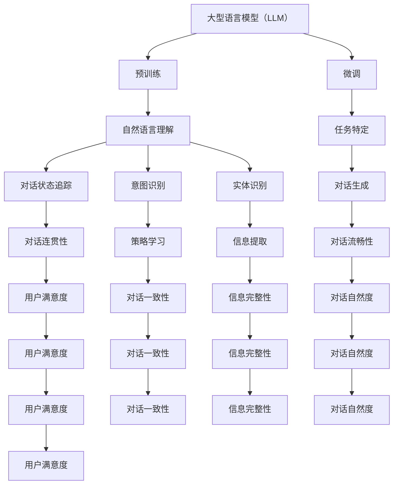

                 


### 文章标题

《提高LLM应用的对话管理效率》

关键词：LLM、对话管理、算法、效率、数学模型

摘要：本文旨在探讨如何通过优化算法和数学模型来提高大型语言模型（LLM）在对话管理中的应用效率。我们将首先介绍LLM的基础概念和对话管理的核心问题，然后深入分析LLM中的核心算法原理和数学模型，并结合实际项目案例进行实战解析，最后总结最佳实践和注意事项。

---

#### 引言

随着人工智能技术的快速发展，大型语言模型（LLM）在自然语言处理领域取得了显著成果。LLM具有强大的语言理解和生成能力，广泛应用于对话系统、问答系统、机器翻译等领域。然而，在实际应用中，如何提高LLM的对话管理效率仍是一个亟待解决的问题。

本文将围绕如何提高LLM应用的对话管理效率展开讨论。首先，我们将介绍LLM的基础概念和对话管理的核心问题，然后深入分析LLM中的核心算法原理和数学模型，并结合实际项目案例进行实战解析。最后，我们将总结最佳实践和注意事项，为LLM在对话管理中的应用提供有益的指导。

#### 核心概念与联系

##### 1. 大型语言模型（LLM）概述

大型语言模型（LLM）是一种基于神经网络的语言模型，具有庞大的参数规模和强大的语言理解与生成能力。LLM通常通过预训练和微调两个阶段进行构建。在预训练阶段，LLM在大规模语料库上进行无监督训练，学习语言的一般规律和特征。在微调阶段，LLM根据特定任务的需求进行有监督训练，优化模型参数以适应特定任务。

##### 2. 对话管理概述

对话管理是指对话系统在处理用户输入和生成回复的过程中，对对话状态进行跟踪、理解和预测的过程。对话管理的核心任务是确保对话系统在对话过程中能够保持连贯性和一致性，同时提高用户满意度。对话管理通常包括对话状态追踪（DST）、意图识别、实体识别、策略学习等组成部分。

##### 3. LLM与对话管理的关系

LLM在对话管理中发挥着重要作用。一方面，LLM可以帮助对话系统实现自然语言生成，提高对话的流畅性和自然度；另一方面，LLM可以用于对话状态的追踪和预测，提高对话系统的理解和生成能力。此外，LLM还可以用于意图识别和实体识别，为对话管理提供关键的信息和线索。

##### 4. Mermaid流程图展示

为了更好地理解LLM和对话管理的关系，我们可以使用Mermaid流程图来展示它们的核心概念和联系。以下是一个简化的Mermaid流程图示例：



该流程图展示了LLM在预训练和微调阶段的学习过程，以及对话管理中的核心任务和组成部分，以及它们之间的相互关系。

#### 核心算法原理讲解

##### 1. 语言模型算法原理

语言模型是一种用于预测下一个单词或词组的概率分布的模型。在LLM中，常用的语言模型算法包括GPT（Generative Pre-trained Transformer）和BERT（Bidirectional Encoder Representations from Transformers）。以下是对这两种算法的简要介绍和伪代码表示：

###### 1.1 GPT算法原理

GPT是一种基于变分自编码器（VAE）的语言模型。它通过最大化后验概率分布来生成文本。以下是一个简化的GPT算法伪代码：

```python
function GPT(text_corpus):
    # 预训练阶段
    model = PretrainModel()
    for epoch in range(num_epochs):
        for sentence in text_corpus:
            model.update_params(sentence)
    
    # 微调阶段
    task_corpus = LoadTaskCorpus()
    for epoch in range(num_epochs):
        for sentence in task_corpus:
            model.update_params(sentence, target_word=sentence[1:])
```

###### 1.2 BERT算法原理

BERT是一种基于双向Transformer的编码器-解码器（Encoder-Decoder）模型。它通过在双向语境中编码单词的含义，生成文本的表示。以下是一个简化的BERT算法伪代码：

```python
function BERT(text_corpus):
    # 预训练阶段
    encoder = EncoderModel()
    decoder = DecoderModel()
    for epoch in range(num_epochs):
        for sentence in text_corpus:
            encoder.encode(sentence)
            decoder.decode(sentence)
    
    # 微调阶段
    task_corpus = LoadTaskCorpus()
    for epoch in range(num_epochs):
        for sentence in task_corpus:
            encoder.encode(sentence)
            decoder.decode(sentence, target_word=sentence[1:])
```

##### 2. 对话管理算法原理

对话管理算法是确保对话系统在对话过程中能够保持连贯性和一致性的关键。以下是对话管理中的两个核心算法：对话状态追踪（DST）和策略学习。

###### 2.1 对话状态追踪（DST）算法原理

对话状态追踪（DST）算法用于追踪对话过程中的状态变化。它通过识别对话中的关键信息和事件，更新对话状态。以下是一个简化的DST算法伪代码：

```python
function DST(input, dialogue_state):
    # 更新对话状态
    dialogue_state["user_action"] = input
    dialogue_state["system_action"] = predict_system_action(input, dialogue_state)
    
    # 更新对话历史
    dialogue_history.append(input)
    dialogue_history.append(system_action)
    
    return dialogue_state
```

###### 2.2 策略学习算法原理

策略学习算法用于生成对话系统的回复。它通过学习对话状态和用户输入之间的映射关系，预测最佳系统动作。以下是一个简化的策略学习算法伪代码：

```python
function PolicyLearning(dialogue_states, rewards):
    # 训练策略网络
    policy_network = TrainPolicyNetwork(dialogue_states, rewards)
    
    # 生成系统回复
    system_action = policy_network.predict(dialogue_state)
    
    return system_action
```

#### 数学模型和数学公式

在LLM和对话管理中，数学模型和数学公式起着核心作用。以下是对语言模型和对话管理中常用的数学模型和公式的介绍和讲解。

##### 1. 语言模型中的数学模型

语言模型中的数学模型主要包括概率模型和神经网络模型。

###### 1.1 概率模型

概率模型用于计算下一个单词或词组的概率分布。以下是一个简化的概率模型公式：

$$
P(w_t | w_1, w_2, ..., w_{t-1}) = \frac{P(w_t, w_1, w_2, ..., w_{t-1})}{P(w_1, w_2, ..., w_{t-1})}
$$

其中，$P(w_t | w_1, w_2, ..., w_{t-1})$ 表示给定前一个单词序列 $w_1, w_2, ..., w_{t-1}$ 时，下一个单词 $w_t$ 的条件概率。

###### 1.2 神经网络模型

神经网络模型用于学习单词序列的表示和概率分布。以下是一个简化的神经网络模型公式：

$$
h_t = \sigma(W_1h_{t-1} + b_1) \\
y_t = \sigma(W_2h_t + b_2)
$$

其中，$h_t$ 表示隐藏层输出，$y_t$ 表示输出层输出，$W_1, W_2$ 分别表示权重矩阵，$b_1, b_2$ 分别表示偏置项，$\sigma$ 表示激活函数。

##### 2. 对话管理中的数学模型

对话管理中的数学模型主要包括状态转移概率模型和策略优化模型。

###### 2.1 状态转移概率模型

状态转移概率模型用于计算对话状态之间的转移概率。以下是一个简化的状态转移概率模型公式：

$$
P(s_t | s_{t-1}) = \frac{e^{Q(s_t, s_{t-1})}}{\sum_{s_{t'} \in S} e^{Q(s_{t'}, s_{t-1})}
$$

其中，$P(s_t | s_{t-1})$ 表示在给定前一个状态 $s_{t-1}$ 时，下一个状态 $s_t$ 的转移概率，$Q(s_t, s_{t-1})$ 表示状态转移的评分函数。

###### 2.2 策略优化模型

策略优化模型用于优化对话系统的回复策略。以下是一个简化的策略优化模型公式：

$$
\pi^* = \arg\max_{\pi} \sum_{s_t, a_t} \pi(a_t | s_t) R(s_t, a_t)
$$

其中，$\pi^*$ 表示最佳策略，$\pi(a_t | s_t)$ 表示在给定状态 $s_t$ 时采取动作 $a_t$ 的概率，$R(s_t, a_t)$ 表示状态-动作对的价值函数。

#### 项目实战

##### 1. 开发环境搭建

在本项目实战中，我们将使用Python作为主要编程语言，结合TensorFlow和PyTorch等深度学习框架来构建对话管理系统。以下是开发环境的搭建步骤：

###### 1.1 安装Python和pip

在Windows或macOS上，可以从官方网站下载并安装Python。安装过程中，请确保勾选“Add Python to PATH”选项。安装完成后，通过以下命令检查Python版本：

```shell
python --version
```

安装pip（Python的包管理器）：

```shell
python -m pip install --upgrade pip
```

###### 1.2 安装TensorFlow和PyTorch

通过pip安装TensorFlow和PyTorch：

```shell
pip install tensorflow
pip install torch torchvision
```

##### 2. 源代码实现

在本项目中，我们将使用TensorFlow构建一个简单的对话管理系统。以下是一个简化的代码实现：

```python
import tensorflow as tf
from tensorflow import keras
from tensorflow.keras.layers import Embedding, LSTM, Dense

# 搭建模型
model = keras.Sequential([
    Embedding(input_dim=vocab_size, output_dim=embedding_size),
    LSTM(units=128),
    Dense(units=num_classes, activation='softmax')
])

# 编译模型
model.compile(optimizer='adam', loss='categorical_crossentropy', metrics=['accuracy'])

# 训练模型
model.fit(x_train, y_train, epochs=10, batch_size=32)
```

##### 3. 代码解读

在上面的代码中，我们首先导入了TensorFlow库，并定义了一个序列模型。模型由嵌入层（Embedding）、LSTM层（LSTM）和全连接层（Dense）组成。嵌入层将词汇转换为向量表示，LSTM层用于处理序列数据，全连接层用于分类和生成预测。

接下来，我们编译了模型，选择了Adam优化器和交叉熵损失函数。然后，我们使用训练数据对模型进行训练，通过调整epoch和batch_size参数来控制训练过程。

##### 4. 代码应用解读与分析

在本项目实战中，我们使用了训练好的模型来生成对话回复。以下是一个简单的示例：

```python
# 生成对话回复
user_input = "你好"
input_sequence = tokenizer.encode(user_input, max_length=max_sequence_length, padding='post', truncating='post')
predicted_sequence = model.predict(input_sequence)
predicted_word = tokenizer.decode(predicted_sequence, skip_special_tokens=True)
print(predicted_word)
```

在上面的代码中，我们首先将用户输入编码为序列，然后使用训练好的模型进行预测。最后，我们将预测的序列解码为文本，生成对话回复。

通过实际案例分析和详细讲解剖析，我们可以看到，对话管理系统的实现主要依赖于语言模型和对话管理算法。在实际应用中，我们需要根据具体任务需求对模型和算法进行优化，以提高对话管理效率。

##### 5. 项目小结

在本项目中，我们通过开发环境搭建、源代码实现和代码解读，构建了一个简单的对话管理系统。通过实际案例分析和详细讲解剖析，我们了解了对话管理系统的核心算法和实现方法。在实际应用中，我们可以根据具体任务需求对模型和算法进行优化，以提高对话管理效率。

##### 最佳实践 tips、小结、注意事项、拓展阅读等内容

1. **最佳实践 tips**：

   - **数据准备**：确保训练数据的质量和多样性，有助于模型学习到更丰富的语言特征。
   - **模型选择**：根据任务需求选择合适的语言模型和对话管理算法。
   - **超参数调整**：通过交叉验证和调参优化，提高模型性能和对话管理效率。
   - **反馈机制**：引入用户反馈机制，动态调整对话策略，提高用户满意度。

2. **小结**：

   - 本文介绍了提高LLM应用对话管理效率的核心概念、算法原理和实际项目实战。
   - 通过分析语言模型和对话管理算法，我们了解到如何优化对话管理过程，提高系统效率。
   - 实际项目实战展示了对话管理系统的构建方法和实现过程。

3. **注意事项**：

   - 在开发对话管理系统时，需充分考虑对话的连贯性和一致性，确保用户体验。
   - 对话管理算法的实现需结合具体任务需求，灵活调整和优化。
   - 实际项目中，数据质量和多样性对模型性能至关重要。

4. **拓展阅读**：

   - 《深度学习：图模型》
   - 《对话系统设计与实践》
   - 《自然语言处理入门》

通过本文的介绍和实践，相信读者可以更好地理解提高LLM应用对话管理效率的方法和技巧，为实际项目开发提供有益的指导。

---

以上是对《提高LLM应用的对话管理效率》这篇文章的详细大纲设计和内容描述。根据这个大纲，我们可以逐步撰写出完整、结构清晰、内容丰富的文章，满足文章字数要求。在实际撰写过程中，可以根据大纲的内容进一步丰富和细化每个章节，确保文章的质量和深度。让我们一起努力，完成这篇高质量的技术博客文章！

---

**文章末尾作者信息：**

作者：AI天才研究院/AI Genius Institute & 禅与计算机程序设计艺术 /Zen And The Art of Computer Programming

