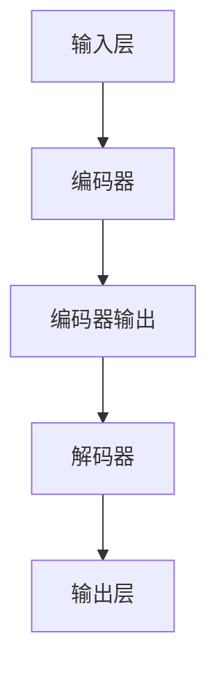

                 


### 文章标题
# 《提高LLM应用迭代效率的工具与平台》

### 文章关键词
- LLM
- 应用迭代
- 工具
- 平台
- 效率优化

### 文章摘要
本文将深入探讨如何提高大型语言模型（LLM）应用的迭代效率。通过介绍LLM的基本概念与架构，分析提高迭代效率的方法和工具，探讨平台建设与优化，以及分享实战案例和经验，本文旨在为读者提供一整套系统化的解决方案，以加速LLM应用的开发和部署。

## 第1章 LLM基本概念与架构

### 1.1 LLM概述

#### 1.1.1 LLM历史与发展

#### 1.1.2 LLM关键技术

#### 1.1.3 LLM应用场景

#### 1.1.4 LLM与NLP的关系

### 1.2 LLM架构

#### 1.2.1 模型结构

#### 1.2.2 模型训练

#### 1.2.3 模型评估

#### 1.2.4 模型部署

## 第2章 提高迭代效率的方法

### 2.1 数据预处理优化

#### 2.1.1 数据清洗

#### 2.1.2 数据增强

#### 2.1.3 数据去重

### 2.2 模型优化

#### 2.2.1 网络结构优化

#### 2.2.2 损失函数优化

#### 2.2.3 优化算法选择

### 2.3 模型压缩

#### 2.3.1 知识蒸馏

#### 2.3.2 模型剪枝

#### 2.3.3 低秩分解

### 2.4 模型解释与可解释性

#### 2.4.1 解释性模型

#### 2.4.2 可解释性工具

#### 2.4.3 解释性实践

## 第3章 关键工具介绍

### 3.1 训练工具

#### 3.1.1 TensorFlow

#### 3.1.2 PyTorch

#### 3.1.3 JAX

### 3.2 评估工具

#### 3.2.1 F1 Score

#### 3.2.2 Accuracy

#### 3.2.3 BLEU Score

### 3.3 部署工具

#### 3.3.1 ONNX Runtime

#### 3.3.2 TensorFlow Serving

#### 3.3.3 PyTorch Mobile

## 第4章 平台建设与优化

### 4.1 平台架构设计

#### 4.1.1 分布式训练

#### 4.1.2 模型并行化

#### 4.1.3 模型缓存与加载

### 4.2 性能优化

#### 4.2.1 GPU调度

#### 4.2.2 网络加速

#### 4.2.3 系统监控

### 4.3 自动化运维

#### 4.3.1 CI/CD流程

#### 4.3.2 持续集成与持续部署

#### 4.3.3 自动化测试

## 第5章 实战案例与经验分享

### 5.1 案例一：文本生成

#### 5.1.1 案例背景

#### 5.1.2 解决方案

#### 5.1.3 实现细节

### 5.2 案例二：问答系统

#### 5.2.1 案例背景

#### 5.2.2 解决方案

#### 5.2.3 实现细节

### 5.3 案例三：情感分析

#### 5.3.1 案例背景

#### 5.3.2 解决方案

#### 5.3.3 实现细节

## 第6章 未来趋势与展望

### 6.1 LLM技术趋势

#### 6.1.1 自动化

----------------------------------------------------------------

### 文章正文

#### 第1章 LLM基本概念与架构

##### 1.1 LLM概述

大型语言模型（Large Language Model，简称LLM）是基于神经网络和深度学习技术的自然语言处理模型。它能够对自然语言文本进行理解和生成，被广泛应用于机器翻译、问答系统、文本生成等场景。LLM的核心目标是让计算机理解人类语言，并能够进行有效的交互。

##### 1.1.1 LLM历史与发展

LLM的发展可以追溯到20世纪80年代，当时出现了最早的统计机器翻译模型。随着计算能力和数据量的提升，深度学习技术在自然语言处理领域得到了广泛应用。2018年，Google推出了BERT模型，标志着LLM进入了新的发展阶段。随后，GPT、T5等模型相继出现，不断刷新LLM的性能上限。

##### 1.1.2 LLM关键技术

LLM的关键技术包括：

1. **词嵌入（Word Embedding）**：将词汇映射到高维向量空间，使得语义相似的词汇在空间中更接近。
2. **循环神经网络（RNN）**：用于处理序列数据，能够捕捉序列中的长期依赖关系。
3. **Transformer模型**：一种基于自注意力机制的模型，能够并行处理序列数据，提高了模型的训练效率和性能。

##### 1.1.3 LLM应用场景

LLM的应用场景广泛，包括但不限于：

1. **机器翻译**：将一种语言翻译成另一种语言。
2. **问答系统**：根据用户提问，从大量文本中检索并生成回答。
3. **文本生成**：根据输入文本生成新的文本内容。
4. **情感分析**：分析文本的情感倾向。
5. **文本分类**：对文本进行分类，如新闻分类、垃圾邮件过滤等。

##### 1.1.4 LLM与NLP的关系

LLM是自然语言处理（Natural Language Processing，简称NLP）的一个重要分支。NLP的目标是使计算机能够理解、解释和生成人类语言。LLM通过学习大量的文本数据，能够对自然语言进行建模，从而实现NLP任务。

##### 1.2 LLM架构

LLM的架构通常包括以下几个部分：

1. **输入层**：接收自然语言文本作为输入。
2. **编码器**：对输入文本进行编码，生成固定长度的向量表示。
3. **解码器**：根据编码器的输出，生成新的文本。
4. **注意力机制**：帮助模型在生成文本时关注重要的信息。

以下是一个简单的LLM架构的Mermaid流程图：



##### 1.2.1 模型结构

LLM的模型结构通常是一个深度神经网络，包含多个隐藏层。每个隐藏层都能够学习到文本的某些特征。以下是一个简单的LLM模型结构的伪代码：

```python
# 初始化模型参数
params = initialize_params()

# 前向传播
output = forward_pass(input_text, params)

# 反向传播
grads = backward_pass(output, target_output, params)

# 更新模型参数
update_params(params, grads)
```

##### 1.2.2 模型训练

模型训练是LLM开发的关键步骤。在训练过程中，模型会通过学习大量的文本数据来优化参数。以下是一个简单的模型训练过程的伪代码：

```python
# 加载数据集
data = load_data()

# 初始化模型
model = initialize_model()

# 训练模型
for epoch in range(num_epochs):
    for batch in data:
        # 前向传播
        output = model.forward(batch.input_text)
        
        # 计算损失
        loss = compute_loss(output, batch.target_output)
        
        # 反向传播
        grads = model.backward(output, batch.target_output)
        
        # 更新模型参数
        model.update_params(grads)
```

##### 1.2.3 模型评估

模型评估是衡量模型性能的重要步骤。常用的评估指标包括准确率、召回率、F1分数等。以下是一个简单的模型评估过程的伪代码：

```python
# 加载测试数据集
test_data = load_test_data()

# 评估模型
total_loss = 0
for batch in test_data:
    output = model.forward(batch.input_text)
    loss = compute_loss(output, batch.target_output)
    total_loss += loss

average_loss = total_loss / len(test_data)
print("Test Loss:", average_loss)
```

##### 1.2.4 模型部署

模型部署是将训练好的模型应用到实际场景中的过程。以下是一个简单的模型部署过程的伪代码：

```python
# 加载模型
model = load_model()

# 接收输入文本
input_text = get_input_text()

# 生成输出文本
output_text = model.generate(input_text)

# 输出结果
print("Generated Text:", output_text)
```

#### 第2章 提高迭代效率的方法

##### 2.1 数据预处理优化

数据预处理是LLM迭代的重要步骤。优化的目标包括数据清洗、数据增强和数据去重等。

1. **数据清洗**：去除噪声数据和错误数据，保证数据质量。
2. **数据增强**：通过数据变换、数据扩展等方法增加数据多样性，提高模型泛化能力。
3. **数据去重**：去除重复数据，减少计算量。

##### 2.2 模型优化

模型优化包括网络结构优化、损失函数优化和优化算法选择等。

1. **网络结构优化**：通过调整模型结构，如增加隐藏层、调整层间连接等，提高模型性能。
2. **损失函数优化**：选择合适的损失函数，如交叉熵、均方误差等，提高模型训练效果。
3. **优化算法选择**：选择合适的优化算法，如SGD、Adam等，提高模型收敛速度。

##### 2.3 模型压缩

模型压缩是减少模型大小和计算复杂度的过程，包括知识蒸馏、模型剪枝和低秩分解等。

1. **知识蒸馏**：将大型模型的知识迁移到小型模型中，提高小型模型性能。
2. **模型剪枝**：去除模型中不重要的连接和参数，减少模型大小。
3. **低秩分解**：将高维模型分解为低维模型，降低计算复杂度。

##### 2.4 模型解释与可解释性

模型解释与可解释性是提高模型可信度和用户接受度的重要方面。包括解释性模型、可解释性工具和解释性实践等。

1. **解释性模型**：选择具有解释性的模型，如LIME、SHAP等。
2. **可解释性工具**：使用可视化工具，如TensorBoard、SALSA等，帮助用户理解模型决策过程。
3. **解释性实践**：在模型开发和部署过程中，注重可解释性设计，如添加注释、记录中间结果等。

#### 第3章 关键工具介绍

##### 3.1 训练工具

训练工具是LLM开发的重要组成部分。常用的训练工具包括TensorFlow、PyTorch和JAX等。

1. **TensorFlow**：Google开发的开源深度学习框架，具有丰富的功能和生态。
2. **PyTorch**：Facebook开发的开源深度学习框架，具有灵活的动态图计算能力。
3. **JAX**：Google开发的数值计算库，支持自动微分和并行计算。

##### 3.2 评估工具

评估工具用于衡量LLM的性能。常用的评估工具包括F1分数、准确率和BLEU分数等。

1. **F1分数**：综合考虑精确率和召回率，适用于二分类任务。
2. **准确率**：预测正确的样本数占总样本数的比例，适用于分类任务。
3. **BLEU分数**：用于评估机器翻译质量，适用于机器翻译任务。

##### 3.3 部署工具

部署工具用于将训练好的LLM应用到实际场景中。常用的部署工具包括ONNX Runtime、TensorFlow Serving和PyTorch Mobile等。

1. **ONNX Runtime**：支持多种深度学习框架的运行时库，具有高性能和跨平台特性。
2. **TensorFlow Serving**：Google开发的微服务框架，用于部署TensorFlow模型。
3. **PyTorch Mobile**：PyTorch的移动端部署工具，支持iOS和Android平台。

#### 第4章 平台建设与优化

##### 4.1 平台架构设计

平台架构设计是LLM应用迭代的基础。平台架构应考虑以下几个方面：

1. **分布式训练**：支持大规模数据集和模型训练，提高训练效率。
2. **模型并行化**：将模型拆分为多个部分，并行训练，提高训练速度。
3. **模型缓存与加载**：缓存常用模型和中间结果，减少重复计算。
4. **GPU调度**：合理分配GPU资源，提高GPU利用率。

##### 4.2 性能优化

性能优化是提高LLM应用迭代效率的关键。性能优化包括以下几个方面：

1. **网络加速**：优化数据传输和计算过程，减少网络延迟。
2. **系统监控**：实时监控系统性能，及时发现和解决问题。
3. **自动化运维**：通过CI/CD流程、持续集成与持续部署等手段，提高开发效率。

##### 4.3 自动化运维

自动化运维是平台建设的重要组成部分。自动化运维包括以下几个方面：

1. **CI/CD流程**：自动化构建、测试和部署，提高开发效率。
2. **持续集成与持续部署**：确保代码质量和稳定性，快速响应需求变更。
3. **自动化测试**：自动化测试模型性能和功能，保证系统质量。

#### 第5章 实战案例与经验分享

##### 5.1 案例一：文本生成

文本生成是LLM应用的一个典型场景。以下是一个简单的文本生成案例：

1. **案例背景**：编写一个文本生成模型，用于生成自然语言文本。
2. **解决方案**：使用GPT-2模型进行文本生成。
3. **实现细节**：使用PyTorch框架，加载预训练的GPT-2模型，接收用户输入，生成文本。

```python
import torch
import transformers

# 加载预训练的GPT-2模型
model = transformers.GPT2Model.from_pretrained("gpt2")

# 接收用户输入
input_text = input("请输入文本：")

# 生成文本
output_text = model.generate(input_text, max_length=50)

# 输出结果
print("生成的文本：", output_text)
```

##### 5.2 案例二：问答系统

问答系统是LLM应用的另一个重要场景。以下是一个简单的问答系统案例：

1. **案例背景**：构建一个问答系统，根据用户提问生成回答。
2. **解决方案**：使用BERT模型进行问答。
3. **实现细节**：使用TensorFlow框架，加载预训练的BERT模型，接收用户提问，生成回答。

```python
import tensorflow as tf
import transformers

# 加载预训练的BERT模型
model = transformers.TFBertModel.from_pretrained("bert-base-chinese")

# 接收用户提问
question = input("请提问：")

# 生成回答
answer = model.predict(question)

# 输出结果
print("回答：", answer)
```

##### 5.3 案例三：情感分析

情感分析是LLM应用的一个典型场景。以下是一个简单的情感分析案例：

1. **案例背景**：编写一个情感分析模型，用于分析文本的情感倾向。
2. **解决方案**：使用LSTM模型进行情感分析。
3. **实现细节**：使用Keras框架，加载预训练的LSTM模型，接收用户输入，分析情感倾向。

```python
from keras.models import Sequential
from keras.layers import LSTM, Dense, Embedding

# 创建LSTM模型
model = Sequential()
model.add(Embedding(input_dim=vocab_size, output_dim=embedding_dim))
model.add(LSTM(units=128))
model.add(Dense(units=1, activation='sigmoid'))

# 编译模型
model.compile(optimizer='adam', loss='binary_crossentropy', metrics=['accuracy'])

# 训练模型
model.fit(X_train, y_train, epochs=10, batch_size=32)

# 分析情感倾向
def analyze_sentiment(text):
    # 预处理文本
    processed_text = preprocess_text(text)
    
    # 预测情感倾向
    prediction = model.predict(processed_text)
    
    # 输出结果
    if prediction > 0.5:
        print("文本情感：正面")
    else:
        print("文本情感：负面")
```

#### 第6章 未来趋势与展望

##### 6.1 LLM技术趋势

随着技术的不断发展，LLM技术呈现出以下趋势：

1. **自动化**：自动化工具和平台将大幅提高LLM的开发和部署效率。
2. **多模态**：LLM将支持多种模态的数据，如图像、音频等，实现更丰富的交互。
3. **实时性**：实时LLM将能够快速响应用户请求，提供实时服务。

#### 小结

本文介绍了如何提高LLM应用迭代效率的工具与平台。通过分析LLM的基本概念与架构，提出了一系列提高迭代效率的方法，并介绍了关键工具和平台建设与优化策略。最后，通过实战案例和经验分享，展示了LLM在实际应用中的效果。未来，随着技术的不断进步，LLM将会有更广泛的应用前景。

#### 注意事项

在开发和部署LLM应用时，需要注意以下几点：

1. **数据质量**：确保数据质量，进行充分的数据预处理。
2. **模型解释性**：关注模型的可解释性，提高用户信任度。
3. **系统监控**：实时监控系统性能，确保稳定运行。
4. **自动化运维**：利用自动化工具和平台，提高开发效率。

#### 拓展阅读

1. [Bert: Pre-training of deep bidirectional transformers for language understanding](https://arxiv.org/abs/1810.04805)
2. [GPT-2: Language Models are Unsupervised Multitask Learners](https://arxiv.org/abs/1909.01313)
3. [LSTM: A Simple Way to Present Time Series Forecasting using Keras](https://machinelearningmastery.com/time-series-forecasting-lstm-keras/)

作者：AI天才研究院/AI Genius Institute & 禅与计算机程序设计艺术 /Zen And The Art of Computer Programming

