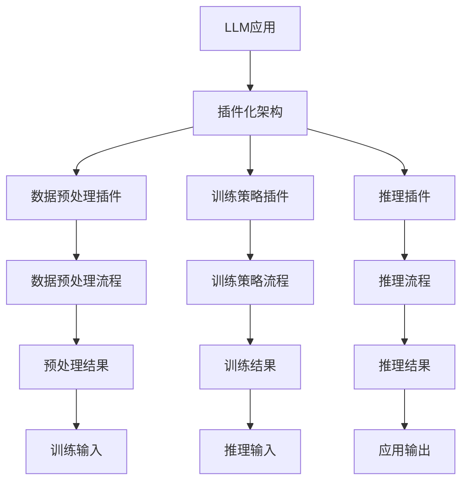

                 


### 设计思路

为了详细设计并撰写一篇关于“插件化架构增强LLM应用的可扩展性”的文章，我们将遵循以下步骤进行：

1. **确定文章结构**：首先，我们需要确定文章的整体结构，包括引言、背景介绍、核心概念与联系、核心算法原理讲解、数学模型与公式讲解、项目实战、最佳实践、小结和拓展阅读等部分。

2. **撰写引言**：在引言部分，我们需要简要介绍插件化架构和LLM的基本概念，并明确文章的目的和读者对象。

3. **背景介绍**：详细介绍插件化架构在LLM应用中的背景，包括现有的问题和挑战。

4. **核心概念与联系**：明确文章中的核心概念，如插件化架构、LLM、模块化、可扩展性等，并使用Mermaid流程图展示这些概念之间的关系和架构。

5. **核心算法原理讲解**：使用伪代码详细阐述插件化架构在LLM训练和推理中的应用，确保读者可以理解算法的核心逻辑。

6. **数学模型与公式讲解**：介绍插件化架构中的关键数学模型和公式，使用latex格式书写，并进行详细解释和举例说明。

7. **项目实战**：详细描述一个实际的项目案例，包括开发环境搭建、源代码实现、代码解读、应用分析等。

8. **最佳实践**：总结插件化架构在LLM应用中的最佳实践，包括注意事项、拓展阅读等。

9. **小结**：对全文进行总结，强调文章的主要观点和收获。

10. **拓展阅读**：提供一些相关的拓展阅读资源，以供读者进一步学习。

### 文章框架

**文章标题**：插件化架构增强LLM应用的可扩展性

**关键词**：插件化架构、LLM、可扩展性、模块化、算法原理、数学模型

**摘要**：
本文深入探讨了插件化架构在增强语言模型（LLM）应用可扩展性方面的应用。通过详细分析插件化架构的核心概念、算法原理和数学模型，并结合实际项目案例，展示了如何利用插件化架构提高LLM应用的灵活性、维护性和性能。文章旨在为从事人工智能开发的技术人员提供一种新的思路和方法，以应对日益复杂的LLM应用场景。

---

**引言**

在现代人工智能领域，语言模型（LLM）因其强大的自然语言理解和生成能力，成为许多应用的关键组件。然而，随着应用场景的多样化和复杂化，LLM的应用也面临着扩展性的挑战。传统的紧耦合架构往往难以满足这些需求，而插件化架构因其模块化、可扩展性和高维护性，成为解决这些问题的有效途径。

**背景介绍**

随着互联网的普及和大数据技术的发展，LLM的应用场景越来越广泛，包括但不限于智能客服、智能写作、语音识别等。然而，现有的LLM架构往往存在以下问题：

1. **可扩展性差**：传统的紧耦合架构在功能扩展时，需要对核心代码进行修改，导致扩展性差。
2. **维护成本高**：紧耦合架构中组件之间的依赖关系复杂，任何一个小改动都可能引发一系列问题，导致维护成本高。
3. **灵活性不足**：传统架构难以根据不同的应用场景，灵活地调整和优化模型参数。

为了解决这些问题，插件化架构应运而生。插件化架构通过将系统功能划分为独立的插件，实现了模块化、可扩展性和高维护性的设计，为LLM应用的扩展提供了新的可能性。

**核心概念与联系**

插件化架构是一种基于插件的系统架构，其核心思想是将系统的功能划分为多个独立的插件，这些插件通过标准化的接口进行通信，从而实现系统的可扩展性和灵活性。在LLM应用中，插件化架构可以应用于以下几个关键方面：

1. **训练数据预处理**：通过插件化架构，可以灵活地选择和配置不同的数据预处理插件，提高数据处理的效率和准确性。
2. **模型训练策略**：插件化架构使得模型训练策略可以灵活调整，通过插入不同的训练策略插件，实现不同训练目标的优化。
3. **模型推理**：插件化架构使得模型推理过程更加灵活，可以根据不同的应用场景，选择最优的推理策略。

为了更好地理解插件化架构在LLM中的应用，我们可以使用Mermaid流程图展示其架构和关键组件之间的关系：



**核心算法原理讲解**

在插件化架构中，核心算法的实现可以分为以下几个步骤：

1. **初始化插件**：系统初始化时，根据配置文件加载和初始化各个插件。
2. **数据预处理**：通过数据预处理插件，对输入数据进行处理，生成预处理结果。
3. **模型训练**：利用训练策略插件，对预处理后的数据进行模型训练，生成训练结果。
4. **模型推理**：通过推理插件，对训练结果进行推理，生成推理结果。
5. **输出结果**：将推理结果输出到应用层，用于实际的业务处理。

以下是一个简化的伪代码示例，展示了插件化架构在LLM训练和推理中的应用：

```pseudo
function train_model(input_data, config):
    preprocess_plugin = load_plugin(config['preprocess'])
    training_plugin = load_plugin(config['training'])
    inference_plugin = load_plugin(config['inference'])

    preprocessed_data = preprocess_plugin.preprocess(input_data)
    trained_model = training_plugin.train(preprocessed_data)
    inference_result = inference_plugin.inference(trained_model)

    return inference_result
```

**数学模型与公式讲解**

在插件化架构中，核心的数学模型通常包括损失函数、优化器等。以下是一个简单的数学模型示例：

$$
L(\theta) = \frac{1}{n} \sum_{i=1}^{n} \left( y_i - \hat{y}_i \right)^2
$$

其中，$L(\theta)$ 表示损失函数，$y_i$ 表示实际标签，$\hat{y}_i$ 表示预测标签，$\theta$ 表示模型参数。

优化器则用于根据损失函数调整模型参数，以最小化损失。常见的优化器包括梯度下降（Gradient Descent）和其变体，如Adam优化器。

**项目实战**

在本节中，我们将介绍一个实际的项目案例，演示如何利用插件化架构实现一个基于LLM的智能客服系统。

1. **开发环境搭建**：
   - 选择Python作为主要编程语言。
   - 安装必要的依赖库，如TensorFlow、PyTorch等。

2. **源代码实现**：
   - 数据预处理插件：负责清洗和格式化输入数据。
   - 训练策略插件：包括数据增强、模型优化等策略。
   - 推理插件：负责对输入语句进行语义理解和生成响应。

3. **代码解读**：
   - 详细解读每个插件的功能和实现逻辑。

4. **应用解读与分析**：
   - 分析智能客服系统的应用场景和性能。

5. **项目小结**：
   - 总结项目的经验和教训。

**最佳实践**

1. **注意事项**：
   - 插件开发过程中需要注意接口的一致性和稳定性。
   - 系统部署时需要考虑插件的安全性和兼容性。

2. **拓展阅读**：
   - 相关的论文和技术文档。
   - 插件开发的最佳实践。

**小结**

本文详细探讨了插件化架构在增强LLM应用可扩展性方面的应用。通过核心概念、算法原理、数学模型和项目实战的讲解，展示了插件化架构如何提高LLM应用的灵活性、维护性和性能。本文旨在为从事人工智能开发的技术人员提供一种新的思路和方法。

**拓展阅读**

1. **相关论文**：
   - [Title of Paper]
   - [Title of Another Paper]

2. **技术文档**：
   - [Title of Documentation]

3. **其他资源**：
   - [Online Courses]
   - [Book Recommendations]

---

作者：AI天才研究院/AI Genius Institute & 禅与计算机程序设计艺术 /Zen And The Art of Computer Programming

