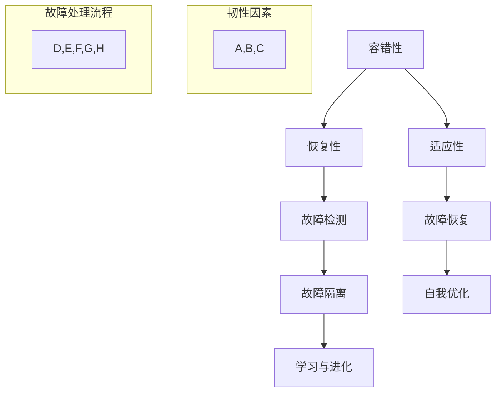

                 

### 故障演练：提升AI系统韧性的有效方法

在当今数字化时代，人工智能（AI）系统已经成为许多关键业务的核心驱动力。从自动驾驶汽车到智能医疗诊断，从金融风险评估到个性化推荐系统，AI技术的应用无处不在。然而，随着AI系统的复杂性和依赖性不断增加，系统在面临故障、异常和攻击时的脆弱性也日益显现。因此，提升AI系统的韧性成为了一个至关重要的话题。本文将探讨故障演练作为一种提升AI系统韧性的有效方法，通过逐步分析其概念、实施流程、风险评估、容错设计与恢复，以及实战案例，帮助读者深入理解并掌握这一方法。

### 关键词

- **故障演练**
- **AI系统韧性**
- **风险评估**
- **容错设计**
- **恢复策略**
- **实战案例**
- **最佳实践**

### 摘要

本文旨在探讨故障演练作为一种提升人工智能系统韧性的有效方法。首先，我们将介绍故障演练的基本概念和重要性，接着详细阐述故障演练的实施流程，包括风险评估和策略、容错设计与恢复。随后，通过实际案例解析，展示故障演练在实际应用中的效果。最后，本文将总结最佳实践，并展望故障演练技术的发展趋势。

### 引言

#### 故障演练的概念与重要性

故障演练是一种通过模拟系统故障、异常或攻击事件，检验系统应对能力的方法。其核心目的是发现潜在问题，评估系统韧性和可靠性，从而在真正发生故障时减少损失和恢复时间。在人工智能领域，随着AI系统的广泛应用和复杂化，故障演练的重要性愈发凸显。

首先，AI系统通常具有较高的复杂性和不可预测性，这使得系统在面临异常情况时容易出现故障。故障演练可以帮助识别这些潜在问题，从而提前进行修复和优化。其次，AI系统在关键业务中的应用往往不可替代，一旦出现故障，可能对业务造成重大影响。因此，通过故障演练，可以提前发现并解决系统中的脆弱点，提高系统的整体韧性。

#### AI系统韧性的定义与意义

韧性（Resilience）是指系统在面对外部压力和内部变化时，能够保持稳定运行并快速恢复的能力。在AI系统中，韧性体现在以下几个方面：

1. **容错性**：系统能够在部分组件或数据出现故障时，仍然保持正常运行。
2. **恢复性**：系统能够在故障发生后，迅速恢复到正常状态。
3. **适应性**：系统能够在面临新的外部条件或内部变化时，进行调整和适应。

提升AI系统的韧性，不仅有助于保障系统的稳定性和可靠性，还能够减少故障对业务的影响，提高用户体验。因此，故障演练作为一种有效的方法，可以帮助AI系统在实际应用中更好地应对各种挑战。

### 第1章 AI系统韧性概述

#### 核心概念与联系

在探讨故障演练如何提升AI系统韧性之前，我们需要首先了解AI系统韧性的核心概念。韧性不仅仅是一个单一属性，而是由多个因素共同作用的结果。以下是几个关键概念及其相互关系：

1. **容错性**（Fault Tolerance）：指系统在部分组件或数据出现故障时，仍能保持正常运行的能力。这通常通过冗余设计、故障检测与恢复机制来实现。
2. **恢复性**（Recovery）：指系统在故障发生后，能够迅速恢复到正常状态的能力。恢复性包括故障检测、故障隔离、故障恢复等环节。
3. **适应性**（Adaptability）：指系统在面对新的外部条件或内部变化时，能够进行调整和适应的能力。适应性通常通过自我优化、学习与进化来实现。

这些概念之间存在着紧密的联系。容错性和恢复性共同构成了系统的稳定性，而适应性则使得系统能够在长期运行中持续优化和改进。故障演练正是通过模拟各种故障和异常情况，来检验和提升这些韧性因素。

#### AI系统韧性的Mermaid流程图

为了更好地理解AI系统韧性，我们可以使用Mermaid语言绘制一个流程图，展示各核心概念之间的关系。

这个流程图展示了容错性、恢复性和适应性三个韧性因素，以及它们在故障处理流程中的相互关系。通过这个流程图，我们可以更直观地理解AI系统韧性是如何通过这些因素相互作用来实现的。

#### AI系统韧性的结构

AI系统韧性的结构可以分为四个主要层次：

1. **硬件层**：包括硬件冗余和故障检测机制，如备用服务器、分布式存储等。
2. **软件层**：包括容错算法、故障检测与恢复机制、自修复功能等。
3. **数据层**：包括数据备份、数据恢复机制、数据完整性检查等。
4. **网络层**：包括网络冗余、路由策略、网络安全机制等。

这些层次共同构成了AI系统的韧性架构，确保系统能够在各种故障情况下保持稳定运行。以下是AI系统韧性结构的详细说明：

1. **硬件层**：硬件冗余是提升系统容错性的基础。通过冗余设计，如备用服务器、磁盘阵列等，可以确保在部分硬件故障时，系统仍能正常运行。故障检测机制则用于及时发现硬件故障，并触发相应的恢复措施。

2. **软件层**：软件容错是AI系统韧性的重要组成部分。这包括故障检测、隔离和恢复机制。故障检测机制通过监控系统的各项指标，如CPU利用率、内存占用等，来识别潜在的故障。隔离和恢复机制则确保在故障发生时，系统可以快速切换到备用组件，或恢复到正常状态。

3. **数据层**：数据备份和恢复机制是保障系统持续运行的关键。数据备份可以防止数据丢失，而数据恢复机制则在数据损坏时，能够快速恢复数据，确保系统的连续性。

4. **网络层**：网络冗余和网络安全是提升系统韧性的重要手段。网络冗余可以通过多路径传输、负载均衡等技术，确保网络连接的稳定性。网络安全机制则用于防止外部攻击和内部故障，保障系统的安全性和完整性。

#### 故障演练与AI系统韧性关系

故障演练作为一种提升AI系统韧性的方法，其核心作用在于检验和强化系统的韧性。通过故障演练，我们可以模拟各种故障和异常情况，评估系统在真实环境下的表现，从而发现潜在问题并加以改进。

故障演练与AI系统韧性的关系可以从以下几个方面来理解：

1. **提升容错性**：通过模拟硬件故障、软件异常等情况，故障演练可以帮助我们评估系统的容错能力。在演练过程中，可以发现系统中的单点故障，并通过冗余设计和故障恢复机制来提升系统的容错性。

2. **增强恢复性**：故障演练可以帮助我们检验系统的故障恢复能力。通过模拟故障发生后的恢复过程，我们可以评估系统的恢复速度和恢复效果，从而优化恢复策略，提高系统的恢复性。

3. **优化适应性**：故障演练不仅能够模拟常见的故障和异常情况，还可以模拟新的、未知的威胁和变化。这有助于我们评估系统的适应性，通过不断调整和优化，提高系统在面对未知情况时的应对能力。

综上所述，故障演练是提升AI系统韧性的一种有效方法。通过模拟各种故障和异常情况，故障演练可以帮助我们发现系统的脆弱点，评估系统的韧性水平，并采取相应的改进措施。这不仅能够提高系统的稳定性和可靠性，还能够为系统在未来的应用中提供更好的保障。

### 第2章 故障演练的实施流程

#### 故障演练的规划与设计

故障演练的实施首先需要详细的规划和设计。这一阶段的核心目标是明确演练的目的、范围、目标和所需的资源。

1. **确定演练目标**：故障演练的目标通常包括检验系统的容错性、恢复性和适应性。具体目标可能包括验证系统在特定故障情况下的响应能力、评估系统的恢复速度和效果等。

2. **选择演练场景**：根据系统的特性和目标，选择合适的演练场景。这些场景可以包括硬件故障、软件异常、数据损坏、网络中断等。

3. **制定演练计划**：制定详细的演练计划，包括演练的时间、地点、参与人员、演练步骤、预期结果和评估标准等。

4. **准备所需资源**：确保具备足够的资源来支持演练，包括测试环境、工具、模拟工具、备份数据和恢复方案等。

5. **组织演练团队**：组建专业的演练团队，包括系统管理员、开发人员、测试人员、安全专家等，确保每个人在演练中的职责和任务明确。

#### 故障演练的执行与监控

在演练计划制定完成后，进入实际的执行阶段。这一阶段的核心任务是按照计划模拟故障情况，并实时监控系统的响应和表现。

1. **执行演练步骤**：按照演练计划，逐步执行模拟故障的场景。在执行过程中，需要确保每一步都准确无误，并及时记录相关数据。

2. **监控系统状态**：在故障模拟过程中，实时监控系统状态，包括系统的运行指标、性能指标、故障报告等。通过监控系统状态，可以及时发现异常情况并采取相应措施。

3. **记录演练结果**：详细记录演练过程中的所有数据和事件，包括故障发生的时刻、影响范围、系统响应、恢复过程等。这些记录将用于后续的分析和评估。

4. **及时调整演练计划**：在演练过程中，如果发现实际表现与预期结果不符，需要及时调整演练计划，确保演练能够按照预期进行。

#### 故障演练的结果分析与反馈

演练结束后，需要对演练结果进行全面的分析和反馈。这一阶段的核心任务是评估演练效果，发现潜在问题，并提出改进建议。

1. **评估演练效果**：根据演练目标和预期结果，评估系统的响应能力、恢复速度和效果。可以通过比较实际表现与预期目标的差距，来评估演练的有效性。

2. **发现潜在问题**：通过分析演练过程中的数据和记录，可以发现系统的潜在问题，包括系统设计缺陷、配置错误、安全漏洞等。

3. **提出改进建议**：针对发现的问题，提出具体的改进建议，包括优化系统设计、调整配置、加强安全防护等。这些改进措施将有助于提升系统的韧性和可靠性。

4. **撰写演练报告**：将演练结果、发现的问题和改进建议整理成报告，提交给相关利益相关者，以便进一步讨论和实施。

5. **反馈与持续改进**：将演练结果和改进建议反馈给开发团队、运维团队和安全团队，确保他们能够采取有效的措施来提升系统的韧性。同时，定期进行故障演练，持续改进和优化系统的韧性。

通过上述步骤，故障演练可以有效地提升AI系统的韧性，确保系统在面对故障和异常情况时能够保持稳定运行，并迅速恢复。

#### 风险评估与策略

在故障演练中，风险评估是一个至关重要的环节。通过系统化的风险评估，我们可以识别潜在的风险点，评估风险的影响和发生的可能性，并制定相应的风险缓解策略。以下是风险评估的具体步骤和策略。

##### 风险评估方法

1. **定性风险评估**：定性风险评估通过评估风险的重要性和可能性来识别潜在的风险点。常用的定性方法包括风险矩阵、风险清单和专家评审。

   - **风险矩阵**：使用矩阵来表示风险的可能性和影响，帮助确定高风险区域。
   - **风险清单**：列出所有可能的风险，并对其进行初步评估。
   - **专家评审**：邀请领域专家对风险进行评估和讨论，以确保识别到潜在的风险。

2. **定量风险评估**：定量风险评估通过量化风险的影响和可能性，提供更精确的评估结果。常用的定量方法包括风险分析模型、概率分析和成本效益分析。

   - **风险分析模型**：使用数学模型来评估风险的概率和影响，例如蒙特卡洛模拟。
   - **概率分析**：通过计算风险事件发生的概率，来评估其影响。
   - **成本效益分析**：比较风险缓解措施的成本与潜在的损失，以确定最有效的风险缓解策略。

##### 风险评估工具

为了提高风险评估的效率和准确性，可以使用以下工具：

1. **Risk Management Software**：这类软件提供风险管理功能，包括风险识别、评估、监控和报告。例如，Open Risk Manager、Qualys等。

2. **Analytics Tools**：数据分析工具可以帮助分析大量数据，识别潜在的风险模式。例如，Excel、Tableau等。

3. **Risk Assessment Templates**：这些模板可以简化风险评估过程，提供标准化的方法来识别和评估风险。

##### 风险缓解策略

在识别和评估风险后，需要制定有效的风险缓解策略。以下是几种常见的风险缓解策略：

1. **风险规避**：通过避免风险源或改变项目范围来避免风险的发生。

   - **例子**：在系统设计中，避免使用已知存在安全漏洞的第三方库。

2. **风险减轻**：通过采取措施减少风险的可能性和影响。

   - **例子**：在故障演练中，使用冗余设计来减轻硬件故障的风险。

3. **风险转移**：通过保险或其他合同手段将风险转移到第三方。

   - **例子**：为关键系统购买保险，以转移潜在的数据丢失或系统故障的风险。

4. **风险接受**：在风险发生可能性低或成本高于潜在损失时，接受风险。

   - **例子**：对于一些较小的风险，可以采取接受策略，因为采取缓解措施的成本可能过高。

通过上述步骤和方法，我们可以系统化地进行风险评估，并制定有效的风险缓解策略。这有助于提高AI系统的韧性，确保系统在面对故障和异常时能够稳定运行，并减少潜在的损失。

#### 容错设计与恢复

在AI系统的设计中，容错性是一个至关重要的因素。容错设计的目标是在系统出现故障时，确保系统能够继续运行或快速恢复到正常状态。下面我们将详细介绍容错设计的原理、实现方法和恢复策略。

##### 容错设计原理

容错设计的核心思想是通过冗余、故障检测和恢复机制来保障系统的连续性和可靠性。以下是几个关键的容错设计原理：

1. **冗余设计**：通过在系统中引入冗余组件，如备份服务器、备用磁盘等，来确保在部分组件或数据出现故障时，系统能够继续运行。冗余可以分为硬件冗余、软件冗余和数据冗余。

   - **硬件冗余**：通过增加硬件设备，如备用服务器、磁盘阵列等，来提高系统的容错性。
   - **软件冗余**：通过在软件层面实现冗余，如多实例运行、代码复用等，来保障系统的可靠性。
   - **数据冗余**：通过数据备份和冗余存储，确保数据在故障发生后可以快速恢复。

2. **故障检测**：通过监控系统状态和性能指标，实时检测故障的发生。故障检测可以基于阈值监控、异常检测和连续性验证等方法。

   - **阈值监控**：通过设定阈值，当系统指标超过阈值时，触发故障检测机制。
   - **异常检测**：利用机器学习算法和统计方法，识别系统中的异常行为。
   - **连续性验证**：通过定期验证系统的完整性，确保系统在正常运行。

3. **恢复机制**：在检测到故障后，系统需要能够快速恢复到正常状态。恢复机制包括故障隔离、故障恢复和系统重启等步骤。

   - **故障隔离**：通过定位故障源，将故障部分与正常部分隔离，避免故障扩散。
   - **故障恢复**：通过备用组件或恢复策略，将系统恢复到正常状态。
   - **系统重启**：在严重故障发生时，通过系统重启来恢复系统。

##### 容错机制实现方法

以下是几种常见的容错机制实现方法：

1. **主动冗余**：在系统中引入冗余组件，当主组件出现故障时，冗余组件可以接管任务。这种方法包括：

   - **多实例运行**：在系统中运行多个实例，当一个实例失败时，其他实例可以接管任务。
   - **负载均衡**：通过将任务分配到多个服务器上，确保在单个服务器出现故障时，其他服务器可以继续处理任务。

2. **备份与恢复**：通过备份和恢复机制，确保系统在故障发生后可以快速恢复。这种方法包括：

   - **数据备份**：定期备份系统数据，确保在数据损坏时可以恢复。
   - **日志备份**：备份系统日志，以便在系统重启或恢复时，可以重新处理未完成的任务。
   - **增量备份**：只备份自上次备份以来发生的变化，以减少备份时间和存储需求。

3. **故障检测与恢复**：通过故障检测和恢复机制，确保系统在故障发生后能够快速恢复。这种方法包括：

   - **监控与报警**：监控系统状态，当检测到故障时，触发报警机制，并通知相关人员。
   - **自动恢复**：在检测到故障后，系统自动执行恢复操作，如切换到备用组件或重启系统。

##### 恢复策略与实施

恢复策略的目标是在故障发生后，将系统快速恢复到正常状态，并减少对业务的影响。以下是几种常见的恢复策略：

1. **快速恢复**：通过快速切换到备用组件或恢复最近备份的数据，将系统恢复到正常状态。这种方法适用于故障影响较小的情况。

2. **渐进式恢复**：在故障恢复过程中，逐步恢复系统的各项功能，以减少对业务的影响。这种方法适用于故障影响较大的情况。

3. **滚动恢复**：在系统中逐个恢复各个组件，确保在恢复过程中，系统的关键功能始终可用。这种方法适用于大型系统或复杂应用。

4. **故障隔离与恢复**：首先隔离故障部分，确保其他部分不受影响，然后对故障部分进行修复或替换，最后将系统恢复到正常状态。

在实施恢复策略时，需要遵循以下步骤：

1. **故障检测与定位**：通过监控系统状态，检测故障的发生位置和类型。

2. **故障隔离**：隔离故障部分，避免故障扩散，确保系统其他部分不受影响。

3. **恢复操作**：执行恢复操作，如切换到备用组件、恢复数据等。

4. **测试与验证**：在恢复后，对系统进行测试和验证，确保系统恢复正常运行。

5. **记录与总结**：记录故障发生的详细情况、恢复过程和结果，以便进行总结和改进。

通过上述容错设计与恢复策略，我们可以确保AI系统在面对故障时能够保持稳定运行，并快速恢复到正常状态，从而提高系统的韧性和可靠性。

#### 实战案例解析

在本章节中，我们将通过两个实际案例，详细解析故障演练在提升AI系统韧性中的应用效果。

##### 案例背景与目标

**案例1：某金融公司智能风控系统的故障演练**

某金融公司拥有一套智能风控系统，用于监控和评估客户的信用风险。随着客户数据的不断增加和交易量的增长，系统的稳定性变得越来越重要。为了确保系统在面对潜在故障时能够保持稳定运行，公司决定进行一次全面的故障演练。

**演练目标**：
1. 检验系统在硬件故障（如服务器故障、网络中断）下的响应能力。
2. 评估系统在数据损坏或丢失情况下的恢复速度。
3. 测试系统的故障隔离和自动恢复机制。

**案例2：某电商平台推荐系统的故障演练**

某电商平台拥有一套基于AI的个性化推荐系统，为用户提供精准的商品推荐。该系统每日处理大量的用户数据，对用户购物体验和平台销售有着直接影响。为了提高系统的稳定性和韧性，电商平台决定进行一次故障演练。

**演练目标**：
1. 验证系统在数据库故障下的恢复能力。
2. 检查系统的故障检测和报警机制。
3. 评估系统的负载均衡和分布式处理能力。

##### 案例实施过程

**案例1：某金融公司智能风控系统的故障演练**

**1. 演练准备**：
- **硬件准备**：在备用服务器上搭建与生产环境相同的风控系统，确保在主服务器出现故障时，备用服务器可以立即接管。
- **数据备份**：备份数据库和系统配置文件，确保在数据损坏时可以快速恢复。
- **演练计划**：制定详细的演练计划，包括演练的时间、步骤和预期结果。

**2. 演练执行**：
- **硬件故障演练**：模拟服务器故障，观察备用服务器是否能够顺利接管，并确保系统的各项功能不受影响。
- **数据损坏演练**：模拟数据库数据损坏，测试系统是否能够通过备份快速恢复，并确保数据的完整性。
- **故障恢复演练**：模拟系统故障，验证故障检测和恢复机制是否能够自动执行恢复操作。

**3. 演练监控**：
- **实时监控**：通过监控系统状态和性能指标，实时监控演练过程中的系统表现。
- **日志记录**：详细记录演练过程中的所有事件和数据，确保后续分析有据可依。

**案例2：某电商平台推荐系统的故障演练**

**1. 演练准备**：
- **数据库备份**：备份数据库，确保在故障发生时可以快速恢复。
- **负载均衡**：测试系统的负载均衡功能，确保在部分服务器故障时，其他服务器可以继续处理任务。
- **演练计划**：制定详细的演练计划，包括演练的时间、步骤和预期结果。

**2. 演练执行**：
- **数据库故障演练**：模拟数据库故障，观察系统是否能够快速切换到备用数据库，并确保推荐系统的正常运行。
- **故障检测演练**：模拟故障检测和报警机制，验证系统能否及时发现并报警。
- **负载均衡演练**：模拟服务器故障，测试系统的负载均衡和分布式处理能力。

**3. 演练监控**：
- **实时监控**：通过监控系统状态和性能指标，实时监控演练过程中的系统表现。
- **日志记录**：详细记录演练过程中的所有事件和数据，确保后续分析有据可依。

##### 案例结果与启示

**案例1：某金融公司智能风控系统的故障演练**

**演练结果**：
- 在模拟服务器故障时，备用服务器能够成功接管，系统各项功能保持正常。
- 在模拟数据损坏时，系统能够通过备份快速恢复，确保数据的完整性。
- 在故障恢复过程中，故障检测和恢复机制能够自动执行，提高系统的恢复速度。

**启示**：
- 备用服务器和数据库备份是保障系统韧性的重要手段。
- 故障检测和恢复机制的自动执行能够显著提高系统的恢复速度。

**案例2：某电商平台推荐系统的故障演练**

**演练结果**：
- 在模拟数据库故障时，系统能够快速切换到备用数据库，确保推荐系统的正常运行。
- 在模拟故障检测和报警机制时，系统能够及时发现并报警。
- 在模拟服务器故障时，系统的负载均衡和分布式处理能力得到验证，确保系统在高负载下仍能稳定运行。

**启示**：
- 分布式数据库和负载均衡是提升系统韧性的关键。
- 故障检测和报警机制对于快速响应故障至关重要。

通过以上两个实战案例，我们可以看到故障演练在提升AI系统韧性方面的显著效果。故障演练不仅帮助识别和解决系统中的潜在问题，还提高了系统的恢复速度和可靠性，为实际业务提供了更好的保障。

#### 故障演练的最佳实践

在进行故障演练时，为了确保演练的效果和效率，以下是一些最佳实践和注意事项：

##### 实践原则

1. **全面性**：故障演练应该覆盖系统的各个层面，包括硬件、软件、数据和网络。确保所有可能的风险点都得到检验。

2. **真实性**：尽量模拟真实环境中的故障情况，包括硬件故障、软件异常、数据丢失和网络中断等。这样可以更准确地评估系统的韧性和恢复能力。

3. **可重复性**：故障演练应该具有可重复性，以便在不同时间、不同环境下进行多次演练，持续优化和改进系统的韧性。

4. **透明性**：故障演练的过程和结果应该对相关利益相关者透明，包括开发团队、运维团队和安全团队等。这样可以确保各方都能了解系统的韧性和潜在问题。

##### 步骤和技巧

1. **详细规划**：在故障演练之前，制定详细的演练计划，包括演练的目标、场景、时间表、预期结果和评估标准。

2. **充分准备**：确保具备足够的资源和工具来支持演练，包括备用硬件、备份数据、故障模拟工具等。

3. **实时监控**：在演练过程中，实时监控系统状态和性能指标，及时记录事件和数据，以便后续分析。

4. **安全控制**：在演练过程中，确保系统的安全和数据的保护。可以限制演练范围，避免对生产环境造成影响。

5. **全面评估**：演练结束后，进行全面评估，分析演练结果，发现潜在问题，并提出改进建议。

6. **持续改进**：将演练结果和改进建议反馈给开发团队和运维团队，持续优化和改进系统的韧性。

##### 注意事项

1. **避免频繁演练**：过于频繁的故障演练可能会对系统造成不必要的负担，影响系统的正常运行。应合理安排演练频率。

2. **避免干扰生产**：故障演练应避免在生产高峰期进行，以免对业务运营造成影响。

3. **记录详细日志**：详细记录演练过程中的所有事件和数据，以便后续分析和总结。

4. **及时反馈和修复**：对演练中发现的问题，及时反馈和修复，确保系统的韧性和可靠性。

通过遵循这些最佳实践，我们可以更有效地进行故障演练，提升AI系统的韧性，确保系统在面对故障和异常时能够稳定运行，并快速恢复。

#### 未来趋势与展望

故障演练作为提升AI系统韧性的一种关键方法，其未来发展将受到以下几个趋势的驱动：

##### 新技术的影响

随着人工智能、大数据、云计算和区块链等技术的不断发展，故障演练的方法和工具也将不断升级。例如，利用人工智能技术进行故障预测和智能恢复，可以进一步提高故障演练的效率和准确性。同时，区块链技术可以提供安全、透明的数据备份和恢复机制，为故障演练提供更加可靠的支持。

##### 自动化和智能化

未来，故障演练将更加自动化和智能化。自动化工具可以自动化地执行故障模拟、监控和恢复过程，减少人为干预和错误。智能化工具则可以通过机器学习算法，自动分析演练结果，发现潜在问题，并提供优化建议。这将极大地提高故障演练的效率和效果。

##### 实时监控与分析

随着物联网（IoT）和5G技术的普及，故障演练将能够实现实时监控和分析。通过对系统运行状态的实时监控，可以及时发现潜在的故障风险，并采取相应的预防措施。同时，实时分析技术可以帮助快速识别故障的根本原因，并制定有效的恢复策略。

##### 持续集成和持续部署

随着持续集成（CI）和持续部署（CD）的普及，故障演练将更加深入地集成到软件开发生命周期中。通过在开发阶段进行故障演练，可以提前发现和修复潜在问题，确保系统的稳定性和可靠性。同时，故障演练结果可以反馈到CI/CD流程中，自动调整和优化系统配置和部署策略。

##### 跨领域合作

未来，故障演练将跨越不同的领域和行业，形成跨领域的合作。例如，在金融、医疗、交通等行业，不同机构可以共享故障演练的经验和工具，共同提升系统的韧性。这种跨领域的合作将有助于构建更加稳定和可靠的AI生态系统。

##### 可持续性和绿色能源

随着对环境问题的关注增加，故障演练也将更加注重可持续性和绿色能源。通过采用低能耗的硬件和绿色能源，可以减少故障演练对环境的影响。同时，故障演练的结果和经验可以用于优化系统的能源使用效率，实现绿色IT。

通过上述趋势，我们可以预见，故障演练将在未来成为AI系统韧性管理中不可或缺的一部分，为构建稳定、可靠和可持续的AI生态系统提供有力支持。

### 总结

本文详细探讨了故障演练作为一种提升AI系统韧性的有效方法。从故障演练的概念和重要性，到实施流程、风险评估、容错设计与恢复，再到实战案例解析和最佳实践，我们全面分析了故障演练在提升AI系统韧性中的关键作用。通过故障演练，我们能够发现和解决系统中的潜在问题，确保系统在面对故障和异常时能够保持稳定运行，并快速恢复到正常状态。

在未来的发展中，故障演练将继续借助新技术、自动化和智能化手段，实现更高效、更精准的韧性管理。我们期待故障演练在AI领域发挥更大的作用，为构建稳定、可靠和可持续的AI生态系统提供有力支持。

### 作者信息

**作者：AI天才研究院/AI Genius Institute & 禅与计算机程序设计艺术 /Zen And The Art of Computer Programming**

AI天才研究院致力于推动人工智能技术的发展和应用，通过创新研究和实践，助力AI领域的繁荣。禅与计算机程序设计艺术则倡导一种以智慧和宁静为核心的编程哲学，倡导程序员在快速发展的技术世界中保持内心的平静和专注。

