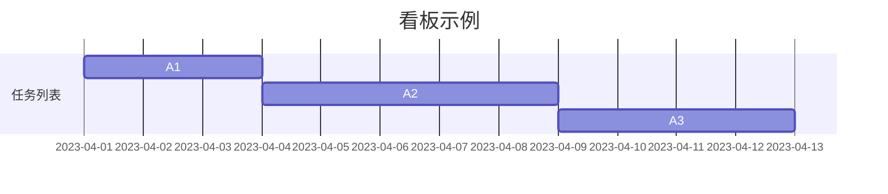

                 

### 引言

#### 敏捷团队自组织的背景

在当今快速变化和高度竞争的商业环境中，敏捷团队自组织已成为许多组织成功的关键因素。敏捷团队自组织是一种基于自我管理、协作和灵活性的工作模式，它允许团队在没有明确顶层指令的情况下，自主地规划、决策和执行工作。这种方法与传统层级结构下的指令性工作方式相比，更能够适应市场变化，提高团队创新能力和工作效率。

敏捷团队自组织的兴起可以追溯到20世纪90年代，当时的软件开发行业开始意识到传统瀑布模型的局限性。瀑布模型是一种线性、顺序的开发方法，它要求每个阶段完成后才能开始下一个阶段，这导致了开发周期长、响应速度慢，无法快速适应客户需求的变化。为了应对这些挑战，敏捷开发方法应运而生，它强调迭代、增量和灵活性，使团队能够更快地交付高质量的软件产品。

随着敏捷方法的普及，敏捷团队自组织逐渐成为软件开发和项目管理的重要实践。它不仅适用于软件开发领域，还被广泛应用于其他行业，如产品管理、市场营销和运营等。敏捷团队自组织的目标是通过团队内部的自我管理和协作，实现高效的沟通、快速响应变化和持续改进，从而提升组织的整体竞争力。

#### 需求管理的重要性

在敏捷团队自组织中，需求管理是至关重要的环节。需求管理涉及识别、分析、优先排序和满足项目需求的过程。它确保项目团队理解客户需求，并将这些需求转化为可执行的软件产品。

首先，需求管理有助于确保项目团队和客户之间的沟通畅通。在传统的开发模式中，客户需求往往在项目启动时被收集，随后在开发过程中很少再进行更新。这可能导致项目团队对客户需求的误解，最终导致交付的软件产品不符合客户期望。而在敏捷团队自组织中，需求管理是一个持续的过程，通过迭代和增量的方式，项目团队可以与客户保持紧密的沟通，确保需求得到及时更新和满足。

其次，需求管理有助于提升项目的透明度和可预测性。通过明确的优先级排序和需求分解，项目团队可以更好地理解项目范围和交付时间，从而提高项目计划的准确性和可执行性。这有助于减少项目风险，提高项目成功的可能性。

最后，需求管理是敏捷团队自组织实现持续改进的基础。在敏捷开发中，需求管理不仅关注当前的需求，还关注未来的需求变化。通过不断收集和分析用户反馈，项目团队可以识别潜在的问题和改进机会，从而持续优化产品和服务。

#### 书籍结构概述

本书旨在深入探讨敏捷团队自组织在需求管理中的应用，为读者提供全面的理论和实践指导。以下是本书的结构概述：

1. **引言**：介绍敏捷团队自组织的背景和需求管理的重要性，以及本书的结构和目的。
   
2. **敏捷团队自组织原理**：解释敏捷团队自组织的理论基础，包括敏捷方法和自组织理论的基本概念。
   
3. **敏捷需求管理的实践方法**：分析敏捷团队在实际项目中管理需求的方法，包括需求收集、优先级排序、分解和验证等。
   
4. **敏捷团队自组织与需求管理的流程设计**：讨论如何设计高效的流程来支持敏捷团队的自组织和需求管理。
   
5. **敏捷团队自组织的障碍与挑战**：探讨在敏捷团队自组织过程中可能遇到的障碍和挑战，以及如何解决这些问题。
   
6. **案例分析**：分析几个成功的敏捷团队自组织在需求管理中的应用案例，为读者提供实践参考。
   
7. **结论与未来展望**：总结本书的主要观点，并对未来的发展趋势进行展望。

通过这本书，读者可以了解敏捷团队自组织在需求管理中的应用，掌握敏捷团队自组织的理论和实践方法，从而提升团队的协作效率和项目成功的可能性。

### 敏捷团队自组织原理

#### 敏捷方法概述

敏捷开发是一种以用户需求变动为导向、强调迭代、增量和灵活性的软件开发方法。它起源于1990年代，当时软件开发行业开始意识到传统瀑布模型的局限性。瀑布模型是一种线性、顺序的开发方法，要求每个阶段完成后才能开始下一个阶段，这导致了开发周期长、响应速度慢，无法快速适应客户需求的变化。为了应对这些挑战，敏捷开发方法应运而生。

敏捷开发方法的核心原则和价值观体现在以下几个方面：

1. **个体和互动重于过程和工具**：敏捷开发强调团队成员的沟通和协作，认为良好的沟通比单一的流程和工具更为重要。
2. **可工作的软件重于详尽的文档**：敏捷开发认为交付可工作的软件比生成大量文档更有价值，虽然文档也是必要的，但不应成为开发工作的主要焦点。
3. **客户合作重于合同谈判**：敏捷开发强调与客户的紧密合作，认为通过与客户持续沟通，可以更好地理解需求，从而提高软件的满意度。
4. **响应变化重于遵循计划**：敏捷开发认为市场和技术环境是不断变化的，因此团队应该具备快速适应变化的能力，而不是过于依赖详细的计划。

敏捷开发方法包括多种具体的实践，如Scrum、看板（Kanban）、极限编程（XP）等。这些实践共同构成了敏捷开发的核心，使团队能够高效、灵活地应对项目需求的变化。

#### 敏捷团队自组织的定义与特点

敏捷团队自组织是一种基于自我管理、协作和灵活性的工作模式，它允许团队在没有明确顶层指令的情况下，自主地规划、决策和执行工作。这种模式的特点包括：

1. **自我管理**：团队成员自主决定如何完成工作，而不是受到外部指令的约束。这种自主性提高了团队成员的责任感和积极性，使他们更加专注于项目目标。
2. **协作**：敏捷团队强调团队成员之间的紧密协作，通过日常站立会议、迭代回顾和评审会议等机制，保持高频率的沟通和反馈。这种协作有助于快速解决问题，提高团队的决策效率和创新能力。
3. **灵活性**：敏捷团队能够快速适应变化，灵活调整计划和资源分配。这种方法使团队能够更好地应对市场和技术环境的变化，提高项目的成功率。

敏捷团队自组织的优势包括：

1. **提高团队效率**：通过自我管理和协作，团队成员可以更好地发挥各自的专长，提高工作效率。
2. **增强创新能力**：团队成员之间的紧密协作和持续反馈，有助于激发创新思维，提高产品的竞争力。
3. **快速响应变化**：敏捷团队具备快速适应变化的能力，可以更好地应对市场和技术环境的变化，提高项目的适应性。

#### 敏捷团队自组织的原则

敏捷团队自组织遵循以下原则：

1. **透明性**：团队成员之间的沟通和决策过程应该是透明的，确保每个人都能了解项目的进展和目标。
2. **反馈循环**：通过定期的反馈和评估，团队成员可以及时调整计划和资源分配，确保项目目标的实现。
3. **协同工作**：团队成员应该协同工作，共享资源和知识，避免重复劳动和浪费。
4. **持续学习**：敏捷团队注重持续学习，不断优化工作流程和技能，以适应不断变化的环境。
5. **自我组织**：团队成员自主决定如何完成任务，而不是受到外部指令的约束，这有助于提高责任感和创新能力。

#### 敏捷团队自组织的理论基础

敏捷团队自组织的理论基础主要包括敏捷方法和自组织理论。敏捷方法强调迭代、增量和灵活性，而自组织理论则提供了一种理解团队如何在没有外部指令的情况下自主运作的框架。

自组织理论的基本概念包括：

1. **复杂性**：自组织系统通常具有复杂的行为，但这些行为不是由外部指令驱动的，而是系统内部元素之间相互作用的结果。
2. **适应性**：自组织系统能够适应外部环境的变化，通过调整内部结构和行为来实现自我优化。
3. **自相似性**：自组织系统在不同尺度上表现出相似的结构和行为模式，这有助于团队在不同层次上实现协同工作。

在敏捷团队中，自组织理论的应用体现在以下几个方面：

1. **迭代与增量**：敏捷团队通过迭代和增量开发，逐步完善产品，同时保持对市场变化的适应性。
2. **自管理团队**：团队成员在没有外部指令的情况下自主决策，通过自我管理和协作，实现项目目标。
3. **持续反馈**：通过定期的反馈和评估，团队可以不断调整计划和资源分配，提高项目的成功率。

通过结合敏捷方法和自组织理论，敏捷团队自组织能够实现高效、灵活和创新的运作模式，从而在快速变化的市场环境中保持竞争力。

### 敏捷需求管理的实践方法

在敏捷团队自组织中，需求管理是一个持续、迭代的过程，它贯穿于整个项目生命周期。敏捷需求管理的实践方法主要包括需求收集、优先级排序、需求分解和需求验证等步骤。以下是对这些实践方法的详细分析：

#### 需求收集

需求收集是敏捷需求管理的起点，它涉及识别和理解项目相关方的需求。在敏捷团队中，需求收集是一个动态的过程，需要不断地与客户、用户和其他利益相关者进行沟通。

1. **用户故事地图**：用户故事地图是一种用于需求收集的工具，它帮助团队理解用户的需求和行为。通过用户故事地图，团队可以识别关键的用户场景和流程，并将其转化为具体的用户故事。

2. **需求研讨会**：在需求研讨会中，项目团队和客户、用户等利益相关者一起讨论需求。这种方法有助于建立共同的理解和期望，同时识别潜在的需求和问题。

3. **访谈和调查**：通过访谈和调查，团队可以深入了解用户的需求和痛点。这种方法适用于对特定用户群体进行深入调查，以获取详细的需求信息。

#### 优先级排序

在需求收集完成后，需要对需求进行优先级排序，以确保团队能够首先实现最有价值和最紧急的需求。以下是一些常用的优先级排序方法：

1. **MoSCoW方法**：MoSCoW方法是一种简单的优先级排序技术，将需求分为“必须-have”，“应该-have”，“可以-have”，“可能-have”四个类别。这种方法有助于团队快速确定哪些需求是最重要的。

2. **商业价值法**：商业价值法通过评估每个需求对业务的潜在影响，将其分为高、中、低三个等级。这种方法有助于团队根据业务目标来排序需求。

3. **风险优先级法**：风险优先级法根据需求实现后可能带来的风险，将其分为高、中、低三个等级。这种方法有助于团队优先处理那些可能带来高风险的需求。

#### 需求分解

需求分解是将高层次的需求分解为可执行的任务的过程。在敏捷团队中，需求分解通常基于用户故事和任务列表。

1. **用户故事**：用户故事是一种简短、明确的需求描述，通常采用“As a [用户角色]，I want [功能]，so that [目标]”的形式。用户故事有助于团队理解用户的需求和行为，同时也是任务分解的基础。

2. **任务列表**：任务列表是将用户故事分解为具体任务的过程。每个任务都是可执行的、可度量的工作单元，有助于团队明确任务的责任和完成时间。

#### 需求验证

需求验证是确保需求被正确理解和实现的过程。在敏捷团队中，需求验证通常通过以下几种方法进行：

1. **原型验证**：通过创建原型，团队可以与用户和利益相关者进行互动，验证需求是否符合预期。这种方法有助于及早发现和解决需求中的问题。

2. **用户测试**：通过用户测试，团队可以验证需求是否满足用户的需求和期望。用户测试可以在需求实现后进行，也可以在迭代过程中进行，以持续验证需求。

3. **审查和评审**：通过审查和评审，团队可以确保需求文档的完整性和准确性。这种方法有助于发现需求中的错误和遗漏，确保需求被正确理解。

#### 敏捷迭代的节奏

在敏捷团队中，需求管理是一个持续、迭代的过程，通过定期迭代来逐步实现需求。以下是一些常见的迭代周期和方法：

1. **Sprint**：Sprint是敏捷开发中的一个迭代周期，通常持续2-4周。在每个Sprint周期中，团队会选择最高优先级的需求进行开发，并在Sprint结束时交付一个可工作的软件版本。

2. **看板系统**：看板系统是一种用于管理迭代过程的工具，它通过可视化工作流程，帮助团队跟踪任务的状态和进度。通过看板系统，团队可以实时了解项目的进展，并做出相应的调整。

3. **迭代回顾**：迭代回顾是敏捷开发中一个重要的环节，团队在每个迭代结束时进行回顾，评估项目的进展和存在的问题。通过迭代回顾，团队可以不断优化工作流程和需求管理方法。

通过以上实践方法，敏捷团队能够在需求管理过程中实现高效、灵活和持续改进，从而提高项目的成功率和用户满意度。

### 敏捷团队自组织与需求管理的流程设计

#### 流程设计原则

设计敏捷团队自组织和需求管理的流程时，需要遵循以下原则：

1. **透明性**：确保团队成员和利益相关者能够清晰地了解项目的进展和目标。透明的流程有助于建立信任，减少误解和冲突。
2. **灵活性**：流程应具备一定的灵活性，能够适应不断变化的需求和外部环境。这要求流程设计时考虑到各种可能的变数，并允许团队在执行过程中进行必要的调整。
3. **简洁性**：流程应尽量简洁明了，避免冗余和繁琐的步骤。这有助于提高团队的效率和生产力。
4. **迭代与反馈**：流程设计应包含迭代和反馈机制，通过定期回顾和评估，团队可以持续改进流程，确保其始终有效。

#### 流程设计步骤

以下是设计敏捷团队自组织和需求管理的流程的具体步骤：

1. **需求识别**：与利益相关者沟通，识别项目需求。这一步骤应使用用户故事地图和需求研讨会等工具，确保需求被全面理解。
2. **需求优先级排序**：根据商业价值和风险等因素，对需求进行优先级排序。可以使用MoSCoW方法或商业价值法来帮助决策。
3. **需求分解**：将高层次的需求分解为具体的用户故事和任务。用户故事和任务应明确、可衡量，并且易于实现。
4. **迭代规划**：基于优先级排序的结果，为每个迭代制定详细的计划。每个迭代应包含明确的目标和可完成的任务。
5. **任务分配**：将任务分配给团队成员，确保每个任务都有明确的负责人。同时，确保团队成员在执行任务时具备所需的资源和能力。
6. **迭代执行**：在迭代过程中，团队按计划执行任务，并保持频繁的沟通和协作。使用看板系统等工具，实时跟踪任务的进度和状态。
7. **需求验证**：在迭代结束时，对需求进行验证，确保已实现的需求满足预期。可以采用原型验证、用户测试和审查等方式。
8. **迭代回顾**：在每次迭代结束后，团队进行回顾，评估流程的有效性和需求管理的质量。通过收集反馈和改进建议，团队可以持续优化流程。

#### 流程设计与实施

流程设计完成后，需要将其转化为可操作的实践，并确保团队能够有效地实施。以下是一些关键步骤：

1. **培训与沟通**：确保团队成员了解流程的细节和目的，通过培训和沟通，帮助他们掌握所需的技能和知识。
2. **工具支持**：选择适合的工具，如看板系统、用户故事地图等，以支持流程的实施。确保团队成员熟悉这些工具的使用。
3. **试点项目**：在正式实施前，选择一个试点项目进行试验。通过试点项目，团队可以识别和解决潜在的问题，确保流程在实际应用中的有效性。
4. **持续改进**：流程实施过程中，团队应持续收集反馈和改进建议，通过迭代和反馈机制，不断优化流程。

通过遵循上述原则和步骤，敏捷团队可以设计并实施高效的流程，支持自组织和需求管理，从而提高项目的成功率和团队的协作效率。

### 敏捷团队自组织的障碍与挑战

尽管敏捷团队自组织具有许多优势，但在实际应用过程中，团队可能会遇到各种障碍和挑战。以下是一些常见的障碍及其解决策略：

#### 文化与组织的抵触

许多传统组织具有严格的层级结构和指令性工作方式，这可能与敏捷团队自组织的原则相冲突。团队成员可能会对自主管理和自我决策感到不适应，导致文化抵触。

**解决策略**：
1. **逐步引入**：在组织内部逐步引入敏捷理念，而不是一夜之间全面变革。通过试点项目和内部培训，让团队成员逐步了解和接受敏捷团队自组织。
2. **领导支持**：高层领导的积极支持和参与对于推动敏捷文化的形成至关重要。领导应向团队成员传递敏捷价值观，并提供必要的资源和时间。
3. **建立信任**：通过建立信任机制，如开放的沟通和透明的决策过程，减少团队成员的担忧和抵触。

#### 缺乏有效的沟通

敏捷团队自组织强调频繁的沟通和协作，但在实际操作中，团队可能会面临沟通不畅的问题，导致需求理解不准确和任务执行不顺利。

**解决策略**：
1. **沟通机制**：建立有效的沟通机制，如每日站立会议、迭代回顾和评审会议等。这些机制有助于团队成员保持紧密的沟通，及时解决问题。
2. **信息共享**：使用工具如看板系统和协作平台，确保信息共享和任务透明。这有助于团队成员了解项目的进展和各自的角色。
3. **跨部门协作**：鼓励跨部门协作，通过组织跨职能团队，确保不同部门之间的需求和理解得到充分交流。

#### 资源分配的挑战

在敏捷团队自组织中，资源分配需要灵活且高效。然而，由于资源的有限性，团队可能会面临资源不足或资源分配不均的问题。

**解决策略**：
1. **资源优先级**：在资源分配时，优先考虑高优先级和关键需求的项目。通过明确的优先级排序，确保重要任务得到足够的资源。
2. **弹性资源池**：建立弹性资源池，允许团队成员在项目之间进行灵活调动。这有助于应对突发情况和资源波动。
3. **持续监控**：通过持续监控资源使用情况，及时调整资源分配策略，确保资源的高效利用。

#### 团队成员的技能和能力不足

敏捷团队自组织对团队成员的技能和能力有较高要求，但在实际操作中，团队可能会遇到成员技能不足或能力不匹配的问题。

**解决策略**：
1. **培训和提升**：为团队成员提供培训和提升机会，帮助他们掌握敏捷方法和所需技能。通过内部培训和外部学习，提高团队的整体能力。
2. **团队成员选择**：在组建团队时，充分考虑成员的技能和经验，确保团队成员能够胜任各自的角色。
3. **跨职能团队**：通过组建跨职能团队，将不同技能和经验的成员结合起来，发挥团队的协同效应。

#### 需求变化管理

敏捷团队自组织强调快速响应需求变化，但在实际操作中，需求变化可能会频繁且不可预测，给团队带来挑战。

**解决策略**：
1. **需求变更流程**：建立明确的需求变更流程，确保需求变化能够被及时识别、评估和应对。
2. **迭代规划**：在迭代规划时，预留一定的缓冲时间，以应对潜在的需求变化。
3. **持续反馈和沟通**：通过持续的反馈和沟通，确保团队成员对需求变化有充分的了解和准备。

通过识别和解决这些障碍和挑战，敏捷团队可以更好地实施自组织，提高项目的成功率和团队的工作效率。

### 案例分析

为了更好地理解敏捷团队自组织在需求管理中的应用，我们将分析两个具有代表性的案例：一个初创公司和一个大型企业。

#### 案例一：初创公司中的敏捷团队自组织

**案例背景**：
某初创公司专注于开发一款基于人工智能的智能家居控制系统。由于市场竞争激烈，公司需要在短时间内快速迭代和优化产品，以吸引客户和保持市场竞争力。

**敏捷实践**：
1. **用户故事地图**：团队使用用户故事地图来识别和理解客户的需求。通过与潜在用户和利益相关者的互动，团队收集了大量的需求信息，并将其转化为用户故事。
2. **自管理团队**：团队采用自管理模式，成员在项目经理的指导下自主规划和执行任务。团队成员定期召开站立会议，讨论项目的进展和挑战，并制定解决方案。
3. **迭代开发**：团队采用短周期迭代，每个迭代持续2周。在每次迭代结束时，团队进行评审和回顾，评估迭代成果，并根据客户反馈进行改进。
4. **看板系统**：团队使用看板系统来管理任务和跟踪进度。看板系统提供了可视化的工作流程，使团队成员能够实时了解任务的进展和状态。

**结果与反思**：
通过敏捷团队自组织，初创公司在短时间内成功推出了多个版本的产品，并获得了客户的积极反馈。团队成员的自主性和协作能力显著提高，项目的交付质量和效率也得到了显著提升。然而，团队也意识到在需求变化频繁的情况下，如何更好地管理需求优先级和资源分配是未来需要进一步解决的问题。

#### 案例二：大型企业中的敏捷团队自组织

**案例背景**：
某大型企业是一家拥有数千名员工和多个产品线的跨国公司。由于产品线复杂和需求多样，企业希望通过敏捷团队自组织提高产品开发和管理的效率。

**敏捷实践**：
1. **跨职能团队**：企业组建了多个跨职能团队，每个团队由开发、测试、设计和市场等不同职能部门的成员组成。跨职能团队的建立有助于加快产品开发速度，提高团队协作效率。
2. **持续集成与部署**：企业采用持续集成和部署（CI/CD）工具，实现自动化测试和快速部署。这有助于团队更快地响应需求变化，提高产品的可靠性和稳定性。
3. **需求管理平台**：企业使用需求管理平台来收集、优先级排序和跟踪需求。需求管理平台提供了一个集中的信息源，使团队能够更好地理解和满足客户需求。
4. **敏捷培训**：企业为团队成员提供敏捷培训和认证，帮助团队成员掌握敏捷方法和工具，提高团队整体能力。

**结果与反思**：
通过敏捷团队自组织，企业显著提高了产品的开发速度和质量。跨职能团队的合作和持续集成与部署工具的应用，使团队能够更快速地响应市场需求。然而，企业也面临着如何平衡敏捷团队自组织和现有组织结构之间的挑战。在未来的发展中，企业需要进一步优化敏捷实践，以实现更高效的自组织和管理。

这两个案例展示了敏捷团队自组织在需求管理中的应用，初创公司通过快速迭代和自管理团队成功推出产品，大型企业通过跨职能团队和持续集成与部署提高开发效率。这些实践为其他组织提供了有益的参考和借鉴。

### 结论与未来展望

#### 敏捷团队自组织与需求管理总结

敏捷团队自组织和需求管理作为现代软件开发和项目管理的重要实践，具有显著的优势。通过自我管理、协作和灵活性的提升，敏捷团队能够在快速变化的市场环境中保持竞争力。需求管理的实践方法，如用户故事地图、优先级排序和迭代开发，确保了项目团队能够及时响应客户需求，提高产品交付的质量和满意度。

总结本书的主要观点，敏捷团队自组织与需求管理的成功依赖于以下几个方面：

1. **文化变革**：组织需要建立适应敏捷理念的内部文化，鼓励自主性和创新。
2. **透明和反馈**：通过透明的流程和定期的反馈，团队可以持续改进，确保需求管理的有效性。
3. **灵活的资源分配**：灵活的资源分配和优先级排序有助于团队高效应对需求变化。
4. **培训与支持**：团队成员的技能和能力是成功的关键，持续的培训和知识共享是必不可少的。

#### 不足与改进方向

尽管敏捷团队自组织和需求管理在许多方面表现出色，但仍存在一些不足和改进方向：

1. **组织结构**：传统的组织结构可能对敏捷团队自组织构成挑战，需要进一步优化组织设计，以更好地支持敏捷实践。
2. **需求变化管理**：在需求变化频繁的情况下，如何有效管理需求优先级和资源分配仍然是一个挑战，需要更精细的管理方法和工具。
3. **跨部门协作**：跨部门协作的效率和效果可能受到组织结构和沟通机制的限制，需要进一步改进跨部门协作模式。

#### 未来展望

未来的发展趋势将进一步提升敏捷团队自组织和需求管理的实践：

1. **人工智能与机器学习**：随着人工智能和机器学习技术的发展，自动化工具将更加智能，帮助团队更高效地管理需求和项目。
2. **敏捷方法的扩展**：敏捷方法将继续扩展到更多行业和领域，为不同类型的组织提供灵活、高效的解决方案。
3. **持续学习与改进**：团队将持续学习和改进，通过不断优化工作流程和技能，实现更高的效率和产品质量。

通过不断探索和实践，敏捷团队自组织和需求管理将在未来继续发挥重要作用，推动软件开发和项目管理的发展。

## 参考文献

1. Beedle, M., & Benefis, J. (2005). *Scrum: The Art of Doing Twice the Work in Half the Time*. Prentice Hall.
2. Beck, K. (2000). *XP Explained: Embracing the Principles of Agile Software Development*. Addison-Wesley.
3. Schwaber, K., & Beedle, M. (2002). *Agile Project Management with Scrum*. Microsoft Press.
4. Reinertsen, D. (2009). *The Principles of Product Development Flow: Second Generation Lean Product Development*. Cengage Learning.
5. Leffingwell, D. (2011). *Scrum Works!: Best Practices for Implementing Agile at Scale*. Pearson.
6. Dingsøyr, T., Dybå, T., & Mæhlmann, L. (2010). *Empirical studies on agile software development: A systematic review and new research directions*. Information and Software Technology, 52(10), 1436-1451.
7. Wihler, J. A., & Hirschauer, J. (2019). *Self-Organization and Agile Software Development: Designing Autonomic Development Processes*. Springer.
8. Lyndsay, D., & Vanclay, F. (2013). *Kanban from the Inside Out: Help Your Teams Deliver Success with Kanban*. Lean Kanban Inc.

## 附录

### 附录A：用户故事示例

```plaintext
As a home owner, I want to control the temperature in my house
so that I can ensure a comfortable environment for my family.
```

### 附录B：MoSCoW方法示例

- **Must-have**：用户需要远程控制家中的灯光。
- **Should-have**：用户希望设备支持多种智能家居标准。
- **Could-have**：用户希望能够通过语音控制设备。
- **Would-like**：用户希望能够实时监控能源消耗。

### 附录C：看板系统示例



### 附录D：敏捷迭代规划示例

```plaintext
迭代周期：2周

任务列表：
- 用户故事1：实现用户登录功能
- 用户故事2：添加智能家居设备管理模块
- 用户故事3：优化用户界面设计
- 用户故事4：集成测试和部署

优先级：
- 用户故事1（必须完成）
- 用户故事2（应完成）
- 用户故事3（可完成）
- 用户故事4（可能完成）

资源分配：
- 开发人员：3人
- 测试人员：1人
- 设计人员：1人
```

### 附录E：敏捷培训与认证指南

1. **Scrum Master认证**：通过Scrum联盟（Scrum Alliance）提供的一系列认证课程，了解Scrum框架和敏捷实践。
2. **Product Owner认证**：通过产品负责人联盟（Product Owner Alliance）提供的认证课程，学习如何有效管理产品需求和团队协作。
3. **Kanban认证**：通过Kanban认证培训，掌握Kanban方法和工具，提高团队效率和流程优化能力。

## 作者信息

**作者**：AI天才研究院（AI Genius Institute） & 禅与计算机程序设计艺术（Zen And The Art of Computer Programming）
**简介**：AI天才研究院致力于推动人工智能技术的发展和创新，培养未来的人工智能领导者。本书作者结合敏捷方法和自组织理论，深入探讨了敏捷团队自组织在需求管理中的应用，为软件开发和项目管理提供了新的视角和实践指导。

## 感谢

在此，我要感谢我的团队成员、导师和同事，他们的支持和帮助使我能够完成这本书的撰写。同时，感谢所有读者对本书的关注和支持，希望本书能为您的实践提供有价值的参考。

