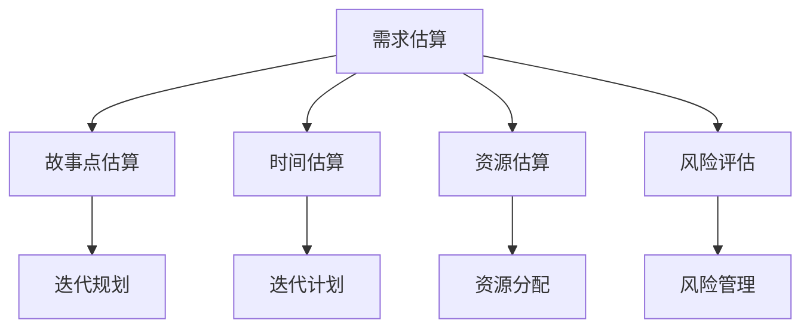

                 

### 敏捷研发中的需求估算技巧

#### 引言

在敏捷研发中，需求估算是一个关键环节。它不仅仅关乎项目的进度和预算，更是团队协作、资源分配和风险管理的基础。一个准确的需求估算是确保项目顺利进行的重要保障。本文将深入探讨敏捷研发中的需求估算技巧，帮助读者了解这一过程的核心原理和实际应用。

#### 背景介绍

**敏捷研发**是一种以快速响应变化和持续交付有价值的软件为核心理念的软件开发方法论。它强调团队的协作和沟通，通过短周期的迭代来不断调整和优化项目。相比之下，传统的瀑布开发方法往往在需求确定后才开始编码，这导致在需求变更时项目难以适应，增加了风险和成本。

**需求估算**是敏捷研发中的一个重要环节。它涉及到对项目需求的规模、复杂度和所需时间进行预测和评估。准确的需求估算是项目规划和资源分配的基础，有助于避免项目延误和超支。

#### 核心概念与联系

**敏捷需求估算**包括以下几个方面：

1. **故事点估算**：故事点是一种相对度量单位，用于评估用户故事的工作量。通常，故事点是由团队成员共同决定的。
2. **时间估算**：时间估算是指对完成一个用户故事所需的时间进行预测。这通常基于团队的工作效率和以往的项目经验。
3. **资源估算**：资源估算涉及到确定项目所需的开发人员、测试人员和其他资源。
4. **风险评估**：在需求估算过程中，对潜在的风险进行评估，以便制定相应的应对策略。

这些概念之间的联系如图所示：

#### 核心算法原理讲解

在进行需求估算时，常用的算法包括：

1. **故事点估算**：通常采用团队讨论的方式，团队成员共同评估用户故事的工作量，并给出相应的故事点。
2. **时间估算**：可以使用以下公式进行初步估算：

   $$ \text{时间估算} = \frac{\text{故事点}}{\text{团队历史平均完成故事点数所需时间}} $$

3. **资源估算**：资源估算通常基于项目规模、团队规模和资源利用率。

   $$ \text{资源估算} = \frac{\text{项目工作量}}{\text{资源利用率}} $$

4. **风险评估**：风险评估可以通过以下步骤进行：

   - **风险识别**：列出所有可能的风险。
   - **风险分析**：分析每个风险的严重性和发生概率。
   - **风险应对**：制定相应的应对策略。

#### 数学模型和公式

在进行需求估算时，可以使用以下数学模型和公式：

1. **工作量模型**：

   $$ \text{工作量} = \text{故事点} \times \text{每个故事点所需工作量} $$

2. **时间模型**：

   $$ \text{时间估算} = \text{工作量} / \text{团队工作效率} $$

3. **资源模型**：

   $$ \text{资源估算} = \text{工作量} / \text{资源利用率} $$

#### 详细讲解与举例说明

**案例：** 假设一个团队计划开发一个包含5个用户故事的软件项目。根据历史数据，每个故事点平均需要10人天的工作量。团队的工作效率为每周完成2个故事点。资源利用率为80%。

1. **故事点估算**：团队决定每个用户故事为2个故事点。
2. **时间估算**：

   $$ \text{时间估算} = \frac{5 \times 2}{2} = 5 \text{人天} $$

3. **资源估算**：

   $$ \text{资源估算} = \frac{5 \times 2 \times 10}{0.8} = 62.5 \text{人天} $$

这意味着团队需要大约5人天来完成这个项目。

#### 项目实战

**开发环境搭建**：使用Git进行版本控制，使用Jira进行项目管理。

**源代码实现**：每个用户故事对应的源代码实现。

**代码解读**：对每个用户故事的源代码进行详细解读。

**代码应用解读与分析**：分析每个用户故事的实现过程和效果。

**实际案例分析和详细讲解剖析**：分析实际项目中的需求估算过程，讲解其优势和不足。

**项目小结**：总结项目经验，提出改进建议。

#### 最佳实践 tips

- **尽早进行需求估算**：在项目初期就进行需求估算，有助于提前识别风险。
- **团队合作**：需求估算需要团队成员共同参与，确保估算的准确性。
- **持续改进**：根据项目经验不断调整和优化需求估算方法。

#### 小结

需求估算是敏捷研发中的关键环节。通过合理的需求估算，团队可以更好地规划项目进度、资源分配和风险管理。本文介绍了敏捷需求估算的核心概念、算法原理和实际应用，希望对读者有所帮助。

#### 拓展阅读

- 《敏捷开发实践指南》
- 《敏捷项目管理：理论与实践》
- 《敏捷需求管理：从需求到价值》

---

作者：AI天才研究院/AI Genius Institute & 禅与计算机程序设计艺术 /Zen And The Art of Computer Programming

