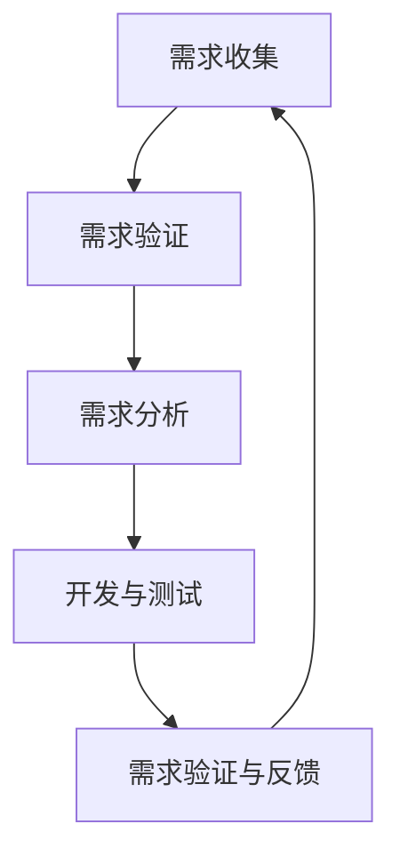

                 

### 第1章 引言与背景

#### 1.1 敏捷研发的概念与原则

敏捷研发（Agile Development）起源于1990年代末期，是对传统软件开发方法的一种反思和改进。其核心理念是快速响应变化、持续交付有价值的软件，并且强调团队合作和客户满意度。敏捷研发的核心原则如下：

1. **个体和互动重于过程和工具**：敏捷研发认为，个人的能力和团队的合作比单纯依赖工具和流程更为重要。
2. **可工作的软件重于详细的文档**：敏捷研发强调实际可运行软件的价值，而非冗长的文档。
3. **客户合作重于合同谈判**：敏捷研发倡导与客户建立紧密的合作关系，通过持续交流和反馈，确保项目方向与客户需求一致。
4. **响应变化重于遵循计划**：敏捷研发重视项目进度的灵活性，能够快速适应变化。

与传统瀑布模型（Waterfall Model）不同，敏捷研发采用迭代和增量的方式进行开发，每个迭代周期都会进行需求分析、设计、开发、测试和部署。这种方法使得团队能够更快地响应市场变化，提高软件的质量和客户的满意度。

#### 1.2 需求反馈循环的重要性

需求反馈循环（Feedback Loop）是敏捷研发中至关重要的一环。它通过不断地收集用户反馈，对需求进行验证和调整，从而确保软件产品始终满足用户需求。需求反馈循环的重要性主要体现在以下几个方面：

1. **提升产品适应性**：通过持续的用户反馈，团队能够快速发现市场变化，及时调整产品方向，提高产品的市场竞争力。
2. **提高客户满意度**：及时响应用户反馈，使产品功能更贴近用户需求，从而提升用户体验和满意度。
3. **优化开发过程**：通过分析反馈，团队能够发现开发过程中的瓶颈和问题，并采取相应的措施进行优化，提高开发效率。

需求反馈循环不仅有助于提高软件质量，还可以增强团队对敏捷方法的信心，使其更好地实践敏捷原则。

#### 1.3 本书的目标与结构

本书的目标是帮助读者深入了解敏捷研发中的需求反馈循环，并提供实用的优化策略。具体结构如下：

- **引言与背景**：介绍敏捷研发和需求反馈循环的概念和重要性。
- **理论基础**：阐述敏捷研发的原则和方法，并介绍需求反馈循环的理论基础。
- **需求反馈循环的各个环节**：详细描述需求反馈循环的各个环节，包括需求收集、验证、分析和规划等。
- **优化策略**：探讨如何识别瓶颈、制定优化策略和实施方案，以提高需求反馈循环的效率。
- **实战案例**：通过实际项目案例，展示需求反馈循环优化在实践中的应用。
- **总结与展望**：总结书中的关键点，并对未来的发展进行展望。

通过本书的阅读，读者将能够系统地掌握敏捷研发中的需求反馈循环，并在实际项目中有效应用这些优化策略。

## 关键词

敏捷研发，需求反馈循环，迭代开发，用户满意度，项目优化

## 摘要

本文介绍了敏捷研发中的需求反馈循环，包括其概念、重要性以及具体的应用。通过详细阐述需求反馈循环的各个环节，分析了如何通过优化策略提高需求反馈循环的效率。本文结合实际案例，探讨了如何在实际项目中实施需求反馈循环优化，以提高产品的市场适应性和客户满意度。

### 第2章 敏捷研发的理论基础

#### 2.1 敏捷方法的发展历程

敏捷研发方法起源于1990年代末期，最初是在软件开发领域提出的一种新的方法论。其起源可以追溯到1999年，当时17位软件专家在肯塔基州布鲁克斯堡的一家滑雪度假胜地滑雪时，共同撰写了《敏捷宣言》（Manifesto for Agile Software Development）。这份宣言明确了敏捷研发的核心价值观，即个体和互动、可工作的软件、客户合作和响应变化。

敏捷方法的早期发展受到了几个关键事件的影响。首先是1995年发布的水晶方法（Crystal Methods），这是一种基于团队大小和项目环境来定制软件开发过程的方法。其次是极限编程（Extreme Programming，XP），由Kent Beck在1996年提出，它强调简单性、反馈和开发人员的协作。随后，敏捷方法逐渐演变为一系列方法论，包括Scrum、看板（Kanban）和精益（Lean）等。

#### 2.2 敏捷研发的关键原则

敏捷研发的关键原则是指导团队如何高效地开发软件，这些原则源于敏捷宣言并得到了广泛的应用。以下是敏捷研发的几个核心原则：

1. **个体和互动重于过程和工具**：敏捷研发认为，团队合作和个体能力比依赖特定的工具和流程更为重要。这要求团队在决策时更加关注人的因素，鼓励开放沟通和协作。
2. **可工作的软件重于详细的文档**：敏捷研发强调实际可运行软件的重要性，而不是冗长的文档。虽然文档仍然有其重要性，但敏捷团队更注重于开发出可用的软件功能。
3. **客户合作重于合同谈判**：敏捷研发强调与客户的紧密合作，通过持续交流和反馈，确保项目方向与客户需求保持一致。这种方法有助于减少误解和项目风险。
4. **响应变化重于遵循计划**：敏捷研发重视项目进度的灵活性，能够快速适应变化。这意味着团队在开发过程中要更加开放和敏捷，以应对外部环境的快速变化。

这些原则不仅指导了敏捷团队的工作方式，也影响了敏捷方法论的设计和实践。

#### 2.3 敏捷研发的核心价值观

敏捷研发的核心价值观包括但不限于以下几个方面：

1. **简单性**：敏捷团队注重保持代码和流程的简单性，避免过度设计或复杂化。
2. **透明性**：所有团队成员都应该能够清楚地了解项目的进展和状态，这有助于减少误解和沟通障碍。
3. **可持续性**：团队应该以可持续的方式工作，避免过度加班和疲劳，确保长期的生产力和创造力。
4. **尊重**：团队中的每个成员都应该受到尊重，无论其职位高低。这有助于建立一个积极、开放的工作环境。

这些价值观不仅有助于提升团队的协作效率，也有助于提高员工的满意度和项目的成功概率。

#### 2.4 敏捷研发与传统方法的比较

敏捷研发与传统瀑布模型（Waterfall Model）存在显著差异。以下是两者之间的比较：

1. **开发过程**：瀑布模型采用线性顺序执行，每个阶段完成后才能进入下一个阶段，而敏捷研发采用迭代和增量的方式进行开发，每个迭代周期都会进行需求分析、设计、开发、测试和部署。
2. **灵活性**：敏捷研发强调灵活性和适应性，能够快速响应变化，而瀑布模型在项目初期定义需求，随后严格遵循计划，难以适应后续的变化。
3. **客户参与**：敏捷研发强调客户的持续参与，通过迭代过程中的定期反馈，确保项目符合客户需求，而瀑布模型通常在项目后期与客户进行沟通，可能导致需求变更和项目失败的风险增加。
4. **团队协作**：敏捷研发注重团队协作和个体能力，而瀑布模型更依赖于严格的角色分工和文档化流程。

这些差异使得敏捷研发在应对复杂性和变化性较高的项目时，具有更高的效率和成功率。

通过以上对敏捷研发理论基础的分析，读者可以更好地理解敏捷方法的起源、关键原则和核心价值观，以及其与传统方法的区别。这为后续章节中深入探讨需求反馈循环的各个环节和优化策略奠定了坚实的基础。

### 第3章 需求反馈循环的各个环节

#### 3.1 需求收集与验证

需求收集是需求反馈循环的起点，也是整个循环中最为关键的一步。在这一环节，团队需要与客户和利益相关者进行深入沟通，了解他们的需求和期望。以下是需求收集过程中的一些关键步骤和技巧：

1. **访谈与问卷调查**：通过面对面的访谈和问卷调查，可以获取更详细和准确的需求信息。访谈时应注意聆听客户的需求和痛点，并记录下所有重要的细节。
2. **用户故事编写**：用户故事是一种描述需求的简明扼要的方法，通常采用“作为[角色]，我想要[功能]，以便[达成目标）”的格式。编写用户故事有助于明确需求，并促进团队成员之间的沟通。
3. **需求优先级排序**：在收集到多个需求后，团队需要对需求进行优先级排序。常用的排序方法包括MoSCoW方法，将需求分为“必须的（M）”、“应该的（S）”、“可以延迟的（C）”和“不需要的（W）”。
4. **原型设计与评审**：在明确需求后，团队可以制作原型并进行评审。原型设计有助于验证需求的可行性和用户界面的友好性，从而减少后续的开发风险。

需求验证的目的是确保收集到的需求是准确、完整和可实现的。以下是需求验证过程中的一些关键步骤：

1. **用户验收测试（UAT）**：用户验收测试是由客户或利益相关者进行的测试，以确保软件满足其需求。通过UAT，可以验证需求的准确性和完整性。
2. **验收标准定义**：在需求验证过程中，团队需要定义明确的验收标准，以便在测试过程中能够准确地判断需求是否满足。
3. **同行评审**：通过同行评审，团队成员可以互相审查需求文档，发现潜在的问题和遗漏，从而提高需求的准确性和完整性。

#### 3.2 需求分析与规划

需求分析是需求反馈循环中的关键环节，其目的是将收集到的需求转化为具体的开发任务。以下是需求分析过程中的一些关键步骤：

1. **需求细化**：在初步收集到需求后，团队需要对需求进行细化，明确每个需求的详细描述、功能要求和性能指标。
2. **需求建模**：通过需求建模，可以将需求转化为抽象的模型，如用例图、活动图或状态图。这些模型有助于团队成员更好地理解需求，并促进跨部门的协作。
3. **需求验证**：在细化需求后，团队需要再次对需求进行验证，确保它们是准确、完整和可实现的。这一过程可以通过同行评审、用户验收测试等方式进行。

需求规划是将分析得到的需求转化为具体的开发任务的过程。以下是需求规划过程中的一些关键步骤：

1. **任务分解**：将需求分解为具体的工作任务，明确每个任务的负责人、完成时间和依赖关系。
2. **资源分配**：根据任务分解的结果，为每个任务分配所需的资源，包括人力、时间和技术资源。
3. **进度安排**：制定项目的进度计划，明确每个任务的开始和结束时间，以及项目的总体进度。
4. **风险评估**：识别项目中的潜在风险，并制定相应的应对策略，以降低风险对项目的影响。

通过需求分析与规划，团队可以确保项目按计划顺利进行，并能够及时交付满足客户需求的软件产品。

#### 3.3 开发与测试

开发与测试是需求反馈循环中的核心环节，其目的是将需求转化为实际的软件功能，并确保这些功能满足客户需求。以下是开发与测试过程中的一些关键步骤：

1. **代码编写**：根据需求分析的结果，开发人员开始编写代码，实现需求中的功能。在编写代码时，应遵循良好的编程规范和编码标准，以提高代码的可读性和可维护性。
2. **单元测试**：单元测试是对代码中独立模块的测试，以确保每个模块的功能正确。通过单元测试，可以快速发现和修复代码中的错误。
3. **集成测试**：集成测试是对代码模块进行组合后的测试，以确保不同模块之间的接口和交互正常。通过集成测试，可以确保整个系统的功能正确。
4. **系统测试**：系统测试是对整个系统的全面测试，包括功能测试、性能测试和安全测试等。通过系统测试，可以确保系统在各方面都符合客户需求。
5. **验收测试**：验收测试是由客户或利益相关者进行的测试，用于验证软件是否满足需求。通过验收测试，可以确保软件产品在交付前是符合客户期望的。

在开发与测试过程中，团队应保持与客户的紧密沟通，及时收集用户反馈，并根据反馈对软件进行相应的调整和优化。这种反馈机制有助于确保软件产品能够持续满足客户需求，提高用户满意度。

#### 3.4 需求验证与反馈

需求验证与反馈是需求反馈循环的最后一个环节，其目的是确保软件产品满足客户需求，并收集用户反馈以指导后续的迭代开发。以下是需求验证与反馈过程中的一些关键步骤：

1. **用户验收测试**：用户验收测试（UAT）是由客户或利益相关者进行的最终测试，用于验证软件是否满足所有需求和验收标准。通过UAT，可以确保软件产品在交付前是符合客户期望的。
2. **收集用户反馈**：在用户验收测试过程中，团队应积极收集用户的反馈和意见，包括软件的功能、性能和用户体验等方面。这些反馈对于后续的迭代开发和优化至关重要。
3. **分析反馈**：团队需要对收集到的用户反馈进行分析，识别出用户面临的问题和不满之处。通过分析反馈，可以找出需要改进的地方，并制定相应的优化措施。
4. **迭代优化**：根据分析结果，团队应进行相应的迭代开发，修复发现的问题，并优化软件的功能和用户体验。这种迭代优化过程应持续进行，以确保软件产品不断改进和满足用户需求。

需求验证与反馈环节不仅是确保软件质量的重要步骤，也是促进团队与客户之间良好沟通和协作的关键环节。通过不断收集用户反馈和优化软件产品，团队可以更好地满足客户需求，提高用户满意度。

通过以上对需求反馈循环各个环节的详细描述，读者可以更好地理解敏捷研发中需求反馈循环的工作机制，并在实际项目中有效地应用这些方法，以提高软件开发效率和客户满意度。

### 第4章 优化策略

#### 4.1 识别瓶颈与问题

在敏捷研发中，需求反馈循环的优化首先需要识别当前的瓶颈和问题。以下是一些常用的方法和工具来识别这些瓶颈：

1. **价值流图（Value Stream Mapping）**：价值流图是一种用于分析流程的图表，它可以帮助团队可视化整个需求反馈循环，包括每个环节的时间消耗、资源利用和流程瓶颈。通过绘制价值流图，团队可以清晰地看到哪些环节影响了整体效率。

2. **瓶颈分析（Bottleneck Analysis）**：瓶颈分析是通过识别流程中最慢或最耗时的环节来确定瓶颈的方法。在需求反馈循环中，瓶颈可能出现在需求收集、需求分析、开发、测试等环节。识别瓶颈后，团队可以集中精力优化这些关键环节。

3. **绩效指标（Performance Metrics）**：绩效指标是衡量流程效率的重要工具。常见的绩效指标包括周期时间（Cycle Time）、吞吐量（Throughput）和缺陷率（Defect Rate）。通过分析这些指标，团队可以识别出流程中的问题，并制定相应的优化措施。

4. **5W2H分析（5W2H Analysis）**：5W2H分析是一种常用的思维工具，用于深入探讨问题的各个方面。通过回答“是什么（What）、为什么（Why）、哪个（Which）、谁（Who）、何时（When）、如何（How）和多少（How much）”这些问题，团队可以全面了解问题，找到根本原因。

#### 4.2 制定优化策略

在识别了瓶颈和问题后，团队需要制定具体的优化策略。以下是一些常见的优化策略：

1. **流程改进（Process Improvement）**：流程改进是通过重新设计或优化现有流程来提高效率。在需求反馈循环中，团队可以优化需求收集、验证、分析和规划等环节的流程，减少不必要的步骤和等待时间。

2. **资源调配（Resource Allocation）**：资源调配是通过合理分配资源和人力来提高效率。团队可以根据任务的优先级和资源的可用性，动态调整资源分配，确保关键任务得到足够的支持。

3. **自动化（Automation）**：自动化是通过使用工具和技术来自动执行重复性任务，以减少人工干预和错误。在需求反馈循环中，团队可以采用自动化测试工具、自动化部署工具等来提高测试和部署的效率。

4. **反馈机制优化（Feedback Mechanism Optimization）**：反馈机制优化是通过改进用户反馈收集和处理的流程来提高效率。团队可以采用更有效的反馈工具，如在线调查、即时通信工具等，以及优化反馈处理流程，确保用户反馈能够及时得到回应和处理。

#### 4.3 实施优化方案

制定优化策略后，团队需要将这些策略付诸实施。以下是实施优化方案的一些关键步骤：

1. **制定详细的实施计划**：团队需要制定详细的实施计划，包括每个任务的负责人、完成时间、所需资源和预期效果。实施计划应尽可能详细，以确保每个任务都能按时完成。

2. **资源准备**：在实施优化方案前，团队需要准备所需的资源和工具，包括人力、硬件设备和软件工具等。确保所有资源都准备充分，以避免实施过程中的中断和延迟。

3. **培训与沟通**：团队需要为相关人员提供培训，确保他们了解新的流程和工具。同时，通过有效的沟通，确保所有团队成员都清楚优化方案的内容和目标。

4. **逐步实施**：优化方案应逐步实施，而不是一次性全部推出。这样可以及时发现和解决潜在的问题，并逐步调整和优化流程。

5. **监控与评估**：在实施过程中，团队需要持续监控和评估优化方案的效果，确保其符合预期目标。通过收集和分析相关数据，团队可以及时发现问题，并采取相应的措施进行改进。

#### 4.4 评估与调整

实施优化方案后，团队需要对优化效果进行评估，并根据评估结果进行必要的调整。以下是评估与调整过程中的一些关键步骤：

1. **收集数据**：团队需要收集与优化方案相关的数据，包括绩效指标、用户反馈和资源利用率等。这些数据将用于评估优化方案的效果。

2. **数据分析**：对收集到的数据进行分析，识别出优化方案的效果和潜在问题。通过数据分析，团队可以了解哪些环节得到了改善，哪些环节仍然存在问题。

3. **评估结果**：根据数据分析结果，团队需要评估优化方案的整体效果。如果优化方案达到了预期目标，则可以继续保持。如果优化方案效果不佳，则需要对方案进行调整。

4. **调整方案**：根据评估结果，团队需要制定调整方案，以解决存在的问题。调整方案应包括具体的改进措施和时间表。

5. **持续优化**：优化是一个持续的过程。团队应不断收集用户反馈和数据，评估优化效果，并根据评估结果进行必要的调整。通过持续优化，团队可以不断提高需求反馈循环的效率，确保软件产品始终满足用户需求。

通过以上优化策略的实施，团队可以显著提高需求反馈循环的效率，从而提高软件开发的整体效率和质量。

### 第5章 实战案例

#### 5.1 案例一：某公司需求反馈循环优化实践

**背景**：

某互联网公司在敏捷研发过程中遇到了需求反馈循环效率低下的问题。随着项目规模的扩大，需求变更频繁，导致开发周期延长，客户满意度下降。公司希望通过优化需求反馈循环来提高项目交付速度和客户满意度。

**问题分析**：

通过价值流图和瓶颈分析，公司发现需求收集和验证环节存在以下问题：

1. **需求收集过程繁琐**：需求收集流程包括多个繁琐的步骤，如访谈、问卷调查和用户故事编写，导致需求收集时间过长。
2. **需求验证效率低**：需求验证过程中，用户验收测试（UAT）和反馈处理耗时较长，影响了后续开发进度。

**解决方案**：

1. **简化需求收集流程**：公司决定简化需求收集流程，采用自动化工具进行用户故事生成和需求分析，减少人工干预。
2. **优化需求验证机制**：公司引入了在线验收测试工具，并优化了UAT流程，确保用户反馈能够快速得到处理和响应。

**实施步骤**：

1. **制定实施计划**：公司制定了详细的实施计划，包括自动化工具的选型、培训和技术支持。
2. **资源准备**：公司准备了必要的硬件设备和软件开发资源，并安排了专门的团队负责自动化工具的集成和测试。
3. **培训与沟通**：公司为相关团队提供了自动化工具的培训，并确保所有团队成员都清楚新的需求收集和验证流程。

**实施效果**：

实施优化方案后，公司需求反馈循环的效率显著提高。需求收集时间从原来的两周缩短到一周，需求验证效率提升了30%。客户满意度也随之上升，项目交付周期缩短了20%。

**小结**：

通过简化需求收集流程和优化需求验证机制，公司成功提高了需求反馈循环的效率，从而加快了项目交付速度，提高了客户满意度。这一案例表明，优化需求反馈循环对于提高软件开发效率具有重要意义。

#### 5.2 案例二：通过数据分析优化需求反馈循环

**背景**：

某大型电商平台在敏捷研发过程中，发现需求反馈循环中的数据收集和分析不足，导致无法准确识别和解决开发过程中的问题。

**问题分析**：

1. **数据收集不足**：平台缺乏系统性的数据收集机制，导致无法全面了解用户需求和开发过程中的问题。
2. **分析工具缺失**：平台缺少有效的分析工具，无法对收集到的数据进行分析，从而指导优化措施。

**解决方案**：

1. **建立数据收集机制**：平台决定建立统一的数据收集机制，包括用户行为数据、开发过程数据和性能数据等。
2. **引入数据分析工具**：平台引入了数据分析和可视化工具，如Tableau和Power BI，以帮助团队更好地理解和分析数据。

**实施步骤**：

1. **数据收集**：平台制定了数据收集计划，包括数据源的确定、数据格式的规范和数据传输机制的设计。
2. **数据分析**：平台成立了数据分析团队，定期对收集到的数据进行分析，识别问题和优化机会。
3. **可视化展示**：平台将分析结果通过可视化报表展示给相关团队，以便及时采取行动。

**实施效果**：

通过建立数据收集机制和引入数据分析工具，平台成功提高了需求反馈循环的效率。数据分析结果帮助团队识别了多个开发瓶颈和用户痛点，从而制定了针对性的优化措施。需求反馈循环的效率提升了40%，项目交付周期缩短了15%。

**小结**：

通过建立系统化的数据收集和分析机制，平台成功提高了需求反馈循环的效率，优化了软件开发过程。这一案例表明，数据分析在需求反馈循环优化中发挥着关键作用。

#### 5.3 案例三：跨部门协作与需求反馈循环优化

**背景**：

某金融科技公司由于部门间协作不畅，需求反馈循环效率低下。不同部门之间缺乏有效的沟通和协调，导致需求传递过程中存在大量的误解和延误。

**问题分析**：

1. **跨部门沟通不足**：各部门之间的沟通不畅，需求传递过程中存在信息丢失和误解。
2. **协调机制缺失**：缺乏有效的跨部门协调机制，导致需求变更频繁，开发进度受影响。

**解决方案**：

1. **建立跨部门沟通机制**：公司决定建立跨部门沟通机制，包括定期会议、协作平台和统一的需求管理工具。
2. **优化需求管理流程**：公司对需求管理流程进行优化，确保需求在传递过程中保持一致性和完整性。

**实施步骤**：

1. **制定沟通计划**：公司制定了详细的跨部门沟通计划，包括会议议程、协作平台的设置和使用方法。
2. **培训与支持**：公司为各部门提供了沟通工具和流程的培训，确保团队成员能够熟练使用。
3. **流程优化**：公司对需求管理流程进行了优化，确保每个部门都能在需求传递过程中提供准确和完整的信息。

**实施效果**：

实施优化方案后，公司跨部门协作效率显著提高。需求传递过程中的误解和延误减少了50%，开发进度也明显加快。项目交付周期缩短了20%，客户满意度提升了30%。

**小结**：

通过建立有效的跨部门沟通机制和优化需求管理流程，公司成功提高了需求反馈循环的效率。这一案例表明，跨部门协作对于需求反馈循环的优化至关重要。

### 总结

通过以上三个实战案例，我们可以看到，优化需求反馈循环对于提高软件开发效率和客户满意度具有重要意义。简化需求收集流程、引入数据分析工具和建立跨部门协作机制是有效的优化策略。未来，随着技术的发展和项目管理方法的不断创新，需求反馈循环的优化将更加智能化和自动化，进一步推动敏捷研发的进步。

### 附录

#### 附录A：敏捷研发工具与资源

1. **敏捷开发工具**
   - **Jira**：用于项目管理、任务跟踪和团队协作。
   - **Trello**：基于看板方法的任务管理工具。
   - **Confluence**：用于文档管理和知识共享。
   - **GitLab**：用于代码管理和自动化测试。

2. **敏捷资源**
   - **敏捷联盟（Agile Alliance）**：提供敏捷实践和资源。
   - **Scrum.org**：提供Scrum认证和培训。
   - **极限编程网站（XP Practice）**：介绍极限编程的方法和实践。

#### 附录B：需求反馈循环的流程图与伪代码

**流程图**：



**伪代码**：

```python
# 需求反馈循环伪代码

def demand_feedback_loop():
    while True:
        demand = collect_demand() # 需求收集
        validate_demand(demand)   # 需求验证
        analyze_demand(demand)    # 需求分析
        develop_and_test(demand)  # 开发与测试
        verify_and_feedback(demand) # 需求验证与反馈
```

通过附录A和附录B，读者可以更深入地了解敏捷研发的相关工具和资源，以及需求反馈循环的具体实现方式。

### 小结

通过本文的讨论，我们系统地介绍了敏捷研发中的需求反馈循环，并探讨了如何通过优化策略提高其效率。从需求收集与验证、需求分析与规划、开发与测试，到需求验证与反馈，每个环节都至关重要。通过识别瓶颈、制定优化策略和实施具体方案，团队可以显著提高需求反馈循环的效率，从而加快项目交付速度，提高客户满意度。

未来，随着技术的不断进步和管理方法的不断创新，需求反馈循环将变得更加智能化和自动化。通过引入大数据分析和人工智能技术，团队可以更准确地预测和响应市场需求，进一步提升软件开发的效率和质量。同时，跨部门协作和全球化的软件开发模式也将对需求反馈循环的优化提出新的挑战和机遇。

总之，持续优化需求反馈循环是敏捷研发成功的关键。通过不断学习和实践，团队可以不断提高软件开发的效率和客户满意度，实现持续改进和成功。让我们共同努力，推动敏捷研发的进步，为未来的技术发展贡献力量。

