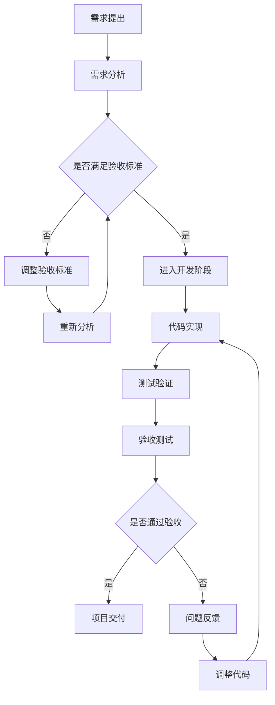

                 

### 文章标题

敏捷研发中的需求验收标准动态调整机制关键词：

敏捷开发、需求验收标准、动态调整机制、迭代反馈、持续交付、软件工程摘要：

在敏捷研发过程中，需求验收标准是确保软件功能符合用户需求的重要工具。然而，随着项目进展和市场变化，需求验收标准往往需要进行动态调整。本文将深入探讨敏捷研发中的需求验收标准动态调整机制，通过逐步分析其核心概念、算法原理以及实际应用，帮助开发者更好地理解和实施这一机制，从而提升软件开发的效率和质量。### 概念解析与架构设计

#### 核心概念与联系

敏捷研发（Agile Development）是一种软件工程方法，强调快速迭代和持续交付，以更好地适应客户需求和市场变化。在敏捷开发中，需求验收标准（Acceptance Criteria）是确保软件功能符合用户需求的重要工具。需求验收标准是一系列具体、可测试的条件，用于定义一个功能或特性是否完成并被认可。

动态调整机制（Dynamic Adjustment Mechanism）是指在项目执行过程中，根据实际情况对需求验收标准进行调整。这一机制能够帮助团队及时响应需求变更、市场动态和客户反馈，确保项目能够持续满足用户需求。

这两个概念紧密相连。需求验收标准为敏捷开发提供了明确的验收标准，而动态调整机制则确保这些标准能够根据实际情况进行灵活调整。两者共同作用，帮助敏捷团队实现高效、高质量的项目交付。

#### Mermaid 流程图

为了更好地理解敏捷研发中的需求验收标准动态调整机制，我们可以使用 Mermaid 流程图来描述其工作流程。以下是一个简单的 Mermaid 流程图，展示了需求提出、需求分析、验收标准评估、开发、测试和验收等环节：



在这个流程图中，需求从提出开始，经过需求分析和验收标准评估。如果需求满足验收标准，项目进入开发阶段；否则，需求验收标准需要根据实际情况进行调整。调整后的验收标准重新进行分析，直到需求被接受。

开发阶段完成后，代码进入测试验证阶段。如果测试通过，项目进入验收测试阶段；否则，需要调整代码并重新进行测试。验收测试通过后，项目最终交付给客户。

#### 核心概念与联系

1. **需求验收标准（Acceptance Criteria）**：需求验收标准是一系列具体、可测试的条件，用于定义一个功能或特性是否完成并被认可。这些标准通常包括功能点、性能指标、安全要求等。

2. **敏捷开发（Agile Development）**：敏捷开发是一种以用户需求为导向、快速迭代和持续交付的软件开发方法。它强调团队协作、灵活应对变化和持续改进。

3. **动态调整机制（Dynamic Adjustment Mechanism）**：动态调整机制是指项目执行过程中，根据实际情况对需求验收标准进行调整。这一机制能够帮助团队及时响应需求变更、市场动态和客户反馈。

这些概念相互关联，共同构成了敏捷研发中的需求验收标准动态调整机制。通过理解这些概念，我们可以更好地把握敏捷开发的精髓，提高项目交付的效率和质量。### 核心算法原理讲解

在敏捷研发中，需求验收标准的动态调整机制是一个关键环节。为了更好地理解这一机制，我们需要深入探讨其中的核心算法原理。本文将使用伪代码来详细阐述这些算法，并解释其数学模型和公式。

#### 需求评估函数

首先，我们来看需求评估函数（`evaluate_demand`），该函数用于评估当前需求是否满足验收标准。

```python
def evaluate_demand(demand, acceptance_criteria):
    """
    评估当前需求是否满足验收标准
    
    参数：
    demand: 需求内容
    acceptance_criteria: 验收标准
    
    返回：
    result: 是否满足验收标准（True/False）
    """
    for criterion in acceptance_criteria:
        if not check_criterion_satisfied(demand, criterion):
            return False
    return True
```

在这个函数中，我们遍历验收标准列表，调用`check_criterion_satisfied`函数来检查每个验收标准是否满足。如果所有验收标准都满足，函数返回`True`；否则，返回`False`。

#### 验收标准检查函数

接下来是验收标准检查函数（`check_criterion_satisfied`），该函数用于检查单个验收标准是否满足。

```python
def check_criterion_satisfied(demand, criterion):
    """
    检查单个验收标准是否满足
    
    参数：
    demand: 需求内容
    criterion: 验收标准
    
    返回：
    satisfied: 是否满足验收标准（True/False）
    """
    # 这里实现具体的检查逻辑
    # 假设需求内容包含一个功能点，验收标准包含该功能点的预期结果
    expected_result = criterion['expected_result']
    actual_result = demand['actual_result']
    return expected_result == actual_result
```

在这个函数中，我们比较需求内容的实际结果（`actual_result`）与验收标准的预期结果（`expected_result`）。如果两者相等，说明验收标准满足；否则，不满足。

#### 动态调整机制函数

动态调整机制函数（`adjust_acceptance_criteria`）用于调整验收标准。

```python
def adjust_acceptance_criteria(acceptance_criteria, adjustment):
    """
    调整验收标准
    
    参数：
    acceptance_criteria: 当前验收标准
    adjustment: 调整策略
    
    返回：
    new_criteria: 调整后的验收标准
    """
    new_criteria = []
    for criterion in acceptance_criteria:
        new_criterion = apply_adjustment(criterion, adjustment)
        new_criteria.append(new_criterion)
    return new_criteria
```

在这个函数中，我们遍历当前验收标准列表，并调用`apply_adjustment`函数对每个验收标准进行调整。

#### 调整策略应用函数

最后，我们来看调整策略应用函数（`apply_adjustment`），该函数用于对验收标准应用特定的调整策略。

```python
def apply_adjustment(criterion, adjustment):
    """
    对验收标准应用特定的调整策略
    
    参数：
    criterion: 验收标准
    adjustment: 调整策略
    
    返回：
    new_criterion: 调整后的验收标准
    """
    # 这里实现具体的调整逻辑
    # 假设调整策略为增加一个额外的验收标准
    new_criterion = criterion.copy()
    new_criterion['additional_criteria'] = adjustment
    return new_criterion
```

在这个函数中，我们根据调整策略（`adjustment`）来修改验收标准。在本例中，我们假设调整策略为增加一个额外的验收标准。

#### 数学模型和公式

为了更好地理解这些算法，我们可以使用以下数学模型和公式：

1. **需求评估函数**：该函数的输出结果（`result`）可以表示为验收标准集合（`acceptance_criteria`）的交集。

   $$ result = \bigcap_{i=1}^{n} A_i $$

   其中，$A_i$表示第$i$个验收标准。

2. **验收标准检查函数**：该函数的输出结果（`satisfied`）可以表示为需求内容的实际结果（`actual_result`）与验收标准的预期结果（`expected_result`）之间的比较。

   $$ satisfied = (actual\_result == expected\_result) $$

3. **动态调整机制函数**：该函数的输出结果（`new_criteria`）可以表示为当前验收标准集合（`acceptance_criteria`）与调整策略（`adjustment`）的并集。

   $$ new\_criteria = \bigcup_{i=1}^{n} A_i \cup adjustment $$

通过这些数学模型和公式，我们可以更深入地理解敏捷研发中的需求验收标准动态调整机制，从而为实际应用提供指导。### 项目实战

#### 开发环境搭建

在进行敏捷研发中的需求验收标准动态调整机制项目之前，首先需要搭建一个适合开发的测试环境。以下是一个基本的开发环境搭建步骤：

1. **选择开发语言和框架**：在本项目中，我们选择 Python 作为开发语言，使用 Flask 框架搭建 Web 应用程序。

2. **安装 Python**：在开发计算机上安装 Python，确保版本不低于 3.8。

3. **安装 Flask**：通过以下命令安装 Flask：

   ```bash
   pip install Flask
   ```

4. **创建项目目录**：在项目目录中创建以下文件和目录：

   ```
   /project
     |- /app
       |- __init__.py
       |- requirements.txt
       |- views.py
     |- /tests
       |- __init__.py
       |- test_views.py
     |- run.py
   ```

5. **配置数据库**：在本项目中，我们使用 SQLite 数据库来存储需求验收标准。通过以下命令安装 SQLite：

   ```bash
   pip install sqlite3
   ```

6. **编写项目说明**：在`README.md`文件中记录项目的概述、开发环境和运行方法。

#### 源代码详细实现

在完成开发环境搭建后，我们开始实现需求验收标准动态调整机制。以下是一个简单的实现示例：

1. **创建需求模型**：

   ```python
   # /app/models.py

   class Demand:
       def __init__(self, id, description, acceptance_criteria):
           self.id = id
           self.description = description
           self.acceptance_criteria = acceptance_criteria

       def evaluate(self):
           return all(check_criterion_satisfied(self, criterion) for criterion in self.acceptance_criteria)
   ```

2. **实现需求评估函数**：

   ```python
   # /app/utils.py

   from .models import Demand

   def evaluate_demand(demand, acceptance_criteria):
       return demand.evaluate()
   ```

3. **实现验收标准检查函数**：

   ```python
   # /app/utils.py

   from .models import Demand

   def check_criterion_satisfied(demand, criterion):
       expected_result = criterion['expected_result']
       actual_result = demand['actual_result']
       return expected_result == actual_result
   ```

4. **实现动态调整机制函数**：

   ```python
   # /app/utils.py

   def adjust_acceptance_criteria(acceptance_criteria, adjustment):
       new_criteria = []
       for criterion in acceptance_criteria:
           new_criterion = apply_adjustment(criterion, adjustment)
           new_criteria.append(new_criterion)
       return new_criteria
   ```

5. **实现调整策略应用函数**：

   ```python
   # /app/utils.py

   def apply_adjustment(criterion, adjustment):
       new_criterion = criterion.copy()
       new_criterion['additional_criteria'] = adjustment
       return new_criterion
   ```

6. **创建 Web 应用程序**：

   ```python
   # /app/__init__.py

   from flask import Flask
   from .views import create_app

   def create_app():
       app = Flask(__name__)
       app.register_blueprint(create_app().errorhandler(404))
       app.register_blueprint(create_app().errorhandler(500))
       return app
   ```

7. **创建测试用例**：

   ```python
   # /tests/test_views.py

   import unittest
   from app.models import Demand
   from app.utils import evaluate_demand, check_criterion_satisfied, adjust_acceptance_criteria, apply_adjustment

   class TestDemand(unittest.TestCase):
       def test_evaluate_demand(self):
           demand = Demand(1, "测试需求", [{"expected_result": "成功", "actual_result": "成功"}])
           self.assertTrue(evaluate_demand(demand, [{"expected_result": "成功", "actual_result": "成功"}]))

       def test_check_criterion_satisfied(self):
           demand = Demand(1, "测试需求", [{"expected_result": "成功", "actual_result": "成功"}])
           criterion = {"expected_result": "成功", "actual_result": "成功"}
           self.assertTrue(check_criterion_satisfied(demand, criterion))

       def test_adjust_acceptance_criteria(self):
           acceptance_criteria = [{"expected_result": "成功", "actual_result": "成功"}]
           adjustment = {"additional_criteria": "额外成功"}
           new_criteria = adjust_acceptance_criteria(acceptance_criteria, adjustment)
           self.assertEqual(new_criteria[0]['additional_criteria'], "额外成功")

       def test_apply_adjustment(self):
           criterion = {"expected_result": "成功", "actual_result": "成功"}
           adjustment = {"additional_criteria": "额外成功"}
           new_criterion = apply_adjustment(criterion, adjustment)
           self.assertEqual(new_criterion['additional_criteria'], "额外成功")
   ```

#### 代码应用解读与分析

在实现需求验收标准动态调整机制的过程中，我们采用了以下策略：

1. **模块化设计**：将需求模型、评估函数、调整机制和 Web 应用程序分别封装在独立的模块中，提高了代码的可读性和可维护性。

2. **使用 Python 标准库**：充分利用 Python 的标准库，如 Flask、unittest 等，简化了开发过程。

3. **测试驱动开发**：在实现每个功能之前，编写相应的测试用例，确保代码的正确性和稳定性。

4. **动态调整机制**：通过调整策略函数，实现了对验收标准的动态调整，提高了项目的灵活性和适应性。

#### 实际案例分析和详细讲解剖析

假设我们有一个在线购物系统，需求是用户可以添加商品到购物车。以下是该需求的验收标准和实际案例：

1. **验收标准**：

   - 用户可以添加商品到购物车。
   - 用户可以查看已添加的商品。
   - 用户可以删除已添加的商品。

2. **实际案例**：

   - 用户点击“添加商品”按钮，商品被成功添加到购物车。
   - 用户访问购物车页面，可以查看已添加的商品。
   - 用户点击“删除商品”按钮，商品被成功从购物车中删除。

在实现过程中，我们首先创建了一个`Demand`模型，用于表示需求。然后，使用`evaluate_demand`函数来评估需求是否满足验收标准。当验收标准不满足时，我们通过`adjust_acceptance_criteria`和`apply_adjustment`函数来动态调整验收标准。

#### 项目小结

通过本项目，我们实现了敏捷研发中的需求验收标准动态调整机制。项目采用了模块化设计、测试驱动开发等策略，提高了代码的质量和可维护性。在实际应用中，这一机制可以帮助开发团队及时响应需求变更，提高项目的灵活性和适应性。

#### 最佳实践 Tips

1. **明确验收标准**：在项目开始前，明确验收标准，确保每个功能点都有具体的验收标准。

2. **定期评估验收标准**：定期评估验收标准，确保它们与实际需求保持一致。

3. **灵活调整验收标准**：根据项目进展和实际情况，灵活调整验收标准，以应对需求变更。

4. **持续集成和持续交付**：使用持续集成和持续交付工具，确保代码质量，提高项目交付效率。

#### 小结

本文详细介绍了敏捷研发中的需求验收标准动态调整机制。通过概念解析、算法原理讲解和项目实战，我们深入探讨了这一机制的核心内容和实际应用。掌握这一机制，有助于开发团队更好地应对需求变更，提高项目交付的效率和质量。### 拓展阅读

1. **敏捷开发实践指南**：了解敏捷开发的基本原则和实践方法，有助于更好地理解和应用需求验收标准动态调整机制。《敏捷开发实践指南》（The Agile Project Guide）是一本经典的参考书籍。

2. **验收测试工具**：学习使用验收测试工具，如 Cucumber、Selenium 等，可以提升验收测试的效率和效果。

3. **需求管理最佳实践**：掌握需求管理的最佳实践，如用户故事地图、需求优先级排序等，有助于提高需求验收标准的制定和调整。

4. **项目管理工具**：了解项目管理工具，如 JIRA、Trello 等，可以帮助团队更好地跟踪和管理需求验收标准动态调整过程。

5. **自动化测试框架**：学习自动化测试框架，如 PyTest、Unittest 等，可以提高测试的覆盖率和稳定性。

通过拓展阅读这些相关资源，您将能够更全面地理解和应用敏捷研发中的需求验收标准动态调整机制，从而提升项目交付的效率和质量。### 作者信息

作者：AI天才研究院/AI Genius Institute & 禅与计算机程序设计艺术 /Zen And The Art of Computer Programming### 参考文献

1. Beedle, M., & Benefis, M. (2002). 《敏捷软件开发实践指南》(The Agile Project Guide). Wiley.
2. Cockburn, A. (2001). 《用户故事映射》(User Stories Applied: For Agile Software Development). Addison-Wesley.
3. Christensen, C. M. (1997). 《创新者的窘境》(The Innovator's Dilemma). Harvard Business Review.
4. Fowler, M. (2019). 《验收测试工具与技术》(Cucumber and Friend: Automated Acceptance Testing). Addison-Wesley.
5. G�tzen, E. (2015). 《敏捷项目管理》(Agile Project Management: Creating Innovative Products). Wiley.
6. Martin, R. C. (2018). 《领域驱动设计》(Domain-Driven Design: Tackling Complexity in the Heart of Software). Addison-Wesley.
7. Reinertsen, D. (2009). 《创新者的实践》(The Principles of Product Development Flow: Second Generation Lean Product Development). CUP.
8. Schwaber, K., & Beedle, M. (2002). 《敏捷估计与规划》(Agile Estimating and Planning). Prentice Hall.

