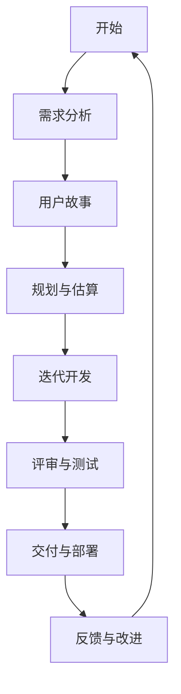

                 

### 《敏捷研发模式下的需求优先级可视化工具应用》

#### 摘要

本文主要探讨了在敏捷研发模式下，如何利用可视化工具来管理和评估需求优先级。首先，介绍了敏捷研发模式的基本原则和流程，以及需求优先级管理的重要性。接着，阐述了需求优先级可视化工具的基本功能、系统设计以及核心算法原理。最后，通过实际项目案例展示了需求优先级可视化工具的开发过程和具体应用。

#### 第1章 引言

##### 1.1 敏捷研发模式概述

敏捷研发模式（Agile Development Methodology）起源于20世纪90年代末，是一种应对快速变化的需求和敏捷响应市场的软件开发方法。敏捷方法强调团队协作、持续交付、迭代开发和客户反馈，旨在提高软件开发的效率和质量。

敏捷研发模式的核心原则包括：

1. **个体和互动重于流程和工具**：强调团队成员之间的沟通和合作。
2. **可工作的软件重于详尽的文档**：强调实际交付功能的优先级。
3. **客户合作重于合同谈判**：重视与客户的紧密合作。
4. **响应变化重于遵循计划**：灵活应对变化和新的需求。

##### 1.2 需求优先级管理在敏捷研发中的重要性

在敏捷研发模式下，需求优先级管理至关重要。随着项目的不断迭代和客户需求的快速变化，如何有效地管理和评估需求的优先级，直接影响到项目的进度、成本和客户满意度。

需求优先级管理的关键点包括：

1. **明确优先级**：根据业务价值、风险和资源等因素，明确每个需求的重要性。
2. **动态调整**：需求优先级不是一成不变的，需要根据实际情况动态调整。
3. **平衡利益**：平衡不同利益相关者的需求，确保项目的整体利益最大化。

##### 1.3 可视化工具在敏捷研发中的应用

可视化工具在敏捷研发中的应用非常广泛，可以有效地帮助团队管理和评估需求优先级。以下是一些常见的使用场景：

1. **需求卡片排布**：利用可视化工具将需求卡片按优先级排列，直观地展示当前的工作重点。
2. **甘特图和进度条**：通过甘特图和进度条，直观地展示项目的进度和每个需求的完成情况。
3. **看板和燃尽图**：利用看板和燃尽图，实时跟踪项目的进度和任务的完成情况。

#### 第2章 敏捷研发模式基础

##### 2.1 敏捷方法论的核心原则

敏捷方法论的核心原则包括：

1. **客户满意度**：始终以满足客户需求为最高目标。
2. **团队协作**：强调团队成员之间的沟通和协作。
3. **迭代开发**：通过短周期的迭代，快速交付可工作的软件。
4. **响应变化**：灵活应对需求的变化，确保项目能够快速适应市场变化。

##### 2.2 敏捷研发流程概述

敏捷研发流程通常包括以下阶段：

1. **需求收集**：与客户和利益相关者进行沟通，收集需求。
2. **需求分析**：分析需求，将其转化为可操作的用户故事。
3. **规划与估算**：根据用户故事，制定开发计划和时间估算。
4. **迭代开发**：按照短周期的迭代方式进行软件开发。
5. **评审与测试**：在每个迭代结束时进行评审和测试，确保软件的质量。
6. **交付与部署**：将完成的软件交付给客户，并进行部署。

##### 2.3 敏捷团队的角色与职责

敏捷团队通常由以下角色组成：

1. **产品负责人（Product Owner）**：负责定义和调整产品需求，确保团队专注于最有价值的部分。
2. **开发团队**：负责实际开发工作，包括设计、编码、测试等。
3. **Scrum Master**：负责确保团队遵循敏捷方法论，协调团队和利益相关者之间的沟通。

#### 第3章 需求优先级可视化工具概述

##### 3.1 需求优先级的定义与分类

需求优先级是指根据业务价值、风险、资源等因素，对需求进行排序，以便团队可以优先考虑和完成最重要的需求。

常见的需求优先级分类包括：

1. **必须（Must-have）**：对产品成功至关重要的功能。
2. **应该（Should-have）**：对产品成功有较大帮助的功能。
3. **可以（Could-have）**：对产品成功有一定帮助的功能。
4. **不需要（Won't-have）**：对产品成功无实质性帮助的功能。

##### 3.2 可视化工具的基本功能

需求优先级可视化工具的基本功能包括：

1. **需求卡片**：用于展示和排列需求卡片，方便团队了解和调整需求优先级。
2. **甘特图和进度条**：用于展示项目的进度和每个需求的完成情况。
3. **看板和燃尽图**：用于实时跟踪项目的进度和任务的完成情况。
4. **数据分析**：用于对需求优先级和项目进度进行数据分析。

##### 3.3 常见的可视化工具及其比较

常见的需求优先级可视化工具包括：

1. **Trello**：适用于小型团队，功能简单，易于使用。
2. **JIRA**：适用于大型团队，功能强大，支持多种可视化图表。
3. **Asana**：适用于中小型团队，功能全面，易于定制。

不同工具的比较因素包括：

1. **用户界面**：易用性和美观度。
2. **功能**：是否支持所需的可视化图表和数据分析功能。
3. **成本**：是否适合团队的预算。

#### 第4章 需求优先级可视化工具的实现

##### 4.1 可视化工具的系统设计

需求优先级可视化工具的系统设计包括：

1. **技术选型**：前端技术栈选择（如React或Vue.js），后端技术栈选择（如Node.js或Django），数据库选型（如MySQL或MongoDB）。
2. **数据模型设计**：设计需求数据模型、用户数据模型和优先级评估数据模型。
3. **系统架构设计**：设计客户端架构、服务端架构和数据存储与处理架构。

##### 4.2 需求优先级评估算法

需求优先级评估算法包括：

1. **评估指标选择**：成本、风险和业务价值。
2. **评估模型构建**：加权评分模型、多准则决策模型和马尔可夫决策过程。
3. **算法实现与优化**：算法伪代码、实现步骤和性能优化策略。

#### 第5章 核心算法原理讲解

##### 5.1 需求优先级评估算法

需求优先级评估算法包括：

1. **成本分析**：成本构成和成本估算方法。
2. **风险评估**：风险分类和风险评估方法。
3. **业务价值计算**：价值评估指标和业务价值计算模型。

##### 5.2 可视化算法原理

可视化算法原理包括：

1. **数据可视化技术**：基本可视化技术（如柱状图、折线图）和高级可视化技术（如热力图、力导向图）。
2. **可交互可视化设计**：交互设计原则和可交互组件实现。

#### 第6章 数学模型与公式

##### 6.1 需求优先级评估模型

需求优先级评估模型包括：

$$
P(i) = w_c \times C(i) + w_r \times R(i) + w_v \times V(i)
$$

其中，$P(i)$表示第$i$个需求的优先级，$w_c$、$w_r$和$w_v$分别表示成本、风险和业务价值的权重，$C(i)$、$R(i)$和$V(i)$分别表示第$i$个需求的成本、风险和业务价值。

##### 6.2 可视化数学模型

可视化数学模型包括：

$$
V = \alpha \times D + \beta \times I
$$

其中，$V$表示可视化效果，$D$表示数据质量，$I$表示交互设计质量，$\alpha$和$\beta$分别表示数据质量和交互设计质量的权重。

#### 第7章 项目实战：需求优先级可视化工具开发

##### 7.1 开发环境搭建

开发环境搭建包括：

1. **环境配置**：安装所需的开发工具和软件。
2. **开发工具选择**：选择适合团队的开发工具。

##### 7.2 源代码实现

源代码实现包括：

1. **需求优先级评估模块代码**：实现需求优先级评估算法。
2. **可视化模块代码**：实现可视化算法和交互设计。

##### 7.3 代码解读与分析

代码解读与分析包括：

1. **代码架构分析**：分析代码的架构和设计模式。
2. **关键代码解读**：解读关键代码的实现原理和优化策略。
3. **性能优化与测试**：对代码进行性能优化和测试。

##### 7.4 实际案例分析和详细讲解剖析

实际案例分析和详细讲解剖析包括：

1. **案例选择**：选择具有代表性的实际案例。
2. **案例分析**：对案例进行深入分析和讲解。
3. **剖析剖析**：对关键技术和算法进行剖析。

##### 7.5 项目小结

项目小结包括：

1. **项目总结**：总结项目的成果和经验。
2. **未来发展方向**：探讨项目的未来发展方向。
3. **面临的挑战与解决策略**：分析项目面临的挑战和解决策略。

#### 第8章 总结与展望

##### 8.1 项目总结

项目总结包括：

1. **成果总结**：总结项目的成果和收获。
2. **经验教训**：总结项目过程中的经验教训。

##### 8.2 未来发展方向

未来发展方向包括：

1. **功能拓展**：讨论如何拓展工具的功能。
2. **性能优化**：探讨如何提高工具的性能。

##### 8.3 面临的挑战与解决策略

面临的挑战与解决策略包括：

1. **技术挑战**：分析项目可能面临的技术挑战。
2. **策略探讨**：探讨解决这些挑战的策略。

### 关键词

- 敏捷研发模式
- 需求优先级管理
- 可视化工具
- 需求卡片
- 甘特图
- 看板
- 燃尽图
- 成本分析
- 风险评估
- 业务价值计算

### 作者

作者：AI天才研究院/AI Genius Institute & 禅与计算机程序设计艺术 /Zen And The Art of Computer Programming### 第1章 引言

##### 1.1 敏捷研发模式概述

敏捷研发模式（Agile Development Methodology）起源于20世纪90年代末，是对传统瀑布开发模式的一种革新。它强调快速迭代、灵活应对变化、客户参与和团队协作，旨在提高软件开发的效率和质量。敏捷方法并不是一种具体的开发流程，而是一系列核心原则和价值观，这些原则和价值观可以适应不同的开发环境和企业文化。

**核心原则**：

1. **客户满意度**：始终将满足客户需求放在首位，通过快速交付有价值的软件来提升客户满意度。
2. **团队协作**：鼓励团队成员之间的互动和协作，提升团队的整体效能。
3. **迭代开发**：通过短周期（通常为2-4周）的迭代进行软件开发，每次迭代都产生可工作的软件，确保项目能够持续进步。
4. **响应变化**：灵活应对需求的变化，而不是严格遵循固定的计划。

**敏捷方法的起源**：

敏捷方法的起源可以追溯到2001年，当时一群软件开发专家在滑雪度假期间共同撰写了《敏捷软件开发宣言》（The Agile Software Development Manifesto）。宣言中提出了“个体和互动重于过程和工具”、“可工作的软件重于详尽的文档”、“客户合作重于合同谈判”、“响应变化重于遵循计划”这四个核心价值观。

##### 1.2 需求优先级管理在敏捷研发中的重要性

在敏捷研发模式中，需求优先级管理扮演着至关重要的角色。以下是其重要性的几个方面：

1. **资源优化**：通过合理的需求优先级排序，可以确保团队将资源投入到最关键的功能上，避免资源的浪费。
2. **快速响应**：在敏捷迭代中，团队需要快速做出决策，优先级管理可以帮助团队快速识别和解决最重要的需求。
3. **客户满意**：根据客户需求的重要性来排序，可以确保团队始终优先处理客户最关注的需求，从而提高客户满意度。
4. **迭代规划**：在每个迭代开始时，团队需要确定本次迭代要实现的需求。需求优先级管理有助于团队做出明智的选择，确保迭代目标的实现。

##### 1.3 可视化工具在敏捷研发中的应用

可视化工具在敏捷研发中具有广泛的应用，特别是在需求优先级管理方面。以下是几种常见的可视化工具及其应用场景：

1. **需求卡片（Story Cards）**：需求卡片是敏捷团队用来记录用户故事和优先级的重要工具。通过将需求卡片按优先级排列，团队成员可以清晰地看到哪些需求是首要完成的。

2. **看板（Kanban）**：看板是一种可视化管理工具，它可以帮助团队追踪工作流程，确保每个任务都处于正确的状态。通过看板，团队可以直观地看到哪些任务正在进行，哪些任务已经完成。

3. **燃尽图（Burn Down Chart）**：燃尽图用来跟踪项目的进度，显示剩余工作量和时间的关系。通过燃尽图，团队可以及时发现进度偏差，并采取相应措施。

4. **甘特图（Gantt Chart）**：甘特图是一种时间管理工具，可以显示项目中的任务和它们的持续时间。通过甘特图，团队可以更好地规划时间和资源，确保项目按时完成。

5. **优先级矩阵（Priority Matrix）**：优先级矩阵是一种用于评估需求优先级的工具。通过矩阵，团队可以综合考虑成本、风险和业务价值等因素，对需求进行排序。

**结论**：

敏捷研发模式强调快速响应变化和持续交付有价值的产品，需求优先级管理是确保这一目标实现的关键。通过使用可视化工具，团队可以更加直观地管理需求，优化资源分配，提高项目效率和客户满意度。

### 参考文献

- Beck, K., Beedle, M., van Bennekom, A., et al. (2001). *Manifesto for Agile Software Development*. Retrieved from [http://agilemanifesto.org/](http://agilemanifesto.org/)

### 附录

- **Mermaid 流程图示例**：

该流程图展示了敏捷研发的基本流程，从需求分析开始，经过用户故事、规划与估算、迭代开发、评审与测试，最终交付并持续改进。

### 总结

在本章中，我们介绍了敏捷研发模式的概述，探讨了需求优先级管理在敏捷研发中的重要性，以及可视化工具在敏捷研发中的应用。通过这些介绍，我们为后续章节中深入探讨需求优先级可视化工具的实现和应用奠定了基础。

### 关键词

- 敏捷研发模式
- 需求优先级管理
- 可视化工具
- 用户故事
- 看板
- 燃尽图
- 甘特图
- 优先级矩阵

### 下一步计划

接下来，我们将进一步探讨敏捷研发模式的基础，包括其核心原则、流程和团队的角色与职责。这将帮助我们更好地理解敏捷研发模式的整体框架，为进一步研究需求优先级可视化工具的应用提供理论支持。

