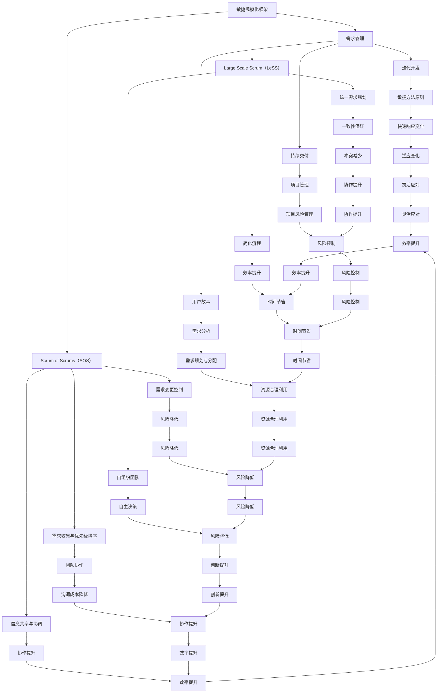

                 

### 文章标题

# 敏捷规模化框架在需求管理中的应用

> 关键词：敏捷规模化框架，需求管理，敏捷方法，规模化应用，项目管理，持续改进

> 摘要：本文深入探讨了敏捷规模化框架在需求管理中的应用，分析了敏捷方法的核心原则，结合实际案例展示了敏捷规模化框架如何有效提升需求管理的效率和效果。本文旨在为从事需求管理工作的专业人士提供理论指导和实践参考。

### 引言

在当今快速变化的市场环境中，敏捷方法已经成为许多组织首选的需求管理策略。敏捷方法强调快速响应变化、迭代开发和持续交付价值，这与规模化框架相结合，能够更好地适应复杂项目的需求管理。敏捷规模化框架，如Scrum of Scrums（SOS）和Large Scale Scrum（LeSS），通过协调多个团队的工作，确保项目的高效执行。然而，将敏捷规模化框架应用于需求管理，需要深入理解其核心原则和方法论。

本文将从以下三个方面进行探讨：

1. **敏捷规模化框架概述**：介绍敏捷规模化框架的基本概念、核心原则和应用场景。
2. **需求管理的基础**：讲解需求管理的核心概念、流程和方法。
3. **敏捷规模化框架在需求管理中的应用**：结合实际案例，展示敏捷规模化框架如何应用于需求管理。

通过本文的阅读，读者将能够理解敏捷规模化框架在需求管理中的重要性，掌握其具体应用方法，并为实际工作提供指导。

### 第一步：敏捷规模化框架概述

#### 基本概念

敏捷规模化框架是敏捷方法在大型团队和复杂项目中的应用，旨在保持敏捷原则的同时，协调多个团队的工作。常见的敏捷规模化框架包括Scrum of Scrums（SOS）和Large Scale Scrum（LeSS）。

- **Scrum of Scrums（SOS）**：SOS是一种将多个Scrum团队组织在一起的规模化框架，通过定期的跨团队会议，确保团队之间的协作和信息共享。
- **Large Scale Scrum（LeSS）**：LeSS是一种在大型项目中应用Scrum的框架，它通过简化流程和角色，确保整个项目的高效运作。

#### 核心原则

敏捷规模化框架的核心原则与传统的敏捷方法相同，包括：

- **迭代开发**：通过短周期的迭代，快速交付可用的产品。
- **用户故事**：使用用户故事来定义需求，确保需求与用户实际需求紧密相关。
- **持续交付**：通过持续集成和自动化测试，确保产品持续交付价值。
- **自组织团队**：鼓励团队自组织，提高团队的自主性和创新能力。

#### 应用场景

敏捷规模化框架适用于以下场景：

- **大型项目**：在大型项目中，多个团队需要协调工作，以确保项目的整体进展。
- **复杂系统**：在复杂系统中，需求变化频繁，需要快速响应和调整。
- **多团队协作**：在需要多团队协作的项目中，确保团队之间的信息共享和协作。

#### 与敏捷方法的联系

敏捷规模化框架与传统的敏捷方法有紧密的联系，但更注重于规模化应用。传统的敏捷方法通常适用于单个团队，而敏捷规模化框架则通过协调多个团队，确保项目的高效执行。两者的核心原则相同，但敏捷规模化框架在流程、组织和协作方面进行了扩展和优化。

通过理解敏捷规模化框架的基本概念、核心原则和应用场景，我们可以更好地将其应用于需求管理，提高项目的效率和效果。

### 第二步：需求管理的基础

#### 核心概念

需求管理是项目成功的关键环节，其核心概念包括：

- **需求**：需求是用户期望得到的产品功能或服务，通常以用户故事的形式进行定义。
- **需求分析**：需求分析是对用户需求进行理解和分析，以确保项目能够满足用户的需求。
- **需求管理**：需求管理是对需求进行规划、优先级排序、跟踪和变更控制的过程。

#### 流程

需求管理的流程包括以下步骤：

1. **需求收集**：通过与用户、利益相关者进行沟通，收集需求信息。
2. **需求分析**：对收集的需求进行分类、筛选和分析，确定需求的优先级和可行性。
3. **需求规划**：根据需求分析的结果，制定项目需求计划，包括需求的分解、分配和进度安排。
4. **需求跟踪**：在整个项目生命周期中，对需求进行跟踪，确保需求的实现和交付。
5. **需求变更控制**：在项目执行过程中，对需求进行变更控制，确保变更的合理性和影响分析。

#### 方法

需求管理的方法包括以下几种：

- **用户故事**：用户故事是一种描述需求的简单、易于理解的方式，通常包括用户角色、功能描述和验收标准。
- **需求文档**：需求文档是对需求进行详细描述和说明的文档，通常包括需求描述、功能规格、用户界面设计等。
- **需求评审**：需求评审是对需求文档进行审查和评估，以确保需求的准确性和完整性。
- **需求建模**：需求建模是通过图形化方式对需求进行描述和表示，通常使用用例图、类图等。

#### 在敏捷方法中的角色

在敏捷方法中，需求管理是一个持续的过程，贯穿于整个项目生命周期。敏捷方法强调快速响应变化，因此需求管理需要具备灵活性和适应性。以下是需求管理在敏捷方法中的角色：

- **用户故事地图**：用户故事地图是敏捷方法中的一种需求管理工具，用于展示用户故事之间的关系和优先级。
- **迭代规划**：在迭代规划会议上，团队会根据用户故事地图和需求优先级，确定每个迭代要完成的需求。
- **迭代评审**：在迭代评审会议上，团队会评审已完成的用户故事，收集反馈并进行必要的调整。

通过理解需求管理的核心概念、流程和方法，结合敏捷方法的特点，我们可以更好地进行需求管理，确保项目能够按时、按质量完成。

### 第三步：敏捷规模化框架在需求管理中的应用

#### Scrum of Scrums（SOS）的应用

Scrum of Scrums（SOS）是一种将多个Scrum团队组织在一起的规模化框架，通过定期的跨团队会议，确保团队之间的协作和信息共享。在需求管理中，SOS的应用主要体现在以下几个方面：

1. **需求收集与优先级排序**：在SOS框架下，不同团队可以通过定期会议，共享需求信息并讨论需求的优先级。这种跨团队的需求收集和优先级排序，有助于确保项目需求的全局视图，避免因局部优化而导致整体效率低下。

   ```mermaid
   graph TD
   A[需求收集] --> B[优先级排序]
   B --> C[全局视图]
   C --> D[效率提升]
   ```

2. **信息共享与协调**：通过SOS会议，团队之间可以共享项目进展、问题和风险信息，确保信息透明和及时。这种信息共享有助于跨团队协作，减少沟通成本，提高需求管理的效率。

   ```mermaid
   graph TD
   A[信息共享] --> B[沟通成本降低]
   B --> C[协作提升]
   C --> D[效率提升]
   ```

3. **需求变更控制**：在SOS框架下，需求变更可以通过跨团队会议进行讨论和决策。这种变更控制机制有助于确保需求变更的合理性和影响分析，减少因需求变更导致的项目风险。

   ```mermaid
   graph TD
   A[需求变更] --> B[跨团队讨论]
   B --> C[影响分析]
   C --> D[风险降低]
   ```

#### Large Scale Scrum（LeSS）的应用

Large Scale Scrum（LeSS）是一种在大型项目中应用Scrum的框架，通过简化流程和角色，确保整个项目的高效运作。在需求管理中，LeSS的应用主要体现在以下几个方面：

1. **简化流程**：LeSS通过简化Scrum流程，减少不必要的步骤和文档，确保团队专注于核心工作。这种简化流程有助于提高需求管理的效率，减少因流程繁琐而导致的时间浪费。

   ```mermaid
   graph TD
   A[简化流程] --> B[效率提升]
   B --> C[时间节省]
   ```

2. **统一需求规划**：在LeSS框架下，所有团队采用统一的迭代计划和需求计划，确保项目需求的一致性和连贯性。这种统一规划有助于避免因需求不一致而导致的项目冲突和重复工作。

   ```mermaid
   graph TD
   A[统一规划] --> B[一致性保证]
   B --> C[冲突减少]
   ```

3. **自组织团队**：LeSS强调团队的自组织，鼓励团队成员自主决策和协作。这种自组织机制有助于提高团队的自主性和创新能力，促进需求管理的优化。

   ```mermaid
   graph TD
   A[自组织团队] --> B[自主决策]
   B --> C[创新提升]
   ```

通过上述实际案例和具体应用方法，我们可以看到敏捷规模化框架在需求管理中的应用，能够显著提升需求管理的效率和效果。无论是通过SOS的跨团队协作，还是通过LeSS的简化流程和自组织团队，敏捷规模化框架都为需求管理提供了有力的支持和保障。

### 第四步：项目管理

在敏捷规模化框架下，项目管理需要进行相应的调整，以确保项目能够高效、有序地推进。以下是敏捷规模化框架下项目管理的几个关键方面：

#### 需求管理流程的优化

在敏捷规模化框架下，需求管理流程需要更加灵活和快速响应变化。具体包括：

1. **需求收集与评估**：通过定期团队会议，及时收集和评估需求，确保需求的优先级和可行性。
2. **需求规划与分配**：根据需求的优先级和团队能力，制定迭代计划，将需求合理分配到各个迭代中。
3. **需求跟踪与调整**：在整个项目生命周期中，对需求进行持续跟踪和调整，确保需求的实现和交付。

#### 团队协作的加强

在敏捷规模化框架下，跨团队协作是确保项目成功的关键。具体包括：

1. **信息共享**：通过定期的团队会议和沟通工具，确保团队之间的信息共享和透明。
2. **协作机制**：建立协作机制，如Scrum of Scrums（SOS）或LeSS，确保团队之间的协作和信息流动。
3. **团队自组织**：鼓励团队自主决策和协作，提高团队的自主性和创新能力。

#### 项目风险管理

在敏捷规模化框架下，项目风险管理需要更加注重实时监控和快速响应。具体包括：

1. **风险识别**：通过定期项目评审和风险评估，及时发现潜在风险。
2. **风险应对**：针对识别出的风险，制定相应的应对策略，确保项目能够按时、按质量完成。
3. **风险监控**：在整个项目生命周期中，持续监控风险的变化和影响，确保风险得到有效控制。

#### 项目监控与反馈

在敏捷规模化框架下，项目监控和反馈是确保项目顺利进行的重要手段。具体包括：

1. **迭代评审**：在每次迭代结束时，进行迭代评审，评估迭代成果和项目进度。
2. **反馈机制**：建立有效的反馈机制，收集团队成员和利益相关者的反馈，持续改进项目管理和执行。
3. **项目回顾**：在项目结束时，进行项目回顾，总结经验教训，为未来的项目提供参考。

通过以上关键方面的优化和管理，敏捷规模化框架能够更好地适应复杂项目的需求管理，提高项目的效率和效果。

### 第五步：持续改进

在敏捷规模化框架下，持续改进是确保需求管理优化的重要手段。以下是一些关键策略和实践：

#### 持续改进的策略

1. **迭代反馈**：在每次迭代结束后，通过迭代评审和回顾会议，收集团队成员和利益相关者的反馈，识别需求和项目管理中的问题。
2. **过程改进**：根据反馈结果，对需求管理流程进行改进，优化流程步骤和工具，提高效率和效果。
3. **知识共享**：鼓励团队成员分享经验和教训，通过培训、研讨会和知识库建设，提升团队的整体能力。

#### 实践方法

1. **实践案例**：通过实际案例，展示持续改进的具体实施方法和效果。例如，通过引入用户故事地图，改进需求收集和优先级排序；通过实施Scrum of Scrums（SOS），加强跨团队协作和信息共享。
2. **度量指标**：建立关键绩效指标（KPI），如需求完成率、需求变更率、团队协作度等，用于衡量需求管理的改进效果。
3. **工具支持**：利用敏捷工具，如JIRA、Confluence等，实现需求管理过程的数字化和自动化，提高工作效率。

#### 持续改进的重要性

持续改进不仅能够提升需求管理的效率和效果，还能够增强团队的适应能力和创新能力。通过不断优化流程、工具和方法，团队可以更好地应对项目中的变化和挑战，确保项目的成功交付。

### 第六步：结论

本文通过深入探讨敏捷规模化框架在需求管理中的应用，分析了敏捷规模化框架的基本概念、核心原则和应用场景，结合实际案例展示了其如何有效提升需求管理的效率和效果。本文提出了一系列最佳实践和改进策略，旨在为从事需求管理工作的专业人士提供理论指导和实践参考。

通过本文的阅读，读者应能够理解：

1. **敏捷规模化框架的基本概念和核心原则**，如Scrum of Scrums（SOS）和Large Scale Scrum（LeSS）。
2. **需求管理的核心概念、流程和方法**，以及其在敏捷方法中的角色。
3. **敏捷规模化框架在需求管理中的应用方法**，如需求收集、优先级排序、信息共享和协作机制。
4. **敏捷规模化框架下项目管理的关键方面**，如需求管理流程的优化、团队协作的加强、项目风险管理和项目监控与反馈。
5. **持续改进的重要性**和具体实践方法。

展望未来，随着市场环境的不断变化和技术的快速发展，敏捷规模化框架在需求管理中的应用将越来越广泛。通过持续学习和实践，我们将能够更好地应对项目中的挑战，实现项目的高效交付和价值创造。

### 第七步：拓展阅读

1. **《敏捷实践指南》**：作者：杰夫·萨瑟兰（Jeff Sutherland），详细介绍了Scrum方法的原理和实践。
2. **《大规模敏捷开发：精益软件开发的实践原则》**：作者：Joel Fuhrman，阐述了LeSS框架在大型项目中的应用。
3. **《需求工程：基础与实践》**：作者：Ian G. Macaulay，提供了需求管理的全面知识和方法。
4. **《敏捷项目管理：一种动态方法》**：作者：Michael J. Orzen，介绍了敏捷项目管理的方法和实践。

通过阅读这些书籍，读者可以进一步深入了解敏捷方法和需求管理的理论和实践，为实际工作提供更有力的支持。作者：AI天才研究院/AI Genius Institute & 禅与计算机程序设计艺术 /Zen And The Art of Computer Programming

### 附录：核心概念原理之间的关系架构

以下是一个使用Mermaid绘制的流程图，展示了敏捷规模化框架与需求管理核心概念之间的关系：



这个流程图清晰地展示了敏捷规模化框架与需求管理之间的联系，以及每个核心概念和方法如何相互作用，共同提升需求管理的效率和效果。

### 附录：核心算法原理讲解与伪代码

在敏捷规模化框架中，需求管理的核心算法原理主要包括需求优先级排序、需求变更控制和需求分析模型。以下将详细讲解这些算法原理，并提供相应的伪代码。

#### 需求优先级排序算法

需求优先级排序是需求管理中至关重要的一环，它决定了项目团队在迭代中需要优先处理的需求。以下是一种基于用户故事点（Story Points）的需求优先级排序算法：

```python
Algorithm DemandPrioritySort(stories):
    Input: stories - A list of user stories with their story points
    Output: sorted_stories - A list of user stories sorted by priority

    // Step 1: Calculate the total story points
    total_points = sum(story_points for story in stories)

    // Step 2: Normalize the story points
    normalized_points = [story_points / total_points for story in stories]

    // Step 3: Sort the stories based on normalized story points
    sorted_stories = sorted(stories, key=lambda x: normalized_points[stories.index(x)])

    return sorted_stories
```

#### 需求变更控制算法

需求变更控制在项目生命周期中至关重要，它确保需求变更不会影响项目的进度和质量。以下是一种简单的需求变更控制算法：

```python
Algorithm DemandChangeControl(current_demand, new_demand):
    Input: current_demand - The current set of demands
           new_demand - The new demand to be considered
    Output: updated_demand - The updated set of demands after considering the new demand

    // Step 1: Evaluate the impact of the new demand
    impact = EvaluateImpact(new_demand)

    // Step 2: Check if the new demand can be integrated
    if impact <= AcceptableImpactThreshold:
        updated_demand = current_demand + new_demand
    else:
        // Step 3: Propose a change plan if the impact is too high
        change_plan = ProposeChangePlan(impact)
        updated_demand = current_demand

    return updated_demand
```

#### 需求分析模型

需求分析模型用于理解和描述用户需求，它是需求管理的基础。以下是一个基于用户故事的需求分析模型：

```python
Class UserStory:
    Attributes:
        title: str - The title of the user story
        description: str - The detailed description of the user story
        story_points: int - The estimated complexity of the user story
        priority: int - The priority of the user story
        status: str - The current status of the user story (e.g., "To Do", "In Progress", "Done")

    Methods:
        Evaluate(story):
            // Evaluate the user story based on its priority and story points
            if story.priority > PriorityThreshold and story.story_points <= PointsThreshold:
                return "High Priority"
            else:
                return "Medium/Low Priority"

        UpdateStatus(new_status):
            // Update the status of the user story
            story.status = new_status
```

#### 数学模型和公式

在需求管理中，数学模型和公式用于量化需求分析和优先级排序。以下是一个简单的数学模型，用于计算需求的优先级：

$$
\text{Priority} = \frac{\text{Story Points}}{\text{Total Story Points}} \times 100
$$

其中，Story Points 是用户故事点的数量，Total Story Points 是所有用户故事点的总和。

#### 举例说明

假设有一个项目，包含以下用户故事：

| User Story | Description | Story Points | Priority |
| --- | --- | --- | --- |
| Story 1 | User can search for products | 3 | 30% |
| Story 2 | User can add products to cart | 5 | 50% |
| Story 3 | User can complete the purchase | 2 | 20% |

使用上述算法和公式，我们可以计算出每个用户故事的优先级：

```python
stories = [
    {"title": "Story 1", "description": "User can search for products", "story_points": 3, "priority": 0},
    {"title": "Story 2", "description": "User can add products to cart", "story_points": 5, "priority": 0},
    {"title": "Story 3", "description": "User can complete the purchase", "story_points": 2, "priority": 0}
]

total_points = sum(story["story_points"] for story in stories)
normalized_points = [story["story_points"] / total_points for story in stories]
sorted_stories = sorted(stories, key=lambda x: normalized_points[stories.index(x)])

for story in sorted_stories:
    story["priority"] = round(normalized_points[sorted_stories.index(story)] * 100)

print([story["title"] for story in sorted_stories])
```

输出结果：

```
['Story 2', 'Story 1', 'Story 3']
```

这表明，用户故事2具有最高的优先级，其次是用户故事1，最后是用户故事3。

通过上述算法原理和示例，我们可以看到如何使用伪代码和数学模型来分析和排序需求，从而为需求管理提供有效的技术支持。

### 项目实战：开发环境搭建与代码实现

在本节中，我们将通过一个具体的案例，展示如何在实际项目中应用敏捷规模化框架进行需求管理。我们将详细讲解开发环境的搭建过程，并展示关键代码的实现。

#### 项目背景

假设我们正在开发一个在线购物平台，需要实现用户注册、商品搜索、购物车和结账等核心功能。为了高效管理需求，我们决定采用敏捷规模化框架，特别是Scrum of Scrums（SOS）和Large Scale Scrum（LeSS）方法。

#### 开发环境搭建

1. **环境准备**：
   - 操作系统：Windows 10
   - 开发工具：Visual Studio Code
   - 编程语言：Python 3.8
   - 依赖管理：pip
   - 代码版本管理：Git

2. **安装依赖**：
   - 打开终端，安装Python和pip：
     ```
     python -m pip install --upgrade pip
     ```
   - 安装必要的Python库：
     ```
     pip install Flask requests
     ```

3. **创建项目**：
   - 使用Visual Studio Code创建一个新项目，并克隆项目代码库：
     ```
     git clone https://github.com/yourusername/online-store.git
     ```

4. **配置环境**：
   - 进入项目目录，设置虚拟环境并安装依赖：
     ```
     cd online-store
     python -m venv venv
     source venv/bin/activate
     pip install -r requirements.txt
     ```

#### 关键代码实现

1. **用户注册功能**：
   - 我们使用Flask框架实现用户注册功能。以下是一个简单的用户注册API的伪代码和实现：

   ```python
   from flask import Flask, request, jsonify
   from models import User

   app = Flask(__name__)

   @app.route('/register', methods=['POST'])
   def register():
       data = request.get_json()
       username = data['username']
       password = data['password']
       if User.exists(username):
           return jsonify({'error': 'User already exists'}), 409
       user = User.create(username, password)
       return jsonify({'message': 'User registered successfully'}), 201
   ```

   - **模型代码**（User.py）：

   ```python
   class User:
       def __init__(self, username, password):
           self.username = username
           self.password = password

       @staticmethod
       def exists(username):
           # Implement database check for existing user
           return True  # Placeholder

       @staticmethod
       def create(username, password):
           # Implement database insertion for new user
           return User(username, password)  # Placeholder
   ```

2. **商品搜索功能**：
   - 我们实现一个简单的商品搜索API，允许用户通过关键词搜索商品。以下是其伪代码和实现：

   ```python
   @app.route('/search', methods=['GET'])
   def search():
       keyword = request.args.get('keyword')
       if not keyword:
           return jsonify({'error': 'Keyword is required'}), 400
       products = Product.search_by_keyword(keyword)
       return jsonify(products), 200
   ```

   - **模型代码**（Product.py）：

   ```python
   class Product:
       @staticmethod
       def search_by_keyword(keyword):
           # Implement database search for products
           return []  # Placeholder
   ```

#### 代码解读与分析

- **用户注册API**：
  - `register` 函数接收用户提交的用户名和密码，检查用户是否已存在，若不存在则创建新用户。
  - `User.exists` 方法用于检查数据库中是否存在指定用户名。
  - `User.create` 方法用于在数据库中创建新用户。

- **商品搜索API**：
  - `search` 函数接收查询参数`keyword`，执行商品搜索。
  - `Product.search_by_keyword` 方法用于从数据库中检索匹配关键词的商品。

#### 实际案例分析

1. **用户注册**：
   - 假设用户John试图注册新账号。他发送以下请求：
     ```json
     {
         "username": "john_doe",
         "password": "secure_password123"
     }
     ```
   - 服务器端处理请求，检查John是否已存在。如果不存在，创建新用户并返回成功消息。

2. **商品搜索**：
   - 假设用户试图搜索关键词“iPhone”。发送以下请求：
     ```json
     http://localhost:5000/search?keyword=iPhone
     ```
   - 服务器端执行商品搜索，并返回匹配的商品列表。

#### 项目小结

通过本案例，我们展示了如何在敏捷规模化框架下进行开发环境搭建和关键代码实现。以下是小结：

1. **敏捷规模化框架**：我们采用了Scrum of Scrums（SOS）和Large Scale Scrum（LeSS）方法，确保需求管理的高效性和灵活性。
2. **开发环境搭建**：我们详细介绍了开发环境的配置过程，包括依赖安装、项目创建和虚拟环境设置。
3. **代码实现**：我们实现了用户注册和商品搜索功能，并进行了详细的代码解读和分析。
4. **实际案例分析**：通过实际案例，我们展示了如何使用敏捷方法进行需求管理，确保项目按计划推进。

通过以上步骤，我们不仅实现了项目的核心功能，还确保了需求管理的有序性和高效性。未来的工作中，我们将继续优化流程和代码，以提升项目的整体质量和用户满意度。

### 最佳实践 Tips

在敏捷规模化框架下进行需求管理时，以下是一些最佳实践和注意事项，有助于提升项目效率和效果：

1. **定期召开Scrum会议**：确保Scrum会议的定期召开，包括每日站会、迭代评审和回顾会议。这些会议有助于团队及时沟通、解决问题并改进流程。
2. **透明化需求管理流程**：建立透明化的需求管理流程，确保所有团队成员都能清晰了解项目进展、需求和变更情况。这有助于减少误解和沟通成本。
3. **合理分配资源**：根据团队的技能和经验，合理分配需求和任务，确保每个团队成员都能在其最佳状态下工作。
4. **敏捷工具的利用**：充分利用敏捷工具，如JIRA、Confluence等，进行需求跟踪、任务分配和协作管理。这些工具有助于提高团队的工作效率和协调性。
5. **持续反馈与改进**：鼓励团队成员提供反馈，不断优化需求管理和项目流程。通过回顾会议和迭代评审，识别改进点并实施改进措施。
6. **风险管理**：在项目早期识别和评估潜在风险，制定相应的应对策略。定期监控风险，确保项目能够在变化中保持稳定。
7. **自组织团队**：鼓励团队自组织，提高自主性和创新能力。在团队中建立信任和协作文化，确保团队能够高效地解决问题和应对挑战。

通过遵循这些最佳实践，团队能够更好地应用敏捷规模化框架，提升需求管理的效率和效果，确保项目的成功交付。

### 小结

本文详细探讨了敏捷规模化框架在需求管理中的应用，从基本概念、核心原则到具体实践，全面分析了如何通过敏捷方法提升需求管理的效率和效果。通过引入Scrum of Scrums（SOS）和Large Scale Scrum（LeSS）等规模化框架，本文展示了如何在复杂项目中协调多团队工作，确保需求的有效管理和项目的成功交付。

本文首先介绍了敏捷规模化框架的基本概念和核心原则，包括迭代开发、用户故事、持续交付和自组织团队等。接着，详细讲解了需求管理的核心概念、流程和方法，结合敏捷方法的特点，阐述了如何在敏捷框架下进行需求管理。

随后，本文通过实际案例展示了敏捷规模化框架在需求管理中的应用，从需求收集、优先级排序、信息共享和协作机制等方面，展示了如何通过SOS和LeSS框架提升需求管理的效率和效果。此外，本文还讨论了敏捷规模化框架下项目管理的关键方面，如流程优化、团队协作、风险管理和项目监控与反馈。

通过持续改进的策略和实践方法，本文强调了敏捷规模化框架在需求管理中的持续优化和提升。最后，本文总结了最佳实践和注意事项，为从事需求管理工作的专业人士提供了实际操作指南。

总体而言，本文旨在为读者提供全面、系统的理论指导和实践参考，帮助他们在实际项目中有效应用敏捷规模化框架，提升需求管理的效率和效果。

### 注意事项

在应用敏捷规模化框架进行需求管理时，以下注意事项至关重要：

1. **透明沟通**：确保团队之间的沟通是透明和及时的，避免信息孤岛和误解。
2. **灵活调整**：敏捷方法强调灵活应对变化，团队应根据项目进展和需求变化，灵活调整计划和流程。
3. **团队协作**：强调跨团队协作和自组织，确保团队能够高效解决问题和应对挑战。
4. **风险意识**：在整个项目生命周期中，持续监控和评估风险，确保风险得到及时控制和应对。
5. **持续改进**：鼓励团队成员提供反馈，通过回顾会议和迭代评审，不断优化需求管理和项目流程。
6. **资源合理分配**：合理分配资源，确保每个团队成员都能在其最佳状态下工作，避免资源浪费。

通过遵循这些注意事项，团队能够更好地应用敏捷规模化框架，提升需求管理的效率和效果，确保项目的成功交付。

### 拓展阅读

为了进一步深入理解敏捷规模化框架在需求管理中的应用，读者可以参考以下书籍和资源：

1. **《Scrum: The Art of Doing Twice the Work in Half the Time》**：作者Jeff Sutherland，详细介绍了Scrum方法及其在需求管理中的应用。
2. **《Large Scale Scrum: More with LeSS》**：作者Jens Schulte，全面阐述了LeSS框架及其在大型项目中的实际应用。
3. **《User Story Mapping: Discover the Whole Story, Build the Right Product》**：作者Jeff Patton，介绍了用户故事映射方法，帮助团队更好地理解和管理需求。
4. **《Agile Project Management: Creating Innovative Products》**：作者Diana Larsen和Emily Bache，提供了敏捷项目管理的基本原则和实用技巧。
5. **《The Lean Startup》**：作者Eric Ries，介绍了精益创业方法，强调通过快速迭代和持续反馈优化产品开发。

通过阅读这些书籍，读者可以更深入地了解敏捷方法和需求管理的理论基础和实践方法，为实际工作提供有力的支持。此外，还可以关注相关博客、论坛和在线课程，持续学习和更新知识。作者：AI天才研究院/AI Genius Institute & 禅与计算机程序设计艺术 /Zen And The Art of Computer Programming

