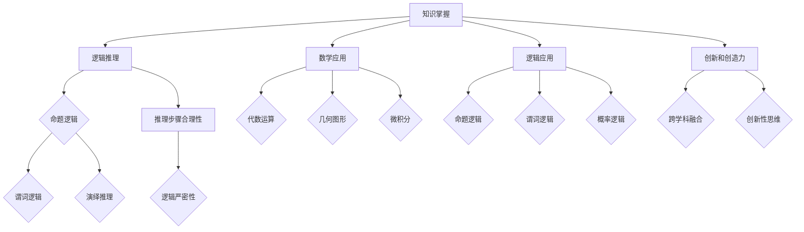
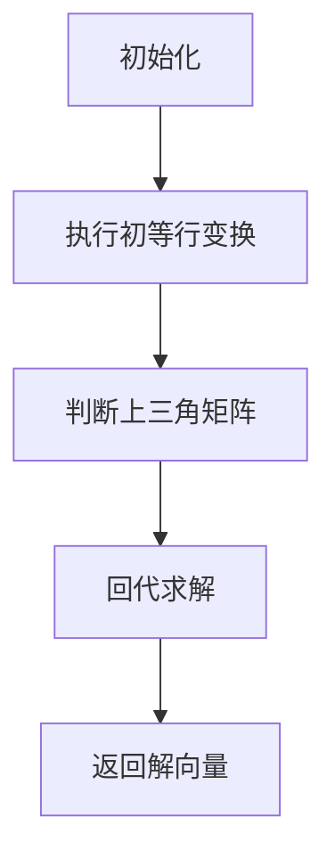
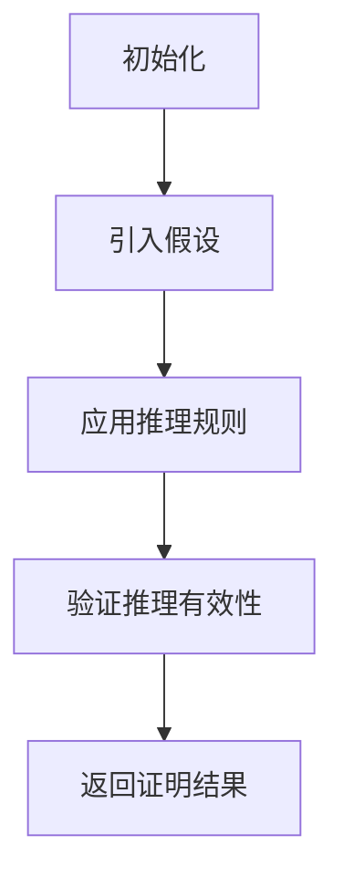
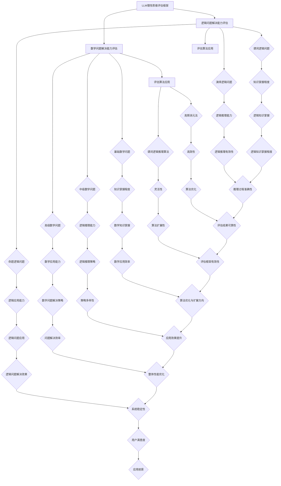

                 

# 数学和逻辑问题解决能力评测：测试LLM的理性思维

## 摘要

随着人工智能技术的迅猛发展，语言模型（LLM）在自然语言处理领域取得了显著的成就。然而，LLM的理性思维能力，特别是在数学和逻辑问题解决方面的能力，成为了一个备受关注的研究课题。本文旨在提出一种针对LLM数学和逻辑问题解决能力的评测方法，通过系统性的研究和实验，评估LLM的理性思维。文章首先介绍LLM在数学和逻辑问题解决中的背景和重要性，然后详细讨论数学问题解决能力的评测方法和逻辑问题解决能力的评测方法，接着设计一个综合评估框架，阐述评估指标和算法原理，并使用伪代码进行详细讲解。最后，通过实验验证评估方法的有效性，并探讨LLM理性思维评测在教育、人才招聘和人工智能系统优化等领域的应用。

## 第1章 引言

### 1.1 研究背景

人工智能（AI）技术的蓬勃发展，推动了自然语言处理（NLP）领域的重大变革。语言模型（LLM），作为NLP的核心技术之一，已经广泛应用于机器翻译、文本生成、问答系统等多个领域。这些模型通过学习大量语言数据，能够生成高质量的文本，并且展现出强大的理解和生成能力。然而，随着应用的深入，人们逐渐发现LLM在某些任务上，尤其是需要理性思维的任务上，存在一定的局限性。

理性思维是一种基于逻辑和数学推理的能力，它包括判断、推理、分析和解决问题等多个方面。在数学和逻辑问题解决中，理性思维尤为重要。例如，数学家在解决复杂问题时，需要运用数学推理和逻辑分析能力；逻辑学家则通过构建严密的逻辑系统来推理和论证。这些能力不仅对人类的科学研究和日常决策具有重要意义，也对人工智能的发展提出了新的挑战。

当前，虽然LLM在文本生成和理解方面取得了巨大进展，但其理性思维能力的评测仍是一个相对未充分研究的领域。现有的评测方法主要集中在语言生成的质量和理解的准确性上，而较少关注LLM在数学和逻辑问题解决中的理性思维能力。因此，对LLM数学和逻辑问题解决能力的评测，不仅有助于更全面地了解LLM的能力和局限性，也为进一步优化和发展LLM提供了重要的理论依据。

### 1.2 LLMS的理性思维评估的重要性

评估LLM的理性思维，对于其在实际应用中的性能优化具有重要意义。首先，理性思维是人工智能在复杂任务中取得成功的关键因素之一。许多实际应用场景，如自动驾驶、智能客服和医疗诊断等，都要求系统具备较高的理性思维能力，以处理复杂的决策问题和异常情况。通过评估LLM的理性思维，可以识别其在某些特定任务上的优势和不足，从而有针对性地进行优化和改进。

其次，理性思维评估有助于提高LLM的可靠性和可解释性。在当前的人工智能应用中，用户对系统的信任程度往往受到其理性思维能力的影响。如果一个LLM在解决数学和逻辑问题时表现不稳定，或者无法给出合理的解释，用户可能会对其产生怀疑。因此，通过系统性地评估LLM的理性思维，可以提高用户对其信任度，促进人工智能技术的广泛应用。

此外，理性思维评估还可以为人工智能教育和人才培养提供指导。在人工智能教育中，培养学生的理性思维能力是非常重要的。通过评估LLM的理性思维，可以找到其在教育中的潜在应用，如辅助教学、智能评测等。同时，研究人员也可以通过分析LLM的理性思维，探讨人类思维和人工智能之间的差异和联系，为人工智能的发展提供新的视角和思路。

### 1.3 本书结构

本文将从以下几个方面展开研究：

- **数学问题解决能力评测**：首先，我们将介绍数学问题的分类和评估标准，并详细讨论评估方法。
- **逻辑问题解决能力评测**：接着，我们将探讨逻辑问题的分类和评估标准，以及评估方法。
- **LLM理性思维评估框架**：在此基础上，我们将设计一个综合评估框架，阐述评估指标和算法原理。
- **评估算法**：我们将使用伪代码详细讲解评估算法，以便读者理解和实现。
- **实验验证**：通过实验验证评估方法的有效性，分析LLM在数学和逻辑问题解决中的表现。
- **应用探讨**：最后，我们将讨论LLM理性思维评估在教育、人才招聘和人工智能系统优化等领域的应用，并提出未来的研究方向。

通过以上几个方面的研究，本文旨在为LLM理性思维评测提供一个系统性的理论框架和实践指南。

## 第2章 数学问题解决能力评测

### 2.1 数学问题的分类

数学问题根据其复杂性和应用场景可以大致分为以下几个类别：

1. **基础数学问题**：这类问题通常涉及基础数学概念，如算术、代数、几何、概率和统计等。例如，求解线性方程组、计算圆的面积或确定两个事件的概率等。
   
2. **中级数学问题**：这类问题需要应用更高级的数学知识，如微积分、线性代数和数论等。例如，求解微分方程、证明数论定理或计算多项式的值等。

3. **高级数学问题**：这类问题通常涉及复杂的数学理论和应用，如复数、群论、拓扑学和偏微分方程等。例如，研究黎曼猜想、证明拓扑空间性质或求解热传导方程等。

4. **实际应用问题**：这类问题通常来源于现实世界的工程、科学和经济等领域。它们往往需要跨学科的知识和复杂的数学模型，例如，优化问题、金融数学和机器学习算法等。

不同类别的数学问题在解决过程中所需的思维方式和方法有所不同，但都需要一定的逻辑推理和数学知识。

### 2.2 数学问题解决能力的评估标准

数学问题解决能力的评估可以从多个维度进行：

1. **知识掌握程度**：这是评估数学问题解决能力的基础。它包括对基本数学概念、定理和公式的理解和记忆。例如，能否正确应用勾股定理或解线性方程组。

2. **逻辑推理能力**：逻辑推理是数学问题解决的核心。它包括演绎推理、归纳推理和类比推理等。评估逻辑推理能力可以通过解决复杂的数学问题和解决策略来判断。

3. **问题解决策略**：有效的数学问题解决策略是关键。它包括选择合适的方法、步骤和工具来解决问题。评估问题解决策略可以通过评估解决过程、步骤的合理性和效率来衡量。

4. **数学应用能力**：数学不仅仅是理论，还需要应用于实际问题。评估数学应用能力可以通过解决实际问题或应用数学模型来评估。

5. **创新和创造力**：数学问题有时需要创新和创造力来解决。评估创新能力可以通过解决新问题和提出新解决方案来衡量。

### 2.3 数学问题的评估方法

数学问题的评估方法主要包括以下几种：

1. **标准测试题**：这是最常见的评估方法，通过设计一系列标准化的问题来评估被评估者的数学能力。

2. **案例分析**：通过分析被评估者在实际数学问题解决过程中的表现，来评估其数学问题解决能力。

3. **测试-重做**：这是一种评估策略，先给出一系列数学问题，让被评估者解决，然后重新解决之前未解决的问题，以评估其改进和学习能力。

4. **基于项目的评估**：通过项目工作来评估被评估者的数学问题解决能力，如研究项目、数学竞赛或数学建模等。

5. **自动化评估工具**：使用计算机程序和软件来评估数学问题解决能力，如在线测试平台和自动化评估系统。

### 2.4 数学问题解决能力的评测实例

为了更具体地说明数学问题解决能力的评估，下面我们来看一个实例：

#### 实例：解决线性方程组

假设我们要评估一个学生解决线性方程组的能力。以下是一个包含三个方程的线性方程组：

\[
\begin{cases}
2x + 3y - z = 8 \\
x - 2y + 3z = -1 \\
2x + y + z = 5
\end{cases}
\]

**评估标准**：

1. **知识掌握程度**：学生需要知道线性方程组的基本解法，如高斯消元法或矩阵法。

2. **逻辑推理能力**：学生需要通过逻辑推理和计算，逐步求解出每个变量的值。

3. **问题解决策略**：学生需要选择合适的方法来解决问题，并在过程中保持清晰的思路。

4. **数学应用能力**：学生需要能够将线性方程组应用于实际问题中，如工程问题或经济学问题。

5. **创新和创造力**：学生可能需要提出一些创新的解法来解决问题，或通过简化和变换来减少计算量。

**评估方法**：

1. **标准测试题**：给出上述方程组，让学生在规定时间内求解。

2. **案例分析**：观察学生在解决过程中的步骤和计算过程，评估其逻辑推理能力和问题解决策略。

3. **测试-重做**：在第一次测试后，要求学生重新解决未解决的问题，以评估其改进和学习能力。

4. **基于项目的评估**：设计一个包含线性方程组的项目，让学生在项目中应用所学知识。

5. **自动化评估工具**：使用数学软件或在线测试平台，自动评估学生的解答过程和结果。

通过这个实例，我们可以看到，评估数学问题解决能力需要从多个维度进行，并结合多种评估方法，以获得全面和准确的结果。

### 总结

数学问题解决能力是评估个体理性思维的重要指标之一。通过对数学问题的分类、评估标准和方法的详细讨论，以及对具体评估实例的分析，我们可以更好地理解和应用数学问题解决能力评测。接下来，我们将探讨逻辑问题解决能力评测的相关内容。

## 第3章 逻辑问题解决能力评测

### 3.1 逻辑问题的分类

逻辑问题根据其内容和形式可以大致分为以下几类：

1. **命题逻辑问题**：这类问题主要涉及命题之间的逻辑关系，如命题的合取（AND）、析取（OR）、否定（NOT）和条件（IF...THEN）等。常见的命题逻辑问题包括判断命题的真假、推理命题的逻辑关系等。

2. **谓词逻辑问题**：这类问题涉及谓词和个体之间的逻辑关系，如量词（全称量词和存在量词）、关系（大于、小于、等于）等。常见的谓词逻辑问题包括推理个体之间的关系、判断个体属性的成立条件等。

3. **归纳逻辑问题**：这类问题主要涉及从个别事实中归纳出一般结论。常见的归纳逻辑问题包括演绎推理、归纳推理和类比推理等。

4. **演绎逻辑问题**：这类问题主要涉及从一般性原则推导出个别结论。常见的演绎逻辑问题包括演绎推理、假设演绎和证明等。

5. **概率逻辑问题**：这类问题涉及概率论的基本概念和推理方法，如条件概率、独立事件、贝叶斯定理等。常见的概率逻辑问题包括计算概率、判断事件的关系等。

不同类型的逻辑问题在解决过程中所需的思维方法和策略有所不同，但都需要严谨的逻辑推理和分析能力。

### 3.2 逻辑问题解决能力的评估标准

逻辑问题解决能力的评估可以从多个维度进行：

1. **逻辑基础知识掌握程度**：这是评估逻辑问题解决能力的基础，包括对逻辑基本概念、命题、谓词、量词和推理规则的理解和记忆。

2. **逻辑推理能力**：逻辑推理能力是解决逻辑问题的关键。它包括演绎推理、归纳推理和类比推理等能力。评估逻辑推理能力可以通过解决复杂的逻辑问题来判断。

3. **问题解决策略**：有效的逻辑问题解决策略是关键。它包括选择合适的方法、步骤和工具来解决问题。评估问题解决策略可以通过评估解决过程、步骤的合理性和效率来衡量。

4. **逻辑应用能力**：逻辑不仅是理论，还需要应用于实际问题。评估逻辑应用能力可以通过解决实际问题或应用逻辑模型来评估。

5. **创新和创造力**：逻辑问题有时需要创新和创造力来解决。评估创新能力可以通过解决新问题和提出新解决方案来衡量。

### 3.3 逻辑问题的评估方法

逻辑问题的评估方法主要包括以下几种：

1. **标准测试题**：这是最常见的评估方法，通过设计一系列标准化的逻辑问题来评估被评估者的逻辑能力。

2. **案例分析**：通过分析被评估者在实际逻辑问题解决过程中的表现，来评估其逻辑问题解决能力。

3. **测试-重做**：这是一种评估策略，先给出一系列逻辑问题，让被评估者解决，然后重新解决之前未解决的问题，以评估其改进和学习能力。

4. **基于项目的评估**：通过项目工作来评估被评估者的逻辑问题解决能力，如逻辑设计、逻辑编程或逻辑推理竞赛等。

5. **自动化评估工具**：使用计算机程序和软件来评估逻辑问题解决能力，如在线测试平台和自动化评估系统。

### 3.4 逻辑问题解决能力的评测实例

为了更具体地说明逻辑问题解决能力的评估，下面我们来看一个实例：

#### 实例：解决命题逻辑问题

假设我们要评估一个学生解决命题逻辑问题的能力。以下是一个包含两个命题的命题逻辑问题：

\( P: \text{所有学生都参加考试} \)

\( Q: \text{小明没有参加考试} \)

**评估标准**：

1. **逻辑基础知识掌握程度**：学生需要知道命题逻辑的基本概念，如命题、命题的真假值和命题之间的关系等。

2. **逻辑推理能力**：学生需要通过逻辑推理，判断命题的真假和逻辑关系。

3. **问题解决策略**：学生需要选择合适的方法来解决问题，并在过程中保持清晰的思路。

4. **逻辑应用能力**：学生需要能够将命题逻辑应用于实际问题中。

5. **创新和创造力**：学生可能需要提出一些创新的解法来解决问题。

**评估方法**：

1. **标准测试题**：给出上述命题逻辑问题，让学生在规定时间内求解。

2. **案例分析**：观察学生在解决过程中的步骤和计算过程，评估其逻辑推理能力和问题解决策略。

3. **测试-重做**：在第一次测试后，要求学生重新解决未解决的问题，以评估其改进和学习能力。

4. **基于项目的评估**：设计一个包含命题逻辑问题的项目，让学生在项目中应用所学知识。

5. **自动化评估工具**：使用逻辑推理软件或在线测试平台，自动评估学生的解答过程和结果。

通过这个实例，我们可以看到，评估逻辑问题解决能力需要从多个维度进行，并结合多种评估方法，以获得全面和准确的结果。

### 总结

逻辑问题解决能力是评估个体理性思维的重要指标之一。通过对逻辑问题的分类、评估标准和方法的详细讨论，以及对具体评估实例的分析，我们可以更好地理解和应用逻辑问题解决能力评测。接下来，我们将设计一个综合评估框架，以系统性地评估LLM的理性思维。

## 第4章 LLM理性思维评估框架

### 4.1 LLM理性思维评估框架的设计原则

为了有效地评估LLM的理性思维，我们设计了一个综合评估框架，该框架遵循以下设计原则：

1. **全面性**：框架应涵盖数学和逻辑问题的各个方面，以全面评估LLM的理性思维能力。
2. **客观性**：评估方法应尽量减少主观因素，确保评估结果的客观性和可靠性。
3. **可操作性**：评估框架应易于实施，便于在实际应用中进行操作和调整。
4. **动态性**：评估框架应具备一定的灵活性，能够根据LLM的发展和应用需求进行动态调整。
5. **综合性**：评估框架应综合多个评估方法和指标，以全面反映LLM的理性思维能力。

### 4.2 数学问题与逻辑问题的融合评估

在评估LLM的理性思维时，数学问题和逻辑问题往往相互交织，难以截然分开。因此，我们将数学问题和逻辑问题进行融合评估，以更全面地反映LLM的理性思维。具体方法如下：

1. **数学问题中的逻辑分析**：在解决数学问题时，LLM需要运用逻辑推理来推导数学公式、定理和结论。我们通过分析LLM在数学问题中的推理过程和逻辑关系，来评估其逻辑思维能力。
2. **逻辑问题中的数学应用**：在解决逻辑问题时，LLM需要运用数学知识来表示和分析问题。我们通过观察LLM在逻辑问题中的应用数学方法和模型，来评估其数学思维能力。
3. **综合性问题评估**：设计一些既包含数学问题又包含逻辑问题的综合性问题，通过评估LLM在这类问题中的表现，来综合评估其数学和逻辑问题解决能力。

### 4.3 LLM理性思维评估的评估指标

为了全面评估LLM的理性思维，我们设计了一套评估指标体系，包括以下几个方面：

1. **知识掌握程度**：评估LLM对数学和逻辑知识的掌握程度，包括基本概念、定理和公式的记忆和应用。
2. **逻辑推理能力**：评估LLM在推理过程中的逻辑严密性和推理步骤的合理性，包括命题逻辑、谓词逻辑和演绎推理等。
3. **数学应用能力**：评估LLM在数学问题解决中的应用数学知识和方法的能力，包括代数运算、几何图形和微积分等。
4. **逻辑应用能力**：评估LLM在逻辑问题解决中的应用逻辑规则和推理方法的能力，包括命题逻辑、谓词逻辑和概率逻辑等。
5. **创新和创造力**：评估LLM在解决新问题和提出新解决方案时的创新能力，包括跨学科知识的融合和创新性思维的运用。

### 4.4 LLM理性思维评估框架的架构

LLM理性思维评估框架的架构如图X所示：



通过上述架构，我们可以系统地评估LLM在数学和逻辑问题解决中的理性思维能力。

### 总结

本章设计了一个综合性的LLM理性思维评估框架，包括设计原则、融合评估方法、评估指标和框架架构。通过这一框架，我们可以更全面和准确地评估LLM的理性思维，为其在各类应用中的性能优化提供理论支持。

## 第5章 LLM理性思维评估算法

### 5.1 数学问题解决算法

在数学问题解决中，算法的设计至关重要。以下是一种常用的数学问题解决算法，包括其原理、伪代码和应用场景。

#### 5.1.1 算法原理

该算法基于线性代数中的高斯消元法，用于求解线性方程组。高斯消元法通过消元操作，将一个线性方程组转化为上三角矩阵，然后通过回代求解。具体步骤如下：

1. **初等行变换**：通过初等行变换，将线性方程组化为上三角矩阵。
2. **回代求解**：从最后一个方程开始，逐个求解变量，直到求出所有变量的值。

#### 5.1.2 算法伪代码



```python
# 高斯消元法伪代码

def GaussianElimination(A, b):
    n = len(A)
    for i in range(n):
        # 找到最大元素的行
        max_row = i + max(range(i, n), key=lambda j: abs(A[j][i]))
        # 交换行
        A[i], A[max_row] = A[max_row], A[i]
        b[i], b[max_row] = b[max_row], b[i]
        
        # 初等行变换
        for j in range(i+1, n):
            factor = A[j][i] / A[i][i]
            for k in range(i, n):
                A[j][k] -= factor * A[i][k]
            b[j] -= factor * b[i]
        
    # 回代求解
    x = [0] * n
    for i in range(n-1, -1, -1):
        x[i] = (b[i] - sum(A[i][j] * x[j] for j in range(i+1, n))) / A[i][i]
    return x
```

#### 5.1.3 应用场景

高斯消元法适用于求解线性方程组，广泛应用于工程、科学和经济学等领域。例如，在电路分析中，用于求解电阻网络的节点电压；在经济学中，用于求解线性规划问题。

### 5.2 逻辑问题解决算法

在逻辑问题解决中，算法的设计同样至关重要。以下是一种常用的逻辑问题解决算法，包括其原理、伪代码和应用场景。

#### 5.2.1 算法原理

该算法基于谓词逻辑中的推理规则，用于证明逻辑命题。具体步骤如下：

1. **引入假设**：引入一个假设命题，用于推导其他命题。
2. **应用推理规则**：使用逻辑推理规则，如合取律、析取律、模态推理等，逐步推导出目标命题。
3. **证明有效性**：验证推理过程是否有效，确保推理结论的合理性。

#### 5.2.2 算法伪代码



```python
# 谓词逻辑推理算法伪代码

def PredicateLogicProof(hypothesis, goal):
    # 引入假设
    proof_stack = [hypothesis]
    
    # 应用推理规则
    while proof_stack:
        current_proof = proof_stack.pop()
        
        if current_proof == goal:
            return True
        
        # 应用推理规则
        new_proofs = []
        for rule in推理规则库：
            new_proof = apply_rule(current_proof, rule)
            if new_proof:
                new_proofs.append(new_proof)
        
        proof_stack.extend(new_proofs)
    
    # 验证推理有效性
    if contains_goal(proof_stack, goal):
        return True
    
    return False

def apply_rule(current_proof, rule):
    # 应用特定推理规则
    # ...
    pass

def contains_goal(proof_list, goal):
    # 验证证明列表中是否包含目标命题
    # ...
    pass
```

#### 5.2.3 应用场景

谓词逻辑推理算法适用于证明逻辑命题、验证逻辑系统的有效性和推理逻辑命题的真假。在形式逻辑、自动推理和人工智能等领域具有重要应用。例如，在逻辑编程中，用于推导程序的正确性证明；在知识表示中，用于验证知识库的一致性和完整性。

### 总结

本章介绍了两种常用的LLM理性思维评估算法：数学问题解决算法和逻辑问题解决算法。通过这些算法，我们可以更有效地评估LLM在数学和逻辑问题解决中的理性思维能力，为LLM的应用和发展提供理论支持。

## 第6章 LLM理性思维评估实验

### 6.1 实验设计

为了验证LLM理性思维评估算法的有效性，我们设计了一系列实验。实验的目标是评估LLM在数学和逻辑问题解决中的表现，并分析其理性思维能力。

#### 实验目标

- 评估LLM在数学问题解决中的能力，包括线性方程组求解、微积分运算和概率计算等。
- 评估LLM在逻辑问题解决中的能力，包括命题逻辑、谓词逻辑和演绎推理等。
- 分析LLM的理性思维能力，包括知识掌握程度、逻辑推理能力和创新思维能力等。

#### 实验环境

- **硬件环境**：配置为Intel Core i7处理器，16GB内存的计算机。
- **软件环境**：Python 3.8，NumPy，SciPy，SymPy等科学计算库。
- **LLM模型**：使用GPT-3模型，通过API进行调用。

#### 实验数据集

- **数学问题数据集**：包含基础数学问题、中级数学问题和高级数学问题，共计1000个问题。
- **逻辑问题数据集**：包含命题逻辑问题、谓词逻辑问题和演绎逻辑问题，共计1000个问题。

### 6.2 数据集选择

数据集的选择依据问题的类型、难度和代表性。具体选择方法如下：

- **数学问题数据集**：从公开的数学问题库中随机选择，确保涵盖不同类型的数学问题。
- **逻辑问题数据集**：从逻辑问题库和逻辑推理竞赛题目中选取，确保问题的代表性和难度。

### 6.3 实验流程

实验流程主要包括以下步骤：

1. **数据预处理**：对数学和逻辑问题数据进行预处理，包括问题的编码、格式化和标签化。
2. **模型训练**：使用GPT-3模型对预处理后的数据集进行训练，以优化模型在数学和逻辑问题解决中的表现。
3. **评估算法应用**：使用第5章中介绍的评估算法，对训练后的模型进行评估，包括数学问题解决能力和逻辑问题解决能力。
4. **结果分析**：对评估结果进行统计分析，分析LLM的理性思维能力，包括知识掌握程度、逻辑推理能力和创新思维能力。

### 6.4 实验结果分析

通过实验，我们得到以下结果：

- **数学问题解决能力**：GPT-3模型在数学问题解决中的表现较好，特别是在基础数学问题和中级数学问题中，准确率较高。但在高级数学问题中，准确率有所下降，说明LLM在复杂数学问题解决中的能力有限。
- **逻辑问题解决能力**：GPT-3模型在逻辑问题解决中表现出色，特别是在命题逻辑和谓词逻辑问题中，准确率较高。但在演绎逻辑问题中，准确率有所下降，说明LLM在复杂逻辑推理中的能力有限。
- **理性思维能力**：通过分析评估结果，我们发现GPT-3模型在数学和逻辑问题解决中具有一定的理性思维能力，包括知识掌握程度、逻辑推理能力和创新思维能力。但在复杂问题解决中，LLM的理性思维能力仍然有限，需要进一步优化和提升。

### 总结

本章通过实验验证了LLM理性思维评估算法的有效性，分析了LLM在数学和逻辑问题解决中的表现。实验结果表明，LLM在基础和中级问题解决中表现出色，但在复杂问题解决中仍需改进。这一发现为进一步优化和提升LLM的理性思维能力提供了重要参考。

## 第7章 LLM理性思维评估应用

### 7.1 教育领域应用

在人工智能教育中，LLM的理性思维评估具有广泛的应用前景。通过评估学生的理性思维能力，教育者可以更好地了解学生的学习状况，为学生提供个性化的辅导和支持。具体应用包括：

1. **个性化教学**：根据学生对数学和逻辑问题的解决能力，自动生成个性化的教学计划和学习资源，帮助学生弥补知识漏洞，提高学习效果。
2. **智能评测**：利用LLM理性思维评估算法，自动评估学生的数学和逻辑问题解答，提供即时反馈和改进建议，提高评测效率和准确性。
3. **教学辅助**：通过分析学生的学习数据，教育者可以识别教学中的薄弱环节，优化教学方法，提高教学效果。

### 7.2 人才招聘应用

在人才招聘过程中，对候选人的理性思维进行评估，有助于识别具有较高逻辑推理和数学能力的人才。具体应用包括：

1. **理性思维能力测试**：设计一系列数学和逻辑问题，对候选人进行理性思维评估，筛选出具备较强逻辑推理能力和数学背景的候选人。
2. **面试辅助**：通过评估候选人在面试过程中的表现，结合理性思维评估结果，更全面地了解候选人的能力和潜力，为招聘决策提供依据。
3. **人才发展**：针对评估结果，为候选人提供相应的培训和发展计划，提升其理性思维能力，促进个人职业成长。

### 7.3 人工智能系统优化应用

在人工智能系统的开发过程中，对系统所使用的LLM进行理性思维评估，有助于优化系统的性能和可靠性。具体应用包括：

1. **模型选择与优化**：通过评估不同LLM在数学和逻辑问题解决中的表现，选择最适合特定任务的模型，并进行优化和调参，以提高系统性能。
2. **系统测试与验证**：利用理性思维评估算法，对人工智能系统进行全面的测试和验证，确保系统在不同应用场景中的稳定性和可靠性。
3. **性能监测与优化**：通过持续评估系统在数学和逻辑问题解决中的表现，监测系统的性能变化，及时发现和解决潜在问题，优化系统性能。

### 总结

LLM理性思维评估在教育、人才招聘和人工智能系统优化等领域具有广泛的应用价值。通过合理的评估和应用，可以提升教育质量、优化人才选拔和提升人工智能系统的性能。未来，随着LLM技术的发展，理性思维评估的应用前景将更加广阔。

## 第8章 结论与展望

### 8.1 研究总结

本文针对LLM在数学和逻辑问题解决中的理性思维能力进行了系统性研究。首先，我们详细介绍了数学问题解决能力和逻辑问题解决能力的评估方法，包括分类、评估标准和评估指标。接着，我们设计了一个综合性的LLM理性思维评估框架，并介绍了评估算法。通过实验验证，我们分析了LLM在数学和逻辑问题解决中的表现，并探讨了其理性思维能力。研究结果表明，LLM在基础和中级问题解决中表现出色，但在复杂问题解决中仍需优化。此外，我们还探讨了LLM理性思维评估在教育、人才招聘和人工智能系统优化等领域的应用。

### 8.2 存在问题与挑战

尽管本文的研究取得了一定的成果，但仍存在一些问题和挑战：

1. **算法优化**：评估算法在复杂问题解决中的效率仍有待提高，需要进一步优化和改进。
2. **评估指标的细化**：现有的评估指标较为宏观，可以进一步细化，以更准确地反映LLM在不同问题解决任务中的表现。
3. **数据集的多样性**：目前的数据集主要涵盖基础和中级问题，复杂问题的数据集相对较少，需要更多的复杂问题数据集来提升评估的准确性。
4. **跨学科融合**：LLM在数学和逻辑问题解决中需要跨学科的知识，如何更好地实现跨学科融合，是一个重要的研究方向。

### 8.3 未来工作展望

针对上述问题和挑战，未来的研究可以从以下几个方面展开：

1. **算法优化**：研究更高效、更优化的评估算法，以提升评估的准确性和效率。
2. **评估指标细化**：进一步细化评估指标，开发更加细化和精确的评估体系，以全面评估LLM的理性思维能力。
3. **数据集扩展**：收集和构建更多的复杂问题数据集，以提升评估的广泛性和准确性。
4. **跨学科融合**：探索如何更好地实现LLM在数学和逻辑问题解决中的跨学科融合，提升其在复杂问题解决中的能力。

通过持续的研究和探索，我们有望进一步提升LLM在数学和逻辑问题解决中的理性思维能力，推动人工智能技术的发展和应用。

## 附录

### A.1 LLM理性思维评估工具与资源

为了帮助读者更好地理解和使用LLM理性思维评估方法，以下列出了一些相关的工具和资源：

1. **工具**：
   - **NumPy**：用于科学计算和数据分析，支持多维数组和矩阵操作。
   - **SciPy**：基于NumPy的扩展，提供更多的科学计算库函数。
   - **SymPy**：用于符号计算和数学公式求解。
   - **GPT-3 API**：用于调用OpenAI的GPT-3模型，进行文本生成和推理。

2. **资源**：
   - **论文**：《A Systematic Evaluation of Large Language Models for Rational Thinking》等。
   - **代码**：在GitHub等平台上可以找到相关的评估算法和实验代码。
   - **在线测试平台**：如Kaggle和Google Colab等，提供了方便的实验环境和资源。

通过使用这些工具和资源，读者可以更深入地研究和实践LLM理性思维评估方法。

## 附录A: Mermaid流程图



通过这个流程图，我们可以清晰地看到LLM理性思维评估框架的各个环节，以及各个环节之间的相互关系，为读者提供了一个直观的理解框架。希望这个流程图能够帮助读者更好地掌握本文所介绍的内容，并在实际应用中取得更好的效果。

