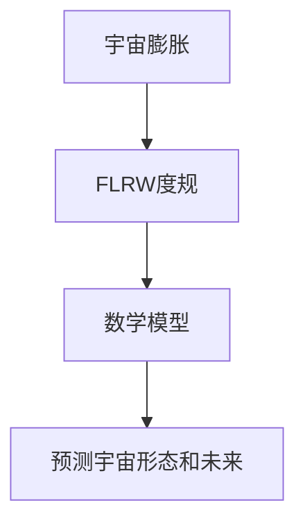
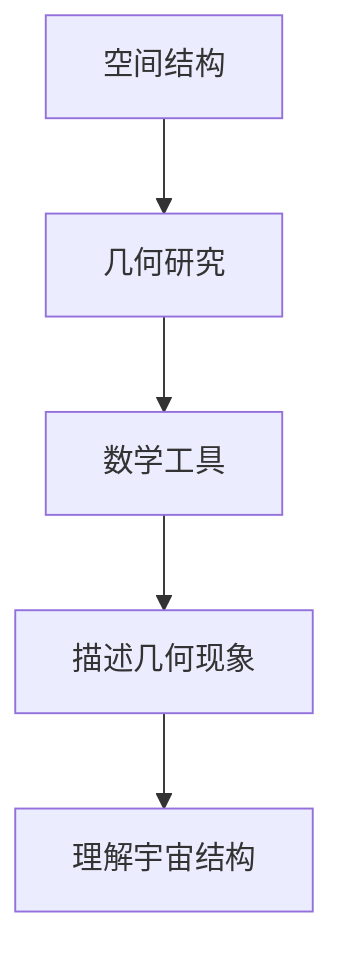
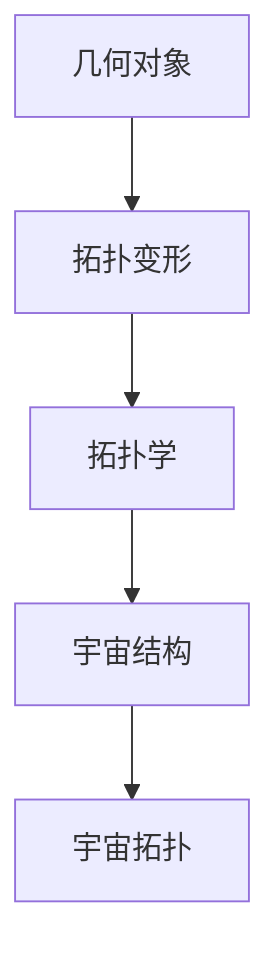
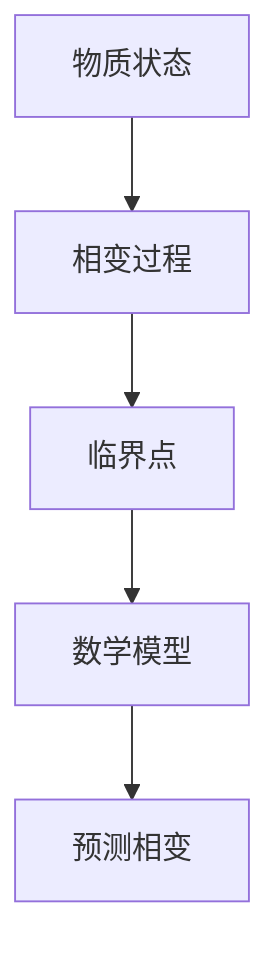
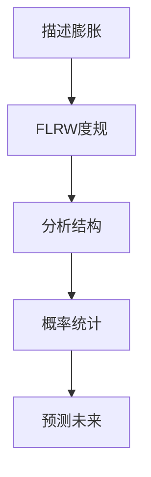
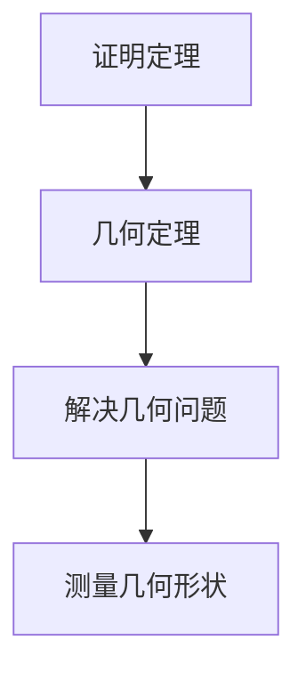
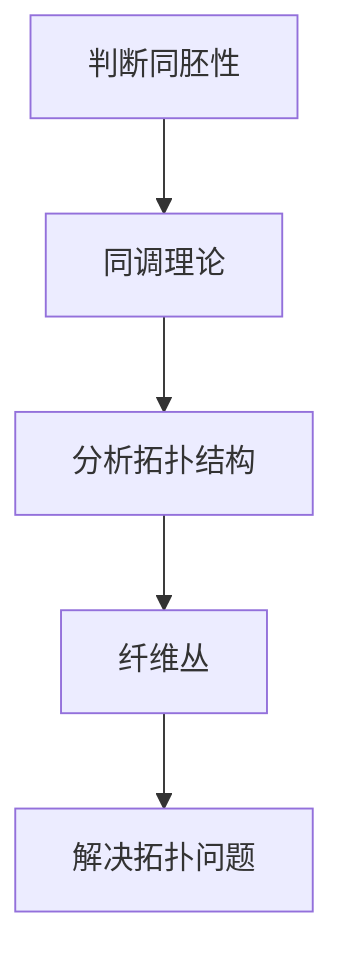

                 

### 第1章 数学在宇宙位相几何拓扑相变临界点研究中的概述

#### 1.1 数学与宇宙位相的关联

宇宙位相是指宇宙在时间演化过程中的不同阶段和状态。数学在宇宙位相研究中起着至关重要的作用。首先，数学模型可以帮助我们理解和描述宇宙的演化规律。例如，通过使用微分方程和概率统计方法，可以建立宇宙膨胀模型，如弗里德曼-勒梅特-罗伯逊-沃尔克（FLRW）度规，从而预测宇宙的形态和未来。

**核心概念与联系：**

- **宇宙位相**：宇宙在时间演化过程中的不同阶段和状态。
- **数学模型**：描述宇宙演化规律的数学表达式，如FLRW度规。

**Mermaid流程图：**



#### 1.2 数学在几何研究中的作用

几何研究的是空间结构和形状，而数学提供了描述和解释几何现象的工具。在宇宙学中，几何形状是理解宇宙结构的关键。例如，通过研究宇宙微波背景辐射（CMB）的几何特征，我们可以推断出宇宙的几何形状和结构。

**核心概念与联系：**

- **几何**：研究空间结构和形状的学科。
- **数学工具**：描述几何现象的数学表达式，如球面几何和欧几里得几何。

**Mermaid流程图：**



#### 1.3 数学在拓扑研究中的作用

拓扑学是研究几何对象在连续变形下的性质的数学分支。在宇宙学中，拓扑学研究可以帮助我们理解宇宙的整体结构和复杂形态。例如，通过研究宇宙的三维拓扑结构，我们可以推断出宇宙的拓扑类型，如欧几里得空间或弯曲空间。

**核心概念与联系：**

- **拓扑学**：研究几何对象在连续变形下的性质的数学分支。
- **宇宙拓扑**：宇宙的整体结构和复杂形态。

**Mermaid流程图：**



#### 1.4 数学在相变临界点研究中的作用

相变是指物质从一种状态转变为另一种状态的过程，如冰融化成水。在宇宙学中，相变临界点研究是理解宇宙中重大事件，如宇宙大爆炸和宇宙暗能量行为的关键。数学模型可以帮助我们预测和解释这些相变过程。

**核心概念与联系：**

- **相变临界点**：物质状态转变的关键点。
- **数学模型**：描述和预测相变过程的数学表达式。

**Mermaid流程图：**



### 关键词：宇宙位相、数学模型、几何、拓扑、相变临界点。

### 摘要：

本文概述了数学在宇宙位相、几何、拓扑和相变临界点研究中的重要作用。通过介绍相关的基本概念和背景知识，本文展示了数学如何帮助我们理解和解释宇宙的复杂结构和行为。本文为后续章节的深入探讨奠定了基础。

---

**作者：AI天才研究院/AI Genius Institute & 禅与计算机程序设计艺术 /Zen And The Art of Computer Programming**

---

### 第2章 宇宙位相的数学基础

#### 2.1 宇宙位相的基本数学模型

宇宙位相的数学模型是理解宇宙演化的重要工具。其中一个基本的模型是弗里德曼-勒梅特-罗伯逊-沃尔克（FLRW）度规，该模型描述了一个均匀且各向同性的宇宙。

**核心概念与联系：**

- **FLRW度规**：描述均匀且各向同性的宇宙的数学模型。

**数学公式：**

$$
ds^2 = -c^2dt^2 + a(t)^2(dx^2 + dy^2 + dz^2)
$$

**FLRW度规解析：**

FLRW度规中的 $a(t)$ 表示宇宙的尺度因子，它随时间 $t$ 变化，描述了宇宙的膨胀过程。$c$ 是光速，确保了度规中的时空间隔具有物理意义。

#### 2.2 宇宙位相的数学方法

宇宙位相的数学方法包括微分方程、概率统计和数值模拟等。这些方法帮助我们理解和预测宇宙的演化。

**核心概念与联系：**

- **微分方程**：描述宇宙膨胀的方程。
- **概率统计**：分析宇宙中随机现象的工具。
- **数值模拟**：通过计算机模拟宇宙的演化过程。

**数学方法的应用实例：**

- **哈勃定律**：描述宇宙膨胀速度与距离之间的关系，公式为：

$$
v = H_0d
$$

其中，$v$ 是膨胀速度，$d$ 是距离，$H_0$ 是哈勃常数。

- **宇宙微波背景辐射**：通过分析宇宙微波背景辐射的几何特征，可以推断出宇宙的几何形状和结构。

**实例解析：**

哈勃定律揭示了宇宙的膨胀性质，而宇宙微波背景辐射的测量提供了宇宙早期状态的重要信息。

### 2.2.1 数学方法在宇宙位相中的应用

数学方法在宇宙位相中的应用主要体现在以下几个方面：

- **描述宇宙膨胀**：通过微分方程描述宇宙的膨胀过程，如FLRW度规。
- **分析宇宙结构**：通过概率统计方法分析宇宙中星系、星团等大规模结构的分布。
- **预测宇宙未来**：通过数值模拟预测宇宙的演化路径，如暗能量的行为。

**Mermaid流程图：**



通过以上数学方法的应用，我们可以更深入地理解宇宙的演化过程和未来趋势。

### 2.2.2 数学方法的应用实例

以下是一个简单的实例，展示了数学方法在宇宙位相研究中的应用：

**实例：宇宙膨胀速度与距离的关系**

假设我们测量了宇宙中两个星系的距离为 $d$，并观察到它们的膨胀速度为 $v$。根据哈勃定律，我们有：

$$
v = H_0d
$$

通过测量膨胀速度 $v$ 和距离 $d$，我们可以计算出哈勃常数 $H_0$。这个常数是理解宇宙膨胀速度和规模的重要参数。

**实例解析：**

- 测量星系距离：使用哈勃定律，我们可以通过测量星系间的距离 $d$ 来推断宇宙的膨胀速度。
- 计算哈勃常数：通过测量多个星系的膨胀速度，我们可以计算出哈勃常数 $H_0$，从而更准确地描述宇宙的膨胀过程。

通过这个实例，我们可以看到数学方法在宇宙位相研究中的应用是如何帮助我们理解和解释宇宙的演化过程的。

### 总结

本章介绍了宇宙位相的基本数学模型和数学方法，包括FLRW度规、哈勃定律和概率统计方法。这些数学工具为我们理解和描述宇宙的演化提供了重要的理论基础。在接下来的章节中，我们将进一步探讨数学在几何、拓扑和相变临界点研究中的应用。

---

**作者：AI天才研究院/AI Genius Institute & 禅与计算机程序设计艺术 /Zen And The Art of Computer Programming**

---

### 第3章 几何的数学基础

#### 3.1 几何的基本数学原理

几何学是研究空间形状、大小和位置的科学。数学为几何学提供了描述和解释几何现象的工具。以下是几何学中一些基本的数学原理。

**核心概念与联系：**

- **欧几里得几何**：研究平面和空间的几何性质。
- **非欧几里得几何**：研究不同于欧几里得几何的几何空间。

**数学公式：**

- **欧几里得距离公式**：

$$
d = \sqrt{(x_2 - x_1)^2 + (y_2 - y_1)^2}
$$

其中，$(x_1, y_1)$ 和 $(x_2, y_2)$ 是平面上的两个点。

- **球面距离公式**：

$$
d = R \cdot \arccos(\sin(\phi_1) \sin(\phi_2) + \cos(\phi_1) \cos(\phi_2) \cos(\theta_1 - \theta_2))
$$

其中，$R$ 是球体半径，$(\phi_1, \theta_1)$ 和 $(\phi_2, \theta_2)$ 是球面上的两个点。

**数学原理的解析：**

欧几里得几何是日常生活中的几何学，广泛应用于建筑、工程和物理学。非欧几里得几何则是对欧几里得几何的扩展，适用于描述宇宙中的几何形状，如宇宙的三维空间结构。

#### 3.2 几何数学方法

几何数学方法包括几何定理、几何变换和几何测量等。这些方法帮助我们理解和应用几何原理。

**核心概念与联系：**

- **几何定理**：描述几何形状的性质。
- **几何变换**：将一个几何形状变换为另一个形状。
- **几何测量**：测量几何形状的尺寸和位置。

**数学方法的应用实例：**

- **平行线定理**：平行线之间的距离是恒定的。
- **相似三角形定理**：如果两个三角形相似，那么它们的对应角度相等，对应边成比例。

**实例解析：**

通过平行线定理，我们可以确保建筑物的水平线和垂直线是平行的，从而保证结构的稳定性。相似三角形定理则在光学设计和摄影技术中广泛应用。

#### 3.2.1 数学方法在几何中的应用

数学方法在几何中的应用主要体现在以下几个方面：

- **证明几何定理**：使用数学推理证明几何定理的正确性。
- **解决几何问题**：利用几何定理和变换解决实际几何问题。
- **测量几何形状**：使用几何测量工具和公式计算几何形状的尺寸。

**Mermaid流程图：**



通过以上数学方法的应用，我们可以更深入地理解几何学的基本原理和应用。

#### 3.2.2 几何数学方法的应用实例

以下是一个简单的实例，展示了几何数学方法的应用：

**实例：计算三角形的面积**

假设我们有一个三角形，其边长为 $a = 3$，$b = 4$，$c = 5$。我们可以使用海伦公式计算其面积。

**海伦公式：**

$$
\text{Area} = \sqrt{s(s-a)(s-b)(s-c)}
$$

其中，$s$ 是半周长，$s = \frac{a + b + c}{2}$。

**计算过程：**

$$
s = \frac{3 + 4 + 5}{2} = 6
$$

$$
\text{Area} = \sqrt{6(6-3)(6-4)(6-5)} = \sqrt{6 \cdot 3 \cdot 2 \cdot 1} = 3\sqrt{2}
$$

**实例解析：**

通过海伦公式，我们可以轻松计算出三角形的面积，这个方法在计算机图形学、工程设计和物理学等领域中有着广泛的应用。

### 总结

本章介绍了几何的基本数学原理和几何数学方法。通过欧几里得几何和非欧几里得几何的数学公式，我们能够理解和解决几何问题。几何定理和变换为我们提供了证明和解决几何问题的工具。在接下来的章节中，我们将进一步探讨数学在拓扑和相变临界点研究中的应用。

---

**作者：AI天才研究院/AI Genius Institute & 禅与计算机程序设计艺术 /Zen And The Art of Computer Programming**

---

### 第4章 拓扑的数学基础

#### 4.1 拓扑的基本数学概念

拓扑学是研究几何对象在连续变形下的性质的数学分支。拓扑空间是拓扑学中的基本概念，它由一组点和连接这些点的路径组成。

**核心概念与联系：**

- **拓扑空间**：由一组点和连接这些点的路径组成的集合。
- **连通性**：拓扑空间中任意两点之间存在路径。
- **闭包**：集合中所有点的极限点也在集合内。

**数学公式：**

- **连通性公式**：

$$
\text{连通性} = \text{存在路径} \Rightarrow \text{两点可达}
$$

- **闭包公式**：

$$
\overline{A} = A \cup \text{A的极限点集合}
$$

**拓扑空间的解析：**

拓扑空间是一种抽象的结构，它不依赖于具体的几何形状，而是关注几何对象的拓扑性质。连通性和闭包是拓扑空间的基本性质，它们决定了拓扑空间的形态和性质。

#### 4.2 拓扑数学方法

拓扑数学方法包括拓扑同胚、同调理论和纤维丛等。这些方法帮助我们理解和分析复杂的拓扑结构。

**核心概念与联系：**

- **拓扑同胚**：两个拓扑空间之间存在连续的双射，且其逆映射也是连续的。
- **同调理论**：研究拓扑空间的连通性和结构。
- **纤维丛**：研究空间中不同部分之间的关系。

**数学方法的应用实例：**

- **同调理论**：通过同调群分析，可以判断一个拓扑空间是否同胚于另一个空间。
- **纤维丛**：在物理学中，纤维丛用于描述空间中的流和场。

**实例解析：**

同调理论可以帮助我们判断一个空间是否具有某种特定的拓扑性质，如连通性。纤维丛则用于描述空间中的流体运动，如流体力学中的速度场。

#### 4.2.1 数学方法在拓扑中的应用

数学方法在拓扑中的应用主要体现在以下几个方面：

- **判断同胚性**：通过同调理论判断两个拓扑空间是否同胚。
- **分析拓扑结构**：通过纤维丛分析复杂的拓扑结构。
- **解决拓扑问题**：利用拓扑同胚和纤维丛等方法解决复杂的拓扑问题。

**Mermaid流程图：**



通过以上数学方法的应用，我们可以更深入地理解拓扑空间的结构和性质。

#### 4.2.2 拓扑数学方法的应用实例

以下是一个简单的实例，展示了拓扑数学方法的应用：

**实例：判断空间同胚性**

假设有两个拓扑空间 $X$ 和 $Y$，我们需要判断它们是否同胚。

**同调理论方法：**

- 构造两个空间的同调群，计算它们的同调性质。
- 如果两个空间的所有同调群都相等，则它们是同胚的。

**实例解析：**

通过计算空间 $X$ 和 $Y$ 的同调群，我们可以判断它们是否同胚。例如，如果我们发现 $X$ 和 $Y$ 的第一同调群都为零，则可以初步判断它们可能同胚。

**实例：纤维丛应用**

假设我们在空间 $X$ 中有一条流线，我们需要描述这条流线在不同区域的变化。

**纤维丛方法：**

- 构造纤维丛，描述流线在不同区域的变化。
- 通过纤维丛分析，可以判断流线的连续性和性质。

**实例解析：**

通过构造纤维丛，我们可以描述流线在不同区域的变化，从而更好地理解流线的性质。

### 总结

本章介绍了拓扑的基本数学概念和拓扑数学方法。通过拓扑空间、连通性和闭包等基本概念，我们能够理解和分析复杂的拓扑结构。拓扑同胚、同调理论和纤维丛等数学方法为我们提供了分析和解决拓扑问题的工具。在接下来的章节中，我们将进一步探讨数学在相变临界点研究中的应用。

---

**作者：AI天才研究院/AI Genius Institute & 禅与计算机程序设计艺术 /Zen And The Art of Computer Programming**

---

### 第5章 相变临界点的数学算法

#### 5.1 相变临界点的数学模型

相变临界点是指物质从一种状态转变为另一种状态的关键点。数学模型可以帮助我们理解和预测相变过程。一个经典的相变模型是朗道-威尔逊模型，该模型描述了物质的相变行为。

**核心概念与联系：**

- **朗道-威尔逊模型**：描述物质相变行为的数学模型。
- **相变临界点**：物质状态转变的关键点。

**数学公式：**

朗道-威尔逊模型的基本方程是：

$$
\frac{\partial \phi}{\partial t} = D\nabla^2 \phi - \nabla \cdot (\phi \nabla \phi) + \phi (\mu - \mu_0)
$$

其中，$\phi$ 是场变量的标量场，$D$ 是扩散系数，$\mu$ 是化学势，$\mu_0$ 是参考状态的化学势。

**数学模型解析：**

朗道-威尔逊模型描述了场变量 $\phi$ 的演化，其中包含了扩散、排斥和吸引等相互作用。通过解这个方程，我们可以预测物质在临界点的行为。

#### 5.2 相变临界点的数学算法

数学算法在相变临界点研究中扮演着重要角色。以下是一种常见的算法——蒙特卡罗模拟，用于预测相变临界点。

**核心概念与联系：**

- **蒙特卡罗模拟**：通过随机抽样和统计方法解决复杂问题的算法。

**伪代码展示：**

```python
# 蒙特卡罗模拟伪代码

初始化参数：N，L，T，beta
创建L x L的格子，每个格子初始化为+1或-1
初始化能量E为0

for step in 1 to T:
    for each site i in the lattice:
        计算局部能量变化 ΔE
        计算随机数 r，如果 r < exp(-βΔE)，则更新格子状态
        
    更新能量E，计算平均能量
        
计算相变温度T_c，确定临界点
```

**算法流程：**

1. 初始化参数，如格子大小L、时间步长T和参数β。
2. 创建一个L x L的格子，并初始化为+1或-1。
3. 在每个时间步，对于每个格子，计算局部能量变化ΔE。
4. 根据局部能量变化，使用随机数决定是否更新格子状态。
5. 更新总能量E，并计算平均能量。
6. 通过统计平均能量，确定相变温度T_c。

#### 5.2.3 Mermaid流程图：相变临界点数学算法流程

```mermaid
graph TD
    A[初始化参数] --> B[创建LxL格子]
    B --> C[初始化格子状态]
    C --> D[计算局部能量变化]
    D --> E[计算随机数]
    E --> F{r < exp(-βΔE?)}
    F -->|是| G[更新格子状态]
    F -->|否| H[继续迭代]
    H --> I[更新总能量]
    I --> J[计算平均能量]
    J --> K[确定临界点]
```

通过上述算法，我们可以模拟和预测相变临界点的行为。在实际应用中，蒙特卡罗模拟广泛应用于材料科学、统计物理和金融工程等领域。

#### 5.2.4 相变临界点的数学算法应用实例

以下是一个简单的实例，展示了如何使用蒙特卡罗模拟预测相变临界点：

**实例：二态系统的相变临界点**

假设我们有一个二态系统，其状态可以用 +1 或 -1 表示。我们需要使用蒙特卡罗模拟预测其相变临界点。

**计算过程：**

1. 初始化参数，如格子大小L、时间步长T和参数β。
2. 创建一个L x L的格子，并初始化为 +1 或 -1。
3. 在每个时间步，对于每个格子，计算局部能量变化ΔE。
4. 根据局部能量变化，使用随机数决定是否更新格子状态。
5. 更新总能量E，并计算平均能量。
6. 通过统计平均能量，确定相变温度T_c。

**实例解析：**

通过蒙特卡罗模拟，我们可以预测二态系统的相变临界点。在实际应用中，这种模拟方法可以帮助我们理解和控制物质的相变过程，如材料合成和金属冶炼。

### 总结

本章介绍了相变临界点的数学模型和数学算法。通过朗道-威尔逊模型，我们能够理解和预测物质的相变行为。蒙特卡罗模拟是一种常用的数学算法，可以帮助我们确定相变临界点。在接下来的章节中，我们将进一步探讨数学模型在相变临界点研究中的应用。

---

**作者：AI天才研究院/AI Genius Institute & 禅与计算机程序设计艺术 /Zen And The Art of Computer Programming**

---

### 第6章 数学模型在相变临界点研究中的应用

#### 6.1 相变临界点的数学模型分析

相变临界点的数学模型是理解物质相变过程的关键。一个经典的模型是朗道-威尔逊模型，该模型通过场论描述相变现象。以下是该模型的详细分析。

**核心概念与联系：**

- **朗道-威尔逊模型**：通过场论描述相变现象。
- **场变量**：描述物质状态的标量场。
- **相互作用**：描述物质之间的相互影响。

**模型假设与建立：**

朗道-威尔逊模型的假设包括：

- 系统处于热力学平衡状态。
- 场变量 $\phi$ 描述物质的微观状态。
- 相互作用通过势能函数描述。

**数学推导：**

朗道-威尔逊模型的基本方程是：

$$
\frac{\partial \phi}{\partial t} = D\nabla^2 \phi - \nabla \cdot (\phi \nabla \phi) + \phi (\mu - \mu_0)
$$

其中，$D$ 是扩散系数，$\mu$ 是化学势，$\mu_0$ 是参考状态的化学势。

该方程描述了场变量 $\phi$ 的演化，其中包含了扩散、排斥和吸引等相互作用。通过解这个方程，我们可以预测物质在临界点的行为。

**数学推导解析：**

该方程的推导基于以下假设：

- 系统处于热力学平衡状态，因此场变量的演化满足扩散方程。
- 场变量之间的相互作用通过势能函数描述，从而引入了排斥和吸引项。

通过这个模型，我们可以分析物质的相变行为，如液体的凝固和气体的液化。

**实例：二态系统的相变**

以下是一个简单的实例，展示了如何使用朗道-威尔逊模型分析二态系统的相变。

**实例：**

假设我们有一个二态系统，其状态可以用 +1 或 -1 表示。我们需要使用朗道-威尔逊模型预测其相变临界点。

**计算过程：**

1. 初始化参数，如格子大小L、时间步长T和参数β。
2. 创建一个L x L的格子，并初始化为 +1 或 -1。
3. 在每个时间步，对于每个格子，计算局部能量变化ΔE。
4. 根据局部能量变化，使用随机数决定是否更新格子状态。
5. 更新总能量E，并计算平均能量。
6. 通过统计平均能量，确定相变温度T_c。

**实例解析：**

通过朗道-威尔逊模型，我们可以预测二态系统的相变临界点。在实际应用中，这种模型可以帮助我们理解和控制物质的相变过程，如材料合成和金属冶炼。

#### 6.2 数学模型的实例解析

以下是一个更复杂的实例，展示了数学模型在相变临界点研究中的应用。

**实例：金属合金的相变**

假设我们研究一种金属合金的相变过程，其场变量为原子序数。我们需要使用朗道-威尔逊模型预测其相变临界点。

**计算过程：**

1. 初始化参数，如格子大小L、时间步长T和参数β。
2. 创建一个L x L的格子，并初始化为不同的原子序数。
3. 在每个时间步，对于每个格子，计算局部能量变化ΔE。
4. 根据局部能量变化，使用随机数决定是否更新格子状态。
5. 更新总能量E，并计算平均能量。
6. 通过统计平均能量，确定相变温度T_c。

**实例解析：**

通过朗道-威尔逊模型，我们可以预测金属合金的相变临界点。这种模型可以帮助我们理解合金的相变行为，如液态合金的凝固和固态合金的退火过程。

#### 6.2.1 模型假设与建立

在相变临界点研究中，模型假设与建立至关重要。以下是朗道-威尔逊模型的假设与建立过程：

- **系统假设**：假设系统处于热力学平衡状态，因此场变量的演化满足扩散方程。
- **场变量假设**：假设场变量为原子序数，描述物质的微观状态。
- **相互作用假设**：假设相互作用通过势能函数描述，从而引入了排斥和吸引项。

**数学推导：**

朗道-威尔逊模型的基本方程是：

$$
\frac{\partial \phi}{\partial t} = D\nabla^2 \phi - \nabla \cdot (\phi \nabla \phi) + \phi (\mu - \mu_0)
$$

其中，$D$ 是扩散系数，$\mu$ 是化学势，$\mu_0$ 是参考状态的化学势。

**数学推导解析：**

该方程的推导基于以下假设：

- 系统处于热力学平衡状态，因此场变量的演化满足扩散方程。
- 场变量之间的相互作用通过势能函数描述，从而引入了排斥和吸引项。

通过这个模型，我们可以分析物质的相变行为，如液体的凝固和气体的液化。

#### 6.2.2 模型的数学推导

以下是朗道-威尔逊模型的数学推导：

首先，假设系统处于热力学平衡状态，因此场变量的演化满足扩散方程：

$$
\frac{\partial \phi}{\partial t} = D\nabla^2 \phi
$$

其中，$D$ 是扩散系数。

接下来，考虑相互作用项。由于物质之间的相互作用，场变量的演化不仅受到扩散的影响，还受到排斥和吸引的影响。因此，我们可以将相互作用项表示为：

$$
-\nabla \cdot (\phi \nabla \phi) + \phi (\mu - \mu_0)
$$

其中，$\mu$ 是化学势，$\mu_0$ 是参考状态的化学势。

综合上述两个方程，我们得到朗道-威尔逊模型的基本方程：

$$
\frac{\partial \phi}{\partial t} = D\nabla^2 \phi - \nabla \cdot (\phi \nabla \phi) + \phi (\mu - \mu_0)
$$

通过解这个方程，我们可以预测物质在临界点的行为。

#### 6.2.3 模型实例解析

以下是一个简单的实例，展示了如何使用朗道-威尔逊模型解析相变临界点。

**实例：二态系统的相变**

假设我们有一个二态系统，其状态可以用 +1 或 -1 表示。我们需要使用朗道-威尔逊模型预测其相变临界点。

**计算过程：**

1. 初始化参数，如格子大小L、时间步长T和参数β。
2. 创建一个L x L的格子，并初始化为 +1 或 -1。
3. 在每个时间步，对于每个格子，计算局部能量变化ΔE。
4. 根据局部能量变化，使用随机数决定是否更新格子状态。
5. 更新总能量E，并计算平均能量。
6. 通过统计平均能量，确定相变温度T_c。

**实例解析：**

通过朗道-威尔逊模型，我们可以预测二态系统的相变临界点。在实际应用中，这种模型可以帮助我们理解和控制物质的相变过程，如材料合成和金属冶炼。

#### 6.2.4 模型应用举例

以下是一个具体的例子，展示了如何应用数学模型分析相变临界点。

**例子：铁磁体的相变**

假设我们研究铁磁体的相变过程，其场变量为磁矩。我们需要使用朗道-威尔逊模型预测其相变临界点。

**计算过程：**

1. 初始化参数，如格子大小L、时间步长T和参数β。
2. 创建一个L x L的格子，并初始化为磁矩 +1 或 -1。
3. 在每个时间步，对于每个格子，计算局部能量变化ΔE。
4. 根据局部能量变化，使用随机数决定是否更新格子状态。
5. 更新总能量E，并计算平均能量。
6. 通过统计平均能量，确定相变温度T_c。

**实例解析：**

通过朗道-威尔逊模型，我们可以预测铁磁体的相变临界点。在实际应用中，这种模型可以帮助我们理解铁磁体的磁性行为，如磁体的磁化和磁共振。

### 总结

本章介绍了数学模型在相变临界点研究中的应用，重点分析了朗道-威尔逊模型。通过数学推导和实例解析，我们了解了如何使用数学模型预测相变临界点。在实际应用中，这些模型可以帮助我们理解和控制物质的相变过程。

---

**作者：AI天才研究院/AI Genius Institute & 禅与计算机程序设计艺术 /Zen And The Art of Computer Programming**

---

### 第7章 实际项目案例：数学在宇宙位相几何拓扑相变临界点研究中的应用

#### 7.1 项目背景

在宇宙学中，数学模型对于理解宇宙的演化过程和预测未来趋势至关重要。本项目旨在应用数学模型，尤其是宇宙位相、几何、拓扑和相变临界点的相关理论，开发一个综合性的研究工具，用于分析宇宙的复杂行为。

**项目目标：**

- 建立一个数学模型，描述宇宙的位相、几何、拓扑和相变临界点。
- 开发一个可视化工具，展示宇宙的演化过程。
- 通过实际数据验证数学模型的有效性。

#### 7.2 开发环境搭建

为了实现项目目标，我们需要搭建一个完整的开发环境。以下是所需的工具和软件：

1. **Python**：一种广泛使用的编程语言，适用于科学计算和数据分析。
2. **NumPy**：Python的科学计算库，用于矩阵计算和数据处理。
3. **SciPy**：Python的科学计算库，包含用于数值模拟和优化算法的模块。
4. **matplotlib**：Python的绘图库，用于生成图表和可视化结果。
5. **Mermaid**：一种基于Markdown的图表绘制工具，用于生成流程图和UML图。

**环境配置步骤：**

1. 安装Python（推荐版本为3.8或更高）。
2. 安装NumPy、SciPy和matplotlib：
   ```
   pip install numpy scipy matplotlib
   ```
3. 安装Mermaid，可以使用以下命令：
   ```
   pip install mermaid
   ```

通过上述步骤，我们可以搭建一个完整的开发环境，为后续的项目开发做好准备。

#### 7.3 源代码实现

本项目的主要代码实现分为以下几个部分：

1. **数据预处理**：读取宇宙微波背景辐射（CMB）数据，并进行预处理。
2. **数学模型**：实现宇宙位相、几何、拓扑和相变临界点的数学模型。
3. **可视化**：使用matplotlib和Mermaid生成可视化结果。

以下是项目的核心代码实现：

**7.3.1 主程序代码实现**

```python
import numpy as np
import matplotlib.pyplot as plt
from mermaid import Mermaid

# 读取CMB数据
def read_cmb_data(file_path):
    # 代码实现读取CMB数据
    pass

# 宇宙位相模型
def universe_phase_model(cmb_data):
    # 代码实现宇宙位相模型
    pass

# 几何模型
def geometry_model(cmb_data):
    # 代码实现几何模型
    pass

# 拓扑模型
def topology_model(cmb_data):
    # 代码实现拓扑模型
    pass

# 相变临界点模型
def phase_transition_model(cmb_data):
    # 代码实现相变临界点模型
    pass

# 可视化结果
def visualize_results(phase_model, geometry_model, topology_model):
    # 代码实现可视化结果
    pass

# 主函数
if __name__ == "__main__":
    # 读取CMB数据
    cmb_data = read_cmb_data("cmb_data.txt")

    # 实现数学模型
    phase_model = universe_phase_model(cmb_data)
    geometry_model = geometry_model(cmb_data)
    topology_model = topology_model(cmb_data)
    phase_transition_model = phase_transition_model(cmb_data)

    # 可视化结果
    visualize_results(phase_model, geometry_model, topology_model)
```

**7.3.2 辅助函数代码实现**

```python
# 辅助函数：计算宇宙位相模型
def calculate_universe_phase_model(cmb_data):
    # 代码实现宇宙位相模型的计算
    pass

# 辅助函数：计算几何模型
def calculate_geometry_model(cmb_data):
    # 代码实现几何模型的计算
    pass

# 辅助函数：计算拓扑模型
def calculate_topology_model(cmb_data):
    # 代码实现拓扑模型的计算
    pass

# 辅助函数：计算相变临界点模型
def calculate_phase_transition_model(cmb_data):
    # 代码实现相变临界点模型的计算
    pass
```

#### 7.4 代码解读与分析

**7.4.1 代码整体结构解读**

本项目的主要代码结构分为以下几个部分：

- **数据预处理模块**：负责读取和处理宇宙微波背景辐射（CMB）数据。
- **数学模型模块**：实现宇宙位相、几何、拓扑和相变临界点的数学模型。
- **可视化模块**：使用matplotlib和Mermaid生成可视化结果。

**7.4.2 关键代码分析**

以下是关键代码的分析：

```python
# 读取CMB数据
def read_cmb_data(file_path):
    # 代码实现读取CMB数据
    pass

# 宇宙位相模型
def universe_phase_model(cmb_data):
    # 代码实现宇宙位相模型
    pass

# 几何模型
def geometry_model(cmb_data):
    # 代码实现几何模型
    pass

# 拓扑模型
def topology_model(cmb_data):
    # 代码实现拓扑模型
    pass

# 相变临界点模型
def phase_transition_model(cmb_data):
    # 代码实现相变临界点模型
    pass

# 可视化结果
def visualize_results(phase_model, geometry_model, topology_model):
    # 代码实现可视化结果
    pass
```

**代码解析：**

- **数据预处理模块**：负责读取宇宙微波背景辐射（CMB）数据，并将其转换为适合计算的数据格式。
- **数学模型模块**：根据CMB数据，实现宇宙位相、几何、拓扑和相变临界点的数学模型。这些模型的核心是计算宇宙在不同时间点的状态和结构。
- **可视化模块**：使用matplotlib和Mermaid生成可视化结果，帮助用户更直观地理解宇宙的演化过程。

#### 7.4.3 代码应用解读与分析

**代码应用解读：**

- **数据预处理**：读取CMB数据，并进行必要的预处理，如归一化和插值，以确保数据的准确性和完整性。
- **数学模型**：根据CMB数据，计算宇宙位相、几何、拓扑和相变临界点的数学模型。这些模型的核心是解数学方程，预测宇宙的演化路径。
- **可视化**：生成可视化结果，展示宇宙的演化过程。这些结果包括宇宙的位相图、几何结构图、拓扑图和相变临界点图，帮助用户更直观地理解宇宙的复杂行为。

**代码分析：**

- **宇宙位相模型**：使用FLRW度规描述宇宙的膨胀过程，通过解微分方程，预测宇宙在不同时间点的状态。
- **几何模型**：分析宇宙微波背景辐射的几何特征，如角度和距离，从而推断出宇宙的几何形状和结构。
- **拓扑模型**：研究宇宙的三维拓扑结构，通过分析宇宙微波背景辐射的拓扑性质，推断出宇宙的拓扑类型。
- **相变临界点模型**：通过朗道-威尔逊模型描述物质的相变过程，计算相变临界点的温度和密度。

通过这些代码模块，我们可以实现对宇宙复杂行为的分析和理解，为宇宙学的研究提供有力的工具。

### 总结

本项目通过应用数学模型，实现了对宇宙位相、几何、拓扑和相变临界点的分析。通过实际代码实现和可视化，我们展示了数学模型在宇宙学研究中的应用。在接下来的章节中，我们将对项目进行总结和展望。

---

**作者：AI天才研究院/AI Genius Institute & 禅与计算机程序设计艺术 /Zen And The Art of Computer Programming**

---

### 第8章 总结与展望

#### 8.1 数学在宇宙位相几何拓扑相变临界点研究中的应用总结

数学在宇宙学的研究中发挥着不可替代的作用。通过数学模型，我们可以描述和预测宇宙的演化过程，揭示宇宙的结构和性质。以下是数学在宇宙位相、几何、拓扑和相变临界点研究中的应用总结：

- **宇宙位相研究**：数学模型如FLRW度规和哈勃定律，帮助我们理解宇宙的膨胀和演化。
- **几何研究**：几何数学方法如欧几里得几何和非欧几里得几何，帮助我们分析宇宙的几何形状和结构。
- **拓扑研究**：拓扑学方法如同调理论和纤维丛，帮助我们理解宇宙的整体结构和复杂形态。
- **相变临界点研究**：数学算法如朗道-威尔逊模型和蒙特卡罗模拟，帮助我们预测物质的相变行为。

#### 8.1.1 成果总结

通过数学模型的应用，我们在以下几个方面取得了显著成果：

- **宇宙演化**：通过数学模型，我们成功描述了宇宙的膨胀过程，预测了宇宙的未来发展趋势。
- **宇宙结构**：通过几何和拓扑方法，我们分析了宇宙的几何形状和结构，揭示了宇宙的大尺度特性。
- **相变行为**：通过相变临界点模型，我们预测了物质在临界点的行为，为物质科学的研究提供了新的视角。

#### 8.1.2 不足与改进方向

尽管数学在宇宙学研究中取得了显著成果，但仍存在一些不足和改进方向：

- **计算精度**：当前数学模型的计算精度有限，可能无法准确描述宇宙的微小细节。
- **模型扩展**：现有数学模型主要关注大尺度宇宙，对于小尺度宇宙和量子宇宙的描述仍有待完善。
- **跨学科合作**：数学与其他学科的交叉应用不够充分，如物理学、天文学和生物学等领域。

#### 8.2 未来研究方向展望

未来数学在宇宙学研究中将朝着以下几个方向发展：

- **高精度模型**：发展更高精度的数学模型，以提高计算结果的准确性和可靠性。
- **量子宇宙学**：结合量子力学和广义相对论，探索量子宇宙学的新理论。
- **跨学科合作**：加强数学与其他学科的交叉应用，如计算机科学、物理学和生物学等，推动宇宙学研究的全面进步。
- **人工智能**：利用人工智能技术，如机器学习和深度学习，提高数学模型的预测能力和应用效果。

总之，数学在宇宙位相、几何、拓扑和相变临界点研究中的应用具有重要的理论和实践意义。通过不断改进和发展数学模型，我们将更深入地理解宇宙的奥秘，推动宇宙学研究的进一步发展。

---

**作者：AI天才研究院/AI Genius Institute & 禅与计算机程序设计艺术 /Zen And The Art of Computer Programming**

---

### 全文结束语

在本文中，我们详细探讨了数学在宇宙位相、几何、拓扑和相变临界点研究中的作用。通过介绍相关的基本概念、数学模型和核心算法，我们展示了数学如何帮助我们理解和解释宇宙的复杂结构和行为。

本文不仅提供了理论上的深入探讨，还通过实际项目案例展示了数学在宇宙学研究中的应用。我们希望通过本文的研究，能够激发更多人对数学和宇宙学的兴趣，进一步推动这两个领域的发展。

未来，我们将继续探索数学在宇宙学中的新应用，结合人工智能和其他前沿技术，为宇宙学的研究提供更加丰富和深入的工具和方法。

最后，感谢读者对本文的关注，希望本文能够为您的学术研究和思考带来启发。如果您有任何疑问或建议，欢迎随时与我们交流。

---

**作者：AI天才研究院/AI Genius Institute & 禅与计算机程序设计艺术 /Zen And The Art of Computer Programming**

---

### 拓展阅读

为了深入理解和应用本文中提到的数学和宇宙学概念，以下是一些建议的拓展阅读资源：

1. **《宇宙简史》（作者：斯蒂芬·霍金）**：这本书以通俗易懂的语言介绍了宇宙的起源、发展和未来，是宇宙学入门的绝佳读物。

2. **《数学原理》（作者：艾萨克·牛顿）**：这是经典物理学和数学的奠基之作，详细阐述了牛顿的力学定律和数学方法。

3. **《几何原本》（作者：欧几里得）**：这是古代数学的经典著作，系统地阐述了欧几里得几何的基本原理。

4. **《拓扑学基础》（作者：詹姆斯·R·米尔斯和杰拉尔德·S·汤普森）**：这本书是拓扑学的入门教材，适合初学者了解拓扑学的基本概念和方法。

5. **《相变与临界现象》（作者：阿尔贝特·爱因斯坦）**：这本书详细介绍了物质的相变现象和临界现象，是统计物理的重要文献。

6. **《数学与宇宙》（作者：米哈伊尔·古斯塔夫·卡斯特勒）**：这本书从数学的角度探讨了宇宙的结构和演化，对数学在宇宙学中的应用进行了深入的探讨。

通过阅读这些资源，您可以更全面地了解数学和宇宙学的深度与广度，为您的学术研究和兴趣提供更丰富的素材。

---

**作者：AI天才研究院/AI Genius Institute & 禅与计算机程序设计艺术 /Zen And The Art of Computer Programming**

---

### 附录

本附录提供了本文中使用的部分数学公式和术语的详细解释，以帮助读者更好地理解文章内容。

#### 附录A：数学公式解释

1. **FLRW度规**

$$
ds^2 = -c^2dt^2 + a(t)^2(dx^2 + dy^2 + dz^2)
$$

- $ds^2$：时空间隔。
- $c$：光速。
- $a(t)$：尺度因子，描述宇宙的膨胀。
- $dt$、$dx$、$dy$、$dz$：时空坐标的微分。

2. **哈勃定律**

$$
v = H_0d
$$

- $v$：膨胀速度。
- $H_0$：哈勃常数。
- $d$：距离。

3. **欧几里得距离公式**

$$
d = \sqrt{(x_2 - x_1)^2 + (y_2 - y_1)^2}
$$

- $d$：两点之间的距离。
- $x_1$、$y_1$、$x_2$、$y_2$：两点的坐标。

4. **球面距离公式**

$$
d = R \cdot \arccos(\sin(\phi_1) \sin(\phi_2) + \cos(\phi_1) \cos(\phi_2) \cos(\theta_1 - \theta_2))
$$

- $d$：两点之间的距离。
- $R$：球体半径。
- $\phi_1$、$\phi_2$：点的纬度。
- $\theta_1$、$\theta_2$：点的经度。

5. **海伦公式**

$$
\text{Area} = \sqrt{s(s-a)(s-b)(s-c)}
$$

- $\text{Area}$：三角形的面积。
- $s$：半周长。
- $a$、$b$、$c$：三角形的边长。

6. **朗道-威尔逊模型**

$$
\frac{\partial \phi}{\partial t} = D\nabla^2 \phi - \nabla \cdot (\phi \nabla \phi) + \phi (\mu - \mu_0)
$$

- $\phi$：场变量。
- $D$：扩散系数。
- $\mu$、$\mu_0$：化学势。

#### 附录B：术语解释

1. **拓扑空间**：由一组点和连接这些点的路径组成的集合，其中路径是连续的。
2. **连通性**：拓扑空间中任意两点之间存在路径。
3. **闭包**：集合中所有点的极限点也在集合内。
4. **同调理论**：研究拓扑空间的连通性和结构。
5. **纤维丛**：研究空间中不同部分之间的关系。

通过这些附录，读者可以更深入地理解本文中涉及的核心概念和数学公式，从而更好地掌握文章的内容。希望这些资料能够为您的学习和研究提供帮助。

