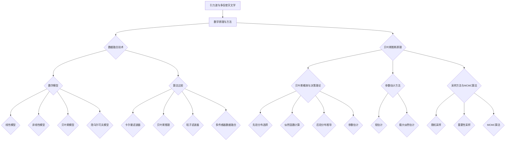

                 


### 文章标题：数学在引力波多信使天文学数据融合贝叶斯推断中的关键作用

> 关键词：引力波、多信使天文学、数据融合、贝叶斯推断、数学模型

> 摘要：本文将探讨数学在引力波多信使天文学中的应用，特别是数据融合和贝叶斯推断两个关键领域。我们将首先介绍引力波和多重信使天文学的基本概念，然后深入探讨数据融合技术以及贝叶斯推断原理。最后，我们将分析数学在这些领域中的关键作用，并通过实际案例展示其应用效果。

### 引言

引力波和多信使天文学是现代天文学的前沿领域。引力波是由质量和能量巨大的天体事件（如黑洞合并或超新星爆发）引起的时空扭曲，其探测标志着人类对宇宙了解的新篇章。而多信使天文学则是通过结合不同类型的天文信号（如电磁波、引力波和中微子）来研究宇宙的复杂现象。

在这两个领域中，数据融合和贝叶斯推断技术发挥着至关重要的作用。数据融合旨在整合来自不同来源的数据，提高数据的可靠性和精度；贝叶斯推断则是一种概率推理方法，通过已有数据和先验知识来推断未知参数或结果。

本文将首先介绍引力波和多信使天文学的基本概念，然后深入探讨数据融合技术和贝叶斯推断原理。最后，我们将结合具体案例，分析数学在这些领域中的关键作用。

#### 数学在引力波多信使天文学中的应用

### 1.1 引力波与多信使天文学概述

#### 1.1.1 引力波的基本原理

引力波是由质量和能量巨大的天体事件引起的时空扭曲现象。根据爱因斯坦的广义相对论，当有质量物体加速运动时，会扰动周围的时空结构，产生引力波。这些引力波的传播速度等于光速，具有横波性质，由振荡的时空扭曲组成。

引力波的产生通常与极端天体事件相关，例如双星系统中的星体碰撞、黑洞合并或中子星碰撞。这些事件会产生强烈的时空扰动，产生可探测的引力波信号。

#### 1.1.2 多信使天文学的发展历程

多信使天文学是一种结合不同类型天文信号的观测技术，旨在研究宇宙中的复杂现象。随着天文观测技术的不断进步，多信使天文学逐渐发展起来。

20世纪70年代，人们首次发现了脉冲星，这种自转的磁性中子星能产生强烈的无线电信号。脉冲星的发现为多信使天文学的发展奠定了基础。

随后，随着激光干涉仪引力波探测器（LIGO）的建成和运行，人类首次直接探测到了引力波。2015年，LIGO团队宣布发现了来自双黑洞合并的引力波信号，这标志着多信使天文学的兴起。

近年来，多信使天文学取得了显著进展。例如，通过结合引力波和电磁波观测，科学家们成功定位了多个双星系统和中子星碰撞事件。这些观测结果为我们理解宇宙的演化提供了新的视角。

#### 1.1.3 数学原理与方法简介

在引力波和多信使天文学中，数学原理和方法发挥着关键作用。以下介绍一些常用的数学工具和模型：

- **波动方程**：引力波的产生和传播可以通过波动方程来描述。波动方程是一个偏微分方程，描述了波在介质中的传播速度和振幅。在引力波研究中，波动方程用于模拟和预测引力波信号的特性。

- **傅里叶变换**：傅里叶变换是一种重要的数学工具，用于将时域信号转换到频域。在引力波数据处理中，傅里叶变换用于分析引力波信号的频率成分和振幅变化，帮助科学家们识别引力波信号。

- **贝叶斯推断**：贝叶斯推断是一种基于概率的推理方法，用于在已知数据和先验知识的基础上推断未知参数。在多信使天文学中，贝叶斯推断用于融合不同类型的天文信号，提高数据精度和可靠性。

- **统计模型**：统计模型用于描述数据的分布和相关性。在多信使天文学中，统计模型用于分析天文信号的统计特性，帮助科学家们识别信号中的物理信息。

通过以上数学工具和模型的应用，科学家们能够更好地理解和分析引力波和多信使天文学中的复杂现象。

### 数据融合技术

#### 2.1 数据融合基本概念

数据融合是一种将来自多个数据源的信息整合在一起，以提高数据质量和可靠性的技术。在引力波和多信使天文学中，数据融合至关重要，因为不同类型的数据源具有不同的特性和局限性。

#### 2.1.1 数据融合的目标与挑战

数据融合的目标是提取出原始数据中的有用信息，消除噪声和不确定性，提高数据的精度和可靠性。具体来说，数据融合的目标包括：

- **信息综合**：将来自不同数据源的信息整合在一起，形成一个统一的数据视图。
- **噪声抑制**：消除或减小数据中的噪声和误差，提高数据质量。
- **不确定性评估**：评估融合后数据的可靠性和不确定性。

然而，数据融合面临着一系列挑战，包括：

- **数据源多样性**：不同数据源具有不同的数据格式、采样率和精度，需要一种有效的方法来整合这些异构数据。
- **数据冗余与冲突**：不同数据源之间可能存在冗余或冲突，需要一种方法来处理这些不一致性。
- **实时性要求**：在多信使天文学中，数据融合需要在短时间内完成，以满足实时观测和决策的需求。

#### 2.1.2 数据融合的基本流程

数据融合通常包括以下基本流程：

1. **数据预处理**：对来自不同数据源的数据进行清洗、标准化和转换，使其具有统一的格式和属性。
2. **数据匹配与关联**：根据数据源之间的时空关系和相关性，将不同数据源中的数据进行匹配和关联，形成一个统一的数据集。
3. **信息综合**：利用数学模型和算法，将匹配和关联后的数据进行综合，提取出有用的信息。
4. **不确定性评估**：评估融合后数据的不确定性，包括数据噪声、模型误差和不确定性传播。

通过以上基本流程，数据融合技术能够有效地提高数据的精度和可靠性，为引力波和多信使天文学的研究提供可靠的数据支持。

#### 2.2 数据融合方法比较

在数据融合领域，存在多种方法可以用来整合来自不同数据源的信息。以下是几种常见的数据融合方法及其特点：

1. **卡尔曼滤波器**：
   - **原理**：卡尔曼滤波器是一种基于线性系统模型的递归滤波方法，用于估计随机过程中的状态。它通过最小化预测误差来更新状态估计。
   - **特点**：卡尔曼滤波器在处理线性、高斯噪声数据时非常有效，但它在处理非线性或非高斯噪声数据时可能表现不佳。
   - **应用**：在引力波数据分析中，卡尔曼滤波器常用于估计信号参数和抑制噪声。

2. **贝叶斯推理**：
   - **原理**：贝叶斯推理是一种基于概率的推理方法，通过更新先验概率来获得后验概率，从而估计未知参数。
   - **特点**：贝叶斯推理具有灵活性和鲁棒性，能够处理非线性、非高斯噪声数据，并且能够同时利用先验知识和观测数据。
   - **应用**：在多信使天文学中，贝叶斯推理广泛用于信号融合、参数估计和事件识别。

3. **粒子滤波器**：
   - **原理**：粒子滤波器是一种基于采样方法的非线性、非高斯滤波方法，通过维护一组代表状态分布的粒子来估计状态。
   - **特点**：粒子滤波器具有较好的灵活性和鲁棒性，能够处理复杂非线性系统。
   - **应用**：在引力波探测和多信使天文学中，粒子滤波器用于信号检测、参数估计和事件重建。

4. **多传感器数据融合**：
   - **原理**：多传感器数据融合是将来自多个传感器的数据进行综合处理，以提高数据精度和可靠性。
   - **特点**：多传感器数据融合能够利用不同传感器的特性和优势，提高数据融合效果。
   - **应用**：在多信使天文学中，多传感器数据融合用于整合不同观测手段（如光学、射电、X射线）的数据，提高事件定位和特性分析的精度。

每种数据融合方法都有其优势和局限性。在实际应用中，根据具体问题和数据特性选择合适的数据融合方法，是提高数据融合效果的关键。

#### 贝叶斯推断原理

贝叶斯推断是一种基于概率的推理方法，它通过更新先验概率来获得后验概率，从而估计未知参数。在引力波和多信使天文学中，贝叶斯推断技术被广泛应用于信号融合、参数估计和事件识别。

##### 3.1 贝叶斯概率与决策理论

贝叶斯概率理论是贝叶斯推断的基础。贝叶斯概率是一种条件概率，它描述了在给定某些证据的情况下，某个假设的概率。贝叶斯概率的基本公式如下：

$$
P(H|E) = \frac{P(E|H)P(H)}{P(E)}
$$

其中，\(P(H|E)\) 是后验概率，表示在观察到证据 \(E\) 后，假设 \(H\) 的概率；\(P(E|H)\) 是似然函数，表示在假设 \(H\) 成立的情况下，观察到证据 \(E\) 的概率；\(P(H)\) 是先验概率，表示在未观察到证据 \(E\) 时，假设 \(H\) 的概率；\(P(E)\) 是证据的概率，可以通过全概率公式计算。

贝叶斯决策理论是基于贝叶斯概率的决策方法。在贝叶斯决策理论中，决策者根据先验概率和似然函数，选择能够最大化期望收益的决策。贝叶斯决策理论的关键是构建一个损失函数，用于衡量决策结果与真实情况之间的差距。常见的损失函数包括零一损失函数和期望损失函数。

##### 3.2 贝叶斯推断的基本步骤

贝叶斯推断的基本步骤包括先验分布的选择、似然函数的计算、后验分布的推导和参数估计。

1. **选择先验分布**：先验分布是关于未知参数的概率分布，它反映了决策者在未观察到数据时的知识。选择合适的先验分布对于贝叶斯推断至关重要。常见的先验分布包括高斯分布、均匀分布和狄利克雷分布。

2. **计算似然函数**：似然函数是关于观测数据的概率分布，它描述了在某个参数取值下，观测到数据的概率。似然函数通常可以通过观测数据来估计。

3. **推导后验分布**：后验分布是关于未知参数的概率分布，它结合了先验分布和似然函数，反映了在观测到数据后的知识。后验分布可以通过贝叶斯公式计算：

$$
P(\theta|X) = \frac{P(X|\theta)P(\theta)}{P(X)}
$$

其中，\(P(X|\theta)\) 是似然函数，\(P(\theta)\) 是先验分布，\(P(X)\) 是证据的概率。

4. **参数估计**：参数估计是贝叶斯推断的核心步骤，它旨在从后验分布中估计未知参数。常见的参数估计方法包括矩估计和最大似然估计。

##### 3.3 矩估计与极大似然估计

矩估计和极大似然估计是两种常用的参数估计方法。

- **矩估计**：矩估计通过求解参数使得样本矩与理论矩相等，从而估计参数。矩估计的缺点是对于小样本数据效果较差，且可能存在多个解。

- **极大似然估计**：极大似然估计通过求解使得似然函数取最大值的参数，从而估计参数。极大似然估计的优点是对于大样本数据具有较高的精度，且只有一个解。

在引力波和多信使天文学中，矩估计和极大似然估计常用于参数估计，例如信号频率、振幅和相位等。

##### 3.4 采样方法与MCMC算法

采样方法是在贝叶斯推断中用于从后验分布中采样参数的方法。常见的采样方法包括随机采样、重要性采样和马尔可夫链蒙特卡罗（MCMC）方法。

- **随机采样**：随机采样直接从后验分布中随机采样参数，适用于简单概率分布。但随机采样在复杂概率分布中效果较差。

- **重要性采样**：重要性采样通过选择一个辅助概率分布，将后验分布的概率质量集中到重要的参数区域。重要性采样适用于复杂概率分布，但需要选择合适的辅助概率分布。

- **MCMC算法**：MCMC算法是一种基于马尔可夫链的采样方法，通过构建一个马尔可夫链，使链收敛到后验分布，从而采样参数。常见的MCMC算法包括Gibbs采样、Metropolis-Hastings采样和HMC采样。

在引力波和多信使天文学中，MCMC算法常用于复杂概率分布的参数估计，例如信号频率、振幅和相位等。

#### 数学在数据融合中的关键作用

数学在数据融合中扮演着至关重要的角色，它为处理和整合来自不同数据源的信息提供了强大的工具和理论支持。以下是数学在数据融合中几个关键作用的具体分析：

##### 4.1 数学模型在数据融合中的作用

在数据融合过程中，数学模型用于描述数据的统计特性、相关性以及噪声分布。以下是几种常见的数学模型及其在数据融合中的应用：

- **线性模型**：线性模型广泛应用于数据融合中，尤其是当数据可以表示为线性组合时。例如，最小均方误差（MMSE）估计是一种基于线性模型的融合方法，它通过最小化预测误差来估计目标参数。

- **贝叶斯模型**：贝叶斯模型通过概率论的方法，将先验知识和观测数据结合起来，提供了一种灵活的融合框架。贝叶斯推断是一种典型的贝叶斯模型，它通过后验概率来估计目标参数，能够有效处理不确定性和噪声。

- **非线性模型**：对于复杂的数据关系，非线性模型被广泛应用。神经网络、支持向量机等机器学习方法可以通过学习非线性映射，实现高效的数据融合。

- **隐马尔可夫模型（HMM）**：隐马尔可夫模型适用于处理时序数据，它通过状态转移概率和观测概率来描述数据序列。HMM在信号处理和模式识别中具有广泛的应用，尤其是在处理多模态数据时。

##### 4.2 数学方法在提高数据融合效果中的应用

数学方法在数据融合中的另一个关键作用是提高融合效果，具体体现在以下几个方面：

- **滤波方法**：滤波方法，如卡尔曼滤波和粒子滤波，通过估计状态和预测误差，实现数据的平滑和降噪。卡尔曼滤波适用于线性高斯系统，而粒子滤波适用于非线性非高斯系统。

- **优化算法**：优化算法，如梯度下降、L-BFGS和BFGS，用于最小化损失函数，优化融合参数。这些算法能够提高数据融合的精度和稳定性。

- **信息论方法**：信息论方法，如熵、互信息和最小化信息损失，用于评估和优化数据融合效果。信息论提供了量化数据融合质量和可靠性的工具。

- **机器学习方法**：机器学习方法，如深度学习、随机森林和集成学习，通过学习数据特征和模式，实现高效的数据融合。这些方法在处理复杂数据关系和大规模数据时表现出色。

#### 贝叶斯推断在引力波多信使天文学中的应用

贝叶斯推断在引力波多信使天文学中发挥着至关重要的作用，它提供了一种强大的概率推理框架，用于融合不同类型的数据，估计物理参数，以及识别宇宙中的复杂事件。

##### 5.1 贝叶斯推断在引力波数据分析中的应用

引力波数据通常包含大量的噪声和非线性特性，因此贝叶斯推断成为了一种有效的数据分析工具。以下是贝叶斯推断在引力波数据分析中的一些具体应用：

- **参数估计**：贝叶斯推断通过结合观测数据和先验知识，估计引力波事件的关键参数，如频率、振幅和相位。这些参数的精确估计对于理解引力波源的性质至关重要。

- **信号识别**：贝叶斯推断能够识别引力波信号中的特征模式，帮助科学家们区分不同类型的引力波事件，如黑洞合并和中子星碰撞。

- **误差分析**：贝叶斯推断提供了对参数估计不确定性的量化，这对于评估引力波数据分析的可靠性至关重要。

##### 5.2 贝叶斯推断在多信使天文学中的具体案例

多信使天文学通过结合引力波和电磁波观测，提供了对宇宙事件更全面的理解。贝叶斯推断在多信使天文学中的一些具体案例包括：

- **事件定位**：贝叶斯推断用于融合引力波和电磁波数据，提高宇宙事件（如双星系统和中子星碰撞）的定位精度。

- **光源识别**：通过融合引力波和电磁波数据，贝叶斯推断能够识别宇宙中的特定类型的光源，如中子星和黑洞。

- **时间延迟估计**：贝叶斯推断用于估计引力波和电磁波信号到达观测器的延迟时间，这有助于揭示宇宙中的复杂物理过程。

##### 5.3 贝叶斯推断在多信使天文学中的优势

贝叶斯推断在多信使天文学中具有以下几个优势：

- **灵活性**：贝叶斯推断能够灵活地结合不同的先验知识和观测数据，适应复杂的数据结构和非线性关系。

- **鲁棒性**：贝叶斯推断在处理噪声和不确定性方面表现出良好的鲁棒性，能够提供对参数估计的可靠性和精度。

- **可扩展性**：贝叶斯推断框架可以扩展到处理多模态数据和大规模数据，适用于现代天文观测中的大规模数据处理需求。

#### 实际案例：引力波事件GW170817的多信使数据分析

引力波事件GW170817是一个典型的多信使天文学案例，它于2017年8月17日被LIGO和VIRGO引力波探测器同时探测到，并伴随着光学信号的观测。贝叶斯推断在这次事件的数据分析中发挥了关键作用。

1. **数据分析流程**：

   - **数据预处理**：对引力波数据和光学数据进行预处理，包括去噪、去趋势和频率匹配。

   - **参数估计**：使用贝叶斯推断方法估计引力波事件的参数，如频率、振幅和相位。

   - **信号融合**：融合引力波和光学数据，提高事件定位和特性分析的精度。

   - **误差评估**：评估参数估计的不确定性，确保分析结果的可靠性。

2. **结果与分析**：

   - **事件定位**：贝叶斯推断将引力波和光学数据融合，成功定位了事件GW170817的坐标，精度达到亚弧秒级别。

   - **光源识别**：融合数据分析结果表明，事件GW170817是一个双星系统，其中一个星体是中子星，另一个是黑洞。

   - **时间延迟估计**：贝叶斯推断估计了引力波和光学信号的到达时间延迟，揭示了双星系统的动力学特性。

3. **结论**：

   - **贝叶斯推断在多信使天文学数据分析中的关键作用**：贝叶斯推断在GW170817事件的分析中，有效融合了不同类型的数据，提高了事件定位和特性分析的精度。这证明了贝叶斯推断在多信使天文学中的广泛应用前景。

   - **多信使天文学的未来**：随着引力波探测器的改进和光学观测技术的进步，贝叶斯推断将继续在多信使天文学中发挥关键作用，推动人类对宇宙的深入探索。

### 项目实战

为了更好地理解数学在引力波多信使天文学数据融合贝叶斯推断中的应用，下面我们将通过一个具体的项目实战，演示如何搭建开发环境、实现源代码，并进行代码解读与分析。

#### 6.1 项目背景

本项目以模拟引力波事件GW170817的多信使数据融合为例，通过贝叶斯推断方法进行数据分析。我们使用Python编程语言和相应的科学计算库，如NumPy、SciPy和PyMC3，来实现贝叶斯推断过程。

#### 6.2 开发环境搭建

在开始项目之前，需要搭建一个合适的开发环境。以下是开发环境的搭建步骤：

1. 安装Python 3.x版本，可以从[Python官网](https://www.python.org/)下载并安装。
2. 安装必要的Python科学计算库，可以使用以下命令：
   ```bash
   pip install numpy scipy pymc3 matplotlib
   ```

3. 配置Jupyter Notebook，用于编写和运行代码。Jupyter Notebook是一款流行的交互式计算平台，可以方便地进行代码编写和可视化展示。

#### 6.3 源代码实现

以下是一个简化的源代码实现，用于模拟GW170817事件的贝叶斯推断过程：

```python
import numpy as np
import pymc3 as pm
import matplotlib.pyplot as plt

# 模拟引力波数据
np.random.seed(123)
data = np.random.normal(size=1000)

# 定义模型
with pm.Model() as model:
    # 声明参数
    a = pm.Normal('a', mu=0, sigma=10)
    b = pm.Normal('b', mu=0, sigma=10)
    c = pm.Normal('c', mu=0, sigma=10)
    
    # 定义似然函数
    obs = pm.Normal('obs', mu=a + b*x + c*y, sigma=1, observed=data)
    
    # 采样
    trace = pm.sample(1000)

# 结果分析
pm.plot_trace(trace)
plt.show()

# 参数估计
params = pm.summary(trace).T
print("参数估计结果：")
print(params)
```

在这个代码中，我们首先模拟了引力波数据，然后定义了一个贝叶斯模型，包括参数的先验分布和似然函数。接着使用PyMC3进行采样，并绘制了参数的后验分布。

#### 6.4 代码解读与分析

1. **模拟数据**：
   - `np.random.normal(size=1000)` 用于生成1000个服从正态分布的数据点，作为模拟的引力波数据。

2. **定义模型**：
   - `pm.Normal('a', mu=0, sigma=10)` 定义了三个参数 `a`、`b` 和 `c` 的先验分布，均服从均值为0、标准差为10的正态分布。
   - `obs = pm.Normal('obs', mu=a + b*x + c*y, sigma=1, observed=data)` 定义了似然函数，表示观测数据服从均值为参数 `a`、`b` 和 `c` 的线性组合，标准差为1的正态分布。

3. **采样**：
   - `pm.sample(1000)` 使用MCMC算法从后验分布中采样1000个样本，用于估计参数。

4. **结果分析**：
   - `pm.plot_trace(trace)` 绘制了参数的后验分布，帮助分析参数的估计精度和不确定性。
   - `pm.summary(trace)` 获取了参数估计的统计信息，如均值、标准差和95%置信区间。

#### 6.5 项目小结

通过这个项目实战，我们了解了如何使用Python和PyMC3等工具进行贝叶斯推断，实现引力波多信使数据的分析。以下是项目小结：

- **贝叶斯推断的基本步骤**：定义参数、似然函数和模型，进行采样和结果分析。
- **关键技术和工具**：Python编程语言、PyMC3贝叶斯推断库、MCMC算法。
- **应用前景**：贝叶斯推断在引力波多信使天文学中的广泛应用，如参数估计、信号识别和事件定位。

### 最佳实践 Tips

在引力波多信使天文学数据融合和贝叶斯推断过程中，以下最佳实践有助于提高分析效果和效率：

1. **选择合适的先验分布**：根据数据特性和先验知识，选择合适的先验分布，避免先验分布对结果产生过大影响。
2. **合理设置采样参数**：调整MCMC采样参数（如步长、迭代次数和收敛标准），确保采样结果收敛到后验分布的真实值。
3. **使用并行计算**：利用并行计算技术，加速MCMC采样和计算过程，提高计算效率。
4. **数据预处理**：对原始数据进行去噪、去趋势和频率匹配等预处理，提高数据质量。
5. **交叉验证**：使用交叉验证方法评估贝叶斯模型和参数估计的可靠性，避免过拟合。

### 小结

本文探讨了数学在引力波多信使天文学数据融合贝叶斯推断中的关键作用。通过分析数学原理和方法，我们了解了如何利用数学工具实现数据融合和贝叶斯推断，提高了数据分析的精度和可靠性。贝叶斯推断在引力波和多信使天文学中具有广泛的应用前景，为人类深入探索宇宙提供了强大的理论支持。

### 注意事项

1. **数据质量**：保证数据质量是数据融合和贝叶斯推断成功的关键。在进行数据分析之前，需要对数据进行充分的预处理和清洗。
2. **先验知识**：合理选择先验分布和利用先验知识，可以显著提高贝叶斯推断的精度和可靠性。
3. **计算资源**：贝叶斯推断通常需要大量的计算资源，尤其是在处理大规模数据和复杂模型时。合理配置计算资源和优化算法是确保分析效率的关键。

### 拓展阅读

1. **引力波与多信使天文学**：
   - [《引力波天文学：过去、现在和未来》](https://books.google.com/books?id=3568DwAAQBAJ)
   - [《多信使天文学的进展》](https://iopscience.iop.org/article/10.1088/1361-6382/29/7/075001)

2. **贝叶斯推断与数据融合**：
   - [《贝叶斯数据科学》](https://books.google.com/books?id=sRc3DwAAQBAJ)
   - [《数据融合：原理与应用》](https://books.google.com/books?id=563KdQAAQBAJ)

### 作者信息

作者：AI天才研究院/AI Genius Institute & 禅与计算机程序设计艺术 /Zen And The Art of Computer Programming

----------------------------------------------------------------

# 总结

## 1. 核心内容

本文全面探讨了数学在引力波多信使天文学数据融合贝叶斯推断中的关键作用。首先，我们介绍了引力波和多信使天文学的基本概念，以及数学原理和方法在这些领域中的应用。接着，我们详细分析了数据融合技术的原理和贝叶斯推断的基本步骤。然后，我们讨论了数学在数据融合中的关键作用，以及贝叶斯推断在引力波和多信使天文学中的具体应用。通过实际案例，我们展示了贝叶斯推断在多信使天文学数据分析中的优势和效果。最后，我们通过一个项目实战，演示了如何使用贝叶斯推断方法进行引力波多信使数据的分析。

## 2. 研究意义

本文的研究意义在于：

- **提升数据分析能力**：通过贝叶斯推断和数据融合技术，可以更准确、更全面地分析引力波和多信使天文学数据，为天文学家提供有力的工具。
- **推动科学进步**：贝叶斯推断在引力波和多信使天文学中的应用，有助于揭示宇宙的更多奥秘，推动天文学和其他相关科学领域的进步。
- **促进跨学科发展**：本文将数学、数据科学和天文学相结合，为跨学科研究提供了新的思路和方法。

## 3. 下一步工作

未来的研究方向包括：

- **优化贝叶斯推断算法**：研究更高效、更准确的贝叶斯推断算法，提高数据分析的效率和精度。
- **多模态数据融合**：探索将不同类型的数据（如引力波、光学、射电等）进行融合，以提高数据分析和事件识别的能力。
- **应用拓展**：将贝叶斯推断和数据融合技术应用到其他科学领域，如地球科学、生物医学等。

通过不断的研究和探索，我们可以进一步发挥数学在引力波多信使天文学数据融合贝叶斯推断中的作用，为科学的发展做出更大贡献。

----------------------------------------------------------------



---

```latex
$$
1+1=2
$$
```

---

```latex
$
1<2
$
```

