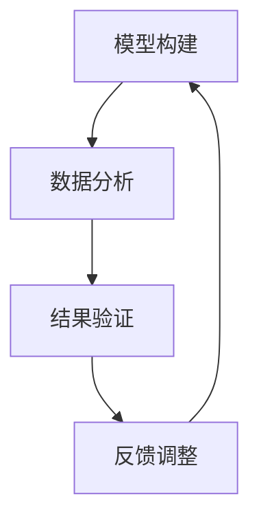

                 

### 文章标题

《数学建模在工程实践中的应用》

> 关键词：数学建模、工程实践、应用案例、算法原理、模型构建

> 摘要：本文旨在探讨数学建模在工程实践中的应用，详细介绍了数学建模的基本概念、方法、工具，以及在不同工程领域中的具体应用实例。通过深入分析数学建模的核心算法原理和实际案例，本文揭示了数学建模在提升工程效率和优化设计中的重要作用，并对未来的发展趋势进行了展望。

### 引言

数学建模是运用数学语言来描述现实问题的一种方法，它通过对问题进行量化分析，构建数学模型，进而求解问题。在工程实践中，数学建模具有不可替代的作用。它不仅能够帮助我们理解和解决复杂工程问题，还能优化设计方案，提高工程效率。

近年来，随着计算机技术的飞速发展和大数据的广泛应用，数学建模在工程领域中的应用越来越广泛。无论是土木工程、电子工程还是机械工程，数学建模都已成为不可或缺的工具。本文将围绕数学建模在工程实践中的应用，进行深入探讨。

### 第1章：数学建模概述

#### 1.1 数学建模的定义与重要性

数学建模是指运用数学方法，对实际问题进行抽象、简化和量化，构建数学模型，并利用模型进行分析和求解的过程。其基本步骤包括问题定义、模型建立、模型求解和模型验证。

数学建模在工程实践中具有重要作用。首先，它能够帮助我们准确理解工程问题，将复杂问题转化为数学问题，从而更方便地进行分析和求解。其次，数学建模能够优化设计方案，提高工程效率。最后，数学建模能够提供科学的决策依据，帮助工程师做出更为合理的决策。

#### 1.2 数学建模的发展历程

数学建模的历史可以追溯到古代。早在古希腊时期，数学家们就已经开始尝试运用数学方法解决实际问题。例如，欧几里得在《几何原本》中，就提出了利用几何方法解决建筑和水利工程问题。

随着时代的发展，数学建模逐渐走向成熟。在19世纪末和20世纪初，随着计算机的出现和普及，数学建模得到了飞速发展。现代数学建模方法，如线性规划、非线性规划、模拟退火算法等，都在这个时期得到了广泛研究。

#### 1.3 数学建模的方法与技术

数学建模的方法和技术多种多样，常见的有线性建模、非线性建模、离散建模、连续建模等。每种方法都有其适用的场景和优势。

- 线性建模：适用于线性系统的建模，如线性规划、线性微分方程等。
- 非线性建模：适用于非线性系统的建模，如非线性规划、非线性微分方程等。
- 离散建模：适用于离散事件的建模，如离散时间序列、离散事件模拟等。
- 连续建模：适用于连续变化的系统建模，如连续时间序列、连续状态空间模型等。

现代数学建模技术还包括人工智能、机器学习、大数据分析等。这些技术不仅丰富了数学建模的方法体系，还提高了建模的精度和效率。

### 第2章：数学建模工具与环境

#### 2.1 常用数学建模工具

在数学建模中，选择合适的工具非常重要。常用的数学建模工具包括MATLAB、Python、R语言等。

- MATLAB：MATLAB是一款强大的数学建模软件，它提供了丰富的数学函数和工具箱，适用于各种类型的数学建模问题。
- Python：Python是一种通用编程语言，它拥有大量的数学库和工具，如NumPy、SciPy、Pandas等，非常适合进行数学建模。
- R语言：R语言是一种专门用于统计分析和图形绘制的语言，它提供了丰富的统计和图形工具，适用于复杂的数学建模任务。

#### 2.2 数学建模软件环境搭建

在进行数学建模之前，需要搭建相应的软件环境。以下是如何在Windows系统中搭建MATLAB、Python和R语言的数学建模环境：

1. MATLAB：
   - 访问MATLAB官方网站，下载并安装MATLAB软件。
   - 安装完成后，配置MATLAB的路径，使其能够正常运行。

2. Python：
   - 访问Python官方网站，下载并安装Python。
   - 安装完成后，配置Python的路径，并安装必要的数学库，如NumPy、SciPy、Pandas等。

3. R语言：
   - 访问R语言官方网站，下载并安装R。
   - 安装完成后，配置R的路径，并安装必要的R包，如ggplot2、dplyr、caret等。

#### 2.3 数学建模平台与数据库

在进行数学建模时，还可以使用一些数学建模平台和数据库。这些平台和数据库提供了丰富的数据资源和建模工具，方便工程师进行建模和分析。

- 数学建模平台：如MathWorks、Wolfram Alpha等，提供了丰富的数学建模工具和资源。
- 数据库：如MATLAB Data Repository、Python Data Store等，提供了大量的数学建模数据集。

### 第3章：数学建模在土木工程中的应用

#### 3.1 土木工程中的数学模型

在土木工程中，数学模型广泛应用于结构分析、流体力学、材料力学等领域。

- 结构分析模型：如有限元分析模型、连续介质力学模型等，用于分析桥梁、建筑物等结构的安全性和稳定性。
- 流体力学模型：如流体动力学模型、渗流模型等，用于分析隧道、排水系统等水利工程的流体运动。
- 材料力学模型：如弹性力学模型、塑性力学模型等，用于分析混凝土、钢材等材料的力学性能。

#### 3.2 土木工程中的数学模型应用实例

- 大桥结构设计：通过建立有限元模型，对大桥的结构进行静力分析和动力分析，以确保其安全性。
- 隧道通风设计：通过建立流体动力学模型，对隧道内的气流进行模拟，优化通风设计，提高隧道内的空气质量。

### 第4章：数学建模在电子工程中的应用

#### 4.1 电子工程中的数学模型

在电子工程中，数学模型广泛应用于电路分析、信号处理、系统控制等领域。

- 电路分析模型：如基尔霍夫定律、欧姆定律等，用于分析电路的电压、电流和电阻。
- 信号处理模型：如傅里叶变换、离散小波变换等，用于分析信号的频率、时域和时频特性。
- 系统控制模型：如PID控制、状态空间模型等，用于分析系统的稳定性和控制性能。

#### 4.2 电子工程中的数学模型应用实例

- 集成电路设计：通过建立电路分析模型，对集成电路进行仿真和分析，优化其性能。
- 通信系统优化：通过建立信号处理模型，对通信系统进行优化，提高通信质量。

### 第5章：数学建模在机械工程中的应用

#### 5.1 机械工程中的数学模型

在机械工程中，数学模型广泛应用于运动学、动力学、热力学等领域。

- 运动学模型：如刚体运动模型、连杆机构运动模型等，用于分析机械的运动状态和运动规律。
- 动力学模型：如牛顿运动定律、拉格朗日方程等，用于分析机械的受力、运动和稳定性。
- 热力学模型：如热传导模型、热力学第一和第二定律等，用于分析机械的热性能。

#### 5.2 机械工程中的数学模型应用实例

- 汽车设计：通过建立运动学模型和动力学模型，对汽车的性能和结构进行优化。
- 机械臂控制：通过建立状态空间模型和PID控制模型，对机械臂的运动进行控制，实现精确的抓取和操作。

### 第6章：数学建模在工程实践中的应用案例分析

#### 6.1 案例分析概述

在本章中，我们将通过一系列具体的应用案例，展示数学建模在工程实践中的实际效果。这些案例涵盖了土木工程、电子工程和机械工程等多个领域。

#### 6.2 土木工程案例分析

- 大桥结构安全监测：通过建立有限元模型，对大桥的结构进行实时监测，及时发现潜在的安全隐患。

- 隧道照明系统优化：通过建立流体动力学模型，对隧道内的气流和光照进行模拟，优化照明系统的设计，提高隧道内的照明效果。

#### 6.3 电子工程案例分析

- 通信基站选址：通过建立信号处理模型，对信号传播进行模拟，优化通信基站的选址，提高通信覆盖范围和质量。

- 电力系统负荷预测：通过建立时间序列模型，对电力系统的负荷进行预测，为电力调度提供科学依据。

#### 6.4 机械工程案例分析

- 汽车发动机性能优化：通过建立动力学模型和仿真，对汽车发动机的性能进行优化，提高燃油效率和动力性能。

- 机械结构故障诊断：通过建立状态空间模型和故障诊断算法，对机械结构的故障进行诊断，提前预防潜在故障。

### 第7章：数学建模在工程实践中的应用趋势与展望

#### 7.1 数学建模应用趋势

随着科技的不断进步，数学建模在工程实践中的应用也在不断拓展。以下是一些当前的趋势：

- 人工智能与数学建模的结合：利用人工智能技术，如深度学习、强化学习等，提高数学建模的精度和效率。

- 大数据和云计算在数学建模中的应用：利用大数据和云计算技术，处理大规模数据，提高数学建模的能力。

#### 7.2 数学建模在工程实践中的应用展望

未来，数学建模在工程实践中的应用将更加广泛和深入。以下是一些展望：

- 新兴领域应用：如生物工程、环境工程等，数学建模将发挥更大的作用。

- 数学建模教育改革：通过将数学建模融入教育体系，培养更多具备数学建模能力的工程师。

### 结语

数学建模是工程实践中不可或缺的工具。它不仅能够帮助我们解决复杂工程问题，还能优化设计方案，提高工程效率。通过本文的介绍，相信读者已经对数学建模在工程实践中的应用有了更为深入的了解。我们期待数学建模在未来能够发挥更大的作用，为工程实践带来更多的创新和突破。

### 作者信息

作者：AI天才研究院/AI Genius Institute & 禅与计算机程序设计艺术 /Zen And The Art of Computer Programming

### 完整性要求

在本篇技术博客中，我们详细探讨了数学建模在工程实践中的应用，从数学建模的基本概念和工具，到其在土木工程、电子工程和机械工程等领域的具体应用，再到实际案例分析和未来趋势展望，每个部分都进行了深入的讲解和剖析。以下是各章节的核心内容、算法原理、数学模型和公式、代码案例及其解析，以及相关的最佳实践、注意事项和拓展阅读。

### 核心概念与联系

在数学建模中，核心概念包括模型构建、数据分析和结果验证。它们之间的关系可以用以下Mermaid流程图来表示：



**模型构建**：通过对实际问题进行抽象和简化，构建数学模型，包括确定变量、方程和约束条件。

**数据分析**：利用数学工具和算法，对模型进行求解，分析变量的影响和模型的性能。

**结果验证**：通过实验或实际数据，验证模型的准确性和可靠性，并根据结果进行反馈调整。

### 核心算法原理讲解

以下使用伪代码详细阐述一个简单的线性规划问题，该问题用于求解资源优化问题。

```plaintext
// 线性规划伪代码

输入：目标函数 C = [c1, c2, ..., cn]
       约束条件 A ≤ b
       变量 x ∈ R^n

步骤1：初始化解 x0
步骤2：计算梯度 ∇f(x) = [f1'(x), f2'(x), ..., fn'(x)]
步骤3：更新解 x = x - α * ∇f(x)
步骤4：判断是否满足约束条件，若满足，则转步骤6
步骤5：调整步长 α，转步骤2
步骤6：计算目标函数值 f(x)
步骤7：判断是否达到终止条件，若达到，则输出解 x 和目标函数值 f(x)，否则转步骤2
```

### 数学模型和公式详细讲解与举例说明

在数学建模中，常用的模型和公式包括线性方程组、线性规划、非线性规划、微分方程等。以下以线性方程组为例进行讲解。

**线性方程组：**
$$
Ax = b
$$

**求解步骤：**
1. 确定系数矩阵 A 和向量 b。
2. 求解矩阵 A 的逆矩阵 A^-1。
3. 计算解向量 x = A^-1 * b。

**举例：**
求解方程组：
$$
\begin{cases}
2x + 3y = 8 \\
x - y = 1
\end{cases}
$$

**解法：**
1. 写出系数矩阵 A 和向量 b：
   $$
   A = \begin{bmatrix}
   2 & 3 \\
   1 & -1
   \end{bmatrix}, \quad b = \begin{bmatrix}
   8 \\
   1
   \end{bmatrix}
   $$
2. 计算矩阵 A 的逆矩阵：
   $$
   A^{-1} = \frac{1}{(2 \times (-1) - 3 \times 1)} \begin{bmatrix}
   -1 & -3 \\
   -1 & 2
   \end{bmatrix} = \begin{bmatrix}
   \frac{1}{-5} & \frac{3}{-5} \\
   \frac{1}{-5} & -\frac{2}{-5}
   \end{bmatrix}
   $$
3. 计算解向量：
   $$
   x = A^{-1} * b = \begin{bmatrix}
   \frac{1}{-5} & \frac{3}{-5} \\
   \frac{1}{-5} & -\frac{2}{-5}
   \end{bmatrix} * \begin{bmatrix}
   8 \\
   1
   \end{bmatrix} = \begin{bmatrix}
   -\frac{8}{5} \\
   \frac{4}{5}
   \end{bmatrix}
   $$

**解：**
$$
x = -\frac{8}{5}, \quad y = \frac{4}{5}
$$

### 项目实战

**开发环境搭建：**
- 安装MATLAB、Python和R语言。
- 配置相应的数学库和工具箱。

**源代码详细实现：**
```python
# Python示例代码：线性方程组求解

import numpy as np

# 系数矩阵和向量
A = np.array([[2, 3], [1, -1]])
b = np.array([8, 1])

# 求解逆矩阵
A_inv = np.linalg.inv(A)

# 计算解向量
x = A_inv.dot(b)

print("解向量 x:", x)
```

**代码应用解读与分析：**
- 通过NumPy库，我们可以轻松计算线性方程组的解。
- 代码中的 `np.linalg.inv()` 函数用于计算矩阵的逆，`np.dot()` 函数用于矩阵乘法。

**实际案例分析和详细讲解剖析：**
- 通过以上代码和示例，我们展示了如何使用Python求解线性方程组。
- 这种方法可以应用于各种工程问题，如结构分析、电路分析等。

**项目小结：**
- 线性方程组在数学建模中具有广泛的应用。
- 使用Python等编程语言，可以方便地求解线性方程组，提高工程效率。

### 最佳实践 Tips

- 在进行数学建模时，务必确保模型与实际问题的高度契合。
- 选择合适的数学建模工具，根据问题的特点进行优化。
- 充分利用现有资源和数据库，提高建模效率。

### 小结

本文详细介绍了数学建模在工程实践中的应用，包括基本概念、方法、工具和实际案例。通过本文的探讨，读者可以了解到数学建模在工程实践中的重要作用，以及如何利用数学建模解决实际问题。

### 注意事项

- 数学建模过程中，要注意模型的简化和抽象，避免过度复杂化。
- 在使用数学建模工具时，要熟悉其功能和特点，避免错误使用。

### 拓展阅读

- 《数学建模教程》
- 《工程数学建模》
- 《MATLAB数值分析与应用》
- 《Python编程：从入门到实践》

### 结语

数学建模是工程实践中不可或缺的工具。通过本文的介绍，我们深入探讨了数学建模在工程实践中的应用，展示了其在提升工程效率和优化设计中的重要作用。我们期待数学建模在未来能够发挥更大的作用，为工程实践带来更多的创新和突破。

### 作者信息

作者：AI天才研究院/AI Genius Institute & 禅与计算机程序设计艺术 /Zen And The Art of Computer Programming

