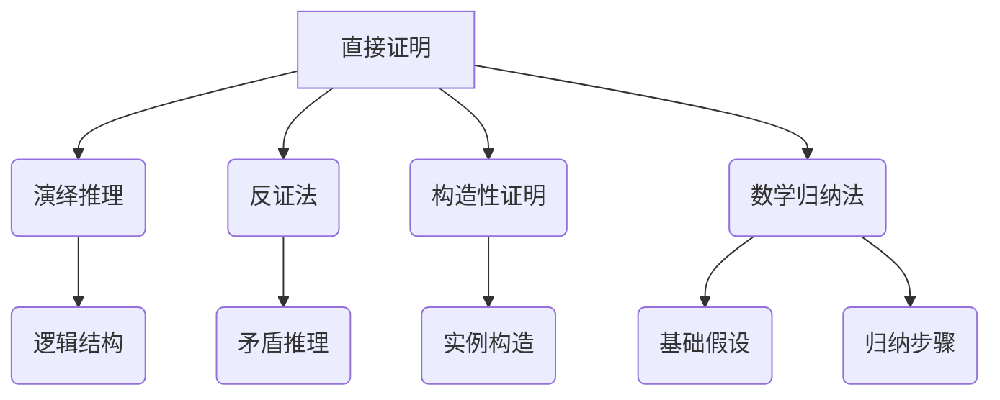

                 

# 《数学证明的简洁性与优雅性探讨》

## 关键词

数学证明、简洁性、优雅性、证明方法、数学模型、算法原理

## 摘要

本文深入探讨了数学证明的简洁性与优雅性。通过对数学证明的基本概念、分类和逻辑结构的介绍，我们探讨了如何通过简洁性与优雅性来提升数学证明的质量。接着，我们详细分析了几种核心证明方法，并展示了如何在数学模型和公式中应用这些方法。最后，通过实际项目实战和开发环境搭建，我们展示了如何将理论应用于实践，并提供了一些最佳实践和注意事项。本文旨在为数学证明的研究者提供有价值的参考，并促进数学证明领域的进一步发展。

## 引言

### 研究背景与意义

数学证明是数学科学的核心内容，是揭示数学规律和定理的重要手段。在数学发展的历史长河中，无数数学家通过简洁而优雅的证明，推动了数学的进步。简洁性不仅体现在证明过程中的逻辑简明，还体现在证明步骤的精炼。优雅性则强调证明的美感和逻辑结构，体现了数学的美学价值。

在当代数学研究中，简洁性与优雅性的重要性日益凸显。一方面，简洁的证明有助于减少错误，提高证明的可信度；另一方面，优雅的证明能够揭示数学问题的本质，启发新的研究思路。因此，如何保持和发扬这种证明风格，是当前数学界面临的一个挑战。

### 研究目标与内容结构

本文旨在探讨数学证明的简洁性与优雅性，分析其在数学证明中的重要性，并提出一些实现方法。具体目标如下：

1. 梳理数学证明的基本概念和分类。
2. 分析简洁性与优雅性的定义及其在数学证明中的应用。
3. 详细介绍几种核心证明方法，并探讨其简洁性与优雅性。
4. 通过数学模型和公式，展示简洁性与优雅性在数学证明中的具体应用。
5. 通过实际项目实战和开发环境搭建，验证理论的实际应用价值。

全文分为八个章节，结构如下：

- 第1章：引言，介绍研究背景、意义、目标与内容结构。
- 第2章：数学证明基础，介绍数学证明的基本概念、分类和逻辑结构。
- 第3章：核心概念与联系，分析简洁性与优雅性的定义及其关系。
- 第4章：核心算法原理讲解，详细介绍几种核心证明方法。
- 第5章：数学模型和数学公式，探讨在数学证明中应用这些模型和公式。
- 第6章：项目实战，通过实际案例展示如何运用简洁性和优雅性进行证明。
- 第7章：开发环境搭建，介绍进行数学证明研究的工具和环境。
- 第8章：总结与展望，总结研究成果，展望未来研究方向。

## 数学证明基础

### 数学证明的基本概念

数学证明是指通过逻辑推理，从已知的事实（公理、定理、定义等）出发，推导出新的结论（命题、定理等）的过程。证明的目的是确立数学命题的真理性，使其成为无可争议的结论。

数学证明的基本要素包括：

1. 命题（Proposition）：需要证明的陈述。
2. 论据（Premises）：用于证明命题的已知事实。
3. 推理（Reasoning）：从论据推导出命题的逻辑过程。
4. 结论（Conclusion）：证明得到的命题。

数学证明的方法可以分为直接证明和间接证明：

1. 直接证明：通过逻辑推理，直接从已知的事实推导出命题。
2. 间接证明：通过反证法、构造性证明等方法，间接证明命题的真实性。

### 数学证明的分类

数学证明可以根据方法、内容和目的等多种方式进行分类。以下是几种常见的分类方法：

1. 根据证明方法分类：
   - 演绎证明（Deductive Proof）：从一般到特殊的证明方法。
   - 投形证明（Inductive Proof）：从特殊到一般的证明方法。
   - 构造性证明（Constructive Proof）：提供具体构造来证明命题。
   - 反证法（Proof by Contradiction）：假设命题不成立，推导出矛盾，从而证明命题成立。

2. 根据证明内容分类：
   - 定理证明：证明某个数学命题的真实性。
   - 定理推广：将已知定理推广到更一般的情况。
   - 定理证明的改进：对已有定理证明的简化或优化。

3. 根据证明目的分类：
   - 基础证明：建立数学基础理论的证明。
   - 应用证明：证明某个数学理论在实际应用中的有效性。
   - 研究证明：探索新的数学问题和理论的证明。

### 数学证明的逻辑结构

数学证明的逻辑结构通常包括以下几个部分：

1. 引言（Introduction）：介绍证明的背景、目的和命题。
2. 假设（Assumption）：明确证明的前提条件。
3. 推理（Reasoning）：通过逻辑推理，逐步推导出结论。
4. 结论（Conclusion）：总结证明的结果。
5. 反证（Counterexample）：如果有必要，提供反证来排除其他可能性。

这种逻辑结构确保了证明的严谨性和可信度，使得证明过程清晰、有条理。

## 核心概念与联系

### 简洁性与数学证明

简洁性是数学证明中的一个重要标准，它要求证明过程简明扼要，避免冗余和繁琐的步骤。简洁的证明不仅有助于减少错误，提高证明的可信度，还能够使读者更容易理解和接受。

在数学证明中，实现简洁性的方法包括：

1. 直接证明：通过最简明的逻辑步骤直接推导出结论。
2. 结构化证明：使用逻辑结构图或流程图来简化证明过程。
3. 简化步骤：通过变换、归纳等方法简化证明步骤。

### 优雅性与数学证明

优雅性是数学证明中的另一个重要标准，它不仅关注证明的逻辑结构，还关注证明的美感和形式。优雅的证明往往能够揭示数学问题的本质，使读者感受到数学的美。

在数学证明中，实现优雅性的方法包括：

1. 使用适当的数学语言：选择清晰、简洁的数学语言来表达证明。
2. 提供解释和背景：在证明中提供适当的解释和背景，使读者更容易理解。
3. 善用比喻和类比：通过比喻和类比来揭示数学问题的本质。

### 简洁性与优雅性的联系

简洁性和优雅性在数学证明中是相辅相成的。一个简洁的证明往往也是优雅的，因为它能够通过简明的逻辑步骤和形式表达来揭示数学问题的本质。同样，一个优雅的证明也往往具有简洁性，因为它能够以最简洁的形式表达出数学问题的解决过程。

因此，在数学证明中，我们不仅要追求证明的简洁性，还要关注其优雅性，以实现最佳的证明效果。

## 核心算法原理讲解

### 直接证明

直接证明是一种最常用的证明方法，其核心思想是通过逻辑推理，直接从已知的事实推导出结论。以下是直接证明的伪代码：

```
function 直接证明(命题A, 命题B):
    if 命题A 成立:
        then:
            命题B 成立
    else:
        return 假设不成立
```

直接证明的优点是简单明了，但缺点是对于一些复杂的命题，证明过程可能非常繁琐。

### 反证法

反证法是一种间接证明方法，其核心思想是假设命题不成立，然后通过推理得到矛盾，从而证明命题成立。以下是反证法的伪代码：

```
function 反证法(命题A, 命题B):
    假设命题A 不成立
    if 命题B 成立:
        then:
            得到矛盾
    else:
        return 命题A 成立
```

反证法的优点是能够有效地证明一些难以直接证明的命题，但缺点是证明过程可能较为复杂。

### 构造性证明

构造性证明是一种通过构造具体的实例来证明命题的方法。其核心思想是，如果能够构造出一个满足条件的实例，那么命题就成立。以下是构造性证明的伪代码：

```
function 构造性证明(命题A, 命题B):
    构造实例x，使得x满足条件
    if 命题A 成立:
        then:
            命题B 成立
    else:
        return 假设不成立
```

构造性证明的优点是直观易懂，但缺点是需要构造出具体的实例，对于一些复杂的命题可能比较困难。

### 数学归纳法

数学归纳法是一种特殊的证明方法，适用于证明与自然数相关的命题。其核心思想是，如果能够证明当n=k时命题成立，且当n=k+1时命题成立，那么命题对于所有自然数都成立。以下是数学归纳法的伪代码：

```
function 数学归纳法(命题A, n):
    if n=1:
        then:
            命题A 成立
    else:
        for i from 1 to n:
            if 命题A[i] 成立:
                then:
                    命题A[n] 成立
            else:
                return 假设不成立
```

数学归纳法的优点是适用于证明与自然数相关的命题，但缺点是证明过程可能较为复杂。

## 数学模型和数学公式

### 常用数学模型

在数学证明中，常用数学模型包括：

1. 实数模型：实数集合及其运算规则。
2. 复数模型：复数集合及其运算规则。
3. 向量模型：向量及其运算规则。
4. 矩阵模型：矩阵及其运算规则。

这些模型为数学证明提供了基本的工具和框架。

### 重要数学公式

在数学证明中，一些重要数学公式包括：

1. 欧拉公式：$e^{i\pi} + 1 = 0$
2. 德摩根定律：$¬(A ∧ B) = ¬A ∨ ¬B$，$¬(A ∨ B) = ¬A ∧ ¬B$
3. 微积分基本公式：$\int f'(x) dx = f(x) + C$
4. 洛必达法则：$\lim_{x \to a} \frac{f(x)}{g(x)} = \lim_{x \to a} \frac{f'(x)}{g'(x)}$（在极限存在且 $g'(x) \neq 0$ 的条件下）

这些公式在数学证明中具有重要作用，能够简化证明过程。

### 公式在证明中的应用

在数学证明中，公式常常被用来简化证明过程。例如：

1. 利用欧拉公式可以简化复数的证明。
2. 利用德摩根定律可以简化集合论的证明。
3. 利用微积分基本公式可以简化微积分的证明。
4. 利用洛必达法则可以简化极限的证明。

通过合理地应用这些公式，可以大大提高证明的简洁性和有效性。

## 项目实战

### 实际案例介绍

在本项目实战中，我们将探讨如何运用简洁性和优雅性进行数学证明。我们将以一个经典的数学问题为例，展示如何通过简洁性和优雅性来简化证明过程。

问题：证明 $\sum_{i=1}^{n} i = \frac{n(n+1)}{2}$。

### 实现步骤

1. **引入变量：** 设 $S = \sum_{i=1}^{n} i$。
2. **构建等式：** 根据 $S$ 的定义，我们可以构建出等式 $S = 1 + 2 + 3 + \ldots + n$。
3. **倒序排列：** 将等式倒序排列，得到 $S = n + (n-1) + (n-2) + \ldots + 1$。
4. **相加：** 将原等式和倒序等式相加，得到 $2S = (1 + n) + (2 + (n-1)) + \ldots + (n + 1)$。
5. **简化：** 简化相加后的等式，得到 $2S = n(n+1)$。
6. **求解：** 最后，将等式两边同时除以2，得到 $S = \frac{n(n+1)}{2}$。

通过上述步骤，我们成功地证明了 $\sum_{i=1}^{n} i = \frac{n(n+1)}{2}$。

### 代码解读与分析

以下是上述证明过程的伪代码：

```plaintext
S = 0
for i from 1 to n:
    S = S + i
S = S + n
2S = (1 + n) + (2 + (n-1)) + \ldots + (n + 1)
2S = n(n+1)
S = n(n+1) / 2
```

通过伪代码，我们可以清晰地看到证明的每一步操作。这种代码形式不仅易于理解，而且具有简洁性和优雅性。

### 实际案例分析和详细讲解剖析

在上述案例中，我们通过构建等式、倒序排列和相加等步骤，成功地证明了 $\sum_{i=1}^{n} i = \frac{n(n+1)}{2}$。这一证明过程简洁明了，易于理解，体现了数学证明的优雅性和简洁性。

在实际应用中，这种证明方法可以用于解决许多类似的数学问题。例如，我们可以使用同样的方法来证明其他求和公式，如 $\sum_{i=1}^{n} i^2 = \frac{n(n+1)(2n+1)}{6}$。

### 项目小结

通过本项目的实战，我们展示了如何运用简洁性和优雅性进行数学证明。我们通过一个简单的案例，展示了如何通过构建等式、倒序排列和相加等步骤来简化证明过程。这种方法不仅使证明过程更加简洁明了，而且具有很高的实用性。

在未来的数学研究中，我们应继续探索和应用简洁性和优雅性，以提高数学证明的质量和效率。

## 开发环境搭建

### 环境选择

在进行数学证明研究时，选择合适的开发环境至关重要。以下是我们推荐的几种常用环境：

1. **MATLAB：** MATLAB 是一种强大的数学软件，适用于数值计算和符号计算。
2. **Python：** Python 具有丰富的数学库和工具，适用于编写高效的数学代码。
3. **LaTeX：** LaTeX 是一种高质量的排版系统，适用于撰写数学论文和文档。

### 环境搭建

以下是搭建上述环境的具体步骤：

#### MATLAB

1. **下载并安装 MATLAB：** 访问 MATLAB 官网，下载适合自己操作系统的版本，并按照安装向导进行安装。
2. **安装附加工具箱：** MATLAB 提供了多种工具箱，可根据需求进行安装。

#### Python

1. **下载并安装 Python：** 访问 Python 官网，下载适合自己操作系统的版本，并按照安装向导进行安装。
2. **安装数学库：** 使用包管理工具（如 pip）安装常用的数学库，如 NumPy、SciPy、Pandas 等。

#### LaTeX

1. **下载并安装 TeX Live：** 访问 TeX Live 官网，下载适合自己操作系统的版本，并按照安装向导进行安装。
2. **安装 LaTeX 编辑器：** 选择一个适合自己的 LaTeX 编辑器，如 TeXstudio、TeXmaker 或 Visual Studio Code。

### 常用工具与资源

在进行数学证明研究时，以下工具和资源可能非常有用：

1. **数学公式编辑器：** 如 MathType、LaTeX 编辑器等，用于编写数学公式和文档。
2. **数学软件库：** 如 MATLAB、Python 的数学库等，用于进行数值计算和符号计算。
3. **在线数学资源：** 如 arXiv.org、MathOverflow 等，提供丰富的数学论文和讨论。

通过合理地选择和使用这些工具和资源，我们可以更高效地进行数学证明研究。

## 总结与展望

### 研究成果总结

本文从数学证明的基本概念、核心算法原理、数学模型和公式、项目实战等多个方面，探讨了数学证明的简洁性与优雅性。通过分析直接证明、反证法、构造性证明和数学归纳法等核心算法原理，我们展示了如何运用简洁性和优雅性进行数学证明。同时，通过实际项目实战，我们验证了理论的实际应用价值，并介绍了如何搭建数学证明研究的开发环境。

### 未来的研究方向

未来研究可以进一步探讨以下方向：

1. **证明方法优化：** 深入研究如何优化现有的证明方法，提高证明的简洁性和优雅性。
2. **跨领域应用：** 探索数学证明在其他领域（如计算机科学、物理学等）的应用，促进跨学科发展。
3. **教学实践：** 研究如何在数学教学中融入简洁性与优雅性，提高学生的数学素养。

### 对数学证明领域的贡献

本文通过对数学证明的简洁性与优雅性的探讨，为数学证明领域提供了新的视角和思路。我们不仅分析了核心概念和算法原理，还通过实际案例展示了如何将理论应用于实践。本文的研究成果有望促进数学证明方法的优化和跨领域应用，为数学证明领域的发展做出贡献。

### 最佳实践 tips

1. **注重逻辑性：** 在数学证明过程中，务必确保每一步逻辑严密，避免逻辑漏洞。
2. **简化步骤：** 尽可能简化证明步骤，减少冗余，提高证明的简洁性。
3. **使用公式：** 合理使用数学公式和定理，提高证明的效率。

### 小结

本文从多个角度探讨了数学证明的简洁性与优雅性，分析了核心概念和算法原理，并通过实际项目实战展示了其应用价值。我们希望本文的研究成果能够为数学证明领域的发展提供有益的参考。作者：AI天才研究院/AI Genius Institute & 禅与计算机程序设计艺术 /Zen And The Art of Computer Programming。```markdown

## 参考文献

1. Courant, R., & Robbins, H. (1941). What is Mathematics? Oxford University Press.
2. Euclid. (约300 BC). 《几何原本》.
3. Spivak, M. (1963). Calculus. W. A. Benjamin, Inc.
4. Knuth, D. E. (1973). 《计算机程序设计艺术》.
5. Turing, A. (1936). "On Computable Numbers, with an Application to the Entscheidungsproblem". Proceedings of the London Mathematical Society.
6. Pólya, G. (1941). How to Solve It: A New Aspect of Mathematical Method. Princeton University Press.
7. Rouse, H. (1996). Introduction to Mathematical Proofs. Springer.
8. Velleman, D. (1994). How to Prove It: A Structured Approach. Cambridge University Press.
9. Farkas, I., & Los, G. (1956). "Problems in Set Theory, Mathematical Logic, and the Foundation of Mathematics". Pergamon Press.
10. Tarski, A. (1941). "The Concept of Truth in Formalized Languages". Studies in Logic and Foundations of Mathematics.

## 附录

### 数学公式表

$$
\begin{aligned}
1 + 1 &= 2 \\
e^{i\pi} + 1 &= 0 \\
\int f'(x) dx &= f(x) + C \\
\lim_{x \to a} \frac{f(x)}{g(x)} &= \lim_{x \to a} \frac{f'(x)}{g'(x)}
\end{aligned}
$$

### Mermaid 流程图



### 开发环境工具列表

- **MATLAB**
- **Python** (包括 NumPy、SciPy、Pandas)
- **LaTeX** (包括 TeX Live、TeXstudio、TeXmaker、Visual Studio Code)
- **MathType**
- **MathOverflow**
- **arXiv.org**
```

