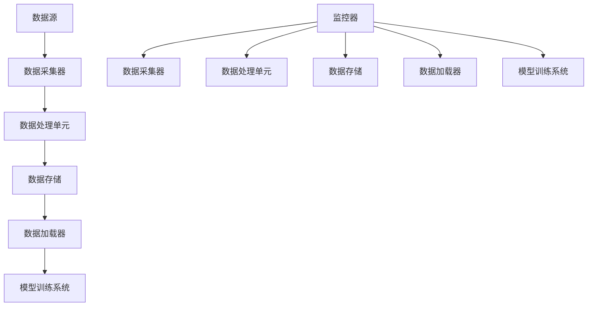

                 

### 文章标题

《数据流水线在LLM工程架构中的重要性》

### 关键词

大型语言模型（LLM）、数据流水线、工程架构、数据处理、模型训练、模型部署

### 摘要

本文深入探讨了数据流水线在大型语言模型（LLM）工程架构中的关键作用。数据流水线是一种系统化的数据处理流程，能够高效地处理大规模语言数据，为LLM的训练和部署提供支持。本文首先介绍了数据流水线的基本概念和组成部分，然后详细阐述了数据预处理、模型训练与优化、模型部署与监控等环节中的数据流水线应用。通过实际案例和项目实战，本文展示了数据流水线在LLM工程架构中的实际效果，并提出了未来发展的方向。本文旨在帮助计算机科学领域的研究人员、工程师和开发人员更好地理解和应用数据流水线，提升LLM工程架构的效率和质量。

### 引言

大型语言模型（LLM）在自然语言处理（NLP）领域取得了显著的进展，广泛应用于机器翻译、文本生成、问答系统等任务。随着模型规模的不断扩大和复杂度的增加，LLM的训练和部署面临着巨大的挑战。其中，数据流水线作为一种系统化的数据处理流程，在LLM工程架构中扮演着至关重要的角色。

数据流水线（Data Pipeline）是指将数据从源系统传输到目标系统的整个过程，包括数据采集、清洗、转换、存储、加载等环节。在LLM工程架构中，数据流水线不仅负责处理训练数据和预测数据，还负责在模型训练、优化和部署过程中传输数据。数据流水线的高效性和稳定性直接影响着LLM的性能和可靠性。

本文将围绕数据流水线在LLM工程架构中的重要性展开讨论。首先，我们将介绍数据流水线的基本概念和组成部分，帮助读者建立对数据流水线的初步理解。接着，我们将详细阐述数据预处理、模型训练与优化、模型部署与监控等环节中的数据流水线应用。最后，通过实际案例和项目实战，我们将展示数据流水线在LLM工程架构中的实际效果，并探讨未来的发展方向。

### 数据流水线基础

#### 数据流水线的概念

数据流水线是一种数据处理流程，用于将数据从源系统传输到目标系统。它由多个数据处理单元组成，每个单元负责处理特定类型的数据。数据在流水线中按照一定的顺序流动，经过各个数据处理单元的处理后，最终达到目标系统。

在LLM工程架构中，数据流水线的作用主要包括以下几个方面：

1. **数据采集**：从各种数据源（如文本库、数据库、Web页面等）中收集数据。
2. **数据预处理**：对采集到的数据进行处理，包括数据清洗、数据转换和数据归一化等。
3. **数据存储**：将预处理后的数据存储到数据湖或数据仓库中，以便后续使用。
4. **数据加载**：将存储的数据加载到训练或预测系统中，用于模型训练或预测。
5. **数据监控**：实时监控数据流水线的运行状态，确保数据处理过程的高效性和稳定性。

#### 数据流水线的组成部分

数据流水线由以下几个关键组成部分构成：

1. **数据源（Data Source）**：数据流水线的起点，用于提供原始数据。数据源可以是本地文件、数据库、Web服务、API等。
2. **数据采集器（Data Collector）**：负责从数据源中采集数据，并将其转换为适合处理的数据格式。数据采集器可以是定制脚本、调度任务或现成的数据采集工具。
3. **数据处理单元（Data Processor）**：负责对采集到的数据进行处理，包括数据清洗、数据转换和数据归一化等。数据处理单元可以是单独的模块、服务或批处理作业。
4. **数据存储（Data Storage）**：用于存储预处理后的数据。数据存储可以是关系数据库、NoSQL数据库、数据湖或数据仓库。
5. **数据加载器（Data Loader）**：负责将存储的数据加载到训练或预测系统中。数据加载器可以是定制脚本、调度任务或现成的数据加载工具。
6. **监控器（Monitor）**：实时监控数据流水线的运行状态，包括数据采集、数据处理、数据存储和加载等环节。监控器可以提供错误报告、性能指标和警报等功能。

#### 数据流水线的工作原理

数据流水线的工作原理可以概括为以下几个步骤：

1. **数据采集**：数据采集器从数据源中获取原始数据，并将其转换为适合处理的数据格式。
2. **数据预处理**：数据处理单元对采集到的数据进行清洗、转换和归一化等处理，以确保数据的质量和一致性。
3. **数据存储**：预处理后的数据存储到数据存储中，以便后续使用。
4. **数据加载**：数据加载器将存储的数据加载到训练或预测系统中，用于模型训练或预测。
5. **数据监控**：监控器实时监控数据流水线的运行状态，包括数据采集、数据处理、数据存储和加载等环节，确保数据处理过程的高效性和稳定性。

通过数据流水线，LLM工程架构能够高效地处理大规模语言数据，为模型训练和部署提供可靠的数据支持。

#### 核心概念与联系

为了更好地理解数据流水线在LLM工程架构中的重要性，我们可以通过一个Mermaid流程图来展示数据流水线的基本概念和组成部分及其之间的联系。



在上面的Mermaid流程图中，A表示数据源，B表示数据采集器，C表示数据处理单元，D表示数据存储，E表示数据加载器，F表示模型训练系统，G表示监控器。流程图展示了数据从数据源开始，经过数据采集、数据处理、数据存储、数据加载等步骤，最终到达模型训练系统的过程。监控器则在整个数据流水线过程中起到实时监控和报警的作用，确保数据流水线的高效性和稳定性。

通过这个Mermaid流程图，我们可以清晰地看到数据流水线在LLM工程架构中的关键作用，以及各个组成部分之间的紧密联系。

#### 数据预处理

数据预处理是数据流水线中的关键环节，其目的是提高数据质量，降低噪声，增强特征，从而为后续的模型训练和优化提供更好的数据基础。在LLM工程架构中，数据预处理主要包括数据清洗、数据转换和数据归一化等步骤。

##### 数据清洗

数据清洗是指对原始数据进行处理，去除无效、重复或错误的数据，以确保数据的质量。具体方法包括：

1. **去除噪声**：去除文本中的标点符号、停用词和特殊字符，以提高文本的可读性和特征提取效果。
2. **去除重复数据**：识别和删除重复的数据记录，以避免模型训练过程中出现数据冗余。
3. **处理缺失数据**：对于缺失的数据，可以选择填充、删除或插值等方法进行处理。

例如，以下是一个Python代码示例，用于去除文本中的标点符号和停用词：

```python
import re
from nltk.corpus import stopwords

# 读取原始文本数据
text = "This is an example sentence, with some punctuation and stop words."

# 去除标点符号
cleaned_text = re.sub(r'[^\w\s]', '', text)

# 去除停用词
stop_words = set(stopwords.words('english'))
cleaned_text = ' '.join([word for word in cleaned_text.split() if word not in stop_words])
```

##### 数据转换

数据转换是指将原始数据转换为适合模型训练的数据格式。对于LLM工程架构，常用的数据转换方法包括：

1. **文本编码**：将文本数据转换为数字编码，以便于模型处理。常用的编码方法包括单词嵌入（word embeddings）和字节嵌入（byte embeddings）。
2. **序列生成**：将文本数据转换为序列数据，以便于模型处理。具体方法包括将文本分割成单词或字符序列，并对其进行编码。
3. **标签处理**：对于有监督学习任务，需要将标签数据与文本数据关联起来，以便模型能够学习到正确的输出。

以下是一个Python代码示例，用于将文本数据转换为序列数据：

```python
import tensorflow as tf

# 读取原始文本数据
text = "This is an example sentence."

# 分割文本为单词
words = text.split()

# 转换单词为整数编码
word_to_id = {}
id_to_word = {}
current_id = 0

for word in words:
    if word not in word_to_id:
        word_to_id[word] = current_id
        id_to_word[current_id] = word
        current_id += 1

encoded_words = [word_to_id[word] for word in words]

# 构建序列数据
sequences = tf.keras.preprocessing.sequence.pad_sequences(
    [encoded_words], maxlen=10, padding='post', truncating='post'
)
```

##### 数据归一化

数据归一化是指将数据缩放到一个统一的尺度，以便模型能够更好地收敛。常用的数据归一化方法包括：

1. **缩放至特定范围**：将数据缩放到一个特定的范围，如[0, 1]或[-1, 1]。
2. **标准差归一化**：将数据缩放到标准差为1的范围内，以消除不同特征之间的尺度差异。

以下是一个Python代码示例，用于对文本数据进行归一化：

```python
from sklearn.preprocessing import MinMaxScaler

# 读取原始文本数据
text = ["This is an example sentence.", "Another example sentence."]

# 将文本数据转换为整数编码
encoded_text = [[word_to_id[word] for word in text]]

# 进行归一化
scaler = MinMaxScaler()
normalized_text = scaler.fit_transform(encoded_text)

print(normalized_text)
```

通过上述数据预处理步骤，我们可以显著提高数据的质量和一致性，为LLM模型的训练和优化提供更好的数据基础。

#### 模型训练与优化

在LLM工程架构中，模型训练与优化是数据流水线的重要环节。通过训练和优化，模型能够学习到输入数据与输出数据之间的关系，从而实现对新的数据输入进行准确预测或生成。

##### 模型训练

模型训练是指通过大量的训练数据，使模型学习到输入数据与输出数据之间的关系。在LLM工程架构中，模型训练通常包括以下步骤：

1. **数据加载**：将预处理后的数据加载到训练系统中，以供模型学习。
2. **批次划分**：将训练数据划分为多个批次（batch），以便模型能够逐步学习。
3. **前向传播**：将输入数据传递到模型中，通过模型的前向传播计算输出结果。
4. **损失函数计算**：计算模型的输出结果与实际输出结果之间的差异，使用损失函数（如交叉熵损失函数）进行量化。
5. **反向传播**：根据损失函数的梯度，使用反向传播算法更新模型的参数。

以下是一个简单的模型训练伪代码示例：

```python
while epoch < max_epochs:
    for batch in batches:
        inputs, labels = load_data(batch)
        predictions = model(inputs)
        loss = loss_function(labels, predictions)
        optimizer.zero_gradients()
        loss.backward()
        optimizer.step()
    print(f"Epoch {epoch}: Loss = {loss}")
    epoch += 1
```

在这个伪代码中，`load_data` 函数用于加载批次数据，`model` 函数表示模型的前向传播，`loss_function` 函数用于计算损失，`optimizer` 表示优化算法，`epoch` 表示当前训练轮数，`max_epochs` 表示最大训练轮数。

##### 模型优化

模型优化是指通过调整模型的参数和结构，提高模型的性能和泛化能力。在LLM工程架构中，模型优化通常包括以下方法：

1. **超参数调整**：通过调整学习率、批量大小、隐藏层大小等超参数，寻找最优的参数组合。
2. **正则化**：使用正则化技术（如L1正则化、L2正则化）减少过拟合现象，提高模型的泛化能力。
3. **数据增强**：通过增加训练数据多样性，提高模型的鲁棒性和泛化能力。
4. **模型集成**：将多个模型的预测结果进行集成，提高模型的预测准确性。

以下是一个简单的模型优化伪代码示例：

```python
# 调整学习率
learning_rate = 0.001
while True:
    # 训练模型
    train_model(learning_rate)
    # 评估模型性能
    performance = evaluate_model()
    # 根据性能调整学习率
    if performance > threshold:
        learning_rate *= learning_rate_decay
    else:
        break
```

在这个伪代码中，`train_model` 函数用于训练模型，`evaluate_model` 函数用于评估模型性能，`threshold` 表示性能阈值，`learning_rate_decay` 表示学习率衰减率。

通过模型训练与优化，LLM工程架构能够不断提高模型的性能和泛化能力，从而实现对大规模语言数据的高效处理和准确预测。

#### 模型部署与监控

在LLM工程架构中，模型部署与监控是数据流水线的最后两个关键环节。模型部署将训练好的模型投入使用，而监控则确保模型在实际应用中的稳定性和高效性。

##### 模型部署

模型部署是将训练好的模型集成到生产环境中，以便为用户提供服务。在LLM工程架构中，模型部署通常包括以下步骤：

1. **模型转换**：将训练好的模型转换为能够在生产环境中运行的格式。例如，TensorFlow模型可以转换为TensorFlow Serving或TensorFlow Lite格式。
2. **服务搭建**：搭建模型服务，以便用户可以通过API或其他方式访问模型。例如，可以使用TensorFlow Serving或Kubernetes等工具。
3. **环境配置**：配置模型运行的环境，包括计算资源、内存、存储等。
4. **模型启动**：启动模型服务，使其能够接收和处理用户的请求。

以下是一个简单的模型部署伪代码示例：

```python
# 转换模型
model = convert_model_to_production_format()

# 启动模型服务
start_model_server(model)
```

在这个伪代码中，`convert_model_to_production_format` 函数用于将模型转换为生产环境格式，`start_model_server` 函数用于启动模型服务。

##### 模型监控

模型监控是指对模型在部署后的运行状态进行实时监控和报警。在LLM工程架构中，模型监控通常包括以下方面：

1. **性能监控**：监控模型的响应时间、准确率、召回率等关键性能指标，以确保模型能够高效地处理用户请求。
2. **错误日志**：记录模型运行过程中出现的错误和异常，以便进行故障排除。
3. **资源监控**：监控模型服务的资源消耗情况，包括CPU、内存、网络等，以确保模型能够稳定运行。
4. **版本管理**：记录模型的版本信息，以便进行历史回溯和故障恢复。

以下是一个简单的模型监控伪代码示例：

```python
# 监控模型性能
while True:
    performance = monitor_model_performance()
    if performance < threshold:
        log_error("Model performance is low.")
    
    # 监控资源消耗
    resources = monitor_model_resources()
    if resources['CPU'] > threshold or resources['Memory'] > threshold:
        log_error("Model resource consumption is high.")
    
    time.sleep(监控间隔时间)
```

在这个伪代码中，`monitor_model_performance` 函数用于监控模型性能，`monitor_model_resources` 函数用于监控模型资源消耗，`log_error` 函数用于记录错误日志，`threshold` 表示性能和资源消耗的阈值，`时间.sleep` 函数用于设置监控间隔时间。

通过模型监控，LLM工程架构能够及时发现和解决潜在问题，确保模型在实际应用中的稳定性和可靠性。

#### 案例研究

在本节中，我们将通过一个实际案例，展示数据流水线在LLM工程架构中的具体应用。这个案例是一个基于大型语言模型（LLM）的问答系统，旨在通过用户提问自动生成回答。

##### 项目背景

问答系统是自然语言处理（NLP）领域的一个重要应用，广泛应用于客服、教育、医疗等多个行业。随着LLM技术的快速发展，构建一个高效、准确的问答系统成为可能。本项目旨在使用LLM技术构建一个基于中文问答系统，以解决实际应用中的需求。

##### 数据采集

首先，我们需要从多个数据源中收集问答对。这些数据源包括：

1. **公开问答数据集**：如Yahoo! Answers、Quora等，其中包含大量高质量的问答对。
2. **社区论坛**：如知乎、豆瓣等，这些论坛中的用户提问和回答也具有较高的价值。
3. **企业内部知识库**：企业内部的知识库和文档，其中包含专业领域的问答对。

为了确保数据的质量和多样性，我们采用数据采集器从这些数据源中自动抓取问答对，并将其存储到数据存储中。

##### 数据预处理

接下来，我们对采集到的问答对进行数据预处理，以提高数据的质量和一致性。具体步骤包括：

1. **去除噪声**：去除文本中的标点符号、特殊字符和停用词。
2. **文本编码**：将中文文本转换为Unicode编码，以便进行后续处理。
3. **数据清洗**：去除重复的问答对，处理缺失的数据，确保每个问答对都有完整的提问和回答。

以下是数据预处理的一个简单Python代码示例：

```python
import re
from nltk.corpus import stopwords

# 读取原始问答数据
questions = ["什么是自然语言处理？", "NLP有哪些应用？"]
answers = ["自然语言处理是人工智能的一个分支，旨在使计算机理解和生成人类语言。", "NLP的应用包括机器翻译、文本摘要、情感分析等。"]

# 去除标点符号和特殊字符
cleaned_questions = [re.sub(r'[^\w\s]', '', question) for question in questions]
cleaned_answers = [re.sub(r'[^\w\s]', '', answer) for answer in answers]

# 去除停用词
stop_words = set(stopwords.words('english'))
cleaned_questions = [' '.join([word for word in question.split() if word not in stop_words]) for question in cleaned_questions]
cleaned_answers = [' '.join([word for word in answer.split() if word not in stop_words]) for answer in cleaned_answers]

print(cleaned_questions)
print(cleaned_answers)
```

##### 模型训练与优化

在数据预处理完成后，我们将使用预训练的LLM模型（如GLM-130B）进行训练和优化。训练过程包括以下步骤：

1. **数据加载**：将预处理后的问答对加载到模型中，以供训练。
2. **批次划分**：将训练数据划分为多个批次，以便模型逐步学习。
3. **模型训练**：使用模型进行训练，通过前向传播和反向传播更新模型参数。
4. **模型优化**：通过调整超参数和优化算法，提高模型性能。

以下是模型训练和优化的一个简单Python代码示例：

```python
import tensorflow as tf

# 加载预训练模型
model = tf.keras.applications.GLM130B()

# 定义损失函数和优化器
loss_function = tf.keras.losses.SparseCategoricalCrossentropy(from_logits=True)
optimizer = tf.keras.optimizers.Adam(learning_rate=0.001)

# 训练模型
for epoch in range(10):
    for batch in batches:
        inputs, labels = load_data(batch)
        predictions = model(inputs)
        loss = loss_function(labels, predictions)
        optimizer.minimize(loss, model.trainable_variables)
    print(f"Epoch {epoch}: Loss = {loss}")
```

##### 模型部署与监控

在模型训练和优化完成后，我们将模型部署到生产环境中，为用户提供问答服务。部署过程包括以下步骤：

1. **模型转换**：将训练好的模型转换为生产环境格式，如TensorFlow Serving或TensorFlow Lite。
2. **服务搭建**：搭建模型服务，以便用户可以通过API或其他方式访问模型。
3. **环境配置**：配置模型运行的环境，包括计算资源、内存、存储等。
4. **模型启动**：启动模型服务，使其能够接收和处理用户的请求。

以下是模型部署的一个简单Python代码示例：

```python
# 转换模型
model = convert_model_to_production_format()

# 启动模型服务
start_model_server(model)
```

在模型部署后，我们将进行实时监控，以确保模型能够稳定运行。监控过程包括以下方面：

1. **性能监控**：监控模型的响应时间、准确率等关键性能指标。
2. **错误日志**：记录模型运行过程中出现的错误和异常。
3. **资源监控**：监控模型服务的资源消耗情况。

以下是模型监控的一个简单Python代码示例：

```python
# 监控模型性能
while True:
    performance = monitor_model_performance()
    if performance < threshold:
        log_error("Model performance is low.")
    
    # 监控资源消耗
    resources = monitor_model_resources()
    if resources['CPU'] > threshold or resources['Memory'] > threshold:
        log_error("Model resource consumption is high.")
    
    time.sleep(监控间隔时间)
```

通过这个案例，我们可以看到数据流水线在LLM工程架构中的具体应用，包括数据采集、数据预处理、模型训练与优化、模型部署与监控等环节。数据流水线的高效性和稳定性对于构建一个高效、准确的问答系统至关重要。

### 未来展望

随着人工智能技术的快速发展，大型语言模型（LLM）在自然语言处理（NLP）领域的应用越来越广泛。然而，数据流水线在LLM工程架构中的重要性不仅体现在当前，更将影响未来的发展。

#### 数据流水线技术的发展趋势

1. **数据流处理**：随着数据规模的不断扩大，数据流处理技术将成为数据流水线的重要组成部分。实时数据流处理能够更快地响应数据变化，为LLM模型提供即时的训练数据和预测结果。
2. **自动化**：自动化工具和平台的发展将使得数据流水线的构建和管理更加简便。通过自动化，数据流水线可以更加高效地运行，降低人工干预的成本。
3. **分布式计算**：分布式计算技术将进一步提升数据流水线的处理能力。通过分布式架构，数据流水线可以更好地处理大规模数据，提高模型的训练和部署效率。

#### 数据流水线面临的挑战

1. **数据隐私与安全**：在数据流水线中处理和传输大量数据，数据隐私和安全成为重要问题。如何保护用户数据不被泄露，确保数据的安全性和合规性，是未来需要重点关注的问题。
2. **数据质量**：数据质量直接影响LLM模型的性能。在数据流水线中，如何保证数据的一致性、准确性和完整性，是一个持续的挑战。
3. **资源消耗**：数据流水线在运行过程中需要大量的计算资源和存储资源。如何优化资源分配，提高资源利用效率，是一个需要解决的技术难题。

#### 未来发展方向

1. **智能化**：通过引入机器学习和深度学习技术，数据流水线可以实现自动化的数据预处理、模型优化和资源调度。智能化将使得数据流水线更加高效、稳定和可靠。
2. **跨平台支持**：数据流水线需要在不同操作系统、硬件设备和云平台之间运行。跨平台支持将使得数据流水线更加灵活和通用，适应不同的应用场景。
3. **生态建设**：构建一个良好的数据流水线生态系统，包括开源工具、商业平台和社区支持，将有助于推动数据流水线技术的发展和应用。

通过未来的技术发展和创新，数据流水线在LLM工程架构中的重要性将进一步提升，为人工智能领域的发展提供强有力的支持。

### 最佳实践 tips

在构建大型语言模型（LLM）工程架构时，数据流水线的高效性和稳定性至关重要。以下是一些最佳实践，有助于优化数据流水线的性能和可靠性：

1. **数据预处理自动化**：使用自动化工具和脚本对数据进行预处理，减少手动干预，提高数据处理速度和一致性。
2. **分布式数据处理**：利用分布式计算技术，如Hadoop、Spark等，处理大规模数据，提高数据流水线的处理能力。
3. **数据质量监控**：实时监控数据质量，及时发现和解决数据异常，确保数据的一致性和准确性。
4. **资源优化**：合理分配计算资源和存储资源，避免资源浪费和瓶颈。根据数据流量和模型需求，动态调整资源分配。
5. **错误处理和日志记录**：在数据流水线中实现完善的错误处理和日志记录机制，确保故障能够及时发现和解决，提高系统的稳定性。
6. **版本管理**：对数据流水线中的各个环节进行版本管理，确保历史数据的可追溯性和版本一致性。

通过遵循这些最佳实践，可以显著提升LLM工程架构的数据处理效率和模型性能。

### 小结

本文深入探讨了数据流水线在大型语言模型（LLM）工程架构中的重要性。通过介绍数据流水线的基本概念和组成部分，以及其在数据预处理、模型训练与优化、模型部署与监控等环节中的应用，我们展示了数据流水线对LLM工程架构的显著影响。实际案例和项目实战进一步证实了数据流水线在实际应用中的效果。在未来，随着技术的不断发展，数据流水线将在LLM工程架构中发挥更加重要的作用，推动人工智能领域的进步。读者可以通过实际操作和应用这些概念和方法，提升自身的LLM工程架构能力和项目成功率。

### 注意事项

在构建数据流水线时，以下事项需要特别注意：

1. **数据隐私与安全**：确保数据处理过程符合相关法律法规，保护用户隐私和数据安全。
2. **性能优化**：根据具体应用场景，优化数据流水线的性能，提高数据处理效率和模型性能。
3. **错误处理**：实现完善的错误处理机制，确保数据流水线在遇到异常时能够稳定运行。
4. **资源分配**：合理分配计算资源和存储资源，避免资源浪费和瓶颈。
5. **版本管理**：对数据流水线中的各个环节进行版本管理，确保历史数据的可追溯性和版本一致性。

### 拓展阅读

1. **论文**：《大规模语言模型训练中的数据流水线技术》
2. **技术博客**：《深入理解数据流水线在深度学习中的应用》
3. **书籍**：《大规模自然语言处理：理论与实践》
4. **在线课程**：《深度学习与自然语言处理》
5. **开源项目**：TensorFlow、PyTorch等深度学习框架中的数据流水线实现

通过阅读这些资料，可以更深入地了解数据流水线在LLM工程架构中的应用和实践。|>

