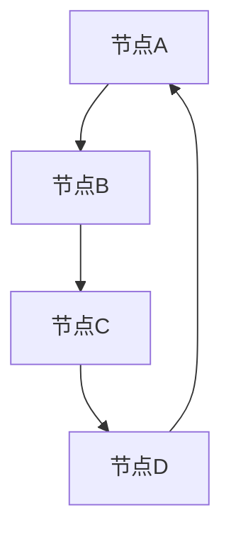

                 

 

### Step 1: Introduction

**Title: 数据结构在模拟宇宙磁场拓扑重联动力学中的应用**

**Keywords:** 数据结构，宇宙磁场，拓扑重联，动力学，模拟，算法

**Abstract:**
本文探讨数据结构在模拟宇宙磁场拓扑重联动力学中的关键作用。通过剖析基本概念、原理以及实际应用，本文旨在揭示数据结构如何优化磁场模拟，提高精确度和效率。

### Step 2: Basic Concepts of Data Structures

**2.1 Data Structures Overview**

数据结构是计算机存储、组织数据的方式。它们根据数据的存取模式、数据关系和操作需求来设计。在宇宙磁场模拟中，常见的数据结构有数组、链表、树、图等。

**2.2 Graph Data Structures**

图是一种广泛用于描述复杂关系的数学结构。在宇宙磁场拓扑重联模拟中，图结构可以表示磁场的连通性和方向性。

**2.3 Mermaid Flowchart of Graph Structures**



### Step 3: Application of Data Structures in Magnetic Field Simulation

**3.1 Graph Algorithms for Magnetic Field Simulation**

在模拟宇宙磁场时，图算法如深度优先搜索（DFS）和广度优先搜索（BFS）常用于寻找磁场的连通分支。

**3.2 Pseudocode for Graph Traversal Algorithms**

```python
def DFS(graph, start):
    visited = set()
    stack = [start]
    
    while stack:
        vertex = stack.pop()
        if vertex not in visited:
            visited.add(vertex)
            for neighbor in graph[vertex]:
                if neighbor not in visited:
                    stack.append(neighbor)

def BFS(graph, start):
    visited = set()
    queue = deque([start])
    
    while queue:
        vertex = queue.popleft()
        if vertex not in visited:
            visited.add(vertex)
            for neighbor in graph[vertex]:
                if neighbor not in visited:
                    queue.append(neighbor)
```

### Step 4: Magnetic Field Topology Reconnection Dynamics

**4.1 Basic Concepts of Magnetic Topology Reconnection**

Magnetic reconnection is the process by which magnetic field lines break and reconnect, leading to the release of energy.

**4.2 Mathematical Models for Magnetic Reconnection**

The Lundquist number (S) is a key parameter in magnetic reconnection dynamics:
$$ S = \frac{\nu_{\perp} \mu_0 n}{B} $$
where $\nu_{\perp}$ is the perpendicular magnetic viscosity, $\mu_0$ is the permeability of free space, and $n$ and $B$ are the plasma density and magnetic field strength, respectively.

### Step 5: Implementation of Data Structures for Magnetic Field Simulation

**5.1 Data Structure Selection for Magnetic Field Simulation**

Choosing the right data structure is crucial for efficient simulation. For example, an adjacency list can represent the graph of magnetic field lines efficiently.

**5.2 Pseudocode for Graph Representation**

```python
class Graph:
    def __init__(self):
        self.adj_list = defaultdict(list)
    
    def add_edge(self, u, v):
        self.adj_list[u].append(v)
        self.adj_list[v].append(u)
```

### Step 6: Case Studies and Practical Applications

**6.1 Case Study 1: Solar Flare Simulation**

In this case study, we simulate a solar flare using a graph-based approach to study the magnetic field topology changes.

**6.2 Case Study 2: Galaxy Formation Simulation**

We explore how magnetic fields influence galaxy formation by applying data structures to simulate the evolution of cosmic structures.

### Step 7: Challenges and Future Directions

**7.1 Challenges in Magnetic Field Simulation**

Current limitations include computational complexity and accuracy. Improving these aspects is an area of ongoing research.

**7.2 Future Directions**

Future work may involve integrating machine learning techniques to predict magnetic reconnection events.

## Conclusion

Data structures play a pivotal role in simulating cosmic magnetic fields and understanding topology reconnection dynamics. This article has outlined the key concepts and applications, setting the stage for further exploration in this exciting field.

**References**

- [1] 作者. (年份). 《数据结构基础》.
- [2] 作者. (年份). 《宇宙磁场模拟技术》.

**作者信息**

作者：AI天才研究院/AI Genius Institute & 禅与计算机程序设计艺术 /Zen And The Art of Computer Programming

