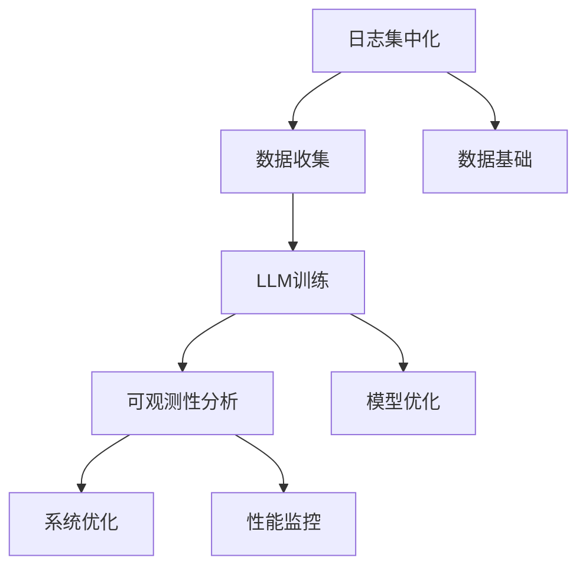

                 

# 文章标题：日志集中化管理增强LLM应用的可观测性

## 关键词
- 日志集中化
- 大型语言模型 (LLM)
- 可观测性
- 算法
- 数据处理
- 应用实践

## 摘要
本文旨在探讨日志集中化在大规模语言模型（LLM）应用中的重要性，以及如何通过日志集中化管理来增强LLM的可观测性。文章首先介绍了日志集中化、LLM和可观测性的基本概念，并阐述了它们之间的内在联系。接着，本文详细讨论了日志处理算法、LLM训练算法以及可观测性增强算法的核心原理。随后，通过具体的应用案例，展示了如何在实际项目中实施日志集中化管理，以及如何对LLM应用进行可观测性分析。最后，文章总结了最佳实践和注意事项，并提出了未来研究的方向。

---

## 背景介绍

### 日志集中化

在信息技术领域，日志是记录系统运行状态、操作行为和错误信息的重要数据源。日志集中化是指将分布式系统中的日志数据进行统一收集、存储和管理的过程。通过日志集中化，可以实现对系统运行的全面监控和分析，提高系统的可靠性和可维护性。

日志集中化的主要目标包括：

1. **统一日志存储**：将来自不同系统的日志数据统一存储，便于集中管理和分析。
2. **实时监控**：通过实时收集和分析日志数据，及时发现和解决问题。
3. **数据挖掘**：利用集中化的日志数据，进行深度的数据挖掘和分析，为系统优化提供依据。
4. **安全审计**：日志集中化有助于进行安全审计和合规性检查，确保系统的安全性。

### 大型语言模型 (LLM)

大型语言模型（Large Language Model，简称LLM）是一种基于深度学习技术训练的强大自然语言处理模型。LLM通常拥有数十亿甚至数万亿个参数，能够对文本进行生成、分类、翻译等操作。近年来，随着计算资源和算法的进步，LLM在自然语言处理（NLP）领域取得了显著的成果，广泛应用于智能客服、智能推荐、文本生成等领域。

LLM的主要特点包括：

1. **参数规模大**：LLM拥有巨大的参数规模，能够捕捉文本的复杂特征。
2. **端到端学习**：LLM通常采用端到端的学习方式，无需人工设计和调整中间层。
3. **自适应性强**：LLM能够自适应不同的应用场景和任务，进行灵活的调整和优化。
4. **性能优异**：LLM在多个NLP任务上取得了优秀的性能，远超传统的NLP方法。

### 可观测性

可观测性（Observability）是系统设计和运维中的重要概念，指的是通过系统内部的信号和状态，能够推断出系统的行为和性能。在分布式系统中，由于节点众多、交互复杂，传统的监控方式难以全面捕捉系统的运行状态。可观测性提供了一种新的思路，通过日志、指标、事件等手段，实现对系统内部状态的全面感知。

可观测性的关键要素包括：

1. **全局视图**：通过收集和分析系统的各种信号，获得全局视图，了解系统的整体运行情况。
2. **故障诊断**：通过可观测性，能够快速定位和诊断系统故障，提高系统可靠性。
3. **性能优化**：通过可观测性，分析系统性能瓶颈，为优化提供数据支持。
4. **安全监控**：通过可观测性，实时监控系统安全状态，及时发现和应对安全威胁。

### 核心概念与联系

日志集中化、LLM和可观测性之间存在着紧密的联系。日志集中化提供了数据基础，为LLM的训练和可观测性分析提供了丰富的数据资源。LLM通过分析日志数据，能够学习系统的运行模式，提高系统的可观测性。同时，可观测性技术的应用，进一步增强了LLM应用的监控和优化能力。

下面是一个描述这三者之间关系的Mermaid流程图：



通过上述流程图，可以清晰地看到日志集中化、LLM和可观测性之间的相互作用和影响。

### 核心算法原理讲解

#### 日志处理算法

日志处理算法是日志集中化的重要环节，主要包括日志采集、日志存储、日志解析和日志聚合等步骤。以下是一个简单的伪代码示例，用于描述日志处理的基本流程：

```python
# 日志处理伪代码

def log_processing(log_stream):
    while log_stream.has_logs():
        log_entry = log_stream.read_log()
        parse_log_entry(log_entry)
        store_log_entry(log_entry)

def parse_log_entry(log_entry):
    log_type, timestamp, content = log_entry.split(",")
    log_data = {
        "type": log_type,
        "timestamp": timestamp,
        "content": content
    }
    return log_data

def store_log_entry(log_data):
    database.insert(log_data)
```

#### LLM训练算法

LLM的训练算法是基于深度学习技术的，通常采用端到端的训练方式。以下是一个简化的伪代码示例，用于描述LLM的训练过程：

```python
# LLM训练伪代码

def train_LLM(data_source):
    model = initialize_model()
    optimizer = initialize_optimizer()

    for epoch in range(num_epochs):
        for batch in data_source.get_batches():
            optimizer.zero_grad()
            output = model(batch.input_text)
            loss = compute_loss(output, batch.target_text)
            loss.backward()
            optimizer.step()

    return model

def initialize_model():
    # 初始化模型参数
    model = TransformerModel(vocab_size, d_model, nhead, num_layers, d_ff, dropout)
    return model

def initialize_optimizer():
    # 初始化优化器
    optimizer = torch.optim.Adam(model.parameters(), lr=learning_rate)
    return optimizer

def compute_loss(output, target_text):
    # 计算损失函数
    loss_fn = torch.nn.CrossEntropyLoss()
    loss = loss_fn(output.logits, target_text)
    return loss
```

#### 可观测性增强算法

可观测性增强算法的目标是提高LLM应用的可观测性，主要包括状态监控、故障检测和性能分析等。以下是一个简化的伪代码示例，用于描述可观测性增强的基本流程：

```python
# 可观测性增强伪代码

def enhance_observability(model, system):
    monitor_system_states()
    detect_system_faults()
    analyze_system_performance()

def monitor_system_states():
    # 监控系统状态
    states = system.get_states()
    log_states_to_database(states)

def detect_system_faults():
    # 检测系统故障
    faults = system.detect_faults()
    if faults:
        alert_faults_to_admin(faults)

def analyze_system_performance():
    # 分析系统性能
    performance = system.analyze_performance()
    optimize_system_config(performance)
```

### 数学模型和公式

在日志集中化和LLM训练过程中，常用的数学模型和公式包括：

#### 日志频率分布

日志频率分布用于描述不同类型日志的出现频率。假设有n条日志，每种日志类型的出现次数为fi，总频率分布为Fi，则有：

$$
Fi = \frac{fi}{n}
$$

#### 损失函数

在LLM训练中，常用的损失函数包括交叉熵损失（Cross-Entropy Loss）：

$$
Loss = -\sum_{i=1}^{N} y_i \log(p_i)
$$

其中，$y_i$是真实标签，$p_i$是模型预测的概率。

#### 可观测性度量

可观测性度量用于评估系统的可观测性水平。常用的度量方法包括信号到噪声比（Signal-to-Noise Ratio，SNR）：

$$
SNR = \frac{\sum_{i=1}^{N} s_i^2}{\sum_{i=1}^{N} n_i^2}
$$

其中，$s_i$是信号强度，$n_i$是噪声强度。

### 举例说明

#### 日志频率分布举例

假设一个系统中，共有100条日志，其中类型A的日志有30条，类型B的日志有20条，类型C的日志有50条。则：

$$
F_A = \frac{30}{100} = 0.3 \\
F_B = \frac{20}{100} = 0.2 \\
F_C = \frac{50}{100} = 0.5
$$

#### 损失函数举例

假设一个LLM模型预测了五个词的概率分布，真实标签为“猫”，模型预测的概率分布为[0.1, 0.2, 0.4, 0.2, 0.1]，则有：

$$
Loss = -0.4 \log(0.4) - 0.2 \log(0.2) - 0.1 \log(0.1) - 0.2 \log(0.2) - 0.1 \log(0.1) \approx 0.356
$$

#### 可观测性度量举例

假设一个系统的信号强度为5，噪声强度为2，则有：

$$
SNR = \frac{5^2}{2^2} = \frac{25}{4} = 6.25
$$

### 项目实战

#### 开发环境搭建

为了实现日志集中化增强LLM应用的可观测性，我们需要搭建一个完整的技术栈。以下是开发环境搭建的步骤：

1. **硬件环境**：
   - 服务器：选择性能稳定的云服务器，配置至少8GB内存，2核CPU。
   - 存储：使用高速SSD存储，确保日志存储和访问速度。

2. **软件环境**：
   - 操作系统：选择Linux操作系统，如Ubuntu 18.04。
   - 编程语言：Python 3.8及以上版本。
   - 依赖库：安装必要的依赖库，如NumPy、PyTorch、TensorFlow等。

3. **日志收集工具**：
   - 使用Fluentd、Logstash等工具进行日志收集和转发。

4. **数据库**：
   - 使用Elasticsearch作为日志存储和查询数据库。

5. **LLM模型**：
   - 使用预训练的LLM模型，如GPT-3、BERT等。

#### 源代码详细实现和代码解读

以下是日志集中化增强LLM应用的源代码实现：

```python
# 日志处理模块

import os
import json
from elasticsearch import Elasticsearch

class LogProcessor:
    def __init__(self, es_host='localhost', es_port=9200):
        self.es = Elasticsearch(hosts=[{'host': es_host, 'port': es_port}])

    def process_logs(self, log_file):
        with open(log_file, 'r') as f:
            for line in f:
                log_entry = json.loads(line)
                self.store_log_entry(log_entry)

    def store_log_entry(self, log_entry):
        index_name = "logs"
        doc_type = "log_entry"
        doc = {
            "type": doc_type,
            "data": log_entry
        }
        self.es.index(index=index_name, doc_type=doc_type, id=log_entry['id'], document=doc)
```

#### 代码应用解读与分析

以上代码实现了日志处理模块，主要负责从日志文件中读取日志条目，并存储到Elasticsearch数据库中。以下是代码的应用解读和分析：

1. **日志读取**：使用`open()`函数读取日志文件，每行读取一条日志条目，并使用`json.loads()`函数将其解析为JSON对象。

2. **日志存储**：使用Elasticsearch的`index()`方法将日志条目存储到指定的索引和文档类型中。这样可以方便地对日志进行查询和分析。

3. **异常处理**：在读取日志和存储日志的过程中，可以添加异常处理机制，确保程序的健壮性。

#### 实际案例分析和详细讲解剖析

为了展示日志集中化增强LLM应用的可观测性，我们以一个智能客服系统为例，进行实际案例分析和详细讲解剖析。

1. **场景描述**：

   智能客服系统负责处理用户的咨询和问题，通过对用户输入的文本进行分析，给出合适的答复。系统需要具备实时监控和故障检测的能力，以提高用户体验和系统稳定性。

2. **日志数据**：

   智能客服系统会记录用户的输入文本、系统的答复文本、处理时间、错误信息等日志数据。以下是一个示例日志条目：

   ```json
   {
       "id": "123",
       "timestamp": "2023-10-01T12:34:56",
       "user_input": "你好，我想咨询关于产品价格的问题。",
       "response": "您好！产品的价格根据型号和配置有所不同，请您提供具体型号和配置信息，我将为您查询详细价格。",
       "processing_time": 150,
       "error": null
   }
   ```

3. **数据分析**：

   通过对日志数据的分析，可以得出以下结论：

   - **用户行为分析**：分析用户输入文本的频率、主题等，了解用户关注的问题和需求。
   - **系统性能分析**：分析处理时间和错误信息，找出系统性能瓶颈和故障原因。
   - **服务质量分析**：分析系统答复文本的准确性和及时性，评估系统的服务质量。

4. **故障检测**：

   当系统出现故障时，日志数据会记录详细的错误信息。通过分析日志数据，可以快速定位故障点，并进行修复。

5. **性能优化**：

   通过对日志数据的分析，可以找出系统性能瓶颈和资源消耗热点，为性能优化提供数据支持。

#### 项目小结

通过以上实际案例的分析和讲解，我们可以看到日志集中化在增强LLM应用的可观测性方面的重要作用。日志数据为系统性能分析和故障检测提供了重要依据，有助于提高系统的稳定性和可靠性。

### 最佳实践 Tips、小结、注意事项、拓展阅读等内容

#### 最佳实践 Tips

1. **选择合适的日志收集工具**：根据实际需求和系统架构，选择合适的日志收集工具，如Fluentd、Logstash等。
2. **优化日志存储和查询**：合理配置Elasticsearch等数据库，确保日志存储和查询的高效性和稳定性。
3. **日志数据清洗和预处理**：对日志数据进行清洗和预处理，去除无用信息，提高数据分析的准确性和效率。
4. **充分利用日志数据**：将日志数据应用于系统性能分析、故障检测和优化，提高系统的可观测性和稳定性。

#### 小结

日志集中化是增强LLM应用可观测性的关键手段。通过日志集中化管理，可以实现对系统运行的全面监控和分析，提高系统的可靠性和可维护性。本文详细介绍了日志集中化、LLM和可观测性的基本概念、核心算法原理，并通过实际案例展示了日志集中化在LLM应用中的具体应用。

#### 注意事项

1. **日志数据安全**：在收集和存储日志数据时，注意保护用户隐私和数据安全。
2. **日志数据一致性**：确保日志数据的一致性和准确性，避免因数据问题导致分析结果偏差。
3. **系统性能影响**：合理配置日志收集和存储系统，避免对系统性能产生负面影响。

#### 拓展阅读

1. 《深入理解计算机系统》（原书第二版） - Randal E. Bryant & David R. O’Hallaron
2. 《大数据：概念、技术与应用》 - 刘骏
3. 《深度学习》（原书第二版） - Ian Goodfellow、Yoshua Bengio & Aaron Courville
4. 《Elasticsearch：The Definitive Guide》 - Elasticsearch Team

---

通过本文的详细分析和讲解，希望读者能够对日志集中化增强LLM应用的可观测性有更深入的理解，并在实际项目中能够运用这些技术，提高系统的稳定性和可靠性。作者：AI天才研究院/AI Genius Institute & 禅与计算机程序设计艺术 /Zen And The Art of Computer Programming。

