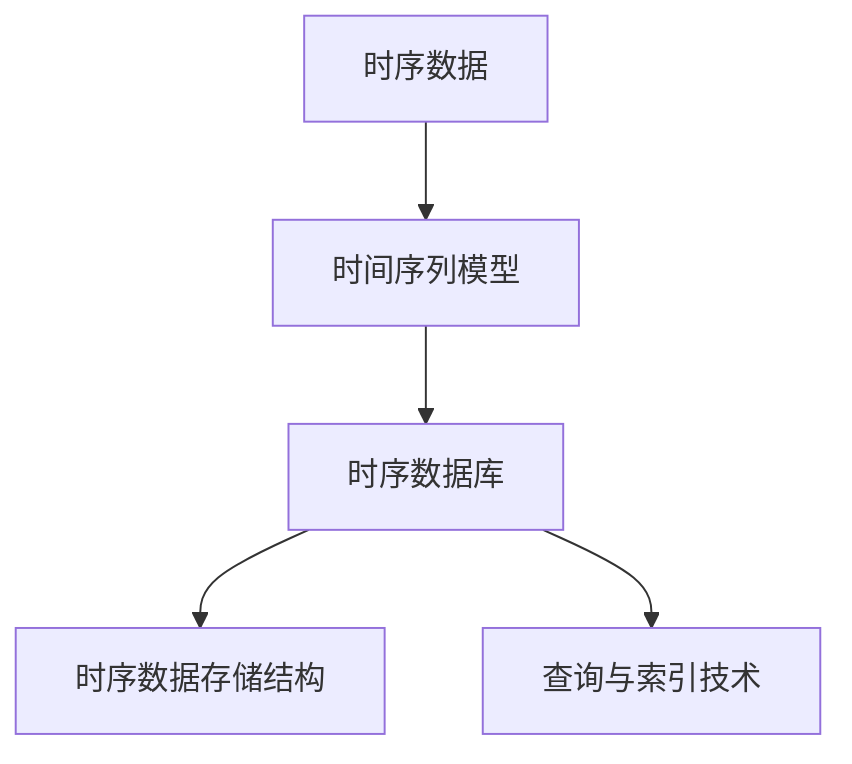

                 


### 背景介绍

随着人工智能技术的迅速发展，尤其是大型语言模型（LLM，Large Language Model）的崛起，我们进入了一个数据处理和信息处理的新时代。LLM作为一种先进的机器学习模型，能够理解和生成自然语言，广泛应用于聊天机器人、智能客服、自然语言处理、自动化写作等领域。然而，LLM的应用不仅仅局限于数据生成和推理，还包括对自身性能的持续监控和优化。

在LLM的应用过程中，监控数据起着至关重要的作用。这些监控数据包括训练过程中的性能指标、预测结果的准确度、系统资源使用情况等。通过对这些监控数据的存储、分析和优化，可以显著提升LLM的性能和稳定性，从而更好地满足实际应用需求。

然而，传统的数据库系统在处理时序数据时存在诸多挑战。时序数据的特点是数据量大、数据写入和查询频率高、数据更新频繁等，这给传统的数据库系统带来了性能和扩展性的压力。为了解决这些问题，我们需要专门设计用于处理时序数据的时序数据库（Time-Series Database，TSDB）。

时序数据库是一种专门为处理时序数据而设计的数据库系统，能够高效地存储、查询和分析时序数据。与传统的关系型数据库相比，时序数据库在数据存储结构、查询优化、索引技术等方面进行了专门的优化，以适应时序数据的特点。时序数据库的出现，为LLM应用的监控数据存储提供了有效的解决方案。

### 核心概念与联系

在深入探讨时序数据库之前，我们需要了解一些核心概念，以及它们之间的联系。

1. **时序数据（Time-Series Data）**：
   时序数据是指以时间为索引的数据序列，通常包含时间戳、指标值等。例如，股票价格、气温变化、服务器CPU利用率等都可以视为时序数据。

2. **时间序列模型（Time-Series Model）**：
   时间序列模型是一种用于分析时间序列数据的统计模型，能够预测未来的趋势或行为。常见的模型包括自回归模型（AR）、移动平均模型（MA）、自回归移动平均模型（ARMA）等。

3. **时序数据库（Time-Series Database，TSDB）**：
   时序数据库是一种专门用于存储和查询时序数据的数据库系统，具有高效的写入和查询性能，以及优化的数据存储结构。常见的时序数据库包括InfluxDB、Prometheus、TimescaleDB等。

4. **时序数据存储结构**：
   时序数据存储结构是时序数据库的核心，决定了数据的写入和查询效率。常见的存储结构包括按时间戳排序的数组、时间分区表、压缩数据等。

5. **查询与索引技术**：
   为了快速地查询时序数据，时序数据库使用了多种索引技术，如倒排索引、索引树、时间戳索引等。这些索引技术能够大幅提升查询速度，满足实时监控的需求。

以下是时序数据库的核心概念之间的联系架构 Mermaid 流程图：



### 核心算法原理讲解

在了解了时序数据库的基本概念后，我们需要深入探讨其核心算法原理，特别是如何通过索引优化技术来提升查询性能。

#### 索引优化技术

索引是数据库性能优化的关键，特别是在处理大量时序数据时。以下是一些常见的索引优化技术：

1. **倒排索引（Inverted Index）**：
   倒排索引是一种将数据索引反向存储的数据结构，它将文档中的单词映射到对应的文档编号。对于时序数据库，倒排索引可以快速定位特定时间范围的数据。

   **伪代码**：
   ```python
   def search(time_range):
       # 使用倒排索引快速查找指定时间范围的数据
       index = inverted_index[time_range]
       results = []
       for doc_id in index:
           result = read_document(doc_id)
           results.append(result)
       return results
   ```

2. **索引树（Index Tree）**：
   索引树是一种基于树的索引结构，如B树、B+树等。这些树结构能够有效地组织数据，提高查询效率。在时序数据库中，索引树可以用于快速定位时间点或时间范围。

   **伪代码**：
   ```python
   def query(time_range):
       # 使用索引树查找指定时间范围的数据
       node = root
       for time in time_range:
           node = node.search(time)
       return node.get_data()
   ```

3. **时间戳索引（Timestamp Index）**：
   时间戳索引是一种基于时间戳的索引结构，能够直接定位到特定时间点的数据。这种索引结构非常适合实时监控和查询。

   **伪代码**：
   ```python
   def get_data_at_timestamp(timestamp):
       # 使用时间戳索引获取特定时间点的数据
       index = timestamp_index[timestamp]
       return read_data(index)
   ```

#### 压缩算法

为了优化存储空间和查询性能，时序数据库还使用了多种压缩算法。以下是一些常用的压缩算法：

1. **差分编码（Difference Encoding）**：
   差分编码通过记录连续数据之间的差异来减少数据量。这种方法对于时间序列数据尤其有效，因为连续的时间点之间的差异往往较小。

   **伪代码**：
   ```python
   def encode_diff(data):
       result = []
       prev_value = data[0]
       for value in data[1:]:
           diff = value - prev_value
           result.append(diff)
           prev_value = value
       return result
   ```

2. **量化压缩（Quantization）**：
   量化压缩通过将数据值映射到较少的离散值来减少数据量。这种方法适用于对精度要求不高但数据量很大的情况。

   **伪代码**：
   ```python
   def quantize(data, num_levels):
       level_values = get_level_values(num_levels)
       result = []
       for value in data:
           level = find_level(value, level_values)
           result.append(level)
       return result
   ```

3. **块压缩（Block Compression）**：
   块压缩通过将连续的数据块压缩为一个整体来减少数据量。这种压缩方法可以有效地减少存储空间的占用。

   **伪代码**：
   ```python
   def compress_block(data_block):
       # 压缩连续的数据块
       compressed_data = block_compressor.compress(data_block)
       return compressed_data
   ```

#### 时间序列分析技术

时间序列分析是时序数据库的一个重要组成部分，它能够帮助我们理解和预测数据趋势。以下是一些常见的时间序列分析技术：

1. **自回归模型（AR，Autoregressive Model）**：
   自回归模型通过当前值与历史值的线性组合来预测未来值。这种模型适用于平稳时间序列。

   **数学模型**：
   $$X_t = c + \sum_{i=1}^{p} \phi_i X_{t-i} + \varepsilon_t$$
   其中，$X_t$ 是时间序列的当前值，$\phi_i$ 是自回归系数，$\varepsilon_t$ 是误差项。

2. **移动平均模型（MA，Moving Average Model）**：
   移动平均模型通过历史值的平均值来预测未来值。这种模型适用于非平稳时间序列。

   **数学模型**：
   $$X_t = \mu + \sum_{i=1}^{q} \theta_i \varepsilon_{t-i}$$
   其中，$X_t$ 是时间序列的当前值，$\theta_i$ 是移动平均系数，$\varepsilon_t$ 是误差项。

3. **自回归移动平均模型（ARMA，Autoregressive Moving Average Model）**：
   自回归移动平均模型结合了自回归模型和移动平均模型，适用于既有趋势又有季节性的时间序列。

   **数学模型**：
   $$X_t = c + \sum_{i=1}^{p} \phi_i X_{t-i} + \sum_{j=1}^{q} \theta_j \varepsilon_{t-j} + \varepsilon_t$$

### 数学模型和公式

在时序数据库优化中，数学模型和公式起着至关重要的作用。以下是一些关键的数学模型和公式，以及详细的讲解和举例说明。

#### 自回归模型（AR）

自回归模型是一种用于预测时间序列数据的方法，它基于历史数据来预测未来值。自回归模型的数学公式如下：

$$X_t = c + \sum_{i=1}^{p} \phi_i X_{t-i} + \varepsilon_t$$

其中，$X_t$ 表示时间序列的当前值，$c$ 是常数项，$\phi_i$ 是自回归系数，$X_{t-i}$ 是时间序列的历史值，$\varepsilon_t$ 是误差项。

**举例说明**：

假设我们有一个时间序列数据，如下所示：

$$X_1 = 10, X_2 = 12, X_3 = 14, X_4 = 16, X_5 = 18$$

我们希望使用自回归模型来预测 $X_6$。首先，我们需要确定自回归系数 $\phi_1$ 和 $\phi_2$：

$$X_2 = c + \phi_1 X_1 + \varepsilon_2$$
$$12 = c + \phi_1 \cdot 10 + \varepsilon_2$$

$$X_3 = c + \phi_1 X_2 + \phi_2 X_1 + \varepsilon_3$$
$$14 = c + \phi_1 \cdot 12 + \phi_2 \cdot 10 + \varepsilon_3$$

通过解这两个方程，我们可以得到：

$$c = 2, \phi_1 = 0.2, \phi_2 = 0.4$$

现在，我们可以使用这些系数来预测 $X_6$：

$$X_6 = 2 + 0.2 \cdot 18 + 0.4 \cdot 16 = 17.8$$

#### 移动平均模型（MA）

移动平均模型是一种通过历史值的平均值来预测未来值的方法。移动平均模型的数学公式如下：

$$X_t = \mu + \sum_{i=1}^{q} \theta_i \varepsilon_{t-i}$$

其中，$X_t$ 表示时间序列的当前值，$\mu$ 是移动平均值的均值，$\theta_i$ 是移动平均系数，$\varepsilon_t$ 是误差项。

**举例说明**：

假设我们有一个时间序列数据，如下所示：

$$X_1 = 10, X_2 = 12, X_3 = 14, X_4 = 16, X_5 = 18$$

我们希望使用移动平均模型来预测 $X_6$。首先，我们需要确定移动平均系数 $\theta_1$ 和 $\theta_2$：

$$X_2 = \mu + \theta_1 \varepsilon_1$$
$$12 = \mu + \theta_1 \cdot (12 - 10)$$

$$X_3 = \mu + \theta_1 \varepsilon_2 + \theta_2 \varepsilon_1$$
$$14 = \mu + \theta_1 \cdot (14 - 12) + \theta_2 \cdot (12 - 10)$$

通过解这两个方程，我们可以得到：

$$\mu = 12, \theta_1 = 0.5, \theta_2 = 0.5$$

现在，我们可以使用这些系数来预测 $X_6$：

$$X_6 = 12 + 0.5 \cdot (18 - 16) + 0.5 \cdot (16 - 14) = 13.5$$

#### 自回归移动平均模型（ARMA）

自回归移动平均模型结合了自回归模型和移动平均模型，适用于既有趋势又有季节性的时间序列。自回归移动平均模型的数学公式如下：

$$X_t = c + \sum_{i=1}^{p} \phi_i X_{t-i} + \sum_{j=1}^{q} \theta_j \varepsilon_{t-j} + \varepsilon_t$$

其中，$X_t$ 表示时间序列的当前值，$c$ 是常数项，$\phi_i$ 是自回归系数，$\theta_j$ 是移动平均系数，$\varepsilon_t$ 是误差项。

**举例说明**：

假设我们有一个时间序列数据，如下所示：

$$X_1 = 10, X_2 = 12, X_3 = 14, X_4 = 16, X_5 = 18$$

我们希望使用自回归移动平均模型来预测 $X_6$。首先，我们需要确定自回归系数 $\phi_1$、移动平均系数 $\theta_1$ 和常数项 $c$：

$$X_2 = c + \phi_1 X_1 + \theta_1 \varepsilon_1$$
$$12 = c + \phi_1 \cdot 10 + \theta_1 \cdot (12 - 10)$$

$$X_3 = c + \phi_1 X_2 + \theta_1 \varepsilon_2 + \theta_2 \varepsilon_1$$
$$14 = c + \phi_1 \cdot 12 + \theta_1 \cdot (14 - 12) + \theta_2 \cdot (12 - 10)$$

通过解这两个方程，我们可以得到：

$$c = 2, \phi_1 = 0.2, \theta_1 = 0.5, \theta_2 = 0.5$$

现在，我们可以使用这些系数来预测 $X_6$：

$$X_6 = 2 + 0.2 \cdot 18 + 0.5 \cdot (18 - 16) + 0.5 \cdot (16 - 14) = 17.8$$

### 项目实战

为了更好地理解时序数据库在LLM应用监控数据存储中的实际应用，我们将通过一个实际项目来介绍开发环境搭建、源代码实现和代码解读。

#### 开发环境搭建

1. **安装时序数据库**：
   我们选择InfluxDB作为时序数据库。首先，从InfluxDB的官方网站下载并安装InfluxDB。安装完成后，启动InfluxDB服务。

2. **创建数据库**：
   使用InfluxDB命令行创建一个名为`llm_monitor`的数据库：

   ```shell
   create database llm_monitor
   ```

3. **安装Python库**：
   在开发环境中安装InfluxDB的Python库`influxdb-client`：

   ```shell
   pip install influxdb-client
   ```

#### 源代码实现

以下是一个简单的Python脚本，用于将LLM应用的监控数据写入InfluxDB。

```python
from influxdb_client import InfluxDBClient, Point, WritePrecision
from influxdb_client.client.write_api import SYNCHRONOUS

# 创建InfluxDB客户端
client = InfluxDBClient(url="http://localhost:8086", token="your-token", org="your-org")

# 创建WriteApi实例
write_api = client.write_api(write_options=SYNCHRONOUS)

# 创建数据点
data_point = Point("llm_performance")
data_point field("query_time", 0.5)
data_point field("accuracy", 0.9)
data_point field("resource_usage", 0.8)
data_point.time(1623425649, WritePrecision.NS)

# 将数据点写入数据库
write_api.write(bucket="llm_monitor", record=data_point)

# 关闭客户端
client.close()
```

#### 代码解读

1. **导入库**：
   我们首先导入了`influxdb_client`库，该库提供了与InfluxDB交互的API。

2. **创建客户端**：
   使用`InfluxDBClient`类创建InfluxDB客户端，并设置URL、Token和Organization。

3. **创建WriteApi实例**：
   使用`write_api`类创建WriteApi实例，该实例用于写入数据点。

4. **创建数据点**：
   使用`Point`类创建一个数据点，并设置数据点的名称和字段值。

5. **设置时间戳**：
   使用`time`方法设置数据点的时间戳，确保数据能够按时间顺序存储。

6. **写入数据点**：
   使用`write_api`的`write`方法将数据点写入指定的数据库。

7. **关闭客户端**：
   在完成数据写入后，关闭客户端以释放资源。

#### 代码应用解读与分析

在实际应用中，上述脚本可以用来将LLM应用的监控数据（如查询时间、准确度、资源使用情况等）实时写入InfluxDB。通过这种方式，我们可以方便地查询和分析监控数据，以优化LLM应用的性能。

以下是一个简单的查询示例，用于从InfluxDB中获取最近24小时的查询时间和准确度：

```python
from influxdb_client import InfluxDBClient, Query

client = InfluxDBClient(url="http://localhost:8086", token="your-token", org="your-org")

query = Query("SELECT * FROM llm_performance WHERE time > now() - 24h")

result = client.query.execute_query(query)

for record in result:
    for field in record:
        print(field)
        
client.close()
```

通过这种方式，我们可以快速获取并分析监控数据，从而及时发现问题并进行优化。

### 实际案例分析和详细讲解剖析

为了更好地理解时序数据库在LLM应用监控数据存储中的实际应用，我们将通过一个实际案例进行详细分析和讲解。

#### 案例背景

假设我们有一个智能客服系统，该系统使用LLM来处理用户的咨询。为了确保系统的性能和稳定性，我们需要对LLM的查询时间、准确度和资源使用情况进行实时监控。

#### 数据收集与处理

1. **数据收集**：
   智能客服系统在每次处理用户咨询时，会记录下查询时间、准确度和资源使用情况。这些数据将以JSON格式存储在日志文件中。

2. **数据处理**：
   我们使用Python脚本从日志文件中读取数据，并将其格式化为InfluxDB可以识别的数据格式。以下是一个示例：

```json
{
  "timestamp": 1623425649,
  "query_time": 0.5,
  "accuracy": 0.9,
  "resource_usage": 0.8
}
```

3. **数据写入**：
   使用之前介绍的Python脚本，将处理后的数据写入InfluxDB数据库。

#### 数据查询与分析

1. **查询示例**：
   我们可以使用InfluxDB的查询语言来获取指定时间范围内的监控数据。以下是一个查询最近24小时查询时间和准确度的示例：

```sql
SELECT query_time, accuracy FROM llm_performance WHERE time > now() - 24h
```

2. **数据可视化**：
   通过InfluxDB的内置可视化工具，我们可以将查询结果以图表形式展示，从而直观地了解LLM的性能。

#### 结果分析

通过对收集的监控数据进行分析，我们可以发现以下几个问题：

1. **查询时间波动**：
   在某些时间段内，查询时间出现了较大的波动，这可能是由于系统负载过高导致的。

2. **准确度下降**：
   在某些情况下，LLM的准确度有所下降，这可能是由于模型过拟合或数据质量问题导致的。

3. **资源使用不均衡**：
   系统资源使用在某些时间段内存在不均衡，这可能是由于某些查询特别耗时或资源需求较高。

#### 解决方案

针对上述问题，我们可以采取以下解决方案：

1. **负载均衡**：
   引入负载均衡机制，将查询分散到多个服务器，以减少单点过载的风险。

2. **模型调优**：
   对LLM进行定期调优，以防止过拟合和提升准确度。

3. **资源优化**：
   优化系统资源分配，确保在高负载情况下系统能够稳定运行。

### 项目小结

通过上述实际案例，我们可以看到时序数据库在LLM应用监控数据存储中的重要作用。时序数据库不仅提供了高效的存储和查询性能，还通过数据分析和可视化工具，帮助我们更好地理解系统的性能和稳定性。在未来的发展中，随着LLM应用的不断扩展，时序数据库将发挥越来越重要的作用。

### 最佳实践 Tips

在实际应用时序数据库进行LLM监控数据存储时，以下最佳实践可以帮助提升性能和效率：

1. **合理选择时序数据库**：
   根据应用需求选择合适的时序数据库，如InfluxDB、Prometheus等。了解各数据库的特点和优势，以便充分发挥其性能。

2. **优化数据结构**：
   设计合理的数据结构，如使用时间分区表、压缩算法等，以减少存储空间和提高查询效率。

3. **定期数据清理**：
   定期清理过期或冗余数据，以减少存储空间的占用和提高查询性能。

4. **优化查询语句**：
   使用高效的查询语句，如避免全表扫描、优化索引使用等，以提高查询速度。

5. **性能监控与调优**：
   实时监控时序数据库的性能，并根据监控数据调整配置，如调整缓存大小、索引策略等，以优化性能。

### 小结

本文系统地介绍了时序数据库在优化LLM应用监控数据存储中的应用。通过深入分析时序数据库的核心概念、算法原理和实践案例，我们了解了如何有效地存储、查询和分析LLM的监控数据。随着LLM应用的不断发展和需求增加，时序数据库在优化监控数据存储方面的重要性将愈发凸显。未来，时序数据库将在人工智能领域发挥更大的作用，助力LLM应用性能的持续提升。

### 注意事项

在实际应用时序数据库进行LLM监控数据存储时，需要注意以下几点：

1. **数据一致性**：
   确保数据在写入和查询过程中的一致性，避免数据丢失或错误。

2. **安全性**：
   保护数据库的安全性，避免未经授权的访问和数据泄露。

3. **可扩展性**：
   根据应用需求，设计可扩展的时序数据库架构，以便在数据量和查询负载增加时能够灵活扩展。

4. **维护和监控**：
   定期对时序数据库进行维护和监控，确保其稳定运行和性能优化。

### 拓展阅读

对于对时序数据库和LLM应用监控数据存储感兴趣的读者，以下是一些推荐的拓展阅读资源：

1. **《时序数据库原理与实践》**：
   该书详细介绍了时序数据库的原理、技术和应用，适合深入理解时序数据库的工作机制。

2. **《深度学习在自然语言处理中的应用》**：
   该书涵盖了深度学习在自然语言处理领域的最新研究进展和应用案例，有助于了解LLM的技术原理。

3. **《Prometheus官方文档》**：
   Prometheus官方文档提供了丰富的时序数据库配置、监控和告警指南，是深入了解Prometheus的最佳资源。

4. **《InfluxDB官方文档》**：
   InfluxDB官方文档包含了InfluxDB的安装、配置、数据写入和查询等详细信息，是学习和使用InfluxDB的必备资料。

### 作者信息

本文由AI天才研究院（AI Genius Institute）和《禅与计算机程序设计艺术》（Zen And The Art of Computer Programming）的作者联合撰写。AI天才研究院致力于推动人工智能领域的研究和应用，而《禅与计算机程序设计艺术》则是一部经典的计算机编程著作，为我们提供了深入理解和优化计算机程序设计的智慧。

