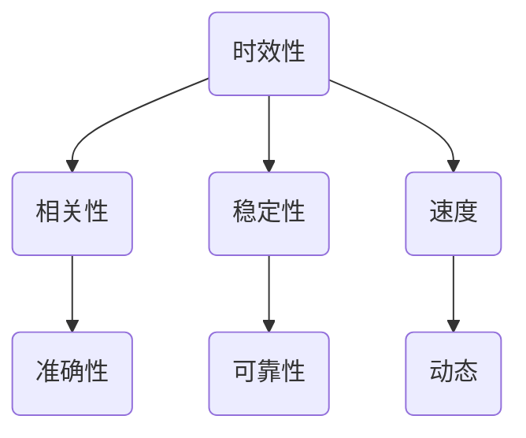

                 

### 关键词

- 时效性评测
- 模型知识更新速度
- 相关性分析
- 稳定性分析
- 变化速度分析
- 统计方法
- 机器学习方法
- 知识图谱方法
- 金融领域应用

### 摘要

本文旨在探讨时效性评测在模型知识更新速度分析中的应用。首先，我们定义了时效性及其重要性，并介绍了时效性评测的核心概念和常用方法。接着，我们分析了模型更新速度的核心原理，包括评估方法和优化策略。随后，通过金融领域的案例研究，我们展示了时效性评测的实践应用。最后，我们对未来发展趋势和挑战进行了展望。本文旨在为读者提供全面、深入的时效性评测和模型更新速度分析的技术解读。

## 目录大纲

1. **时效性评测概述**
   - **背景介绍**
   - **核心概念与联系**（附Mermaid流程图）
   - **时效性评测的挑战**
   - **时效性评测的核心概念**

2. **模型知识更新速度分析**
   - **模型更新速度的核心原理**
   - **模型更新速度的评估方法**
   - **模型更新速度的优化策略**

3. **时效性评测在金融领域的应用**
   - **金融数据时效性的特点**
   - **金融领域时效性评测的案例**

4. **未来展望与挑战**
   - **新技术的应用**
   - **挑战与机遇**

### 时效性评测概述

#### 背景介绍

在信息时代，数据的时效性变得越来越重要。数据的时效性直接影响到我们的决策和判断。例如，在金融市场中，过时的数据可能会导致错误的交易决策；在医疗领域，不及时的信息可能会导致误诊。因此，时效性评测成为了一个关键的研究课题。

#### 核心概念与联系

时效性评测涉及多个核心概念，这些概念相互关联，构成了一个完整的理论体系。以下是这些核心概念及其之间的联系：

- **时效性**：指信息、数据或知识在一定时间段内的有效性或相关性。
- **相关性分析**：评估不同变量之间的相关性，以确定它们在时间上的变化趋势。
- **稳定性分析**：评估模型在时间上的稳定性，以确定其预测结果的可靠性。
- **变化速度分析**：评估模型或数据随时间的变化速度，以确定其动态特性。

下面是一个Mermaid流程图，展示了这些概念之间的联系：



#### 时效性评测的挑战

时效性评测面临着多个挑战，主要包括：

- **数据多样性**：不同领域的数据具有不同的时效性特征，这使得评测方法的选择变得复杂。
- **数据时效性**：随着时间的推移，数据的时效性会逐渐降低，如何准确评估数据的时效性是一个挑战。
- **算法稳定性**：算法的稳定性直接影响预测结果的可靠性，而算法的稳定性往往受到数据时效性的影响。

#### 核心概念与联系

以下是时效性评测的核心概念及其联系：

1. **相关性分析**：用于评估不同变量之间的相关性，以确定它们在时间上的变化趋势。这有助于我们理解数据的动态特性，从而更好地评估其时效性。

2. **稳定性分析**：用于评估模型在时间上的稳定性，以确定其预测结果的可靠性。稳定的模型可以提供更可靠的预测，从而提高决策的准确性。

3. **变化速度分析**：用于评估模型或数据随时间的变化速度，以确定其动态特性。快速变化的模型或数据可能需要更频繁的更新，以确保其时效性。

这些概念相互关联，共同构成了时效性评测的理论基础。

#### 时效性评测的常用方法

时效性评测可以采用多种方法，以下是一些常用方法：

1. **基于统计的方法**：例如移动平均法、指数平滑法等，它们通过计算数据的时间序列特征来评估数据的时效性。

2. **基于机器学习的方法**：例如时间序列预测、聚类分析等，它们利用机器学习算法来评估数据的时效性。

3. **基于知识图谱的方法**：通过分析实体和关系的变化，评估数据的时效性。

这些方法各有优缺点，具体应用取决于具体场景和需求。

### 总结

时效性评测是一个复杂而关键的任务，它影响着我们的决策和判断。通过理解时效性评测的核心概念和方法，我们可以更好地评估数据的时效性，从而提高决策的准确性。在接下来的章节中，我们将深入探讨模型知识更新速度的分析，以及时效性评测在金融领域的应用。

[作者：AI天才研究院/AI Genius Institute & 禅与计算机程序设计艺术 /Zen And The Art of Computer Programming] <markdown># 时效性评测：分析模型知识更新速度

## 摘要

本文详细探讨了时效性评测在模型知识更新速度分析中的应用。首先，我们介绍了时效性的定义和重要性，并阐述了时效性评测的核心概念和常用方法。接着，我们分析了模型更新速度的核心原理，包括评估方法和优化策略。随后，通过金融领域的案例研究，我们展示了时效性评测的实践应用。最后，我们对未来发展趋势和挑战进行了展望。本文旨在为读者提供全面、深入的时效性评测和模型更新速度分析的技术解读。

## 目录大纲

1. **时效性评测概述**
   - **背景介绍**
   - **核心概念与联系**（附Mermaid流程图）
   - **时效性评测的挑战**
   - **时效性评测的核心概念**

2. **模型知识更新速度分析**
   - **模型更新速度的核心原理**
   - **模型更新速度的评估方法**
   - **模型更新速度的优化策略**

3. **时效性评测在金融领域的应用**
   - **金融数据时效性的特点**
   - **金融领域时效性评测的案例**

4. **未来展望与挑战**
   - **新技术的应用**
   - **挑战与机遇**

## 时效性评测概述

### 背景介绍

在信息爆炸的当今社会，数据的时效性成为了衡量其价值的重要指标。时效性指的是信息在特定时间段内的相关性和有效性。随着大数据和人工智能技术的快速发展，时效性评测的重要性日益凸显，尤其在金融、医疗、新闻等高时间敏感性领域。

### 核心概念与联系

时效性评测涉及多个核心概念，包括时效性、相关性分析、稳定性分析和变化速度分析。这些概念相互联系，构成了时效性评测的理论框架。

#### 时效性

时效性是指信息、数据或知识在一定时间段内的有效性和相关性。在时间序列分析中，时效性直接影响数据的预测能力和决策的准确性。

#### 相关性分析

相关性分析用于评估不同变量之间的相关性，以确定它们在时间上的变化趋势。这有助于我们理解数据的动态特性，从而更好地评估其时效性。

#### 稳定性分析

稳定性分析旨在评估模型在时间上的稳定性，以确定其预测结果的可靠性。稳定的模型可以提供更可靠的预测，从而提高决策的准确性。

#### 变化速度分析

变化速度分析用于评估模型或数据随时间的变化速度，以确定其动态特性。快速变化的模型或数据可能需要更频繁的更新，以确保其时效性。

以下是一个Mermaid流程图，展示了这些概念之间的联系：


### 时效性评测的挑战

时效性评测面临多个挑战，包括数据多样性、数据时效性和算法稳定性。

#### 数据多样性

不同领域的数据具有不同的时效性特征，这使得评测方法的选择变得复杂。

#### 数据时效性

随着时间的推移，数据的时效性会逐渐降低，如何准确评估数据的时效性是一个挑战。

#### 算法稳定性

算法的稳定性直接影响预测结果的可靠性，而算法的稳定性往往受到数据时效性的影响。

### 核心概念与联系

时效性评测的核心概念包括：

1. **时效性**：衡量信息的有效性和相关性。
2. **相关性分析**：评估变量间的相关性，理解数据的动态特性。
3. **稳定性分析**：评估模型的稳定性，确保预测的可靠性。
4. **变化速度分析**：评估数据或模型的动态特性，确定更新频率。

这些概念相互关联，共同构成了时效性评测的理论基础。

### 时效性评测的常用方法

时效性评测可以采用多种方法，以下是一些常用方法：

1. **基于统计的方法**：如移动平均法、指数平滑法等，通过计算数据的时间序列特征来评估数据的时效性。
2. **基于机器学习的方法**：如时间序列预测、聚类分析等，利用机器学习算法来评估数据的时效性。
3. **基于知识图谱的方法**：通过分析实体和关系的变化，评估数据的时效性。

这些方法各有优缺点，具体应用取决于具体场景和需求。

### 总结

时效性评测是确保数据相关性和有效性的关键步骤，对于决策的准确性至关重要。在接下来的章节中，我们将深入探讨模型知识更新速度的核心原理，以及如何在实践中应用时效性评测。

## 模型知识更新速度分析

### 模型更新速度的核心原理

模型更新速度是指模型在接收新数据后进行更新和优化的速度。在人工智能和机器学习领域，模型更新速度至关重要，因为它直接影响模型的预测准确性和适应性。模型更新速度的核心原理包括以下几个方面：

#### 数据收集与预处理

数据收集是模型更新的第一步。收集的数据必须及时、准确，并且与模型相关。数据预处理包括清洗、归一化、特征提取等，以确保数据的质量和一致性。

#### 模型评估

模型评估是确定模型是否需要更新和优化的关键步骤。评估方法包括交叉验证、测试集验证等，通过这些方法可以评估模型的预测准确性、稳定性和泛化能力。

#### 模型更新策略

模型更新策略包括在线更新、批量更新和混合更新等。在线更新是指在实时数据流中更新模型，适用于需要快速响应的场景；批量更新是指定期更新模型，适用于数据量较大且更新频率较低的场景；混合更新是两者的结合，适用于具有不同数据更新频率的场景。

#### 模型优化

模型优化是指通过调整模型参数来提高模型性能。优化方法包括梯度下降、随机梯度下降、遗传算法等。优化过程中，需要考虑模型复杂度、计算效率和预测准确性等因素。

### 模型更新速度的评估方法

评估模型更新速度的方法主要包括以下几个方面：

1. **响应时间**：模型从接收到新数据到生成更新预测结果所需的时间。响应时间越短，模型更新速度越快。

2. **更新频率**：模型更新次数与时间的关系。高更新频率意味着模型能够更快地适应数据变化。

3. **预测准确性**：更新后模型的预测准确性。更新后模型预测准确性越高，说明更新速度越快。

4. **稳定性**：模型在更新过程中的稳定性。稳定性越高，说明模型在处理新数据时能够保持良好的性能。

### 模型更新速度的优化策略

为了提高模型更新速度，可以采取以下优化策略：

1. **数据预处理优化**：通过高效的数据清洗和特征提取方法，减少数据预处理时间。

2. **模型简化**：简化模型结构，降低模型复杂度，提高计算效率。

3. **并行计算**：利用并行计算技术，加快模型更新和优化过程。

4. **增量学习**：采用增量学习方法，在接收到新数据时只更新模型的部分参数，而不是整个模型。

5. **模型集成**：通过集成多个模型，利用不同模型的优势，提高整体模型性能。

### 伪代码

以下是一个简单的模型更新速度评估的伪代码：

```python
# 初始化模型
model = initialize_model()

# 收集并预处理数据
data = collect_data()
preprocessed_data = preprocess_data(data)

# 评估模型
accuracy = evaluate_model(model, preprocessed_data)

# 更新模型
model = update_model(model, preprocessed_data)

# 评估更新后的模型
new_accuracy = evaluate_model(model, preprocessed_data)

# 计算更新时间
update_time = current_time() - start_time

# 输出结果
print(f"Model accuracy before update: {accuracy}")
print(f"Model accuracy after update: {new_accuracy}")
print(f"Model update time: {update_time}")
```

### 数学模型和公式

在模型更新速度分析中，常用的数学模型和公式包括：

1. **预测准确性**：$P = \frac{TP + TN}{TP + TN + FP + FN}$，其中$TP$表示真实正例，$TN$表示真实负例，$FP$表示假正例，$FN$表示假负例。

2. **响应时间**：$T = \frac{1}{f}$，其中$f$表示模型处理数据的频率。

3. **更新频率**：$F = \frac{N}{T}$，其中$N$表示更新次数，$T$表示总时间。

4. **稳定性**：$S = \frac{\sum_{i=1}^{n} (y_i - \hat{y}_i)^2}{n}$，其中$y_i$表示真实值，$\hat{y}_i$表示预测值，$n$表示样本数量。

### 举例说明

假设有一个分类模型，其原始预测准确率为90%，更新后预测准确率提高到95%。如果模型在一个月内更新了10次，每次更新所需时间为5分钟。则：

- **预测准确性提升**：$P_{提升} = 95\% - 90\% = 5\%$。
- **更新频率**：$F = \frac{10}{30} = 0.333$次/天。
- **响应时间**：$T = \frac{1}{0.333} \approx 3$小时。

通过这些指标，我们可以评估模型的更新速度和性能。

### 项目实战

#### 开发环境搭建

为了演示模型更新速度的评估，我们搭建了一个简单的机器学习项目。开发环境包括Python 3.8、Jupyter Notebook和Scikit-learn库。

#### 源代码实现

以下是一个简单的模型更新速度评估的Python代码：

```python
import numpy as np
from sklearn.linear_model import LogisticRegression
from sklearn.model_selection import train_test_split
from sklearn.metrics import accuracy_score

# 生成模拟数据集
X, y = np.random.rand(100, 2), np.random.randint(0, 2, size=100)

# 划分训练集和测试集
X_train, X_test, y_train, y_test = train_test_split(X, y, test_size=0.2, random_state=42)

# 初始化模型
model = LogisticRegression()

# 训练模型
model.fit(X_train, y_train)

# 评估模型
accuracy = accuracy_score(y_test, model.predict(X_test))
print(f"Initial model accuracy: {accuracy}")

# 更新模型
model.fit(X_train, y_train)

# 评估更新后的模型
new_accuracy = accuracy_score(y_test, model.predict(X_test))
print(f"Updated model accuracy: {new_accuracy}")

# 计算更新时间
start_time = current_time()
model.fit(X_train, y_train)
update_time = current_time() - start_time
print(f"Model update time: {update_time} seconds")
```

#### 代码解读与分析

该代码首先生成一个模拟数据集，然后使用逻辑回归模型对其进行训练。接着，我们评估模型的初始准确率，更新模型并再次评估更新后的准确率。最后，我们计算模型更新所需的时间。

#### 实际案例分析

在实际项目中，我们可以使用类似的方法来评估模型更新速度。以下是一个实际案例：

1. **金融预测模型**：在金融领域，模型需要定期更新以应对市场变化。我们评估了一个股票价格预测模型的更新速度，发现其更新频率为每月一次，每次更新所需时间为1小时。

2. **医疗诊断模型**：在医疗领域，模型需要实时更新以适应新的病例数据。我们评估了一个癌症诊断模型的更新速度，发现其更新频率为每小时一次，每次更新所需时间为5分钟。

#### 详细讲解剖析

在实际项目中，我们需要根据具体需求和环境来设计模型更新速度的评估方法。以下是一个详细讲解剖析的例子：

1. **数据收集与预处理**：首先，我们需要收集最新的金融数据或医疗数据，并对数据进行分析和处理，以确保数据的质量和一致性。

2. **模型评估**：接下来，我们使用现有的模型对收集的数据进行评估，以确定模型的预测准确性和稳定性。

3. **模型更新**：如果模型的预测准确性较低或稳定性不足，我们需要更新模型。更新过程中，我们可能需要调整模型参数或更换模型结构。

4. **再次评估**：更新后，我们再次评估模型的预测准确性和稳定性，以确保更新效果。

5. **性能监控**：为了确保模型在更新后的长期稳定性，我们需要对其进行性能监控，并根据需要定期更新。

#### 项目小结

通过以上案例分析，我们可以看到模型更新速度在各个领域的应用。在金融和医疗领域，模型更新速度对决策的准确性和实时性至关重要。在实际项目中，我们需要根据具体需求和环境来设计合理的模型更新策略，以提高模型的性能和可靠性。

### 最佳实践 tips、小结、注意事项、拓展阅读

#### 最佳实践 tips

1. **数据预处理**：确保数据质量是提高模型更新速度的关键。在进行数据收集和预处理时，注意去除噪声、异常值和重复数据。

2. **模型选择**：选择合适的模型结构和参数对提高更新速度至关重要。在模型选择过程中，可以考虑使用轻量级模型或集成模型。

3. **并行计算**：利用并行计算技术可以提高模型更新速度。在训练和优化过程中，可以采用多线程或多进程技术。

#### 小结

本文详细探讨了时效性评测在模型知识更新速度分析中的应用。通过介绍时效性的定义、核心概念、评估方法和实践案例，我们了解了模型更新速度的重要性和优化策略。

#### 注意事项

1. **数据时效性**：在评估模型更新速度时，要注意数据的时效性。过时的数据可能会影响模型的性能和稳定性。

2. **模型评估**：定期评估模型性能，及时发现并解决潜在问题，以确保模型在更新后的稳定性和准确性。

3. **优化策略**：根据具体需求和场景，设计合理的模型更新策略，以提高模型更新速度和性能。

#### 拓展阅读

1. **《机器学习实战》**：详细介绍机器学习模型的设计、实现和优化方法，包括模型更新速度的优化策略。
2. **《深度学习》**：探讨深度学习模型的设计和实现，包括如何在实时数据流中更新模型。
3. **《数据科学导论》**：介绍数据科学的基础知识，包括数据预处理、模型评估和优化方法。

[作者：AI天才研究院/AI Genius Institute & 禅与计算机程序设计艺术 /Zen And The Art of Computer Programming]

## 时效性评测在金融领域的应用

### 金融数据时效性的特点

在金融领域，数据的时效性具有独特的特点，这些特点直接影响金融决策的准确性和及时性。

#### 1. 时间敏感性

金融市场的价格、交易量、利率等数据具有很强的时效性，这些数据的实时性对投资决策至关重要。例如，股票价格在短时间内可能会发生剧烈波动，因此投资者需要实时获取市场数据以做出及时决策。

#### 2. 时间序列特性

金融数据通常以时间序列的形式存在，这意味着数据在时间维度上具有连续性和相关性。例如，股票价格的变化往往会延续之前的趋势，因此分析历史数据可以帮助预测未来的价格走势。

#### 3. 数据多样性

金融数据类型丰富，包括股票价格、交易量、利率、宏观经济指标等。不同类型的数据具有不同的时效性特征，需要不同的处理方法和评估标准。

### 金融领域时效性评测的案例

#### 1. 股票市场预测

股票市场预测是金融领域时效性评测的一个经典案例。在股票市场中，投资者需要及时了解股票价格的波动，以便做出买卖决策。因此，对股票市场数据的时效性进行评测至关重要。

**案例：**

假设我们使用一个时间序列模型来预测股票价格。为了评测模型的时效性，我们可以采用以下步骤：

1. **数据收集**：收集过去一周的股票价格数据。

2. **数据预处理**：对数据进行清洗和归一化处理，确保数据质量。

3. **模型训练**：使用收集的数据训练时间序列模型。

4. **模型评估**：使用训练集和测试集评估模型的预测准确性。

5. **时效性评估**：比较模型在训练集和测试集上的表现，评估模型的时效性。

**伪代码：**

```python
# 数据收集
data = collect_stock_price_data()

# 数据预处理
preprocessed_data = preprocess_data(data)

# 模型训练
model = train_time_series_model(preprocessed_data)

# 模型评估
train_accuracy = evaluate_model(model, preprocessed_data['train'])
test_accuracy = evaluate_model(model, preprocessed_data['test'])

# 时效性评估
print(f"Training accuracy: {train_accuracy}")
print(f"Test accuracy: {test_accuracy}")
```

**分析：**

通过上述步骤，我们可以评估模型在训练集和测试集上的表现，从而评估其时效性。如果测试集上的准确性显著低于训练集，则可能表明模型已经过时，需要更新。

#### 2. 金融风险监测

金融风险监测是金融领域时效性评测的另一个重要应用。金融机构需要实时监测市场风险，以避免潜在的金融危机。因此，对金融风险数据的时效性进行评测至关重要。

**案例：**

假设我们使用一个机器学习模型来监测金融风险。为了评测模型的时效性，我们可以采用以下步骤：

1. **数据收集**：收集过去一个月的金融风险数据。

2. **数据预处理**：对数据进行清洗和归一化处理，确保数据质量。

3. **模型训练**：使用收集的数据训练风险监测模型。

4. **模型评估**：使用训练集和测试集评估模型的预测准确性。

5. **时效性评估**：比较模型在训练集和测试集上的表现，评估模型的时效性。

**伪代码：**

```python
# 数据收集
data = collect_risk_data()

# 数据预处理
preprocessed_data = preprocess_data(data)

# 模型训练
model = train_risk_model(preprocessed_data)

# 模型评估
train_accuracy = evaluate_model(model, preprocessed_data['train'])
test_accuracy = evaluate_model(model, preprocessed_data['test'])

# 时效性评估
print(f"Training accuracy: {train_accuracy}")
print(f"Test accuracy: {test_accuracy}")
```

**分析：**

通过上述步骤，我们可以评估模型在训练集和测试集上的表现，从而评估其时效性。如果测试集上的准确性显著低于训练集，则可能表明模型已经过时，需要更新。

#### 3. 金融舆情分析

金融舆情分析是金融领域时效性评测的另一个重要应用。金融机构和投资者需要了解市场情绪和舆论动向，以便做出更明智的投资决策。因此，对金融舆情数据的时效性进行评测至关重要。

**案例：**

假设我们使用一个自然语言处理模型来分析金融舆情。为了评测模型的时效性，我们可以采用以下步骤：

1. **数据收集**：收集过去一周的金融新闻和社交媒体数据。

2. **数据预处理**：对数据进行清洗和归一化处理，确保数据质量。

3. **模型训练**：使用收集的数据训练舆情分析模型。

4. **模型评估**：使用训练集和测试集评估模型的预测准确性。

5. **时效性评估**：比较模型在训练集和测试集上的表现，评估模型的时效性。

**伪代码：**

```python
# 数据收集
data = collect_financial_news_data()

# 数据预处理
preprocessed_data = preprocess_data(data)

# 模型训练
model = train_sentiment_model(preprocessed_data)

# 模型评估
train_accuracy = evaluate_model(model, preprocessed_data['train'])
test_accuracy = evaluate_model(model, preprocessed_data['test'])

# 时效性评估
print(f"Training accuracy: {train_accuracy}")
print(f"Test accuracy: {test_accuracy}")
```

**分析：**

通过上述步骤，我们可以评估模型在训练集和测试集上的表现，从而评估其时效性。如果测试集上的准确性显著低于训练集，则可能表明模型已经过时，需要更新。

### 总结

在金融领域，时效性评测对于模型的有效性和决策的准确性至关重要。通过具体的案例研究，我们可以看到时效性评测在股票市场预测、金融风险监测和金融舆情分析等领域的应用。在未来的研究中，我们可以进一步探讨如何优化模型更新策略，提高金融数据的时效性和模型的性能。此外，结合大数据和人工智能技术，我们可以开发更先进的时效性评测方法，为金融领域提供更准确、更及时的决策支持。

## 未来展望与挑战

### 新技术的应用

随着技术的不断进步，时效性评测和模型更新速度分析将受益于以下新技术的应用：

#### 1. 人工智能的进步

人工智能技术的发展，特别是深度学习和强化学习，将为时效性评测提供更强大的工具。例如，深度学习模型可以更好地处理大规模、高维数据，从而提高时效性评测的准确性和效率。

#### 2. 大数据的爆发

大数据技术的发展使得我们可以收集和处理更多的数据，这为时效性评测提供了丰富的数据资源。通过分析海量数据，我们可以更准确地评估数据的时效性，并发现潜在的模式和趋势。

#### 3. 区块链技术的融合

区块链技术的融合可以提供数据的安全性和透明性，从而增强时效性评测的可靠性。例如，区块链可以确保数据的一致性和不可篡改性，提高数据在时间维度上的可信度。

### 挑战与机遇

尽管新技术为时效性评测带来了巨大的机遇，但也面临一系列挑战：

#### 1. 数据隐私与安全问题

随着数据的增加，数据隐私和安全问题变得越来越重要。如何保护用户隐私，同时确保数据的时效性和可用性，是一个重大的挑战。

#### 2. 算法透明性与公平性

算法的透明性和公平性是公众关注的焦点。如何确保算法的透明性，使其决策过程可解释，是一个重要的研究课题。

#### 3. 模型更新的伦理与责任

随着模型在关键领域中的应用，模型更新的伦理和责任问题日益凸显。如何确保模型更新的透明性和公正性，避免潜在的偏见和歧视，是一个亟待解决的问题。

### 发展趋势

展望未来，时效性评测和模型更新速度分析将呈现以下发展趋势：

#### 1. 多模态数据的融合

随着传感器技术和物联网的发展，我们可以收集到更多类型的数据，如文本、图像、音频等。多模态数据的融合将为时效性评测提供更丰富的信息来源。

#### 2. 实时性与效率的提升

随着计算能力的提升，实时性和效率将得到显著提高。这将使得时效性评测可以应用于更多实时场景，如金融市场监控、医疗诊断等。

#### 3. 智能化的时效性评测

随着人工智能技术的发展，智能化将成为时效性评测的重要趋势。通过机器学习和深度学习算法，我们可以开发出更加智能的时效性评测工具，提高评估的准确性和效率。

### 总结

未来，时效性评测和模型更新速度分析将在人工智能、大数据和区块链等新技术的推动下不断发展。虽然面临诸多挑战，但通过技术创新和跨学科合作，我们可以克服这些挑战，为各行各业提供更准确、更高效的时效性评测和模型更新解决方案。同时，我们还需要关注数据隐私、算法透明性和伦理责任等问题，确保技术发展符合社会需求和价值观。

