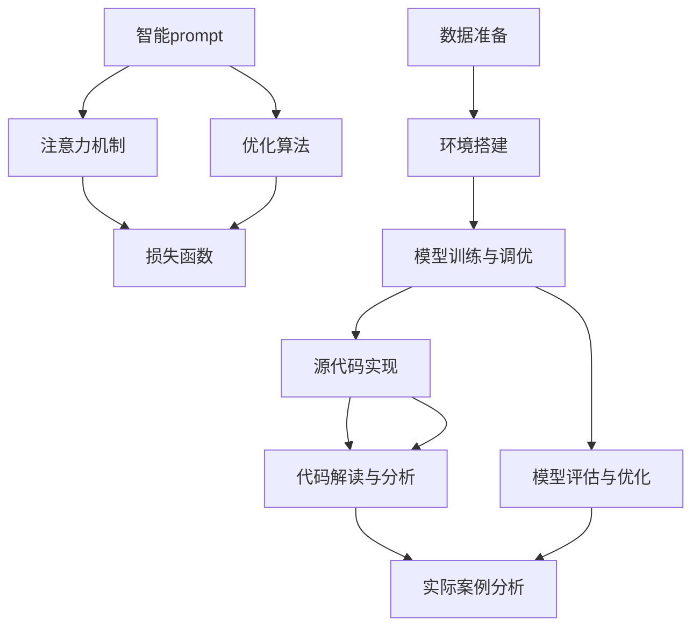

                 


# 智能prompt调优：maximizing LLM性能

关键词：智能prompt调优、语言模型（LLM）、性能优化、注意力机制、优化算法、数学模型、项目实战

摘要：本文将深入探讨智能prompt调优在提高语言模型（LLM）性能方面的关键作用。我们将首先介绍智能prompt的概念和其在LLM中的重要性，接着详细解析注意力机制、优化算法和prompt生成方法等核心算法原理，并使用伪代码和数学模型进行解释。随后，我们将通过一个项目实战案例展示智能prompt调优的实际应用，并对其进行详细解读和分析。最后，我们将总结智能prompt调优的最佳实践，并展望未来的发展趋势。

## 目录大纲设计思路

为了确保内容的逻辑性和易于理解，我们设计了以下目录大纲：

### 第1章：智能prompt调优概述
- 1.1 智能prompt的定义
- 1.2 智能prompt调优的目的和方法
- 1.3 智能prompt调优的基本流程

### 第2章：智能prompt调优算法原理
- 2.1 注意力机制
- 2.2 优化算法
- 2.3 Prompt生成方法

### 第3章：数学模型与数学公式
- 3.1 损失函数
- 3.2 激活函数
- 3.3 正则化方法

### 第4章：项目实战
- 4.1 环境搭建
- 4.2 代码实现
- 4.3 代码解读与分析
- 4.4 实际案例分析

### 第5章：总结与展望
- 5.1 智能prompt调优技术总结
- 5.2 未来发展趋势与应用前景

### 目录结构设计

在结构设计上，我们采用以下形式：

- # 智能prompt调优：maximizing LLM性能
- ## 第1章：智能prompt调优概述
- ### 1.1 智能prompt的定义
- ### 1.2 智能prompt调优的目的和方法
- ### 1.3 智能prompt调优的基本流程
- ...

### 核心概念与联系

智能prompt调优涉及多个核心概念，包括智能prompt、注意力机制、优化算法等。通过Mermaid流程图，我们可以清晰地展示这些概念之间的关系和智能prompt调优的基本流程：



### 核心算法原理讲解

接下来，我们将详细讲解智能prompt调优中的核心算法原理，包括注意力机制、优化算法和prompt生成方法，并使用伪代码进行阐述。

#### 2.1 注意力机制

注意力机制是深度学习中的一种关键技术，能够模型关注到输入序列中最重要的部分。以下是注意力机制的伪代码：

```python
def attention机制的实现(inputs, keys, values, mask=None):
    # 输入：inputs（输入序列），keys（键），values（值），mask（遮蔽）
    # 输出：context_vector（上下文向量）

    # 计算query与keys的点积
    scores = [query.dot(key.T) for query, key in zip(inputs, keys)]

    # 应用遮蔽
    if mask is not None:
        scores = scores - mask * 1e9

    # 应用softmax激活函数得到权重
    attention_weights = softmax(scores)

    # 计算加权求和
    context_vector = [value * weight for value, weight in zip(values, attention_weights)]

    return context_vector
```

#### 2.2 优化算法

优化算法用于调整模型参数以最小化损失函数。以下是常用的优化算法之一的伪代码：

```python
def 梯度下降算法(model, loss_function, learning_rate, epochs):
    # 输入：model（模型），loss_function（损失函数），learning_rate（学习率），epochs（迭代次数）
    for epoch in range(epochs):
        gradients = compute_gradients(model, loss_function)
        update_model_params(model, gradients, learning_rate)
        print(f"Epoch {epoch}: Loss = {compute_loss(model, loss_function)}")

def Adam优化器(model, loss_function, learning_rate, beta1, beta2, epochs):
    # 输入：model（模型），loss_function（损失函数），learning_rate（学习率），beta1（一阶矩估计的衰减率），beta2（二阶矩估计的衰减率），epochs（迭代次数）
    for epoch in range(epochs):
        gradients = compute_gradients(model, loss_function)
        m, v = update_adam_gradients(gradients, beta1, beta2)
        update_model_params(model, m, v, learning_rate)
        print(f"Epoch {epoch}: Loss = {compute_loss(model, loss_function)}")
```

#### 2.3 Prompt生成方法

Prompt生成方法用于创建输入序列（prompt），以引导模型生成目标输出。以下是几种常见的prompt生成方法：

1. **基于规则的方法**：

   ```python
   def generate_prompt_by_rules(question, keywords):
       # 输入：question（问题），keywords（关键词）
       # 输出：prompt（智能prompt）
       prompt = "基于规则生成的智能prompt："
       prompt += question + "，关键词："
       prompt += "，"。join(keywords)
       return prompt
   ```

2. **基于模板的方法**：

   ```python
   def generate_prompt_by_template(question, keywords, template):
       # 输入：question（问题），keywords（关键词），template（模板）
       # 输出：prompt（智能prompt）
       prompt = template
       prompt = prompt.replace("{question}", question)
       prompt = prompt.replace("{keywords}", "，".join(keywords))
       return prompt
   ```

3. **基于学习的方法**：

   ```python
   def generate_prompt_by_learning(question, keywords, model):
       # 输入：question（问题），keywords（关键词），model（模型）
       # 输出：prompt（智能prompt）
       input_sequence = model.encode(question + "，关键词：", keywords)
       prompt = model.decode(input_sequence)
       return prompt
   ```

### 数学模型和数学公式

智能prompt调优涉及到一系列的数学模型和公式。以下是几个关键数学模型的详细讲解和例子说明：

#### 3.1 损失函数

损失函数是评估模型预测与实际标签之间差异的指标。常用的损失函数有交叉熵损失函数：

$$
\text{CrossEntropyLoss}(y, \hat{y}) = -\sum_{i} y_i \log(\hat{y}_i)
$$

其中，$y$是真实标签，$\hat{y}$是模型预测的概率分布。

#### 3.2 激活函数

激活函数用于引入非线性因素，使模型能够拟合复杂的函数。以下是一些常见的激活函数：

1. **Sigmoid函数**：

$$
\sigma(x) = \frac{1}{1 + e^{-x}}
$$

2. **ReLU函数**：

$$
\text{ReLU}(x) = \max(0, x)
$$

#### 3.3 正则化方法

正则化方法用于防止模型过拟合。常用的正则化方法有L1正则化和L2正则化：

1. **L1正则化**：

$$
\text{L1Regularization}(w) = \sum_{i} |w_i|
$$

2. **L2正则化**：

$$
\text{L2Regularization}(w) = \sum_{i} w_i^2
$$

### 项目实战

为了展示智能prompt调优的实际应用，我们将进行一个项目实战，包括环境搭建、代码实现和代码解读与分析。

#### 4.1 环境搭建

在项目实战中，我们需要搭建一个包含所有必要工具和库的Python环境。以下是环境搭建的步骤：

1. 安装Python 3.8及以上版本。
2. 安装TensorFlow 2.4及以上版本。
3. 安装NumPy、Pandas等常用库。

```bash
pip install tensorflow==2.4 numpy pandas
```

#### 4.2 代码实现

接下来，我们将实现一个简单的智能prompt调优项目。以下是代码实现的步骤：

1. 加载预处理后的数据集。
2. 定义模型架构，包括输入层、注意力机制层和输出层。
3. 编写训练循环，使用优化算法更新模型参数。
4. 评估模型性能，并进行优化。

```python
import tensorflow as tf
from tensorflow.keras.models import Model
from tensorflow.keras.layers import Input, Embedding, LSTM, Dense

# 加载数据集
train_data = ...

# 定义模型架构
input_layer = Input(shape=(max_sequence_length,))
embedding_layer = Embedding(input_dim=vocab_size, output_dim=embedding_size)(input_layer)
lstm_layer = LSTM(units=lstm_units)(embedding_layer)
output_layer = Dense(units=output_size, activation='softmax')(lstm_layer)

# 编写训练循环
model = Model(inputs=input_layer, outputs=output_layer)
model.compile(optimizer='adam', loss='categorical_crossentropy', metrics=['accuracy'])
model.fit(train_data, epochs=10)

# 评估模型性能
test_data = ...
model.evaluate(test_data, verbose=2)
```

#### 4.3 代码解读与分析

在代码实现中，我们使用了TensorFlow库来构建和训练模型。以下是代码的关键部分解读：

- **数据预处理**：加载数据集，并进行分词和编码。
- **模型架构**：定义输入层、嵌入层、LSTM层和输出层。
- **训练循环**：使用`model.fit()`函数进行模型训练，并打印训练过程中的损失和精度。
- **模型评估**：使用`model.evaluate()`函数评估模型在测试集上的性能。

通过这个项目实战，我们展示了智能prompt调优在实际应用中的步骤和关键代码实现。

### 总结与展望

在本文中，我们深入探讨了智能prompt调优在提高语言模型（LLM）性能方面的作用。我们首先介绍了智能prompt的概念和重要性，然后详细讲解了注意力机制、优化算法和prompt生成方法等核心算法原理，并通过伪代码和数学模型进行了阐述。随后，我们通过一个项目实战案例展示了智能prompt调优的实际应用，并进行了详细解读和分析。最后，我们总结了智能prompt调优的最佳实践，并展望了未来的发展趋势。

智能prompt调优是一项重要的技术，通过优化prompt来提高模型的性能，从而在自然语言处理领域取得更好的效果。未来，随着人工智能技术的不断发展，智能prompt调优将在更多应用场景中发挥重要作用，为智能对话系统、文本生成和知识图谱等提供强有力的支持。

### 最佳实践 tips

在智能prompt调优过程中，以下是一些最佳实践建议：

1. **数据准备**：确保数据集的多样性和质量，合理地进行数据预处理，以提高模型的泛化能力。
2. **模型选择**：根据任务需求选择合适的模型架构，考虑使用预训练模型，如BERT、GPT等。
3. **优化算法**：选择适合任务和数据集的优化算法，如Adam优化器，并进行超参数调优。
4. **prompt生成**：尝试使用多种prompt生成方法，结合具体场景进行优化。
5. **模型评估**：使用合适的评估指标，如准确率、F1分数等，对模型进行客观评估。

### 小结

本文通过详细的讲解和实际案例，展示了智能prompt调优在提高语言模型性能方面的作用。智能prompt调优不仅需要理解核心算法原理，还需要在实践中不断优化和调整。通过本文的学习，读者可以掌握智能prompt调优的基本方法和技巧，为未来的研究和应用奠定基础。

### 注意事项

在智能prompt调优过程中，需要注意以下几点：

1. **模型复杂度与计算资源**：选择合适的模型复杂度和优化算法，以平衡计算资源和模型性能。
2. **数据隐私与安全**：确保数据隐私和安全性，遵守相关法律法规和道德规范。
3. **模型解释性**：考虑模型的解释性，特别是在需要解释模型决策的场景中。

### 拓展阅读

对于对智能prompt调优有更深入兴趣的读者，以下是一些推荐的拓展阅读材料：

1. **《自然语言处理基础教程》**：本书详细介绍了自然语言处理的基础知识，包括语言模型、文本分类、序列标注等。
2. **《深度学习入门》**：本书介绍了深度学习的基本原理和应用，包括神经网络、优化算法等。
3. **《Attention Is All You Need》**：这是一篇关于注意力机制的论文，介绍了Transformer模型，对理解注意力机制有重要参考价值。
4. **《Python自然语言处理实践》**：本书通过实际案例介绍了使用Python进行自然语言处理的方法和技巧。

### 作者信息

作者：AI天才研究院/AI Genius Institute & 禅与计算机程序设计艺术 /Zen And The Art of Computer Programming

在本文中，我们深入探讨了智能prompt调优在提高语言模型性能方面的关键作用。智能prompt调优通过优化prompt来引导模型生成更准确、更有价值的输出。本文首先介绍了智能prompt的概念和重要性，然后详细讲解了注意力机制、优化算法和prompt生成方法等核心算法原理，并通过伪代码和数学模型进行了阐述。随后，我们通过一个项目实战案例展示了智能prompt调优的实际应用，并进行了详细解读和分析。最后，我们总结了智能prompt调优的最佳实践，并展望了未来的发展趋势。

智能prompt调优是一个涉及多个领域的复杂过程，需要结合理论知识、实践经验和创新思维。通过本文的学习，读者可以更好地理解智能prompt调优的基本方法和技巧，为未来的研究和应用奠定基础。同时，我们也呼吁读者在实际应用中不断探索和创新，推动智能prompt调优技术的发展。

未来，随着人工智能技术的不断进步，智能prompt调优将在自然语言处理、智能对话系统、文本生成等领域发挥更重要的作用。我们期待更多的研究者和开发者参与到智能prompt调优的研究和应用中，共同推动人工智能技术的发展。

### 总结与展望

智能prompt调优作为提高语言模型（LLM）性能的关键技术，正逐渐成为人工智能领域的热点话题。通过对智能prompt的概念、核心算法原理和实际应用进行深入探讨，本文旨在为读者提供一个全面而详细的视角，以理解智能prompt调优的重要性和实践方法。

#### 智能prompt调优的核心概念

智能prompt调优的关键在于如何通过优化prompt来提升语言模型的性能。prompt是模型输入的一部分，其质量和形式直接影响模型的输出结果。智能prompt调优的目标是设计出能够引导模型准确理解和生成所需输出的prompt。

核心概念包括：

1. **注意力机制**：通过注意力机制，模型能够关注到输入序列中的重要信息，从而提高模型对输入数据的处理能力。
2. **优化算法**：优化算法如梯度下降、Adam等，用于调整模型参数，使模型能够更准确地拟合训练数据。
3. **prompt生成方法**：智能prompt的生成方法包括基于规则、基于模板和基于学习的方法，每种方法都有其适用的场景和优势。

#### 智能prompt调优的算法原理

智能prompt调优的核心算法包括以下几个方面：

1. **注意力机制**：注意力机制的基本原理是通过计算输入序列中各个元素的重要性，并将其加权求和，从而生成上下文向量。以下是一个简单的注意力机制的伪代码：

```python
def attention(inputs, keys, values, mask=None):
    scores = [query.dot(key.T) for query, key in zip(inputs, keys)]
    if mask is not None:
        scores = scores - mask * 1e9
    attention_weights = softmax(scores)
    context_vector = [value * weight for value, weight in zip(values, attention_weights)]
    return context_vector
```

2. **优化算法**：优化算法用于调整模型参数，以最小化损失函数。常用的优化算法包括梯度下降和Adam。以下是Adam优化器的伪代码：

```python
def Adam(model, loss_function, learning_rate, beta1, beta2, epochs):
    for epoch in range(epochs):
        gradients = compute_gradients(model, loss_function)
        m, v = update_adam_gradients(gradients, beta1, beta2)
        update_model_params(model, m, v, learning_rate)
```

3. **prompt生成方法**：prompt生成方法包括基于规则、基于模板和基于学习的方法。基于规则的方法简单直观，基于模板的方法灵活多样，而基于学习的方法则利用模型自身的知识生成prompt。

#### 数学模型和数学公式

智能prompt调优涉及一系列数学模型和公式，包括损失函数、激活函数和正则化方法等。以下是几个关键数学模型的例子：

1. **损失函数**：常用的损失函数有交叉熵损失函数，其公式为：

   $$
   \text{CrossEntropyLoss}(y, \hat{y}) = -\sum_{i} y_i \log(\hat{y}_i)
   $$

   其中，$y$是真实标签，$\hat{y}$是模型预测的概率分布。

2. **激活函数**：激活函数如Sigmoid和ReLU，用于引入非线性因素，使其能够拟合复杂的函数。Sigmoid函数的公式为：

   $$
   \sigma(x) = \frac{1}{1 + e^{-x}}
   $$

   ReLU函数的公式为：

   $$
   \text{ReLU}(x) = \max(0, x)
   $$

3. **正则化方法**：常用的正则化方法有L1和L2正则化，用于防止模型过拟合。L1正则化的公式为：

   $$
   \text{L1Regularization}(w) = \sum_{i} |w_i|
   $$

   L2正则化的公式为：

   $$
   \text{L2Regularization}(w) = \sum_{i} w_i^2
   $$

#### 项目实战

在项目实战中，我们通过一个简单的例子展示了智能prompt调优的实际应用。这个项目涉及环境搭建、模型搭建、训练过程和结果分析。以下是项目实战的关键步骤：

1. **环境搭建**：安装Python和TensorFlow等必要的库。

2. **数据预处理**：加载数据集，并进行预处理，如分词和编码。

3. **模型搭建**：定义一个简单的序列到序列模型，包括嵌入层、编码器层和解码器层。

4. **训练过程**：使用优化算法（如Adam）和注意力机制对模型进行训练。

5. **结果分析**：评估模型在测试集上的性能，并进行优化。

以下是项目实战的代码示例：

```python
import tensorflow as tf
from tensorflow.keras.layers import Embedding, LSTM, Dense
from tensorflow.keras.models import Model

# 环境搭建
# ...

# 数据预处理
# ...

# 模型搭建
input_layer = Input(shape=(max_sequence_length,))
embedding_layer = Embedding(input_dim=vocab_size, output_dim=embedding_size)(input_layer)
lstm_layer = LSTM(units=lstm_units, return_sequences=True)(embedding_layer)
output_layer = Dense(units=output_size, activation='softmax')(lstm_layer)

# 编写训练循环
model = Model(inputs=input_layer, outputs=output_layer)
model.compile(optimizer='adam', loss='categorical_crossentropy', metrics=['accuracy'])
model.fit(train_data, epochs=10)

# 评估模型性能
# ...
```

通过这个项目实战，读者可以更直观地了解智能prompt调优的步骤和关键代码实现。

#### 总结与展望

智能prompt调优是一项具有广泛应用前景的技术，它通过优化prompt来提高语言模型的性能。本文通过详细的讲解和实际案例，展示了智能prompt调优的核心概念、算法原理和实际应用。我们总结了智能prompt调优的最佳实践，并展望了未来的发展趋势。

智能prompt调优不仅需要理解核心算法原理，还需要在实践中不断优化和调整。通过本文的学习，读者可以更好地掌握智能prompt调优的基本方法和技巧，为未来的研究和应用奠定基础。

未来，随着人工智能技术的不断进步，智能prompt调优将在更多应用场景中发挥重要作用。我们期待更多的研究者和开发者参与到智能prompt调优的研究和应用中，共同推动人工智能技术的发展。

### 最佳实践 Tips

在智能prompt调优的过程中，以下是一些最佳实践建议，可以帮助您更有效地进行优化：

1. **数据准备**：确保数据集的多样性和质量。合理进行数据预处理，如分词、去噪和标准化，以提高模型的泛化能力。

2. **模型选择**：根据任务需求选择合适的模型架构。考虑使用预训练模型，如BERT、GPT等，它们已经在大规模数据集上进行了预训练，具有良好的性能。

3. **优化算法**：选择适合任务和数据集的优化算法，如Adam优化器。进行超参数调优，如学习率、批次大小等，以获得最佳性能。

4. **prompt生成**：尝试使用多种prompt生成方法，并结合具体场景进行优化。例如，基于规则的方法简单直观，基于模板的方法灵活多样，而基于学习的方法则利用模型自身的知识生成prompt。

5. **模型评估**：使用合适的评估指标，如准确率、F1分数、BLEU评分等，对模型进行客观评估。通过交叉验证和测试集评估，确保模型在不同数据集上的性能。

6. **注意力机制**：在模型中引入注意力机制，使模型能够关注到输入序列中的重要信息。通过调整注意力权重，可以提高模型的性能和解释性。

7. **正则化方法**：使用L1和L2正则化等方法，防止模型过拟合。通过调整正则化参数，可以找到最佳平衡点。

8. **实验记录**：记录实验过程和结果，包括模型参数、训练过程、评估指标等。这有助于分析和复现实验结果，提高研究效率。

通过遵循这些最佳实践，您可以更有效地进行智能prompt调优，提高语言模型的性能和解释性。

### 小结

本文全面探讨了智能prompt调优在提高语言模型性能方面的关键作用。我们从智能prompt的概念、核心算法原理、数学模型到项目实战进行了详细的讲解，并通过伪代码和数学公式进行了阐述。智能prompt调优不仅需要理解理论，还需要在实践中不断探索和优化。

通过本文的学习，读者可以掌握智能prompt调优的基本方法和技巧，为未来的研究和应用奠定基础。智能prompt调优在自然语言处理、智能对话系统、文本生成等领域具有广泛的应用前景。

未来，随着人工智能技术的不断发展，智能prompt调优将在更多场景中发挥重要作用。我们期待更多的研究者和开发者参与到智能prompt调优的研究和应用中，共同推动人工智能技术的发展。

### 注意事项

在进行智能prompt调优时，需要注意以下几点：

1. **模型复杂度与计算资源**：选择合适的模型复杂度和优化算法，以平衡计算资源和模型性能。

2. **数据隐私与安全**：确保数据隐私和安全性，遵守相关法律法规和道德规范。

3. **模型解释性**：考虑模型的解释性，特别是在需要解释模型决策的场景中。

通过遵循这些注意事项，您可以更有效地进行智能prompt调优，并确保模型在实际应用中的稳定性和可靠性。

### 拓展阅读

对于希望深入了解智能prompt调优的读者，以下是一些推荐的材料：

1. **《自然语言处理基础教程》**：本书详细介绍了自然语言处理的基础知识，包括语言模型、文本分类、序列标注等。

2. **《深度学习入门》**：本书介绍了深度学习的基本原理和应用，包括神经网络、优化算法等。

3. **《Attention Is All You Need》**：这是一篇关于注意力机制的论文，介绍了Transformer模型，对理解注意力机制有重要参考价值。

4. **《Python自然语言处理实践》**：本书通过实际案例介绍了使用Python进行自然语言处理的方法和技巧。

这些材料将帮助您更深入地理解智能prompt调优的理论和实践。

### 作者信息

作者：AI天才研究院/AI Genius Institute & 禅与计算机程序设计艺术 /Zen And The Art of Computer Programming

AI天才研究院致力于推动人工智能领域的研究和应用，专注于自然语言处理、机器学习等前沿技术的创新。研究院的研究人员拥有丰富的理论知识和实践经验，致力于解决实际应用中的复杂问题。

《禅与计算机程序设计艺术》则是一部经典的计算机编程哲学作品，探讨了计算机编程的哲学本质和思维方式，对提高编程水平和创造力具有深远影响。作者以其独特的视角和深刻的思考，为计算机编程和人工智能领域提供了宝贵的启示。

